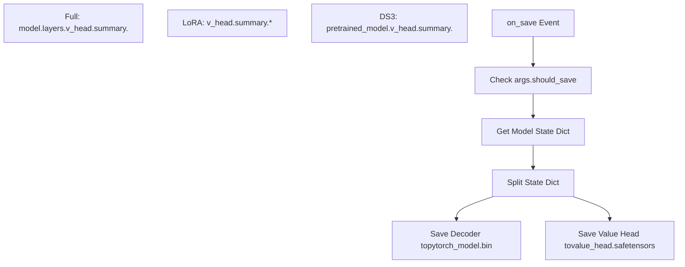
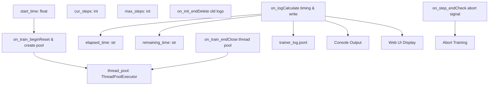
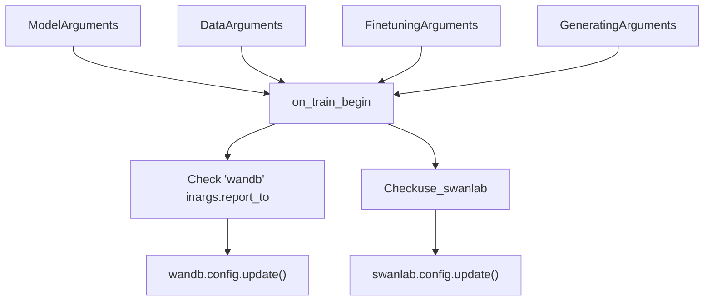
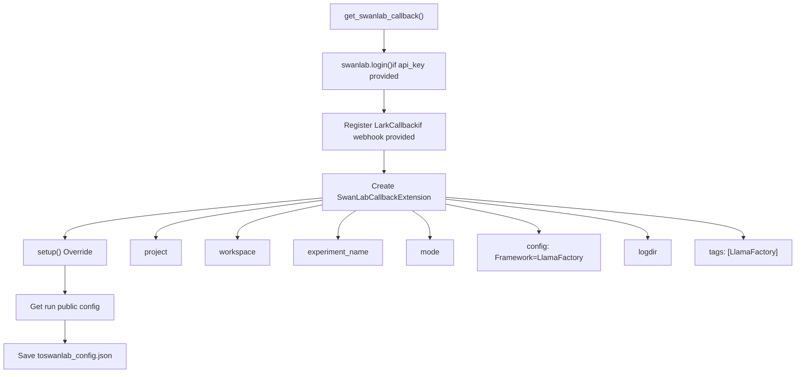

# 训练回调与监控

相关源文件

-   [src/llamafactory/extras/env.py](https://github.com/hiyouga/LlamaFactory/blob/355d5c5e/src/llamafactory/extras/env.py)
-   [src/llamafactory/extras/packages.py](https://github.com/hiyouga/LlamaFactory/blob/355d5c5e/src/llamafactory/extras/packages.py)
-   [src/llamafactory/hparams/finetuning\_args.py](https://github.com/hiyouga/LlamaFactory/blob/355d5c5e/src/llamafactory/hparams/finetuning_args.py)
-   [src/llamafactory/model/model\_utils/attention.py](https://github.com/hiyouga/LlamaFactory/blob/355d5c5e/src/llamafactory/model/model_utils/attention.py)
-   [src/llamafactory/model/model\_utils/liger\_kernel.py](https://github.com/hiyouga/LlamaFactory/blob/355d5c5e/src/llamafactory/model/model_utils/liger_kernel.py)
-   [src/llamafactory/model/model\_utils/moe.py](https://github.com/hiyouga/LlamaFactory/blob/355d5c5e/src/llamafactory/model/model_utils/moe.py)
-   [src/llamafactory/model/model\_utils/valuehead.py](https://github.com/hiyouga/LlamaFactory/blob/355d5c5e/src/llamafactory/model/model_utils/valuehead.py)
-   [src/llamafactory/train/callbacks.py](https://github.com/hiyouga/LlamaFactory/blob/355d5c5e/src/llamafactory/train/callbacks.py)
-   [src/llamafactory/train/dpo/trainer.py](https://github.com/hiyouga/LlamaFactory/blob/355d5c5e/src/llamafactory/train/dpo/trainer.py)
-   [src/llamafactory/train/kto/trainer.py](https://github.com/hiyouga/LlamaFactory/blob/355d5c5e/src/llamafactory/train/kto/trainer.py)
-   [src/llamafactory/train/ppo/trainer.py](https://github.com/hiyouga/LlamaFactory/blob/355d5c5e/src/llamafactory/train/ppo/trainer.py)
-   [src/llamafactory/train/pt/trainer.py](https://github.com/hiyouga/LlamaFactory/blob/355d5c5e/src/llamafactory/train/pt/trainer.py)
-   [src/llamafactory/train/rm/trainer.py](https://github.com/hiyouga/LlamaFactory/blob/355d5c5e/src/llamafactory/train/rm/trainer.py)
-   [src/llamafactory/train/sft/trainer.py](https://github.com/hiyouga/LlamaFactory/blob/355d5c5e/src/llamafactory/train/sft/trainer.py)
-   [src/llamafactory/train/trainer\_utils.py](https://github.com/hiyouga/LlamaFactory/blob/355d5c5e/src/llamafactory/train/trainer_utils.py)

本页面解释了训练期间使用的回调系统，包括用于日志记录、检查点保存以及与外部监控服务（如 Weights & Biases (WandB) 和 SwanLab）集成的内置回调。

**范围**：本页面涵盖回调生命周期、日志记录机制、进度跟踪、检查点管理和外部监控集成。有关训练阶段和训练器实现的信息，请参阅 [训练阶段与训练器](/hiyouga/LlamaFactory/6.1-training-stages-and-trainers)。有关分布式训练配置，请参阅 [分布式训练](/hiyouga/LlamaFactory/6.4-distributed-training)。

---

## 概览

LlamaFactory 使用 HuggingFace Transformers 的回调系统在训练期间的特定点注入自定义行为。回调在训练器中注册，并在生命周期事件（例如 `on_train_begin`、`on_step_end`、`on_save`）发生时接收通知。

### 回调架构

```mermaid
flowchart TD
    Trainer["Trainer (Base Class)"]
    CallbackHandler["CallbackHandler"]
    DefaultCallbacks["DEFAULT_CALLBACKS"]
    FixValueHead["FixValueHeadModelCallback"]
    SaveProcessor["SaveProcessorCallback"]
    PissaConvert["PissaConvertCallback"]
    LogCallback["LogCallback"]
    ReporterCallback["ReporterCallback"]
    SwanLabExt["SwanLabCallbackExtension"]
    WandBCallback["WandB Integration"]
    BAdamCallback["BAdamCallback"]
    OnInit["on_init_end"]
    OnTrainBegin["on_train_begin"]
    OnStepEnd["on_step_end"]
    OnLog["on_log"]
    OnSave["on_save"]
    OnTrainEnd["on_train_end"]

    Trainer --> CallbackHandler
    DefaultCallbacks --> CallbackHandler
    FixValueHead --> CallbackHandler
    SaveProcessor --> CallbackHandler
    PissaConvert --> CallbackHandler
    LogCallback --> CallbackHandler
    ReporterCallback --> CallbackHandler
    SwanLabExt --> CallbackHandler
    WandBCallback --> CallbackHandler
    BAdamCallback --> CallbackHandler
    CallbackHandler --> OnInit
    CallbackHandler --> OnTrainBegin
    CallbackHandler --> OnStepEnd
    CallbackHandler --> OnLog
    CallbackHandler --> OnSave
    CallbackHandler --> OnTrainEnd
```


**来源**：[src/llamafactory/train/callbacks.py1-383](https://github.com/hiyouga/LlamaFactory/blob/355d5c5e/src/llamafactory/train/callbacks.py#L1-L383) [src/llamafactory/train/sft/trainer.py77-84](https://github.com/hiyouga/LlamaFactory/blob/355d5c5e/src/llamafactory/train/sft/trainer.py#L77-L84) [src/llamafactory/train/dpo/trainer.py104-111](https://github.com/hiyouga/LlamaFactory/blob/355d5c5e/src/llamafactory/train/dpo/trainer.py#L104-L111)

---

## 内置回调

### FixValueHeadModelCallback

用于 PPO 和奖励模型训练阶段，以正确保存包含价值头（value head）权重的检查点。价值头是一个需要特殊处理的序列化独立组件。

**关键功能**：

-   `fix_valuehead_checkpoint()` [src/llamafactory/train/callbacks.py53-95](https://github.com/hiyouga/LlamaFactory/blob/355d5c5e/src/llamafactory/train/callbacks.py#L53-L95)：将状态字典拆分为解码器和价值头组件
-   处理三种情况：全量微调、LoRA 微调和 DeepSpeed Zero3
-   将价值头权重保存到单独的文件：`value_head.safetensors` 或 `value_head.bin`


**来源**：[src/llamafactory/train/callbacks.py53-108](https://github.com/hiyouga/LlamaFactory/blob/355d5c5e/src/llamafactory/train/callbacks.py#L53-L108)

---

### SaveProcessorCallback

在模型检查点旁边保存多模态处理器（图像/音频/视频）。处理非文本输入的模型需要此功能。

**实现**：

-   `on_save()` [src/llamafactory/train/callbacks.py117-120](https://github.com/hiyouga/LlamaFactory/blob/355d5c5e/src/llamafactory/train/callbacks.py#L117-L120)：在每个检查点处保存处理器
-   `on_train_end()` [src/llamafactory/train/callbacks.py123-125](https://github.com/hiyouga/LlamaFactory/blob/355d5c5e/src/llamafactory/train/callbacks.py#L123-L125)：在最终位置保存处理器

**用法**：如果在训练器初始化中 `processor` 不为 `None`，则会自动添加：

```
if processor is not None:    self.add_callback(SaveProcessorCallback(processor))
```
**来源**：[src/llamafactory/train/callbacks.py110-126](https://github.com/hiyouga/LlamaFactory/blob/355d5c5e/src/llamafactory/train/callbacks.py#L110-L126) [src/llamafactory/train/sft/trainer.py77-78](https://github.com/hiyouga/LlamaFactory/blob/355d5c5e/src/llamafactory/train/sft/trainer.py#L77-L78)

---

### PissaConvertCallback

在训练期间处理 PiSSA (Principal Singular values and Singular vectors Adaptation) 适配器向普通 LoRA 适配器的转换。

**工作流程**：

1.  `on_train_begin()` [src/llamafactory/train/callbacks.py132-141](https://github.com/hiyouga/LlamaFactory/blob/355d5c5e/src/llamafactory/train/callbacks.py#L132-L141)：将初始 PiSSA 适配器保存到 `pissa_init/`
2.  `on_train_end()` [src/llamafactory/train/callbacks.py144-167](https://github.com/hiyouga/LlamaFactory/blob/355d5c5e/src/llamafactory/train/callbacks.py#L144-L167)：创建三个目录：
    -   `pissa_init/`：原始初始化
    -   `pissa_backup/`：带有 `init_lora_weights=True` 的备份
    -   `pissa_converted/`：转换后的 LoRA 适配器

**来源**：[src/llamafactory/train/callbacks.py128-168](https://github.com/hiyouga/LlamaFactory/blob/355d5c5e/src/llamafactory/train/callbacks.py#L128-L168)

---

## LogCallback：进度跟踪与日志记录

`LogCallback` 类 [src/llamafactory/train/callbacks.py170-337](https://github.com/hiyouga/LlamaFactory/blob/355d5c5e/src/llamafactory/train/callbacks.py#L170-L337) 是跟踪训练进度和写入日志的主要机制。

### 架构


**来源**：[src/llamafactory/train/callbacks.py170-337](https://github.com/hiyouga/LlamaFactory/blob/355d5c5e/src/llamafactory/train/callbacks.py#L170-L337)

### 记录的指标

`on_log()` 方法 [src/llamafactory/train/callbacks.py268-306](https://github.com/hiyouga/LlamaFactory/blob/355d5c5e/src/llamafactory/train/callbacks.py#L268-L306) 跟踪并写入以下指标：

| 指标 | 描述 | 来源 |
| --- | --- | --- |
| `current_steps` | 当前训练步数 | `state.global_step` |
| `total_steps` | 最大训练步数 | `state.max_steps` |
| `loss` | 训练损失 | `state.log_history[-1]` |
| `eval_loss` | 评估损失 | `state.log_history[-1]` |
| `reward` | PPO 奖励 | `state.log_history[-1]` |
| `accuracy` | 奖励准确率 | `state.log_history[-1]['rewards/accuracies']` |
| `lr` | 学习率 | `state.log_history[-1]['learning_rate']` |
| `epoch` | 当前轮次 | `state.log_history[-1]['epoch']` |
| `percentage` | 进度百分比 | `(cur_steps / max_steps) * 100` |
| `elapsed_time` | 自开始以来的时间 | 计算自 `start_time` |
| `remaining_time` | 预估剩余时间 | `(max_steps - cur_steps) * avg_time_per_step` |
| `throughput` | 每秒 Token 数 | `num_input_tokens_seen / elapsed_time` |
| `total_tokens` | 处理的总 Token 数 | `state.num_input_tokens_seen` |
| `vram_allocated` | 已分配显存 (GB) | `get_peak_memory()[0]` (若 `RECORD_VRAM=1`) |
| `vram_reserved` | 已预留显存 (GB) | `get_peak_memory()[1]` (若 `RECORD_VRAM=1`) |

**日志格式**：每个条目都是 `trainer_log.jsonl` 中的一个 JSON 行：

```
{"current_steps": 100, "total_steps": 1000, "loss": 0.5432, "lr": 0.0001, "epoch": 0.5, "percentage": 10.0, "elapsed_time": "0:05:30", "remaining_time": "0:49:30"}
```
**来源**：[src/llamafactory/train/callbacks.py268-306](https://github.com/hiyouga/LlamaFactory/blob/355d5c5e/src/llamafactory/train/callbacks.py#L268-L306)

### Web UI 集成

当 `LLAMABOARD_ENABLED=1` 时，`LogCallback` 与 LLaMA Board Web 界面集成：

-   注册信号处理器 `SIGABRT` [src/llamafactory/train/callbacks.py187](https://github.com/hiyouga/LlamaFactory/blob/355d5c5e/src/llamafactory/train/callbacks.py#L187-L187) 以允许通过 Web UI 中止
-   创建 `LoggerHandler` [src/llamafactory/train/callbacks.py188](https://github.com/hiyouga/LlamaFactory/blob/355d5c5e/src/llamafactory/train/callbacks.py#L188-L188) 以捕获日志
-   格式化包含关键指标的控制台输出 [src/llamafactory/train/callbacks.py298-303](https://github.com/hiyouga/LlamaFactory/blob/355d5c5e/src/llamafactory/train/callbacks.py#L298-L303)

**来源**：[src/llamafactory/train/callbacks.py185-190](https://github.com/hiyouga/LlamaFactory/blob/355d5c5e/src/llamafactory/train/callbacks.py#L185-L190) [src/llamafactory/train/callbacks.py297-303](https://github.com/hiyouga/LlamaFactory/blob/355d5c5e/src/llamafactory/train/callbacks.py#L297-L303)

### 异步日志写入

使用 `ThreadPoolExecutor` [src/llamafactory/train/callbacks.py217](https://github.com/hiyouga/LlamaFactory/blob/355d5c5e/src/llamafactory/train/callbacks.py#L217-L217) 异步写入日志，防止 I/O 阻塞训练：

```
self.thread_pool = ThreadPoolExecutor(max_workers=1)self.thread_pool.submit(self._write_log, args.output_dir, logs)
```
**来源**：[src/llamafactory/train/callbacks.py215-222](https://github.com/hiyouga/LlamaFactory/blob/355d5c5e/src/llamafactory/train/callbacks.py#L215-L222) [src/llamafactory/train/callbacks.py305-306](https://github.com/hiyouga/LlamaFactory/blob/355d5c5e/src/llamafactory/train/callbacks.py#L305-L306)

---

## 外部监控集成

### ReporterCallback

`ReporterCallback` 类 [src/llamafactory/train/callbacks.py339-383](https://github.com/hiyouga/LlamaFactory/blob/355d5c5e/src/llamafactory/train/callbacks.py#L339-L383) 与外部实验跟踪服务集成。

**支持的服务**：

-   **WandB** (Weights & Biases)：通过 `TrainingArguments.report_to` 配置
-   **SwanLab**：通过 `FinetuningArguments.use_swanlab` 配置


**来源**：[src/llamafactory/train/callbacks.py339-383](https://github.com/hiyouga/LlamaFactory/blob/355d5c5e/src/llamafactory/train/callbacks.py#L339-L383)

**实现** [src/llamafactory/train/callbacks.py356-382](https://github.com/hiyouga/LlamaFactory/blob/355d5c5e/src/llamafactory/train/callbacks.py#L356-L382)：

```
def on_train_begin(self, args, state, control, **kwargs):    if not state.is_world_process_zero:        return        if "wandb" in args.report_to:        import wandb        wandb.config.update({            "model_args": self.model_args.to_dict(),            "data_args": self.data_args.to_dict(),            # ...        })        if self.finetuning_args.use_swanlab:        import swanlab        swanlab.config.update({...})
```
---

### SwanLab 集成

SwanLab 通过 `SwanLabArguments` [src/llamafactory/hparams/finetuning\_args.py403-440](https://github.com/hiyouga/LlamaFactory/blob/355d5c5e/src/llamafactory/hparams/finetuning_args.py#L403-L440) 进行配置，并由 `get_swanlab_callback()` [src/llamafactory/train/trainer\_utils.py701-744](https://github.com/hiyouga/LlamaFactory/blob/355d5c5e/src/llamafactory/train/trainer_utils.py#L701-L744) 初始化。

**配置参数**：

| 参数 | 类型 | 默认值 | 描述 |
| --- | --- | --- | --- |
| `use_swanlab` | bool | False | 启用 SwanLab 跟踪 |
| `swanlab_project` | str | "llamafactory" | 项目名称 |
| `swanlab_workspace` | str | None | 工作空间名称 |
| `swanlab_run_name` | str | None | 实验运行名称 |
| `swanlab_mode` | str | "cloud" | "cloud" 或 "local" |
| `swanlab_api_key` | str | None | 身份验证 API 密钥 |
| `swanlab_logdir` | str | None | 本地日志目录 |
| `swanlab_lark_webhook_url` | str | None | 飞书通知 Webhook |
| `swanlab_lark_secret` | str | None | 飞书 Webhook 密钥 |

**来源**：[src/llamafactory/hparams/finetuning\_args.py403-440](https://github.com/hiyouga/LlamaFactory/blob/355d5c5e/src/llamafactory/hparams/finetuning_args.py#L403-L440)

### SwanLabCallbackExtension

`get_swanlab_callback()` 函数创建了一个继承自基础 SwanLab 回调的自定义 `SwanLabCallbackExtension` 类 [src/llamafactory/train/trainer\_utils.py718-743](https://github.com/hiyouga/LlamaFactory/blob/355d5c5e/src/llamafactory/train/trainer_utils.py#L718-L743)：


**来源**：[src/llamafactory/train/trainer\_utils.py701-744](https://github.com/hiyouga/LlamaFactory/blob/355d5c5e/src/llamafactory/train/trainer_utils.py#L701-L744)

**关键特性**：

1.  **身份验证**：如果提供了 API 密钥则进行登录 [src/llamafactory/train/trainer\_utils.py706-707](https://github.com/hiyouga/LlamaFactory/blob/355d5c5e/src/llamafactory/train/trainer_utils.py#L706-L707)
2.  **飞书通知**：可选的飞书（Lark）通知 Webhook [src/llamafactory/train/trainer\_utils.py709-716](https://github.com/hiyouga/LlamaFactory/blob/355d5c5e/src/llamafactory/train/trainer_utils.py#L709-L716)
3.  **配置持久化**：将 SwanLab 运行配置保存到 `swanlab_config.json` [src/llamafactory/train/trainer\_utils.py732](https://github.com/hiyouga/LlamaFactory/blob/355d5c5e/src/llamafactory/train/trainer_utils.py#L732-L732)
4.  **自定义标签**：自动为实验打上 "🦙LlamaFactory" 标签 [src/llamafactory/train/trainer\_utils.py742](https://github.com/hiyouga/LlamaFactory/blob/355d5c5e/src/llamafactory/train/trainer_utils.py#L742-L742)

---

## 检查点管理

### 检查点保存流

> **[Mermaid sequence]**
> *(图表结构无法解析)*

**来源**：[src/llamafactory/train/callbacks.py102-120](https://github.com/hiyouga/LlamaFactory/blob/355d5c5e/src/llamafactory/train/callbacks.py#L102-L120)

### 检查点目录结构

标准检查点 (SFT/DPO/KTO)：

```
checkpoint-100/
├── adapter_config.json          # LoRA/OFT 配置
├── adapter_model.safetensors    # 适配器权重
├── trainer_state.json           # 训练状态
├── optimizer.pt                 # 优化器状态
└── scheduler.pt                 # 调度器状态
```
价值头检查点 (PPO/RM)：

```
checkpoint-100/
├── adapter_config.json
├── adapter_model.safetensors    # 解码器适配器权重
├── value_head.safetensors       # 价值头权重（独立）
├── trainer_state.json
├── optimizer.pt
└── scheduler.pt
```
多模态检查点：

```
checkpoint-100/
├── adapter_config.json
├── adapter_model.safetensors
├── preprocessor_config.json     # 处理器配置
├── processor_config.json        # 额外处理器设置
└── trainer_state.json
```
**来源**：[src/llamafactory/train/callbacks.py53-95](https://github.com/hiyouga/LlamaFactory/blob/355d5c5e/src/llamafactory/train/callbacks.py#L53-L95) [src/llamafactory/train/callbacks.py117-120](https://github.com/hiyouga/LlamaFactory/blob/355d5c5e/src/llamafactory/train/callbacks.py#L117-L120)

---

## BAdam 回调集成

BAdam 优化器需要特殊的回调来处理梯度裁剪。每个训练器都会有条件地添加 `BAdamCallback`：

```
if finetuning_args.use_badam:    from badam import BAdamCallback, clip_grad_norm_old_version        self.accelerator.clip_grad_norm_ = MethodType(        clip_grad_norm_old_version, self.accelerator    )    self.add_callback(BAdamCallback)
```
**涉及位置**：

-   SFT: [src/llamafactory/train/sft/trainer.py80-84](https://github.com/hiyouga/LlamaFactory/blob/355d5c5e/src/llamafactory/train/sft/trainer.py#L80-L84)
-   DPO: [src/llamafactory/train/dpo/trainer.py107-111](https://github.com/hiyouga/LlamaFactory/blob/355d5c5e/src/llamafactory/train/dpo/trainer.py#L107-L111)
-   KTO: [src/llamafactory/train/kto/trainer.py109-113](https://github.com/hiyouga/LlamaFactory/blob/355d5c5e/src/llamafactory/train/kto/trainer.py#L109-L113)
-   PPO: [src/llamafactory/train/ppo/trainer.py194-198](https://github.com/hiyouga/LlamaFactory/blob/355d5c5e/src/llamafactory/train/ppo/trainer.py#L194-L198)
-   RM: [src/llamafactory/train/rm/trainer.py61-65](https://github.com/hiyouga/LlamaFactory/blob/355d5c5e/src/llamafactory/train/rm/trainer.py#L61-L65)
-   PT: [src/llamafactory/train/pt/trainer.py63-67](https://github.com/hiyouga/LlamaFactory/blob/355d5c5e/src/llamafactory/train/pt/trainer.py#L63-L67)

**来源**：[src/llamafactory/train/sft/trainer.py80-84](https://github.com/hiyouga/LlamaFactory/blob/355d5c5e/src/llamafactory/train/sft/trainer.py#L80-L84) [src/llamafactory/train/dpo/trainer.py107-111](https://github.com/hiyouga/LlamaFactory/blob/355d5c5e/src/llamafactory/train/dpo/trainer.py#L107-L111)

---

## 环境变量

回调系统响应以下几个环境变量：

| 变量 | 效果 | 默认值 |
| --- | --- | --- |
| `LLAMABOARD_ENABLED` | 在 LogCallback 中启用 Web UI 集成 | 未设置 |
| `LLAMABOARD_WORKDIR` | Web UI 日志目录 | None |
| `RECORD_VRAM` | 在日志中跟踪 GPU 显存 | 未设置 |
| `WANDB_PROJECT` | WandB 项目名称 | "llamafactory" |

**来源**：[src/llamafactory/train/callbacks.py185-189](https://github.com/hiyouga/LlamaFactory/blob/355d5c5e/src/llamafactory/train/callbacks.py#L185-L189) [src/llamafactory/train/callbacks.py291-294](https://github.com/hiyouga/LlamaFactory/blob/355d5c5e/src/llamafactory/train/callbacks.py#L291-L294) [src/llamafactory/train/callbacks.py353](https://github.com/hiyouga/LlamaFactory/blob/355d5c5e/src/llamafactory/train/callbacks.py#L353-L353)

---

## 回调生命周期摘要

> **[Mermaid stateDiagram]**
> *(图表结构无法解析)*

**关键回调方法** (源自 `transformers.TrainerCallback`)：

-   `on_init_end`: 训练器初始化后
-   `on_train_begin`: 第一个训练步开始前
-   `on_substep_end`: 梯度累积步结束后
-   `on_step_end`: 优化器步结束后
-   `on_log`: 记录指标时
-   `on_save`: 保存检查点时
-   `on_evaluate`: 评估期间
-   `on_train_end`: 训练完成后

**来源**：[src/llamafactory/train/callbacks.py225-265](https://github.com/hiyouga/LlamaFactory/blob/355d5c5e/src/llamafactory/train/callbacks.py#L225-L265)
