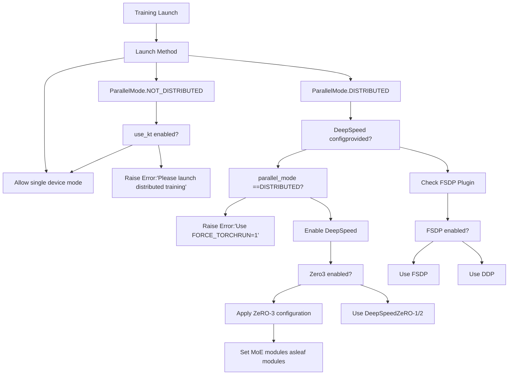
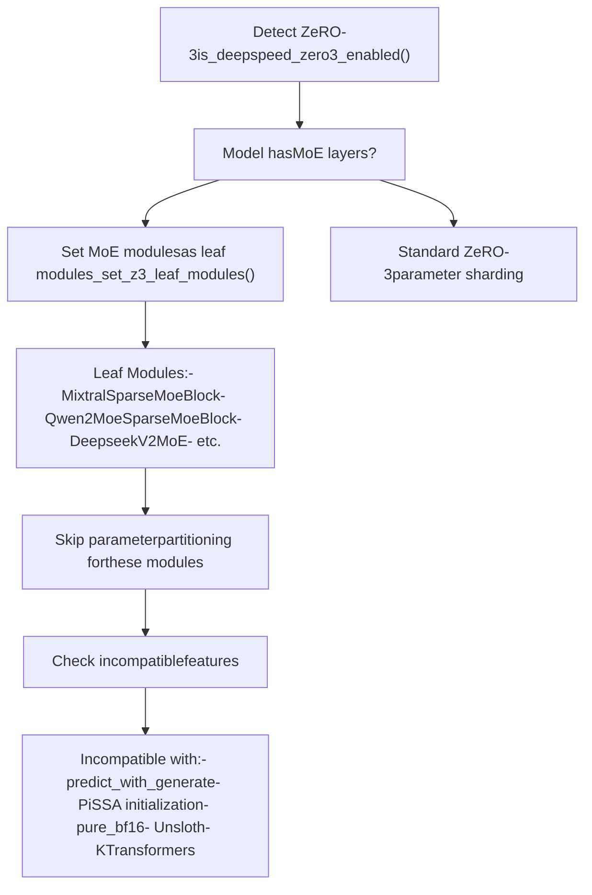
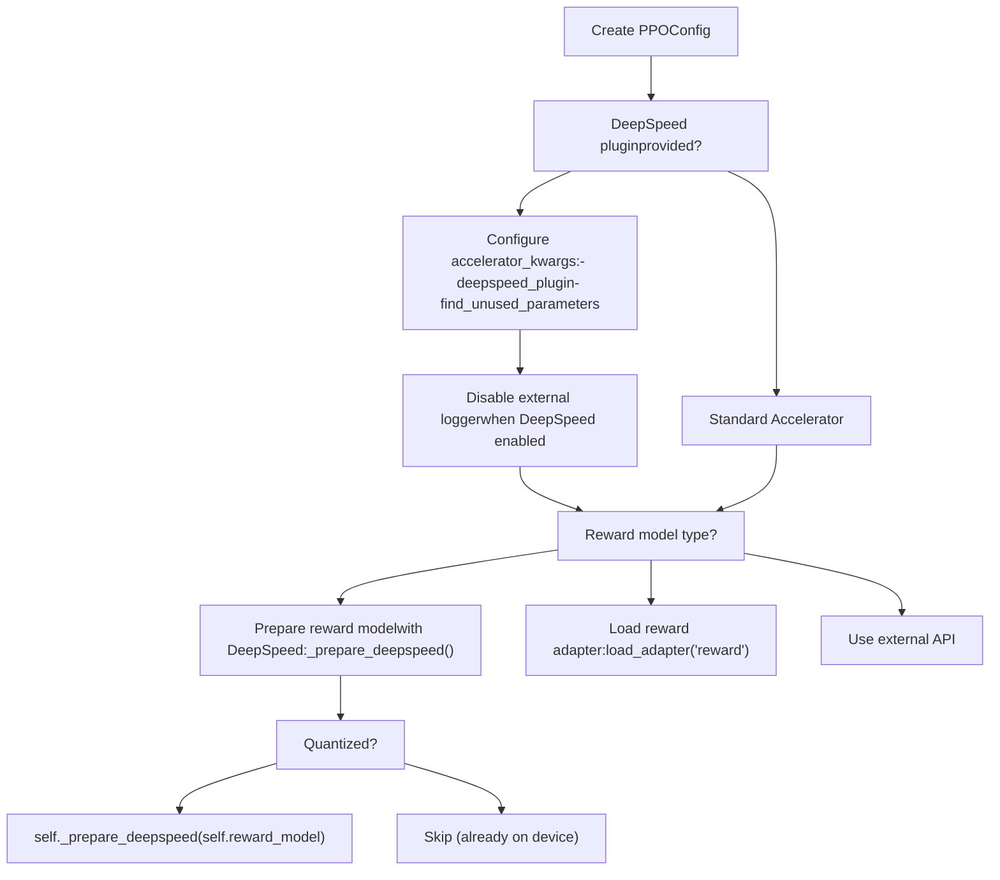
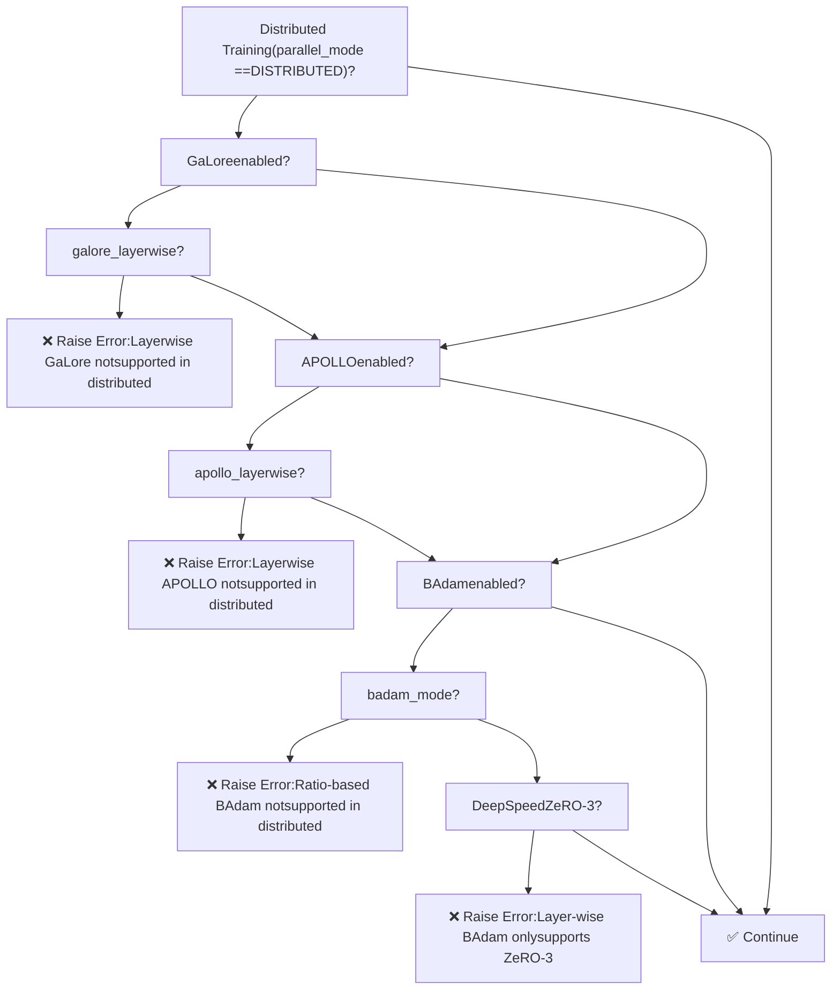

# 分布式训练

相关源文件

-   [README.md](https://github.com/hiyouga/LlamaFactory/blob/355d5c5e/README.md?plain=1)
-   [README\_zh.md](https://github.com/hiyouga/LlamaFactory/blob/355d5c5e/README_zh.md?plain=1)
-   [src/llamafactory/extras/env.py](https://github.com/hiyouga/LlamaFactory/blob/355d5c5e/src/llamafactory/extras/env.py)
-   [src/llamafactory/extras/packages.py](https://github.com/hiyouga/LlamaFactory/blob/355d5c5e/src/llamafactory/extras/packages.py)
-   [src/llamafactory/hparams/finetuning\_args.py](https://github.com/hiyouga/LlamaFactory/blob/355d5c5e/src/llamafactory/hparams/finetuning_args.py)
-   [src/llamafactory/hparams/parser.py](https://github.com/hiyouga/LlamaFactory/blob/355d5c5e/src/llamafactory/hparams/parser.py)
-   [src/llamafactory/model/model\_utils/attention.py](https://github.com/hiyouga/LlamaFactory/blob/355d5c5e/src/llamafactory/model/model_utils/attention.py)
-   [src/llamafactory/model/model\_utils/liger\_kernel.py](https://github.com/hiyouga/LlamaFactory/blob/355d5c5e/src/llamafactory/model/model_utils/liger_kernel.py)
-   [src/llamafactory/model/model\_utils/moe.py](https://github.com/hiyouga/LlamaFactory/blob/355d5c5e/src/llamafactory/model/model_utils/moe.py)
-   [src/llamafactory/model/model\_utils/valuehead.py](https://github.com/hiyouga/LlamaFactory/blob/355d5c5e/src/llamafactory/model/model_utils/valuehead.py)
-   [src/llamafactory/train/callbacks.py](https://github.com/hiyouga/LlamaFactory/blob/355d5c5e/src/llamafactory/train/callbacks.py)
-   [src/llamafactory/train/dpo/trainer.py](https://github.com/hiyouga/LlamaFactory/blob/355d5c5e/src/llamafactory/train/dpo/trainer.py)
-   [src/llamafactory/train/kto/trainer.py](https://github.com/hiyouga/LlamaFactory/blob/355d5c5e/src/llamafactory/train/kto/trainer.py)
-   [src/llamafactory/train/ppo/trainer.py](https://github.com/hiyouga/LlamaFactory/blob/355d5c5e/src/llamafactory/train/ppo/trainer.py)
-   [src/llamafactory/train/pt/trainer.py](https://github.com/hiyouga/LlamaFactory/blob/355d5c5e/src/llamafactory/train/pt/trainer.py)
-   [src/llamafactory/train/rm/trainer.py](https://github.com/hiyouga/LlamaFactory/blob/355d5c5e/src/llamafactory/train/rm/trainer.py)
-   [src/llamafactory/train/sft/trainer.py](https://github.com/hiyouga/LlamaFactory/blob/355d5c5e/src/llamafactory/train/sft/trainer.py)
-   [src/llamafactory/train/trainer\_utils.py](https://github.com/hiyouga/LlamaFactory/blob/355d5c5e/src/llamafactory/train/trainer_utils.py)

## 目的与范围

本页面涵盖了 LlamaFactory 的分布式训练基础设施，包括三种分布式策略的配置和使用：**数据并行 (DDP)**、**完全分片数据并行 (FSDP)** 和 **DeepSpeed ZeRO**。它解释了如何启动分布式训练、配置每种策略以及处理与其他功能的兼容性限制。

有关训练阶段和训练器实现的信息，请参阅 [训练阶段与训练器](/hiyouga/LlamaFactory/6.1-training-stages-and-trainers)。有关分布式设置中的自定义优化器配置，请参阅 [自定义优化器](/hiyouga/LlamaFactory/6.2-custom-optimizers)。

---

## 分布式策略概览

LlamaFactory 支持三种主要的分布式训练策略，每种策略在显存效率、通信开销和易用性之间都有不同的权衡：

| 策略 | 显存效率 | 通信 | 使用场景 |
| --- | --- | --- | --- |
| **DDP** | 低（每卡全量模型副本） | 仅梯度同步 | 单节点多卡，小型模型 |
| **FSDP** | 高（分片参数、梯度、优化器状态） | 逐层参数收集 | 跨多卡的大型模型 |
| **DeepSpeed ZeRO** | 最高（可配置分片级别） | 根据 ZeRO 阶段可调 | 超大型模型，MoE 架构 |

系统根据启动方法和配置自动检测训练模式。所有自定义训练器都从 `transformers.Trainer` 继承分布式训练功能。

**来源：** [README.md224](https://github.com/hiyouga/LlamaFactory/blob/355d5c5e/README.md?plain=1#L224-L224) [src/llamafactory/hparams/parser.py29](https://github.com/hiyouga/LlamaFactory/blob/355d5c5e/src/llamafactory/hparams/parser.py#L29-L29)

---

## 分布式训练检测


**图表：分布式策略检测流程**

系统通过几项检查来确定分布式策略：

1.  **启动检测**：根据训练启动方式设置 `ParallelMode` [src/llamafactory/hparams/parser.py288-292](https://github.com/hiyouga/LlamaFactory/blob/355d5c5e/src/llamafactory/hparams/parser.py#L288-L292)
2.  **DeepSpeed 验证**：如果提供了 DeepSpeed 配置，则需要 `FORCE_TORCHRUN=1` 环境变量 [src/llamafactory/hparams/parser.py291-292](https://github.com/hiyouga/LlamaFactory/blob/355d5c5e/src/llamafactory/hparams/parser.py#L291-L292)
3.  **策略选择**：根据配置按 DeepSpeed → FSDP → DDP 的顺序进行选择

**来源：** [src/llamafactory/hparams/parser.py288-292](https://github.com/hiyouga/LlamaFactory/blob/355d5c5e/src/llamafactory/hparams/parser.py#L288-L292) [src/llamafactory/hparams/parser.py409-414](https://github.com/hiyouga/LlamaFactory/blob/355d5c5e/src/llamafactory/hparams/parser.py#L409-L414)

---

## 启动分布式训练

### 单节点多卡 (DDP)

使用内部使用 `torchrun` 的 `llamafactory-cli`：

```
llamafactory-cli train config.yaml
```
或手动使用 `torchrun`：

```
torchrun --nproc_per_node 4 --master_port 29500 \    src/llamafactory/cli.py train config.yaml
```
### 多节点训练

在每个节点上，指定主节点地址和节点等级（node rank）：

```
# 节点 0 (主节点)torchrun --nproc_per_node 8 \    --nnodes 2 \    --node_rank 0 \    --master_addr "192.168.1.1" \    --master_port 29500 \    src/llamafactory/cli.py train config.yaml # 节点 1 (工作节点)torchrun --nproc_per_node 8 \    --nnodes 2 \    --node_rank 1 \    --master_addr "192.168.1.1" \    --master_port 29500 \    src/llamafactory/cli.py train config.yaml
```
### DeepSpeed 启动

```
FORCE_TORCHRUN=1 deepspeed --num_gpus 4 \    src/llamafactory/cli.py train config.yaml
```
需要 `FORCE_TORCHRUN=1` 环境变量才能通过验证 [src/llamafactory/hparams/parser.py291-292](https://github.com/hiyouga/LlamaFactory/blob/355d5c5e/src/llamafactory/hparams/parser.py#L291-L292)

**来源：** [src/llamafactory/hparams/parser.py291-292](https://github.com/hiyouga/LlamaFactory/blob/355d5c5e/src/llamafactory/hparams/parser.py#L291-L292)

---

## DeepSpeed 集成

### DeepSpeed 配置

通过在 `TrainingArguments` 中提供 DeepSpeed 配置文件来启用 DeepSpeed：

```
# config.yamldeepspeed: path/to/ds_config.json
```
系统会验证在启用 DeepSpeed 时是否使用了 `torchrun` 或 `deepspeed` 启动器启动训练。

### ZeRO 阶段

DeepSpeed ZeRO 有三个优化阶段：

| 阶段 | 分片组件 | 显存节省 | 通信 |
| --- | --- | --- | --- |
| **ZeRO-1** | 优化器状态 | ~4x | 低 |
| **ZeRO-2** | 优化器状态 + 梯度 | ~8x | 中 |
| **ZeRO-3** | 优化器状态 + 梯度 + 参数 | ~Nx (N=显卡数) | 高 |

### ZeRO-3 特定处理

当启用 ZeRO-3 时 (`is_deepspeed_zero3_enabled()`)，系统会应用特殊处理：


**图表：DeepSpeed ZeRO-3 配置流程**

#### MoE 叶模块注册

对于混合专家 (MoE) 模型，系统将 MoE 块注册为 "叶模块"，以防止 DeepSpeed 对其进行分片 [src/llamafactory/model/model\_utils/moe.py43-139](https://github.com/hiyouga/LlamaFactory/blob/355d5c5e/src/llamafactory/model/model_utils/moe.py#L43-L139)：

```
def add_z3_leaf_module(model: "PreTrainedModel") -> None:    """Set module as a leaf module to skip partitioning in deepspeed zero3."""    if not is_deepspeed_zero3_enabled():        return        model_type = getattr(model.config, "model_type", None)        # 示例：    if model_type == "mixtral":        from transformers.models.mixtral.modeling_mixtral import MixtralSparseMoeBlock        _set_z3_leaf_modules(model, [MixtralSparseMoeBlock])        if model_type == "qwen2_moe":        from transformers.models.qwen2_moe.modeling_qwen2_moe import Qwen2MoeSparseMoeBlock        _set_z3_leaf_modules(model, [Qwen2MoeSparseMoeBlock])        # ... 更多 MoE 架构
```
这防止了因在设备间分片专家参数而导致的通信开销和数值不稳定。

#### 参考模型准备

在偏好学习 (DPO, KTO) 中，参考模型会为 DeepSpeed 单独准备 [src/llamafactory/train/dpo/trainer.py94-102](https://github.com/hiyouga/LlamaFactory/blob/355d5c5e/src/llamafactory/train/dpo/trainer.py#L94-L102)：

```
if ref_model is not None:    if self.is_deepspeed_enabled:        if not (            getattr(ref_model, "is_loaded_in_8bit", False)             or getattr(ref_model, "is_loaded_in_4bit", False)        ):  # 量化模型已在正确设备上            self.ref_model = prepare_deepspeed(self.ref_model, self.accelerator)
```
**来源：** [src/llamafactory/model/model\_utils/moe.py36-139](https://github.com/hiyouga/LlamaFactory/blob/355d5c5e/src/llamafactory/model/model_utils/moe.py#L36-L139) [src/llamafactory/train/dpo/trainer.py94-102](https://github.com/hiyouga/LlamaFactory/blob/355d5c5e/src/llamafactory/train/dpo/trainer.py#L94-L102) [src/llamafactory/hparams/parser.py306-323](https://github.com/hiyouga/LlamaFactory/blob/355d5c5e/src/llamafactory/hparams/parser.py#L306-L323)

---

## FSDP 集成

### FSDP 配置

通过 `TrainingArguments` 启用 FSDP (完全分片数据并行 Fully Sharded Data Parallel)：

```
# config.yamlfsdp: "full_shard auto_wrap"fsdp_config:  fsdp_transformer_layer_cls_to_wrap: "LlamaDecoderLayer"
```
### FSDP + QLoRA

LlamaFactory 支持 FSDP 与 QLoRA 结合，用于在有限的 GPU 显存上训练大型模型 [README.md224](https://github.com/hiyouga/LlamaFactory/blob/355d5c5e/README.md?plain=1#L224-L224)：

```
# 示例：在 2x24GB GPU 上微调 70B 模型model_name_or_path: meta-llama/Llama-2-70b-hfquantization_bit: 4finetuning_type: loralora_rank: 8lora_target: all # FSDP 配置fsdp: "full_shard auto_wrap"fsdp_config:  fsdp_transformer_layer_cls_to_wrap: "LlamaDecoderLayer"
```
此组合允许：

-   4-bit 量化减少显存占用
-   LoRA 减少可训练参数
-   FSDP 分片优化器状态和梯度

**来源：** [README.md224](https://github.com/hiyouga/LlamaFactory/blob/355d5c5e/README.md?plain=1#L224-L224)

---

## PPO 特定的分布式配置

由于 Actor-Critic 架构，PPO 训练有额外的分布式配置要求：


**图表：PPO 分布式配置**

关键的 PPO 特定处理 [src/llamafactory/train/ppo/trainer.py119-187](https://github.com/hiyouga/LlamaFactory/blob/355d5c5e/src/llamafactory/train/ppo/trainer.py#L119-L187)：

1.  **DeepSpeed 插件集成**：PPO 配置包含带 `find_unused_parameters` 设置的 DeepSpeed 插件
2.  **禁用外部日志记录器**：当启用 DeepSpeed 时，PPO 无法使用 WandB 等外部日志记录器
3.  **奖励模型准备**：全量奖励模型会使用 DeepSpeed 准备，而 LoRA 奖励模型会绕过准备

**来源：** [src/llamafactory/train/ppo/trainer.py119-187](https://github.com/hiyouga/LlamaFactory/blob/355d5c5e/src/llamafactory/train/ppo/trainer.py#L119-L187)

---

## 兼容性矩阵

### 分布式训练约束


**图表：分布式训练兼容性检查**

### 完整兼容性表

| 功能 | DDP | FSDP | DeepSpeed ZeRO-1/2 | DeepSpeed ZeRO-3 |
| --- | --- | --- | --- | --- |
| **全量微调** | ✅ | ✅ | ✅ | ✅ |
| **LoRA** | ✅ | ✅ | ✅ | ✅ |
| **QLoRA** | ✅ | ✅ | ✅ | ✅ |
| **GaLore (非逐层)** | ✅ | ✅ | ❌ | ❌ |
| **GaLore (逐层)** | ❌ | ❌ | ❌ | ❌ |
| **APOLLO (非逐层)** | ✅ | ✅ | ❌ | ❌ |
| **APOLLO (逐层)** | ❌ | ❌ | ❌ | ❌ |
| **BAdam (按比例模式)** | ❌ | ❌ | ❌ | ❌ |
| **BAdam (逐层模式)** | ❌ | ❌ | ❌ | ✅ |
| **Unsloth** | ✅ | ✅ | ✅ | ❌ |
| **KTransformers** | ❌ | ❌ | ❌ | ❌ |
| **predict\_with\_generate** | ✅ | ✅ | ✅ | ❌ |
| **PiSSA 初始化** | ✅ | ✅ | ✅ | ❌ |
| **pure\_bf16** | ✅ | ✅ | ✅ | ❌ |

验证逻辑实现在 [src/llamafactory/hparams/parser.py325-355](https://github.com/hiyouga/LlamaFactory/blob/355d5c5e/src/llamafactory/hparams/parser.py#L325-L355)：

```
if training_args.parallel_mode == ParallelMode.DISTRIBUTED:    if finetuning_args.use_galore and finetuning_args.galore_layerwise:        raise ValueError("Distributed training does not support layer-wise GaLore.")        if finetuning_args.use_apollo and finetuning_args.apollo_layerwise:        raise ValueError("Distributed training does not support layer-wise APOLLO.")        if finetuning_args.use_badam:        if finetuning_args.badam_mode == "ratio":            raise ValueError("Radio-based BAdam does not yet support distributed training, use layer-wise BAdam.")        elif not is_deepspeed_zero3_enabled():            raise ValueError("Layer-wise BAdam only supports DeepSpeed ZeRO-3 training.") if training_args.deepspeed is not None and (finetuning_args.use_galore or finetuning_args.use_apollo):    raise ValueError("GaLore and APOLLO are incompatible with DeepSpeed yet.")
```
**来源：** [src/llamafactory/hparams/parser.py325-355](https://github.com/hiyouga/LlamaFactory/blob/355d5c5e/src/llamafactory/hparams/parser.py#L325-L355)

---

## LoRA 特定的分布式优化

### DDP 查找未使用参数

使用 LoRA 进行 DDP 训练时，系统会自动设置 `ddp_find_unused_parameters=False` 以提高性能 [src/llamafactory/hparams/parser.py408-414](https://github.com/hiyouga/LlamaFactory/blob/355d5c5e/src/llamafactory/hparams/parser.py#L408-L414)：

```
if (    training_args.parallel_mode == ParallelMode.DISTRIBUTED    and training_args.ddp_find_unused_parameters is None    and finetuning_args.finetuning_type == "lora"):    logger.info_rank0("Set `ddp_find_unused_parameters` to False in DDP training since LoRA is enabled.")    training_args.ddp_find_unused_parameters = False
```
此优化之所以有效，是因为：

-   LoRA 仅更新适配器参数（秩分解矩阵）
-   基础模型参数被冻结，不需要梯度通信
-   跳过未使用参数检测可减少开销

**来源：** [src/llamafactory/hparams/parser.py408-414](https://github.com/hiyouga/LlamaFactory/blob/355d5c5e/src/llamafactory/hparams/parser.py#L408-L414)

---

## 设备放置与显存管理

### 设备分配

系统根据分布式配置分配设备：

```
# 训练的单设备放置model_args.device_map = {"": get_current_device()}
```
这将整个模型放置在当前进程的设备上。对于评估模式下的量化模型，可以使用 `device_map="auto"` [src/llamafactory/hparams/parser.py457-458](https://github.com/hiyouga/LlamaFactory/blob/355d5c5e/src/llamafactory/hparams/parser.py#L457-L458)

### 当前设备检测

`get_current_device()` 函数根据硬件返回适当的设备：

```
def get_current_device() -> torch.device:    if is_torch_npu_available():        return torch.device(f"npu:{os.environ.get('LOCAL_RANK', '0')}")    elif torch.cuda.is_available():        return torch.device(f"cuda:{os.environ.get('LOCAL_RANK', '0')}")    else:        return torch.device("cpu")
```
`LOCAL_RANK` 环境变量由分布式启动器（`torchrun` 或 `deepspeed`）设置。

**来源：** [src/llamafactory/hparams/parser.py457-458](https://github.com/hiyouga/LlamaFactory/blob/355d5c5e/src/llamafactory/hparams/parser.py#L457-L458) [src/llamafactory/extras/misc.py](https://github.com/hiyouga/LlamaFactory/blob/355d5c5e/src/llamafactory/extras/misc.py)

---

## 配置示例

### 示例 1：DDP 训练 (4 GPUs)

```
# config.yamlmodel_name_or_path: meta-llama/Llama-2-7b-hfdataset: alpaca_enfinetuning_type: lora # 训练参数output_dir: ./outputnum_train_epochs: 3per_device_train_batch_size: 4gradient_accumulation_steps: 4learning_rate: 5e-5 # 启动：llamafactory-cli train config.yaml
```
### 示例 2：FSDP + QLoRA (大型模型)

```
# config.yamlmodel_name_or_path: meta-llama/Llama-2-70b-hfdataset: alpaca_enfinetuning_type: loraquantization_bit: 4 # FSDP 配置fsdp: "full_shard auto_wrap"fsdp_config:  fsdp_transformer_layer_cls_to_wrap: "LlamaDecoderLayer" # 训练参数output_dir: ./outputnum_train_epochs: 3per_device_train_batch_size: 1gradient_accumulation_steps: 16
```
### 示例 3：DeepSpeed ZeRO-3 (Mixtral MoE)

```
# config.yamlmodel_name_or_path: mistralai/Mixtral-8x7B-v0.1dataset: alpaca_enfinetuning_type: lora # DeepSpeed 配置deepspeed: ds_z3_config.json # 训练参数output_dir: ./outputper_device_train_batch_size: 1gradient_accumulation_steps: 32bf16: true # 启动：FORCE_TORCHRUN=1 deepspeed --num_gpus 8 src/llamafactory/cli.py train config.yaml
```
**DeepSpeed 配置 (ds\_z3\_config.json):**

```
{  "train_micro_batch_size_per_gpu": "auto",  "gradient_accumulation_steps": "auto",  "gradient_clipping": "auto",  "zero_optimization": {    "stage": 3,    "offload_optimizer": {      "device": "cpu",      "pin_memory": true    },    "offload_param": {      "device": "cpu",      "pin_memory": true    },    "overlap_comm": true,    "contiguous_gradients": true,    "sub_group_size": 1e9,    "reduce_bucket_size": "auto",    "stage3_prefetch_bucket_size": "auto",    "stage3_param_persistence_threshold": "auto",    "stage3_max_live_parameters": 1e9,    "stage3_max_reuse_distance": 1e9,    "stage3_gather_16bit_weights_on_model_save": true  },  "bf16": {    "enabled": "auto"  }}
```
**来源：** [README.md224](https://github.com/hiyouga/LlamaFactory/blob/355d5c5e/README.md?plain=1#L224-L224) [README.md242](https://github.com/hiyouga/LlamaFactory/blob/355d5c5e/README.md?plain=1#L242-L242)

---

## 故障排除

### 常见问题与解决方案

| 问题 | 原因 | 解决方案 |
| --- | --- | --- |
| "Please launch distributed training with `llamafactory-cli` or `torchrun`" | 单进程启动且未使用 KTransformers | 使用 `llamafactory-cli train` 或 `torchrun` |
| "Please use `FORCE_TORCHRUN=1` to launch DeepSpeed training" | DeepSpeed 启动时未使用分布式启动器 | 设置 `FORCE_TORCHRUN=1` 环境变量 |
| "Distributed training does not support layer-wise GaLore" | 在分布式模式下使用了 `galore_layerwise: true` | 设置 `galore_layerwise: false` 或使用单卡 |
| "Layer-wise BAdam only supports DeepSpeed ZeRO-3 training" | 在非 ZeRO-3 模式下使用了 `badam_mode: layer` | 使用 `badam_mode: ratio` 或启用 DeepSpeed ZeRO-3 |
| MoE 模型在 ZeRO-3 模式下显存溢出 | MoE 模块被分片 | 系统会自动通过叶模块处理此问题 |
| "Incompatible with DeepSpeed ZeRO-3" | 在 ZeRO-3 模式下使用了 Unsloth 或 KTransformers | 禁用这些功能或使用其他策略 |

### 调试信息

为了检查哪种分布式策略处于激活状态，系统会记录日志：

```
logger.info(    f"Process rank: {training_args.process_index}, "    f"world size: {training_args.world_size}, device: {training_args.device}, "    f"distributed training: {training_args.parallel_mode == ParallelMode.DISTRIBUTED}, "    f"compute dtype: {str(model_args.compute_dtype)}")
```
这会出现在训练开始时的训练日志中 [src/llamafactory/hparams/parser.py463-468](https://github.com/hiyouga/LlamaFactory/blob/355d5c5e/src/llamafactory/hparams/parser.py#L463-L468)

**来源：** [src/llamafactory/hparams/parser.py288-355](https://github.com/hiyouga/LlamaFactory/blob/355d5c5e/src/llamafactory/hparams/parser.py#L288-L355) [src/llamafactory/hparams/parser.py463-468](https://github.com/hiyouga/LlamaFactory/blob/355d5c5e/src/llamafactory/hparams/parser.py#L463-L468)
