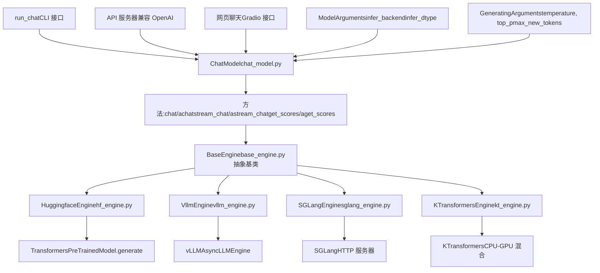
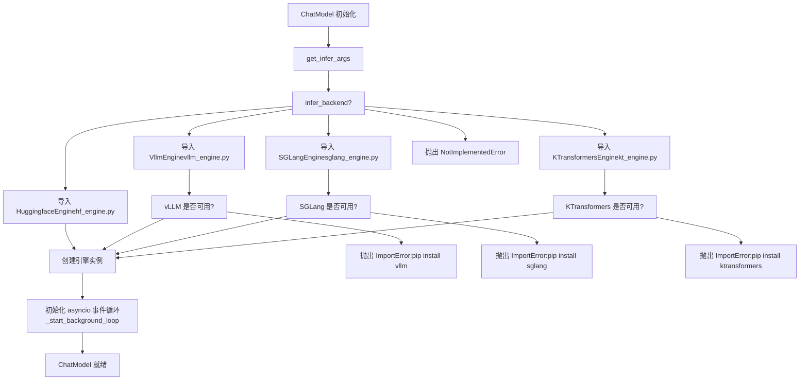
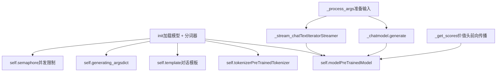
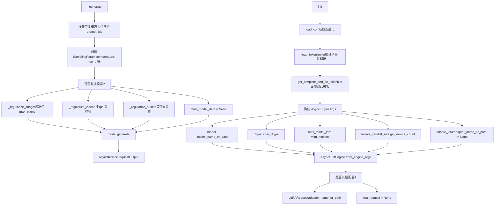
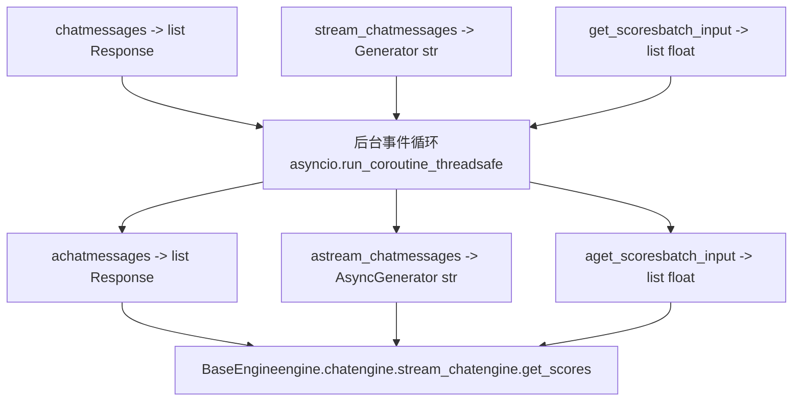
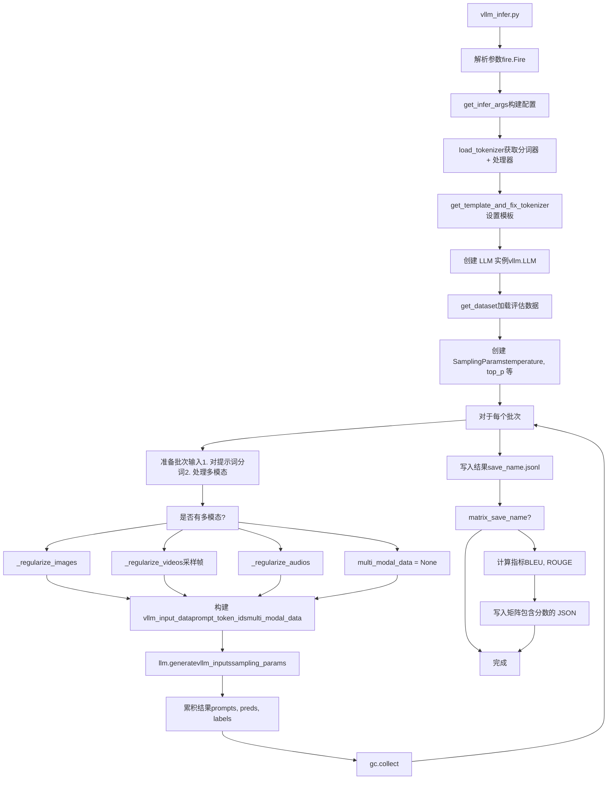

# 推理与部署

相关源文件

-   [examples/README.md](https://github.com/hiyouga/LlamaFactory/blob/355d5c5e/examples/README.md?plain=1)
-   [examples/README\_zh.md](https://github.com/hiyouga/LlamaFactory/blob/355d5c5e/examples/README_zh.md?plain=1)
-   [scripts/vllm\_infer.py](https://github.com/hiyouga/LlamaFactory/blob/355d5c5e/scripts/vllm_infer.py)
-   [src/llamafactory/chat/base\_engine.py](https://github.com/hiyouga/LlamaFactory/blob/355d5c5e/src/llamafactory/chat/base_engine.py)
-   [src/llamafactory/chat/chat\_model.py](https://github.com/hiyouga/LlamaFactory/blob/355d5c5e/src/llamafactory/chat/chat_model.py)
-   [src/llamafactory/chat/hf\_engine.py](https://github.com/hiyouga/LlamaFactory/blob/355d5c5e/src/llamafactory/chat/hf_engine.py)
-   [src/llamafactory/chat/sglang\_engine.py](https://github.com/hiyouga/LlamaFactory/blob/355d5c5e/src/llamafactory/chat/sglang_engine.py)
-   [src/llamafactory/chat/vllm\_engine.py](https://github.com/hiyouga/LlamaFactory/blob/355d5c5e/src/llamafactory/chat/vllm_engine.py)
-   [src/llamafactory/cli.py](https://github.com/hiyouga/LlamaFactory/blob/355d5c5e/src/llamafactory/cli.py)
-   [src/llamafactory/hparams/generating\_args.py](https://github.com/hiyouga/LlamaFactory/blob/355d5c5e/src/llamafactory/hparams/generating_args.py)
-   [src/llamafactory/v1/launcher.py](https://github.com/hiyouga/LlamaFactory/blob/355d5c5e/src/llamafactory/v1/launcher.py)
-   [tests/e2e/test\_sglang.py](https://github.com/hiyouga/LlamaFactory/blob/355d5c5e/tests/e2e/test_sglang.py)

本文档介绍了 LlamaFactory 的推理与部署能力。涵盖了推理引擎架构、可用后端（HuggingFace、vLLM、SGLang、KTransformers）、统一的 `ChatModel` 接口，以及包括命令行聊天、API 服务器和网页界面在内的部署选项。

有关模型训练的信息，请参阅 [训练系统](/hiyouga/LlamaFactory/6-training-system)。有关模型导出和适配器合并的信息，请参阅 [模型导出与合并](/hiyouga/LlamaFactory/7.3-model-export-and-merging)。有关详细的后端对比和配置，请参阅 [推理引擎](/hiyouga/LlamaFactory/7.1-inference-engines)。

## 架构概览

LlamaFactory 提供了一个灵活的推理系统，通过统一接口支持多个后端。该系统将推理 API 与底层引擎实现解耦，允许用户在不更改代码的情况下切换后端。

### 推理系统组件


**来源:** [src/llamafactory/chat/chat\_model.py39-90](https://github.com/hiyouga/LlamaFactory/blob/355d5c5e/src/llamafactory/chat/chat_model.py#L39-L90) [src/llamafactory/chat/base\_engine.py39-99](https://github.com/hiyouga/LlamaFactory/blob/355d5c5e/src/llamafactory/chat/base_engine.py#L39-L99) [examples/README.md201-217](https://github.com/hiyouga/LlamaFactory/blob/355d5c5e/examples/README.md?plain=1#L201-L217)

### 引擎选择过程

推理后端在 `ChatModel` 初始化期间根据 `ModelArguments` 中的 `infer_backend` 参数进行选择：


**来源:** [src/llamafactory/chat/chat\_model.py47-86](https://github.com/hiyouga/LlamaFactory/blob/355d5c5e/src/llamafactory/chat/chat_model.py#L47-L86)

## 基础引擎接口

所有推理引擎都实现了 `BaseEngine` 抽象类，该类定义了三个核心异步方法：

| 方法 | 用途 | 返回类型 | 使用场景 |
| --- | --- | --- | --- |
| `chat()` | 生成完整回复 | `list[Response]` | 批量推理，单次补全 |
| `stream_chat()` | 逐令牌生成 | `AsyncGenerator[str, None]` | 交互式对话，流式回复 |
| `get_scores()` | 文本序列评分 | `list[float]` | 奖励建模，排名 |

### Response 数据类

每个引擎返回包含以下内容的 `Response` 对象：

```
@dataclass
class Response:
    response_text: str           # 生成的文本
    response_length: int         # 生成的令牌数量
    prompt_length: int          # 提示词令牌数量
    finish_reason: Literal["stop", "length"]  # 生成结束的原因
```
**来源:** [src/llamafactory/chat/base\_engine.py31-37](https://github.com/hiyouga/LlamaFactory/blob/355d5c5e/src/llamafactory/chat/base_engine.py#L31-L37) [src/llamafactory/chat/base\_engine.py39-99](https://github.com/hiyouga/LlamaFactory/blob/355d5c5e/src/llamafactory/chat/base_engine.py#L39-L99)

## 推理引擎实现

### HuggingFace 引擎

`HuggingfaceEngine` 使用标准的 Transformers 库进行推理。它通过 `load_model()` 加载模型，并使用 `PreTrainedModel.generate()` 进行文本生成。

#### 关键特性

-   **同步生成**: 使用 `torch.inference_mode()` 装饰器
-   **流式传输**: 在独立线程中实现 `TextIteratorStreamer`
-   **奖励评分**: 支持带有价值头的模型进行奖励建模
-   **多模态**: 通过 `mm_plugin` 处理图像、视频和音频
-   **并发控制**: 使用 `asyncio.Semaphore` 限制并发请求

#### 实现细节


**配置参数:**

| 参数 | 默认值 | 用途 |
| --- | --- | --- |
| `infer_backend` | `hf` | 选择 HuggingFace 引擎 |
| `infer_dtype` | `auto` | 推理精度 (float16/bfloat16) |
| `MAX_CONCURRENT` | `1` | 限制并发请求的环境变量 |

**来源:** [src/llamafactory/chat/hf\_engine.py44-69](https://github.com/hiyouga/LlamaFactory/blob/355d5c5e/src/llamafactory/chat/hf_engine.py#L44-L69) [src/llamafactory/chat/hf\_engine.py210-263](https://github.com/hiyouga/LlamaFactory/blob/355d5c5e/src/llamafactory/chat/hf_engine.py#L210-L263) [src/llamafactory/chat/hf\_engine.py265-310](https://github.com/hiyouga/LlamaFactory/blob/355d5c5e/src/llamafactory/chat/hf_engine.py#L265-L310)

### vLLM 引擎

`VllmEngine` 使用 vLLM 的 `AsyncLLMEngine` 进行高吞吐量推理，并采用了 PagedAttention 和连续批处理等高级优化技术。

#### 关键特性

-   **高吞吐量**: 相比 HuggingFace 提升 270% 以上的速度
-   **张量并行**: 自动多 GPU 分布
-   **LoRA 支持**: 动态 LoRA 适配器加载
-   **原生异步**: 基于 `AsyncLLMEngine` 构建
-   **多模态**: 支持图像、视频和音频

#### 架构


**配置参数:**

| 参数 | 默认值 | 用途 |
| --- | --- | --- |
| `infer_backend` | `vllm` | 选择 vLLM 引擎 |
| `vllm_maxlen` | 模型默认值 | 最大序列长度 |
| `vllm_gpu_util` | `0.9` | GPU 显存利用率 |
| `vllm_enforce_eager` | `False` | 禁用 CUDA 图以进行调试 |
| `vllm_max_lora_rank` | `32` | 最大 LoRA 秩 |
| `vllm_config` | `{}` | 额外的 vLLM 引擎参数 |

**来源:** [src/llamafactory/chat/vllm\_engine.py46-110](https://github.com/hiyouga/LlamaFactory/blob/355d5c5e/src/llamafactory/chat/vllm_engine.py#L46-L110) [src/llamafactory/chat/vllm\_engine.py111-216](https://github.com/hiyouga/LlamaFactory/blob/355d5c5e/src/llamafactory/chat/vllm_engine.py#L111-L216) [scripts/vllm\_infer.py47-145](https://github.com/hiyouga/LlamaFactory/blob/355d5c5e/scripts/vllm_infer.py#L47-L145)

### SGLang 引擎

`SGLangEngine` 将 SGLang HTTP 服务器作为子进程启动，并通过 REST API 进行通信。这种方法提供了更好的隔离性和资源管理。

#### 关键特性

-   **基于服务器**: 使用 `launch_server_cmd()` 启动子进程
-   **HTTP 通信**: 所有请求通过 REST API 进行
-   **自动清理**: 使用 `atexit` 终止服务器
-   **LoRA 后端**: 可配置的 LoRA 后端 (`lora_backend`)

#### 服务器生命周期

> **[Mermaid sequence]**
> *(图表结构无法解析)*

**启动命令结构:**

```
python3 -m sglang.launch_server \
    --model-path {model_name_or_path} \
    --dtype {infer_dtype} \
    --context-length {sglang_maxlen} \
    --mem-fraction-static {sglang_mem_fraction} \
    --tp-size {sglang_tp_size} \
    --download-dir {cache_dir} \
    --log-level error
```
**配置参数:**

| 参数 | 默认值 | 用途 |
| --- | --- | --- |
| `infer_backend` | `sglang` | 选择 SGLang 引擎 |
| `sglang_maxlen` | `8192` | 最大上下文长度 |
| `sglang_mem_fraction` | `0.9` | 静态分配的显存比例 |
| `sglang_tp_size` | `-1` | 张量并行大小 (auto = 所有 GPU) |
| `sglang_lora_backend` | `sgmv` | LoRA 后端 (sgmv/triton) |

**来源:** [src/llamafactory/chat/sglang\_engine.py46-129](https://github.com/hiyouga/LlamaFactory/blob/355d5c5e/src/llamafactory/chat/sglang_engine.py#L46-L129) [src/llamafactory/chat/sglang\_engine.py140-229](https://github.com/hiyouga/LlamaFactory/blob/355d5c5e/src/llamafactory/chat/sglang_engine.py#L140-L229) [src/llamafactory/chat/sglang\_engine.py130-139](https://github.com/hiyouga/LlamaFactory/blob/355d5c5e/src/llamafactory/chat/sglang_engine.py#L130-L139)

### KTransformers 引擎

`KTransformersEngine` 支持 CPU-GPU 混合推理，适用于资源受限的环境。它在 CPU 和 GPU 之间动态卸载层。

**注意:** 源文件中未提供具体实现细节，但 `ChatModel` 初始化中引用了该引擎。

**来源:** [src/llamafactory/chat/chat\_model.py74-83](https://github.com/hiyouga/LlamaFactory/blob/355d5c5e/src/llamafactory/chat/chat_model.py#L74-L83)

## ChatModel 统一接口

`ChatModel` 类提供了一个屏蔽引擎差异的统一接口。它同时支持同步和异步方法。

### 同步/异步方法对


**实现模式:**

同步方法使用 `asyncio.run_coroutine_threadsafe()` 桥接到异步实现：

```
def chat(self, messages, ...) -> list[Response]:
    task = asyncio.run_coroutine_threadsafe(
        self.achat(messages, ...), 
        self._loop
    )
    return task.result()
```
**来源:** [src/llamafactory/chat/chat\_model.py91-105](https://github.com/hiyouga/LlamaFactory/blob/355d5c5e/src/llamafactory/chat/chat_model.py#L91-L105) [src/llamafactory/chat/chat\_model.py107-118](https://github.com/hiyouga/LlamaFactory/blob/355d5c5e/src/llamafactory/chat/chat_model.py#L107-L118) [src/llamafactory/chat/chat\_model.py120-153](https://github.com/hiyouga/LlamaFactory/blob/355d5c5e/src/llamafactory/chat/chat_model.py#L120-L153)

### 方法签名

| 方法 | 参数 | 返回值 | 描述 |
| --- | --- | --- | --- |
| `chat()` / `achat()` | `messages`, `system`, `tools`, `images`, `videos`, `audios`, `**input_kwargs` | `list[Response]` | 生成完整回复 |
| `stream_chat()` / `astream_chat()` | 同上 | `Generator[str]` / `AsyncGenerator[str]` | 流式生成令牌 |
| `get_scores()` / `aget_scores()` | `batch_input`, `**input_kwargs` | `list[float]` | 文本序列评分（奖励模型） |

### 消息格式

所有聊天方法都接受 OpenAI 格式的消息：

```
messages = [
    {"role": "system", "content": "你是一个得力的助手。"},
    {"role": "user", "content": "法国的首都是哪里？"},
    {"role": "assistant", "content": "法国的首都是巴黎。"},
    {"role": "user", "content": "它的人口是多少？"}
]
```
**多模态内容:**

图像、视频和音频作为单独的参数传递：

```
response = chat_model.chat(
    messages=[{"role": "user", "content": "<image>描述这张图片。"}],
    images=["/path/to/image.jpg"])
```
**来源:** [src/llamafactory/chat/chat\_model.py91-118](https://github.com/hiyouga/LlamaFactory/blob/355d5c5e/src/llamafactory/chat/chat_model.py#L91-L118)

## 生成配置

生成行为由 `GeneratingArguments` 控制，可以在初始化期间指定，也可以在每个请求中覆盖。

### GeneratingArguments 参数

```mermaid
flowchart TD
    DoSample["do_sample: bool默认值: True"]
    Temp["temperature: float默认值: 0.95控制随机性"]
    TopP["top_p: float默认值: 0.7核采样"]
    TopK["top_k: int默认值: 50Top-k 采样"]
    MaxLen["max_length: int默认值: 1024总序列长度"]
    MaxNew["max_new_tokens: int默认值: 1024仅新生成的令牌"]
    NumBeams["num_beams: int默认值: 1束搜索"]
    RepPen["repetition_penalty: float默认值: 1.0重复惩罚"]
    LenPen["length_penalty: float默认值: 1.0长度惩罚"]
    SkipSpecial["skip_special_tokens: bool默认值: True移除特殊令牌"]
    Sampling["采样模式"]
    Length["长度限制"]
    Quality["质量控制"]
    Output["输出格式"]

    DoSample --> Sampling
    Temp --> Sampling
    TopP --> Sampling
    TopK --> Sampling
    MaxLen --> Length
    MaxNew --> Length
    NumBeams --> Length
    RepPen --> Quality
    LenPen --> Quality
    SkipSpecial --> Output
```


**参数优先级:**

1.  单个请求中的 `input_kwargs` 覆盖默认值
2.  `max_new_tokens` 优先级高于 `max_length`
3.  如果 `temperature=0` 或 `do_sample=False`，则使用贪婪解码

**引擎特定说明:**

| 参数 | HuggingFace | vLLM | SGLang | 备注 |
| --- | --- | --- | --- | --- |
| `length_penalty` | ✓ | ✗ | ✗ | vLLM/SGLang 不支持 |
| `stop` | ✗ | ✓ | ✓ | 自定义停止字符串 |
| `num_return_sequences` | ✓ | ✓ | ✗ | SGLang 仅支持 n=1 |

**来源:** [src/llamafactory/hparams/generating\_args.py21-84](https://github.com/hiyouga/LlamaFactory/blob/355d5c5e/src/llamafactory/hparams/generating_args.py#L21-L84) [src/llamafactory/chat/hf\_engine.py121-174](https://github.com/hiyouga/LlamaFactory/blob/355d5c5e/src/llamafactory/chat/hf_engine.py#L121-L174) [src/llamafactory/chat/vllm\_engine.py138-181](https://github.com/hiyouga/LlamaFactory/blob/355d5c5e/src/llamafactory/chat/vllm_engine.py#L138-L181)

## 部署方法

LlamaFactory 为不同用例提供了多种部署接口。

### 部署选项对比

| 方法 | 使用场景 | 命令 | 接口 |
| --- | --- | --- | --- |
| 命令行聊天 | 交互式测试 | `llamafactory-cli chat` | 终端 REPL |
| 网页聊天 | 演示/分享 | `llamafactory-cli webchat` | Gradio 网页 UI |
| API 服务器 | 生产环境部署 | `llamafactory-cli api` | 兼容 OpenAI 的 REST API |
| 直接集成 | 自定义应用程序 | `from llamafactory.chat import ChatModel` | Python API |

### 命令行聊天接口

`run_chat()` 函数为测试模型提供了一个交互式 REPL：

> **[Mermaid sequence]**
> *(图表结构无法解析)*

**命令:**

-   `clear`: 清除对话历史并释放 GPU 显存
-   `exit`: 退出应用程序

**来源:** [src/llamafactory/chat/chat\_model.py173-211](https://github.com/hiyouga/LlamaFactory/blob/355d5c5e/src/llamafactory/chat/chat_model.py#L173-L211) [examples/README.md201-205](https://github.com/hiyouga/LlamaFactory/blob/355d5c5e/examples/README.md?plain=1#L201-L205)

### 配置文件示例

所有部署方法都接受 YAML 配置文件：

```
# examples/inference/qwen3_lora_sft.yaml
model_name_or_path: Qwen/Qwen3-4B-Instruct
adapter_name_or_path: saves/qwen3-4b/lora/sft
template: qwen3
finetuning_type: lora
infer_backend: vllm  # 或 hf, sglang, kt
infer_dtype: float16
# 生成参数
temperature: 0.95
top_p: 0.7
max_new_tokens: 1024
```
**来源:** [examples/README.md202-217](https://github.com/hiyouga/LlamaFactory/blob/355d5c5e/examples/README.md?plain=1#L202-L217)

### API 服务器部署

`llamafactory-cli api` 命令启动一个兼容 OpenAI 的 API 服务器（实现在单独的模块中，未在提供的文件中显示）。

**使用示例:**

```
# 启动服务器
llamafactory-cli api examples/inference/qwen3_lora_sft.yaml
# 客户端请求 (OpenAI SDK)
from openai import OpenAI
client = OpenAI(base_url="http://localhost:8000/v1", api_key="0")
response = client.chat.completions.create(
    model="qwen3",
    messages=[{"role": "user", "content": "你好"}]
)
```
**来源:** [examples/README.md213-217](https://github.com/hiyouga/LlamaFactory/blob/355d5c5e/examples/README.md?plain=1#L213-L217)

## 批量推理脚本

为了进行评估和大规模推理，LlamaFactory 提供了 `vllm_infer.py` 以进行高效的批处理。

### 批量推理流水线


**关键特性:**

-   **批处理**: 以可配置的批次大小处理样本，以避免文件句柄限制
-   **多模态支持**: 处理图像、视频（包含 Qwen/GLM4V 的元数据）和音频
-   **指标计算**: 可选的 BLEU/ROUGE 评估
-   **性能追踪**: 记录准备时间、运行时间、每秒样本数/步骤数

**使用示例:**

```
python scripts/vllm_infer.py \
    --model_name_or_path Qwen/Qwen3-4B-Instruct-2507 \
    --template qwen3_nothink \
    --dataset alpaca_en_demo \
    --batch_size 1024 \
    --save_name predictions.jsonl \
    --matrix_save_name metrics.json
```
**输出格式:**

```
// predictions.jsonl (每行一个)
{"prompt": "...", "predict": "...", "label": "..."}
// metrics.json
{
    "predict_bleu-4": 4.35,
    "predict_rouge-1": 21.87,
    "predict_rouge-2": 4.14,
    "predict_rouge-l": 10.84,
    "predict_model_preparation_time": 0.0128,
    "predict_runtime": 131.664,
    "predict_samples_per_second": 0.076,
    "predict_steps_per_second": 0.008}
```
**来源:** [scripts/vllm\_infer.py47-279](https://github.com/hiyouga/LlamaFactory/blob/355d5c5e/scripts/vllm_infer.py#L47-L279)

## 性能考虑

### 引擎选择指南

| 场景 | 推荐引擎 | 原因 |
| --- | --- | --- |
| 开发/调试 | `hf` | 易于调试，全功能支持 |
| 生产环境 (高吞吐量) | `vllm` | 提升 270% 以上速度，PagedAttention，批处理 |
| 基于 HTTP 的部署 | `sglang` | 服务器隔离，REST API |
| 资源受限 | `kt` | CPU-GPU 混合推理 |
| 奖励模型评分 | `hf` | 唯一支持价值头的引擎 |

### 显存优化

**vLLM 配置:**

```
vllm_gpu_util: 0.9        # 使用 90% GPU 显存
vllm_maxlen: 8192         # 若出现 OOM 请减小
vllm_enforce_eager: false # 使用 CUDA 图以提升速度
```
**SGLang 配置:**

```
sglang_mem_fraction: 0.9  # 静态显存分配
sglang_maxlen: 8192       # 上下文窗口
```
### 吞吐量优化

**vLLM 优势:**

-   PagedAttention 减少显存碎片
-   连续批处理提升 GPU 利用率
-   张量并行跨 GPU 自动扩展

**批次大小调优:**

-   HuggingFace: 受限于 GPU 显存
-   vLLM: 根据可用显存进行动态批处理
-   SGLang: 服务器内部处理批处理

**来源:** [src/llamafactory/chat/vllm\_engine.py72-84](https://github.com/hiyouga/LlamaFactory/blob/355d5c5e/src/llamafactory/chat/vllm_engine.py#L72-L84) [src/llamafactory/chat/sglang\_engine.py87-106](https://github.com/hiyouga/LlamaFactory/blob/355d5c5e/src/llamafactory/chat/sglang_engine.py#L87-L106)

## 错误处理

### 常见问题

**导入错误:**

```
# 未安装 vLLM
ImportError: vLLM not install, you may need to run `pip install vllm`
    or try to use HuggingFace backend: --infer_backend huggingface
# 未安装 SGLang
ImportError: SGLang not install, you may need to run `pip install sglang[all]`
    or try to use HuggingFace backend: --infer_backend huggingface
# 未安装 KTransformers
ImportError: KTransformers not install, you may need to run `pip install ktransformers`
    or try to use HuggingFace backend: --infer_backend huggingface
```
**阶段不匹配:**

```
# 尝试使用奖励模型生成
ValueError: The current model does not support `chat`.
# 尝试使用生成模型评分
ValueError: Cannot get scores using an auto-regressive model.
```
**特性不支持:**

```
# vLLM 不支持奖励评分
NotImplementedError: vLLM engine does not support `get_scores`.
# SGLang 不支持 n > 1
NotImplementedError: SGLang only supports n=1.
```
**来源:** [src/llamafactory/chat/chat\_model.py55-85](https://github.com/hiyouga/LlamaFactory/blob/355d5c5e/src/llamafactory/chat/chat_model.py#L55-L85) [src/llamafactory/chat/hf\_engine.py345-412](https://github.com/hiyouga/LlamaFactory/blob/355d5c5e/src/llamafactory/chat/hf_engine.py#L345-L412) [src/llamafactory/chat/vllm\_engine.py266-272](https://github.com/hiyouga/LlamaFactory/blob/355d5c5e/src/llamafactory/chat/vllm_engine.py#L266-L272)

## 命令行命令摘要

| 命令 | 用途 | 示例 |
| --- | --- | --- |
| `llamafactory-cli chat` | 交互式命令行聊天 | `llamafactory-cli chat config.yaml` |
| `llamafactory-cli webchat` | 启动 Gradio 网页界面 | `llamafactory-cli webchat config.yaml` |
| `llamafactory-cli api` | 启动 OpenAI API 服务器 | `llamafactory-cli api config.yaml` |
| `python scripts/vllm_infer.py` | 使用 vLLM 进行批量推理 | `python scripts/vllm_infer.py --model_name_or_path ...` |

**来源:** [examples/README.md201-217](https://github.com/hiyouga/LlamaFactory/blob/355d5c5e/examples/README.md?plain=1#L201-L217) [scripts/vllm\_infer.py47-73](https://github.com/hiyouga/LlamaFactory/blob/355d5c5e/scripts/vllm_infer.py#L47-L73) [src/llamafactory/cli.py16-25](https://github.com/hiyouga/LlamaFactory/blob/355d5c5e/src/llamafactory/cli.py#L16-L25)
