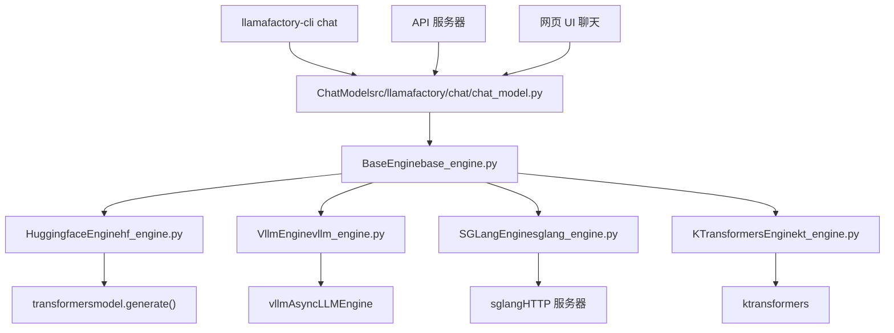
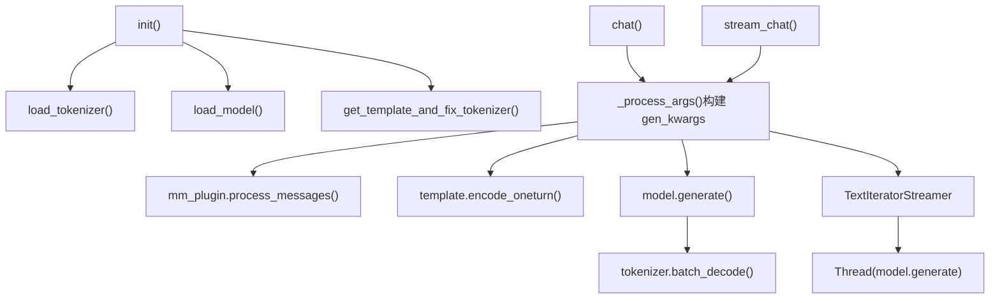
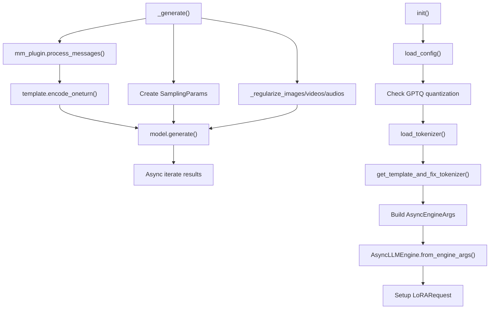
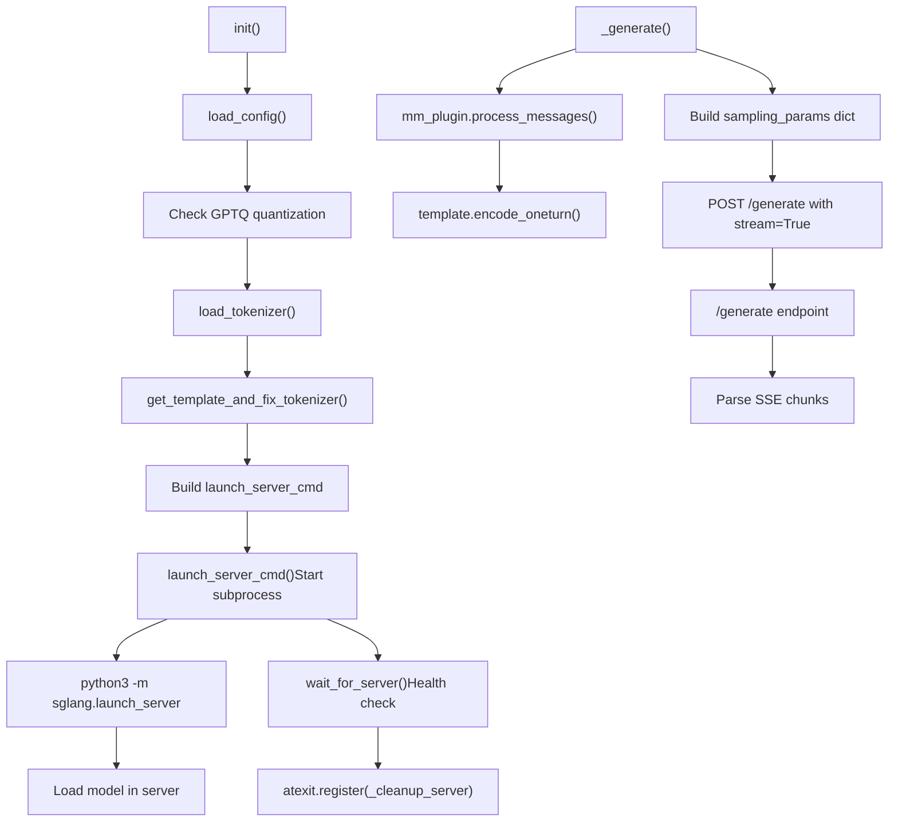
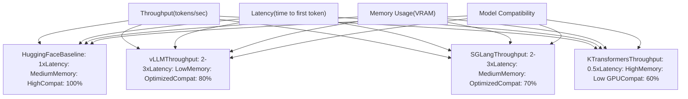

# 推理引擎

相关源文件

-   [scripts/vllm\_infer.py](https://github.com/hiyouga/LlamaFactory/blob/355d5c5e/scripts/vllm_infer.py)
-   [src/llamafactory/chat/hf\_engine.py](https://github.com/hiyouga/LlamaFactory/blob/355d5c5e/src/llamafactory/chat/hf_engine.py)
-   [src/llamafactory/chat/sglang\_engine.py](https://github.com/hiyouga/LlamaFactory/blob/355d5c5e/src/llamafactory/chat/sglang_engine.py)
-   [src/llamafactory/chat/vllm\_engine.py](https://github.com/hiyouga/LlamaFactory/blob/355d5c5e/src/llamafactory/chat/vllm_engine.py)
-   [src/llamafactory/hparams/generating\_args.py](https://github.com/hiyouga/LlamaFactory/blob/355d5c5e/src/llamafactory/hparams/generating_args.py)
-   [tests/e2e/test\_sglang.py](https://github.com/hiyouga/LlamaFactory/blob/355d5c5e/tests/e2e/test_sglang.py)

## 目的与范围

本文档描述了 LlamaFactory 中的推理引擎系统，该系统为模型部署和文本生成提供了多个后端。推理引擎通过不同的优化策略处理模型加载、提示词处理和令牌生成。本页涵盖了系统架构、可用引擎（HuggingFace、vLLM、SGLang、KTransformers）、它们的优缺点以及配置选项。

有关封装这些引擎的高层聊天接口的信息，请参阅 [聊天接口与 API](/hiyouga/LlamaFactory/7.2-chat-interface-and-api)。有关推理前的模型加载和适配器配置，请参阅 [模型加载流水线](/hiyouga/LlamaFactory/5.1-model-loading-pipeline) 和 [适配器系统](/hiyouga/LlamaFactory/5.2-adapter-system-(loraqloraoft))。

## 架构概览

所有推理引擎都实现了由 `BaseEngine` 定义的通用接口，无论底层实现如何，都提供统一的 API。系统根据 `infer_backend` 参数选择引擎，并将请求路由到相应的后端。


**来源:** [src/llamafactory/chat/hf\_engine.py1-413](https://github.com/hiyouga/LlamaFactory/blob/355d5c5e/src/llamafactory/chat/hf_engine.py#L1-L413) [src/llamafactory/chat/vllm\_engine.py1-272](https://github.com/hiyouga/LlamaFactory/blob/355d5c5e/src/llamafactory/chat/vllm_engine.py#L1-L272) [src/llamafactory/chat/sglang\_engine.py1-290](https://github.com/hiyouga/LlamaFactory/blob/355d5c5e/src/llamafactory/chat/sglang_engine.py#L1-L290)

### BaseEngine 接口

所有引擎必须实现四个核心方法：

| 方法 | 返回类型 | 目的 |
| --- | --- | --- |
| `chat()` | `list[Response]` | 同步生成，返回完整的回复 |
| `stream_chat()` | `AsyncGenerator[str, None]` | 异步流式传输，增量产出令牌 |
| `get_scores()` | `list[float]` | 返回输入的奖励分数（仅限奖励模型） |
| `__init__()` | `None` | 使用模型、数据、微调和生成参数初始化引擎 |

每个引擎会设置：

-   `self.name`: 来自 `EngineName` 枚举的引擎标识符
-   `self.can_generate`: 表示是否支持生成的布尔值（仅对 SFT 模型为 true）
-   `self.tokenizer`: 加载的分词器实例
-   `self.processor`: 多模态处理器（如果适用）
-   `self.template`: 消息格式化的对话模板
-   `self.model`: 加载的模型或引擎实例

**来源:** [src/llamafactory/chat/hf\_engine.py44-68](https://github.com/hiyouga/LlamaFactory/blob/355d5c5e/src/llamafactory/chat/hf_engine.py#L44-L68) [src/llamafactory/chat/vllm\_engine.py46-109](https://github.com/hiyouga/LlamaFactory/blob/355d5c5e/src/llamafactory/chat/vllm_engine.py#L46-L109)

## HuggingFace 引擎

`HuggingfaceEngine` 使用标准的 `transformers` 库进行推理。它将完整模型加载到显存中，并使用 `model.generate()` 进行文本生成。这是默认引擎，支持所有的模型架构、量化方法和适配器。


**来源:** [src/llamafactory/chat/hf\_engine.py44-68](https://github.com/hiyouga/LlamaFactory/blob/355d5c5e/src/llamafactory/chat/hf_engine.py#L44-L68) [src/llamafactory/chat/hf\_engine.py210-263](https://github.com/hiyouga/LlamaFactory/blob/355d5c5e/src/llamafactory/chat/hf_engine.py#L210-L263)

### 初始化

引擎初始化遵循以下顺序：

1.  **加载分词器和处理器** - 使用 `load_tokenizer()` 获取分词器和可选的多模态处理器 [src/llamafactory/chat/hf\_engine.py54-56](https://github.com/hiyouga/LlamaFactory/blob/355d5c5e/src/llamafactory/chat/hf_engine.py#L54-L56)
2.  **设置填充侧** - 生成使用左填充，评分使用右填充 [src/llamafactory/chat/hf\_engine.py57](https://github.com/hiyouga/LlamaFactory/blob/355d5c5e/src/llamafactory/chat/hf_engine.py#L57-L57)
3.  **加载模板** - 通过 `get_template_and_fix_tokenizer()` 应用对话模板 [src/llamafactory/chat/hf\_engine.py58](https://github.com/hiyouga/LlamaFactory/blob/355d5c5e/src/llamafactory/chat/hf_engine.py#L58-L58)
4.  **加载模型** - 调用 `load_model()` 并配置适配器、量化和价值头 [src/llamafactory/chat/hf\_engine.py59-61](https://github.com/hiyouga/LlamaFactory/blob/355d5c5e/src/llamafactory/chat/hf_engine.py#L59-L61)
5.  **设置并发** - 创建 asyncio 信号量以限制并发请求 [src/llamafactory/chat/hf\_engine.py70](https://github.com/hiyouga/LlamaFactory/blob/355d5c5e/src/llamafactory/chat/hf_engine.py#L70-L70)

对于奖励模型（当 `can_generate=False` 时），`add_valuehead` 参数设置为 `True`，将奖励头添加到模型中。

**来源:** [src/llamafactory/chat/hf\_engine.py45-70](https://github.com/hiyouga/LlamaFactory/blob/355d5c5e/src/llamafactory/chat/hf_engine.py#L45-L70)

### 生成过程

静态方法 `_process_args()` [src/llamafactory/chat/hf\_engine.py72-208](https://github.com/hiyouga/LlamaFactory/blob/355d5c5e/src/llamafactory/chat/hf_engine.py#L72-L208) 处理提示词：

1.  **多模态处理** - 如果消息中不存在占位符，则注入占位符 (`<image>`, `<video>`, `<audio>`) [src/llamafactory/chat/hf\_engine.py88-101](https://github.com/hiyouga/LlamaFactory/blob/355d5c5e/src/llamafactory/chat/hf_engine.py#L88-L101)
2.  **消息处理** - 使用 `mm_plugin.process_messages()` 处理特殊令牌 [src/llamafactory/chat/hf\_engine.py103-105](https://github.com/hiyouga/LlamaFactory/blob/355d5c5e/src/llamafactory/chat/hf_engine.py#L103-L105)
3.  **令牌编码** - 使用 `template.encode_oneturn()` 对消息进行编码 [src/llamafactory/chat/hf\_engine.py107](https://github.com/hiyouga/LlamaFactory/blob/355d5c5e/src/llamafactory/chat/hf_engine.py#L107-L107)
4.  **令牌 ID 处理** - 使用 `mm_plugin.process_token_ids()` 处理多模态令牌 ID [src/llamafactory/chat/hf\_engine.py108-116](https://github.com/hiyouga/LlamaFactory/blob/355d5c5e/src/llamafactory/chat/hf_engine.py#L108-L116)
5.  **参数提取** - 从 kwargs 提取生成参数并与默认值合并 [src/llamafactory/chat/hf\_engine.py121-174](https://github.com/hiyouga/LlamaFactory/blob/355d5c5e/src/llamafactory/chat/hf_engine.py#L121-L174)
6.  **多模态输入** - 通过 `mm_plugin.get_mm_inputs()` 将图像/视频/音频转换为张量 [src/llamafactory/chat/hf\_engine.py181-198](https://github.com/hiyouga/LlamaFactory/blob/355d5c5e/src/llamafactory/chat/hf_engine.py#L181-L198)

实际生成发生在 `_chat()` [src/llamafactory/chat/hf\_engine.py210-263](https://github.com/hiyouga/LlamaFactory/blob/355d5c5e/src/llamafactory/chat/hf_engine.py#L210-L263) 中：

```
generate_output = model.generate(**gen_kwargs)
response_ids = generate_output[:, prompt_length:]
response = tokenizer.batch_decode(response_ids, ...)
```
### 流式传输实现

流式传输使用 `TextIteratorStreamer` [src/llamafactory/chat/hf\_engine.py295-299](https://github.com/hiyouga/LlamaFactory/blob/355d5c5e/src/llamafactory/chat/hf_engine.py#L295-L299)，它在后台线程中迭代生成的令牌：

1.  创建设置 `skip_prompt=True` 的 streamer 以排除输入令牌
2.  将 streamer 添加到生成参数中
3.  在守护线程中启动 `model.generate()` [src/llamafactory/chat/hf\_engine.py301-302](https://github.com/hiyouga/LlamaFactory/blob/355d5c5e/src/llamafactory/chat/hf_engine.py#L301-L302)
4.  令牌到达时从 streamer 中产出 [src/llamafactory/chat/hf\_engine.py304-308](https://github.com/hiyouga/LlamaFactory/blob/355d5c5e/src/llamafactory/chat/hf_engine.py#L304-L308)

异步包装器 [src/llamafactory/chat/hf\_engine.py393-399](https://github.com/hiyouga/LlamaFactory/blob/355d5c5e/src/llamafactory/chat/hf_engine.py#L393-L399) 使用 `asyncio.to_thread()` 在线程池中运行同步 streamer。

**来源:** [src/llamafactory/chat/hf\_engine.py265-310](https://github.com/hiyouga/LlamaFactory/blob/355d5c5e/src/llamafactory/chat/hf_engine.py#L265-L310) [src/llamafactory/chat/hf\_engine.py365-399](https://github.com/hiyouga/LlamaFactory/blob/355d5c5e/src/llamafactory/chat/hf_engine.py#L365-L399)

### 奖励评分

`_get_scores()` 方法 [src/llamafactory/chat/hf\_engine.py312-332](https://github.com/hiyouga/LlamaFactory/blob/355d5c5e/src/llamafactory/chat/hf_engine.py#L312-L332) 用于奖励模型：

1.  对带有填充和截断的批次输入进行分词
2.  通过带有价值头的模型进行前向传播：`values = model(**inputs)[-1]`
3.  在最后一个非填充位置收集分数：`scores.gather(dim=-1, index=...)`

这仅在 `can_generate=False` 时有效，由 `get_scores()` 中的检查强制执行 [src/llamafactory/chat/hf\_engine.py407-408](https://github.com/hiyouga/LlamaFactory/blob/355d5c5e/src/llamafactory/chat/hf_engine.py#L407-L408)

**来源:** [src/llamafactory/chat/hf\_engine.py312-332](https://github.com/hiyouga/LlamaFactory/blob/355d5c5e/src/llamafactory/chat/hf_engine.py#L312-L332) [src/llamafactory/chat/hf\_engine.py401-412](https://github.com/hiyouga/LlamaFactory/blob/355d5c5e/src/llamafactory/chat/hf_engine.py#L401-L412)

## vLLM 引擎

`VllmEngine` 使用 vLLM 库进行高吞吐量推理。vLLM 实现了 PagedAttention 以优化内存使用，并支持连续批处理以提高 GPU 利用率。与 HuggingFace 引擎相比，它可以实现 2-3 倍的高吞吐量。


**来源:** [src/llamafactory/chat/vllm\_engine.py46-109](https://github.com/hiyouga/LlamaFactory/blob/355d5c5e/src/llamafactory/chat/vllm_engine.py#L46-L109) [src/llamafactory/chat/vllm\_engine.py111-216](https://github.com/hiyouga/LlamaFactory/blob/355d5c5e/src/llamafactory/chat/vllm_engine.py#L111-L216)

### 初始化与配置

引擎初始化 [src/llamafactory/chat/vllm\_engine.py47-109](https://github.com/hiyouga/LlamaFactory/blob/355d5c5e/src/llamafactory/chat/vllm_engine.py#L47-L109) 遵循以下步骤：

1.  **加载配置并检查量化** - GPTQ 模型需要 `float16` 数据类型 [src/llamafactory/chat/vllm\_engine.py56-61](https://github.com/hiyouga/LlamaFactory/blob/355d5c5e/src/llamafactory/chat/vllm_engine.py#L56-L61)
2.  **设置分词器和模板** - 加载左填充的分词器，模板设置 `expand_mm_tokens=False` [src/llamafactory/chat/vllm\_engine.py64-69](https://github.com/hiyouga/LlamaFactory/blob/355d5c5e/src/llamafactory/chat/vllm_engine.py#L64-L69)
3.  **构建引擎参数** - 配置 vLLM 参数 [src/llamafactory/chat/vllm\_engine.py72-97](https://github.com/hiyouga/LlamaFactory/blob/355d5c5e/src/llamafactory/chat/vllm_engine.py#L72-L97)：

| 参数 | 目的 | 默认值/取值 |
| --- | --- | --- |
| `model` | 模型路径 | `model_args.model_name_or_path` |
| `dtype` | 推理精度 | `model_args.infer_dtype` |
| `max_model_len` | 最大序列长度 | `model_args.vllm_maxlen` |
| `tensor_parallel_size` | 张量并行的 GPU 数量 | `get_device_count()` |
| `gpu_memory_utilization` | GPU 显存占比 | `model_args.vllm_gpu_util` |
| `enforce_eager` | 禁用 CUDA 图优化 | `model_args.vllm_enforce_eager` |
| `enable_lora` | 启用 LoRA 适配器 | 如果存在适配器则为 True |
| `max_lora_rank` | 最大 LoRA 秩 | `model_args.vllm_max_lora_rank` |

4.  **配置多模态限制** - 设置每个提示词的图像、视频、音频限制 [src/llamafactory/chat/vllm\_engine.py93-94](https://github.com/hiyouga/LlamaFactory/blob/355d5c5e/src/llamafactory/chat/vllm_engine.py#L93-L94)
5.  **应用自定义配置** - 合并用户提供的 `vllm_config` 字典 [src/llamafactory/chat/vllm\_engine.py96-97](https://github.com/hiyouga/LlamaFactory/blob/355d5c5e/src/llamafactory/chat/vllm_engine.py#L96-L97)
6.  **创建异步引擎** - 实例化 `AsyncLLMEngine.from_engine_args()` [src/llamafactory/chat/vllm\_engine.py105](https://github.com/hiyouga/LlamaFactory/blob/355d5c5e/src/llamafactory/chat/vllm_engine.py#L105-L105)
7.  **设置 LoRA 请求** - 如果指定了适配器，则创建 `LoRARequest` [src/llamafactory/chat/vllm\_engine.py106-109](https://github.com/hiyouga/LlamaFactory/blob/355d5c5e/src/llamafactory/chat/vllm_engine.py#L106-L109)

**针对 Yi-VL 模型的特殊处理:** 引擎修补了多模态投射器 [src/llamafactory/chat/vllm\_engine.py99-103](https://github.com/hiyouga/LlamaFactory/blob/355d5c5e/src/llamafactory/chat/vllm_engine.py#L99-L103):

```
if getattr(config, "is_yi_vl_derived_model", None):
    vllm.model_executor.models.llava.LlavaMultiModalProjector = LlavaMultiModalProjectorForYiVLForVLLM
```
**来源:** [src/llamafactory/chat/vllm\_engine.py47-109](https://github.com/hiyouga/LlamaFactory/blob/355d5c5e/src/llamafactory/chat/vllm_engine.py#L47-L109)

### 生成流水线

`_generate()` 方法 [src/llamafactory/chat/vllm\_engine.py111-216](https://github.com/hiyouga/LlamaFactory/blob/355d5c5e/src/llamafactory/chat/vllm_engine.py#L111-L216) 实现了核心生成逻辑：

1.  **生成请求 ID** - 创建唯一 ID：`f"chatcmpl-{uuid.uuid4().hex}"` [src/llamafactory/chat/vllm\_engine.py121](https://github.com/hiyouga/LlamaFactory/blob/355d5c5e/src/llamafactory/chat/vllm_engine.py#L121-L121)
2.  **注入多模态占位符** - 如果消息中不存在，则在前部添加占位符 [src/llamafactory/chat/vllm\_engine.py122-129](https://github.com/hiyouga/LlamaFactory/blob/355d5c5e/src/llamafactory/chat/vllm_engine.py#L122-L129)
3.  **处理消息** - 使用 `mm_plugin.process_messages()` 处理特殊令牌 [src/llamafactory/chat/vllm\_engine.py131-133](https://github.com/hiyouga/LlamaFactory/blob/355d5c5e/src/llamafactory/chat/vllm_engine.py#L131-L133)
4.  **提示词编码** - 编码并追加助手回合 [src/llamafactory/chat/vllm\_engine.py134-136](https://github.com/hiyouga/LlamaFactory/blob/355d5c5e/src/llamafactory/chat/vllm_engine.py#L134-L136)
5.  **提取生成参数** - 从 kwargs 中弹出参数，失败时回退到默认值 [src/llamafactory/chat/vllm\_engine.py138-147](https://github.com/hiyouga/LlamaFactory/blob/355d5c5e/src/llamafactory/chat/vllm_engine.py#L138-L147)
6.  **计算 max\_tokens** - 从 `max_new_tokens`、`max_length` 或 generating\_args 中确定 [src/llamafactory/chat/vllm\_engine.py152-164](https://github.com/hiyouga/LlamaFactory/blob/355d5c5e/src/llamafactory/chat/vllm_engine.py#L152-L164)
7.  **构建 SamplingParams** - 创建 vLLM 采样配置 [src/llamafactory/chat/vllm\_engine.py166-181](https://github.com/hiyouga/LlamaFactory/blob/355d5c5e/src/llamafactory/chat/vllm_engine.py#L166-L181)：

```
sampling_params = SamplingParams(
    n=num_return_sequences,
    repetition_penalty=repetition_penalty or 1.0,
    temperature=temperature,
    top_p=top_p or 1.0,
    top_k=top_k or -1,
    stop=stop,
    stop_token_ids=self.template.get_stop_token_ids(self.tokenizer),
    max_tokens=max_tokens,
    skip_special_tokens=skip_special_tokens)
```
8.  **正则化多模态数据** - 将图像/视频/音频转换为合适的格式 [src/llamafactory/chat/vllm\_engine.py183-208](https://github.com/hiyouga/LlamaFactory/blob/355d5c5e/src/llamafactory/chat/vllm_engine.py#L183-L208)：

    -   图像：`_regularize_images()` 缩放至 `image_max_pixels` 和 `image_min_pixels`
    -   视频：`_regularize_videos()` 根据 `video_fps` 和 `video_maxlen` 采样帧
    -   音频：`_regularize_audios()` 重采样至 `audio_sampling_rate`
9.  **生成** - 使用提示词令牌 ID 和多模态数据调用 `model.generate()` [src/llamafactory/chat/vllm\_engine.py210-216](https://github.com/hiyouga/LlamaFactory/blob/355d5c5e/src/llamafactory/chat/vllm_engine.py#L210-L216)


**来源:** [src/llamafactory/chat/vllm\_engine.py111-216](https://github.com/hiyouga/LlamaFactory/blob/355d5c5e/src/llamafactory/chat/vllm_engine.py#L111-L216)

### 聊天与流式响应

`chat()` 方法 [src/llamafactory/chat/vllm\_engine.py218-245](https://github.com/hiyouga/LlamaFactory/blob/355d5c5e/src/llamafactory/chat/vllm_engine.py#L218-L245) 会完整消费生成器：

```
async for request_output in generator:
    final_output = request_output
for output in final_output.outputs:
    results.append(Response(
        response_text=output.text,
        response_length=len(output.token_ids),
        prompt_length=len(final_output.prompt_token_ids),
        finish_reason=output.finish_reason,
    ))
```
`stream_chat()` 方法 [src/llamafactory/chat/vllm\_engine.py247-263](https://github.com/hiyouga/LlamaFactory/blob/355d5c5e/src/llamafactory/chat/vllm_engine.py#L247-L263) 产出增量增量：

```
generated_text = ""
async for result in generator:
    delta_text = result.outputs[0].text[len(generated_text):]
    generated_text = result.outputs[0].text
    yield delta_text
```
**注意:** vLLM 不支持 `get_scores()` - 它会抛出 `NotImplementedError` [src/llamafactory/chat/vllm\_engine.py265-271](https://github.com/hiyouga/LlamaFactory/blob/355d5c5e/src/llamafactory/chat/vllm_engine.py#L265-L271)

**来源:** [src/llamafactory/chat/vllm\_engine.py218-271](https://github.com/hiyouga/LlamaFactory/blob/355d5c5e/src/llamafactory/chat/vllm_engine.py#L218-L271)

### 批量推理脚本

`vllm_infer.py` 脚本 [scripts/vllm\_infer.py1-283](https://github.com/hiyouga/LlamaFactory/blob/355d5c5e/scripts/vllm_infer.py#L1-L283) 提供了批量推理功能：

1.  **直接 vLLM 实例化** - 直接创建 `LLM` 对象（非 `AsyncLLMEngine`） [scripts/vllm\_infer.py125](https://github.com/hiyouga/LlamaFactory/blob/355d5c5e/scripts/vllm_infer.py#L125-L125)
2.  **批处理** - 批量处理数据集以避免文件句柄限制 [scripts/vllm\_infer.py152-225](https://github.com/hiyouga/LlamaFactory/blob/355d5c5e/scripts/vllm_infer.py#L152-L225)
3.  **数据集加载** - 使用 `get_dataset()` 以 PPO 格式加载训练数据 [scripts/vllm\_infer.py128-129](https://github.com/hiyouga/LlamaFactory/blob/355d5c5e/scripts/vllm_infer.py#L128-L129)
4.  **多模态支持** - 处理带有适当正则化的图像、视频、音频 [scripts/vllm\_infer.py157-207](https://github.com/hiyouga/LlamaFactory/blob/355d5c5e/scripts/vllm_infer.py#L157-L207)
5.  **性能指标** - 计算 BLEU/ROUGE 分数和吞吐量 [scripts/vllm\_infer.py252-278](https://github.com/hiyouga/LlamaFactory/blob/355d5c5e/scripts/vllm_infer.py#L252-L278)

关键配置参数：

| 参数 | 目的 | 默认值 |
| --- | --- | --- |
| `batch_size` | 每批样本数 | 1024 |
| `pipeline_parallel_size` | 流水线并行度 | 1 |
| `temperature` | 采样温度 | 0.95 |
| `max_new_tokens` | 最大生成的令牌数 | 1024 |
| `image_max_pixels` | 最大图像分辨率 | 768×768 |
| `video_fps` | 视频采样帧率 | 2.0 |

**来源:** [scripts/vllm\_infer.py47-283](https://github.com/hiyouga/LlamaFactory/blob/355d5c5e/scripts/vllm_infer.py#L47-L283)

## SGLang 引擎

`SGLangEngine` 使用 SGLang 的 HTTP 服务器进行推理。与将模型嵌入 Python 进程的 vLLM 和 HuggingFace 引擎不同，SGLang 启动一个单独的服务器进程并通过 HTTP 通信。这种架构实现了更好的进程隔离和更容易的部署。


**来源:** [src/llamafactory/chat/sglang\_engine.py46-129](https://github.com/hiyouga/LlamaFactory/blob/355d5c5e/src/llamafactory/chat/sglang_engine.py#L46-L129) [src/llamafactory/chat/sglang\_engine.py140-229](https://github.com/hiyouga/LlamaFactory/blob/355d5c5e/src/llamafactory/chat/sglang_engine.py#L140-L229)

### 初始化与服务器启动

引擎初始化 [src/llamafactory/chat/sglang\_engine.py58-129](https://github.com/hiyouga/LlamaFactory/blob/355d5c5e/src/llamafactory/chat/sglang_engine.py#L58-L129) 遵循此过程：

1.  **加载配置和分词器** - 与 vLLM 相同，检查 GPTQ 量化 [src/llamafactory/chat/sglang\_engine.py67-79](https://github.com/hiyouga/LlamaFactory/blob/355d5c5e/src/llamafactory/chat/sglang_engine.py#L67-L79)
2.  **设置 LoRA 标志** - 设置布尔标志（非完整的 LoRARequest 对象） [src/llamafactory/chat/sglang\_engine.py82-85](https://github.com/hiyouga/LlamaFactory/blob/355d5c5e/src/llamafactory/chat/sglang_engine.py#L82-L85)
3.  **构建启动命令** - 构造启动 SGLang 服务器的 shell 命令 [src/llamafactory/chat/sglang\_engine.py87-106](https://github.com/hiyouga/LlamaFactory/blob/355d5c5e/src/llamafactory/chat/sglang_engine.py#L87-L106)：

```
launch_cmd = [
    "python3 -m sglang.launch_server",
    f"--model-path {model_args.model_name_or_path}",
    f"--dtype {model_args.infer_dtype}",
    f"--context-length {model_args.sglang_maxlen}",
    f"--mem-fraction-static {model_args.sglang_mem_fraction}",
    f"--tp-size {model_args.sglang_tp_size or get_device_count()}",
    f"--download-dir {model_args.cache_dir}",
    "--log-level error",
]
```
4.  **添加 LoRA 配置** - 如果存在适配器，则添加 LoRA 特定标志 [src/llamafactory/chat/sglang\_engine.py98-105](https://github.com/hiyouga/LlamaFactory/blob/355d5c5e/src/llamafactory/chat/sglang_engine.py#L98-L105)：

    -   `--max-loras-per-batch 1`
    -   `--lora-backend {sglang_lora_backend}`
    -   `--lora-paths lora0={adapter_path}`
    -   `--disable-radix-cache` (LoRA 所需)
5.  **启动服务器子进程** - 调用返回进程和端口的 `launch_server_cmd()` [src/llamafactory/chat/sglang\_engine.py109-110](https://github.com/hiyouga/LlamaFactory/blob/355d5c5e/src/llamafactory/chat/sglang_engine.py#L109-L110)

6.  **等待服务器就绪** - 使用 `wait_for_server()`，超时时间 300 秒 [src/llamafactory/chat/sglang\_engine.py115](https://github.com/hiyouga/LlamaFactory/blob/355d5c5e/src/llamafactory/chat/sglang_engine.py#L115-L115)

7.  **注册清理程序** - 确保在退出时杀掉服务器 [src/llamafactory/chat/sglang\_engine.py112](https://github.com/hiyouga/LlamaFactory/blob/355d5c5e/src/llamafactory/chat/sglang_engine.py#L112-L112)

8.  **验证服务器健康状况** - 向 `/get_model_info` 发送可选的 GET 请求 [src/llamafactory/chat/sglang\_engine.py117-123](https://github.com/hiyouga/LlamaFactory/blob/355d5c5e/src/llamafactory/chat/sglang_engine.py#L117-L123)


清理程序 [src/llamafactory/chat/sglang\_engine.py130-138](https://github.com/hiyouga/LlamaFactory/blob/355d5c5e/src/llamafactory/chat/sglang_engine.py#L130-L138) 使用 `terminate_process()` 杀掉子进程树。

**来源:** [src/llamafactory/chat/sglang\_engine.py58-138](https://github.com/hiyouga/LlamaFactory/blob/355d5c5e/src/llamafactory/chat/sglang_engine.py#L58-L138)

### 基于 HTTP 的生成

`_generate()` 方法 [src/llamafactory/chat/sglang\_engine.py140-229](https://github.com/hiyouga/LlamaFactory/blob/355d5c5e/src/llamafactory/chat/sglang_engine.py#L140-L229) 通过 HTTP 与服务器通信：

1.  **处理消息并编码** - 与其他引擎流水线相同 [src/llamafactory/chat/sglang\_engine.py150-164](https://github.com/hiyouga/LlamaFactory/blob/355d5c5e/src/llamafactory/chat/sglang_engine.py#L150-L164)
2.  **构建采样参数** - 创建包含生成配置的字典 [src/llamafactory/chat/sglang\_engine.py193-207](https://github.com/hiyouga/LlamaFactory/blob/355d5c5e/src/llamafactory/chat/sglang_engine.py#L193-L207)：

```
sampling_params = {
    "temperature": temperature,
    "top_p": top_p or 1.0,
    "top_k": top_k or -1,
    "stop": stop,
    "stop_token_ids": self.template.get_stop_token_ids(self.tokenizer),
    "max_new_tokens": max_tokens,
    "repetition_penalty": repetition_penalty or 1.0,
    "skip_special_tokens": skip_special_tokens,
}
```
3.  **创建 HTTP 请求** - 向 `/generate` 端点发送 POST 请求 [src/llamafactory/chat/sglang\_engine.py209-217](https://github.com/hiyouga/LlamaFactory/blob/355d5c5e/src/llamafactory/chat/sglang_engine.py#L209-L217)：

```
json_data = {
    "input_ids": prompt_ids,
    "sampling_params": sampling_params,
    "stream": True,
}
if self.lora_request:
    json_data["lora_request"] = ["lora0"]
response = requests.post(f"{self.base_url}/generate", json=json_data, stream=True)
```
4.  **解析 SSE 流** - 迭代服务器发送事件 (SSE) [src/llamafactory/chat/sglang\_engine.py221-227](https://github.com/hiyouga/LlamaFactory/blob/355d5c5e/src/llamafactory/chat/sglang_engine.py#L221-L227)：

```
for chunk in response.iter_lines(decode_unicode=False):
    chunk = str(chunk.decode("utf-8"))
    if chunk == "data: [DONE]":
        break
    if chunk and chunk.startswith("data:"):
        yield json.loads(chunk[5:].strip("\n"))
```
响应格式包含：

-   `text`: 生成的文本
-   `meta_info.completion_tokens`: 生成的令牌数
-   `meta_info.prompt_tokens`: 提示词令牌数
-   `meta_info.finish_reason`: "stop" 或其他终止原因

**限制:** SGLang 仅支持 `num_return_sequences=1` [src/llamafactory/chat/sglang\_engine.py176-177](https://github.com/hiyouga/LlamaFactory/blob/355d5c5e/src/llamafactory/chat/sglang_engine.py#L176-L177)

**来源:** [src/llamafactory/chat/sglang\_engine.py140-229](https://github.com/hiyouga/LlamaFactory/blob/355d5c5e/src/llamafactory/chat/sglang_engine.py#L140-L229) [src/llamafactory/chat/sglang\_engine.py231-273](https://github.com/hiyouga/LlamaFactory/blob/355d5c5e/src/llamafactory/chat/sglang_engine.py#L231-L273)

## KTransformers 引擎

`KTransformersEngine` 旨在进行 CPU-GPU 混合推理，通过将模型部分卸载到 CPU，在 GPU 显存受限的系统上实现高效推理。提供的文件中未涵盖该引擎，但在架构图中将其列为可用后端之一。

配置通过 `infer_backend="kt"` 参数控制。该引擎特别适用于：

-   无法完全装入 GPU 显存的大型模型
-   具有高 CPU 内存但 VRAM 有限的系统
-   利用 CPU 资源降低推理成本

**来源:** 架构图

## 引擎选择与配置

### 后端选择

推理后端通过 `ModelArguments` 中的 `infer_backend` 参数指定：

| 后端取值 | 引擎类 | 使用场景 |
| --- | --- | --- |
| `"hf"` | `HuggingfaceEngine` | 默认，最大兼容性，开发 |
| `"vllm"` | `VllmEngine` | 高吞吐量，生产服务 |
| `"sglang"` | `SGLangEngine` | 基于服务器的部署，进程隔离 |
| `"kt"` | `KTransformersEngine` | CPU-GPU 混合，显存受限系统 |

引擎在 `ChatModel` 初始化中根据此参数实例化。

**来源:** [src/llamafactory/chat/hf\_engine.py52](https://github.com/hiyouga/LlamaFactory/blob/355d5c5e/src/llamafactory/chat/hf_engine.py#L52-L52) [src/llamafactory/chat/vllm\_engine.py54](https://github.com/hiyouga/LlamaFactory/blob/355d5c5e/src/llamafactory/chat/vllm_engine.py#L54-L54) [src/llamafactory/chat/sglang\_engine.py65](https://github.com/hiyouga/LlamaFactory/blob/355d5c5e/src/llamafactory/chat/sglang_engine.py#L65-L65)

### 生成参数

所有引擎都通过 `GeneratingArguments` [src/llamafactory/hparams/generating\_args.py21-83](https://github.com/hiyouga/LlamaFactory/blob/355d5c5e/src/llamafactory/hparams/generating_args.py#L21-L83) 接受通用生成参数：

| 参数 | 类型 | 默认值 | 描述 |
| --- | --- | --- | --- |
| `do_sample` | bool | True | 使用采样 vs 贪婪解码 |
| `temperature` | float | 0.95 | 采样温度 (0 = 贪婪) |
| `top_p` | float | 0.7 | 核采样阈值 |
| `top_k` | int | 50 | Top-k 采样词表大小 |
| `max_new_tokens` | int | 1024 | 最大生成的令牌数 |
| `max_length` | int | 1024 | 最大总序列长度 |
| `repetition_penalty` | float | 1.0 | 令牌重复惩罚 |
| `length_penalty` | float | 1.0 | 束搜索长度惩罚 |
| `skip_special_tokens` | bool | True | 从输出中移除特殊令牌 |

这些参数可以通过 `chat()` 或 `stream_chat()` 的关键字参数在每次请求时覆盖。

**来源:** [src/llamafactory/hparams/generating\_args.py21-83](https://github.com/hiyouga/LlamaFactory/blob/355d5c5e/src/llamafactory/hparams/generating_args.py#L21-L83)

### 引擎特定配置

#### vLLM 配置

`ModelArguments` 中的 vLLM 特定参数：

| 参数 | 目的 | 默认值 |
| --- | --- | --- |
| `vllm_maxlen` | 最大序列长度 | 模型最大值 |
| `vllm_gpu_util` | GPU 显存占比 (0-1) | 0.9 |
| `vllm_enforce_eager` | 禁用 CUDA 图 | False |
| `vllm_max_lora_rank` | 最大 LoRA 秩 | 32 |
| `vllm_config` | 自定义 vLLM 引擎参数 (字典) | {} |

示例自定义配置：

```
vllm_config = {
    "max_num_seqs": 256,
    "max_num_batched_tokens": 4096,
    "enable_prefix_caching": True
}
```
**来源:** [src/llamafactory/chat/vllm\_engine.py72-97](https://github.com/hiyouga/LlamaFactory/blob/355d5c5e/src/llamafactory/chat/vllm_engine.py#L72-L97)

#### SGLang 配置

SGLang 特定参数：

| 参数 | 目的 | 默认值 |
| --- | --- | --- |
| `sglang_maxlen` | 上下文长度 | 模型最大值 |
| `sglang_mem_fraction` | 静态内存占比 | 0.9 |
| `sglang_tp_size` | 张量并行大小 | 自动 (GPU 数量) |
| `sglang_lora_backend` | LoRA 实现 | "sglora" |

**来源:** [src/llamafactory/chat/sglang\_engine.py87-105](https://github.com/hiyouga/LlamaFactory/blob/355d5c5e/src/llamafactory/chat/sglang_engine.py#L87-L105)

### 性能特性


**建议矩阵:**

| 场景 | 推荐引擎 | 原因 |
| --- | --- | --- |
| 开发/测试 | HuggingFace | 最大兼容性，更容易调试 |
| 生产 API (高 QPS) | vLLM | 最高吞吐量，连续批处理 |
| 生产 API (进程隔离) | SGLang | 基于服务器，独立生命周期 |
| 大型模型 (有限 VRAM) | KTransformers | CPU-GPU 混合卸载 |
| 奖励模型评分 | HuggingFace | 唯一支持 `get_scores()` 的引擎 |
| 流式响应 | 任意 | 所有引擎均支持流式传输 |
| 多 GPU 推理 | vLLM 或 SGLang | 张量并行支持 |

**来源:** [src/llamafactory/chat/vllm\_engine.py1-272](https://github.com/hiyouga/LlamaFactory/blob/355d5c5e/src/llamafactory/chat/vllm_engine.py#L1-L272) [src/llamafactory/chat/sglang\_engine.py46-56](https://github.com/hiyouga/LlamaFactory/blob/355d5c5e/src/llamafactory/chat/sglang_engine.py#L46-L56) [scripts/vllm\_infer.py74-76](https://github.com/hiyouga/LlamaFactory/blob/355d5c5e/scripts/vllm_infer.py#L74-L76)

## 引擎通用特性

### 多模态支持

所有引擎均支持图像、视频和音频输入：

1.  **占位符注入** - 如果消息中没有，则自动前置 `<image>`, `<video>`, `<audio>` 令牌 [src/llamafactory/chat/vllm\_engine.py122-129](https://github.com/hiyouga/LlamaFactory/blob/355d5c5e/src/llamafactory/chat/vllm_engine.py#L122-L129)
2.  **消息处理** - `mm_plugin.process_messages()` 处理特殊令牌位置 [src/llamafactory/chat/vllm\_engine.py131-133](https://github.com/hiyouga/LlamaFactory/blob/355d5c5e/src/llamafactory/chat/vllm_engine.py#L131-L133)
3.  **媒体正则化** - 将原始输入转换为处理器兼容格式：
    -   图像：基于 `image_max_pixels` 和 `image_min_pixels` 缩放
    -   视频：基于 `video_fps` 和 `video_maxlen` 采样帧
    -   音频：重采样至 `audio_sampling_rate`

**来源:** [src/llamafactory/chat/vllm\_engine.py122-208](https://github.com/hiyouga/LlamaFactory/blob/355d5c5e/src/llamafactory/chat/vllm_engine.py#L122-L208) [src/llamafactory/chat/hf\_engine.py88-116](https://github.com/hiyouga/LlamaFactory/blob/355d5c5e/src/llamafactory/chat/hf_engine.py#L88-L116)

### 模板与分词

所有引擎均使用相同的模板系统：

1.  **加载模板** - `get_template_and_fix_tokenizer()` 应用模型特定格式 [src/llamafactory/chat/hf\_engine.py58](https://github.com/hiyouga/LlamaFactory/blob/355d5c5e/src/llamafactory/chat/hf_engine.py#L58-L58)
2.  **消息编码** - `template.encode_oneturn()` 将消息转换为令牌 ID [src/llamafactory/chat/vllm\_engine.py135](https://github.com/hiyouga/LlamaFactory/blob/355d5c5e/src/llamafactory/chat/vllm_engine.py#L135-L135)
3.  **停止令牌** - `template.get_stop_token_ids()` 提供终止令牌 [src/llamafactory/chat/vllm\_engine.py176](https://github.com/hiyouga/LlamaFactory/blob/355d5c5e/src/llamafactory/chat/vllm_engine.py#L176-L176)

对于 vLLM 和 SGLang，禁用 `expand_mm_tokens` 以让后端处理多模态令牌 [src/llamafactory/chat/vllm\_engine.py69](https://github.com/hiyouga/LlamaFactory/blob/355d5c5e/src/llamafactory/chat/vllm_engine.py#L69-L69)

**来源:** [src/llamafactory/chat/hf\_engine.py58](https://github.com/hiyouga/LlamaFactory/blob/355d5c5e/src/llamafactory/chat/hf_engine.py#L58-L58) [src/llamafactory/chat/vllm\_engine.py68-69](https://github.com/hiyouga/LlamaFactory/blob/355d5c5e/src/llamafactory/chat/vllm_engine.py#L68-L69) [src/llamafactory/chat/sglang\_engine.py79-80](https://github.com/hiyouga/LlamaFactory/blob/355d5c5e/src/llamafactory/chat/sglang_engine.py#L79-L80)

### 适配器支持

每个引擎以不同方式支持 LoRA 适配器：

| 引擎 | 适配器加载 | 限制 |
| --- | --- | --- |
| HuggingFace | 通过 `load_model()` 加载，并合并进基础模型 | 支持所有适配器类型 |
| vLLM | 通过 `LoRARequest` 动态切换 | 仅限 LoRA，且需要 `enable_lora=True` |
| SGLang | 通过 `--lora-paths` 参数加载，服务器端处理 | 仅限 LoRA，每批只能一个适配器 |

对于 vLLM，适配器会随每次生成请求一并传入 [src/llamafactory/chat/vllm\_engine.py214](https://github.com/hiyouga/LlamaFactory/blob/355d5c5e/src/llamafactory/chat/vllm_engine.py#L214-L214)：

```
self.model.generate(..., lora_request=self.lora_request)
```
对于 SGLang，adapter 名称会包含在请求 JSON 中 [src/llamafactory/chat/sglang\_engine.py215-216](https://github.com/hiyouga/LlamaFactory/blob/355d5c5e/src/llamafactory/chat/sglang_engine.py#L215-L216)：

```
if self.lora_request:
    json_data["lora_request"] = ["lora0"]
```
**来源:** [src/llamafactory/chat/hf\_engine.py59-61](https://github.com/hiyouga/LlamaFactory/blob/355d5c5e/src/llamafactory/chat/hf_engine.py#L59-L61) [src/llamafactory/chat/vllm\_engine.py106-109](https://github.com/hiyouga/LlamaFactory/blob/355d5c5e/src/llamafactory/chat/vllm_engine.py#L106-L109) [src/llamafactory/chat/sglang\_engine.py82-105](https://github.com/hiyouga/LlamaFactory/blob/355d5c5e/src/llamafactory/chat/sglang_engine.py#L82-L105)

### 错误处理

常见错误模式：

1.  **不支持的操作** - 引擎会对不支持的方法抛出 `NotImplementedError`：

    -   vLLM：不支持 `get_scores()` [src/llamafactory/chat/vllm\_engine.py271](https://github.com/hiyouga/LlamaFactory/blob/355d5c5e/src/llamafactory/chat/vllm_engine.py#L271-L271)
    -   SGLang：不支持 `get_scores()` [src/llamafactory/chat/sglang\_engine.py281](https://github.com/hiyouga/LlamaFactory/blob/355d5c5e/src/llamafactory/chat/sglang_engine.py#L281-L281)
    -   SGLang：不支持 `num_return_sequences > 1` [src/llamafactory/chat/sglang\_engine.py176-177](https://github.com/hiyouga/LlamaFactory/blob/355d5c5e/src/llamafactory/chat/sglang_engine.py#L176-L177)
2.  **生成校验** - HuggingFace 在生成前检查 `can_generate` [src/llamafactory/chat/hf\_engine.py345-346](https://github.com/hiyouga/LlamaFactory/blob/355d5c5e/src/llamafactory/chat/hf_engine.py#L345-L346) [src/llamafactory/chat/hf\_engine.py376-377](https://github.com/hiyouga/LlamaFactory/blob/355d5c5e/src/llamafactory/chat/hf_engine.py#L376-L377)

3.  **评分校验** - HuggingFace 在评分前检查 `can_generate=False` [src/llamafactory/chat/hf\_engine.py407-408](https://github.com/hiyouga/LlamaFactory/blob/355d5c5e/src/llamafactory/chat/hf_engine.py#L407-L408)


**来源:** [src/llamafactory/chat/hf\_engine.py345-346](https://github.com/hiyouga/LlamaFactory/blob/355d5c5e/src/llamafactory/chat/hf_engine.py#L345-L346) [src/llamafactory/chat/vllm\_engine.py265-271](https://github.com/hiyouga/LlamaFactory/blob/355d5c5e/src/llamafactory/chat/vllm_engine.py#L265-L271) [src/llamafactory/chat/sglang\_engine.py275-281](https://github.com/hiyouga/LlamaFactory/blob/355d5c5e/src/llamafactory/chat/sglang_engine.py#L275-L281)
