# 聊天接口与 API

相关源文件

-   [examples/README.md](https://github.com/hiyouga/LlamaFactory/blob/355d5c5e/examples/README.md?plain=1)
-   [examples/README\_zh.md](https://github.com/hiyouga/LlamaFactory/blob/355d5c5e/examples/README_zh.md?plain=1)
-   [scripts/vllm\_infer.py](https://github.com/hiyouga/LlamaFactory/blob/355d5c5e/scripts/vllm_infer.py)
-   [src/llamafactory/chat/base\_engine.py](https://github.com/hiyouga/LlamaFactory/blob/355d5c5e/src/llamafactory/chat/base_engine.py)
-   [src/llamafactory/chat/chat\_model.py](https://github.com/hiyouga/LlamaFactory/blob/355d5c5e/src/llamafactory/chat/chat_model.py)
-   [src/llamafactory/chat/hf\_engine.py](https://github.com/hiyouga/LlamaFactory/blob/355d5c5e/src/llamafactory/chat/hf_engine.py)
-   [src/llamafactory/chat/sglang\_engine.py](https://github.com/hiyouga/LlamaFactory/blob/355d5c5e/src/llamafactory/chat/sglang_engine.py)
-   [src/llamafactory/chat/vllm\_engine.py](https://github.com/hiyouga/LlamaFactory/blob/355d5c5e/src/llamafactory/chat/vllm_engine.py)
-   [src/llamafactory/cli.py](https://github.com/hiyouga/LlamaFactory/blob/355d5c5e/src/llamafactory/cli.py)
-   [src/llamafactory/hparams/generating\_args.py](https://github.com/hiyouga/LlamaFactory/blob/355d5c5e/src/llamafactory/hparams/generating_args.py)
-   [src/llamafactory/v1/launcher.py](https://github.com/hiyouga/LlamaFactory/blob/355d5c5e/src/llamafactory/v1/launcher.py)
-   [tests/e2e/test\_sglang.py](https://github.com/hiyouga/LlamaFactory/blob/355d5c5e/tests/e2e/test_sglang.py)

本页面记录了 LlamaFactory 中的聊天接口和 API 系统，该系统为多种后端引擎提供了统一的模型推理接口。系统支持同步和异步推理、流式生成以及奖励模型评分。

有关推理引擎本身（HuggingFace、vLLM、SGLang、KTransformers）的信息，请参阅 [推理引擎](/hiyouga/LlamaFactory/7.1-inference-engines)。有关模型导出和部署配置，请参阅 [模型导出与合并](/hiyouga/LlamaFactory/7.3-model-export-and-merging)。

---

## 系统架构

聊天接口系统建立在分层架构之上，具有统一的前端 (`ChatModel`) 和可插拔的后端引擎：

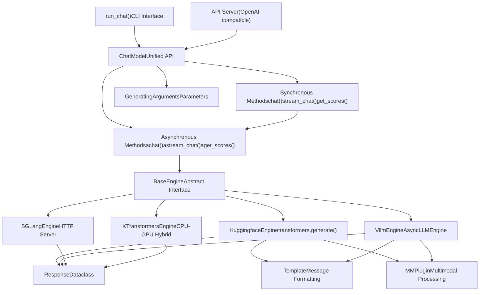
**来源：** [src/llamafactory/chat/chat\_model.py39-89](https://github.com/hiyouga/LlamaFactory/blob/355d5c5e/src/llamafactory/chat/chat_model.py#L39-L89) [src/llamafactory/chat/base\_engine.py39-99](https://github.com/hiyouga/LlamaFactory/blob/355d5c5e/src/llamafactory/chat/base_engine.py#L39-L99)

---

## ChatModel：统一接口

`ChatModel` 类提供了一个统一的推理接口，抽象了后端差异。它根据 `infer_backend` 参数自动选择并初始化合适的引擎。

### 初始化

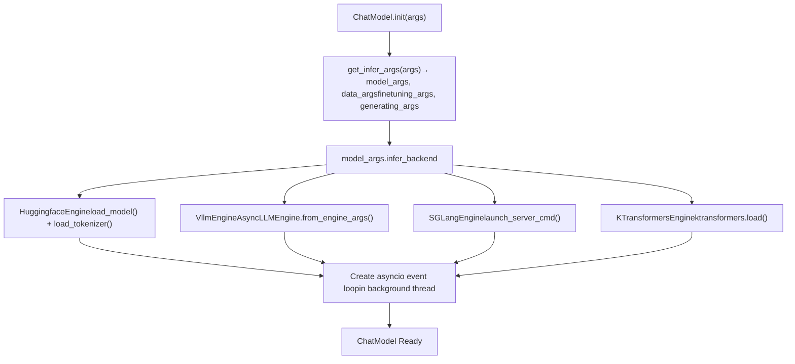
初始化过程：

1.  **解析参数**：使用 `get_infer_args()` 将输入字典转换为带类型的参数对象
2.  **选择引擎**：根据 `model_args.infer_backend` 实例化合适的引擎类
3.  **创建事件循环**：在后台线程中启动 asyncio 事件循环，以处理异步操作

**后端选择：**

| 后端 | 引擎类 | 主要使用场景 |
| --- | --- | --- |
| `hf` | `HuggingfaceEngine` | 开发、调试、多模态支持 |
| `vllm` | `VllmEngine` | 生产级高吞吐量推理 |
| `sglang` | `SGLangEngine` | 基于 HTTP 的服务、高级缓存 |
| `kt` | `KTransformersEngine` | CPU-GPU 混合、资源受限环境 |

**来源：** [src/llamafactory/chat/chat\_model.py47-89](https://github.com/hiyouga/LlamaFactory/blob/355d5c5e/src/llamafactory/chat/chat_model.py#L47-L89) [src/llamafactory/hparams/\_\_init\_\_.py](https://github.com/hiyouga/LlamaFactory/blob/355d5c5e/src/llamafactory/hparams/__init__.py)

---

## API 方法

`ChatModel` 类暴露了六个公共方法，包含三个核心操作的同步和异步版本：

### 方法概览表

| 同步 | 异步 | 目的 | 返回 |
| --- | --- | --- | --- |
| `chat()` | `achat()` | 单次完整响应 | `list[Response]` |
| `stream_chat()` | `astream_chat()` | 逐 token 流式响应 | `Generator[str]` / `AsyncGenerator[str]` |
| `get_scores()` | `aget_scores()` | 奖励模型评分 | `list[float]` |

### chat() - 完整响应

为给定的对话历史生成完整响应。在生成完成前保持阻塞。

**签名：**

```
def chat(    self,    messages: list[dict[str, str]],    system: Optional[str] = None,    tools: Optional[str] = None,    images: Optional[list["ImageInput"]] = None,    videos: Optional[list["VideoInput"]] = None,    audios: Optional[list["AudioInput"]] = None,    **input_kwargs,) -> list["Response"]
```
**参数：**

-   `messages`：带有 `role` 和 `content` 键的消息字典列表（OpenAI 格式）
-   `system`：可选系统提示词（覆盖默认值）
-   `tools`：用于函数调用的工具定义 JSON 字符串
-   `images`, `videos`, `audios`：多模态输入（文件路径或 URL）
-   `**input_kwargs`：覆盖生成参数（例如 `temperature`, `max_new_tokens`）

**响应对象：**

```
@dataclassclass Response:    response_text: str              # 生成文本    response_length: int            # 生成 token 数    prompt_length: int              # 提示词 token 数    finish_reason: Literal["stop", "length"]  # 生成停止原因
```
**来源：** [src/llamafactory/chat/chat\_model.py91-105](https://github.com/hiyouga/LlamaFactory/blob/355d5c5e/src/llamafactory/chat/chat_model.py#L91-L105) [src/llamafactory/chat/base\_engine.py31-37](https://github.com/hiyouga/LlamaFactory/blob/355d5c5e/src/llamafactory/chat/base_engine.py#L31-L37)

### stream\_chat() - 流式响应

逐 token 生成响应，在产生每个新 token 时立即返回。适用于实时 UI。

**实现流程：**

> **[Mermaid sequence]**
> *(图表结构无法解析)*

**来源：** [src/llamafactory/chat/chat\_model.py120-138](https://github.com/hiyouga/LlamaFactory/blob/355d5c5e/src/llamafactory/chat/chat_model.py#L120-L138)

### get\_scores() - 奖励模型评分

为一批文本输入计算奖励分数。仅适用于奖励模型（要求 `stage != "sft"`）。

**使用模式：**

```
# 仅限 HuggingfaceEngine（vLLM/SGLang 不支持评分）scores = chat_model.get_scores([    "This is a good response.",    "This is a bad response."], max_length=512)# 返回：[2.34, -1.56] (示例评分)
```
**实现：** 使用模型的价值头（value head）从 token 表示中计算标量分数。

**来源：** [src/llamafactory/chat/chat\_model.py155-162](https://github.com/hiyouga/LlamaFactory/blob/355d5c5e/src/llamafactory/chat/chat_model.py#L155-L162) [src/llamafactory/chat/hf\_engine.py312-332](https://github.com/hiyouga/LlamaFactory/blob/355d5c5e/src/llamafactory/chat/hf_engine.py#L312-332)

---

## 同步 vs. 异步 API

同步方法 (`chat`, `stream_chat`, `get_scores`) 被实现为异步方法的包装：

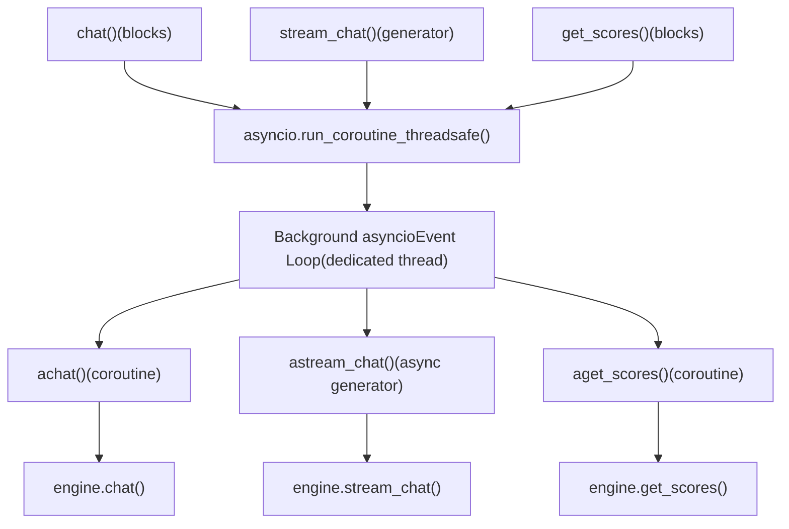
**为什么同时提供两套 API？**

-   **同步 API**：在脚本和 notebook 中更容易使用
-   **异步 API**：在服务器（例如 FastAPI）中处理并发请求效果更好

**来源：** [src/llamafactory/chat/chat\_model.py34-89](https://github.com/hiyouga/LlamaFactory/blob/355d5c5e/src/llamafactory/chat/chat_model.py#L34-L89)

---

## 生成参数

生成行为由 `GeneratingArguments` 控制，并且可以通过 `**input_kwargs` 在每次请求时进行覆盖：

### 参数配置

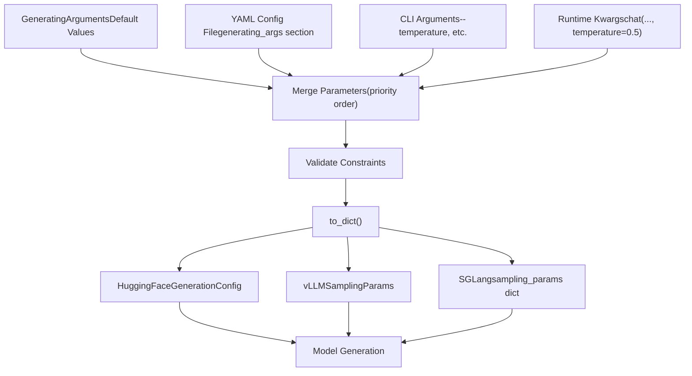
### 关键参数

| 参数 | 类型 | 默认值 | 描述 |
| --- | --- | --- | --- |
| `do_sample` | bool | `True` | 启用采样（对比贪婪搜索） |
| `temperature` | float | `0.95` | 采样温度 (0=贪婪, >1=更随机) |
| `top_p` | float | `0.7` | 核采样阈值 |
| `top_k` | int | `50` | Top-k 采样截止值 |
| `max_length` | int | `1024` | 最大总 token 数 (提示词 + 生成) |
| `max_new_tokens` | int | `1024` | 最大生成 token 数 (覆盖 max\_length) |
| `repetition_penalty` | float | `1.0` | 重复惩罚 (1.0=无惩罚) |
| `length_penalty` | float | `1.0` | 长度惩罚系数 (束搜索) |
| `num_beams` | int | `1` | 束搜索宽度 (1=无束搜索) |
| `skip_special_tokens` | bool | `True` | 从输出中移除特殊 token |
| `stop` | str/list | `None` | 自定义停止序列 |

### 参数覆盖

```
# 初始化时的默认参数chat_model = ChatModel({    "model_name_or_path": "meta-llama/Llama-2-7b-hf",    "temperature": 0.95,    "max_new_tokens": 1024,}) # 运行时覆盖responses = chat_model.chat(    messages=[{"role": "user", "content": "Hello"}],    temperature=0.1,      # 覆盖：更具确定性    max_new_tokens=50,    # 覆盖：响应更短    top_p=0.9,           # 覆盖：不同的核采样阈值)
```
**来源：** [src/llamafactory/hparams/generating\_args.py21-84](https://github.com/hiyouga/LlamaFactory/blob/355d5c5e/src/llamafactory/hparams/generating_args.py#L21-L84) [src/llamafactory/chat/hf\_engine.py121-174](https://github.com/hiyouga/LlamaFactory/blob/355d5c5e/src/llamafactory/chat/hf_engine.py#L121-L174)

---

## 消息格式与多模态输入

### 消息结构

消息遵循 OpenAI 聊天格式：

```
messages = [    {"role": "system", "content": "You are a helpful assistant."},  # 可选    {"role": "user", "content": "What's in this image? <image>"},    {"role": "assistant", "content": "I see a cat."},    {"role": "user", "content": "What breed?"},]
```
**角色：**

-   `system`：设置助手行为（也可以使用 `system` 参数）
-   `user`：用户消息
-   `assistant`：助手响应（用于多轮对话）

### 多模态输入处理

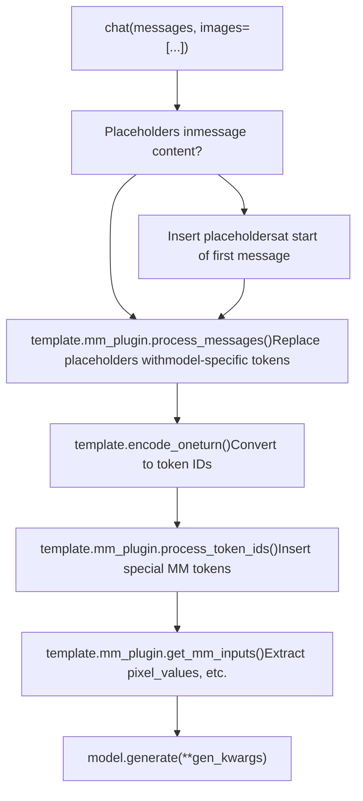
**占位符 Token：**

-   `<image>`：图像占位符
-   `<video>`：视频占位符
-   `<audio>`：音频占位符

**输入类型：**

```
# 图像输入（文件路径或 PIL Image 对象）images = [    "/path/to/image.jpg",    "https://example.com/image.png",    PIL.Image.open("image.jpg")] # 视频输入（文件路径）videos = ["/path/to/video.mp4"] # 音频输入（文件路径）audios = ["/path/to/audio.wav"]
```
**自动插入占位符：**

如果提供了多模态输入但消息中没有占位符，系统会自动将其添加到开头：

```
# 之前（用户输入）messages = [{"role": "user", "content": "Describe this."}]images = ["image.jpg"] # 自动插入之后messages = [{"role": "user", "content": "<image>Describe this."}]
```
**来源：** [src/llamafactory/chat/hf\_engine.py86-117](https://github.com/hiyouga/LlamaFactory/blob/355d5c5e/src/llamafactory/chat/hf_engine.py#L86-L117) [src/llamafactory/chat/vllm\_engine.py122-133](https://github.com/hiyouga/LlamaFactory/blob/355d5c5e/src/llamafactory/chat/vllm_engine.py#L122-L133)

---

## CLI 聊天接口

`run_chat()` 函数提供了一个交互式命令行聊天接口。

### 用法

```
# 基础用法llamafactory-cli chat examples/inference/qwen3_lora_sft.yaml # 或使用显式参数llamafactory-cli chat \    --model_name_or_path meta-llama/Llama-2-7b-hf \    --template llama2 \    --finetuning_type lora \    --adapter_name_or_path ./output
```
### 实现

> **[Mermaid stateDiagram]**
> *(图表结构无法解析)*

**特殊命令：**

-   `exit`：退出程序
-   `clear`：清除对话历史并释放 GPU 显存

**示例会话：**

```
Welcome to the CLI application, use `clear` to remove the history, use `exit` to exit the application.

User: Hello!
Assistant: Hi! How can I help you today?

User: What's 2+2?
Assistant: 2 + 2 equals 4.

User: clear
History has been removed.

User: exit
```
**来源：** [src/llamafactory/chat/chat\_model.py173-211](https://github.com/hiyouga/LlamaFactory/blob/355d5c5e/src/llamafactory/chat/chat_model.py#L173-L211)

---

## OpenAI 风格 API 服务器

LlamaFactory 可以启动一个兼容 OpenAI 的 API 服务器用于生产部署。

### 启动服务器

```
# 基础启动llamafactory-cli api examples/inference/qwen3_lora_sft.yaml # 带自定义配置启动llamafactory-cli api \    --model_name_or_path meta-llama/Llama-2-7b-hf \    --template llama2 \    --infer_backend vllm \    --vllm_gpu_util 0.9
```
### API 端点

服务器实现了兼容 OpenAI 的端点：

| 端点 | 方法 | 目的 |
| --- | --- | --- |
| `/v1/chat/completions` | POST | 聊天补全（流式/非流式） |
| `/v1/models` | GET | 列出可用模型 |
| `/v1/completions` | POST | 文本补全 |
| `/health` | GET | 健康检查 |

### 请求格式

```
import requests # 非流式请求response = requests.post(    "http://localhost:8000/v1/chat/completions",    json={        "model": "llama-2-7b",        "messages": [            {"role": "user", "content": "Hello!"}        ],        "temperature": 0.7,        "max_tokens": 100,        "stream": False    }) # 流式请求response = requests.post(    "http://localhost:8000/v1/chat/completions",    json={        "model": "llama-2-7b",        "messages": [{"role": "user", "content": "Count to 10"}],        "stream": True    },    stream=True) for line in response.iter_lines():    if line:        print(line.decode('utf-8'))
```
### Python 客户端用法

```
from openai import OpenAI # 初始化客户端client = OpenAI(    base_url="http://localhost:8000/v1",    api_key="dummy"  # 不使用但 OpenAI SDK 需要) # 非流式response = client.chat.completions.create(    model="llama-2-7b",    messages=[{"role": "user", "content": "Hello!"}],    temperature=0.7)print(response.choices[0].message.content) # 流式stream = client.chat.completions.create(    model="llama-2-7b",    messages=[{"role": "user", "content": "Count to 10"}],    stream=True)for chunk in stream:    if chunk.choices[0].delta.content:        print(chunk.choices[0].delta.content, end="")
```
**来源：** [examples/README.md213-217](https://github.com/hiyouga/LlamaFactory/blob/355d5c5e/examples/README.md?plain=1#L213-L217) [examples/README\_zh.md214-217](https://github.com/hiyouga/LlamaFactory/blob/355d5c5e/examples/README_zh.md?plain=1#L214-L217)

---

## 引擎特定功能

### HuggingFaceEngine

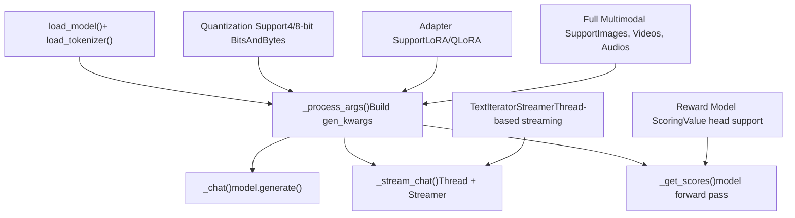
**关键功能：**

-   通过 `transformers.GenerationConfig` 完全控制生成
-   支持 transformers 中所有的模型架构
-   可以运行奖励模型进行评分
-   灵活的多模态处理

**限制：**

-   批量推理速度慢于 vLLM
-   每次请求的显存占用更高
-   吞吐量受限

**来源：** [src/llamafactory/chat/hf\_engine.py44-413](https://github.com/hiyouga/LlamaFactory/blob/355d5c5e/src/llamafactory/chat/hf_engine.py#L44-L413)

### VllmEngine

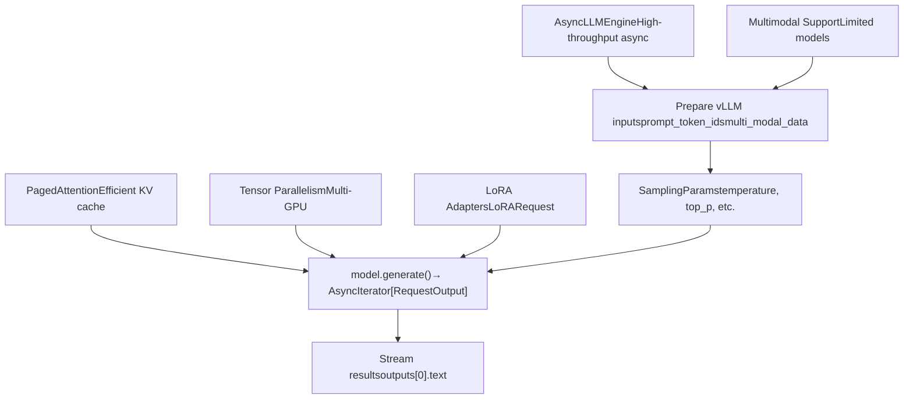
**关键功能：**

-   批量推理速度比 HuggingFace 快 2-3 倍
-   PagedAttention 减少显存占用
-   跨 GPU 自动张量并行
-   高效的连续批处理 (Continuous batching)

**限制：**

-   不支持奖励模型评分
-   多模态模型支持有限
-   需要 CUDA（无 CPU 回退）

**配置：**

```
# vLLM 特定配置chat_model = ChatModel({    "model_name_or_path": "meta-llama/Llama-2-7b-hf",    "infer_backend": "vllm",    "vllm_maxlen": 4096,           # 上下文长度    "vllm_gpu_util": 0.9,          # GPU 显存利用率    "vllm_enforce_eager": False,   # 使用 CUDA graphs    "vllm_max_lora_rank": 64,      # 最大 LoRA 秩    "vllm_config": {               # 额外 vLLM 参数        "enable_chunked_prefill": True,    }})
```
**来源：** [src/llamafactory/chat/vllm\_engine.py46-272](https://github.com/hiyouga/LlamaFactory/blob/355d5c5e/src/llamafactory/chat/vllm_engine.py#L46-L272) [scripts/vllm\_infer.py47-279](https://github.com/hiyouga/LlamaFactory/blob/355d5c5e/scripts/vllm_infer.py#L47-L279)

### SGLangEngine

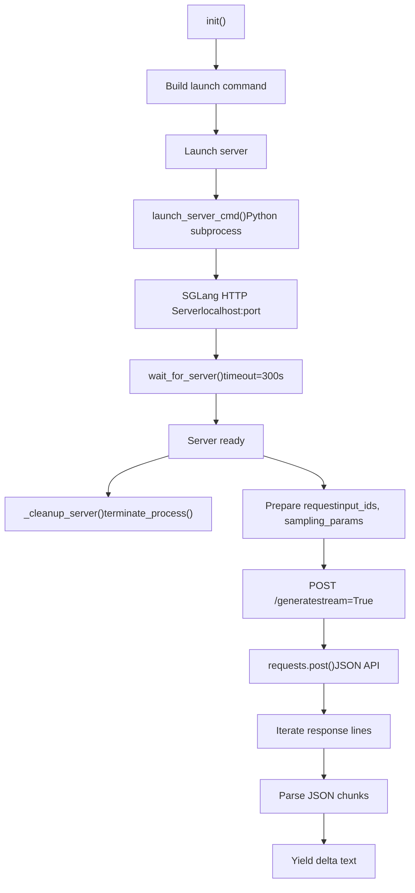
**关键功能：**

-   基于 HTTP 的服务（更适合生产环境）
-   高级 RadixAttention 缓存
-   通过 `lora_backend` 选项支持 LoRA
-   自动服务器进程管理

**服务器生命周期：**

-   服务器在第一次请求时启动
-   向 `atexit` 注册进行清理
-   退出时自动终止

**配置：**

```
chat_model = ChatModel({    "model_name_or_path": "meta-llama/Llama-2-7b-hf",    "infer_backend": "sglang",    "sglang_maxlen": 4096,              # 上下文长度    "sglang_mem_fraction": 0.9,         # 显存占用比例    "sglang_tp_size": 1,                # 张量并行度    "sglang_lora_backend": "punica",    # LoRA 后端})
```
**来源：** [src/llamafactory/chat/sglang\_engine.py46-290](https://github.com/hiyouga/LlamaFactory/blob/355d5c5e/src/llamafactory/chat/sglang_engine.py#L46-L290)

---

## 并发控制

`HuggingfaceEngine` 使用信号量控制并发请求：

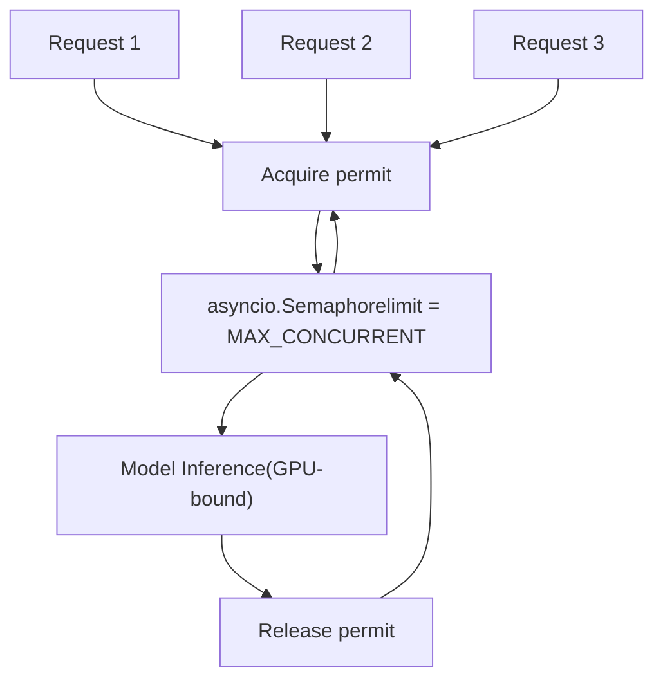
**配置：**

```
# 设置最大并发请求数export MAX_CONCURRENT=4 # 默认是 1 (顺序处理)
```
**何时调整：**

-   **可用 GPU 显存充足**：增加并发以获得更好的吞吐量
-   **出现显存溢出错误**：减少并发以降低显存压力
-   **vLLM/SGLang**：建议使用它们内置的批处理机制

**来源：** [src/llamafactory/chat/hf\_engine.py70](https://github.com/hiyouga/LlamaFactory/blob/355d5c5e/src/llamafactory/chat/hf_engine.py#L70-L70)

---

## 使用示例

### 基础对话

```
from llamafactory.chat import ChatModel # 初始化模型chat_model = ChatModel({    "model_name_or_path": "meta-llama/Llama-2-7b-hf",    "template": "llama2",}) # 单轮对话messages = [{"role": "user", "content": "What is 2+2?"}]responses = chat_model.chat(messages)print(responses[0].response_text)  # "2 + 2 equals 4." # 多轮对话messages = [    {"role": "user", "content": "My name is Alice."},]responses = chat_model.chat(messages)messages.append({"role": "assistant", "content": responses[0].response_text}) messages.append({"role": "user", "content": "What's my name?"})responses = chat_model.chat(messages)print(responses[0].response_text)  # "Your name is Alice."
```
### 流式对话

```
messages = [{"role": "user", "content": "Count from 1 to 5."}] print("Assistant: ", end="", flush=True)for token in chat_model.stream_chat(messages):    print(token, end="", flush=True)print()  # 完成后换行
```
### 多模态对话

```
# 图像理解messages = [{"role": "user", "content": "<image>What's in this image?"}]images = ["/path/to/image.jpg"]responses = chat_model.chat(messages, images=images) # 多图像messages = [{"role": "user", "content": "<image><image>Compare these images."}]images = ["image1.jpg", "image2.jpg"]responses = chat_model.chat(messages, images=images) # 视频理解messages = [{"role": "user", "content": "<video>Describe this video."}]videos = ["/path/to/video.mp4"]responses = chat_model.chat(messages, videos=videos)
```
### 参数覆盖

```
# 确定性生成responses = chat_model.chat(    messages,    temperature=0.0,  # 贪婪解码    do_sample=False,) # 创意生成responses = chat_model.chat(    messages,    temperature=1.5,    # 较高随机性    top_p=0.95,        # 核采样    repetition_penalty=1.2,  # 惩罚重复) # 长度控制responses = chat_model.chat(    messages,    max_new_tokens=50,  # 短响应)
```
### 奖励模型评分

```
# 加载奖励模型chat_model = ChatModel({    "model_name_or_path": "weqweasdas/RM-Gemma-2B",    "template": "gemma",    "stage": "rm",  # 奖励模型阶段}) # 为多个响应评分candidates = [    "This is a helpful and detailed answer.",    "This is a brief answer.",    "This response is off-topic.",]scores = chat_model.get_scores(candidates)print(scores)  # [2.45, 1.23, -0.89] (示例) # 选择最佳响应best_idx = scores.index(max(scores))best_response = candidates[best_idx]
```
### vLLM 批量推理脚本

```
# 使用 vllm_infer.py 进行评估# 见 scripts/vllm_infer.py 获取完整实现 python scripts/vllm_infer.py \    --model_name_or_path Qwen/Qwen2.5-7B-Instruct \    --template qwen \    --dataset alpaca_en_demo \    --batch_size 256 \    --max_new_tokens 512 \    --temperature 0.0 \    --save_name predictions.jsonl \    --matrix_save_name metrics.json
```
**来源：** [src/llamafactory/chat/chat\_model.py91-211](https://github.com/hiyouga/LlamaFactory/blob/355d5c5e/src/llamafactory/chat/chat_model.py#L91-L211) [scripts/vllm\_infer.py47-283](https://github.com/hiyouga/LlamaFactory/blob/355d5c5e/scripts/vllm_infer.py#L47-L283)

---

## 错误处理

### 常见错误与解决方案

| 错误 | 原因 | 解决方案 |
| --- | --- | --- |
| `ValueError: The current model does not support chat` | 使用了奖励模型进行生成 | 加载时设置 `stage="sft"` 或使用 `get_scores()` |
| `ImportError: vLLM not install` | 选择了 vLLM 后端但未安装 | `pip install vllm` 或使用 `infer_backend="huggingface"` |
| `RuntimeError: SGLang server initialization failed` | 服务器启动失败 | 检查 GPU 可用性和日志 |
| `ValueError: Cannot get scores using an auto-regressive model` | 尝试使用生成模型进行评分 | 加载奖励模型并设置 `stage="rm"` |
| `CUDA out of memory` | 批次过大或上下文过长 | 减小 `batch_size`, `max_length`, 或使用 `vllm_gpu_util=0.8` |

### 校验流程

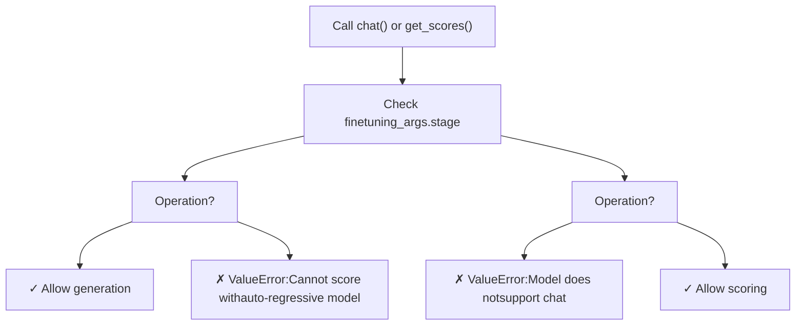
**来源：** [src/llamafactory/chat/hf\_engine.py345-408](https://github.com/hiyouga/LlamaFactory/blob/355d5c5e/src/llamafactory/chat/hf_engine.py#L345-L408)

---

## 性能考量

### 引擎选择指南

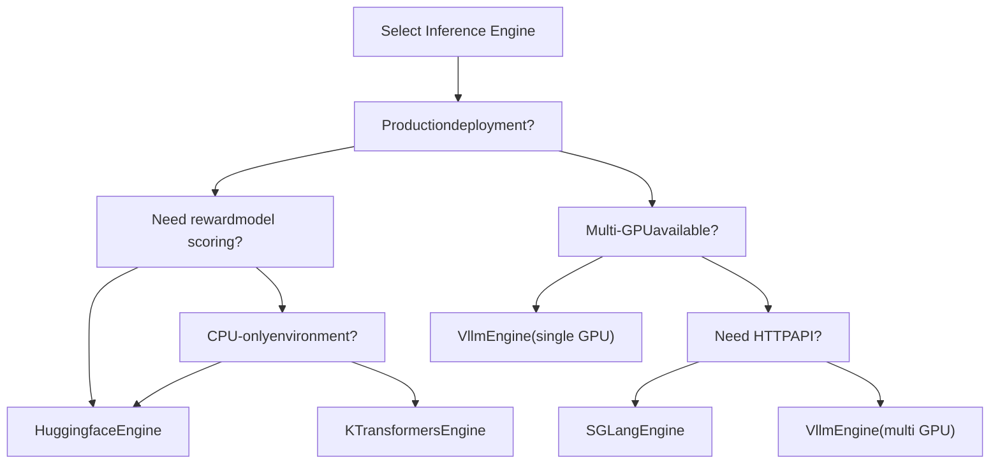
### 吞吐量对比

| 引擎 | 单个请求 | 批量 (32) | 多 GPU | 显存效率 |
| --- | --- | --- | --- | --- |
| HuggingFace | 基准 (1x) | 1x | 手动 DDP | 基准 |
| vLLM | 0.9x | 2.5-3x | 自动 | 2 倍提升 (PagedAttention) |
| SGLang | 0.9x | 2.5-3x | 自动 | 2 倍提升 (RadixAttention) |
| KTransformers | 0.5x (CPU) | 0.5x | 否 | 3 倍提升 (CPU offload) |

**优化技巧：**

1.  **生产环境使用 vLLM/SGLang**：吞吐量提高 2-3 倍
2.  **启用连续批处理**：在 vLLM/SGLang 中是自动的
3.  **调节 `vllm_gpu_util`**：在吞吐量和 OOM 风险之间寻找平衡
4.  **使用 FlashAttention**：可用时默认开启
5.  **量化**：4/8-bit 量化可减少显存占用，但会有轻微速度损失

**来源：** [src/llamafactory/chat/vllm\_engine.py46-54](https://github.com/hiyouga/LlamaFactory/blob/355d5c5e/src/llamafactory/chat/vllm_engine.py#L46-L54) [src/llamafactory/chat/sglang\_engine.py46-56](https://github.com/hiyouga/LlamaFactory/blob/355d5c5e/src/llamafactory/chat/sglang_engine.py#L46-L56)

---

## 总结

LlamaFactory 聊天接口提供：

-   **统一 API**：`ChatModel` 抽象了引擎差异
-   **多后端**：HuggingFace, vLLM, SGLang, KTransformers
-   **灵活的 API**：同步/异步, 流式/非流式, 评分
-   **多模态支持**：图像、视频、音频，并自动处理占位符
-   **生产就绪**：兼容 OpenAI 的 API 服务器
-   **易于使用**：简单的 CLI 聊天接口

**关键类：**

-   `ChatModel` [src/llamafactory/chat/chat\_model.py39](https://github.com/hiyouga/LlamaFactory/blob/355d5c5e/src/llamafactory/chat/chat_model.py#L39-L39)
-   `BaseEngine` [src/llamafactory/chat/base\_engine.py39](https://github.com/hiyouga/LlamaFactory/blob/355d5c5e/src/llamafactory/chat/base_engine.py#L39-L39)
-   `HuggingfaceEngine` [src/llamafactory/chat/hf\_engine.py44](https://github.com/hiyouga/LlamaFactory/blob/355d5c5e/src/llamafactory/chat/hf_engine.py#L44-L44)
-   `VllmEngine` [src/llamafactory/chat/vllm\_engine.py46](https://github.com/hiyouga/LlamaFactory/blob/355d5c5e/src/llamafactory/chat/vllm_engine.py#L46-L46)
-   `SGLangEngine` [src/llamafactory/chat/sglang\_engine.py46](https://github.com/hiyouga/LlamaFactory/blob/355d5c5e/src/llamafactory/chat/sglang_engine.py#L46-L46)
-   `Response` [src/llamafactory/chat/base\_engine.py31](https://github.com/hiyouga/LlamaFactory/blob/355d5c5e/src/llamafactory/chat/base_engine.py#L31-L31)
-   `GeneratingArguments` [src/llamafactory/hparams/generating\_args.py22](https://github.com/hiyouga/LlamaFactory/blob/355d5c5e/src/llamafactory/hparams/generating_args.py#L22-L22)
