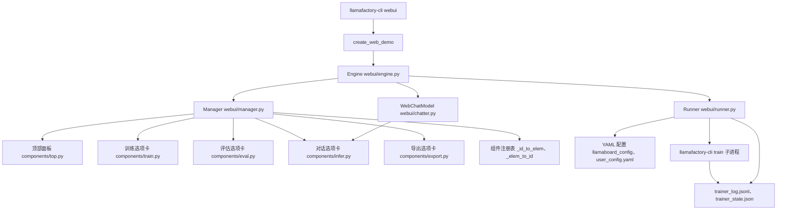
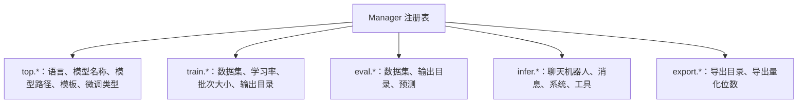
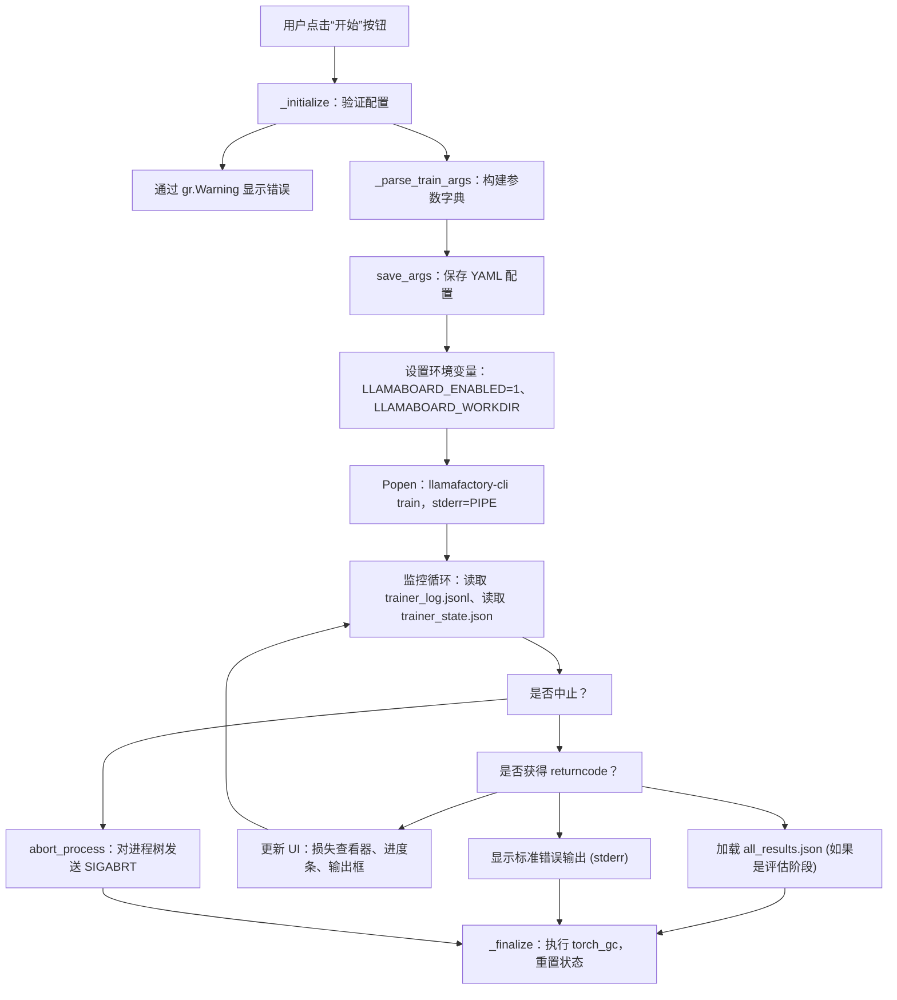
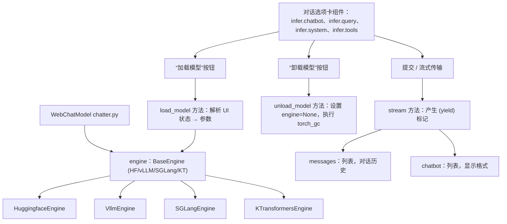
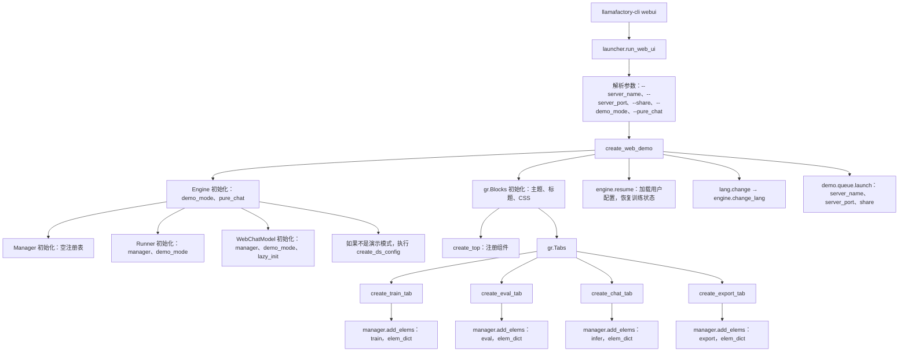

# Web UI (LLaMA Board)

相关源码文件

-   [examples/README.md](https://github.com/hiyouga/LlamaFactory/blob/355d5c5e/examples/README.md?plain=1)
-   [examples/README\_zh.md](https://github.com/hiyouga/LlamaFactory/blob/355d5c5e/examples/README_zh.md?plain=1)
-   [src/llamafactory/chat/base\_engine.py](https://github.com/hiyouga/LlamaFactory/blob/355d5c5e/src/llamafactory/chat/base_engine.py)
-   [src/llamafactory/chat/chat\_model.py](https://github.com/hiyouga/LlamaFactory/blob/355d5c5e/src/llamafactory/chat/chat_model.py)
-   [src/llamafactory/cli.py](https://github.com/hiyouga/LlamaFactory/blob/355d5c5e/src/llamafactory/cli.py)
-   [src/llamafactory/v1/launcher.py](https://github.com/hiyouga/LlamaFactory/blob/355d5c5e/src/llamafactory/v1/launcher.py)
-   [src/llamafactory/webui/chatter.py](https://github.com/hiyouga/LlamaFactory/blob/355d5c5e/src/llamafactory/webui/chatter.py)
-   [src/llamafactory/webui/common.py](https://github.com/hiyouga/LlamaFactory/blob/355d5c5e/src/llamafactory/webui/common.py)
-   [src/llamafactory/webui/components/export.py](https://github.com/hiyouga/LlamaFactory/blob/355d5c5e/src/llamafactory/webui/components/export.py)
-   [src/llamafactory/webui/components/top.py](https://github.com/hiyouga/LlamaFactory/blob/355d5c5e/src/llamafactory/webui/components/top.py)
-   [src/llamafactory/webui/components/train.py](https://github.com/hiyouga/LlamaFactory/blob/355d5c5e/src/llamafactory/webui/components/train.py)
-   [src/llamafactory/webui/engine.py](https://github.com/hiyouga/LlamaFactory/blob/355d5c5e/src/llamafactory/webui/engine.py)
-   [src/llamafactory/webui/locales.py](https://github.com/hiyouga/LlamaFactory/blob/355d5c5e/src/llamafactory/webui/locales.py)
-   [src/llamafactory/webui/manager.py](https://github.com/hiyouga/LlamaFactory/blob/355d5c5e/src/llamafactory/webui/manager.py)
-   [src/llamafactory/webui/runner.py](https://github.com/hiyouga/LlamaFactory/blob/355d5c5e/src/llamafactory/webui/runner.py)

## 目的与范围

Web UI (LLaMA Board) 提供了一个基于 Gradio 的图形化界面，用于训练、评估、对话和导出大语言模型。它将 CLI 功能封装在易于访问的浏览器界面中，允许用户配置训练任务、监控进度、交互式测试模型以及导出训练好的适配器，而无需编写命令行参数。

本页面涵盖了 Web UI 的架构、组件管理、训练编排和对话界面。关于底层的训练机制，请参阅[训练系统](/hiyouga/LlamaFactory/6-training-system)。关于推理引擎的细节，请参阅[推理引擎](/hiyouga/LlamaFactory/7.1-inference-engines)。关于命令行用法，请参阅[CLI 命令与用法](/hiyouga/LlamaFactory/2.2-cli-commands-and-usage)。

---

## 架构概览

### 系统组件

Web UI 由四个主要类组成，它们协同工作以提供完整功能：

**高层 Web UI 架构**


**来源：** [src/llamafactory/webui/engine.py1-84](https://github.com/hiyouga/LlamaFactory/blob/355d5c5e/src/llamafactory/webui/engine.py#L1-L84) [src/llamafactory/webui/manager.py1-71](https://github.com/hiyouga/LlamaFactory/blob/355d5c5e/src/llamafactory/webui/manager.py#L1-L71) [src/llamafactory/webui/runner.py1-506](https://github.com/hiyouga/LlamaFactory/blob/355d5c5e/src/llamafactory/webui/runner.py#L1-L506) [src/llamafactory/webui/chatter.py1-247](https://github.com/hiyouga/LlamaFactory/blob/355d5c5e/src/llamafactory/webui/chatter.py#L1-L247)

| 类 | 文件 | 目的 |
| --- | --- | --- |
| `Engine` | [webui/engine.py](https://github.com/hiyouga/LlamaFactory/blob/355d5c5e/webui/engine.py) | 中心控制器，实例化 Manager、Runner 和 WebChatModel；协调初始化和语言更改 |
| `Manager` | [webui/manager.py](https://github.com/hiyouga/LlamaFactory/blob/355d5c5e/webui/manager.py) | 组件注册表，维护元素 ID (如 `"top.model_name"`) 与 Gradio 组件之间的双向映射 |
| `Runner` | [webui/runner.py](https://github.com/hiyouga/LlamaFactory/blob/355d5c5e/webui/runner.py) | 训练编排器，验证参数、启动 `llamafactory-cli train` 子进程并监控进度 |
| `WebChatModel` | [webui/chatter.py](https://github.com/hiyouga/LlamaFactory/blob/355d5c5e/webui/chatter.py) | 推理管理器，按需加载模型并提供流式对话界面 |

---

## 组件管理系统

### Manager 注册表

`Manager` 类维护一个所有 Gradio 组件的集中注册表，使其他类能够通过分层的字符串 ID 访问 UI 元素。

**组件 ID 结构**


**来源：** [src/llamafactory/webui/manager.py23-71](https://github.com/hiyouga/LlamaFactory/blob/355d5c5e/src/llamafactory/webui/manager.py#L23-L71)

Manager 提供了四个关键方法：

| 方法 | 目的 | 示例 |
| --- | --- | --- |
| `add_elems(tab_name, elem_dict)` | 使用命名空间 ID 注册组件 | `add_elems("train", {"dataset": gr.Dropdown(...)})` 创建 `"train.dataset"` |
| `get_elem_by_id(elem_id)` | 通过 ID 检索组件 | `get_elem_by_id("top.model_name")` 返回模型名称下拉框 |
| `get_id_by_elem(elem)` | 从组件反向查找 ID | 在 Runner 中用于构建配置字典 |
| `get_base_elems()` | 返回常用的顶部面板元素 | 返回 `top.*` 元素集，以便在各个选项卡中重用 |

**实现细节：**

[src/llamafactory/webui/manager.py26-36](https://github.com/hiyouga/LlamaFactory/blob/355d5c5e/src/llamafactory/webui/manager.py#L26-L36) - `add_elems` 方法通过连接选项卡名称和元素名称来构造 ID：`elem_id = f"{tab_name}.{elem_name}"`，然后在 `_id_to_elem` 和 `_elem_to_id` 字典中维护双向映射。

[src/llamafactory/webui/manager.py46-55](https://github.com/hiyouga/LlamaFactory/blob/355d5c5e/src/llamafactory/webui/manager.py#L46-L55) - 查找方法通过 ID 提供对组件的 O(1) 访问，或通过组件引用提供反向查找。

---

## 训练工作流

### 进程编排

`Runner` 类管理完整的训练生命周期：验证 → 参数构建 → 启动子进程 → 监控日志 → 完成处理。

**训练执行流**


**来源：** [src/llamafactory/webui/runner.py357-461](https://github.com/hiyouga/LlamaFactory/blob/355d5c5e/src/llamafactory/webui/runner.py#L357-L461)

### 参数构建

Runner 通过 Manager 从 Gradio 组件中提取值来构建训练参数：

**参数构造模式 (训练)**

[src/llamafactory/webui/runner.py126-290](https://github.com/hiyouga/LlamaFactory/blob/355d5c5e/src/llamafactory/webui/runner.py#L126-L290) - `_parse_train_args` 方法：

1.  **提取 UI 值**：使用 `get = lambda elem_id: data[self.manager.get_elem_by_id(elem_id)]`
2.  **构建基础参数字典**：包含阶段、模型路径、数据集、超参数等
3.  **根据微调类型条件性地添加配置**：
    -   **LoRA 配置** [第 202-218 行](https://github.com/hiyouga/LlamaFactory/blob/355d5c5e/lines 202-218)：`lora_rank`、`lora_alpha`、`lora_dropout`、`lora_target`
    -   **Freeze 配置** [第 196-200 行](https://github.com/hiyouga/LlamaFactory/blob/355d5c5e/lines 196-200)：`freeze_trainable_layers`、`freeze_trainable_modules`
    -   **RLHF 配置** [第 219-236 行](https://github.com/hiyouga/LlamaFactory/blob/355d5c5e/lines 219-236)：PPO 的奖励模型路径，DPO/KTO 的 `pref_beta`
    -   **多模态配置** [第 238-246 行](https://github.com/hiyouga/LlamaFactory/blob/355d5c5e/lines 238-246)：视觉塔冻结、图像/视频像素范围
    -   **优化器配置** [第 248-267 行](https://github.com/hiyouga/LlamaFactory/blob/355d5c5e/lines 248-267)：GaLore、APOLLO、BAdam 参数
4.  **合并 extra\_args** JSON [第 179 行](https://github.com/hiyouga/LlamaFactory/blob/355d5c5e/line 179)
5.  **如果启用，添加 DeepSpeed 配置路径** [第 284-288 行](https://github.com/hiyouga/LlamaFactory/blob/355d5c5e/lines 284-288)

### 子进程管理

**子进程生命周期**

[src/llamafactory/webui/runner.py376-379](https://github.com/hiyouga/LlamaFactory/blob/355d5c5e/src/llamafactory/webui/runner.py#L376-L379) - 训练通过以下方式启动：

```python
self.trainer = Popen(
    ["llamafactory-cli", "train", save_cmd(args)],
    env=env,
    stderr=PIPE,
    text=True
)
```
子进程运行时带有特殊的环境变量：

-   `LLAMABOARD_ENABLED=1` - 通知训练代码将日志写入特定文件
-   `LLAMABOARD_WORKDIR` - 指定写入 `trainer_log.jsonl` 和 `trainer_state.json` 的位置
-   `FORCE_TORCHRUN=1` - 如果启用了 DeepSpeed，则强制使用 torchrun 封装器

**日志监控模式**

[src/llamafactory/webui/runner.py404-460](https://github.com/hiyouga/LlamaFactory/blob/355d5c5e/src/llamafactory/webui/runner.py#L404-L460) - `monitor` 方法：

1.  **轮询子进程**，超时时间为 2 秒 [第 441-445 行](https://github.com/hiyouga/LlamaFactory/blob/355d5c5e/lines 441-445)
2.  **通过 control.get\_trainer\_info() 读取日志** [第 428 行](https://github.com/hiyouga/LlamaFactory/blob/355d5c5e/line 428)，该方法解析：
    -   `trainer_log.jsonl`：获取损失值和日志消息
    -   `trainer_state.json`：获取进度 (当前 epoch、全局步数)
    -   系统指标中的显存使用情况
3.  **更新 UI 组件**：
    -   `output_box` - 运行日志文本 [第 430 行](https://github.com/hiyouga/LlamaFactory/blob/355d5c5e/line 430)
    -   `progress_bar` - 训练进度百分比 [第 431 行](https://github.com/hiyouga/LlamaFactory/blob/355d5c5e/line 431)
    -   `loss_viewer` - 损失曲线图 [第 434 行](https://github.com/hiyouga/LlamaFactory/blob/355d5c5e/line 434)
    -   `swanlab_link` - 如果启用了 SwanLab，显示外部监控链接 [第 437 行](https://github.com/hiyouga/LlamaFactory/blob/355d5c5e/line 437)
4.  **产生 (yield) 更新**到 Gradio 以进行流式显示 [第 439 行](https://github.com/hiyouga/LlamaFactory/blob/355d5c5e/line 439)

### 中止处理

[src/llamafactory/webui/runner.py69-72](https://github.com/hiyouga/LlamaFactory/blob/355d5c5e/src/llamafactory/webui/runner.py#L69-L72) - `set_abort` 方法设置 `self.aborted = True` 并调用 `abort_process(self.trainer.pid)`。

[src/llamafactory/webui/common.py46-56](https://github.com/hiyouga/LlamaFactory/blob/355d5c5e/src/llamafactory/webui/common.py#L46-L56) - `abort_process` 使用 `SIGABRT` 自底向上递归地杀死子进程，确保分布式训练任务 (具有多个进程的 torchrun) 被完全终止。

---

## 配置持久化

### YAML 配置系统

Web UI 支持将训练配置保存为 YAML 文件或从中加载，从而实现可复现性和共享。

**配置流**

**来源：** [src/llamafactory/webui/runner.py381-390](https://github.com/hiyouga/LlamaFactory/blob/355d5c5e/src/llamafactory/webui/runner.py#L381-L390) [src/llamafactory/webui/runner.py462-490](https://github.com/hiyouga/LlamaFactory/blob/355d5c5e/src/llamafactory/webui/runner.py#L462-L490) [src/llamafactory/webui/common.py154-167](https://github.com/hiyouga/LlamaFactory/blob/355d5c5e/src/llamafactory/webui/common.py#L154-L167)

**保存操作：**

[src/llamafactory/webui/runner.py462-476](https://github.com/hiyouga/LlamaFactory/blob/355d5c5e/src/llamafactory/webui/runner.py#L462-L476) - `save_args` 方法：

-   首先验证配置
-   保存到 `llamaboard_config/<config_path>.yaml` (用户指定的名称)
-   跳过 `top.lang`、`top.model_path`、`train.output_dir`、`train.config_path` [第 384 行](https://github.com/hiyouga/LlamaFactory/blob/355d5c5e/line 384)

[src/llamafactory/webui/runner.py368-369](https://github.com/hiyouga/LlamaFactory/blob/355d5c5e/src/llamafactory/webui/runner.py#L368-L369) - 在启动训练期间，还将配置保存到输出目录中，文件名为 `llamaboard_config.yaml`，以便在恢复时自动恢复。

**加载操作：**

[src/llamafactory/webui/runner.py478-490](https://github.com/hiyouga/LlamaFactory/blob/355d5c5e/src/llamafactory/webui/runner.py#L478-L490) - `load_args` 方法：

-   从 `llamaboard_config/` 目录读取 YAML
-   遍历配置字典并通过 `manager.get_elem_by_id(elem_id)` 更新组件
-   返回将组件映射到新值的字典，以供 Gradio 更新

[src/llamafactory/webui/runner.py492-505](https://github.com/hiyouga/LlamaFactory/blob/355d5c5e/src/llamafactory/webui/runner.py#L492-L505) - `check_output_dir` 方法在恢复训练时自动恢复配置：

-   检查输出目录是否存在
-   如果找到，从该目录加载 `llamaboard_config.yaml`
-   使用之前的训练配置填充 UI

---

## 对话界面

### WebChatModel 架构
`WebChatModel` 类扩展了 `ChatModel` [src/llamafactory/chat/chat\_model.py39-211](https://github.com/hiyouga/LlamaFactory/blob/355d5c5e/src/llamafactory/chat/chat_model.py#L39-L211)，以提供 Web UI 特有的模型加载和推理。

**对话系统组件**


**来源：** [src/llamafactory/webui/chatter.py80-247](https://github.com/hiyouga/LlamaFactory/blob/355d5c5e/src/llamafactory/webui/chatter.py#L80-L247) [src/llamafactory/chat/chat\_model.py39-89](https://github.com/hiyouga/LlamaFactory/blob/355d5c5e/src/llamafactory/chat/chat_model.py#L39-L89)

### 模型加载工作流

[src/llamafactory/webui/chatter.py101-159](https://github.com/hiyouga/LlamaFactory/blob/355d5c5e/src/llamafactory/webui/chatter.py#L101-L159) - `load_model` 方法：

1.  **验证状态**：
    -   检查模型是否已加载 [第 108 行](https://github.com/hiyouga/LlamaFactory/blob/355d5c5e/line 108)
    -   验证必填字段 (model\_name, model\_path) [第 110-113 行](https://github.com/hiyouga/LlamaFactory/blob/355d5c5e/lines 110-113)
    -   在演示模式下阻止加载 [第 114-115 行](https://github.com/hiyouga/LlamaFactory/blob/355d5c5e/line 114-115)
    -   验证 extra\_args JSON [第 117-120 行](https://github.com/hiyouga/LlamaFactory/blob/355d5c5e/lines 117-120)
2.  **构建参数字典**，类似于训练阶段 [第 128-140 行](https://github.com/hiyouga/LlamaFactory/blob/355d5c5e/lines 128-140)：
    -   模型路径和缓存目录
    -   模板、RoPE 缩放、注意力加速器
    -   推理后端 (`infer_backend`) 和数据类型 (`infer_dtype`)
    -   合并 extra\_args JSON
3.  **处理检查点和量化** [第 143-156 行](https://github.com/hiyouga/LlamaFactory/blob/355d5c5e/lines 143-156)：
    -   对于 PEFT 方法：用逗号连接适配器路径
    -   对于全参数模型：用检查点路径替换基座路径
    -   如果指定，添加量化配置
4.  **调用父类 ChatModel.\_\_init\_\_** [第 158 行](https://github.com/hiyouga/LlamaFactory/blob/355d5c5e/line 158)，该函数执行：
    -   通过合适的引擎后端加载模型
    -   初始化分词器和模板
    -   设置用于流式传输的异步循环
5.  **产生 (yield) 状态消息** [第 127、159 行](https://github.com/hiyouga/LlamaFactory/blob/355d5c5e/lines 127, 159)，以便在加载期间更新 UI

### 流式对话实现

[src/llamafactory/webui/chatter.py193-246](https://github.com/hiyouga/LlamaFactory/blob/355d5c5e/src/llamafactory/webui/chatter.py#L193-L246) - `stream` 方法：

**流式对话流程**

> **[Mermaid sequence]**
> *(图表结构无法解析)*

**来源：** [src/llamafactory/webui/chatter.py193-246](https://github.com/hiyouga/LlamaFactory/blob/355d5c5e/src/llamafactory/webui/chatter.py#L193-L246)

**关键特性：**

-   **支持思考模式** [第 215 行](https://github.com/hiyouga/LlamaFactory/blob/355d5c5e/line 215)：使用上下文管理器临时重写 `engine.template.enable_thinking`
-   **工具调用检测** [第 231-239 行](https://github.com/hiyouga/LlamaFactory/blob/355d5c5e/lines 231-239)：如果提供了工具，则提取函数调用并格式化为 JSON
-   **回答格式化** [第 46-69 行](https://github.com/hiyouga/LlamaFactory/blob/355d5c5e/lines 46-69)：通过将思考标记 (例如 DeepSeek-R1) 封装在可折叠的 HTML details 标签中来处理它们
-   **消息追踪** [第 239、242 行](https://github.com/hiyouga/LlamaFactory/blob/355d5c5e/lines 239, 242)：同时维护显示格式 (chatbot) 和 API 格式 (messages) 列表

### 多模态支持

[src/llamafactory/webui/chatter.py218-229](https://github.com/hiyouga/LlamaFactory/blob/355d5c5e/src/llamafactory/webui/chatter.py#L218-L229) - `stream_chat` 调用传递媒体输入：

-   `images=[image] if image else None`
-   `videos=[video] if video else None`
-   `audios=[audio] if audio else None`

当检测到多模态模型时，UI 会暴露图像/视频/音频上传组件 [src/llamafactory/webui/components/infer.py](https://github.com/hiyouga/LlamaFactory/blob/355d5c5e/src/llamafactory/webui/components/infer.py)

---

## 评估选项卡

“评估”选项卡提供了一个独立的工作流，用于运行模型评估而无需进行完整训练。

**评估参数构建**

[src/llamafactory/webui/runner.py292-344](https://github.com/hiyouga/LlamaFactory/blob/355d5c5e/src/llamafactory/webui/runner.py#L292-L344) - `_parse_eval_args` 方法：

-   无论处于哪个训练阶段，都将 `stage` 设为 `"sft"` [第 299 行](https://github.com/hiyouga/LlamaFactory/blob/355d5c5e/line 299)
-   包含 `do_eval=True` 或 `do_predict=True` [第 324-327 行](https://github.com/hiyouga/LlamaFactory/blob/355d5c5e/lines 324-327)
-   使用 `eval_dataset` 而不是 `dataset` [第 310 行](https://github.com/hiyouga/LlamaFactory/blob/355d5c5e/line 310)
-   添加生成参数：`max_new_tokens`、`top_p`、`temperature` [第 316-318 行](https://github.com/hiyouga/LlamaFactory/blob/355d5c5e/lines 316-318)
-   启用 `predict_with_generate=True` [第 314 行](https://github.com/hiyouga/LlamaFactory/blob/355d5c5e/line 314)，以便在评估期间生成文本

**结果显示**

[src/llamafactory/webui/runner.py452](https://github.com/hiyouga/LlamaFactory/blob/355d5c5e/src/llamafactory/webui/runner.py#L452-L452) - 评估完成后，通过 `load_eval_results` 加载 `all_results.json`，该方法将指标 (BLEU, ROUGE, 准确率) 格式化为 JSON 以供显示。

**来源：** [src/llamafactory/webui/runner.py292-344](https://github.com/hiyouga/LlamaFactory/blob/355d5c5e/src/llamafactory/webui/runner.py#L292-L344) [src/llamafactory/webui/runner.py447-452](https://github.com/hiyouga/LlamaFactory/blob/355d5c5e/src/llamafactory/webui/runner.py#L447-L452) [src/llamafactory/webui/common.py212-217](https://github.com/hiyouga/LlamaFactory/blob/355d5c5e/src/llamafactory/webui/common.py#L212-L217)

---

## 导出选项卡

“导出”选项卡处理 LoRA 适配器合并、模型量化和上传至 Hub。

**导出工作流**

[src/llamafactory/webui/components/export.py47-115](https://github.com/hiyouga/LlamaFactory/blob/355d5c5e/src/llamafactory/webui/components/export.py#L47-L115) - `save_model` 函数：

1.  **验证** [第 64-76 行](https://github.com/hiyouga/LlamaFactory/blob/355d5c5e/lines 64-76)：
    -   要求提供模型路径和导出目录
    -   对于 GPTQ 量化：要求提供校准数据集
    -   对于非量化导出：要求提供检查点路径
    -   阻止 GPTQ + 多适配器场景
2.  **构建参数** [第 88-102 行](https://github.com/hiyouga/LlamaFactory/blob/355d5c5e/lines 88-102)：
    -   `export_dir` - 输出目录
    -   `export_size` - 每个分片的最大大小 (GB)
    -   `export_quantization_bit` - 目标位宽 (2/3/4/8)
    -   `export_quantization_dataset` - GPTQ 的校准数据
    -   `export_device` - CPU 或 auto (GPU)
    -   `export_legacy_format` - 使用旧的 safetensors 格式
    -   `export_hub_model_id` - 可选的 HuggingFace Hub 上传 ID
3.  **调用 export\_model** [第 113 行](https://github.com/hiyouga/LlamaFactory/blob/355d5c5e/line 113)，该函数执行：
    -   加载基座模型和适配器
    -   将 LoRA 权重合并到基座模型中 (如果适用)
    -   应用 GPTQ 量化 (如果指定)
    -   将合并后的模型保存到导出目录
    -   上传至 Hub (如果提供了模型 ID)

**量化选项**

[src/llamafactory/webui/components/export.py37-44](https://github.com/hiyouga/LlamaFactory/blob/355d5c5e/src/llamafactory/webui/components/export.py#L37-L44) - `can_quantize` 函数在选择了多个适配器时禁用量化下拉框，因为 GPTQ 量化仅适用于单个合并后的模型。

**来源：** [src/llamafactory/webui/components/export.py1-170](https://github.com/hiyouga/LlamaFactory/blob/355d5c5e/src/llamafactory/webui/components/export.py#L1-L170) [src/llamafactory/train/tuner.py](https://github.com/hiyouga/LlamaFactory/blob/355d5c5e/src/llamafactory/train/tuner.py) (export\_model 的实现)

---

## UI 组件结构

### 顶部面板 (共享配置)

顶部面板出现在所有选项卡中，包含模型 selection 和共享配置：

**顶部面板组件**

[src/llamafactory/webui/components/top.py33-82](https://github.com/hiyouga/LlamaFactory/blob/355d5c5e/src/llamafactory/webui/components/top.py#L33-L82)：

| 组件 | ID | 类型 | 目的 |
| --- | --- | --- | --- |
| 语言 | `top.lang` | 下拉框 | UI 语言 (en/ru/zh/ko/ja) |
| 模型名称 | `top.model_name` | 下拉框 | 预定义模型 + "Custom" |
| 模型路径 | `top.model_path` | 文本框 | 路径或 HF 标识符 |
| Hub 名称 | `top.hub_name` | 下拉框 | 下载源 (HF/ModelScope/OpenMind) |
| 微调类型 | `top.finetuning_type` | 下拉框 | lora/freeze/full |
| 检查点路径 | `top.checkpoint_path` | 下拉框 | 适配器路径 (多选) |
| 量化位数 | `top.quantization_bit` | 下拉框 | none/8/4 |
| 量化方法 | `top.quantization_method` | 下拉框 | bnb/hqq/eetq |
| 模板 | `top.template` | 下拉框 | 对话模板 |
| RoPE 缩放 | `top.rope_scaling` | 下拉框 | 上下文长度扩展 |
| 加速器 | `top.booster` | 下拉框 | 注意力优化 |

**动态更新：**

[src/llamafactory/webui/components/top.py53-68](https://github.com/hiyouga/LlamaFactory/blob/355d5c5e/src/llamafactory/webui/components/top.py#L53-L68) - 组件触发级联更新：

-   `model_name` 更改 → 更新 `model_path`、`template`、`checkpoint_path` 列表
-   `finetuning_type` 更改 → 启用/禁用 `quantization_bit`，更新 `checkpoint_path` 列表
-   `hub_name` 更改 → 切换下载源，更新 `model_path`

### 训练选项卡布局

[src/llamafactory/webui/components/train.py37-447](https://github.com/hiyouga/LlamaFactory/blob/355d5c5e/src/llamafactory/webui/components/train.py#L37-L447) - “训练”选项卡将控件组织成几个部分：

**主要配置** [第 41-85 行](https://github.com/hiyouga/LlamaFactory/blob/355d5c5e/lines 41-85)：

-   第 1 行：`training_stage`、`dataset_dir`、`dataset`、数据预览
-   第 2 行：`learning_rate`、`num_train_epochs`、`max_grad_norm`、`max_samples`、`compute_type`
-   第 3 行：`cutoff_len`、`batch_size`、`gradient_accumulation_steps`、`val_size`、`lr_scheduler_type`

**可折叠手风琴 (Accordions)：**

-   **额外配置** [第 87-150 行](https://github.com/hiyouga/LlamaFactory/blob/355d5c5e/lines 87-150)：日志记录、保存、预热、NEFTune、序列打包、训练标志
-   **Freeze 微调** [第 152-166 行](https://github.com/hiyouga/LlamaFactory/blob/355d5c5e/lines 152-166)：可训练层/模块配置
-   **LoRA 配置** [第 168-211 行](https://github.com/hiyouga/LlamaFactory/blob/355d5c5e/lines 168-211)：秩、alpha、dropout、目标模块、RSLoRA、DoRA、PiSSA
-   **RLHF 配置** [第 213-234 行](https://github.com/hiyouga/LlamaFactory/blob/355d5c5e/lines 213-234)：偏好学习参数、奖励模型选择
-   **多模态** [第 236-270 行](https://github.com/hiyouga/LlamaFactory/blob/355d5c5e/lines 236-270)：视觉塔冻结、像素范围
-   **GaLore** [第 272-290 行](https://github.com/hiyouga/LlamaFactory/blob/355d5c5e/lines 272-290)：显存高效优化器设置
-   **APOLLO** [第 292-310 行](https://github.com/hiyouga/LlamaFactory/blob/355d5c5e/lines 292-310)：另一种显存优化器
-   **BAdam** [第 312-330 行](https://github.com/hiyouga/LlamaFactory/blob/355d5c5e/lines 312-330)：块 Adam 优化器
-   **SwanLab** [第 332-364 行](https://github.com/hiyouga/LlamaFactory/blob/355d5c5e/lines 332-364)：外部监控集成

**控制按钮** [第 366-393 行](https://github.com/hiyouga/LlamaFactory/blob/355d5c5e/lines 366-393)：

-   `cmd_preview_btn` - 预览 CLI 命令
-   `arg_save_btn` - 将配置保存为 YAML
-   `arg_load_btn` - 从 YAML 加载配置
-   `start_btn` - 启动训练
-   `stop_btn` - 中止训练

**输出显示** [第 374-393 行](https://github.com/hiyouga/LlamaFactory/blob/355d5c5e/lines 374-393)：

-   `output_box` - 训练日志 (Markdown 格式)
-   `loss_viewer` - 实时损失图 (Plotly 格式)
-   `progress_bar` - 训练进度滑块
-   `swanlab_link` - 外部监控链接

**来源：** [src/llamafactory/webui/components/train.py1-448](https://github.com/hiyouga/LlamaFactory/blob/355d5c5e/src/llamafactory/webui/components/train.py#L1-L448)

---

## 国际化

Web UI 通过 `LOCALES` 字典支持五种语言。

**区域设置系统**

[src/llamafactory/webui/locales.py15-2000](https://github.com/hiyouga/LlamaFactory/blob/355d5c5e/src/llamafactory/webui/locales.py#L15-L2000) - 定义了所有 UI 元素的翻译：

```python
LOCALES = {
    "title": {
        "en": {"value": "<h1>...LLaMA Factory...</h1>"},
        "zh": {"value": "<h1>...一站式大模型高效微调平台...</h1>"},
        # ... 其他语言
    },
    "model_name": {
        "en": {"label": "Model name", "info": "..."},
        "zh": {"label": "模型名称", "info": "..."},
        # ...
    },
    # ... 还有数百个键
}
```
**语言切换**

[src/llamafactory/webui/engine.py77-83](https://github.com/hiyouga/LlamaFactory/blob/355d5c5e/src/llamafactory/webui/engine.py#L77-L83) - `change_lang` 方法：

1.  遍历所有已注册的组件
2.  查找相应的区域设置键
3.  返回将组件映射到新属性 (标签、信息、值) 的字典
4.  Gradio 应用更新以渲染翻译后的 UI

---

## 启动与初始化

### 应用程序启动

**启动序列**


**来源：** [src/llamafactory/launcher.py](https://github.com/hiyouga/LlamaFactory/blob/355d5c5e/src/llamafactory/launcher.py) [src/llamafactory/webui/interface.py](https://github.com/hiyouga/LlamaFactory/blob/355d5c5e/src/llamafactory/webui/interface.py) (未直接显示但隐含在内), [src/llamafactory/webui/engine.py31-38](https://github.com/hiyouga/LlamaFactory/blob/355d5c5e/src/llamafactory/webui/engine.py#L31-L38)

### 恢复功能

[src/llamafactory/webui/engine.py49-75](https://github.com/hiyouga/LlamaFactory/blob/355d5c5e/src/llamafactory/webui/engine.py#L49-L75) - `resume` 方法在页面加载时恢复状态：

1.  **加载用户配置** [第 51 行](https://github.com/hiyouga/LlamaFactory/blob/355d5c5e/line 51)：
    -   语言偏好
    -   Hub 名称 (HF/ModelScope/OpenMind)
    -   上次使用的模型名称
    -   自定义模型路径
2.  **设置初始值** [第 52-66 行](https://github.com/hiyouga/LlamaFactory/blob/355d5c5e/lines 52-66)：
    -   填充语言下拉框
    -   从配置中设置 Hub 名称、模型名称
    -   生成基于时间戳的输出目录名称
    -   初始状态隐藏多模态框 (仅对视觉模型显示)
3.  **恢复运行中的训练** [第 70-75 行](https://github.com/hiyouga/LlamaFactory/blob/355d5c5e/lines 70-75)：
    -   如果 `runner.running == True`，从 `runner.running_data` 重新填充所有输入
    -   检查 `runner.do_train` 以确定是显示“训练”还是“评估”选项卡
    -   设置 `resume_btn` 以触发监控循环重启

这使得 Web UI 能够在服务器重启后恢复，而训练则在后台子进程中继续进行。

---

## 基于文件的进程监控

### 日志文件格式

训练子进程会编写结构化日志，Runner 读取这些日志以更新 UI。

**训练日志文件**

| 文件 | 位置 | 格式 | 内容 |
| --- | --- | --- | --- |
| `trainer_log.jsonl` | `{output_dir}/` | JSONL | 每步日志：损失、学习率、epoch、步数 |
| `trainer_state.json` | `{output_dir}/` | JSON | 状态快照：global\_step、epoch、max\_steps |
| `all_results.json` | `{output_dir}/` | JSON | 最终评估指标 |

**日志解析**

[src/llamafactory/webui/control.py](https://github.com/hiyouga/LlamaFactory/blob/355d5c5e/src/llamafactory/webui/control.py) - `get_trainer_info` 函数执行：

1.  **逐行读取 trainer\_log.jsonl**：
    -   解析 JSON 日志
    -   提取损失值用于绘图
    -   累积日志消息以供显示
    -   追踪内存使用情况
2.  **读取 trainer\_state.json**：
    -   计算进度：`global_step / max_steps`
    -   确定当前 epoch
3.  **构建返回值**：
    -   `running_log` - 格式化后的文本日志
    -   `running_progress` - 进度条数值 (0-100)
    -   `running_info` - 包含 `loss_viewer` 绘图和可选 `swanlab_link` 的字典

这种基于文件的方法允许 Web UI 进程无需 IPC 机制即可监控训练，从而在重启后依然有效。

**来源：** [src/llamafactory/webui/control.py](https://github.com/hiyouga/LlamaFactory/blob/355d5c5e/src/llamafactory/webui/control.py) [src/llamafactory/webui/runner.py404-460](https://github.com/hiyouga/LlamaFactory/blob/355d5c5e/src/llamafactory/webui/runner.py#L404-L460)

---

## 演示模式与纯对话模式

Web UI 支持两种受限模式：

### 演示模式 (Demo Mode)

[src/llamafactory/webui/engine.py31](https://github.com/hiyouga/LlamaFactory/blob/355d5c5e/src/llamafactory/webui/engine.py#L31-L31) - 通过 `--demo_mode` 标志启用：

-   **防止破坏性操作**：阻止训练、模型加载、导出 [src/llamafactory/webui/runner.py92-93](https://github.com/hiyouga/LlamaFactory/blob/355d5c5e/src/llamafactory/webui/runner.py#L92-L93) [src/llamafactory/webui/chatter.py114-115](https://github.com/hiyouga/LlamaFactory/blob/355d5c5e/src/llamafactory/webui/chatter.py#L114-L115)
-   **预加载演示模型**：如果设置了 `DEMO_MODEL` 和 `DEMO_TEMPLATE` 环境变量 [src/llamafactory/webui/chatter.py89-95](https://github.com/hiyouga/LlamaFactory/blob/355d5c5e/src/llamafactory/webui/chatter.py#L89-L95)
-   **适用于公开演示**：允许探索 UI，但不允许进行资源密集型操作

### 纯对话模式 (Pure Chat Mode)

[src/llamafactory/webui/engine.py31](https://github.com/hiyouga/LlamaFactory/blob/355d5c5e/src/llamafactory/webui/engine.py#L31-L31) - 通过 `--pure_chat` 标志启用：

-   **隐藏训练/评估/导出选项卡**：仅显示对话界面
-   **强制加载模型**：在 WebChatModel 中设置 `lazy_init=False` [第 36 行](https://github.com/hiyouga/LlamaFactory/blob/355d5c5e/line 36)，导致模型立即从 CLI 参数加载
-   **适用于仅推理部署**：用于为单个模型提供服务的轻量级界面

**来源：** [src/llamafactory/webui/engine.py31-38](https://github.com/hiyouga/LlamaFactory/blob/355d5c5e/src/llamafactory/webui/engine.py#L31-L38) [src/llamafactory/webui/chatter.py81-95](https://github.com/hiyouga/LlamaFactory/blob/355d5c5e/src/llamafactory/webui/chatter.py#L81-L95)

---

## 关键设计模式

### 集中式组件注册表

Manager 的双向映射实现了类型安全的组件访问，无需硬编码引用。`_parse_train_args` 等方法通过字符串 ID (`"top.model_name"`) 访问 UI 值，从而将参数构建与 UI 结构解耦。

### 子进程隔离

将 `llamafactory-cli train` 作为子进程启动提供了以下优势：

-   **进程隔离**：训练崩溃不会导致 Web UI 终止
-   **支持分布式训练**：`torchrun` 可以生成多个 worker
-   **进度监控**：基于文件的日志实现了实时更新
-   **中止能力**：通过 `abort_process` 终止进程树

### Gradio 生成器模式

许多 Runner 方法 (`preview_train`, `run_train`, `monitor`) 都是生成器，它们产生将组件映射到更新值的字典。这使得 Gradio 能够以增量方式向 UI 流式传输更新，并在长时间操作期间显示进度。

### 组件属性更新

方法不是直接修改组件值，而是返回类似 `{component: gr.Dropdown(value="new_value")}` 的字典。Gradio 将这些解释为组件属性更新，允许更改值、可见性、交互性等。

---

## 摘要表：关键类

| 类 | 文件 | 行数 | 主要职责 |
| --- | --- | --- | --- |
| `Engine` | engine.py | 28-84 | 实例化 Manager/Runner/Chatter；协调初始化和语言更改 |
| `Manager` | manager.py | 23-71 | 维护具有双向 ID↔元素映射的组件注册表 |
| `Runner` | runner.py | 54-506 | 验证参数、启动训练子进程、监控日志、处理中止 |
| `WebChatModel` | chatter.py | 80-247 | 按需加载模型，提供支持思考模式的流式对话 |
| `create_train_tab` | components/train.py | 37-447 | 构造具有所有超参数控件的训练选项卡 UI |
| `create_eval_tab` | components/eval.py | \- | 构造具有预测设置的评估选项卡 |
| `create_chat_tab` | components/infer.py | \- | 构造具有消息历史和媒体上传功能的对话选项卡 |
| `create_export_tab` | components/export.py | 118-169 | 构造具有合并/量化控件的导出选项卡 |
| `create_top` | components/top.py | 33-82 | 构造具有模型选择功能的共享顶部面板 |

**来源：** [src/llamafactory/webui/](https://github.com/hiyouga/LlamaFactory/blob/355d5c5e/src/llamafactory/webui/) 中的所有文件
