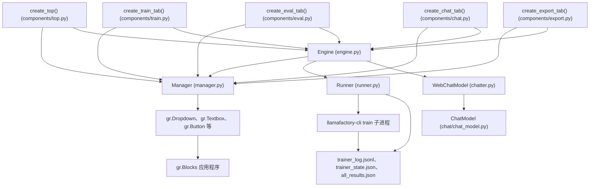
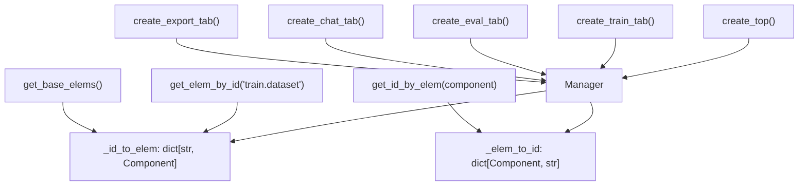
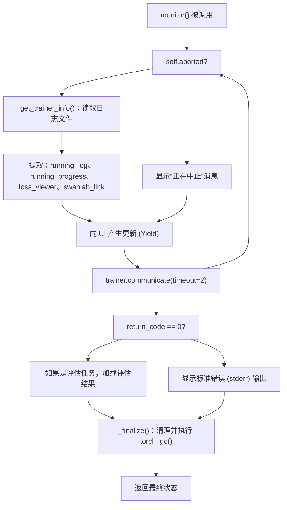
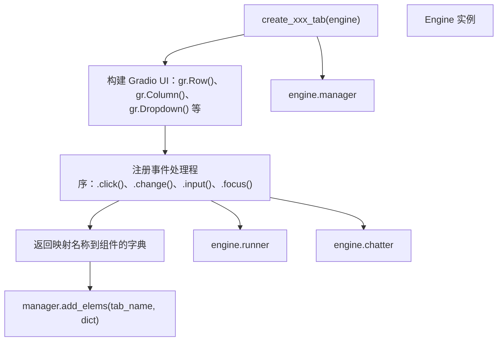
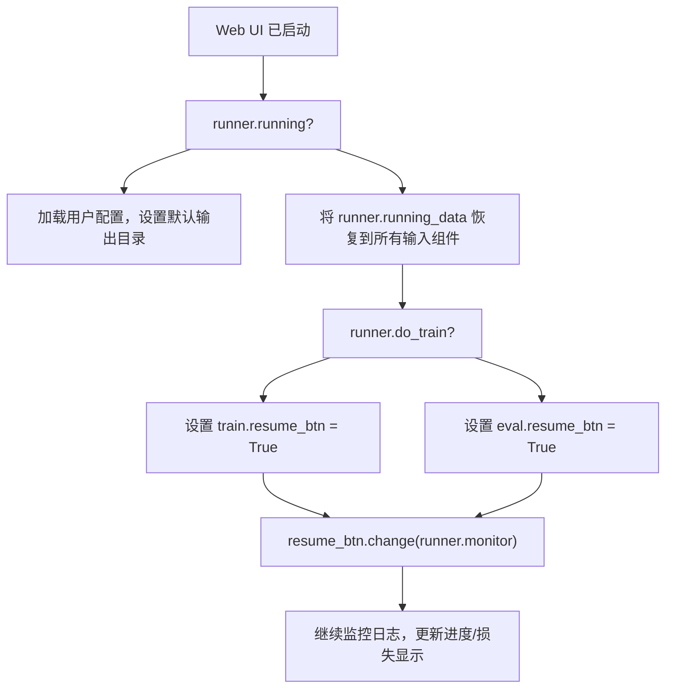

# Web UI 架构

相关源码文件

-   [src/llamafactory/webui/chatter.py](https://github.com/hiyouga/LlamaFactory/blob/355d5c5e/src/llamafactory/webui/chatter.py)
-   [src/llamafactory/webui/common.py](https://github.com/hiyouga/LlamaFactory/blob/355d5c5e/src/llamafactory/webui/common.py)
-   [src/llamafactory/webui/components/export.py](https://github.com/hiyouga/LlamaFactory/blob/355d5c5e/src/llamafactory/webui/components/export.py)
-   [src/llamafactory/webui/components/top.py](https://github.com/hiyouga/LlamaFactory/blob/355d5c5e/src/llamafactory/webui/components/top.py)
-   [src/llamafactory/webui/components/train.py](https://github.com/hiyouga/LlamaFactory/blob/355d5c5e/src/llamafactory/webui/components/train.py)
-   [src/llamafactory/webui/engine.py](https://github.com/hiyouga/LlamaFactory/blob/355d5c5e/src/llamafactory/webui/engine.py)
-   [src/llamafactory/webui/locales.py](https://github.com/hiyouga/LlamaFactory/blob/355d5c5e/src/llamafactory/webui/locales.py)
-   [src/llamafactory/webui/manager.py](https://github.com/hiyouga/LlamaFactory/blob/355d5c5e/src/llamafactory/webui/manager.py)
-   [src/llamafactory/webui/runner.py](https://github.com/hiyouga/LlamaFactory/blob/355d5c5e/src/llamafactory/webui/runner.py)

Web UI (LLaMA Board) 提供了一个基于 Gradio 的界面，用于训练、评估、对话和模型导出。本文档解释了 Web 界面的架构，包括其核心组件、状态管理、进程编排，以及 UI 组件如何与训练/推理系统进行交互。

有关使用 Web UI 进行训练工作流的信息，请参阅[通过 Web UI 训练](/hiyouga/LlamaFactory/8.2-training-via-web-ui)。有关对话和评估用法，请参阅[通过 Web UI 进行对话和评估](/hiyouga/LlamaFactory/8.3-chat-and-evaluation-via-web-ui)。

---

## 概览

Web UI 构建在四个核心类之上，这些类协同工作以提供完整的界面：


**来源：** [src/llamafactory/webui/engine.py28-84](https://github.com/hiyouga/LlamaFactory/blob/355d5c5e/src/llamafactory/webui/engine.py#L28-L84) [src/llamafactory/webui/manager.py23-71](https://github.com/hiyouga/LlamaFactory/blob/355d5c5e/src/llamafactory/webui/manager.py#L23-L71) [src/llamafactory/webui/runner.py54-68](https://github.com/hiyouga/LlamaFactory/blob/355d5c5e/src/llamafactory/webui/runner.py#L54-L68) [src/llamafactory/webui/chatter.py80-96](https://github.com/hiyouga/LlamaFactory/blob/355d5c5e/src/llamafactory/webui/chatter.py#L80-L96)

---

## Engine：中心控制器

`Engine` 类 ([src/llamafactory/webui/engine.py28-84](https://github.com/hiyouga/LlamaFactory/blob/355d5c5e/src/llamafactory/webui/engine.py#L28-L84)) 充当中心控制器，实例化并协调所有其他组件。

### Engine 结构

| 组件 | 类型 | 目的 |
| --- | --- | --- |
| `manager` | `Manager` | 维护组件注册表并提供基于 ID 的查找 |
| `runner` | `Runner` | 编排训练/评估子进程的执行 |
| `chatter` | `WebChatModel` | 管理对话推理模型的加载和流式传输 |
| `demo_mode` | `bool` | 禁用写操作，并使用配置好的演示模型 |
| `pure_chat` | `bool` | 启用纯对话模式，不显示训练标签页 |

### 关键方法

**`resume()`** ([src/llamafactory/webui/engine.py49-76](https://github.com/hiyouga/LlamaFactory/blob/355d5c5e/src/llamafactory/webui/engine.py#L49-L76))：在启动时初始化 UI 状态

-   从 `llamaboard_cache/user_config.yaml` 加载用户配置
-   设置语言、Hub 选择以及上次使用的模型
-   生成带有时间戳的默认输出目录
-   如果任务被中断，恢复训练状态

**`change_lang(lang: str)`** ([src/llamafactory/webui/engine.py77-83](https://github.com/hiyouga/LlamaFactory/blob/355d5c5e/src/llamafactory/webui/engine.py#L77-L83))：更新所有 UI 文本

-   遍历所有已注册的组件
-   应用来自 `LOCALES` 字典的本地化字符串
-   返回将组件映射到更新版本的字典

**来源：** [src/llamafactory/webui/engine.py28-84](https://github.com/hiyouga/LlamaFactory/blob/355d5c5e/src/llamafactory/webui/engine.py#L28-L84) [src/llamafactory/webui/common.py74-100](https://github.com/hiyouga/LlamaFactory/blob/355d5c5e/src/llamafactory/webui/common.py#L74-L100)

---

## Manager：组件注册表

`Manager` 类 ([src/llamafactory/webui/manager.py23-71](https://github.com/hiyouga/LlamaFactory/blob/355d5c5e/src/llamafactory/webui/manager.py#L23-L71)) 维护字符串 ID 与 Gradio 组件之间的双向映射，从而实现全局状态访问。

### 组件 ID 系统

组件使用分层 ID 进行注册：`{tab_name}.{elem_name}`

**示例：**

-   `top.model_name` - 顶部面板中的模型选择下拉框
-   `train.output_dir` - 训练标签页中的输出目录字段
-   `infer.chatbot` - 推理标签页中的对话历史显示


### 核心方法

| 方法 | 目的 | 返回类型 |
| --- | --- | --- |
| `add_elems(tab_name, elem_dict)` | 注册标签页中的组件 | `None` |
| `get_elem_by_id(elem_id)` | 通过 ID 字符串检索组件 | `Component` |
| `get_id_by_elem(elem)` | 获取组件的 ID 字符串 | `str` |
| `get_base_elems()` | 返回常用的顶部面板元素 | `set[Component]` |
| `get_elem_list()` | 以列表形式返回所有组件 | `list[Component]` |
| `get_elem_iter()` | (名称, 组件) 对的迭代器 | `Generator` |

**来源：** [src/llamafactory/webui/manager.py23-71](https://github.com/hiyouga/LlamaFactory/blob/355d5c5e/src/llamafactory/webui/manager.py#L23-L71) [src/llamafactory/webui/components/top.py33-83](https://github.com/hiyouga/LlamaFactory/blob/355d5c5e/src/llamafactory/webui/components/top.py#L33-L83) [src/llamafactory/webui/components/train.py37-447](https://github.com/hiyouga/LlamaFactory/blob/355d5c5e/src/llamafactory/webui/components/train.py#L37-L447)

---

## Runner：训练进程编排

`Runner` 类 ([src/llamafactory/webui/runner.py54-506](https://github.com/hiyouga/LlamaFactory/blob/355d5c5e/src/llamafactory/webui/runner.py#L54-L506)) 通过启动子进程并利用日志文件监控其进度，来管理训练和评估任务的生命周期。

### Runner 状态机

> **[Mermaid stateDiagram]**
> *(图表结构无法解析)*

### 关键组件

**子进程创建** ([src/llamafactory/webui/runner.py357-379](https://github.com/hiyouga/LlamaFactory/blob/355d5c5e/src/llamafactory/webui/runner.py#L357-L379))：

```python
# 从 UI 状态构建参数
args = self._parse_train_args(data)
# 设置环境变量
env["LLAMABOARD_ENABLED"] = "1"
env["LLAMABOARD_WORKDIR"] = args["output_dir"]
env["FORCE_TORCHRUN"] = "1"  # 如果使用 DeepSpeed
# 启动子进程
self.trainer = Popen(
    ["llamafactory-cli", "train", save_cmd(args)],
    env=env,
    stderr=PIPE,
    text=True
)
```
**监控循环** ([src/llamafactory/webui/runner.py404-460](https://github.com/hiyouga/LlamaFactory/blob/355d5c5e/src/llamafactory/webui/runner.py#L404-L460))：


### 参数解析

`_parse_train_args()` 方法 ([src/llamafactory/webui/runner.py126-290](https://github.com/hiyouga/LlamaFactory/blob/355d5c5e/src/llamafactory/webui/runner.py#L126-L290)) 从 UI 状态构建完整的参数字典：

**基础配置：**

-   模型路径、模板、微调类型
-   数据集目录和数据集列表
-   训练超参数 (学习率、Epoch、批次大小)
-   计算类型 (fp16/bf16/fp32/pure\_bf16)

**条件配置：**

-   **检查点**：适配器 (逗号分隔列表) 或全量模型路径
-   **量化**：量化位数、方法、双量化
-   **Freeze 微调**：可训练层、模块、额外模块
-   **LoRA**：秩、alpha、dropout、目标模块、DoRA、PiSSA 等
-   **RLHF**：PPO 奖励模型、DPO/KTO 偏好损失
-   **多模态**：视觉塔/投影器/语言模型 (LM) 冻结、像素大小
-   **优化器**：GaLore、APOLLO、BAdam 配置
-   **DeepSpeed**：阶段、卸载 (offload)、配置文件路径

**来源：** [src/llamafactory/webui/runner.py54-506](https://github.com/hiyouga/LlamaFactory/blob/355d5c5e/src/llamafactory/webui/runner.py#L54-L506) [src/llamafactory/webui/control.py1-300](https://github.com/hiyouga/LlamaFactory/blob/355d5c5e/src/llamafactory/webui/control.py#L1-L300)

---

## WebChatModel：推理管理

`WebChatModel` ([src/llamafactory/webui/chatter.py80-247](https://github.com/hiyouga/LlamaFactory/blob/355d5c5e/src/llamafactory/webui/chatter.py#L80-L247)) 扩展了 `ChatModel`，以提供具有延迟加载功能的 Web 特定推理能力。

### 模型生命周期

> **[Mermaid sequence]**
> *(图表结构无法解析)*

### 具有思考模式的流式传输

`stream()` 方法 ([src/llamafactory/webui/chatter.py193-246](https://github.com/hiyouga/LlamaFactory/blob/355d5c5e/src/llamafactory/webui/chatter.py#L193-L246)) 为推理模型处理特殊格式：

**标准响应：**

```
用户查询 → stream_chat() → 标记 (Tokens) → 显示为 Markdown
```
**思考模式响应：**

```
最终回答
↓
格式化为：
<details><summary>思考过程</summary>
推理过程
</details>
最终回答
```
`_format_response()` 辅助函数 ([src/llamafactory/webui/chatter.py46-69](https://github.com/hiyouga/LlamaFactory/blob/355d5c5e/src/llamafactory/webui/chatter.py#L46-L69)) 检测思考标记并将其封装在可展开的 `<details>` 元素中。

**来源：** [src/llamafactory/webui/chatter.py80-247](https://github.com/hiyouga/LlamaFactory/blob/355d5c5e/src/llamafactory/webui/chatter.py#L80-L247) [src/llamafactory/chat/chat\_model.py1-300](https://github.com/hiyouga/LlamaFactory/blob/355d5c5e/src/llamafactory/chat/chat_model.py#L1-L300)

---

## 组件系统

每个 UI 选项卡都由一个函数创建，该函数返回将元素名称映射到 Gradio 组件的字典。这些字典会在 `Manager` 中注册。

### 组件创建模式


### 顶部面板组件

顶部面板 ([src/llamafactory/webui/components/top.py33-83](https://github.com/hiyouga/LlamaFactory/blob/355d5c5e/src/llamafactory/webui/components/top.py#L33-L83)) 包含全局共享设置：

| 组件 | ID | 目的 |
| --- | --- | --- |
| `lang` | `top.lang` | 语言选择 (en/ru/zh/ko/ja) |
| `model_name` | `top.model_name` | 从 100 多个支持的模型中选择模型 |
| `model_path` | `top.model_path` | 本地路径或 HF 标识符 |
| `hub_name` | `top.hub_name` | 下载源 (HF/ModelScope/OpenMind) |
| `finetuning_type` | `top.finetuning_type` | 方法 (lora/freeze/full) |
| `checkpoint_path` | `top.checkpoint_path` | 要加载的适配器检查点 |
| `quantization_bit` | `top.quantization_bit` | 量化等级 (none/4/8) |
| `quantization_method` | `top.quantization_method` | 算法 (bnb/hqq/eetq) |
| `template` | `top.template` | 对话模板选择 |
| `rope_scaling` | `top.rope_scaling` | RoPE 插值方法 |
| `booster` | `top.booster` | 加速 (flashattn2/unsloth/liger\_kernel) |

### 训练选项卡组件

训练选项卡 ([src/llamafactory/webui/components/train.py37-447](https://github.com/hiyouga/LlamaFactory/blob/355d5c5e/src/llamafactory/webui/components/train.py#L37-L447)) 提供了广泛的训练配置：

**主要设置：**

-   `training_stage`: PT/SFT/RM/PPO/DPO/KTO/ORPO/SimPO
-   `dataset_dir`, `dataset`: 数据集位置和选择
-   `learning_rate`, `num_train_epochs`, `batch_size` 等
-   `cutoff_len`: 最大序列长度
-   `compute_type`: fp16/bf16/fp32/pure\_bf16

**手风琴面板 (默认折叠)：**

-   `extra_tab`: 日志记录、保存、预热、打包、NEFTune
-   `freeze_tab`: Freeze 微调参数
-   `lora_tab`: LoRA 秩、alpha、dropout、目标
-   `rlhf_tab`: PPO/DPO/KTO 偏好学习设置
-   `mm_tab`: 多模态视觉/投影器/语言模型冻结设置
-   `galore_tab`, `apollo_tab`, `badam_tab`: 优化器配置
-   `swanlab_tab`: SwanLab 监控集成

**控制元素：**

-   `cmd_preview_btn`: 预览命令而不执行
-   `arg_save_btn`, `arg_load_btn`: 将配置保存为 YAML 或从中加载
-   `start_btn`: 启动训练
-   `stop_btn`: 中止训练
-   `output_box`: 日志显示
-   `progress_bar`: 训练进度
-   `loss_viewer`: 实时损失图

**来源：** [src/llamafactory/webui/components/top.py33-83](https://github.com/hiyouga/LlamaFactory/blob/355d5c5e/src/llamafactory/webui/components/top.py#L33-L83) [src/llamafactory/webui/components/train.py37-447](https://github.com/hiyouga/LlamaFactory/blob/355d5c5e/src/llamafactory/webui/components/train.py#L37-L447)

---

## 进程管理与监控

### 配置持久化

训练配置可以保存为 YAML 文件并存储在 `llamaboard_config/` 中，也可以从中加载。

**保存流程** ([src/llamafactory/webui/runner.py462-476](https://github.com/hiyouga/LlamaFactory/blob/355d5c5e/src/llamafactory/webui/runner.py#L462-L476))：

```python
def save_args(self, data):
    # 从 UI 状态构建配置字典
    config_dict = self._build_config_dict(data)
    # 保存到 llamaboard_config/{config_path}
    save_path = os.path.join(DEFAULT_CONFIG_DIR, config_path)
    save_args(save_path, config_dict)
```
**加载流程** ([src/llamafactory/webui/runner.py478-490](https://github.com/hiyouga/LlamaFactory/blob/355d5c5e/src/llamafactory/webui/runner.py#L478-L490))：

```python
def load_args(self, lang: str, config_path: str):
    config_dict = load_args(os.path.join(DEFAULT_CONFIG_DIR, config_path))
    # 将配置值映射回组件
    output_dict = {}
    for elem_id, value in config_dict.items():
        output_dict[self.manager.get_elem_by_id(elem_id)] = value
    return output_dict
```
### 训练状态恢复

如果训练被中断 (例如浏览器刷新)，`Engine.resume()` 方法 ([src/llamafactory/webui/engine.py49-76](https://github.com/hiyouga/LlamaFactory/blob/355d5c5e/src/llamafactory/webui/engine.py#L49-L76)) 会恢复状态：


### 日志文件监控

`get_trainer_info()` 函数 ([src/llamafactory/webui/control.py200-300](https://github.com/hiyouga/LlamaFactory/blob/355d5c5e/src/llamafactory/webui/control.py#L200-L300)) 解析训练器输出：

**读取的文件：**

1.  `trainer_log.jsonl`: 逐行训练日志
    -   损失值、学习率、Epoch、步数
    -   解析以生成损失图
2.  `trainer_state.json`: 训练器内部状态
    -   总步数、Epochs、全局步数
    -   用于计算进度百分比
3.  `all_results.json`: 评估结果 (仅评估任务)

**返回值：**

-   `running_log`: 格式化后的日志文本
-   `running_progress`: 进度条数值 (0-100)
-   `running_info`: 具有可选键的字典：
    -   `loss_viewer`: 训练损失的 Plotly 图表
    -   `swanlab_link`: 指向 SwanLab 控制面板的 Markdown 链接

**来源：** [src/llamafactory/webui/runner.py404-460](https://github.com/hiyouga/LlamaFactory/blob/355d5c5e/src/llamafactory/webui/runner.py#L404-L460) [src/llamafactory/webui/control.py200-300](https://github.com/hiyouga/LlamaFactory/blob/355d5c5e/src/llamafactory/webui/control.py#L200-L300) [src/llamafactory/webui/common.py154-226](https://github.com/hiyouga/LlamaFactory/blob/355d5c5e/src/llamafactory/webui/common.py#L154-L226)

---

## 状态管理

### 用户配置持久化

用户偏好存储在 `llamaboard_cache/user_config.yaml` 中：

```yaml
lang: "en"
hub_name: "huggingface"
last_model: "LLaMA3-8B-Chat"
path_dict:
  LLaMA3-8B-Chat: "/path/to/model"
  Qwen2-7B: "/path/to/qwen2"
cache_dir: "/custom/cache/dir"
```
**函数：**

-   `load_config()` ([src/llamafactory/webui/common.py74-80](https://github.com/hiyouga/LlamaFactory/blob/355d5c5e/src/llamafactory/webui/common.py#L74-L80))：加载 YAML 或返回默认值
-   `save_config(lang, hub_name, model_name, model_path)` ([src/llamafactory/webui/common.py83-100](https://github.com/hiyouga/LlamaFactory/blob/355d5c5e/src/llamafactory/webui/common.py#L83-L100))：更新并持久化配置

### 训练配置持久化

训练任务将其配置保存在输出目录中：

**启动时** ([src/llamafactory/webui/runner.py368-369](https://github.com/hiyouga/LlamaFactory/blob/355d5c5e/src/llamafactory/webui/runner.py#L368-L369))：

```python
save_args(
    os.path.join(args["output_dir"], LLAMABOARD_CONFIG),
    self._build_config_dict(data)
)
```
这实现了：

1.  **可复现性**：精确的 UI 状态随检查点一同保存
2.  **恢复**：浏览输出目录时加载之前的任务设置
3.  **审计**：追踪产生每个检查点的参数

### 目录结构

```
llamaboard_cache/         # 缓存文件
├── user_config.yaml      # 用户偏好
├── ds_z2_config.json     # DeepSpeed ZeRO-2 配置
├── ds_z2_offload_config.json
├── ds_z3_config.json
└── ds_z3_offload_config.json

llamaboard_config/        # 保存的配置
├── experiment1.yaml
├── experiment2.yaml
└── ...

saves/                    # 模型输出
└── {model_name}/
    └── {finetuning_type}/
        └── {output_dir}/
            ├── llamaboard.yaml    # UI 配置快照
            ├── training_args.yaml # 使用的 CLI 参数
            ├── trainer_log.jsonl  # 训练日志
            ├── trainer_state.json # 训练器状态
            ├── checkpoint-100/
            ├── checkpoint-200/
            └── ...
```
**来源：** [src/llamafactory/webui/common.py39-287](https://github.com/hiyouga/LlamaFactory/blob/355d5c5e/src/llamafactory/webui/common.py#L39-L287) [src/llamafactory/webui/runner.py368-369](https://github.com/hiyouga/LlamaFactory/blob/355d5c5e/src/llamafactory/webui/runner.py#L368-L369)

---

## 交互流程

### 训练任务生命周期

> **[Mermaid sequence]**
> *(图表结构无法解析)*

### 对话推理流

> **[Mermaid sequence]**
> *(图表结构无法解析)*

**来源：** [src/llamafactory/webui/runner.py357-460](https://github.com/hiyouga/LlamaFactory/blob/355d5c5e/src/llamafactory/webui/runner.py#L357-L460) [src/llamafactory/webui/chatter.py101-246](https://github.com/hiyouga/LlamaFactory/blob/355d5c5e/src/llamafactory/webui/chatter.py#L101-L246)

---

## 演示模式

演示模式 ([src/llamafactory/webui/engine.py31-38](https://github.com/hiyouga/LlamaFactory/blob/355d5c5e/src/llamafactory/webui/engine.py#L31-L38)) 限制了公开部署时的某些操作：

**限制：**

-   无法启动训练/评估
-   禁用了模型加载/卸载
-   禁用了配置保存

**演示模型加载：** 如果设置了环境变量，则预加载一个模型：

```python
if demo_mode and os.getenv("DEMO_MODEL"):
    model_name_or_path = os.getenv("DEMO_MODEL")
    template = os.getenv("DEMO_TEMPLATE")
    infer_backend = os.getenv("DEMO_BACKEND", "huggingface")
    super().__init__(dict(
        model_name_or_path=model_name_or_path,
        template=template,
        infer_backend=infer_backend
    ))
```
**来源：** [src/llamafactory/webui/engine.py31-38](https://github.com/hiyouga/LlamaFactory/blob/355d5c5e/src/llamafactory/webui/engine.py#L31-L38) [src/llamafactory/webui/chatter.py86-95](https://github.com/hiyouga/LlamaFactory/blob/355d5c5e/src/llamafactory/webui/chatter.py#L86-L95)

---

## 总结

Web UI 架构围绕四个协作组件进行组织：

| 组件 | 文件 | 职责 |
| --- | --- | --- |
| **Engine** | `engine.py` | 协调所有组件，处理初始化和语言更改 |
| **Manager** | `manager.py` | 维护组件注册表，提供 ID ↔ 组件的双向映射 |
| **Runner** | `runner.py` | 启动训练子进程、监控日志、管理生命周期 |
| **WebChatModel** | `chatter.py` | 扩展 ChatModel，用于具有延迟加载功能的 Web 推理 |

系统采用 **基于文件的监控** 模式，Runner 子进程将日志和状态写入 JSON 文件，Web UI 持续读取这些文件以显示进度。这种设计即使在 Web 服务器重启的情况下也能实现稳健监控。

组件模块 (`top.py`、`train.py` 等) 遵循一致的模式：创建 Gradio UI 元素，注册事件处理程序，并返回一个在 Manager 中注册以供全局访问的字典。

**来源：** [src/llamafactory/webui/engine.py28-84](https://github.com/hiyouga/LlamaFactory/blob/355d5c5e/src/llamafactory/webui/engine.py#L28-L84) [src/llamafactory/webui/manager.py23-71](https://github.com/hiyouga/LlamaFactory/blob/355d5c5e/src/llamafactory/webui/manager.py#L23-L71) [src/llamafactory/webui/runner.py54-506](https://github.com/hiyouga/LlamaFactory/blob/355d5c5e/src/llamafactory/webui/runner.py#L54-L506) [src/llamafactory/webui/chatter.py80-247](https://github.com/hiyouga/LlamaFactory/blob/355d5c5e/src/llamafactory/webui/chatter.py#L80-L247)
