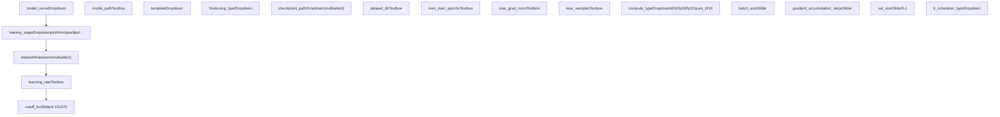
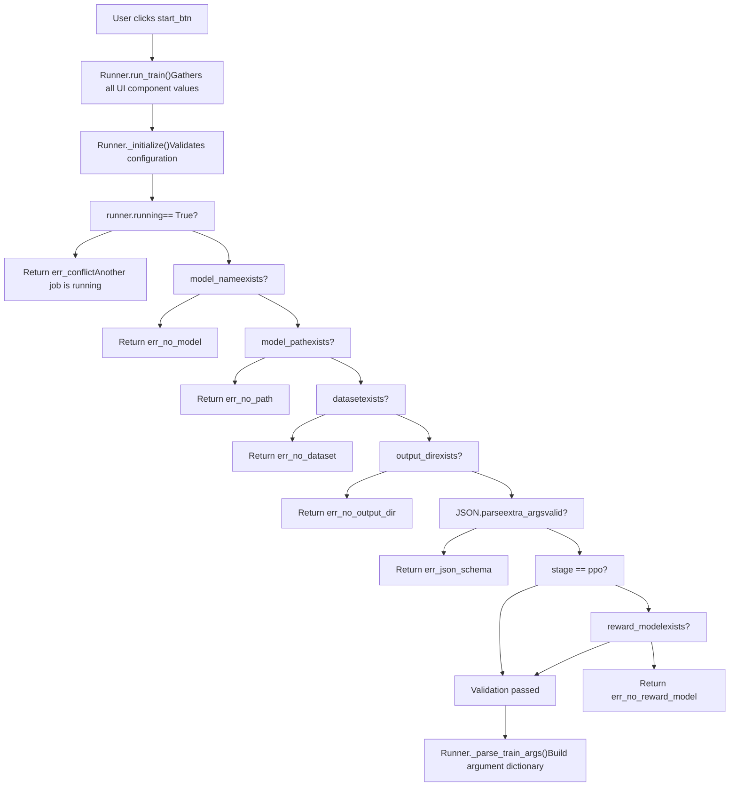
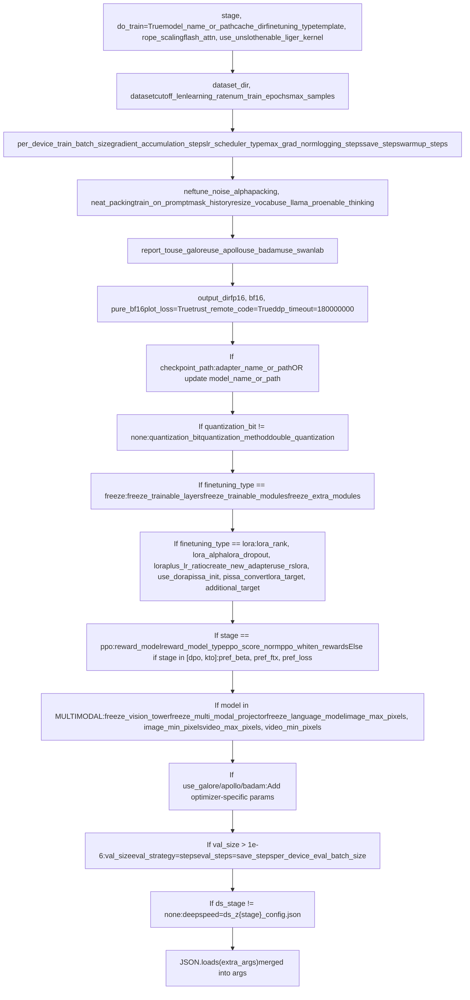
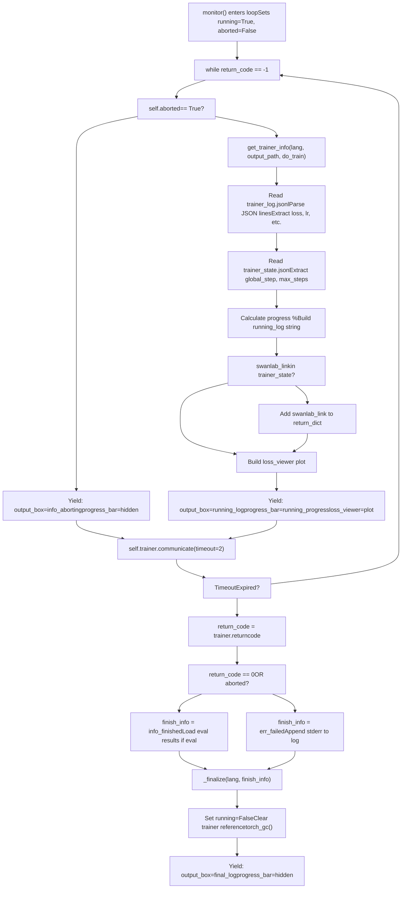
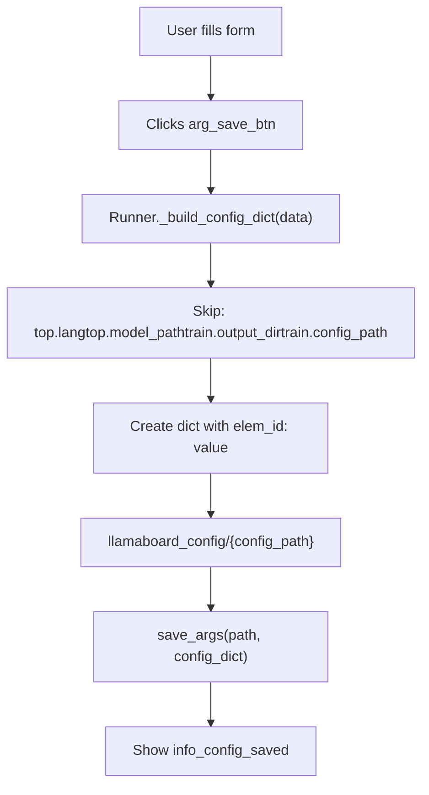
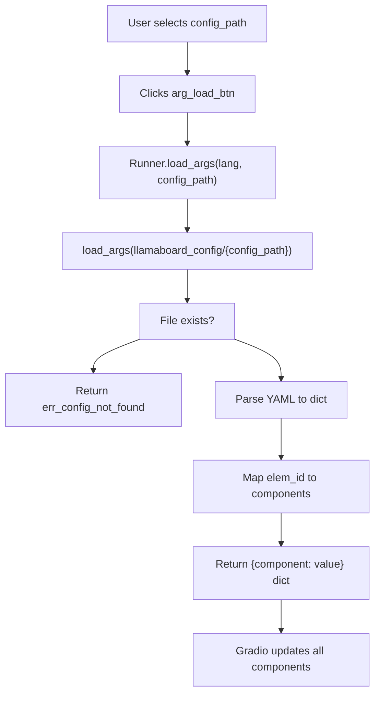
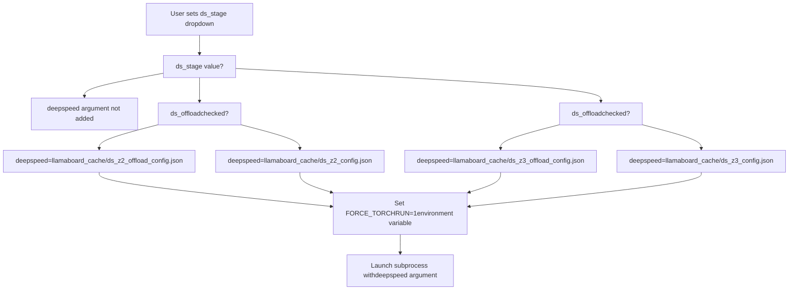

# 通过 Web UI 进行训练

相关源代码文件

-   [src/llamafactory/webui/chatter.py](https://github.com/hiyouga/LlamaFactory/blob/355d5c5e/src/llamafactory/webui/chatter.py)
-   [src/llamafactory/webui/common.py](https://github.com/hiyouga/LlamaFactory/blob/355d5c5e/src/llamafactory/webui/common.py)
-   [src/llamafactory/webui/components/export.py](https://github.com/hiyouga/LlamaFactory/blob/355d5c5e/src/llamafactory/webui/components/export.py)
-   [src/llamafactory/webui/components/top.py](https://github.com/hiyouga/LlamaFactory/blob/355d5c5e/src/llamafactory/webui/components/top.py)
-   [src/llamafactory/webui/components/train.py](https://github.com/hiyouga/LlamaFactory/blob/355d5c5e/src/llamafactory/webui/components/train.py)
-   [src/llamafactory/webui/engine.py](https://github.com/hiyouga/LlamaFactory/blob/355d5c5e/src/llamafactory/webui/engine.py)
-   [src/llamafactory/webui/locales.py](https://github.com/hiyouga/LlamaFactory/blob/355d5c5e/src/llamafactory/webui/locales.py)
-   [src/llamafactory/webui/manager.py](https://github.com/hiyouga/LlamaFactory/blob/355d5c5e/src/llamafactory/webui/manager.py)
-   [src/llamafactory/webui/runner.py](https://github.com/hiyouga/LlamaFactory/blob/355d5c5e/src/llamafactory/webui/runner.py)

本文档说明如何通过 LLaMA Board Web 界面配置和执行训练任务。内容涵盖训练选项卡 UI 组件、参数配置、进程管理以及监控功能。

关于 Web UI 整体架构的信息，请参阅 [Web UI 架构](/hiyouga/LlamaFactory/8.1-web-ui-architecture)。关于聊天和评测工作流，请参阅 [通过 Web UI 进行聊天和评测](/hiyouga/LlamaFactory/8.3-chat-and-evaluation-via-web-ui)。

---

## 目的与范围

训练界面提供了一种图形化方法，用于配置和启动微调任务，而无需编写命令行参数或 YAML 文件。`Runner` 类负责管理子进程执行，通过日志文件监控训练进度，并提供包含损失曲线和资源使用情况在内的实时反馈。系统支持所有训练阶段（PT、SFT、RM、PPO、DPO、KTO、ORPO、SimPO）和微调方法（LoRA、full、freeze）。

---

## 训练选项卡 UI 组件

训练选项卡在 [src/llamafactory/webui/components/train.py](https://github.com/hiyouga/LlamaFactory/blob/355d5c5e/src/llamafactory/webui/components/train.py) 中使用组织在可折叠折叠面板中的 Gradio 组件构建。`create_train_tab` 函数 [src/llamafactory/webui/components/train.py37-447](https://github.com/hiyouga/LlamaFactory/blob/355d5c5e/src/llamafactory/webui/components/train.py#L37-L447) 构建了完整的界面。

### 主配置面板


**关键组件：**

-   **training\_stage** [src/llamafactory/webui/components/train.py43](https://github.com/hiyouga/LlamaFactory/blob/355d5c5e/src/llamafactory/webui/components/train.py#L43-L43)：选择训练目标（PT, SFT, RM, PPO, DPO, KTO, ORPO, SimPO）
-   **dataset\_dir** [src/llamafactory/webui/components/train.py44](https://github.com/hiyouga/LlamaFactory/blob/355d5c5e/src/llamafactory/webui/components/train.py#L44-L44)：`dataset_info.json` 目录的路径（默认：`data`）
-   **dataset** [src/llamafactory/webui/components/train.py45](https://github.com/hiyouga/LlamaFactory/blob/355d5c5e/src/llamafactory/webui/components/train.py#L45-L45)：通过 `list_datasets()` 函数填充的多选下拉菜单
-   **learning\_rate** [src/llamafactory/webui/components/train.py52](https://github.com/hiyouga/LlamaFactory/blob/355d5c5e/src/llamafactory/webui/components/train.py#L52-L52)：AdamW 的初始学习率（默认：`5e-5`）
-   **num\_train\_epochs** [src/llamafactory/webui/components/train.py53](https://github.com/hiyouga/LlamaFactory/blob/355d5c5e/src/llamafactory/webui/components/train.py#L53-L53)：训练轮数（默认：`3.0`）
-   **cutoff\_len** [src/llamafactory/webui/components/train.py70](https://github.com/hiyouga/LlamaFactory/blob/355d5c5e/src/llamafactory/webui/components/train.py#L70-L70)：分词后的最大序列长度
-   **batch\_size** [src/llamafactory/webui/components/train.py71](https://github.com/hiyouga/LlamaFactory/blob/355d5c5e/src/llamafactory/webui/components/train.py#L71-L71)：单设备批处理大小
-   **gradient\_accumulation\_steps** [src/llamafactory/webui/components/train.py72](https://github.com/hiyouga/LlamaFactory/blob/355d5c5e/src/llamafactory/webui/components/train.py#L72-L72)：优化器更新前的步数

**来源：** [src/llamafactory/webui/components/train.py41-85](https://github.com/hiyouga/LlamaFactory/blob/355d5c5e/src/llamafactory/webui/components/train.py#L41-L85)

---

### 高级配置折叠面板

UI 包含六个用于专用设置的可折叠折叠面板：

#### 1. 额外配置折叠面板

```mermaid
flowchart TD
    ExtraTab["extra_tabAccordion"]
    LoggingSteps["logging_stepsSlider"]
    SaveSteps["save_stepsSlider"]
    WarmupSteps["warmup_stepsSlider"]
    NeftuneAlpha["neftune_alphaSlider"]
    ExtraArgs["extra_argsTextbox(JSON)"]
    Packing["packingCheckbox"]
    NeatPacking["neat_packingCheckbox"]
    TrainOnPrompt["train_on_promptCheckbox"]
    MaskHistory["mask_historyCheckbox"]
    ResizeVocab["resize_vocabCheckbox"]
    UseLlamaPro["use_llama_proCheckbox"]
    EnableThinking["enable_thinkingCheckbox"]
    ReportTo["report_toDropdown"]

    ExtraTab --> LoggingSteps
    ExtraTab --> SaveSteps
    ExtraTab --> WarmupSteps
    ExtraTab --> NeftuneAlpha
    ExtraTab --> ExtraArgs
    ExtraTab --> Packing
    ExtraTab --> NeatPacking
    ExtraTab --> TrainOnPrompt
    ExtraTab --> MaskHistory
    ExtraTab --> ResizeVocab
    ExtraTab --> UseLlamaPro
    ExtraTab --> EnableThinking
    ExtraTab --> ReportTo
```


**关键参数：**

-   **logging\_steps** [src/llamafactory/webui/components/train.py89](https://github.com/hiyouga/LlamaFactory/blob/355d5c5e/src/llamafactory/webui/components/train.py#L89-L89)：日志间隔（默认：5）
-   **save\_steps** [src/llamafactory/webui/components/train.py90](https://github.com/hiyouga/LlamaFactory/blob/355d5c5e/src/llamafactory/webui/components/train.py#L90-L90)：检查点间隔（默认：100）
-   **extra\_args** [src/llamafactory/webui/components/train.py93](https://github.com/hiyouga/LlamaFactory/blob/355d5c5e/src/llamafactory/webui/components/train.py#L93-L93)：用于附加参数的 JSON 对象（例如：`{"optim": "adamw_torch"}`）
-   **packing** [src/llamafactory/webui/components/train.py97](https://github.com/hiyouga/LlamaFactory/blob/355d5c5e/src/llamafactory/webui/components/train.py#L97-L97)：启用序列打包
-   **neat\_packing** [src/llamafactory/webui/components/train.py98](https://github.com/hiyouga/LlamaFactory/blob/355d5c5e/src/llamafactory/webui/components/train.py#L98-L98)：使用块对角注意力掩码以防止跨注意力
-   **train\_on\_prompt** [src/llamafactory/webui/components/train.py101](https://github.com/hiyouga/LlamaFactory/blob/355d5c5e/src/llamafactory/webui/components/train.py#L101-L101)：禁用 Prompt 上的标签掩码（仅限 SFT）
-   **mask\_history** [src/llamafactory/webui/components/train.py102](https://github.com/hiyouga/LlamaFactory/blob/355d5c5e/src/llamafactory/webui/components/train.py#L102-L102)：仅在多轮对话的最后一轮进行训练
-   **report\_to** [src/llamafactory/webui/components/train.py110-114](https://github.com/hiyouga/LlamaFactory/blob/355d5c5e/src/llamafactory/webui/components/train.py#L110-L114)：外部日志（none/wandb/tensorboard/mlflow/neptune）

**来源：** [src/llamafactory/webui/components/train.py87-150](https://github.com/hiyouga/LlamaFactory/blob/355d5c5e/src/llamafactory/webui/components/train.py#L87-L150)

#### 2. Freeze 微调配置

当 `finetuning_type="freeze"` 时，此折叠面板控制哪些层/模块是可训练的：

| 组件 | 类型 | 用途 | 默认值 |
| --- | --- | --- | --- |
| `freeze_trainable_layers` | 滑块 (-128 到 128) | 从最后 (+) 或最前 (-) 开始的可训练层数 | 2 |
| `freeze_trainable_modules` | 文本框 | 要训练的模块名称（逗号分隔） | "all" |
| `freeze_extra_modules` | 文本框 | 隐藏层之外的附加模块 | "" |

**来源：** [src/llamafactory/webui/components/train.py152-166](https://github.com/hiyouga/LlamaFactory/blob/355d5c5e/src/llamafactory/webui/components/train.py#L152-L166)

#### 3. LoRA 配置

当 `finetuning_type="lora"` 时，此折叠面板公开 PEFT 参数：

| 组件 | 类型 | 范围/选项 | 默认值 |
| --- | --- | --- | --- |
| `lora_rank` | 滑块 | 1-1024 | 8 |
| `lora_alpha` | 滑块 | 1-2048 | 16 |
| `lora_dropout` | 滑块 | 0-1 | 0 |
| `loraplus_lr_ratio` | 滑块 | 0-64 | 0 |
| `create_new_adapter` | 复选框 | 初始化新适配器 vs. 恢复 | False |
| `use_rslora` | 复选框 | 秩稳定 LoRA | False |
| `use_dora` | 复选框 | 权重分解 LoRA | False |
| `use_pissa` | 复选框 | 主奇异值和奇异向量自适应 | False |
| `lora_target` | 文本框 | 目标模块（例如："q\_proj,v\_proj"） | "" |
| `additional_target` | 文本框 | 添加适配器的额外模块 | "" |

**来源：** [src/llamafactory/webui/components/train.py168-211](https://github.com/hiyouga/LlamaFactory/blob/355d5c5e/src/llamafactory/webui/components/train.py#L168-L211)

#### 4. RLHF 配置

用于偏好学习阶段（DPO, KTO, ORPO, SimPO）和 PPO：

| 组件 | 类型 | 用途 | 默认值 |
| --- | --- | --- | --- |
| `pref_beta` | 滑块 (0-1) | 偏好损失的 Beta 参数 | 0.1 |
| `pref_ftx` | 滑块 (0-10) | 有监督微调损失权重 | 0 |
| `pref_loss` | 下拉菜单 | 损失类型 (sigmoid/hinge/ipo/kto\_pair/orpo/simpo) | "sigmoid" |
| `reward_model` | 下拉菜单 (多选) | PPO 的奖励模型检查点 | \[\] |
| `ppo_score_norm` | 复选框 | 标准化 PPO 评分 | False |
| `ppo_whiten_rewards` | 复选框 | 对 PPO 奖励进行白化处理 | False |

**来源：** [src/llamafactory/webui/components/train.py213-234](https://github.com/hiyouga/LlamaFactory/blob/355d5c5e/src/llamafactory/webui/components/train.py#L213-L234)

#### 5. 多模态配置

用于 `MULTIMODAL_SUPPORTED_MODELS` 中的视觉语言模型：

```mermaid
flowchart TD
    MMTab["mm_tab Accordion"]
    FreezeVisionTower["freeze_vision_towerCheckbox(default=True)"]
    FreezeProjector["freeze_multi_modal_projectorCheckbox(default=True)"]
    FreezeLM["freeze_language_modelCheckbox(default=False)"]
    ImageMaxPixels["image_max_pixelsTextbox(768*768)"]
    ImageMinPixels["image_min_pixelsTextbox(32*32)"]
    VideoMaxPixels["video_max_pixelsTextbox(256*256)"]
    VideoMinPixels["video_min_pixelsTextbox(16*16)"]

    MMTab --> FreezeVisionTower
    MMTab --> FreezeProjector
    MMTab --> FreezeLM
    MMTab --> ImageMaxPixels
    MMTab --> ImageMinPixels
    MMTab --> VideoMaxPixels
    MMTab --> VideoMinPixels
```


像素值由 `calculate_pixels()` [src/llamafactory/webui/common.py220-225](https://github.com/hiyouga/LlamaFactory/blob/355d5c5e/src/llamafactory/webui/common.py#L220-L225) 解析，该函数将 `"768*768"` 之类的表达式计算为整数。

**来源：** [src/llamafactory/webui/components/train.py236-270](https://github.com/hiyouga/LlamaFactory/blob/355d5c5e/src/llamafactory/webui/components/train.py#L236-L270)

#### 6. 优化器折叠面板 (GaLore, APOLLO, BAdam, SwanLab)

三个用于高级优化器的折叠面板 [src/llamafactory/webui/components/train.py272-330](https://github.com/hiyouga/LlamaFactory/blob/355d5c5e/src/llamafactory/webui/components/train.py#L272-L330) 和一个用于 SwanLab 监控的折叠面板 [src/llamafactory/webui/components/train.py332-364](https://github.com/hiyouga/LlamaFactory/blob/355d5c5e/src/llamafactory/webui/components/train.py#L332-L364)。

---

### 控制按钮和输出面板

```mermaid
flowchart TD
    PreviewBtn["cmd_preview_btnPreview Command"]
    SaveBtn["arg_save_btnSave Config"]
    LoadBtn["arg_load_btnLoad Config"]
    StartBtn["start_btnStart Training(variant=primary)"]
    StopBtn["stop_btnStop Training(variant=stop)"]
    OutputDir["output_dirDropdown"]
    ConfigPath["config_pathDropdown"]
    DeviceCount["device_countTextbox(readonly)"]
    DSStage["ds_stageDropdown(none/2/3)"]
    DSOffload["ds_offloadCheckbox"]
    ProgressBar["progress_barSlider(readonly)"]
    OutputBox["output_boxMarkdown"]
    LossViewer["loss_viewerPlot"]

    PreviewBtn --> OutputBox
    StartBtn --> ProgressBar
    StartBtn --> OutputBox
    StartBtn --> LossViewer
    StopBtn --> OutputBox
```


**关键组件：**

-   **cmd\_preview\_btn** [src/llamafactory/webui/components/train.py367](https://github.com/hiyouga/LlamaFactory/blob/355d5c5e/src/llamafactory/webui/components/train.py#L367-L367)：通过 `gen_cmd()` 生成 CLI 命令但不执行
-   **arg\_save\_btn** [src/llamafactory/webui/components/train.py368](https://github.com/hiyouga/LlamaFactory/blob/355d5c5e/src/llamafactory/webui/components/train.py#L368-L368)：将当前配置保存到 `llamaboard_config/{config_path}`
-   **arg\_load\_btn** [src/llamafactory/webui/components/train.py369](https://github.com/hiyouga/LlamaFactory/blob/355d5c5e/src/llamafactory/webui/components/train.py#L369-L369)：从保存的 YAML 恢复配置
-   **start\_btn** [src/llamafactory/webui/components/train.py370](https://github.com/hiyouga/LlamaFactory/blob/355d5c5e/src/llamafactory/webui/components/train.py#L370-L370)：启动训练子进程
-   **stop\_btn** [src/llamafactory/webui/components/train.py371](https://github.com/hiyouga/LlamaFactory/blob/355d5c5e/src/llamafactory/webui/components/train.py#L371-L371)：中止正在运行的训练进程
-   **output\_dir** [src/llamafactory/webui/components/train.py377](https://github.com/hiyouga/LlamaFactory/blob/355d5c5e/src/llamafactory/webui/components/train.py#L377-L377)：检查点保存目录（通过 `list_output_dirs()` 自动填充）
-   **config\_path** [src/llamafactory/webui/components/train.py378](https://github.com/hiyouga/LlamaFactory/blob/355d5c5e/src/llamafactory/webui/components/train.py#L378-L378)：YAML 配置文件名
-   **ds\_stage** [src/llamafactory/webui/components/train.py382](https://github.com/hiyouga/LlamaFactory/blob/355d5c5e/src/llamafactory/webui/components/train.py#L382-L382)：DeepSpeed ZeRO 阶段 (none/2/3)
-   **ds\_offload** [src/llamafactory/webui/components/train.py383](https://github.com/hiyouga/LlamaFactory/blob/355d5c5e/src/llamafactory/webui/components/train.py#L383-L383)：启用 CPU 卸载 (Offloading)
-   **progress\_bar** [src/llamafactory/webui/components/train.py387](https://github.com/hiyouga/LlamaFactory/blob/355d5c5e/src/llamafactory/webui/components/train.py#L387-L387)：训练进度 (0-100%)
-   **output\_box** [src/llamafactory/webui/components/train.py390](https://github.com/hiyouga/LlamaFactory/blob/355d5c5e/src/llamafactory/webui/components/train.py#L390-L390)：Markdown 格式的日志和状态
-   **loss\_viewer** [src/llamafactory/webui/components/train.py393](https://github.com/hiyouga/LlamaFactory/blob/355d5c5e/src/llamafactory/webui/components/train.py#L393-L393)：实时训练/验证损失图表

**来源：** [src/llamafactory/webui/components/train.py366-414](https://github.com/hiyouga/LlamaFactory/blob/355d5c5e/src/llamafactory/webui/components/train.py#L366-L414)

---

## 训练执行流程

`Runner` 类 [src/llamafactory/webui/runner.py54-506](https://github.com/hiyouga/LlamaFactory/blob/355d5c5e/src/llamafactory/webui/runner.py#L54-L506) 管理完整的训练生命周期。

### 初始化与校验


**校验逻辑** [src/llamafactory/webui/runner.py74-114](https://github.com/hiyouga/LlamaFactory/blob/355d5c5e/src/llamafactory/webui/runner.py#L74-L114)：

1.  检查是否有另一个训练任务正在运行 (`self.running` 标志)
2.  确保已指定模型名称和路径
3.  验证已选择数据集
4.  验证已指定输出目录
5.  解析 `extra_args` JSON 以检查语法错误
6.  对于 PPO 阶段，需要 `reward_model` 检查点

**来源：** [src/llamafactory/webui/runner.py74-114](https://github.com/hiyouga/LlamaFactory/blob/355d5c5e/src/llamafactory/webui/runner.py#L74-L114) [src/llamafactory/webui/runner.py357-379](https://github.com/hiyouga/LlamaFactory/blob/355d5c5e/src/llamafactory/webui/runner.py#L357-L379)

### 参数构建

`_parse_train_args()` 方法 [src/llamafactory/webui/runner.py126-290](https://github.com/hiyouga/LlamaFactory/blob/355d5c5e/src/llamafactory/webui/runner.py#L126-L290) 构建了一个将 CLI 参数名称映射到值的字典：


**关键逻辑块：**

1.  **检查点处理** [src/llamafactory/webui/runner.py182-188](https://github.com/hiyouga/LlamaFactory/blob/355d5c5e/src/llamafactory/webui/runner.py#L182-L188)：对于 PEFT 方法，用逗号连接多个适配器路径。对于全量微调，替换 `model_name_or_path`。

2.  **量化** [src/llamafactory/webui/runner.py191-194](https://github.com/hiyouga/LlamaFactory/blob/355d5c5e/src/llamafactory/webui/runner.py#L191-L194)：将字符串转换为整数比特值，设置方法，启用双重量化（NPU 除外）。

3.  **LoRA 配置** [src/llamafactory/webui/runner.py203-217](https://github.com/hiyouga/LlamaFactory/blob/355d5c5e/src/llamafactory/webui/runner.py#L203-L217)：设置秩 (Rank)、Alpha、丢弃率 (Dropout)、LoRA+ 比例、RS-LoRA、DoRA、PiSSA 标志、目标模块。如果 `use_llama_pro=True`，还需设置 `freeze_trainable_layers`。

4.  **RLHF 阶段特定配置** [src/llamafactory/webui/runner.py220-236](https://github.com/hiyouga/LlamaFactory/blob/355d5c5e/src/llamafactory/webui/runner.py#L220-L236)：

    -   PPO：解析奖励模型路径，设置 `reward_model_type`，配置评分标准化/白化，设置 `top_k=0` 和 `top_p=0.9`。
    -   DPO/KTO：设置 `pref_beta`、`pref_ftx`、`pref_loss`。
5.  **DeepSpeed** [src/llamafactory/webui/runner.py285-288](https://github.com/hiyouga/LlamaFactory/blob/355d5c5e/src/llamafactory/webui/runner.py#L285-L288)：如果启用，指向 `llamaboard_cache/` 中预生成的配置文件（由 `create_ds_config()` [src/llamafactory/webui/common.py228-286](https://github.com/hiyouga/LlamaFactory/blob/355d5c5e/src/llamafactory/webui/common.py#L228-L286) 创建）。

6.  **额外参数合并** [src/llamafactory/webui/runner.py179](https://github.com/hiyouga/LlamaFactory/blob/355d5c5e/src/llamafactory/webui/runner.py#L179-L179)：解析并合并用户提供的 JSON，允许覆盖任何参数。


**来源：** [src/llamafactory/webui/runner.py126-290](https://github.com/hiyouga/LlamaFactory/blob/355d5c5e/src/llamafactory/webui/runner.py#L126-L290)

### 子进程启动

**关键步骤** [src/llamafactory/webui/runner.py357-379](https://github.com/hiyouga/LlamaFactory/blob/355d5c5e/src/llamafactory/webui/runner.py#L357-L379)：

1.  **创建输出目录** [src/llamafactory/webui/runner.py368](https://github.com/hiyouga/LlamaFactory/blob/355d5c5e/src/llamafactory/webui/runner.py#L368-L368)：确保检查点目录存在。
2.  **保存 UI 状态** [src/llamafactory/webui/runner.py369](https://github.com/hiyouga/LlamaFactory/blob/355d5c5e/src/llamafactory/webui/runner.py#L369-L369)：调用带有 `LLAMABOARD_CONFIG` 的 `save_args()`，以保留配置以便将来恢复。
3.  **环境设置** [src/llamafactory/webui/runner.py371-375](https://github.com/hiyouga/LlamaFactory/blob/355d5c5e/src/llamafactory/webui/runner.py#L371-L375)：
    -   `LLAMABOARD_ENABLED=1`：向训练进程发出信号，以兼容格式写入日志。
    -   `LLAMABOARD_WORKDIR=output_dir`：告知训练器日志文件写入位置。
    -   `FORCE_TORCHRUN=1`：对于 DeepSpeed，强制使用 `torchrun` 启动器。
4.  **保存训练参数** [src/llamafactory/webui/runner.py378](https://github.com/hiyouga/LlamaFactory/blob/355d5c5e/src/llamafactory/webui/runner.py#L378-L378)：`save_cmd()` [src/llamafactory/webui/common.py202-209](https://github.com/hiyouga/LlamaFactory/blob/355d5c5e/src/llamafactory/webui/common.py#L202-L209) 将清洗后的参数写入 `output_dir/training_args.yaml`。
5.  **衍生进程** [src/llamafactory/webui/runner.py378](https://github.com/hiyouga/LlamaFactory/blob/355d5c5e/src/llamafactory/webui/runner.py#L378-L378)：使用 `Popen` 且 `shell=False` 以避免安全风险，捕获 `stderr=PIPE` 以获取错误消息。
6.  **进入监控循环** [src/llamafactory/webui/runner.py379](https://github.com/hiyouga/LlamaFactory/blob/355d5c5e/src/llamafactory/webui/runner.py#L379-L379)：从 `monitor()` 生成器中 Yield。

**来源：** [src/llamafactory/webui/runner.py357-379](https://github.com/hiyouga/LlamaFactory/blob/355d5c5e/src/llamafactory/webui/runner.py#L357-L379) [src/llamafactory/webui/common.py202-209](https://github.com/hiyouga/LlamaFactory/blob/355d5c5e/src/llamafactory/webui/common.py#L202-L209)

---

## 训练监控

`monitor()` 方法 [src/llamafactory/webui/runner.py404-460](https://github.com/hiyouga/LlamaFactory/blob/355d5c5e/src/llamafactory/webui/runner.py#L404-L460) 持续读取训练日志并更新 UI。

### 日志文件监控流程


**关键组件：**

1.  **get\_trainer\_info()** [src/llamafactory/webui/control.py](https://github.com/hiyouga/LlamaFactory/blob/355d5c5e/src/llamafactory/webui/control.py) (外部函数)：

    -   逐行读取 `trainer_log.jsonl`，解析 JSON 对象。
    -   提取指标：`loss`、`learning_rate`、`epoch`、`percentage`、`elapsed_time`、`remaining_time`。
    -   读取 `trainer_state.json` 获取 `global_step`、`max_steps`、`log_history`。
    -   为 `loss_viewer` 构建包含训练/验证损失曲线的 Plotly 图表。
    -   从训练器状态中检测 SwanLab 链接。
    -   返回 `(running_log, running_progress, running_info)` 元组。
2.  **进度条** [src/llamafactory/webui/runner.py431](https://github.com/hiyouga/LlamaFactory/blob/355d5c5e/src/llamafactory/webui/runner.py#L431-L431)：更新百分比 (0-100) 和可见性的 `gr.Slider` 组件。

3.  **输出框** [src/llamafactory/webui/runner.py430](https://github.com/hiyouga/LlamaFactory/blob/355d5c5e/src/llamafactory/webui/runner.py#L430-L430)：显示以下内容的 Markdown 格式文本：

    -   当前损失、学习率、轮数。
    -   已用时间和剩余时间估计。
    -   内存使用情况（如果可用）。
    -   错误消息或完成状态。
4.  **损失查看器** [src/llamafactory/webui/runner.py434](https://github.com/hiyouga/LlamaFactory/blob/355d5c5e/src/llamafactory/webui/runner.py#L434-L434)：具有单独的训练和验证损失追踪线的 Plotly 折线图。

5.  **进程通信** [src/llamafactory/webui/runner.py442-445](https://github.com/hiyouga/LlamaFactory/blob/355d5c5e/src/llamafactory/webui/runner.py#L442-L445)：每 2 秒调用一次 `communicate(timeout=2)`。如果进程退出，`return_code` 变为非负值。如果超时，`TimeoutExpired` 异常将继续循环。


**来源：** [src/llamafactory/webui/runner.py404-460](https://github.com/hiyouga/LlamaFactory/blob/355d5c5e/src/llamafactory/webui/runner.py#L404-L460)

### 训练状态持久化

Web UI 通过配置文件在页面刷新后保持状态：

| 文件 | 位置 | 用途 | 格式 |
| --- | --- | --- | --- |
| `llamaboard_config.yaml` | `{output_dir}/` | 训练开始时的 UI 组件值 | YAML |
| `training_args.yaml` | `{output_dir}/` | 传递给训练器的 CLI 参数 | YAML |
| `trainer_log.jsonl` | `{output_dir}/` | 实时训练日志 | JSONL |
| `trainer_state.json` | `{output_dir}/` | 训练状态快照 | JSON |

**恢复流程** [src/llamafactory/webui/runner.py492-505](https://github.com/hiyouga/LlamaFactory/blob/355d5c5e/src/llamafactory/webui/runner.py#L492-L505)。

**来源：** [src/llamafactory/webui/runner.py492-505](https://github.com/hiyouga/LlamaFactory/blob/355d5c5e/src/llamafactory/webui/runner.py#L492-L505)

---

## 停止与中止

### 中止机制

**abort\_process()** [src/llamafactory/webui/common.py46-56](https://github.com/hiyouga/LlamaFactory/blob/355d5c5e/src/llamafactory/webui/common.py#L46-L56)：

-   使用 `psutil.Process(pid).children()` 递归查找所有子进程。
-   先中止子进程（自底向上），以防止孤立进程。
-   发送 `SIGABRT` 信号以优雅终止。
-   包裹在 try-except 中以处理已终止的进程。

**set\_abort()** [src/llamafactory/webui/runner.py69-72](https://github.com/hiyouga/LlamaFactory/blob/355d5c5e/src/llamafactory/webui/runner.py#L69-L72)：

-   设置 `self.aborted = True` 标志。
-   如果训练器存在，调用 `abort_process(self.trainer.pid)`。
-   `monitor()` 循环检测到 `self.aborted` 并显示 "Aborting..." 消息。

**来源：** [src/llamafactory/webui/runner.py69-72](https://github.com/hiyouga/LlamaFactory/blob/355d5c5e/src/llamafactory/webui/runner.py#L69-L72) [src/llamafactory/webui/common.py46-56](https://github.com/hiyouga/LlamaFactory/blob/355d5c5e/src/llamafactory/webui/common.py#L46-L56)

---

## 配置管理

### 保存配置


**\_build\_config\_dict()** [src/llamafactory/webui/runner.py381-390](https://github.com/hiyouga/LlamaFactory/blob/355d5c5e/src/llamafactory/webui/runner.py#L381-L390)：

-   迭代所有 UI 组件 `(elem, value)` 对。
-   跳过某些不应保存的字段（语言、路径、当前输出/配置名称）。
-   将元素 ID（例如：`"train.learning_rate"`）映射到当前值。
-   返回准备进行 YAML 序列化的字典。

**save\_args()** [src/llamafactory/webui/common.py163-166](https://github.com/hiyouga/LlamaFactory/blob/355d5c5e/src/llamafactory/webui/common.py#L163-L166)：

-   使用 `yaml.safe_dump()` 将字典写入 YAML 文件。
-   保存到 `llamaboard_config/{config_path}.yaml`。

**来源：** [src/llamafactory/webui/runner.py381-390](https://github.com/hiyouga/LlamaFactory/blob/355d5c5e/src/llamafactory/webui/runner.py#L381-L390) [src/llamafactory/webui/runner.py462-476](https://github.com/hiyouga/LlamaFactory/blob/355d5c5e/src/llamafactory/webui/runner.py#L462-L476) [src/llamafactory/webui/common.py163-166](https://github.com/hiyouga/LlamaFactory/blob/355d5c5e/src/llamafactory/webui/common.py#L163-L166)

### 加载配置


**load\_args()** [src/llamafactory/webui/runner.py478-490](https://github.com/hiyouga/LlamaFactory/blob/355d5c5e/src/llamafactory/webui/runner.py#L478-L490)：

-   从 `llamaboard_config/{config_path}` 读取 YAML 文件。
-   通过 `manager.get_elem_by_id()` 将元素 ID 映射回组件引用。
-   返回 `{Component: value}` 字典，Gradio 使用该字典更新 UI。
-   如果文件不存在，显示警告并返回错误消息。

**来源：** [src/llamafactory/webui/runner.py478-490](https://github.com/hiyouga/LlamaFactory/blob/355d5c5e/src/llamafactory/webui/runner.py#L478-L490) [src/llamafactory/webui/common.py154-160](https://github.com/hiyouga/LlamaFactory/blob/355d5c5e/src/llamafactory/webui/common.py#L154-L160)

---

## DeepSpeed 集成

### 配置文件生成

系统在引擎初始化期间预生成 DeepSpeed 配置 [src/llamafactory/webui/engine.py37-38](https://github.com/hiyouga/LlamaFactory/blob/355d5c5e/src/llamafactory/webui/engine.py#L37-L38)。

**create\_ds\_config()** [src/llamafactory/webui/common.py228-286](https://github.com/hiyouga/LlamaFactory/blob/355d5c5e/src/llamafactory/webui/common.py#L228-L286) 创建四个文件：

| 文件 | ZeRO 阶段 | CPU 卸载 | 描述 |
| --- | --- | --- | --- |
| `ds_z2_config.json` | 2 | 否 | 优化器状态划分 |
| `ds_z2_offload_config.json` | 2 | 是 | \+ 优化器卸载到 CPU |
| `ds_z3_config.json` | 3 | 否 | 参数 + 优化器全量划分 |
| `ds_z3_offload_config.json` | 3 | 是 | \+ 参数和优化器卸载 |

**基础配置：**

```
{  "train_batch_size": "auto",  "train_micro_batch_size_per_gpu": "auto",  "gradient_accumulation_steps": "auto",  "gradient_clipping": "auto",  "zero_allow_untested_optimizer": true,  "fp16": {"enabled": "auto", ...},  "bf16": {"enabled": "auto"}}
```
**ZeRO-2 特定配置** [src/llamafactory/webui/common.py251-260](https://github.com/hiyouga/LlamaFactory/blob/355d5c5e/src/llamafactory/webui/common.py#L251-L260)：

```
{  "zero_optimization": {    "stage": 2,    "allgather_partitions": true,    "allgather_bucket_size": 5e8,    "overlap_comm": false,    "reduce_scatter": true,    "reduce_bucket_size": 5e8,    "contiguous_gradients": true,    "round_robin_gradients": true  }}
```
**ZeRO-3 特定配置** [src/llamafactory/webui/common.py268-279](https://github.com/hiyouga/LlamaFactory/blob/355d5c5e/src/llamafactory/webui/common.py#L268-L279)：

```
{  "zero_optimization": {    "stage": 3,    "overlap_comm": false,    "contiguous_gradients": true,    "sub_group_size": 1e9,    "stage3_prefetch_bucket_size": "auto",    "stage3_param_persistence_threshold": "auto",    "stage3_max_live_parameters": 1e9,    "stage3_max_reuse_distance": 1e9,    "stage3_gather_16bit_weights_on_model_save": true  }}
```
**来源：** [src/llamafactory/webui/common.py228-286](https://github.com/hiyouga/LlamaFactory/blob/355d5c5e/src/llamafactory/webui/common.py#L228-L286) [src/llamafactory/webui/engine.py37-38](https://github.com/hiyouga/LlamaFactory/blob/355d5c5e/src/llamafactory/webui/engine.py#L37-L38)

### 运行时选择


**实现** [src/llamafactory/webui/runner.py285-288](https://github.com/hiyouga/LlamaFactory/blob/355d5c5e/src/llamafactory/webui/runner.py#L285-L288)：

```
if get("train.ds_stage") != "none":    ds_stage = get("train.ds_stage")    ds_offload = "offload_" if get("train.ds_offload") else ""    args["deepspeed"] = os.path.join(DEFAULT_CACHE_DIR, f"ds_z{ds_stage}_{ds_offload}config.json")
```
启用 DeepSpeed 时，环境变量 `FORCE_TORCHRUN=1` [src/llamafactory/webui/runner.py375](https://github.com/hiyouga/LlamaFactory/blob/355d5c5e/src/llamafactory/webui/runner.py#L375-L375) 会向训练脚本发出信号，使用 `torchrun` 启动器代替直接执行 Python。

**来源：** [src/llamafactory/webui/runner.py285-288](https://github.com/hiyouga/LlamaFactory/blob/355d5c5e/src/llamafactory/webui/runner.py#L285-L288) [src/llamafactory/webui/runner.py374-375](https://github.com/hiyouga/LlamaFactory/blob/355d5c5e/src/llamafactory/webui/runner.py#L374-L375)

---

## 组件交互

### 事件处理器

训练选项卡注册了众多的事件处理器 [src/llamafactory/webui/components/train.py417-445](https://github.com/hiyouga/LlamaFactory/blob/355d5c5e/src/llamafactory/webui/components/train.py#L417-L445)：

| 触发器 | 函数 | 输入 | 输出 | 用途 |
| --- | --- | --- | --- | --- |
| `cmd_preview_btn.click` | `runner.preview_train` | 所有输入元素 | `output_box`, `progress_bar`, `loss_viewer` | 生成 CLI 命令但不执行 |
| `start_btn.click` | `runner.run_train` | 所有输入元素 | 同上 | 启动训练子进程 |
| `stop_btn.click` | `runner.set_abort` | 无 | 无 | 中止正在运行的训练 |
| `resume_btn.change` | `runner.monitor` | 无 | 输出元素 | 恢复监控（用于页面刷新） |
| `arg_save_btn.click` | `runner.save_args` | 所有输入元素 | 输出元素 | 将配置保存到 YAML |
| `arg_load_btn.click` | `runner.load_args` | `lang`, `config_path` | 所有输入 + `output_box` | 从 YAML 加载配置 |
| `dataset.focus` | `list_datasets` | `dataset_dir`, `training_stage` | `dataset` | 填充数据集选项 |
| `training_stage.change` | `change_stage` | `training_stage` | `dataset`, `packing` | 根据阶段调整默认设置 |
| `reward_model.focus` | `list_checkpoints` | `model_name`, `finetuning_type` | `reward_model` | 列出可用检查点 |
| `output_dir.input` | `runner.check_output_dir` | `lang`, `model_name`, `finetuning_type`, `output_dir` | 所有输入 + `output_box` | 如果目录存在则恢复配置 |

**动态更新：**

-   **数据集下拉菜单** [src/llamafactory/webui/components/train.py431](https://github.com/hiyouga/LlamaFactory/blob/355d5c5e/src/llamafactory/webui/components/train.py#L431-L431)：聚焦时调用 `list_datasets()`，该函数读取 `dataset_info.json` 并按阶段进行过滤（例如：对于 SFT，仅显示有监督数据集）。

-   **training\_stage 下拉菜单** [src/llamafactory/webui/components/train.py432](https://github.com/hiyouga/LlamaFactory/blob/355d5c5e/src/llamafactory/webui/components/train.py#L432-L432)：更改时调用 `change_stage()`，该函数可能会根据阶段要求启用/禁用 `packing` 复选框。

-   **output\_dir** [src/llamafactory/webui/components/train.py434-444](https://github.com/hiyouga/LlamaFactory/blob/355d5c5e/src/llamafactory/webui/components/train.py#L434-L444)：

    -   更改时：通过 `list_output_dirs()` 更新下拉选项（列出存在的检查点目录）。
    -   输入时：调用 `check_output_dir()` [src/llamafactory/webui/runner.py492-505](https://github.com/hiyouga/LlamaFactory/blob/355d5c5e/src/llamafactory/webui/runner.py#L492-L505)，如果目录包含 `llamaboard_config.yaml`，则尝试恢复配置。

**来源：** [src/llamafactory/webui/components/train.py417-445](https://github.com/hiyouga/LlamaFactory/blob/355d5c5e/src/llamafactory/webui/components/train.py#L417-L445)

---

## 示例工作流

### 完整训练会话

**来源：** 使用来自 [src/llamafactory/webui/runner.py](https://github.com/hiyouga/LlamaFactory/blob/355d5c5e/src/llamafactory/webui/runner.py) [src/llamafactory/webui/components/train.py](https://github.com/hiyouga/LlamaFactory/blob/355d5c5e/src/llamafactory/webui/components/train.py) 的组件构建的完整工作流。

---

## 总结

训练界面通过以下方式提供对微调任务的全面控制：

1.  **结构化配置**：六个可折叠折叠面板按类别（基础训练、Freeze、LoRA、RLHF、多模态、优化器）组织了 70 多个参数。

2.  **进程管理**：`Runner` 类使用 `Popen`、环境变量注入和基于信号的中止操作来编排子进程执行。

3.  **实时监控**：基于文件的日志解析 (`trainer_log.jsonl`、`trainer_state.json`) 实现了进度、损失曲线和指标的实时更新，且无需进程间通信开销。

4.  **状态持久化**：基于 YAML 的配置文件实现了预设的保存/加载，并能恢复中断的训练会话。

5.  **DeepSpeed 集成**：预生成的 ZeRO-2/3 配置支持可选的 CPU 卸载，可通过下拉菜单自动选择。

6.  **校验与安全**：多阶段校验可防止无效配置，递归进程终止确保了清理关闭。


系统实现了关注点分离：UI 渲染 (Gradio 组件)、业务逻辑 (Runner 方法) 和训练执行 (子进程) 独立运行，通过文件和标准接口进行通信。
