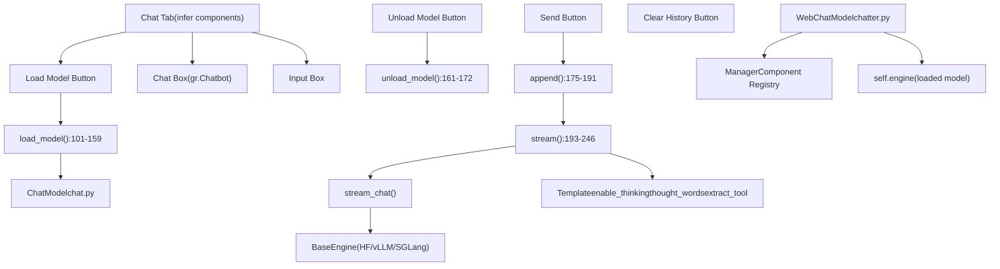
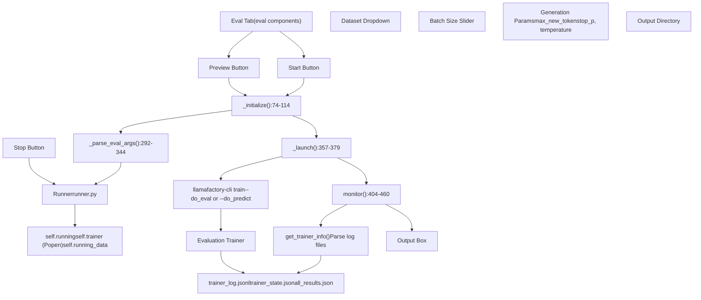
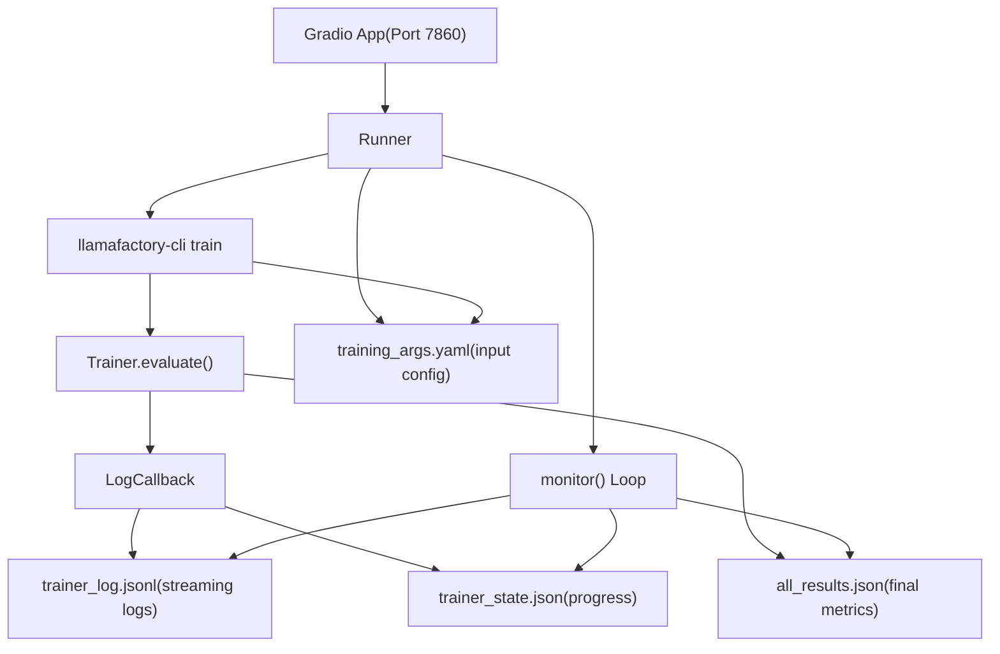

# 通过 Web UI 进行聊天和评测

相关源代码文件

-   [src/llamafactory/webui/chatter.py](https://github.com/hiyouga/LlamaFactory/blob/355d5c5e/src/llamafactory/webui/chatter.py)
-   [src/llamafactory/webui/common.py](https://github.com/hiyouga/LlamaFactory/blob/355d5c5e/src/llamafactory/webui/common.py)
-   [src/llamafactory/webui/components/export.py](https://github.com/hiyouga/LlamaFactory/blob/355d5c5e/src/llamafactory/webui/components/export.py)
-   [src/llamafactory/webui/components/top.py](https://github.com/hiyouga/LlamaFactory/blob/355d5c5e/src/llamafactory/webui/components/top.py)
-   [src/llamafactory/webui/components/train.py](https://github.com/hiyouga/LlamaFactory/blob/355d5c5e/src/llamafactory/webui/components/train.py)
-   [src/llamafactory/webui/engine.py](https://github.com/hiyouga/LlamaFactory/blob/355d5c5e/src/llamafactory/webui/engine.py)
-   [src/llamafactory/webui/locales.py](https://github.com/hiyouga/LlamaFactory/blob/355d5c5e/src/llamafactory/webui/locales.py)
-   [src/llamafactory/webui/manager.py](https://github.com/hiyouga/LlamaFactory/blob/355d5c5e/src/llamafactory/webui/manager.py)
-   [src/llamafactory/webui/runner.py](https://github.com/hiyouga/LlamaFactory/blob/355d5c5e/src/llamafactory/webui/runner.py)

本页说明如何使用 LLaMA Board Web 界面进行交互式聊天测试和模型评测。关于通过 Web UI 训练模型的信息，请参阅 [通过 Web UI 进行训练](/hiyouga/LlamaFactory/8.2-training-via-web-ui)。关于 Web UI 整体架构，请参阅 [Web UI 架构](/hiyouga/LlamaFactory/8.1-web-ui-architecture)。

## 概述

Web 界面为处理已训练或微调的模型提供了两项主要功能：

1.  **聊天界面**：加载模型并与之进行对话交互，支持纯文本和多模态输入（图片、视频、音频）。
2.  **评测界面**：在数据集上运行自动评测任务，以通过各项指标衡量模型性能。

这两项功能均独立于训练运行。聊天界面在进程内加载模型以实现即时交互，而评测则像训练一样派生隔离的子进程运行。

---

## 聊天界面架构

聊天功能通过 `WebChatModel` 类实现，该类将核心 `ChatModel` 推理引擎与特定于 Web 的状态管理和 UI 集成进行了封装。


**关键组件**

| 组件 | 文件位置 | 目的 |
| --- | --- | --- |
| `WebChatModel` | [src/llamafactory/webui/chatter.py80-246](https://github.com/hiyouga/LlamaFactory/blob/355d5c5e/src/llamafactory/webui/chatter.py#L80-L246) | 主聊天控制器，管理模型生命周期和推理 |
| `load_model()` | [src/llamafactory/webui/chatter.py101-159](https://github.com/hiyouga/LlamaFactory/blob/355d5c5e/src/llamafactory/webui/chatter.py#L101-L159) | 根据 UI 配置初始化推理引擎 |
| `stream()` | [src/llamafactory/webui/chatter.py193-246](https://github.com/hiyouga/LlamaFactory/blob/355d5c5e/src/llamafactory/webui/chatter.py#L193-L246) | 通过流式传输逐个 Token 地生成响应 |
| `append()` | [src/llamafactory/webui/chatter.py175-191](https://github.com/hiyouga/LlamaFactory/blob/355d5c5e/src/llamafactory/webui/chatter.py#L175-L191) | 将用户消息添加到对话历史记录中 |
| `unload_model()` | [src/llamafactory/webui/chatter.py161-172](https://github.com/hiyouga/LlamaFactory/blob/355d5c5e/src/llamafactory/webui/chatter.py#L161-L172) | 从内存中释放模型 |

**来源**：[src/llamafactory/webui/chatter.py1-247](https://github.com/hiyouga/LlamaFactory/blob/355d5c5e/src/llamafactory/webui/chatter.py#L1-L247)

---

## 聊天工作流

### 模型加载

在聊天之前，用户必须将模型加载到内存中。加载过程会验证配置并初始化推理引擎。

**模型加载过程**

`load_model()` 方法 [src/llamafactory/webui/chatter.py101-159](https://github.com/hiyouga/LlamaFactory/blob/355d5c5e/src/llamafactory/webui/chatter.py#L101-L159) 执行以下步骤：

1.  **提取配置**：通过 `Manager` 注册表从 UI 组件检索值。

    -   模型路径：`get("top.model_path")`
    -   模板：`get("top.template")`
    -   推理后端：`get("infer.infer_backend")`
    -   检查点路径：`get("top.checkpoint_path")`
2.  **校验**：检查常见错误。

    -   模型已加载：`if self.loaded` [第 108 行](https://github.com/hiyouga/LlamaFactory/blob/355d5c5e/line 108)
    -   缺少模型名称或路径 [第 110-113 行](https://github.com/hiyouga/LlamaFactory/blob/355d5c5e/lines 110-113)
    -   额外参数中的 JSON 无效 [第 117-120 行](https://github.com/hiyouga/LlamaFactory/blob/355d5c5e/lines 117-120)
3.  **构建参数字典**：构造用于 `ChatModel` 初始化的参数 [第 128-140 行](https://github.com/hiyouga/LlamaFactory/blob/355d5c5e/lines 128-140)。

    ```
    args = dict(    model_name_or_path=model_path,    finetuning_type=finetuning_type,    template=get("top.template"),    infer_backend=get("infer.infer_backend"),    infer_dtype=get("infer.infer_dtype"),    ...)
    ```

4.  **处理检查点**：为 PEFT 方法添加适配器路径，或为全量微调更新模型路径 [第 144-150 行](https://github.com/hiyouga/LlamaFactory/blob/355d5c5e/lines 144-150)。

5.  **处理量化**：如果启用，则添加量化参数 [第 153-156 行](https://github.com/hiyouga/LlamaFactory/blob/355d5c5e/lines 153-156)。

6.  **初始化基础 ChatModel**：调用 `super().__init__(args)` [第 158 行](https://github.com/hiyouga/LlamaFactory/blob/355d5c5e/line 158)，使用所选的推理后端加载模型。


**配置参数**

| 参数 | UI 元素 | 目的 | 默认值 |
| --- | --- | --- | --- |
| `model_name_or_path` | top.model\_path | 基础模型的路径 | 必填 |
| `finetuning_type` | top.finetuning\_type | 适配器类型 (lora/full/freeze/oft) | lora |
| `adapter_name_or_path` | top.checkpoint\_path | 适配器检查点的路径 | 无 |
| `template` | top.template | 聊天模板名称 | default |
| `infer_backend` | infer.infer\_backend | 引擎 (huggingface/vllm/sglang) | huggingface |
| `infer_dtype` | infer.infer\_dtype | 推理精度 (auto/float16/bfloat16) | auto |
| `quantization_bit` | top.quantization\_bit | 量化等级 (4/8 bit) | 无 |
| `flash_attn` | top.booster | Flash Attention 设置 | auto |

**来源**：[src/llamafactory/webui/chatter.py101-159](https://github.com/hiyouga/LlamaFactory/blob/355d5c5e/src/llamafactory/webui/chatter.py#L101-L159)

---

### 发送消息与流式响应

加载模型后，用户即可发送消息并接收流式响应。

**添加消息**

静态方法 `append()` [src/llamafactory/webui/chatter.py175-191](https://github.com/hiyouga/LlamaFactory/blob/355d5c5e/src/llamafactory/webui/chatter.py#L175-L191) 将用户输入添加到对话中：

-   **输入**：当前聊天机器人显示内容、消息历史、角色、用户查询、HTML 转义标志。
-   **过程**：
    -   如果 `escape_html=True`，则使用 `_escape_html()` 进行 HTML 转义 [第 41-43 行](https://github.com/hiyouga/LlamaFactory/blob/355d5c5e/lines 41-43)。
    -   将 `{"role": "user", "content": query}` 添加到聊天机器人显示中。
    -   将 `{"role": role, "content": query}` 添加到消息中作为模型输入。
-   **输出**：更新后的聊天机器人、更新后的消息、空查询字符串。

**流式推理**

`stream()` 方法 [src/llamafactory/webui/chatter.py193-246](https://github.com/hiyouga/LlamaFactory/blob/355d5c5e/src/llamafactory/webui/chatter.py#L193-L246) 增量生成响应：

1.  **启用思考模式**：如果是推理模型，则临时设置 `self.engine.template.enable_thinking` [第 215 行](https://github.com/hiyouga/LlamaFactory/blob/355d5c5e/line 215)。

2.  **初始化响应**：向聊天机器人追加空的助手消息 [第 216 行](https://github.com/hiyouga/LlamaFactory/blob/355d5c5e/line 216)。

3.  **调用基础流式聊天**：使用对话参数调用 `self.stream_chat()` [第 218-229 行](https://github.com/hiyouga/LlamaFactory/blob/355d5c5e/lines 218-229)。

    -   `messages`：完整对话历史。
    -   `system`：系统提示词。
    -   `tools`：工具定义 (JSON 字符串)。
    -   `images`、`videos`、`audios`：多模态输入。
    -   `max_new_tokens`、`top_p`、`temperature`：生成参数。
4.  **处理每个 Token**：

    -   将 Token 累加到 `response` 中 [第 230 行](https://github.com/hiyouga/LlamaFactory/blob/355d5c5e/line 230)。
    -   如果提供了工具，尝试使用 `template.extract_tool()` 提取工具调用 [第 232 行](https://github.com/hiyouga/LlamaFactory/blob/355d5c5e/line 232)。
    -   如果检测到工具调用，则格式化为 JSON [第 236-239 行](https://github.com/hiyouga/LlamaFactory/blob/355d5c5e/lines 236-239)。
    -   否则，对响应进行包含思考过程提取的格式化 [第 243 行](https://github.com/hiyouga/LlamaFactory/blob/355d5c5e/line 243)。
5.  **更新显示**：更新聊天机器人中的最后一条消息并 Yield [第 245-246 行](https://github.com/hiyouga/LlamaFactory/blob/355d5c5e/lines 245-246)。


**思考模式下的响应格式化**

`_format_response()` 助手函数 [src/llamafactory/webui/chatter.py46-69](https://github.com/hiyouga/LlamaFactory/blob/355d5c5e/src/llamafactory/webui/chatter.py#L46-L69) 处理产生“思考”Token 的推理模型：

-   检查响应是否包含起始思考标记 (`thought_words[0]`)。
-   在结束思考标记 (`thought_words[1]`) 处拆分响应。
-   将思考内容包装在可展开的 `<details>` HTML 元素中。
-   默认仅显示最终答案，点击即可查看思考过程。

**来源**：[src/llamafactory/webui/chatter.py175-246](https://github.com/hiyouga/LlamaFactory/blob/355d5c5e/src/llamafactory/webui/chatter.py#L175-L246) [src/llamafactory/webui/chatter.py46-69](https://github.com/hiyouga/LlamaFactory/blob/355d5c5e/src/llamafactory/webui/chatter.py#L46-L69)

---

### 多模态支持

当使用兼容的多模态模型时，聊天界面支持图像、视频和音频输入。

**多模态输入流程**

| 媒体类型 | UI 组件 | 处理方式 | 模型输入 |
| --- | --- | --- | --- |
| 图像 | `infer.image` (gr.Image) | 作为列表传递给 `images` 参数 | 通过处理器转换的像素值 |
| 视频 | `infer.video` (gr.Video) | 作为列表传递给 `videos` 参数 | 通过处理器转换的帧张量 |
| 音频 | `infer.audio` (gr.Audio) | 作为列表传递给 `audios` 参数 | 通过处理器转换的波形张量 |

`stream()` 方法将媒体文件传递给基础 `stream_chat()` [第 222-224 行](https://github.com/hiyouga/LlamaFactory/blob/355d5c5e/lines 222-224)：

```
images=[image] if image else None,videos=[video] if video else None,audios=[audio] if audio else None,
```
基础 `ChatModel` 通过多模态插件系统处理媒体（详情请参阅 [多模态数据处理](/hiyouga/LlamaFactory/4.3-multimodal-data-processing)）。

**来源**：[src/llamafactory/webui/chatter.py193-246](https://github.com/hiyouga/LlamaFactory/blob/355d5c5e/src/llamafactory/webui/chatter.py#L193-L246)

---

### 模型卸载

为了释放 GPU 显存，用户可以在不关闭 Web 界面的情况下卸载模型。

**卸载过程**

`unload_model()` 方法 [src/llamafactory/webui/chatter.py161-172](https://github.com/hiyouga/LlamaFactory/blob/355d5c5e/src/llamafactory/webui/chatter.py#L161-L172) 执行清理工作：

1.  检查是否为演示模式（演示模式下禁用卸载） [第 164-167 行](https://github.com/hiyouga/LlamaFactory/blob/355d5c5e/lines 164-167)。
2.  Yield “正在卸载...”状态消息。
3.  设置 `self.engine = None` [第 170 行](https://github.com/hiyouga/LlamaFactory/blob/355d5c5e/line 170) —— 释放模型引用。
4.  调用 `torch_gc()` [第 171 行](https://github.com/hiyouga/LlamaFactory/blob/355d5c5e/line 171) 释放 GPU 显存（执行垃圾回收并清理 CUDA 缓存）。
5.  Yield “已卸载”状态消息。

卸载后，用户必须重新加载模型才能继续聊天。

**来源**：[src/llamafactory/webui/chatter.py161-172](https://github.com/hiyouga/LlamaFactory/blob/355d5c5e/src/llamafactory/webui/chatter.py#L161-L172)

---

## 评测界面架构

评测功能重用了训练基础设施，但运行的是评测特定的任务。评测任务在隔离的子进程中执行，以防止干扰 Web 服务器。


**关键组件**

| 组件 | 文件位置 | 目的 |
| --- | --- | --- |
| `Runner` | [src/llamafactory/webui/runner.py54-506](https://github.com/hiyouga/LlamaFactory/blob/355d5c5e/src/llamafactory/webui/runner.py#L54-L506) | 管理评测任务生命周期 |
| `_parse_eval_args()` | [src/llamafactory/webui/runner.py292-344](https://github.com/hiyouga/LlamaFactory/blob/355d5c5e/src/llamafactory/webui/runner.py#L292-L344) | 从 UI 状态构建评测参数 |
| `_initialize()` | [src/llamafactory/webui/runner.py74-114](https://github.com/hiyouga/LlamaFactory/blob/355d5c5e/src/llamafactory/webui/runner.py#L74-L114) | 启动前验证配置 |
| `_launch()` | [src/llamafactory/webui/runner.py357-379](https://github.com/hiyouga/LlamaFactory/blob/355d5c5e/src/llamafactory/webui/runner.py#L357-L379) | 派生评测子进程 |
| `monitor()` | [src/llamafactory/webui/runner.py404-460](https://github.com/hiyouga/LlamaFactory/blob/355d5c5e/src/llamafactory/webui/runner.py#L404-L460) | 跟踪进度并显示结果 |

**来源**：[src/llamafactory/webui/runner.py1-506](https://github.com/hiyouga/LlamaFactory/blob/355d5c5e/src/llamafactory/webui/runner.py#L1-L506)

---

## 评测工作流

### 配置评测

用户通过 Eval 选项卡配置评测，该选项卡与其他选项卡共享顶部面板配置（模型、检查点、模板）。

**评测特定配置**

`_parse_eval_args()` 方法 [src/llamafactory/webui/runner.py292-344](https://github.com/hiyouga/LlamaFactory/blob/355d5c5e/src/llamafactory/webui/runner.py#L292-L344) 构建评测参数字典：

```
args = dict(    stage="sft",                          # 评测始终使用 SFT 阶段    model_name_or_path=get("top.model_path"),    finetuning_type=finetuning_type,    template=get("top.template"),    eval_dataset=",".join(get("eval.dataset")),  # 连接多个数据集    cutoff_len=get("eval.cutoff_len"),    per_device_eval_batch_size=get("eval.batch_size"),    predict_with_generate=True,           # 生成序列而非仅计算损失    max_new_tokens=get("eval.max_new_tokens"),    top_p=get("eval.top_p"),    temperature=get("eval.temperature"),    output_dir=get_save_dir(...),    ...)
```
**评测与预测模式**

系统支持两种评测模式 [第 324-327 行](https://github.com/hiyouga/LlamaFactory/blob/355d5c5e/lines 324-327)：

-   **评测模式** (`do_eval=True`)：在有标签的数据上计算指标（例如：困惑度、BLEU）。
-   **预测模式** (`do_predict=True`)：仅生成输出而不计算指标。

模式由 UI 中的 `eval.predict` 复选框控制。

**参数摘要**

| 参数 | UI 元素 | 目的 | 默认值 |
| --- | --- | --- | --- |
| `eval_dataset` | eval.dataset | 要评测的数据集 | 必填 |
| `cutoff_len` | eval.cutoff\_len | 最大序列长度 | 2048 |
| `batch_size` | eval.batch\_size | 每设备样本数 | 2 |
| `max_new_tokens` | eval.max\_new\_tokens | 最大生成 Token 数 | 512 |
| `top_p` | eval.top\_p | 核采样阈值 | 0.9 |
| `temperature` | eval.temperature | 采样温度 | 1.0 |
| `output_dir` | eval.output\_dir | 结果保存位置 | 必填 |

**来源**：[src/llamafactory/webui/runner.py292-344](https://github.com/hiyouga/LlamaFactory/blob/355d5c5e/src/llamafactory/webui/runner.py#L292-L344)

---

### 启动与监控评测

评测在子进程中运行，以实现与 Web 服务器进程的隔离。

**子进程启动**

`_launch()` 方法 [src/llamafactory/webui/runner.py357-379](https://github.com/hiyouga/LlamaFactory/blob/355d5c5e/src/llamafactory/webui/runner.py#L357-L379) 派生评测进程：

1.  **校验**：调用 `_initialize()` 检查配置 [第 360 行](https://github.com/hiyouga/LlamaFactory/blob/355d5c5e/line 360)。

2.  **构建参数**：调用 `_parse_eval_args()` [第 366 行](https://github.com/hiyouga/LlamaFactory/blob/355d5c5e/line 366)。

3.  **保存配置**：将 YAML 配置写入输出目录 [第 369 行](https://github.com/hiyouga/LlamaFactory/blob/355d5c5e/line 369)。

    ```
    save_args(os.path.join(args["output_dir"], LLAMABOARD_CONFIG),           self._build_config_dict(data))
    ```

4.  **设置环境变量** [第 371-375 行](https://github.com/hiyouga/LlamaFactory/blob/355d5c5e/lines 371-375)：

    -   `LLAMABOARD_ENABLED=1`：指示这是一个 Web UI 任务。
    -   `LLAMABOARD_WORKDIR`：用于监控的输出目录。
5.  **派生进程** [第 378 行](https://github.com/hiyouga/LlamaFactory/blob/355d5c5e/line 378)：

    ```
    self.trainer = Popen(["llamafactory-cli", "train", save_cmd(args)],                      env=env, stderr=PIPE, text=True)
    ```

    注：即使是评测也使用 `train` 命令，因为 CLI 会根据 `do_eval`/`do_predict` 标志进行分发。

6.  **开始监控**：从 `monitor()` 生成器 Yield [第 379 行](https://github.com/hiyouga/LlamaFactory/blob/355d5c5e/line 379)。


**来源**：[src/llamafactory/webui/runner.py357-379](https://github.com/hiyouga/LlamaFactory/blob/355d5c5e/src/llamafactory/webui/runner.py#L357-L379)

---

### 进度监控

`monitor()` 方法 [src/llamafactory/webui/runner.py404-460](https://github.com/hiyouga/LlamaFactory/blob/355d5c5e/src/llamafactory/webui/runner.py#L404-L460) 通过读取子进程写入的日志文件来跟踪评测进度。

**监控循环**

```
while return_code == -1:    running_log, running_progress, running_info = get_trainer_info(lang, output_path, self.do_train)    return_dict = {        output_box: running_log,        progress_bar: running_progress,    }    yield return_dict        try:        stderr = self.trainer.communicate(timeout=2)[1]        return_code = self.trainer.returncode    except TimeoutExpired:        continue
```
**关键监控函数**

1.  **`get_trainer_info()`** [src/llamafactory/webui/control.py](https://github.com/hiyouga/LlamaFactory/blob/355d5c5e/src/llamafactory/webui/control.py) —— 解析日志文件以提取：

    -   来自 `trainer_log.jsonl` 的运行日志消息。
    -   来自 `trainer_state.json` 的进度百分比。
    -   用于可视化的损失曲线（仅限训练模式）。
2.  **进程通信**：每 2 秒尝试与子进程通信一次 [第 442 行](https://github.com/hiyouga/LlamaFactory/blob/355d5c5e/line 442)。

    -   `timeout=2`：非阻塞检查。
    -   如果子进程退出，捕获 `return_code` 和 `stderr`。
    -   如果超时，继续监控循环。
3.  **中止处理**：如果用户点击“停止”，则调用 `set_abort()` [第 69-72 行](https://github.com/hiyouga/LlamaFactory/blob/355d5c5e/lines 69-72)：

    ```
    def set_abort(self) -> None:    self.aborted = True    if self.trainer is not None:        abort_process(self.trainer.pid)  # 递归杀死子进程
    ```


**来源**：[src/llamafactory/webui/runner.py404-460](https://github.com/hiyouga/LlamaFactory/blob/355d5c5e/src/llamafactory/webui/runner.py#L404-L460)

---

### 查看结果

当评测成功完成时，结果将显示在输出框中。

**结果加载**

对于评测模式（非预测），系统从 `all_results.json` 加载指标 [第 447-452 行](https://github.com/hiyouga/LlamaFactory/blob/355d5c5e/lines 447-452)：

```
if return_code == 0 or self.aborted:    if self.do_train:        finish_log = ALERTS["info_finished"][lang] + "\n\n" + running_log    else:        finish_log = load_eval_results(os.path.join(output_path, "all_results.json")) + "\n\n" + running_log
```
`load_eval_results()` 函数 [src/llamafactory/webui/common.py212-217](https://github.com/hiyouga/LlamaFactory/blob/355d5c5e/src/llamafactory/webui/common.py#L212-L217) 格式化 JSON 指标：

```
def load_eval_results(path: os.PathLike) -> str:    with open(path, encoding="utf-8") as f:        result = json.dumps(json.load(f), indent=4)    return f"```json\n{result}\n```\n"
```
**典型评测指标**

`all_results.json` 文件包含由训练器计算的指标，可能包括：

-   `eval_loss`：评测集上的交叉熵损失。
-   `eval_runtime`：总评测时间。
-   `eval_samples_per_second`：吞吐量。
-   `eval_steps_per_second`：步进吞吐量。
-   任务特定指标（BLEU、ROUGE、准确率等，如果定义了自定义的 compute\_metrics）。

**预测输出**

对于预测模式，生成的序列将保存到输出目录下的 `generated_predictions.jsonl` 中。每一行包含：

-   `input`：原始输入文本。
-   `output`：模型生成的文本。
-   `label`（如果可用）：用于比较的基准真相 (Ground Truth)。

**来源**：[src/llamafactory/webui/runner.py447-460](https://github.com/hiyouga/LlamaFactory/blob/355d5c5e/src/llamafactory/webui/runner.py#L447-L460) [src/llamafactory/webui/common.py212-217](https://github.com/hiyouga/LlamaFactory/blob/355d5c5e/src/llamafactory/webui/common.py#L212-L217)

---

## 实现细节

### 通过 Manager 进行状态管理

`Manager` 类 [src/llamafactory/webui/manager.py23-71](https://github.com/hiyouga/LlamaFactory/blob/355d5c5e/src/llamafactory/webui/manager.py#L23-L71) 维护 UI 组件与字符串标识符之间的双向映射。

**组件注册表**

```
class Manager:    def __init__(self) -> None:        self._id_to_elem: dict[str, Component] = {}        self._elem_to_id: dict[Component, str] = {}
```
组件通过分层 ID 进行注册，如 `"top.model_name"`、`"eval.dataset"`、`"infer.chatbot"`。

**在聊天和评测中的用法**

`WebChatModel` 和 `Runner` 都会接收一个 `Manager` 实例，并使用它来访问 UI 状态：

```
get = lambda elem_id: data[self.manager.get_elem_by_id(elem_id)]model_path = get("top.model_path")dataset = get("eval.dataset")
```
这种模式可以实现：

-   **类型安全**：通过字符串 ID 访问组件，防止拼写错误。
-   **模块化**：只要 ID 保持一致，UI 布局更改不会破坏逻辑。
-   **状态持久化**：所有 UI 状态都捕获在 `data` 字典中，用于保存/加载配置。

**来源**：[src/llamafactory/webui/manager.py23-71](https://github.com/hiyouga/LlamaFactory/blob/355d5c5e/src/llamafactory/webui/manager.py#L23-L71) [src/llamafactory/webui/chatter.py102](https://github.com/hiyouga/LlamaFactory/blob/355d5c5e/src/llamafactory/webui/chatter.py#L102-L102) [src/llamafactory/webui/runner.py294](https://github.com/hiyouga/LlamaFactory/blob/355d5c5e/src/llamafactory/webui/runner.py#L294-L294)

---

### 进程隔离与通信

评测在子进程中运行，以提供隔离，并能在长时间运行的任务期间实现并发的 Web UI 访问。

**子进程架构**


**通信模式**

1.  **输入**：Web UI 将配置写入 YAML 文件 [src/llamafactory/webui/common.py202-209](https://github.com/hiyouga/LlamaFactory/blob/355d5c5e/src/llamafactory/webui/common.py#L202-L209)。
2.  **启动**：派生带有 `LLAMABOARD_ENABLED` 环境变量的子进程。
3.  **监控**：Web UI 每 2 秒轮询一次日志文件。
4.  **输出**：子进程将指标写入 JSON 文件。
5.  **完成**：进程退出，UI 读取最终结果。

这种基于文件的 IPC 模式提供了：

-   **鲁棒性**：Web 服务器重启不会丢失评测状态。
-   **可调试性**：日志文件可供查阅。
-   **简单性**：无需管道、套接字或共享内存。

**中止机制**

要停止评测， UI 调用 `abort_process()` [src/llamafactory/webui/common.py46-56](https://github.com/hiyouga/LlamaFactory/blob/355d5c5e/src/llamafactory/webui/common.py#L46-L56)：

```
def abort_process(pid: int) -> None:    try:        children = Process(pid).children()        if children:            for child in children:                abort_process(child.pid)  # 递归自底向上        os.kill(pid, signal.SIGABRT)    except Exception:        pass
```
这会在杀死父进程之前递归地终止所有子进程（例如：分布式训练工作线程）。

**来源**：[src/llamafactory/webui/runner.py357-460](https://github.com/hiyouga/LlamaFactory/blob/355d5c5e/src/llamafactory/webui/runner.py#L357-L460) [src/llamafactory/webui/common.py46-56](https://github.com/hiyouga/LlamaFactory/blob/355d5c5e/src/llamafactory/webui/common.py#L46-L56) [src/llamafactory/webui/common.py202-209](https://github.com/hiyouga/LlamaFactory/blob/355d5c5e/src/llamafactory/webui/common.py#L202-L209)

---

## 配置持久化

聊天和评测配置均可保存并加载，以实现可复现性。

**保存配置**

`Runner.save_args()` 方法 [src/llamafactory/webui/runner.py462-476](https://github.com/hiyouga/LlamaFactory/blob/355d5c5e/src/llamafactory/webui/runner.py#L462-L476) 将当前 UI 状态保存到 YAML 文件：

```
def save_args(self, data):    config_path = data[self.manager.get_elem_by_id("train.config_path")]    save_path = os.path.join(DEFAULT_CONFIG_DIR, config_path)    save_args(save_path, self._build_config_dict(data))
```
配置排除了运行时特定的字段，如 `top.lang`、`top.model_path`、`train.output_dir` [第 384 行](https://github.com/hiyouga/LlamaFactory/blob/355d5c5e/line 384)。

**加载配置**

`Runner.load_args()` 方法 [src/llamafactory/webui/runner.py478-490](https://github.com/hiyouga/LlamaFactory/blob/355d5c5e/src/llamafactory/webui/runner.py#L478-L490) 恢复 UI 状态：

```
def load_args(self, lang: str, config_path: str):    config_dict = load_args(os.path.join(DEFAULT_CONFIG_DIR, config_path))    output_dict: dict[Component, Any] = {}    for elem_id, value in config_dict.items():        output_dict[self.manager.get_elem_by_id(elem_id)] = value    return output_dict
```
这将返回一个将 UI 组件映射到其保存值的字典，Gradio 会自动应用这些值。

**自动恢复检查点**

当用户输入现有的输出目录时，`check_output_dir()` [src/llamafactory/webui/runner.py492-505](https://github.com/hiyouga/LlamaFactory/blob/355d5c5e/src/llamafactory/webui/runner.py#L492-L505) 会自动从该目录中的 `llamaboard_config.yaml` 加载配置：

```
if os.path.isdir(get_save_dir(model_name, finetuning_type, output_dir)):    output_dir = get_save_dir(model_name, finetuning_type, output_dir)    config_dict = load_args(os.path.join(output_dir, LLAMABOARD_CONFIG))    for elem_id, value in config_dict.items():        output_dict[self.manager.get_elem_by_id(elem_id)] = value
```
这使得恢复评测或复制先前的配置成为可能。

**来源**：[src/llamafactory/webui/runner.py462-505](https://github.com/hiyouga/LlamaFactory/blob/355d5c5e/src/llamafactory/webui/runner.py#L462-L505) [src/llamafactory/webui/common.py154-166](https://github.com/hiyouga/LlamaFactory/blob/355d5c5e/src/llamafactory/webui/common.py#L154-L166)
