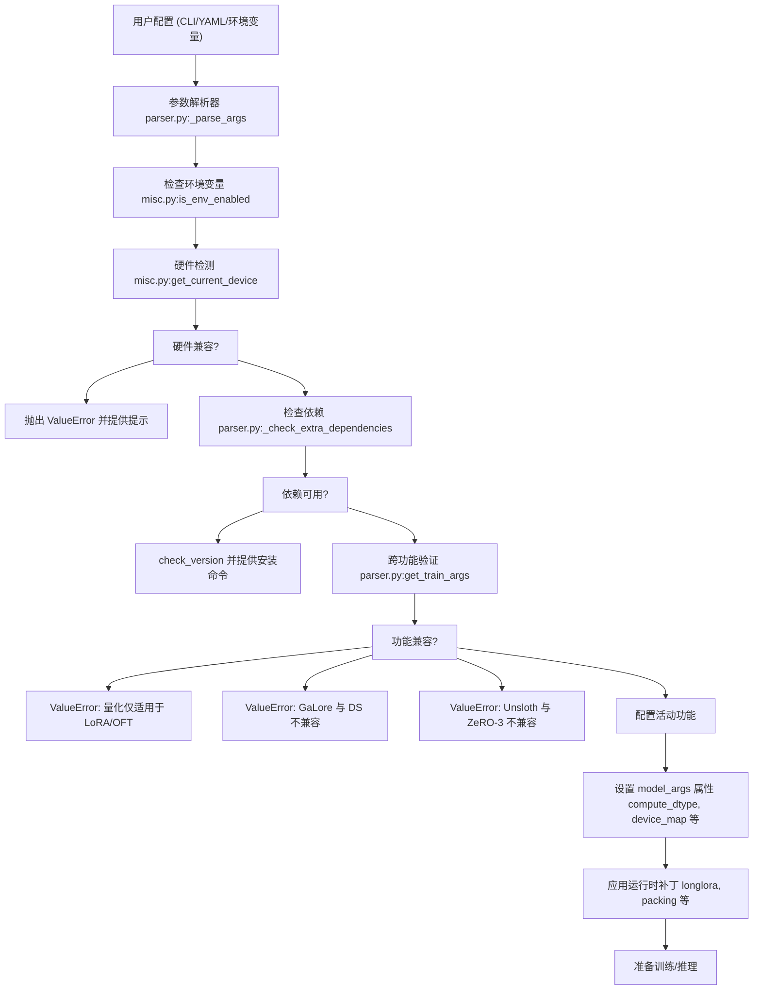
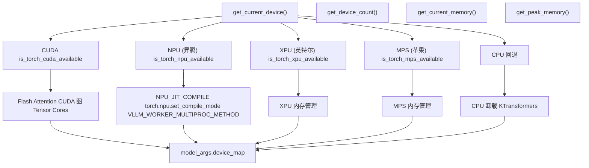
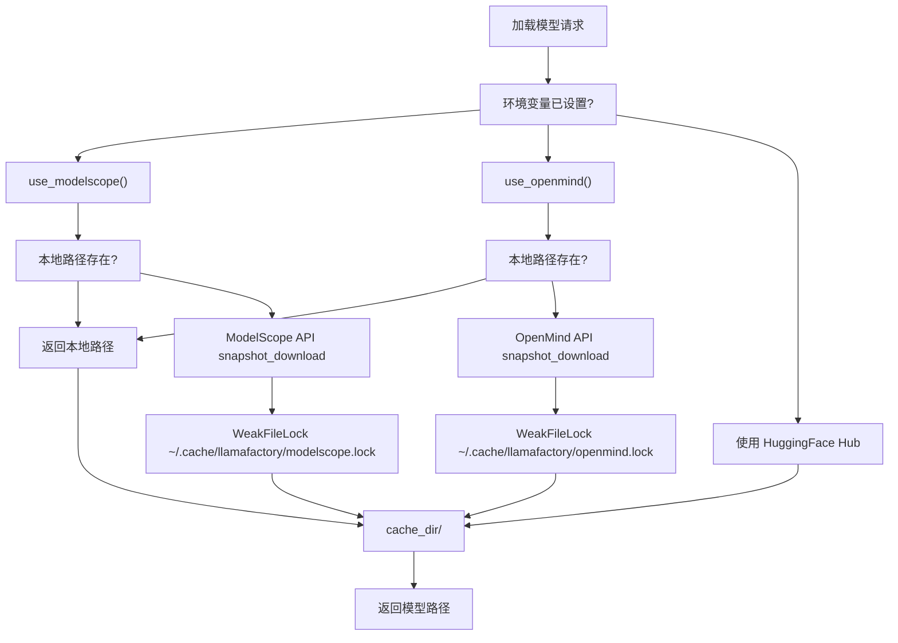
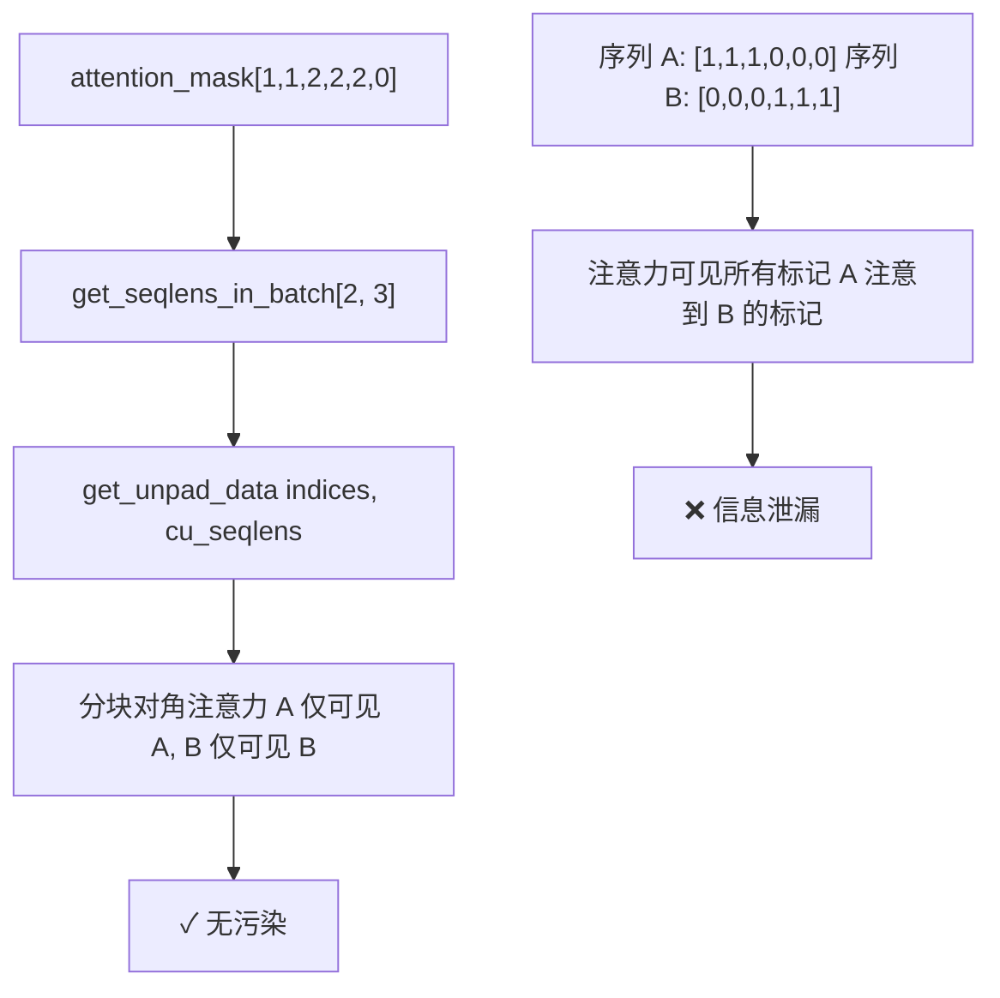
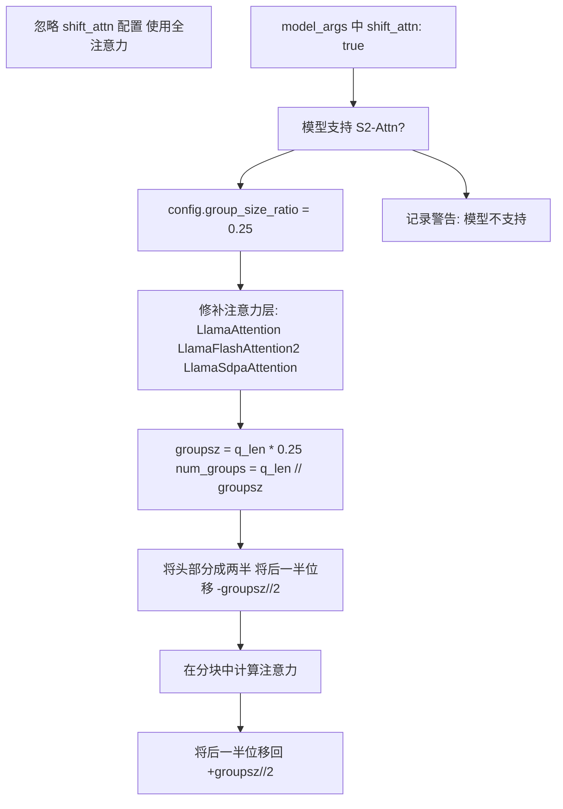
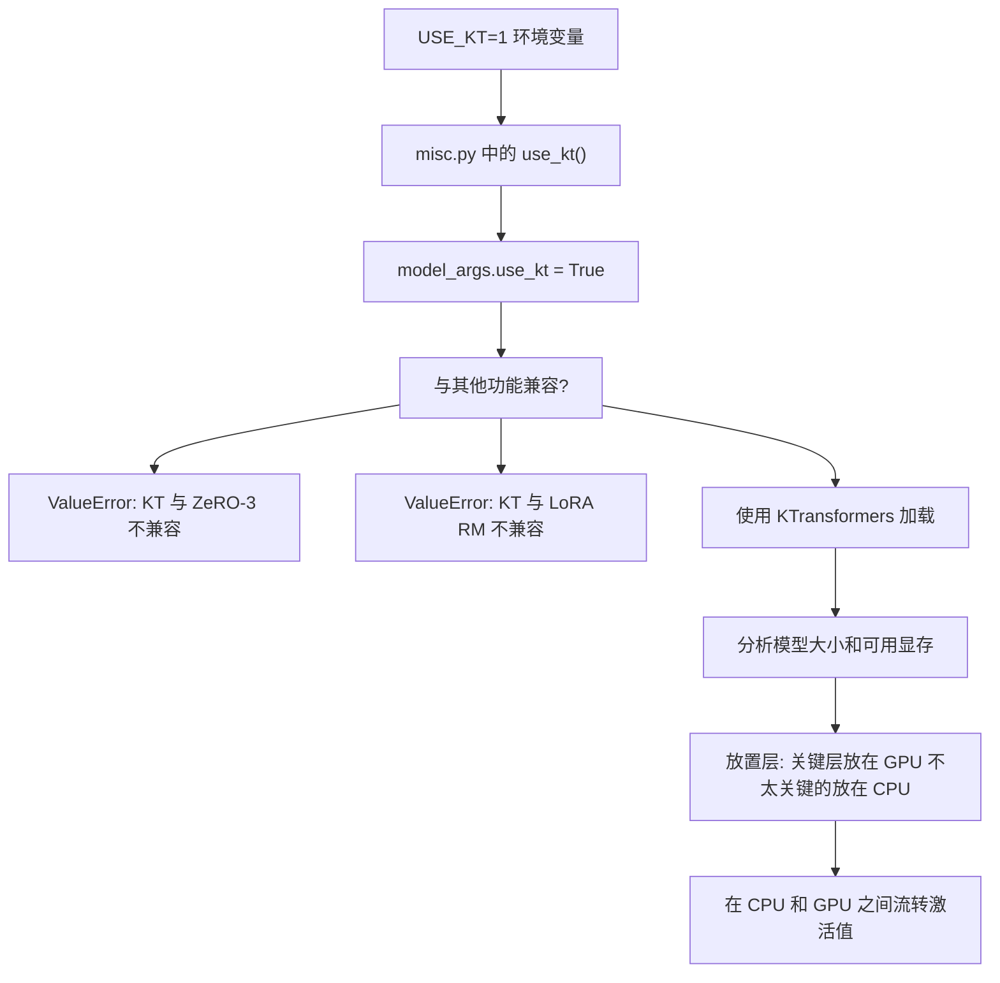
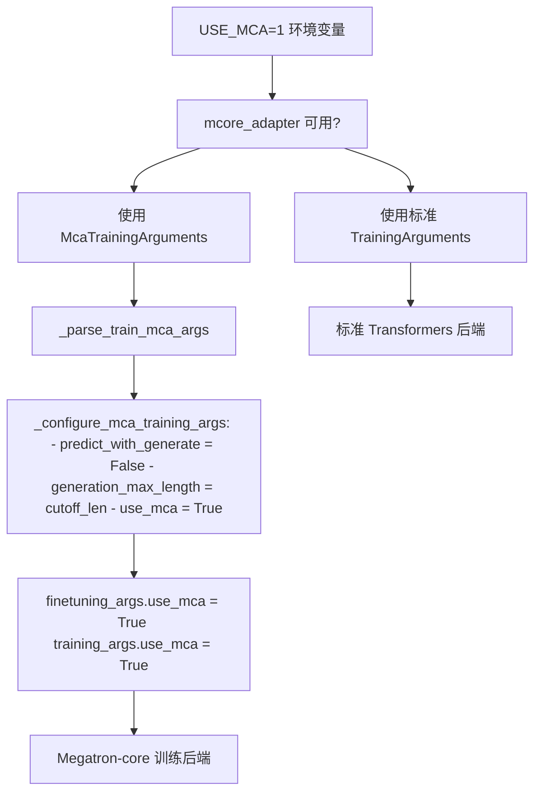
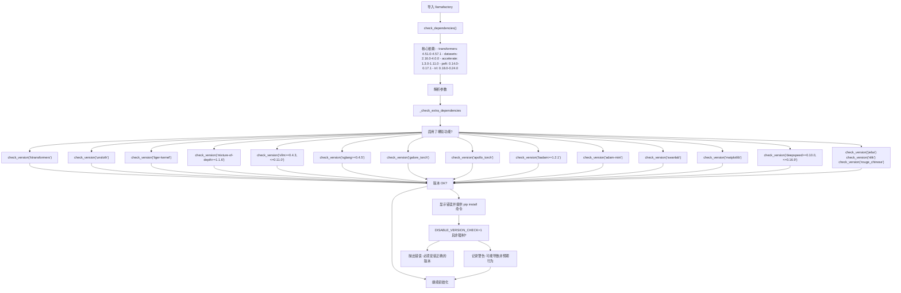

# 高级主题

相关源文件

-   [README.md](https://github.com/hiyouga/LlamaFactory/blob/355d5c5e/README.md?plain=1)
-   [README\_zh.md](https://github.com/hiyouga/LlamaFactory/blob/355d5c5e/README_zh.md?plain=1)
-   [src/llamafactory/\_\_init\_\_.py](https://github.com/hiyouga/LlamaFactory/blob/355d5c5e/src/llamafactory/__init__.py)
-   [src/llamafactory/extras/misc.py](https://github.com/hiyouga/LlamaFactory/blob/355d5c5e/src/llamafactory/extras/misc.py)
-   [src/llamafactory/hparams/parser.py](https://github.com/hiyouga/LlamaFactory/blob/355d5c5e/src/llamafactory/hparams/parser.py)
-   [src/llamafactory/model/model\_utils/longlora.py](https://github.com/hiyouga/LlamaFactory/blob/355d5c5e/src/llamafactory/model/model_utils/longlora.py)
-   [src/llamafactory/model/model\_utils/packing.py](https://github.com/hiyouga/LlamaFactory/blob/355d5c5e/src/llamafactory/model/model_utils/packing.py)

本文档概述了 LlamaFactory 的高级功能、专用配置和优化技术。这些主题超出了标准微调工作流程，支持前沿研究、特定硬件优化以及生产级部署。

**范围**：本页面涵盖高级功能的架构和集成点。详细配置和用法请参阅：

-   硬件特定设置和优化：见 [硬件支持](/hiyouga/LlamaFactory/9.1-hardware-support)
-   完整环境变量参考：见 [环境变量与配置](/hiyouga/LlamaFactory/9.2-environment-variables-and-configuration)
-   性能调优和加速技术：见 [性能优化](/hiyouga/LlamaFactory/9.3-performance-optimization)
-   MoE 模型训练与部署：见 [混合专家 (MoE) 模型](/hiyouga/LlamaFactory/9.4-mixture-of-experts-(moe)-models)

基础训练配置和标准工作流程请参阅 [配置系统](/hiyouga/LlamaFactory/3-configuration-system) 和 [训练系统](/hiyouga/LlamaFactory/6-training-system)。

---

## 高级功能的系统架构

LlamaFactory 采用模块化架构，根据配置、环境变量和运行时检查条件化激活高级功能。系统在参数解析期间进行早期验证，以确保兼容性并防止训练期间发生高代价失败。

### 功能检测与验证流程

**来源**：[src/llamafactory/hparams/parser.py85-471](https://github.com/hiyouga/LlamaFactory/blob/355d5c5e/src/llamafactory/hparams/parser.py#L85-L471)

### 硬件抽象层

系统为不同的硬件加速器实现了统一接口，自动检测可用设备并配置适当的内存管理和计算策略。

**来源**：[src/llamafactory/extras/misc.py144-206](https://github.com/hiyouga/LlamaFactory/blob/355d5c5e/src/llamafactory/extras/misc.py#L144-L206) [src/llamafactory/hparams/parser.py109-115](https://github.com/hiyouga/LlamaFactory/blob/355d5c5e/src/llamafactory/hparams/parser.py#L109-L115)

---

## 环境变量配置系统

LlamaFactory 使用环境变量控制系统行为，无需修改代码或配置文件。这支持运行时功能切换、调试和特定平台优化。

### 环境变量分类

| 类别 | 变量 | 用途 |
| --- | --- | --- |
| **Hub 选择** | `USE_MODELSCOPE_HUB` `USE_OPENMIND_HUB` | 选择模型/数据集下载源 (HuggingFace, ModelScope, OpenMind) |
| **硬件控制** | `NPU_JIT_COMPILE` `VLLM_WORKER_MULTIPROC_METHOD` `LOCAL_RANK` | 硬件特定优化和设备分配 |
| **调试** | `DISABLE_VERSION_CHECK` `LLAMAFACTORY_VERBOSITY` `RECORD_VRAM` `FORCE_CHECK_IMPORTS` | 控制日志、验证和监控 |
| **训练后端** | `USE_MCA` `FORCE_TORCHRUN` `ALLOW_EXTRA_ARGS` | 选择训练后端 (标准、Megatron-core) 和分布式启动 |
| **功能标志** | `USE_RAY` `USE_KT` | 启用实验性功能 (Ray, KTransformers) |

### Hub 选择模式

**来源**：[src/llamafactory/extras/misc.py267-310](https://github.com/hiyouga/LlamaFactory/blob/355d5c5e/src/llamafactory/extras/misc.py#L267-L310) [src/llamafactory/\_\_init\_\_.py15-26](https://github.com/hiyouga/LlamaFactory/blob/355d5c5e/src/llamafactory/__init__.py#L15-L26)

---

## 性能优化框架

LlamaFactory 集成了多种性能优化技术，可根据硬件能力和模型特征进行组合。系统在模型初始化期间验证兼容性并应用优化。

### 优化类别与集成点

```mermaid
flowchart TD
    FlashAttn["FlashAttention-2 flash_attn: fa2_is_bf16_available"]
    Unsloth["Unsloth use_unsloth: true check_version('unsloth')"]
    Liger["Liger Kernel enable_liger_kernel: true check_version('liger-kernel')"]
    Quantization["量化 quantization_bit: 4/8 BitsAndBytes/GPTQ/AWQ"]
    GradChk["梯度检查点 gradient_checkpointing: true 降低 VRAM"]
    Packing["序列打包 packing: true block_diag_attn: true"]
    ShiftAttn["位移注意力 (S^2-Attn) shift_attn: true LongLoRA 扩展"]
    RopeScaling["RoPE 缩放 rope_scaling: linear/dynamic 上下文扩展"]
    MoD["深度混合 mixture_of_depths: string 选择性计算"]
    GaLore["GaLore use_galore: true 低秩梯度投影"]
    BAdam["BAdam use_badam: true 分块 Adam"]
    Apollo["APOLLO use_apollo: true 自适应优化器"]
    AdamMini["Adam-mini use_adam_mini: true 降低显存型 Adam"]
    Muon["Muon use_muon: true 动量型优化器"]
    FP8["FP8 训练 fp8: true fp8_enable_fsdp_float8_all_gather"]
    PureBF16["纯 BF16 pure_bf16: true 无 FP32 主权重"]
    NEFTune["NEFTune neftune_noise_alpha: 5 噪声注入"]
    ValidateArgs["parser.py:get_train_args 交叉验证"]
    ApplyPatches["应用运行时补丁"]
    ModelInit["模型初始化"]

    ValidateArgs --> FlashAttn
    ValidateArgs --> Unsloth
    ValidateArgs --> Liger
    ValidateArgs --> Quantization
    ValidateArgs --> GradChk
    ValidateArgs --> Packing
    ValidateArgs --> ShiftAttn
    ValidateArgs --> RopeScaling
    ValidateArgs --> MoD
    ValidateArgs --> GaLore
    ValidateArgs --> BAdam
    ValidateArgs --> Apollo
    ValidateArgs --> AdamMini
    ValidateArgs --> Muon
    ValidateArgs --> FP8
    ValidateArgs --> PureBF16
    ValidateArgs --> NEFTune
    FlashAttn --> ApplyPatches
    Unsloth --> ApplyPatches
    Liger --> ApplyPatches
    ShiftAttn --> ApplyPatches
    Packing --> ApplyPatches
    ApplyPatches --> ModelInit
```

**来源**：[README.md93-102](https://github.com/hiyouga/LlamaFactory/blob/355d5c5e/README.md?plain=1#L93-L102) [src/llamafactory/hparams/parser.py145-196](https://github.com/hiyouga/LlamaFactory/blob/355d5c5e/src/llamafactory/hparams/parser.py#L145-L196)

### 兼容性矩阵

系统强制执行严格的兼容性规则以防止无效配置：

| 功能 A | 功能 B | 兼容 | 原因 |
| --- | --- | --- | --- |
| 量化 (4/8-bit) | LoRA/OFT | ✓ | QLoRA 为此设计 |
| 量化 | 全参数/冻结微调 | ✗ | 量化权重不可训练 |
| GaLore/APOLLO | DeepSpeed | ✗ | 优化器状态管理冲突 |
| Unsloth | DeepSpeed ZeRO-3 | ✗ | 显存布局不兼容 |
| KTransformers | DeepSpeed ZeRO-3 | ✗ | CPU-GPU 混合不兼容 |
| 分层 BAdam | DeepSpeed ZeRO-3 | ✓ | 需要 ZeRO-3 以提高效率 |
| FP8 训练 | 量化 | ✗ | 冲突的精度模式 |
| 整洁打包 | transformers>=4.53.0 | ✗ | API 更改破坏了兼容性 |
| predict\_with\_generate | DeepSpeed ZeRO-3 | ✗ | 生成与 ZeRO-3 不兼容 |

**来源**：[src/llamafactory/hparams/parser.py122-354](https://github.com/hiyouga/LlamaFactory/blob/355d5c5e/src/llamafactory/hparams/parser.py#L122-L354)

---

## 高级训练技术

### 带分块对角注意力的序列打包

序列打包将多个训练序列连接到单个批次中，以最大限度地提高 GPU 利用率。`neat_packing` 功能使用分块对角注意力掩码防止序列间的交叉污染。

[src/llamafactory/model/model\_utils/packing.py55-117](https://github.com/hiyouga/LlamaFactory/blob/355d5c5e/src/llamafactory/model/model_utils/packing.py#L55-L117) 中的实现提供了三个关键函数：

-   **`get_seqlens_in_batch`**：从打包的注意力掩码中提取单个序列长度
-   **`get_unpad_data`**：计算 Flash Attention 的索引和累积序列长度
-   **`configure_packing`**：修补 transformers 的 `_get_unpad_data` 以使用分块对角逻辑

通过 `neat_packing: true` 和 `data_args.packing: true` 激活。

**来源**：[src/llamafactory/model/model\_utils/packing.py1-118](https://github.com/hiyouga/LlamaFactory/blob/355d5c5e/src/llamafactory/model/model_utils/packing.py#L1-L118) [src/llamafactory/hparams/parser.py460](https://github.com/hiyouga/LlamaFactory/blob/355d5c5e/src/llamafactory/hparams/parser.py#L460-L460)

### 位移注意力 (LongLoRA)

LongLoRA 的位移注意力 (S²-Attn) 通过在训练期间位移注意力模式，同时在推理期间保持全注意力，实现了高效的长上下文训练。

该实现通过以下方式修改注意力计算：

1.  将序列分成组 (默认：序列长度的 1/4)
2.  将注意力头分成两半
3.  将后一半位移半个组大小
4.  在组内计算注意力 (防止全序列注意力)
5.  计算后位移回

这将注意力复杂度从 O(n²) 降低到 O(n·g)（g 为组大小），从而支持更长上下文的训练。

**来源**：[src/llamafactory/model/model\_utils/longlora.py1-371](https://github.com/hiyouga/LlamaFactory/blob/355d5c5e/src/llamafactory/model/model_utils/longlora.py#L1-L371) [README.md248-249](https://github.com/hiyouga/LlamaFactory/blob/355d5c5e/README.md?plain=1#L248-L249)

---

## 专用模型支持

### KTransformers：CPU-GPU 混合推理

KTransformers 通过策略性地将层放置在 CPU 和 GPU 上，支持推理大于 GPU 显存的模型。通过 `USE_KT=1` 环境变量激活。

KTransformers 特别适用于：

-   在消费级 GPU 上微调 1000B+ 参数模型 (例如 2x4090 + CPU)
-   推理无法装入 GPU 显存的模型
-   在云端部署前进行大模型的开发/测试

**限制**：

-   不能与 DeepSpeed ZeRO-3 配合使用 (显存管理不兼容)
-   不能在 PPO 训练中与 LoRA 奖励模型配合使用
-   需要单设备设置 (与 DDP 不兼容)

**来源**：[src/llamafactory/hparams/parser.py150-351](https://github.com/hiyouga/LlamaFactory/blob/355d5c5e/src/llamafactory/hparams/parser.py#L150-L351) [src/llamafactory/extras/misc.py316-318](https://github.com/hiyouga/LlamaFactory/blob/355d5c5e/src/llamafactory/extras/misc.py#L316-L318) [README.md118-119](https://github.com/hiyouga/LlamaFactory/blob/355d5c5e/README.md?plain=1#L118-L119)

---

## Megatron-Core 集成

LlamaFactory 通过 `mcore_adapter` 包支持 Megatron-core 作为备选训练后端。这支持张量并行、流水线并行和其他高级分布式训练功能。

### 激活与配置

当设置 `USE_MCA=1` 时：

1.  解析器从 `mcore_adapter` 包导入 `McaTrainingArguments`
2.  参数解析使用 MCA 特定的参数类
3.  对训练参数应用补丁以禁用不兼容功能
4.  `finetuning_args` 和 `training_args` 的 `use_mca` 标志均设为 `True`
5.  训练系统使用 Megatron-core 的分布式训练原语

**来源**：[src/llamafactory/hparams/parser.py56-250](https://github.com/hiyouga/LlamaFactory/blob/355d5c5e/src/llamafactory/hparams/parser.py#L56-L250) [README.md138-139](https://github.com/hiyouga/LlamaFactory/blob/355d5c5e/README.md?plain=1#L138-L139)

---

## 版本与依赖管理

LlamaFactory 执行严格的版本检查，以确保其复杂依赖栈的兼容性。这可以防止运行时错误并为修复版本冲突提供清晰指导。

### 依赖检查流程

[src/llamafactory/extras/misc.py76-92](https://github.com/hiyouga/LlamaFactory/blob/355d5c5e/src/llamafactory/extras/misc.py#L76-L92) 中的 `check_version` 函数提供：

-   强制与可选检查 (由 `mandatory` 参数控制)
-   对需要 `--no-build-isolation` 的包 (gptmodel, autoawq) 的特殊处理
-   带有确切 `pip install` 命令的清晰错误消息
-   通过 `DISABLE_VERSION_CHECK=1` 跳过检查的能力 (仅限可选依赖)

**来源**：[src/llamafactory/extras/misc.py76-102](https://github.com/hiyouga/LlamaFactory/blob/355d5c5e/src/llamafactory/extras/misc.py#L76-L102) [src/llamafactory/hparams/parser.py145-197](https://github.com/hiyouga/LlamaFactory/blob/355d5c5e/src/llamafactory/hparams/parser.py#L145-L197)

---

## 功能交互摘要

下表总结了高级功能如何与核心训练组件交互：

| 功能 | 修改内容 | 兼容项 | 不兼容项 | 激活方式 |
| --- | --- | --- | --- | --- |
| **FlashAttention-2** | 注意力内核 | 所有 LoRA 变体、量化 | 无 | `flash_attn: fa2` |
| **Unsloth** | LoRA 实现 | LoRA, QLoRA | DeepSpeed ZeRO-3, LoRA 奖励模型 | `use_unsloth: true` |
| **Liger Kernel** | 优化器内核 | 所有训练阶段 | 无 | `enable_liger_kernel: true` |
| **位移注意力** | 注意力模式 | 全参数/冻结/LoRA 训练 | PPO 训练 | `shift_attn: true` |
| **序列打包** | 数据整理 | 仅限 SFT 阶段 | transformers>=4.53.0 | `neat_packing: true` |
| **GaLore** | 优化器 | 所有微调类型 | DeepSpeed, DDP (分层模式) | `use_galore: true` |
| **BAdam** | 优化器 | DeepSpeed ZeRO-3 (分层模式) | DDP (比例模式) | `use_badam: true` |
| **APOLLO** | 优化器 | 所有微调类型 | DeepSpeed, DDP (分层模式) | `use_apollo: true` |
| **KTransformers** | 内存管理 | 单设备训练 | DeepSpeed ZeRO-3, DDP, LoRA RM | `USE_KT=1` |
| **量化** | 模型精度 | 仅限 LoRA, OFT | 全参数/冻结微调, device\_map='auto' | `quantization_bit: 4/8` |
| **FP8 训练** | 精度 | FSDP | 量化 | `fp8: true` |
| **纯 BF16** | 精度 | 所有阶段 | DeepSpeed ZeRO-3 | `pure_bf16: true` |

**来源**：[src/llamafactory/hparams/parser.py244-471](https://github.com/hiyouga/LlamaFactory/blob/355d5c5e/src/llamafactory/hparams/parser.py#L244-L471)

---

## 后续步骤

此概览为 LlamaFactory 的高级功能提供了架构基础。有关实现细节和配置：

-   **硬件特定优化**：[硬件支持](/hiyouga/LlamaFactory/9.1-hardware-support) 涵盖了 CUDA、NPU、ROCm、MPS 以及特定硬件的性能调优
-   **完整环境变量参考**：[环境变量与配置](/hiyouga/LlamaFactory/9.2-environment-variables-and-configuration) 列出了所有环境变量及其说明和影响
-   **性能调优指南**：[性能优化](/hiyouga/LlamaFactory/9.3-performance-optimization) 提供了基准测试、最佳实践和配置方案
-   **MoE 模型训练**：[混合专家 (MoE) 模型](/hiyouga/LlamaFactory/9.4-mixture-of-experts-(moe)-models) 涵盖了 DeepSpeed Zero3 集成、MoE 特定配置和负载均衡

配置基础请参阅 [配置系统](/hiyouga/LlamaFactory/3-configuration-system)。训练工作流程请参阅 [训练系统](/hiyouga/LlamaFactory/6-training-system)。
