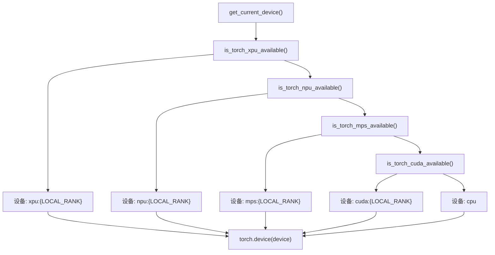
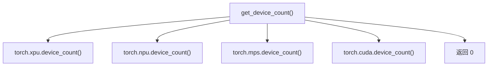
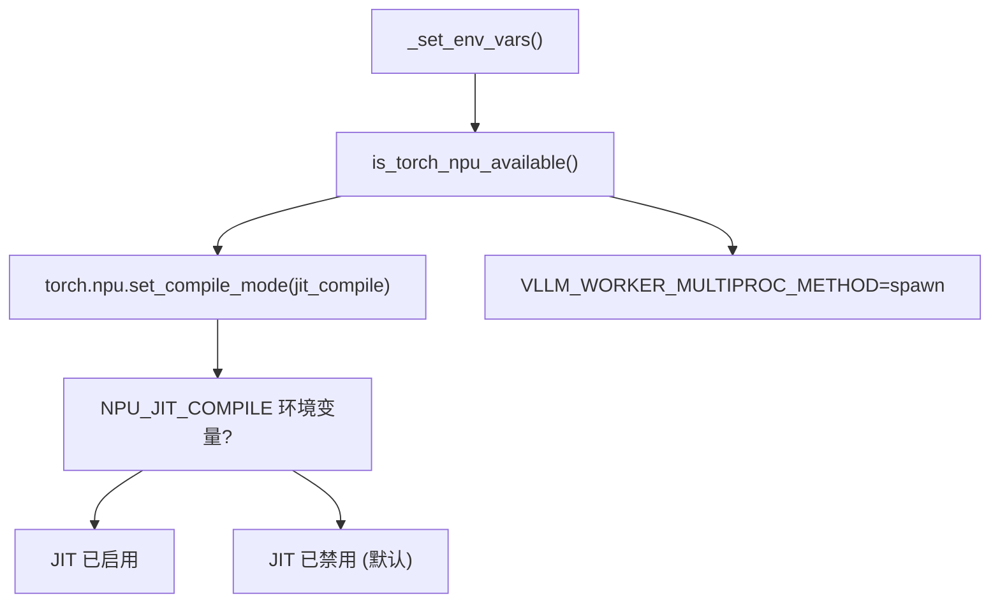
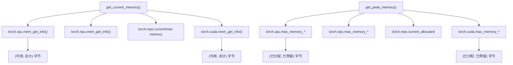
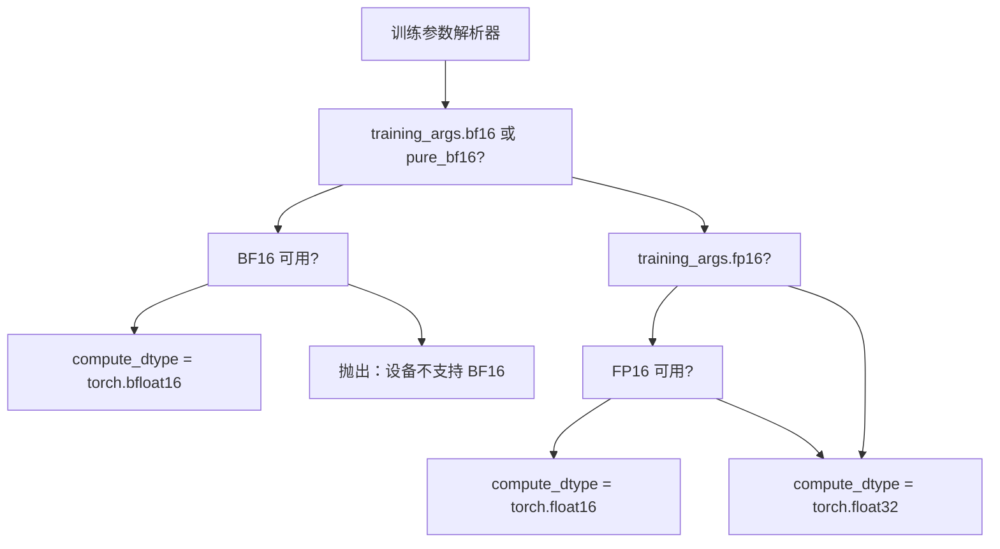
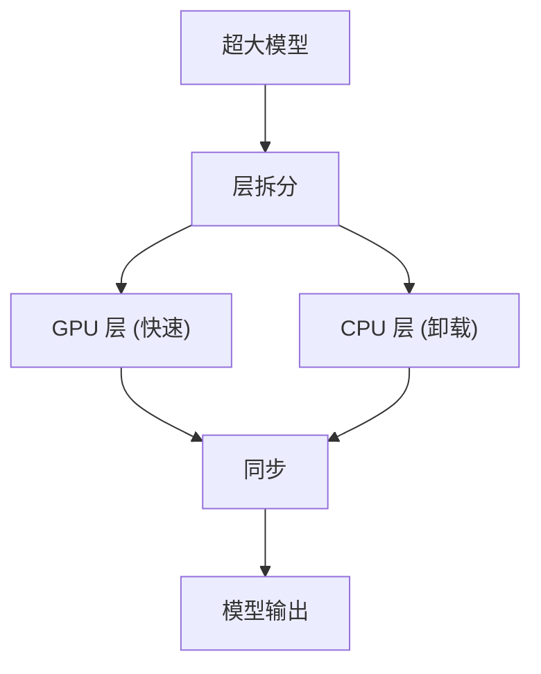
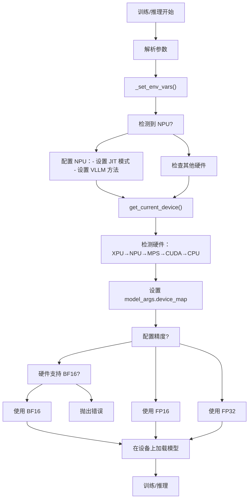

# 硬件支持

相关源文件

-   [README.md](https://github.com/hiyouga/LlamaFactory/blob/355d5c5e/README.md?plain=1)
-   [README\_zh.md](https://github.com/hiyouga/LlamaFactory/blob/355d5c5e/README_zh.md?plain=1)
-   [src/llamafactory/\_\_init\_\_.py](https://github.com/hiyouga/LlamaFactory/blob/355d5c5e/src/llamafactory/__init__.py)
-   [src/llamafactory/extras/misc.py](https://github.com/hiyouga/LlamaFactory/blob/355d5c5e/src/llamafactory/extras/misc.py)
-   [src/llamafactory/hparams/parser.py](https://github.com/hiyouga/LlamaFactory/blob/355d5c5e/src/llamafactory/hparams/parser.py)
-   [src/llamafactory/model/model\_utils/longlora.py](https://github.com/hiyouga/LlamaFactory/blob/355d5c5e/src/llamafactory/model/model_utils/longlora.py)
-   [src/llamafactory/model/model\_utils/packing.py](https://github.com/hiyouga/LlamaFactory/blob/355d5c5e/src/llamafactory/model/model_utils/packing.py)

## 目的与范围

本页面记录了 LlamaFactory 对多种硬件平台的支持情况，包括 NVIDIA GPU (CUDA)、华为 NPU (昇腾)、AMD GPU (ROCm)、Apple Silicon (MPS)、Intel GPU (XPU) 以及 CPU。内容涵盖设备检测、配置、内存管理以及特定平台的优化。

有关跨多设备分布式训练的信息，见 [分布式训练](/hiyouga/LlamaFactory/6.4-distributed-training)。有关硬件加速注意力机制，见 [注意力机制与优化](/hiyouga/LlamaFactory/5.4-attention-mechanisms-and-optimizations)。有关性能优化技术，见 [性能优化](/hiyouga/LlamaFactory/9.3-performance-optimization)。

---

## 受支持硬件平台概述

LlamaFactory 提供了统一的抽象，支持在多个硬件平台上进行训练和推理，且只需极少的配置更改。框架会自动检测可用硬件并配置相应的后端。

### 受支持平台

| 平台 | 设备类型 | 主要用例 | 精度支持 | 状态 |
| --- | --- | --- | --- | --- |
| **CUDA** | NVIDIA GPU | 训练与推理 | FP32, FP16, BF16, INT8, INT4 | 完全支持 |
| **NPU** | 华为昇腾 | 训练与推理 | FP32, FP16, BF16 | 完全支持 |
| **ROCm** | AMD GPU | 训练与推理 | FP32, FP16, BF16 | 完全支持 |
| **MPS** | Apple Silicon | 推理 (有限训练) | FP32, FP16 | 实验性 |
| **XPU** | Intel GPU | 训练与推理 | FP32, FP16, BF16 | 实验性 |
| **CPU** | x86/ARM CPU | 推理 (训练缓慢) | FP32, BF16 (AVX512) | 回退方案 |

**来源：** [README.md208-210](https://github.com/hiyouga/LlamaFactory/blob/355d5c5e/README.md?plain=1#L208-L210) [README.md60](https://github.com/hiyouga/LlamaFactory/blob/355d5c5e/README.md?plain=1#L60-L60) [README.md99](https://github.com/hiyouga/LlamaFactory/blob/355d5c5e/README.md?plain=1#L99-L99) [src/llamafactory/extras/misc.py29-35](https://github.com/hiyouga/LlamaFactory/blob/355d5c5e/src/llamafactory/extras/misc.py#L29-L35)

---

## 硬件检测与设备选择

LlamaFactory 通过平台无关的设备管理函数实现自动硬件检测。系统会查询 PyTorch 的硬件可用性工具并自动选择能力最强的设备。

### 设备检测流程


**设备检测优先级：** XPU → NPU → MPS → CUDA → CPU

[src/llamafactory/extras/misc.py144-157](https://github.com/hiyouga/LlamaFactory/blob/355d5c5e/src/llamafactory/extras/misc.py#L144-L157) 中的 `get_current_device()` 函数实现了此检测逻辑。该函数按优先级顺序检查硬件可用性，并返回一个 `torch.device` 对象，其中的设备索引取自 `LOCAL_RANK` 环境变量 (默认为 0)。

```python
# 简化的设备检测逻辑
def get_current_device() -> torch.device:
    if is_torch_xpu_available():
        device = "xpu:{}".format(os.getenv("LOCAL_RANK", "0"))
    elif is_torch_npu_available():
        device = "npu:{}".format(os.getenv("LOCAL_RANK", "0"))
    elif is_torch_mps_available():
        device = "mps:{}".format(os.getenv("LOCAL_RANK", "0"))
    elif is_torch_cuda_available():
        device = "cuda:{}".format(os.getenv("LOCAL_RANK", "0"))
    else:
        device = "cpu"
    return torch.device(device)
```
### 设备数量与可用性

框架提供了 `get_device_count()` 函数，用于枚举分布式训练中的可用设备：


**来源：** [src/llamafactory/extras/misc.py160-171](https://github.com/hiyouga/LlamaFactory/blob/355d5c5e/src/llamafactory/extras/misc.py#L160-L171)

### 模型设备映射配置

在模型初始化期间，LlamaFactory 会设置 `model_args.device_map` 以将模型绑定到当前设备：

```python
# 在 parser.py 的参数后处理阶段设置
model_args.device_map = {"": get_current_device()}
```
此配置确保模型加载到合适的硬件后端，并防止 PyTorch 尝试自动进行多 GPU 分配 (多 GPU 由 DDP/FSDP 单独处理)。

**来源：** [src/llamafactory/hparams/parser.py457](https://github.com/hiyouga/LlamaFactory/blob/355d5c5e/src/llamafactory/hparams/parser.py#L457-L457)

---

## 硬件特定配置

### CUDA (NVIDIA GPU)

CUDA 是最主要且最成熟的后端，完全支持所有的训练方法和优化。

**支持功能：**

-   所有量化方法 (通过 bitsandbytes/GPTQ/AWQ 支持 INT4, INT8)
-   FlashAttention-2 实现高效注意力计算
-   混合精度训练 (FP16, BF16)
-   所有分布式训练策略 (DDP, FSDP, DeepSpeed)
-   vLLM 和 SGLang 推理引擎

**配置：** 无需特殊配置。系统会自动检测并使用可用的 CUDA。

**来源：** [README.md252](https://github.com/hiyouga/LlamaFactory/blob/355d5c5e/README.md?plain=1#L252-L252) [README.md230](https://github.com/hiyouga/LlamaFactory/blob/355d5c5e/README.md?plain=1#L230-L230)

---

### NPU (华为昇腾)

昇腾 NPU 已获得完全支持，适用于训练和推理，并带有平台特定优化。

#### NPU 特定设置

框架在初始化期间应用 NPU 特定配置：


**JIT 编译：** 默认情况下，NPU 设备禁用 JIT 编译以避免兼容性问题。用户可以通过设置 `NPU_JIT_COMPILE` 环境变量来启用它：

```bash
export NPU_JIT_COMPILE=1
```
**vLLM 工作进程配置：** 框架为 NPU 设备设置 `VLLM_WORKER_MULTIPROC_METHOD=spawn`，以防止昇腾硬件特有的进程 fork 相关问题。

**精度支持：**

-   FP16：通过 `torch.npu` 原生支持
-   BF16：通过 `torch.npu.is_bf16_supported()` 验证后有条件支持

```python
# BF16 可用性检查 (来自 misc.py)
_is_bf16_available = is_torch_bf16_gpu_available() or \
    (is_torch_npu_available() and torch.npu.is_bf16_supported())
```
**来源：** [src/llamafactory/hparams/parser.py110-114](https://github.com/hiyouga/LlamaFactory/blob/355d5c5e/src/llamafactory/hparams/parser.py#L110-L114) [src/llamafactory/extras/misc.py41-45](https://github.com/hiyouga/LlamaFactory/blob/355d5c5e/src/llamafactory/extras/misc.py#L41-L45) [src/llamafactory/hparams/parser.py319](https://github.com/hiyouga/LlamaFactory/blob/355d5c5e/src/llamafactory/hparams/parser.py#L319-L319)

#### NPU 社区与文档

NPU 训练的官方文档可在以下位置获取：

-   昇腾文档：[Ascend NPU Documentation](https://ascend.github.io/docs/sources/llamafactory/)
-   NPU 用户组：可通过微信获取 (见 README)

**来源：** [README\_zh.md62](https://github.com/hiyouga/LlamaFactory/blob/355d5c5e/README_zh.md?plain=1#L62-L62) [README\_zh.md41](https://github.com/hiyouga/LlamaFactory/blob/355d5c5e/README_zh.md?plain=1#L41-L41)

---

### ROCm (AMD GPU)

AMD GPU 通过 ROCm 平台受支持，相关文档由 AMD 提供。

**支持功能：**

-   混合精度训练 (FP16, BF16)
-   基础分布式训练
-   标准 PyTorch 操作

**文档：** 官方 AMD 文档：[ROCm AI Developer Hub - LLaMA Factory Guide](https://rocm.docs.amd.com/projects/ai-developer-hub/en/latest/notebooks/fine_tune/llama_factory_llama3.html)

**限制：**

-   FlashAttention-2 支持取决于 ROCm 版本
-   某些 CUDA 特定优化 (如 Unsloth) 不可用
-   vLLM 支持取决于 ROCm 版本

**来源：** [README.md60](https://github.com/hiyouga/LlamaFactory/blob/355d5c5e/README.md?plain=1#L60-L60)

---

### MPS (Apple Silicon)

Apple 的 Metal Performance Shaders 后端支持 M 系列芯片的 GPU 加速。

**支持功能：**

-   推理 (完全支持)
-   训练 (实验性)
-   FP16 和 FP32 精度

**限制：**

-   不支持原生 BF16
-   分布式训练不可用
-   仅限于单设备操作
-   某些高级优化不可用

**检测：**

```python
if is_torch_mps_available():
    device = "mps:{}".format(os.getenv("LOCAL_RANK", "0"))
```
**来源：** [src/llamafactory/extras/misc.py150-151](https://github.com/hiyouga/LlamaFactory/blob/355d5c5e/src/llamafactory/extras/misc.py#L150-L151)

---

### XPU (Intel GPU)

Intel 的 XPU 后端为 Intel Arc 和数据中心 GPU 提供实验性支持。

**支持功能：**

-   基础训练与推理
-   混合精度 (FP16, BF16)
-   多设备训练

**状态：** 实验性 - 尚未在生产环境中广泛测试

**来源：** [src/llamafactory/extras/misc.py146-147](https://github.com/hiyouga/LlamaFactory/blob/355d5c5e/src/llamafactory/extras/misc.py#L146-L147)

---

## 跨硬件内存管理

LlamaFactory 提供了适用于所有硬件平台的统一内存管理 API。

### 内存信息 API


### get\_current\_memory()

以字节为单位返回当前设备的可用内存和总内存：

```python
def get_current_memory() -> tuple[int, int]:
    """返回：(可用字节数, 总字节数)"""
    if is_torch_xpu_available():
        return torch.xpu.mem_get_info()
    elif is_torch_npu_available():
        return torch.npu.mem_get_info()
    elif is_torch_mps_available():
        return torch.mps.current_allocated_memory(), \
               torch.mps.recommended_max_memory()
    elif is_torch_cuda_available():
        return torch.cuda.mem_get_info()
    else:
        return 0, -1  # CPU：无内存跟踪
```
**来源：** [src/llamafactory/extras/misc.py181-192](https://github.com/hiyouga/LlamaFactory/blob/355d5c5e/src/llamafactory/extras/misc.py#L181-L192)

### get\_peak\_memory()

返回当前设备的峰值内存使用情况 (已分配和已预留)：

```python
def get_peak_memory() -> tuple[int, int]:
    """返回：(峰值分配字节, 峰值预留字节)"""
    if is_torch_xpu_available():
        return torch.xpu.max_memory_allocated(), \
               torch.xpu.max_memory_reserved()
    elif is_torch_npu_available():
        return torch.npu.max_memory_allocated(), \
               torch.npu.max_memory_reserved()
    elif is_torch_mps_available():
        return torch.mps.current_allocated_memory(), -1
    elif is_torch_cuda_available():
        return torch.cuda.max_memory_allocated(), \
               torch.cuda.max_memory_reserved()
    else:
        return 0, -1
```
**用例：** 这些函数用于在训练期间记录内存统计信息并检测显存溢出 (OOM) 情况。

**来源：** [src/llamafactory/extras/misc.py195-206](https://github.com/hiyouga/LlamaFactory/blob/355d5c5e/src/llamafactory/extras/misc.py#L195-L206)

### torch\_gc()

平台无关的垃圾回收，用于释放设备内存：

```python
def torch_gc() -> None:
    """收集垃圾并清除设备内存缓存。"""
    gc.collect()
    if is_torch_xpu_available():
        torch.xpu.empty_cache()
    elif is_torch_npu_available():
        torch.npu.empty_cache()
    elif is_torch_mps_available():
        torch.mps.empty_cache()
    elif is_torch_cuda_available():
        torch.cuda.empty_cache()
```
此函数在模型导出、适配器合并以及其他显存密集型操作后调用，以回收未使用的内存。

**来源：** [src/llamafactory/extras/misc.py254-264](https://github.com/hiyouga/LlamaFactory/blob/355d5c5e/src/llamafactory/extras/misc.py#L254-L264)

---

## 各平台的精度支持

不同的硬件平台对混合精度训练的支持程度各不相同。

### 精度检测与配置


### 精度可用性检查

```python
# 来自 misc.py:41-45
_is_fp16_available = is_torch_npu_available() or is_torch_cuda_available()
try:
    _is_bf16_available = is_torch_bf16_gpu_available() or \
        (is_torch_npu_available() and torch.npu.is_bf16_supported())
except Exception:
    _is_bf16_available = False
```
**FP16 可用性：** NPU 和 CUDA 平台原生支持 FP16 训练。

**BF16 可用性：** 根据以下内容动态检查：

-   CUDA 平台的 `is_torch_bf16_gpu_available()` (需要 Ampere 或更新架构)
-   NPU 平台的 `torch.npu.is_bf16_supported()` (取决于具体型号)

### 训练设置中的精度配置

解析器根据训练参数设置 `model_args.compute_dtype`：

```python
# 来自 parser.py:452-455
if training_args.bf16 or finetuning_args.pure_bf16:
    model_args.compute_dtype = torch.bfloat16
elif training_args.fp16:
    model_args.compute_dtype = torch.float16
```
**纯 BF16 模式：** 当 `pure_bf16=True` 时，框架会验证硬件支持：

```python
# 来自 parser.py:318-320
if finetuning_args.pure_bf16:
    if not (is_torch_bf16_gpu_available() or \
            (is_torch_npu_available() and torch.npu.is_bf16_supported())):
        raise ValueError("此设备不支持 `pure_bf16`。")
```
**来源：** [src/llamafactory/extras/misc.py41-45](https://github.com/hiyouga/LlamaFactory/blob/355d5c5e/src/llamafactory/extras/misc.py#L41-L45) [src/llamafactory/hparams/parser.py318-320](https://github.com/hiyouga/LlamaFactory/blob/355d5c5e/src/llamafactory/hparams/parser.py#L318-L320) [src/llamafactory/hparams/parser.py452-455](https://github.com/hiyouga/LlamaFactory/blob/355d5c5e/src/llamafactory/hparams/parser.py#L452-L455)

---

## 硬件特定优化

### FlashAttention-2 (仅限 CUDA)

FlashAttention-2 在计算能力 ≥ 8.0 (Ampere, Ada, Hopper 架构) 的 NVIDIA GPU 上为注意力计算提供显著的速度提升。

**受支持 GPU：** RTX 4090, A100, H100, L40S

**激活：**

```bash
llamafactory-cli train \
    --flash_attn fa2 \
    ... 其他参数 ...
```
**性能：** FlashAttention-2 降低了显存占用并提高了长序列的吞吐量。

**来源：** [README.md252](https://github.com/hiyouga/LlamaFactory/blob/355d5c5e/README.md?plain=1#L252-L252)

---

### Unsloth (仅限 CUDA)

Unsloth 为 LLaMA、Mistral 和 Yi 模型的 LoRA 训练提供优化内核。

**受支持硬件：** 带 CUDA 的 NVIDIA GPU

**优势：**

-   训练速度提升 170%
-   显存占用比 FlashAttention-2 减少 50%
-   支持长序列训练 (例如在 24GB 显存上训练 LLaMA-2-7B-56k)

**激活：**

```bash
llamafactory-cli train \
    --use_unsloth true \
    ... 其他参数 ...
```
**限制：**

-   仅限 CUDA (与 NPU, ROCm, MPS 不兼容)
-   与 DeepSpeed ZeRO-3 不兼容
-   在 PPO 中与 LoRA 奖励模型不兼容

**来源：** [README.md218](https://github.com/hiyouga/LlamaFactory/blob/355d5c5e/README.md?plain=1#L218-L218) [README.md240](https://github.com/hiyouga/LlamaFactory/blob/355d5c5e/README.md?plain=1#L240-L240) [src/llamafactory/hparams/parser.py282-283](https://github.com/hiyouga/LlamaFactory/blob/355d5c5e/src/llamafactory/hparams/parser.py#L282-L283) [src/llamafactory/hparams/parser.py347-348](https://github.com/hiyouga/LlamaFactory/blob/355d5c5e/src/llamafactory/hparams/parser.py#L347-L348)

---

### Liger Kernel

Liger Kernel 提供常见操作的高效 Triton 实现。

**受支持硬件：** CUDA, ROCm (需支持 Triton)

**激活：**

```bash
llamafactory-cli train \
    --enable_liger_kernel true \
    ... 其他参数 ...
```
**来源：** [README.md192](https://github.com/hiyouga/LlamaFactory/blob/355d5c5e/README.md?plain=1#L192-L192) [README\_zh.md194](https://github.com/hiyouga/LlamaFactory/blob/355d5c5e/README_zh.md?plain=1#L194-L194)

---

### KTransformers (CPU-GPU 混合)

KTransformers 通过 CPU-GPU 混合执行，支持极大规模模型 (1T+ 参数) 的训练和推理。

**架构：**


**用例：** 在 2×4090 GPU + CPU 内存上微调 1000B 模型

**激活：**

```bash
export USE_KT=1
llamafactory-cli train \
    --use_kt true \
    ... 其他参数 ...
```
**限制：**

-   与 DeepSpeed ZeRO-3 不兼容
-   在 PPO 中与 LoRA 奖励模型不兼容
-   仅限单设备训练 (不支持 DDP/FSDP)

**来源：** [README.md99](https://github.com/hiyouga/LlamaFactory/blob/355d5c5e/README.md?plain=1#L99-L99) [README\_zh.md101](https://github.com/hiyouga/LlamaFactory/blob/355d5c5e/README_zh.md?plain=1#L101-L101) [README.md118](https://github.com/hiyouga/LlamaFactory/blob/355d5c5e/README.md?plain=1#L118-L118) [src/llamafactory/hparams/parser.py279-280](https://github.com/hiyouga/LlamaFactory/blob/355d5c5e/src/llamafactory/hparams/parser.py#L279-L280) [src/llamafactory/hparams/parser.py350-351](https://github.com/hiyouga/LlamaFactory/blob/355d5c5e/src/llamafactory/hparams/parser.py#L350-L351)

---

## 环境变量

### 硬件选择与配置

| 变量 | 用途 | 取值 | 默认值 |
| --- | --- | --- | --- |
| `LOCAL_RANK` | 分布式训练中的设备索引 | `0`, `1`, ... | `0` |
| `CUDA_VISIBLE_DEVICES` | 限制可见的 CUDA 设备 | `0`, `0,1` 等 | 所有设备 |
| `NPU_JIT_COMPILE` | 在 NPU 上启用 JIT 编译 | `1`, `0` | `0` (已禁用) |
| `USE_KT` | 启用 KTransformers | `1`, `0` | `0` |
| `FORCE_TORCHRUN` | 强制使用 torchrun 进行分布式启动 | `1`, `0` | `0` |

### 使用示例

**限制训练使用特定 GPU：**

```bash
export CUDA_VISIBLE_DEVICES=0,1
llamafactory-cli train ...
```
**启用 NPU JIT 编译：**

```bash
export NPU_JIT_COMPILE=1
llamafactory-cli train ...
```
**为大模型启用 KTransformers：**

```bash
export USE_KT=1
llamafactory-cli train \
    --use_kt true \
    --model_name_or_path /path/to/large/model \
    ... 其他参数 ...
```
**来源：** [src/llamafactory/extras/misc.py147-155](https://github.com/hiyouga/LlamaFactory/blob/355d5c5e/src/llamafactory/extras/misc.py#L147-L155) [src/llamafactory/hparams/parser.py112](https://github.com/hiyouga/LlamaFactory/blob/355d5c5e/src/llamafactory/hparams/parser.py#L112-L112) [src/llamafactory/extras/misc.py316-317](https://github.com/hiyouga/LlamaFactory/blob/355d5c5e/src/llamafactory/extras/misc.py#L316-L317)

---

## 硬件检测实战

### 完整硬件设置流程


**关键函数：**

-   `_set_env_vars()`：[src/llamafactory/hparams/parser.py109-114](https://github.com/hiyouga/LlamaFactory/blob/355d5c5e/src/llamafactory/hparams/parser.py#L109-L114)
-   `get_current_device()`：[src/llamafactory/extras/misc.py144-157](https://github.com/hiyouga/LlamaFactory/blob/355d5c5e/src/llamafactory/extras/misc.py#L144-L157)
-   设备映射设置：[src/llamafactory/hparams/parser.py457](https://github.com/hiyouga/LlamaFactory/blob/355d5c5e/src/llamafactory/hparams/parser.py#L457-L457)
-   精度配置：[src/llamafactory/hparams/parser.py452-455](https://github.com/hiyouga/LlamaFactory/blob/355d5c5e/src/llamafactory/hparams/parser.py#L452-L455)

**来源：** [src/llamafactory/hparams/parser.py109-114](https://github.com/hiyouga/LlamaFactory/blob/355d5c5e/src/llamafactory/hparams/parser.py#L109-L114) [src/llamafactory/hparams/parser.py244-471](https://github.com/hiyouga/LlamaFactory/blob/355d5c5e/src/llamafactory/hparams/parser.py#L244-L471)

---

## 平台兼容性矩阵

### 各平台的训练功能

| 功能 | CUDA | NPU | ROCm | MPS | XPU | CPU |
| --- | --- | --- | --- | --- | --- | --- |
| **全精度 (FP32)** | ✓ | ✓ | ✓ | ✓ | ✓ | ✓ |
| **FP16 训练** | ✓ | ✓ | ✓ | ✓ | ✓ | ✗ |
| **BF16 训练** | ✓\* | ✓\* | ✓\* | ✗ | ✓ | ✓\* |
| **INT8 量化** | ✓ | ✗ | ✓ | ✗ | ✗ | ✗ |
| **INT4 量化** | ✓ | ✗ | ✓ | ✗ | ✗ | ✗ |
| **LoRA/QLoRA** | ✓ | ✓ | ✓ | ✓ | ✓ | ✓ |
| **全参数微调** | ✓ | ✓ | ✓ | ✓ | ✓ | ✓ |
| **DDP** | ✓ | ✓ | ✓ | ✗ | ✓ | ✓ |
| **FSDP** | ✓ | ✓ | ✓ | ✗ | ✓ | ✗ |
| **DeepSpeed** | ✓ | ✓ | ✓ | ✗ | ✗ | ✗ |
| **FlashAttention-2** | ✓ | ✗ | ✓\* | ✗ | ✗ | ✗ |
| **Unsloth** | ✓ | ✗ | ✗ | ✗ | ✗ | ✗ |
| **vLLM** | ✓ | ✓ | ✓\* | ✗ | ✗ | ✗ |
| **KTransformers** | ✓ | ✗ | ✗ | ✗ | ✗ | ✓ |

\* 取决于硬件或需要特定版本

### 各平台的推理后端

| 后端 | CUDA | NPU | ROCm | MPS | XPU | CPU |
| --- | --- | --- | --- | --- | --- | --- |
| **HuggingFace** | ✓ | ✓ | ✓ | ✓ | ✓ | ✓ |
| **vLLM** | ✓ | ✓ | ✓\* | ✗ | ✗ | ✗ |
| **SGLang** | ✓ | ✗ | ✓\* | ✗ | ✗ | ✗ |
| **KTransformers** | ✓ | ✗ | ✗ | ✗ | ✗ | ✓ |

**来源：** [README.md95-102](https://github.com/hiyouga/LlamaFactory/blob/355d5c5e/README.md?plain=1#L95-L102) [src/llamafactory/hparams/parser.py481-492](https://github.com/hiyouga/LlamaFactory/blob/355d5c5e/src/llamafactory/hparams/parser.py#L481-L492)

---

## 硬件问题排查

### 常见问题与解决方案

**问题："此设备不支持 `pure_bf16`"**

-   **原因：** 请求进行 BF16 训练，但硬件不支持
-   **解决方案：** 检查 GPU 架构 (CUDA：需 Ampere+，NPU：取决于型号)
-   **权宜之计：** 改用 FP16：`--fp16 true --bf16 false`

**问题：NPU 训练失败并出现编译错误**

-   **原因：** NPU 上的 JIT 编译问题
-   **解决方案：** 禁用 JIT：确保未设置 `NPU_JIT_COMPILE` (默认值)
-   **备选方案：** 尝试启用 JIT：`export NPU_JIT_COMPILE=1`

**问题：显存溢出 (OOM) 错误**

-   **方案 1：** 减小批次大小：`--per_device_train_batch_size 1`
-   **方案 2：** 启用梯度检查点：`--gradient_checkpointing true`
-   **方案 3：** 使用 QLoRA：`--quantization_bit 4`
-   **方案 4：** 检查显存：调用 `get_current_memory()` 验证可用显存

**问题：FlashAttention-2 无法工作**

-   **原因：** GPU 架构不兼容
-   **解决方案：** 验证 GPU 计算能力 ≥ 8.0 (Ampere 或更新架构)
-   **权宜之计：** 使用 SDPA 注意力：`--flash_attn sdpa`

**问题：分布式训练无法启动**

-   **原因：** 未使用正确的启动方法
-   **解决方案：** 使用 `llamafactory-cli` 或 `torchrun`：

    ```bash
    FORCE_TORCHRUN=1 llamafactory-cli train ...
    # 或
    torchrun --nproc_per_node 4 src/train.py ...
    ```

**来源：** [src/llamafactory/hparams/parser.py318-323](https://github.com/hiyouga/LlamaFactory/blob/355d5c5e/src/llamafactory/hparams/parser.py#L318-L323) [src/llamafactory/hparams/parser.py288-292](https://github.com/hiyouga/LlamaFactory/blob/355d5c5e/src/llamafactory/hparams/parser.py#L288-L292)

---

## 各平台的最佳实践

### CUDA (NVIDIA GPU)

**推荐配置：**

```bash
llamafactory-cli train \
    --model_name_or_path meta-llama/Llama-2-7b-hf \
    --flash_attn fa2 \
    --bf16 true \
    --use_unsloth true \
    --quantization_bit 4 \
    ... 其他参数 ...
```
**生产环境：**

-   在 Ampere+ GPU (A100, RTX 4090, H100) 上使用 BF16
-   为长序列启用 FlashAttention-2
-   考虑为 LoRA 训练使用 Unsloth
-   使用 vLLM 进行部署

---

### NPU (华为昇腾)

**推荐配置：**

```bash
export NPU_JIT_COMPILE=0  # 默认禁用 JIT
llamafactory-cli train \
    --model_name_or_path Qwen/Qwen-7B \
    --bf16 true \
    ... 其他参数 ...
```
**生产环境：**

-   测试 JIT 编译 (可能会提高或降低性能)
-   如果您的 NPU 型号支持，请使用 BF16
-   避免使用 vLLM/SGLang (使用 HuggingFace 后端)
-   使用 `torch.npu.mem_get_info()` 监控 NPU 显存

---

### ROCm (AMD GPU)

**推荐配置：**

```bash
llamafactory-cli train \
    --model_name_or_path meta-llama/Llama-2-7b-hf \
    --bf16 true \
    --flash_attn sdpa \
    ... 其他参数 ...
```
**生产环境：**

-   使用 SDPA 注意力 (FlashAttention-2 支持情况各异)
-   BF16 通常在 MI200+ 系列上受支持
-   测试 vLLM 与您的 ROCm 版本的兼容性
-   遵循 AMD 官方文档

---

### CPU (回退方案)

**推荐配置：**

```bash
export USE_KT=1
llamafactory-cli train \
    --use_kt true \
    --model_name_or_path large_model \
    --per_device_train_batch_size 1 \
    --gradient_accumulation_steps 16 \
    ... 其他参数 ...
```
**生产环境：**

-   仅 CPU 训练非常缓慢；仅用于测试
-   KTransformers 为超大模型提供 CPU+GPU 混合支持
-   考虑使用量化以减少内存占用
-   对于小模型，推理是切合实际的

**来源：** [README.md118](https://github.com/hiyouga/LlamaFactory/blob/355d5c5e/README.md?plain=1#L118-L118) [README\_zh.md120](https://github.com/hiyouga/LlamaFactory/blob/355d5c5e/README_zh.md?plain=1#L120-L120)
