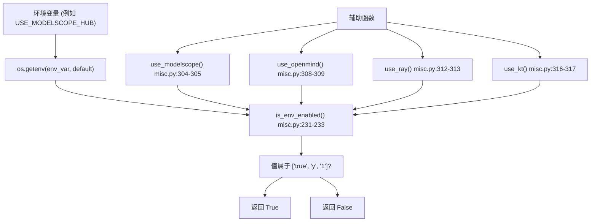
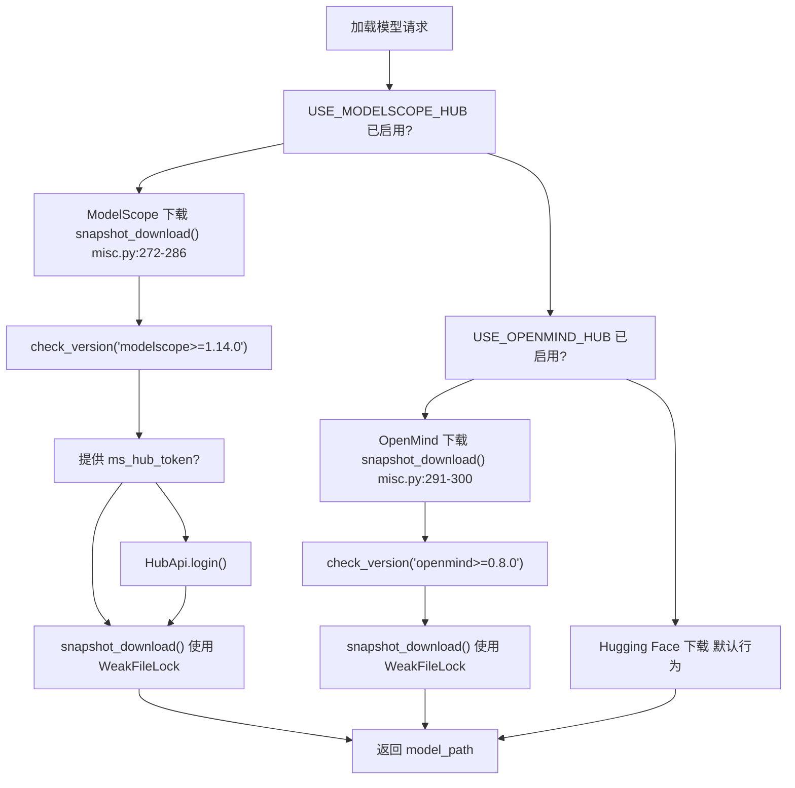
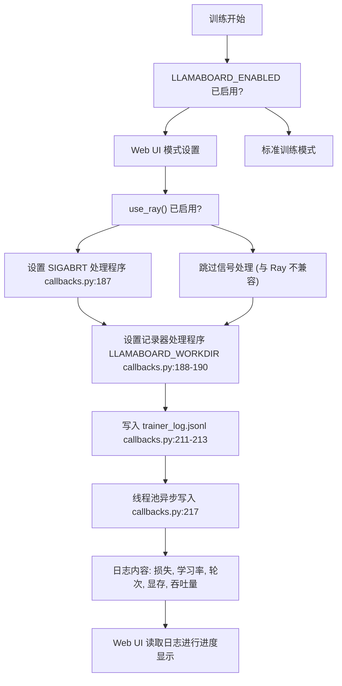
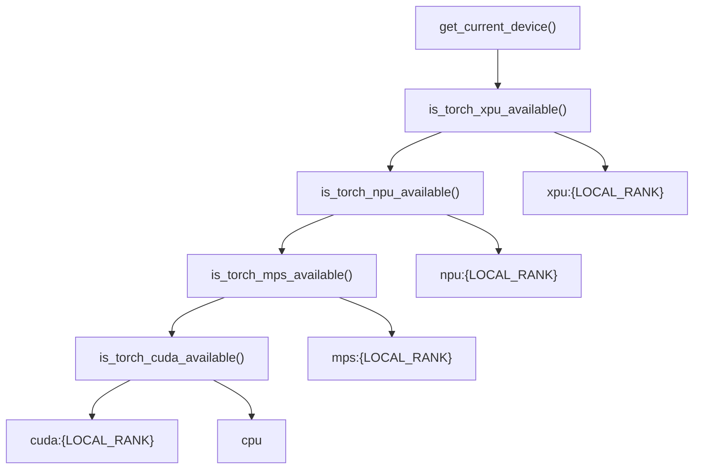
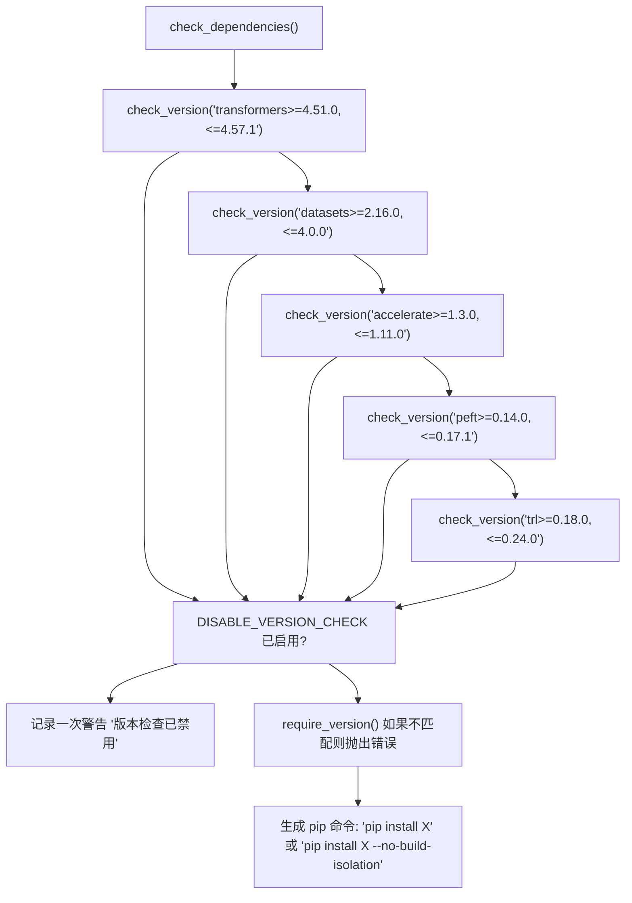
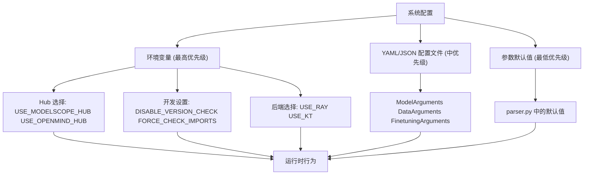
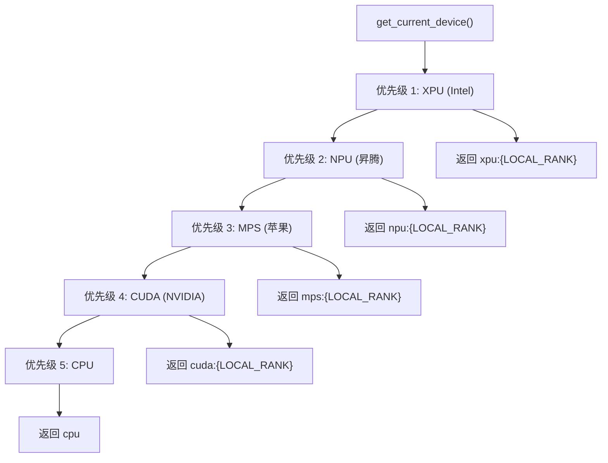

# 环境变量与配置

相关源文件

-   [src/llamafactory/\_\_init\_\_.py](https://github.com/hiyouga/LlamaFactory/blob/355d5c5e/src/llamafactory/__init__.py)
-   [src/llamafactory/extras/env.py](https://github.com/hiyouga/LlamaFactory/blob/355d5c5e/src/llamafactory/extras/env.py)
-   [src/llamafactory/extras/misc.py](https://github.com/hiyouga/LlamaFactory/blob/355d5c5e/src/llamafactory/extras/misc.py)
-   [src/llamafactory/extras/packages.py](https://github.com/hiyouga/LlamaFactory/blob/355d5c5e/src/llamafactory/extras/packages.py)
-   [src/llamafactory/model/model\_utils/attention.py](https://github.com/hiyouga/LlamaFactory/blob/355d5c5e/src/llamafactory/model/model_utils/attention.py)
-   [src/llamafactory/model/model\_utils/liger\_kernel.py](https://github.com/hiyouga/LlamaFactory/blob/355d5c5e/src/llamafactory/model/model_utils/liger_kernel.py)
-   [src/llamafactory/model/model\_utils/longlora.py](https://github.com/hiyouga/LlamaFactory/blob/355d5c5e/src/llamafactory/model/model_utils/longlora.py)
-   [src/llamafactory/model/model\_utils/moe.py](https://github.com/hiyouga/LlamaFactory/blob/355d5c5e/src/llamafactory/model/model_utils/moe.py)
-   [src/llamafactory/model/model\_utils/packing.py](https://github.com/hiyouga/LlamaFactory/blob/355d5c5e/src/llamafactory/model/model_utils/packing.py)
-   [src/llamafactory/model/model\_utils/valuehead.py](https://github.com/hiyouga/LlamaFactory/blob/355d5c5e/src/llamafactory/model/model_utils/valuehead.py)
-   [src/llamafactory/train/callbacks.py](https://github.com/hiyouga/LlamaFactory/blob/355d5c5e/src/llamafactory/train/callbacks.py)

本文档提供了 LlamaFactory 中使用的环境变量的全面参考，并解释了它们如何控制系统行为。这些变量支持在不修改代码或配置文件的情况下进行运行时配置，从而实现在不同环境和用例下的灵活部署。

有关基于参数的配置 (ModelArguments, DataArguments 等)，见 [配置系统](/hiyouga/LlamaFactory/3-configuration-system)。有关环境变量之外的硬件特定设置，见 [硬件支持](/hiyouga/LlamaFactory/9.1-hardware-support)。

---

## 环境变量系统概述

LlamaFactory 使用环境变量来控制可选功能、Hub 选择、日志行为、硬件加速以及开发设置。这些变量在运行时通过 `is_env_enabled()` 函数和专用辅助函数进行检查。

### 环境变量检查机制


**来源：** [src/llamafactory/extras/misc.py231-233](https://github.com/hiyouga/LlamaFactory/blob/355d5c5e/src/llamafactory/extras/misc.py#L231-L233) [src/llamafactory/extras/misc.py304-317](https://github.com/hiyouga/LlamaFactory/blob/355d5c5e/src/llamafactory/extras/misc.py#L304-L317)

---

## 核心环境变量

### 系统全局变量

| 变量 | 默认值 | 用途 | 代码参考 |
| --- | --- | --- | --- |
| `DISABLE_VERSION_CHECK` | `0` | 跳过依赖项版本验证 | [misc.py78-80](https://github.com/hiyouga/LlamaFactory/blob/355d5c5e/misc.py#L78-L80) |
| `LLAMAFACTORY_VERBOSITY` | `INFO` | 设置日志详细级别 | [\_\_init\_\_.py23](https://github.com/hiyouga/LlamaFactory/blob/355d5c5e/__init__.py#L23-L23) |
| `FORCE_TORCHRUN` | `0` | 强制使用 torchrun 执行 | [\_\_init\_\_.py22](https://github.com/hiyouga/LlamaFactory/blob/355d5c5e/__init__.py#L22-L22) |
| `FORCE_CHECK_IMPORTS` | `0` | 强制在自定义模型中检查导入 | [misc.py250-251](https://github.com/hiyouga/LlamaFactory/blob/355d5c5e/misc.py#L250-L251) |

`DISABLE_VERSION_CHECK` 变量在容器化环境中特别有用，因为版本不匹配通常是已知且可接受的。启用后，系统会记录警告但继续执行：

```python
# 来自 misc.py:78-80
if is_env_enabled("DISABLE_VERSION_CHECK") and not mandatory:
    logger.warning_rank0_once("版本检查已禁用，可能会导致非预期行为。")
    return
```
**来源：** [src/llamafactory/extras/misc.py76-92](https://github.com/hiyouga/LlamaFactory/blob/355d5c5e/src/llamafactory/extras/misc.py#L76-L92) [src/llamafactory/\_\_init\_\_.py20-26](https://github.com/hiyouga/LlamaFactory/blob/355d5c5e/src/llamafactory/__init__.py#L20-L26)

---

## Hub 选择变量

LlamaFactory 支持三个模型 Hub：Hugging Face (默认)、ModelScope (魔搭) 和 OpenMind。这些变量控制从哪个 Hub 下载模型和数据集。

### Hub 配置

| 变量 | 默认值 | 用途 | 检查函数 |
| --- | --- | --- | --- |
| `USE_MODELSCOPE_HUB` | `0` | 使用 ModelScope Hub | `use_modelscope()` |
| `USE_OPENMIND_HUB` | `0` | 使用 OpenMind Hub | `use_openmind()` |

### Hub 选择流程


**实现细节：**

当 `USE_MODELSCOPE_HUB=1` 时，系统会：

1.  检查 `modelscope>=1.14.0` 是否已安装。
2.  使用 `WeakFileLock` 防止并发下载：`~/.cache/llamafactory/modelscope.lock`。
3.  将 `main` 分支转换为 `master` 以兼容 ModelScope。
4.  支持通过 ModelArguments 中的 `ms_hub_token` 进行身份验证。

当 `USE_OPENMIND_HUB=1` 时，系统会：

1.  检查 `openmind>=0.8.0` 是否已安装。
2.  使用 `WeakFileLock`：`~/.cache/llamafactory/openmind.lock`。
3.  不需要分支转换。

**来源：** [src/llamafactory/extras/misc.py267-302](https://github.com/hiyouga/LlamaFactory/blob/355d5c5e/src/llamafactory/extras/misc.py#L267-L302) [src/llamafactory/extras/misc.py304-309](https://github.com/hiyouga/LlamaFactory/blob/355d5c5e/src/llamafactory/extras/misc.py#L304-L309)

---

## 训练与推理变量

### 后端选择

| 变量 | 默认值 | 用途 | 影响范围 |
| --- | --- | --- | --- |
| `USE_RAY` | `0` | 启用 Ray 分布式训练 | 训练启动器 |
| `USE_KT` | `0` | 启用 KTransformers 推理后端 | 推理引擎选择 |

`USE_RAY` 变量通过 Ray 启用分布式训练，提供比标准 DDP/FSDP 更灵活的资源分配。`USE_KT` 变量启用 KTransformers 后端进行 CPU-GPU 混合推理。

**来源：** [src/llamafactory/extras/misc.py312-317](https://github.com/hiyouga/LlamaFactory/blob/355d5c5e/src/llamafactory/extras/misc.py#L312-L317)

### 性能监控

| 变量 | 默认值 | 用途 | 代码位置 |
| --- | --- | --- | --- |
| `RECORD_VRAM` | `0` | 在训练日志中记录显存使用情况 | [callbacks.py291-294](https://github.com/hiyouga/LlamaFactory/blob/355d5c5e/callbacks.py#L291-L294) |

当 `RECORD_VRAM=1` 时，训练回调会记录显存峰值统计：

```python
# 来自 callbacks.py:291-294
if is_env_enabled("RECORD_VRAM"):
    vram_allocated, vram_reserved = get_peak_memory()
    logs["vram_allocated"] = round(vram_allocated / (1024**3), 2)
    logs["vram_reserved"] = round(vram_reserved / (1024**3), 2)
```
这使用了支持 CUDA, NPU, MPS 和 XPU 设备的 `get_peak_memory()` 函数。

**来源：** [src/llamafactory/train/callbacks.py291-294](https://github.com/hiyouga/LlamaFactory/blob/355d5c5e/src/llamafactory/train/callbacks.py#L291-L294) [src/llamafactory/extras/misc.py195-206](https://github.com/hiyouga/LlamaFactory/blob/355d5c5e/src/llamafactory/extras/misc.py#L195-L206)

---

## Web UI 与监控变量

### LLaMA Board 配置

| 变量 | 默认值 | 用途 | 用法 |
| --- | --- | --- | --- |
| `LLAMABOARD_ENABLED` | `0` | 启用 Web UI 模式 | 控制回调行为 |
| `LLAMABOARD_WORKDIR` | \- | UI 日志工作目录 | 日志文件位置 |
| `WANDB_PROJECT` | `llamafactory` | WandB 项目名称 | 外部监控 |

### Web UI 集成流程


Web UI 模式启用了特殊的日志记录行为：

-   用于中止功能的信号处理程序 (除非使用 Ray)。
-   自定义记录器处理程序，写入 `LLAMABOARD_WORKDIR`。
-   使用线程池异步将日志写入 `trainer_log.jsonl`。
-   简化控制台输出，包含关键指标。

**来源：** [src/llamafactory/train/callbacks.py185-190](https://github.com/hiyouga/LlamaFactory/blob/355d5c5e/src/llamafactory/train/callbacks.py#L185-L190) [src/llamafactory/train/callbacks.py211-306](https://github.com/hiyouga/LlamaFactory/blob/355d5c5e/src/llamafactory/train/callbacks.py#L211-L306)

### WandB 集成

`WANDB_PROJECT` 变量设置 Weights & Biases 集成的默认项目名称：

```python
# 来自 callbacks.py:353
os.environ["WANDB_PROJECT"] = os.getenv("WANDB_PROJECT", "llamafactory")
```
当 TrainingArguments 中的 `report_to` 包含 `"wandb"` 时生效。

**来源：** [src/llamafactory/train/callbacks.py353-370](https://github.com/hiyouga/LlamaFactory/blob/355d5c5e/src/llamafactory/train/callbacks.py#L353-L370)

---

## 硬件与设备变量

### 设备选择

| 变量 | 默认值 | 用途 | 设备类型 |
| --- | --- | --- | --- |
| `LOCAL_RANK` | `0` | 分布式训练中的设备序号 | 所有加速器 |

`LOCAL_RANK` 变量是分布式训练的标准变量，决定使用哪个 GPU/NPU/XPU：


**来源：** [src/llamafactory/extras/misc.py144-157](https://github.com/hiyouga/LlamaFactory/blob/355d5c5e/src/llamafactory/extras/misc.py#L144-L157)

### 网络配置

| 变量 | 用途 | 默认行为 |
| --- | --- | --- |
| `no_proxy` | 从代理中排除本地主机 | 设置为 `localhost,127.0.0.1,0.0.0.0` |
| `http_proxy`, `HTTP_PROXY` | HTTP 代理设置 | 启用 IPv6 时清除 |
| `https_proxy`, `HTTPS_PROXY` | HTTPS 代理设置 | 启用 IPv6 时清除 |
| `all_proxy`, `ALL_PROXY` | 全协议代理 | 启用 IPv6 时清除 |

`fix_proxy()` 函数处理 Gradio UI 的代理配置：

```python
# 来自 misc.py:329-338
def fix_proxy(ipv6_enabled: bool = False) -> None:
    os.environ["no_proxy"] = "localhost,127.0.0.1,0.0.0.0"
    if ipv6_enabled:
        os.environ.pop("http_proxy", None)
        os.environ.pop("HTTP_PROXY", None)
        # ... 移除所有代理设置
```
**来源：** [src/llamafactory/extras/misc.py329-338](https://github.com/hiyouga/LlamaFactory/blob/355d5c5e/src/llamafactory/extras/misc.py#L329-L338)

---

## 开发与调试变量

### 版本控制与验证


**版本检查行为：**

-   非强制性检查：可以使用 `DISABLE_VERSION_CHECK=1` 跳过。
-   强制性检查：无法跳过 (例如针对 ModelScope/OpenMind 的依赖项检查)。
-   特殊处理：`gptmodel` 和 `autoawq` 使用 `--no-build-isolation` 标志。

**来源：** [src/llamafactory/extras/misc.py76-102](https://github.com/hiyouga/LlamaFactory/blob/355d5c5e/src/llamafactory/extras/misc.py#L76-L102)

### 导入验证

| 变量 | 默认值 | 用途 | 影响 |
| --- | --- | --- | --- |
| `FORCE_CHECK_IMPORTS` | `0` | 在自定义模型中强制进行导入检查 | Flash Attention 导入 |

`skip_check_imports()` 函数修改了 Transformers 的动态模块行为：

```python
# 来自 misc.py:248-251
def skip_check_imports() -> None:
    if not is_env_enabled("FORCE_CHECK_IMPORTS"):
        transformers.dynamic_module_utils.check_imports = get_relative_imports
```
这避免了自定义模型文件引用 Flash Attention 但未安装时抛出错误。

**来源：** [src/llamafactory/extras/misc.py248-251](https://github.com/hiyouga/LlamaFactory/blob/355d5c5e/src/llamafactory/extras/misc.py#L248-L251)

---

## 环境变量使用模式

### 配置优先级


**关键原则：**

1.  环境变量无法被配置文件覆盖。
2.  用于部署相关设置 (Hubs、后端、调试)。
3.  在运行时检查，允许无需代码更改即可实现动态行为。
4.  布尔变量使用字符串值：`"true"`, `"y"`, `"1"` (不区分大小写)。

**来源：** [src/llamafactory/extras/misc.py231-233](https://github.com/hiyouga/LlamaFactory/blob/355d5c5e/src/llamafactory/extras/misc.py#L231-L233)

### 常见使用场景

| 场景 | 变量 | 用途 |
| --- | --- | --- |
| 国内部署 | `USE_MODELSCOPE_HUB=1` | 使用国内模型源 |
| 生产推理 | `USE_KT=1` | 启用 CPU-GPU 混合推理 |
| 训练调试 | `RECORD_VRAM=1`<br>`LLAMAFACTORY_VERBOSITY=DEBUG` | 监控显存使用 |
| Web UI 开发 | `LLAMABOARD_ENABLED=1`<br>`LLAMABOARD_WORKDIR=/tmp` | 测试 UI 集成 |
| 容器部署 | `DISABLE_VERSION_CHECK=1` | 跳过版本验证 |
| 分布式训练 | `LOCAL_RANK=0-N` | 由 torchrun 自动设置 |

---

## 环境变量完整参考表

| 变量 | 类型 | 默认值 | 有效值 | 主要用例 |
| --- | --- | --- | --- | --- |
| `DISABLE_VERSION_CHECK` | 布尔值 | `0` | `0`, `1`, `true`, `y` | 跳过依赖验证 |
| `RECORD_VRAM` | 布尔值 | `0` | `0`, `1`, `true`, `y` | 记录显存使用 |
| `FORCE_TORCHRUN` | 布尔值 | `0` | `0`, `1`, `true`, `y` | 强制使用分布式启动器 |
| `LLAMAFACTORY_VERBOSITY` | 字符串 | `INFO` | `DEBUG`, `INFO`, `WARN`, `ERROR` | 设置日志级别 |
| `USE_MODELSCOPE_HUB` | 布尔值 | `0` | `0`, `1`, `true`, `y` | 访问 ModelScope Hub |
| `USE_OPENMIND_HUB` | 布尔值 | `0` | `0`, `1`, `true`, `y` | 访问 OpenMind Hub |
| `USE_RAY` | 布尔值 | `0` | `0`, `1`, `true`, `y` | Ray 分布式训练 |
| `USE_KT` | 布尔值 | `0` | `0`, `1`, `true`, `y` | KTransformers 后端 |
| `FORCE_CHECK_IMPORTS` | 布尔值 | `0` | `0`, `1`, `true`, `y` | 验证自定义导入 |
| `LLAMABOARD_ENABLED` | 布尔值 | `0` | `0`, `1`, `true`, `y` | 启用 Web UI 模式 |
| `LLAMABOARD_WORKDIR` | 路径 | \- | 任何有效路径 | Web UI 日志目录 |
| `WANDB_PROJECT` | 字符串 | `llamafactory` | 任何字符串 | WandB 项目名称 |
| `LOCAL_RANK` | 整数 | `0` | `0-N` | 设备序号 (启动器设置) |
| `no_proxy` | 字符串 | \- | 逗号分隔主机 | 代理绕过列表 |
| `http_proxy` | 字符串 | \- | URL | HTTP 代理地址 |
| `https_proxy` | 字符串 | \- | URL | HTTPS 代理地址 |

**来源：** [src/llamafactory/extras/misc.py](https://github.com/hiyouga/LlamaFactory/blob/355d5c5e/src/llamafactory/extras/misc.py) [src/llamafactory/train/callbacks.py](https://github.com/hiyouga/LlamaFactory/blob/355d5c5e/src/llamafactory/train/callbacks.py) [src/llamafactory/\_\_init\_\_.py](https://github.com/hiyouga/LlamaFactory/blob/355d5c5e/src/llamafactory/__init__.py)

---

## 设置环境变量

### 终端 (Linux/macOS)

```bash
# 单条命令
DISABLE_VERSION_CHECK=1 llamafactory-cli train config.yaml

# 会话全局
export USE_MODELSCOPE_HUB=1
export RECORD_VRAM=1
llamafactory-cli train config.yaml

# 多个变量
LLAMABOARD_ENABLED=1 LLAMABOARD_WORKDIR=/tmp llamafactory-cli webui
```
### Docker

```dockerfile
ENV USE_MODELSCOPE_HUB=1
ENV DISABLE_VERSION_CHECK=1
ENV RECORD_VRAM=1
```
### Python 脚本

```python
import os

os.environ["USE_MODELSCOPE_HUB"] = "1"
os.environ["RECORD_VRAM"] = "1"

from llamafactory.train import run_exp
run_exp()
```
### 分布式训练

```bash
# torchrun 会自动设置 LOCAL_RANK
torchrun --nproc_per_node 4 \
    -m llamafactory.cli train config.yaml
```
`LOCAL_RANK` 变量由 PyTorch 的分布式启动器自动设置，不应手动配置。

---

## 实现细节

### is\_env\_enabled() 函数

检查布尔环境变量的核心函数：

```python
# 来自 misc.py:231-233
def is_env_enabled(env_var: str, default: str = "0") -> bool:
    return os.getenv(env_var, default).lower() in ["true", "y", "1"]
```
**行为：**

-   不区分大小写匹配。
-   默认值为 `"0"` (禁用)。
-   接受：`"true"`, `"TRUE"`, `"y"`, `"Y"`, `"1"`。
-   所有其他值均视为 false。

**来源：** [src/llamafactory/extras/misc.py231-233](https://github.com/hiyouga/LlamaFactory/blob/355d5c5e/src/llamafactory/extras/misc.py#L231-L233)

### 设备检测优先级


设备选择使用固定的优先级顺序，按序检查硬件可用性。读取 `LOCAL_RANK` 环境变量以确定使用的设备索引。

**来源：** [src/llamafactory/extras/misc.py144-157](https://github.com/hiyouga/LlamaFactory/blob/355d5c5e/src/llamafactory/extras/misc.py#L144-L157) [src/llamafactory/extras/misc.py160-171](https://github.com/hiyouga/LlamaFactory/blob/355d5c5e/src/llamafactory/extras/misc.py#L160-L171)
