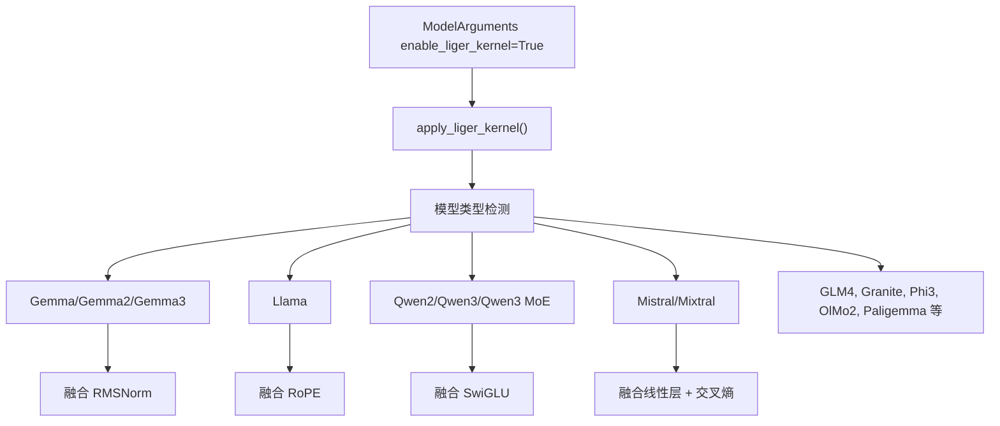
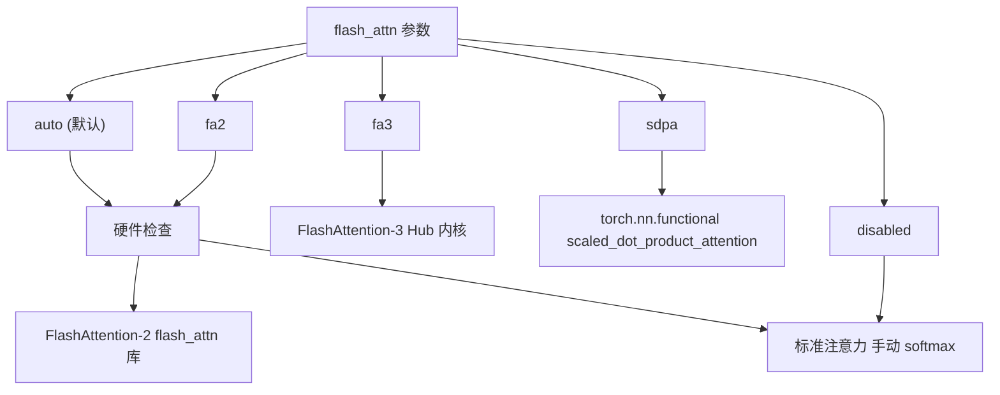
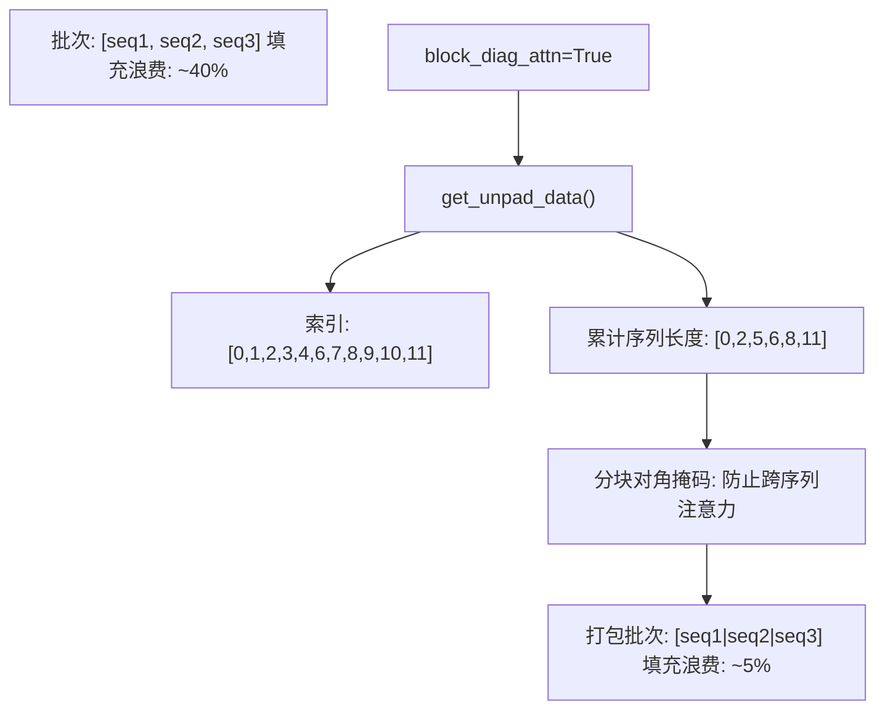
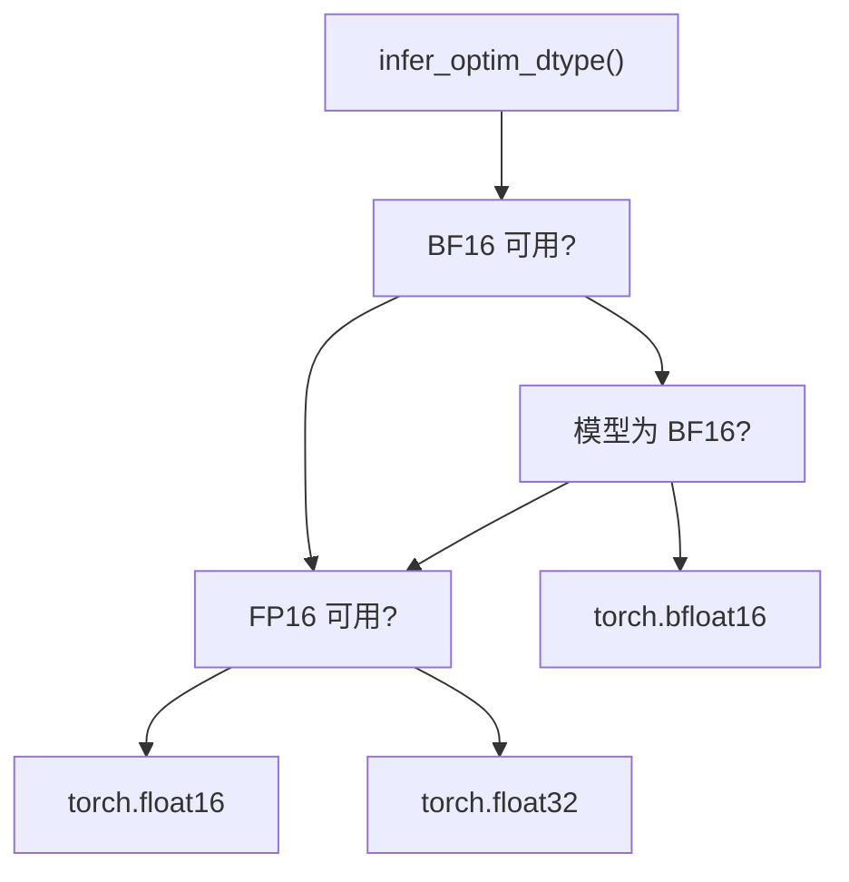
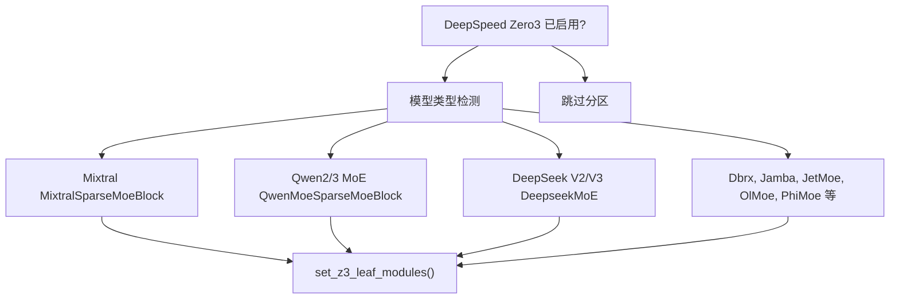

# 性能优化

相关源文件

-   [src/llamafactory/\_\_init\_\_.py](https://github.com/hiyouga/LlamaFactory/blob/355d5c5e/src/llamafactory/__init__.py)
-   [src/llamafactory/extras/env.py](https://github.com/hiyouga/LlamaFactory/blob/355d5c5e/src/llamafactory/extras/env.py)
-   [src/llamafactory/extras/misc.py](https://github.com/hiyouga/LlamaFactory/blob/355d5c5e/src/llamafactory/extras/misc.py)
-   [src/llamafactory/extras/packages.py](https://github.com/hiyouga/LlamaFactory/blob/355d5c5e/src/llamafactory/extras/packages.py)
-   [src/llamafactory/model/model\_utils/attention.py](https://github.com/hiyouga/LlamaFactory/blob/355d5c5e/src/llamafactory/model/model_utils/attention.py)
-   [src/llamafactory/model/model\_utils/liger\_kernel.py](https://github.com/hiyouga/LlamaFactory/blob/355d5c5e/src/llamafactory/model/model_utils/liger_kernel.py)
-   [src/llamafactory/model/model\_utils/longlora.py](https://github.com/hiyouga/LlamaFactory/blob/355d5c5e/src/llamafactory/model/model_utils/longlora.py)
-   [src/llamafactory/model/model\_utils/moe.py](https://github.com/hiyouga/LlamaFactory/blob/355d5c5e/src/llamafactory/model/model_utils/moe.py)
-   [src/llamafactory/model/model\_utils/packing.py](https://github.com/hiyouga/LlamaFactory/blob/355d5c5e/src/llamafactory/model/model_utils/packing.py)
-   [src/llamafactory/model/model\_utils/valuehead.py](https://github.com/hiyouga/LlamaFactory/blob/355d5c5e/src/llamafactory/model/model_utils/valuehead.py)
-   [src/llamafactory/train/callbacks.py](https://github.com/hiyouga/LlamaFactory/blob/355d5c5e/src/llamafactory/train/callbacks.py)

本文档涵盖了 LlamaFactory 中用于加速训练和减少显存占用的性能优化技术。这些技术包括内核优化、注意力机制、精度控制、显存高效训练策略以及硬件特定优化。

有关硬件特定配置 (CUDA, NPU, ROCm)，见 [硬件支持](/hiyouga/LlamaFactory/9.1-hardware-support)。有关分布式训练策略 (DDP, FSDP, DeepSpeed)，见 [分布式训练](/hiyouga/LlamaFactory/6.4-distributed-training)。有关 MoE 特定配置，见 [混合专家模型](/hiyouga/LlamaFactory/9.4-mixture-of-experts-(moe)-models)。

---

## 概述

LlamaFactory 提供了多个层面的性能优化：

| 优化层 | 主要收益 | 配置 |
| --- | --- | --- |
| **内核优化** | 提升计算速度，减少显存 | Liger 内核, 自定义 CUDA 内核 |
| **注意力机制** | 长序列加速 2-5 倍 | FlashAttention-2/3, SDPA |
| **精度控制** | 减少显存占用，加速训练 | FP16, BF16, FP8 |
| **显存技术** | 降低显存占用 | 梯度检查点, 序列打包 |
| **专用策略** | 特定场景收益 | LongLoRA, MoE 叶子模块 |

性能优化通过 `ModelArguments` 和 `TrainingArguments` 配置，大多数功能会自动检测硬件能力。

**来源：** [src/llamafactory/model/model\_utils/liger\_kernel.py1-98](https://github.com/hiyouga/LlamaFactory/blob/355d5c5e/src/llamafactory/model/model_utils/liger_kernel.py#L1-L98) [src/llamafactory/model/model\_utils/attention.py1-104](https://github.com/hiyouga/LlamaFactory/blob/355d5c5e/src/llamafactory/model/model_utils/attention.py#L1-L104)

---

## 内核优化

### Liger 内核

Liger 内核是一系列融合 CUDA 内核的集合，通过将多个操作合并为单个 GPU 内核来优化 Transformer 运算。这降低了内存带宽需求并加速了训练。


**Liger 内核应用流程**

#### 启用 Liger 内核

在模型参数中设置 `enable_liger_kernel: true`：

```yaml
# config.yaml
model_name_or_path: meta-llama/Llama-3-8B
enable_liger_kernel: true
```
`apply_liger_kernel()` 函数 [src/llamafactory/model/model\_utils/liger\_kernel.py30-98](https://github.com/hiyouga/LlamaFactory/blob/355d5c5e/src/llamafactory/model/model_utils/liger_kernel.py#L30-L98) 会自动检测模型类型并应用适当的优化。支持的模型包括：

-   Gemma 系列: `gemma`, `gemma2`, `gemma3`, `gemma3_text`
-   Llama 系列: `llama`, `llava`, `mllama`
-   Qwen 系列: `qwen2`, `qwen2_vl`, `qwen2_5_vl`, `qwen3`, `qwen3_moe`
-   Mistral 系列: `mistral`, `mixtral`
-   其他模型: GLM4/GLM4v, Granite, Phi3, OlMo2, Paligemma

#### 融合交叉熵处理

对于需要 logits 的训练阶段 (例如奖励建模, PPO)，Liger 会自动禁用融合线性交叉熵：

```python
if require_logits and "fused_linear_cross_entropy" in inspect.signature(apply_liger_kernel).parameters:
    kwargs = {"fused_linear_cross_entropy": False, "cross_entropy": True}
```
[src/llamafactory/model/model\_utils/liger\_kernel.py90-94](https://github.com/hiyouga/LlamaFactory/blob/355d5c5e/src/llamafactory/model/model_utils/liger_kernel.py#L90-L94)

这确保了所有训练阶段的兼容性，同时在可能的情况下最大化优化效果。

**来源：** [src/llamafactory/model/model\_utils/liger\_kernel.py30-98](https://github.com/hiyouga/LlamaFactory/blob/355d5c5e/src/llamafactory/model/model_utils/liger_kernel.py#L30-L98)

---

## 注意力机制优化

### FlashAttention 与 SDPA

LlamaFactory 支持多种具有不同性能特征的注意力实现：

| 实现方式 | 速度 | 显存 | 用例 |
| --- | --- | --- | --- |
| **FlashAttention-2** | 最快 | 最低 | 长序列训练 (需要 GPU) |
| **FlashAttention-3** | 极快 | 极低 | 仅限 GPT-OSS 模型 |
| **SDPA** | 快 | 低 | 通用, 无额外依赖 |
| **Eager** | 基准 | 高 | 调试, 兼容性 |


**注意力实现选择**

#### 配置

在 `ModelArguments` 中设置 `flash_attn` 参数：

```yaml
# config.yaml
model_name_or_path: meta-llama/Llama-3-8B
flash_attn: fa2  # auto | fa2 | sdpa | disabled
```
`configure_attn_implementation()` 函数 [src/llamafactory/model/model\_utils/attention.py31-90](https://github.com/hiyouga/LlamaFactory/blob/355d5c5e/src/llamafactory/model/model_utils/attention.py#L31-L90) 处理以下逻辑：

1.  **Auto 模式**: 自动选择可用的最佳实现
2.  **FlashAttention-2**: 需要 `flash-attn` 库和兼容的 GPU
3.  **SDPA**: 需要 PyTorch >= 2.1.1
4.  **Eager**: 始终可用的回退方案

#### 特殊情况

**Gemma 2 模型**: 必须使用 FlashAttention-2 才能支持 soft-capping 注意力：

```python
if model_type == "gemma2":
    if model_args.flash_attn == AttentionFunction.AUTO or model_args.flash_attn == AttentionFunction.FA2:
        if is_flash_attn_2_available():
            model_args.flash_attn = AttentionFunction.FA2
```
[src/llamafactory/model/model\_utils/attention.py46-54](https://github.com/hiyouga/LlamaFactory/blob/355d5c5e/src/llamafactory/model/model_utils/attention.py#L46-L54)

**GPT-OSS 模型**: 自动使用带有 attention sink 的 FlashAttention-3：

```python
if model_type == "gpt_oss":
    flash_attn3_kernel = "kernels-community/vllm-flash-attn3"
    load_and_register_kernel(flash_attn3_kernel)
    setattr(config, "_attn_implementation", flash_attn3_kernel)
```
[src/llamafactory/model/model\_utils/attention.py34-44](https://github.com/hiyouga/LlamaFactory/blob/355d5c5e/src/llamafactory/model/model_utils/attention.py#L34-L44)

**来源：** [src/llamafactory/model/model\_utils/attention.py31-104](https://github.com/hiyouga/LlamaFactory/blob/355d5c5e/src/llamafactory/model/model_utils/attention.py#L31-L104)

### 带分块对角注意力的序列打包

序列打包将多个序列拼接进单个批次中，以最大化 GPU 利用率。分块对角注意力掩码可防止序列间的交叉干扰。


**序列打包架构**

#### 启用序列打包

在模型参数中设置 `block_diag_attn: true`：

```yaml
# config.yaml
model_name_or_path: meta-llama/Llama-3-8B
block_diag_attn: true
```
`configure_packing()` 函数 [src/llamafactory/model/model\_utils/packing.py110-118](https://github.com/hiyouga/LlamaFactory/blob/355d5c5e/src/llamafactory/model/model_utils/packing.py#L110-L118) 猴子补丁了 `transformers.modeling_flash_attention_utils._get_unpad_data` 以计算正确的注意力索引。

#### 分块对角注意力原理

`get_unpad_data()` 函数 [src/llamafactory/model/model\_utils/packing.py81-107](https://github.com/hiyouga/LlamaFactory/blob/355d5c5e/src/llamafactory/model/model_utils/packing.py#L81-L107) 计算：

1.  **索引**: 展平序列中非掩码 token 的位置
2.  **累计序列长度**: 每个序列的起始位置
3.  **最大序列长度**: 用于缓冲区分配

针对注意力掩码 `[[1,1,2,2,2,0], [1,2,2,3,3,3]]` 的示例：

```python
indices = [0, 1, 2, 3, 4, 6, 7, 8, 9, 10, 11]  # 非零位置
cu_seqlens = [0, 2, 5, 6, 8, 11]  # 累计长度
max_seqlen = 3  # 单个最长序列
```
这确保了 FlashAttention 的 varlen 函数能够独立处理每个序列，同时保持高效。

**来源：** [src/llamafactory/model/model\_utils/packing.py55-118](https://github.com/hiyouga/LlamaFactory/blob/355d5c5e/src/llamafactory/model/model_utils/packing.py#L55-L118)

### LongLoRA: 位移稀疏注意力

LongLoRA 通过使用位移稀疏注意力模式实现了高效的长上下文训练。对于序列长度 n，它将计算复杂度从 O(n²) 降低到 O(n√n)。

#### 启用 LongLoRA

在模型参数中设置 `shift_attn: true`：

```yaml
# config.yaml
model_name_or_path: meta-llama/Llama-3-8B
shift_attn: true
```
`configure_longlora()` 函数 [src/llamafactory/model/model\_utils/longlora.py359-371](https://github.com/hiyouga/LlamaFactory/blob/355d5c5e/src/llamafactory/model/model_utils/longlora.py#L359-L371) 为支持的模型 (Llama, Mistral, Qwen 等) 补丁了注意力实现。

#### 位移注意力机制

LongLoRA 将序列划分为组并位移注意力头：

1.  **组划分**: 序列被划分为大小为 `q_len * 0.25` 的组
2.  **头位移**: 一半的注意力头位移 `-groupsz // 2`
3.  **注意力计算**: 在组内进行标准注意力运算
4.  **位移还原**: 逆向位移以重构完整序列

```python
if getattr(self.config, "group_size_ratio", None) and self.training:
    groupsz = int(q_len * getattr(self.config, "group_size_ratio"))
    num_groups = q_len // groupsz
    # 位移一半的头
    state = torch.cat(
        (state[:, :, :self.num_heads // 2],
         state[:, :, self.num_heads // 2:].roll(-groupsz // 2, dims=1)),
        dim=2
    )
```
[src/llamafactory/model/model\_utils/longlora.py96-104](https://github.com/hiyouga/LlamaFactory/blob/355d5c5e/src/llamafactory/model/model_utils/longlora.py#L96-L104)

此模式已在标准注意力 [src/llamafactory/model/model\_utils/longlora.py56-136](https://github.com/hiyouga/LlamaFactory/blob/355d5c5e/src/llamafactory/model/model_utils/longlora.py#L56-L136)、FlashAttention-2 [src/llamafactory/model/model\_utils/longlora.py141-244](https://github.com/hiyouga/LlamaFactory/blob/355d5c5e/src/llamafactory/model/model_utils/longlora.py#L141-L244) 以及 SDPA [src/llamafactory/model/model\_utils/longlora.py249-349](https://github.com/hiyouga/LlamaFactory/blob/355d5c5e/src/llamafactory/model/model_utils/longlora.py#L249-L349) 中实现。

**来源：** [src/llamafactory/model/model\_utils/longlora.py359-371](https://github.com/hiyouga/LlamaFactory/blob/355d5c5e/src/llamafactory/model/model_utils/longlora.py#L359-L371) [src/llamafactory/model/model\_utils/longlora.py56-349](https://github.com/hiyouga/LlamaFactory/blob/355d5c5e/src/llamafactory/model/model_utils/longlora.py#L56-L349)

---

## 显存优化技术

### 梯度检查点

梯度检查点通过在反向传播期间重新计算激活值 (而非存储它们) 来以计算换取显存。这通过 `TrainingArguments` 配置：

```yaml
# config.yaml
gradient_checkpointing: true
gradient_checkpointing_kwargs:
  use_reentrant: false  # 推荐 PyTorch >= 2.0 使用
```
梯度检查点通常可以减少 30-50% 的显存占用，但会增加 10-20% 的训练时间。

### 混合精度训练

LlamaFactory 根据硬件能力自动选择最优精度：


**精度选择逻辑**

`infer_optim_dtype()` 函数 [src/llamafactory/extras/misc.py214-222](https://github.com/hiyouga/LlamaFactory/blob/355d5c5e/src/llamafactory/extras/misc.py#L214-L222) 的优先级如下：

1.  **BF16**: 若可用且模型为 BF16 或未指定精度
2.  **FP16**: 若 GPU/NPU 可用但不支持 BF16
3.  **FP32**: CPU 或不兼容硬件的回退方案

硬件可用性在模块初始化时检查：

```python
_is_fp16_available = is_torch_npu_available() or is_torch_cuda_available()
_is_bf16_available = is_torch_bf16_gpu_available() or (is_torch_npu_available() and torch.npu.is_bf16_supported())
```
[src/llamafactory/extras/misc.py41-45](https://github.com/hiyouga/LlamaFactory/blob/355d5c5e/src/llamafactory/extras/misc.py#L41-L45)

**来源：** [src/llamafactory/extras/misc.py214-222](https://github.com/hiyouga/LlamaFactory/blob/355d5c5e/src/llamafactory/extras/misc.py#L214-L222) [src/llamafactory/extras/misc.py41-45](https://github.com/hiyouga/LlamaFactory/blob/355d5c5e/src/llamafactory/extras/misc.py#L41-L45)

### 显存监控

LlamaFactory 通过回调系统提供实时显存追踪。

#### 启用显存记录

设置 `RECORD_VRAM` 环境变量：

```bash
export RECORD_VRAM=1
llamafactory-cli train config.yaml
```
启用后，`LogCallback` [src/llamafactory/train/callbacks.py170-337](https://github.com/hiyouga/LlamaFactory/blob/355d5c5e/src/llamafactory/train/callbacks.py#L170-L337) 会记录显存峰值：

```python
if is_env_enabled("RECORD_VRAM"):
    vram_allocated, vram_reserved = get_peak_memory()
    logs["vram_allocated"] = round(vram_allocated / (1024**3), 2)
    logs["vram_reserved"] = round(vram_reserved / (1024**3), 2)
```
[src/llamafactory/train/callbacks.py291-294](https://github.com/hiyouga/LlamaFactory/blob/355d5c5e/src/llamafactory/train/callbacks.py#L291-L294)

#### 显存工具函数

| 函数 | 用途 | 返回值 |
| --- | --- | --- |
| `get_current_memory()` | 可用和总显存 | `(available_bytes, total_bytes)` |
| `get_peak_memory()` | 已分配和已预留峰值显存 | `(allocated_bytes, reserved_bytes)` |
| `torch_gc()` | 强制垃圾回收并清理缓存 | None |

这些函数 [src/llamafactory/extras/misc.py181-265](https://github.com/hiyouga/LlamaFactory/blob/355d5c5e/src/llamafactory/extras/misc.py#L181-L265) 支持多种硬件后端 (CUDA, NPU, MPS, XPU)。

**来源：** [src/llamafactory/train/callbacks.py291-294](https://github.com/hiyouga/LlamaFactory/blob/355d5c5e/src/llamafactory/train/callbacks.py#L291-L294) [src/llamafactory/extras/misc.py181-265](https://github.com/hiyouga/LlamaFactory/blob/355d5c5e/src/llamafactory/extras/misc.py#L181-L265)

---

## MoE 特定优化

混合专家 (MoE) 模型需要针对 DeepSpeed Zero3 进行特殊处理，以防止专家权重被分片。

### DeepSpeed Zero3 叶子模块


**MoE 叶子模块配置**

`add_z3_leaf_module()` 函数 [src/llamafactory/model/model\_utils/moe.py43-139](https://github.com/hiyouga/LlamaFactory/blob/355d5c5e/src/llamafactory/model/model_utils/moe.py#L43-L139) 将 MoE 块标记为叶子模块，防止 DeepSpeed 将专家权重跨 GPU 分片。这非常关键，因为：

1.  专家拥有独特的参数，不应被分片
2.  路由逻辑要求所有专家位于同一设备上
3.  通信开销会抵消 MoE 的效率优势

支持的 MoE 架构：

-   Mixtral, Phimoe: `SparseMoeBlock`
-   Qwen2/3 MoE: `Qwen[2|3]MoeSparseMoeBlock`
-   DeepSeek V2/V3: 自定义 `DeepseekV[2|3]MoE`
-   Llama 4: `Llama4TextMoe`
-   专用架构: Dbrx, Jamba, JetMoe, OlMoe, Granitemoe 等

### MoE 辅助损失

配置路由器的辅助损失以实现负载均衡：

```yaml
# config.yaml
model_name_or_path: mistralai/Mixtral-8x7B-v0.1
moe_aux_loss_coef: 0.01  # 典型范围: 0.001 - 0.1
```
`configure_moe()` 函数 [src/llamafactory/model/model\_utils/moe.py141-190](https://github.com/hiyouga/LlamaFactory/blob/355d5c5e/src/llamafactory/model/model_utils/moe.py#L141-L190) 会设置模型特定配置：

```python
if model_type in ["mixtral", "qwen2_moe", "llama4", ...]:
    setattr(config, "output_router_logits", True)
    setattr(config, "router_aux_loss_coef", model_args.moe_aux_loss_coef)
```
不同模型使用不同的参数名称 (`router_aux_loss_coef`, `aux_loss_alpha`, `aux_loss_coef`)，这些都会被自动处理。

**来源：** [src/llamafactory/model/model\_utils/moe.py43-190](https://github.com/hiyouga/LlamaFactory/blob/355d5c5e/src/llamafactory/model/model_utils/moe.py#L43-L190)

---

## 性能监控

### 每秒标记数 (TPS)

LlamaFactory 追踪计入数据打包和分布式训练的有效吞吐量：

```python
def calculate_tps(dataset, metrics, stage):
    effective_token_num = 0
    for data in dataset:
        if stage == "sft":
            effective_token_num += len(data["input_ids"])
        elif stage == "rm":
            effective_token_num += len(data["chosen_input_ids"]) + len(data["rejected_input_ids"])
        result = effective_token_num * metrics["epoch"] / metrics["train_runtime"]
    return result / dist.get_world_size() if dist.is_initialized() else result
```
[src/llamafactory/extras/misc.py104-114](https://github.com/hiyouga/LlamaFactory/blob/355d5c5e/src/llamafactory/extras/misc.py#L104-L114)

这提供了每块 GPU 的吞吐量，便于比较不同配置的效率。

### 训练指标记录

`LogCallback` [src/llamafactory/train/callbacks.py268-306](https://github.com/hiyouga/LlamaFactory/blob/355d5c5e/src/llamafactory/train/callbacks.py#L268-L306) 追踪以下指标：

| 指标 | 描述 | 公式 |
| --- | --- | --- |
| `throughput` | 每秒标记数 | `total_tokens / elapsed_time` |
| `vram_allocated` | 显存分配峰值 (GB) | 来自 `get_peak_memory()` |
| `vram_reserved` | 显存预留峰值 (GB) | 来自 `get_peak_memory()` |
| `percentage` | 训练进度 | `current_steps / total_steps * 100` |
| `remaining_time` | 预计剩余时间 | 基于平均单步耗时 |

指标会被写入输出目录下的 `trainer_log.jsonl` 文件，用于训练后分析。

**来源：** [src/llamafactory/train/callbacks.py268-306](https://github.com/hiyouga/LlamaFactory/blob/355d5c5e/src/llamafactory/train/callbacks.py#L268-L306) [src/llamafactory/extras/misc.py104-114](https://github.com/hiyouga/LlamaFactory/blob/355d5c5e/src/llamafactory/extras/misc.py#L104-L114)

---

## 性能相关的环境变量

| 变量 | 效果 | 默认值 | 用例 |
| --- | --- | --- | --- |
| `DISABLE_VERSION_CHECK` | 跳过依赖项版本校验 | `0` | 实验性环境 |
| `RECORD_VRAM` | 启用显存使用情况追踪 | `0` | 内存画像分析 |
| `FORCE_TORCHRUN` | 强制使用 torchrun 启动 | `0` | 多 GPU 调试 |
| `FORCE_CHECK_IMPORTS` | 严格的导入校验 | `0` | 自定义模型兼容性 |
| `LLAMAFACTORY_VERBOSITY` | 日志级别 | `INFO` | 调试 |

在终端或配置中设置：

```bash
# 启用多项优化
export RECORD_VRAM=1
export DISABLE_VERSION_CHECK=1
llamafactory-cli train config.yaml
```
或在代码中设置：

```python
import os
os.environ["RECORD_VRAM"] = "1"
```
`is_env_enabled()` 辅助函数 [src/llamafactory/extras/misc.py231-233](https://github.com/hiyouga/LlamaFactory/blob/355d5c5e/src/llamafactory/extras/misc.py#L231-L233) 检查布尔型环境变量，接受 `"true"`, `"y"` 或 `"1"` (不区分大小写)。

**来源：** [src/llamafactory/extras/misc.py231-233](https://github.com/hiyouga/LlamaFactory/blob/355d5c5e/src/llamafactory/extras/misc.py#L231-L233) [src/llamafactory/\_\_init\_\_.py20-26](https://github.com/hiyouga/LlamaFactory/blob/355d5c5e/src/llamafactory/__init__.py#L20-L26)

---

## 性能配置示例

### 最高速配置

```yaml
# 针对 A100 GPU 优化训练速度
model_name_or_path: meta-llama/Llama-3-8B
enable_liger_kernel: true
flash_attn: fa2
block_diag_attn: true

# 训练参数
bf16: true
gradient_checkpointing: false
per_device_train_batch_size: 8
gradient_accumulation_steps: 4
```
### 最低显存配置

```yaml
# 针对消费级 GPU 优化显存效率
model_name_or_path: meta-llama/Llama-3-8B
quantization_bit: 4  # QLoRA
enable_liger_kernel: true
flash_attn: fa2

# 训练参数
gradient_checkpointing: true
gradient_checkpointing_kwargs:
  use_reentrant: false
per_device_train_batch_size: 1
gradient_accumulation_steps: 16
```
### 长上下文配置

```yaml
# 针对 > 4K tokens 的序列优化
model_name_or_path: meta-llama/Llama-3-8B
shift_attn: true  # LongLoRA
flash_attn: fa2
block_diag_attn: true

# 训练参数
cutoff_len: 8192
bf16: true
gradient_checkpointing: true
```
---

## 性能调优清单

优化训练性能时，请遵循以下清单：

1.  ✅ **启用合适的注意力机制**: 多数模型使用 FlashAttention-2, GPT-OSS 使用 FA3
2.  ✅ **应用 Liger 内核**: 如果模型受支持
3.  ✅ **使用序列打包**: 针对长度不一的数据集
4.  ✅ **选择最优精度**: 现代 GPU 使用 BF16, 旧硬件使用 FP16
5.  ✅ **配置梯度检查点**: 根据需要以计算换取显存
6.  ✅ **设置 MoE 叶子模块**: 针对配合 DeepSpeed Zero3 的 MoE 模型
7.  ✅ **监控显存使用**: 使用 `RECORD_VRAM=1` 识别瓶颈
8.  ✅ **调优批次大小**: 在不发生 OOM 的前提下最大化 GPU 利用率
9.  ✅ **考虑 LongLoRA**: 用于长序列训练
10. ✅ **分析吞吐量**: 使用 TPS 指标对比各配置方案

**来源：** [src/llamafactory/model/model\_utils/liger\_kernel.py30-98](https://github.com/hiyouga/LlamaFactory/blob/355d5c5e/src/llamafactory/model/model_utils/liger_kernel.py#L30-L98) [src/llamafactory/model/model\_utils/attention.py31-104](https://github.com/hiyouga/LlamaFactory/blob/355d5c5e/src/llamafactory/model/model_utils/attention.py#L31-L104) [src/llamafactory/model/model\_utils/packing.py110-118](https://github.com/hiyouga/LlamaFactory/blob/355d5c5e/src/llamafactory/model/model_utils/packing.py#L110-L118)
