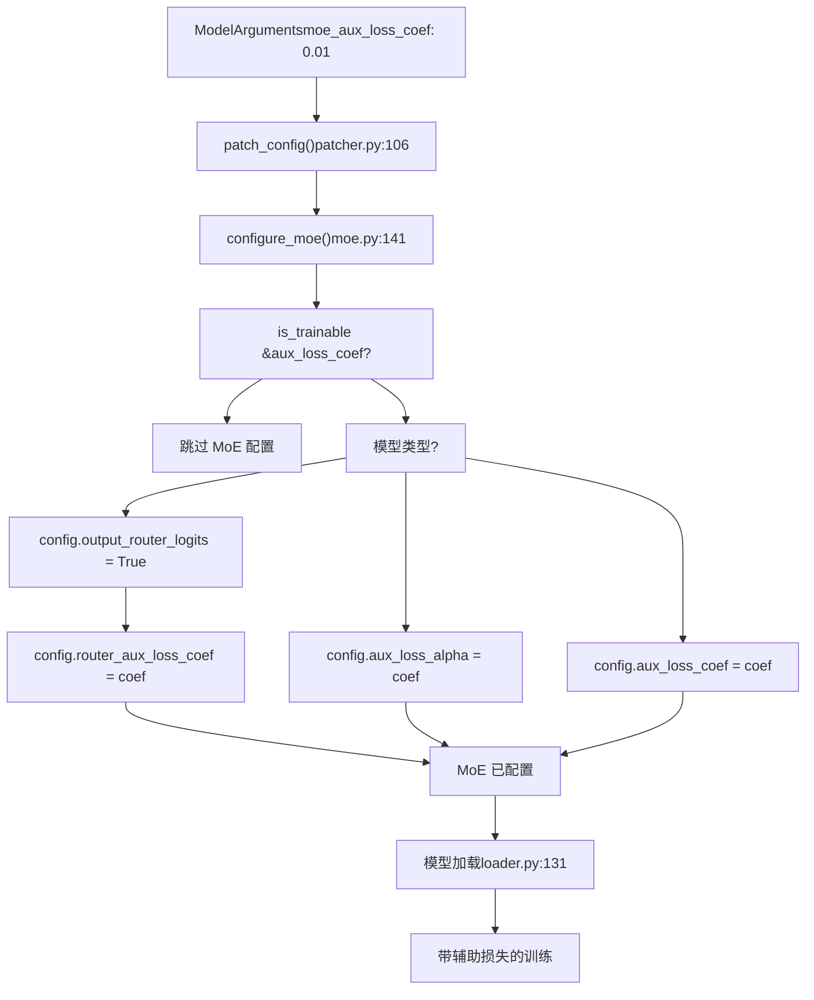
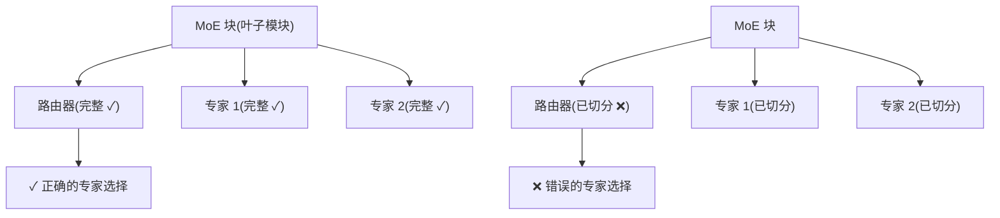
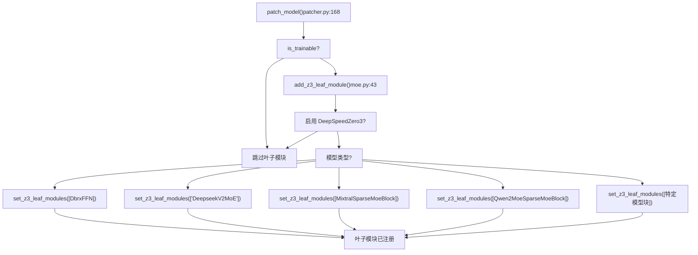
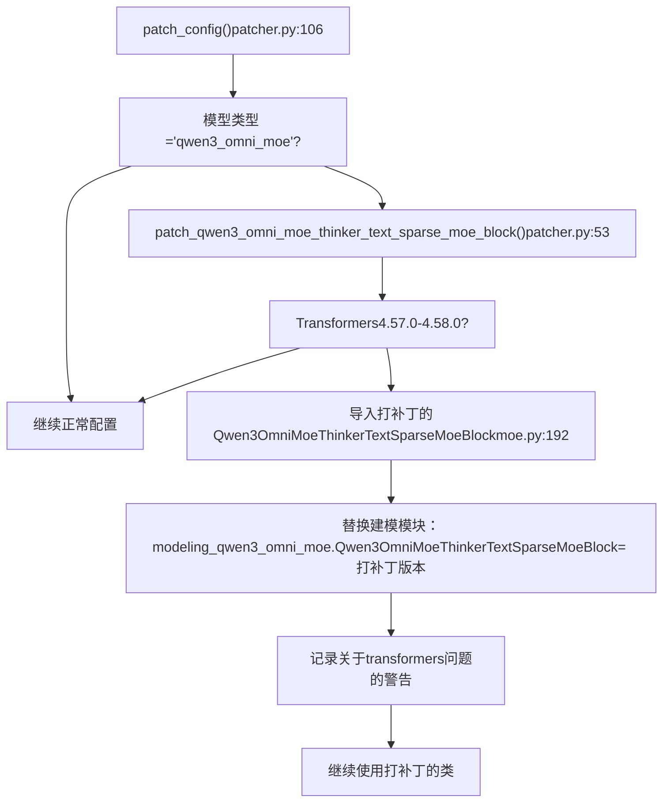

# 混合专家 (MoE) 模型

相关源文件

-   [src/llamafactory/extras/env.py](https://github.com/hiyouga/LlamaFactory/blob/355d5c5e/src/llamafactory/extras/env.py)
-   [src/llamafactory/extras/packages.py](https://github.com/hiyouga/LlamaFactory/blob/355d5c5e/src/llamafactory/extras/packages.py)
-   [src/llamafactory/hparams/model\_args.py](https://github.com/hiyouga/LlamaFactory/blob/355d5c5e/src/llamafactory/hparams/model_args.py)
-   [src/llamafactory/model/adapter.py](https://github.com/hiyouga/LlamaFactory/blob/355d5c5e/src/llamafactory/model/adapter.py)
-   [src/llamafactory/model/loader.py](https://github.com/hiyouga/LlamaFactory/blob/355d5c5e/src/llamafactory/model/loader.py)
-   [src/llamafactory/model/model\_utils/attention.py](https://github.com/hiyouga/LlamaFactory/blob/355d5c5e/src/llamafactory/model/model_utils/attention.py)
-   [src/llamafactory/model/model\_utils/liger\_kernel.py](https://github.com/hiyouga/LlamaFactory/blob/355d5c5e/src/llamafactory/model/model_utils/liger_kernel.py)
-   [src/llamafactory/model/model\_utils/moe.py](https://github.com/hiyouga/LlamaFactory/blob/355d5c5e/src/llamafactory/model/model_utils/moe.py)
-   [src/llamafactory/model/model\_utils/unsloth.py](https://github.com/hiyouga/LlamaFactory/blob/355d5c5e/src/llamafactory/model/model_utils/unsloth.py)
-   [src/llamafactory/model/model\_utils/valuehead.py](https://github.com/hiyouga/LlamaFactory/blob/355d5c5e/src/llamafactory/model/model_utils/valuehead.py)
-   [src/llamafactory/model/patcher.py](https://github.com/hiyouga/LlamaFactory/blob/355d5c5e/src/llamafactory/model/patcher.py)
-   [src/llamafactory/train/callbacks.py](https://github.com/hiyouga/LlamaFactory/blob/355d5c5e/src/llamafactory/train/callbacks.py)

## 目的与范围

本文档涵盖了 LlamaFactory 对混合专家 (MoE) 架构的专门支持。MoE 模型使用多个专家子网络和路由机制，在训练期间需要特殊处理，以实现正确的分布式训练集成和辅助损失计算。

有关通用模型加载和配置，请参阅[模型加载与配置](/hiyouga/LlamaFactory/5-model-loading-and-configuration)。有关分布式训练策略，请参阅[分布式训练](/hiyouga/LlamaFactory/6.4-distributed-training)。有关适用于 MoE 模型的性能优化技术，请参阅[性能优化](/hiyouga/LlamaFactory/9.3-performance-optimization)。

---

## MoE 支持概述

LlamaFactory 通过三个主要机制为 MoE 模型提供全面支持：

| 功能 | 目的 | 关键函数 |
| --- | --- | --- |
| **辅助损失配置** | 启用并配置路由器负载均衡损失 | `configure_moe()` |
| **DeepSpeed Zero3 集成** | 将 MoE 模块注册为叶子模块以防止参数切分 | `add_z3_leaf_module()` |
| **特定模型补丁** | 修复某些 MoE 实现中的兼容性问题 | `patch_qwen3_omni_moe_thinker_text_sparse_moe_block()` |

**来源：** [src/llamafactory/model/model\_utils/moe.py1-253](https://github.com/hiyouga/LlamaFactory/blob/355d5c5e/src/llamafactory/model/model_utils/moe.py#L1-L253)

---

## 支持的 MoE 架构

LlamaFactory 支持 20 多个 MoE 模型家族。下表列出了所有支持的架构：

| 模型类型 | 路由器 Logits | 辅助损失参数 | DeepSpeed Zero3 支持 | 备注 |
| --- | --- | --- | --- | --- |
| `dbrx` | ✓ | `router_aux_loss_coef` | ✓ `DbrxFFN` | 标准 MoE |
| `deepseek` | ✗ | `aux_loss_alpha` | ✗ | 自定义损失命名 |
| `deepseek_v2` | ✗ | ✗ | ✓ `DeepseekV2MoE` | 自定义实现 |
| `deepseek_v3` | ✗ | ✗ | ✓ `DeepseekV3MoE` | 自定义实现 |
| `ernie4_5_moe` | ✓ | `router_aux_loss_coef` | ✓ `Ernie4_5_MoeSparseMoeBlock` |  |
| `granitemoe` | ✓ | `router_aux_loss_coef` | ✓ `GraniteMoeMoE` |  |
| `glm4_moe` | ✗ | ✗ | ✓ `Glm4MoeMoE` |  |
| `glm4v_moe` | ✗ | ✗ | ✓ `Glm4vMoeTextMoE` | 多模态 |
| `gpt_oss` | ✗ | ✗ | ✓ `GptOssMLP` |  |
| `jamba` | ✓ | `router_aux_loss_coef` | ✓ `JambaSparseMoeBlock` | 混合 SSM-MoE |
| `jetmoe` | ✗ | `aux_loss_coef` | ✓ `JetMoeMoA`, `JetMoeMoE` | MoA + MoE |
| `kimi_vl` | ✗ | ✗ | ✓ `DeepseekV3MoE` | 多模态 |
| `llama4` | ✓ | `router_aux_loss_coef` | ✓ `Llama4TextMoe` |  |
| `mixtral` | ✓ | `router_aux_loss_coef` | ✓ `MixtralSparseMoeBlock` |  |
| `olmoe` | ✓ | `router_aux_loss_coef` | ✓ `OlmoeSparseMoeBlock` |  |
| `phimoe` | ✓ | `router_aux_loss_coef` | ✓ `PhimoeSparseMoeBlock` |  |
| `qwen2_moe` | ✓ | `router_aux_loss_coef` | ✓ `Qwen2MoeSparseMoeBlock` |  |
| `qwen3_moe` | ✓ | `router_aux_loss_coef` | ✓ `Qwen3MoeSparseMoeBlock` | 亦用于 InternVL 3.5 |
| `qwen3_vl_moe` | ✗ | ✗ | ✓ `Qwen3VLMoeTextSparseMoeBlock` | 多模态 |
| `qwen3_omni_moe` | ✗ | ✗ | ✓ `Qwen3OmniMoeThinkerTextSparseMoeBlock` | 多模态，已打补丁 |

**来源：** [src/llamafactory/model/model\_utils/moe.py36-253](https://github.com/hiyouga/LlamaFactory/blob/355d5c5e/src/llamafactory/model/model_utils/moe.py#L36-L253)

---

## MoE 配置系统

### 配置参数

MoE 模型使用辅助损失来平衡专家利用率。这通过 `moe_aux_loss_coef` 参数进行配置：

```
# YAML 配置示例
model_name_or_path: mistralai/Mixtral-8x7B-v0.1
finetuning_type: lora
moe_aux_loss_coef: 0.01  # 路由器辅助损失系数
```
**参数详情：**

-   **类型：** `float | None`
-   **默认值：** `None` (禁用辅助损失)
-   **典型范围：** 0.001 到 0.1
-   **效果：** 较高的值会鼓励更平衡的专家利用率，但可能会降低模型容量

**来源：** [src/llamafactory/hparams/model\_args.py140-143](https://github.com/hiyouga/LlamaFactory/blob/355d5c5e/src/llamafactory/hparams/model_args.py#L140-L143)

### 配置流程


**来源：** [src/llamafactory/model/patcher.py106-126](https://github.com/hiyouga/LlamaFactory/blob/355d5c5e/src/llamafactory/model/patcher.py#L106-L126) [src/llamafactory/model/model\_utils/moe.py141-190](https://github.com/hiyouga/LlamaFactory/blob/355d5c5e/src/llamafactory/model/model_utils/moe.py#L141-L190)

### 特定模型的配置逻辑

`configure_moe()` 函数处理三种配置模式：

**模式 1：标准模型 (output\_router\_logits + router\_aux\_loss\_coef)**

```
# 模型：dbrx, ernie4_5_moe, granitemoe, jamba, llama4, mixtral, #         olmoe, phimoe, qwen2_moe, qwen3_moe
config.output_router_logits = True
config.router_aux_loss_coef = model_args.moe_aux_loss_coef
```
**模式 2：DeepSeek 模型 (aux\_loss\_alpha)**

```
# 模型：deepseek (v1)
config.aux_loss_alpha = model_args.moe_aux_loss_coef
```
**模式 3：JetMoE (aux\_loss\_coef)**

```
# 模型：jetmoe
config.aux_loss_coef = model_args.moe_aux_loss_coef
```
**多模态模型：** 对于复合模型（例如使用 Qwen3 MoE 文本主干的 InternVL 3.5），配置应用于 `text_config`：

```
text_config.output_router_logits = True
text_config.router_aux_loss_coef = model_args.moe_aux_loss_coef
```
**来源：** [src/llamafactory/model/model\_utils/moe.py141-190](https://github.com/hiyouga/LlamaFactory/blob/355d5c5e/src/llamafactory/model/model_utils/moe.py#L141-L190)

---

## DeepSpeed Zero3 集成

### 为什么需要叶子模块

DeepSpeed Zero3 会在 GPU 之间切分模型参数以减少显存使用。然而，MoE 块包含的路由逻辑必须在每个设备上保持完整。将 MoE 块注册为“叶子模块”可以防止 DeepSpeed 对其进行切分，从而确保正确的路由行为。


### 叶子模块注册过程


**来源：** [src/llamafactory/model/patcher.py168-205](https://github.com/hiyouga/LlamaFactory/blob/355d5c5e/src/llamafactory/model/patcher.py#L168-L205) [src/llamafactory/model/model\_utils/moe.py36-139](https://github.com/hiyouga/LlamaFactory/blob/355d5c5e/src/llamafactory/model/model_utils/moe.py#L36-L139)

### 特定模型的叶子模块映射

下表显示了为每种 MoE 模型类型注册的精确叶子模块类：

| 模型类型 | 叶子模块类 | 字符串或导入 |
| --- | --- | --- |
| `dbrx` | `DbrxFFN` | 从 transformers 导入 |
| `deepseek_v2` | `DeepseekV2MoE` | 字符串 (自定义代码) |
| `deepseek_v3` | `DeepseekV3MoE` | 字符串 (自定义代码) |
| `ernie4_5_moe` | `Ernie4_5_MoeSparseMoeBlock` | 从 transformers 导入 |
| `granitemoe` | `GraniteMoeMoE` | 从 transformers 导入 |
| `glm4_moe` | `Glm4MoeMoE` | 从 transformers 导入 |
| `glm4v_moe` | `Glm4vMoeTextMoE` | 从 transformers 导入 |
| `gpt_oss` | `GptOssMLP` | 从 transformers 导入 |
| `jamba` | `JambaSparseMoeBlock` | 从 transformers 导入 |
| `jetmoe` | `JetMoeMoA`, `JetMoeMoE` | 从 transformers 导入 |
| `kimi_vl` | `DeepseekV3MoE` | 字符串 (自定义代码) |
| `llama4` | `Llama4TextMoe` | 从 transformers 导入 |
| `mixtral` | `MixtralSparseMoeBlock` | 从 transformers 导入 |
| `olmoe` | `OlmoeSparseMoeBlock` | 从 transformers 导入 |
| `phimoe` | `PhimoeSparseMoeBlock` | 从 transformers 导入 |
| `qwen2_moe` | `Qwen2MoeSparseMoeBlock` | 从 transformers 导入 |
| `qwen3_moe` | `Qwen3MoeSparseMoeBlock` | 从 transformers 导入 |
| `qwen3_vl_moe` | `Qwen3VLMoeTextSparseMoeBlock` | 从 transformers 导入 |
| `qwen3_omni_moe` | `Qwen3OmniMoeThinkerTextSparseMoeBlock` | 从 transformers 导入 |

**注意：** 字符串形式的注册（例如 `'DeepseekV2MoE'`）用于具有不遵循标准 transformers 模式的自定义实现模型。

**来源：** [src/llamafactory/model/model\_utils/moe.py36-139](https://github.com/hiyouga/LlamaFactory/blob/355d5c5e/src/llamafactory/model/model_utils/moe.py#L36-L139)

---

## 特殊处理：Qwen3 Omni MoE 补丁

### 问题背景

Transformers 版本 4.57.0 到 4.58.0 在 `Qwen3OmniMoeThinkerTextSparseMoeBlock` 中包含一个错误，会导致 DeepSpeed Zero2 和 FSDP2 训练失败。LlamaFactory 提供了一个打过补丁的实现来解决这个问题。

### 补丁过程


**来源：** [src/llamafactory/model/patcher.py53-61](https://github.com/hiyouga/LlamaFactory/blob/355d5c5e/src/llamafactory/model/patcher.py#L53-L61) [src/llamafactory/model/model\_utils/moe.py192-253](https://github.com/hiyouga/LlamaFactory/blob/355d5c5e/src/llamafactory/model/model_utils/moe.py#L192-L253)

### 打补丁的实现细节

打过补丁的 `Qwen3OmniMoeThinkerTextSparseMoeBlock` 解决了路由权重计算问题。与有错误实现的的关键区别：

**原始问题：** 稀疏专家选择可能导致分布式训练中的梯度计算错误。

**补丁方案：** 该实现确保为所有专家计算完整的路由权重（对于未选择的专家权重为零），而不是仅为前 k 个专家计算权重：

```
# 为所有专家计算路由权重
routing_weights = F.softmax(router_logits, dim=1, dtype=torch.float)
# 保留前 k 个专家的权重，其余重置为 0
top_k_weights, top_k_indices = torch.topk(routing_weights, self.top_k, dim=-1)
full_routing_weights = torch.zeros_like(routing_weights)
full_routing_weights.scatter_(1, top_k_indices, top_k_weights)
# 遍历所有专家 (不仅仅是前 k 个)
for expert_idx in range(self.num_experts):
    expert_weights = full_routing_weights[:, expert_idx, None]
    current_hidden_states = expert_layer(hidden_states) * expert_weights
    final_hidden_states += current_hidden_states
```
这确保了梯度图在不同的分布式训练策略中保持一致。

**来源：** [src/llamafactory/model/model\_utils/moe.py192-253](https://github.com/hiyouga/LlamaFactory/blob/355d5c5e/src/llamafactory/model/model_utils/moe.py#L192-L253)

---

## 训练 MoE 模型

### 基础配置示例

```
# examples/train_lora/mixtral_lora_sft.yaml
model_name_or_path: mistralai/Mixtral-8x7B-v0.1
stage: sft
do_train: true
finetuning_type: lora
lora_target: all
# MoE 特定配置
moe_aux_loss_coef: 0.01
# 训练参数
per_device_train_batch_size: 2
gradient_accumulation_steps: 8
learning_rate: 5.0e-5
num_train_epochs: 3
lr_scheduler_type: cosine
warmup_ratio: 0.1
# MoE 内存优化
gradient_checkpointing: true
bf16: true
# 大型 MoE 模型推荐使用 DeepSpeed Zero3
deepspeed: examples/deepspeed/ds_z3_config.json
```
### 损失计算

设置 `moe_aux_loss_coef` 后，训练损失将包含一个辅助项：

```
total_loss = language_modeling_loss + moe_aux_loss_coef * routing_aux_loss
```
其中：

-   **language\_modeling\_loss**：用于预测下一标记的标准交叉熵损失
-   **routing\_aux\_loss**：鼓励均匀专家利用率的负载均衡损失
-   **moe\_aux\_loss\_coef**：加权系数（通常为 0.001-0.1）

当 `output_router_logits=True` 时，路由辅助损失由模型自动计算并在模型输出中返回。

**来源：** [src/llamafactory/model/model\_utils/moe.py141-190](https://github.com/hiyouga/LlamaFactory/blob/355d5c5e/src/llamafactory/model/model_utils/moe.py#L141-L190)

### DeepSpeed Zero3 配置

对于使用 DeepSpeed Zero3 的 MoE 模型，请确保在 DeepSpeed 配置中设置以下内容：

```
{
  "zero_optimization": {
    "stage": 3,
    "stage3_gather_16bit_weights_on_model_save": true
  },
  "bf16": {
    "enabled": true
  }
}
```
`stage3_gather_16bit_weights_on_model_save` 选项对于 MoE 模型尤为重要，以确保正确保存检查点。

**来源：** [src/llamafactory/model/model\_utils/moe.py36-40](https://github.com/hiyouga/LlamaFactory/blob/355d5c5e/src/llamafactory/model/model_utils/moe.py#L36-L40)

### MoE 模型的 LoRA

LoRA 可以应用于 MoE 模型，典型的目标模块为：

```
# 针对所有线性层 (推荐用于 MoE)
lora_target: all
# 或针对特定组件
lora_target: q_proj,k_proj,v_proj,o_proj,gate_proj,up_proj,down_proj
```
对于 MoE 模型，将 LoRA 应用于所有线性层通常会产生更好的结果，因为每个专家都有自己的一组 FFN 参数。

**来源：** [src/llamafactory/model/adapter.py214-233](https://github.com/hiyouga/LlamaFactory/blob/355d5c5e/src/llamafactory/model/adapter.py#L214-L233)

### 最佳实践

| 实践 | 推荐建议 | 理由 |
| --- | --- | --- |
| **辅助损失系数** | 从 0.01 开始，在 \[0.001, 0.1\] 范围内调整 | 平衡专家利用率和模型容量 |
| **分布式策略** | 对于参数量 >30B 的模型使用 DeepSpeed Zero3 | MoE 模型参数量巨大；Zero3 提供最佳显存效率 |
| **批次大小** | 保持较小的单卡批次大小 (1-4) | MoE 模型本身容量很高；大批次可能并非必要 |
| **LoRA 目标** | 使用 `lora_target: all` | 确保所有专家都能从微调中受益 |
| **梯度检查点** | 始终为参数量 >7B 的 MoE 模型启用 | 对于管理具有多专家的内存至关重要 |
| **混合精度** | 使用 `bf16: true` | 路由 Logits 的数值稳定性优于 fp16 |
| **Transformers 版本** | 若使用 Qwen3 Omni MoE，请使用 ≥4.58.0 | 通过使用修复后的 transformers 来避免打补丁的代码路径 |

---

## Liger Kernel 支持

某些 MoE 模型支持 Liger Kernel 以优化训练：

| 模型类型 | Liger 支持 | 备注 |
| --- | --- | --- |
| `mixtral` | ✓ | `apply_liger_kernel_to_mixtral` |
| `qwen3_moe` | ✓ | `apply_liger_kernel_to_qwen3_moe` |
| 其他 | ✗ | 使用标准核函数 |

启用方式：

```
enable_liger_kernel: true
moe_aux_loss_coef: 0.01
```
**注意：** 当使用需要 Logits 的阶段（如 DPO, KTO）时，Liger 的分块交叉熵会自动禁用以确保兼容性。

**来源：** [src/llamafactory/model/model\_utils/liger\_kernel.py30-97](https://github.com/hiyouga/LlamaFactory/blob/355d5c5e/src/llamafactory/model/model_utils/liger_kernel.py#L30-L97)

---

## 故障排除

### 常见问题

| 问题 | 症状 | 解决方案 |
| --- | --- | --- |
| **DeepSpeed Zero3 失败** | 在 MoE 路由的前向传递过程中出错 | 确保使用具有适当 DeepSpeed 支持的 transformers 版本。LlamaFactory 会自动注册叶子模块。 |
| **Qwen3 Omni MoE 训练失败** | 在 FSDP2/DeepSpeed Zero2 模式下出错 | 使用 transformers ≥4.58.0 或依赖 LlamaFactory 的自动打补丁功能 |
| **显存占用高** | 训练期间出现 OOM 错误 | 启用梯度检查点，减小批次大小，或使用 DeepSpeed Zero3 |
| **专家利用率低** | 某些专家极少被激活 | 增加 `moe_aux_loss_coef` 以鼓励负载均衡 |
| **训练不稳定** | 损失突增或出现 NaN | 降低学习率，使用 bf16 而非 fp16，或调整辅助损失系数 |

### 验证

要验证 MoE 配置是否已正确应用：

```
# 检查辅助损失是否已配置
llamafactory-cli train config.yaml --print_param_status true 2>&1 | grep -i "aux_loss"
# 检查叶子模块是否已注册 (仅限 DeepSpeed Zero3)
# 查找类似 "Set z3 leaf modules: [...]" 的日志消息
```
**来源：** [src/llamafactory/hparams/model\_args.py196-199](https://github.com/hiyouga/LlamaFactory/blob/355d5c5e/src/llamafactory/hparams/model_args.py#L196-L199)

---

## 总结

LlamaFactory 中的 MoE 模型支持包括：

1.  **配置：** 设置 `moe_aux_loss_coef` 以启用负载均衡辅助损失
2.  **DeepSpeed 集成：** 为 Zero3 自动将 MoE 块注册为叶子模块
3.  **模型补丁：** 自动修复已知的兼容性问题（例如 Qwen3 Omni MoE）
4.  **训练：** 具有自动损失计算的标准训练工作流

该实现透明地处理了 20 多种 MoE 架构，在保持简单用户界面的同时提供特定于模型的优化。

**来源：** [src/llamafactory/model/model\_utils/moe.py1-253](https://github.com/hiyouga/LlamaFactory/blob/355d5c5e/src/llamafactory/model/model_utils/moe.py#L1-L253) [src/llamafactory/model/patcher.py1-253](https://github.com/hiyouga/LlamaFactory/blob/355d5c5e/src/llamafactory/model/patcher.py#L1-L253)
