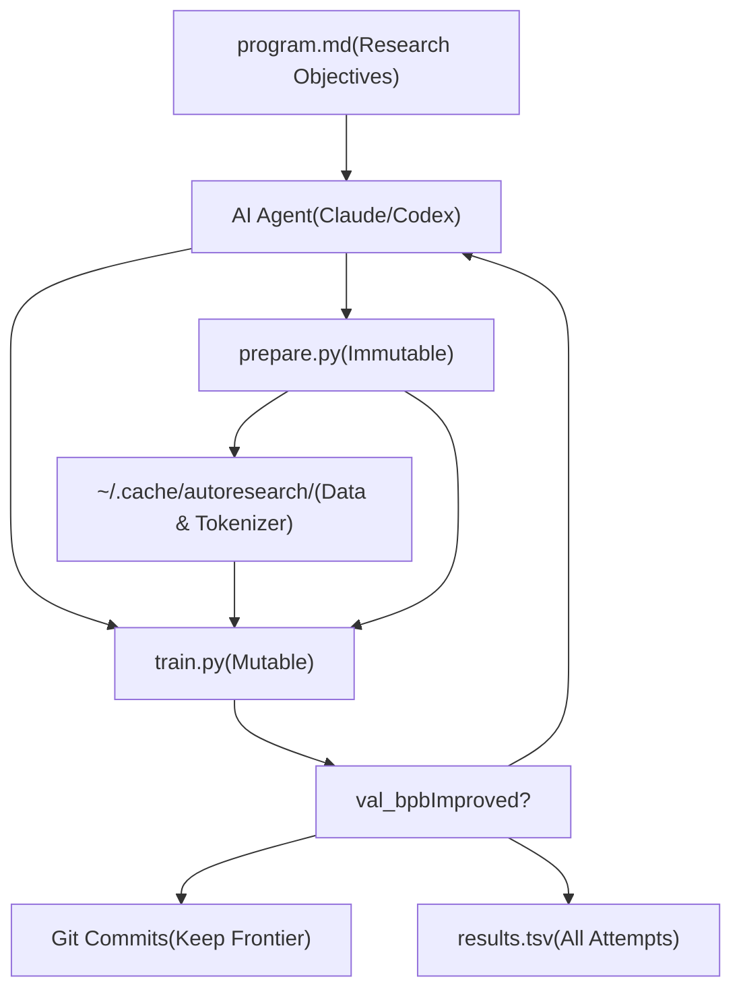

# Autoresearch 概览

相关源文件

-   [README.md](https://github.com/karpathy/autoresearch/blob/e6d79c12/README.md?plain=1)
-   [program.md](https://github.com/karpathy/autoresearch/blob/e6d79c12/program.md?plain=1)

## 目的与范围

本文档对 autoresearch 系统进行高层介绍。该系统是一个面向机器学习实验的自主 AI 研究框架。Autoresearch 使 AI 代理能够在一个小规模但真实的 LLM 训练环境中进行隔夜实验，自主修改代码、运行实验，并基于性能改进决定保留哪些变更。[README.md1-19](https://github.com/karpathy/autoresearch/blob/e6d79c12/README.md?plain=1#L1-L19)

本页涵盖基础架构、核心概念和设计原则。有关详细的环境搭建说明，请参见 [快速开始](/karpathy/autoresearch/2-getting-started)。有关组件级文档，请参见 [核心组件](/karpathy/autoresearch/3-core-components)。有关代理如何运行的信息，请参见 [代理运行](/karpathy/autoresearch/4-agent-operation)。

**来源：** [README.md1-19](https://github.com/karpathy/autoresearch/blob/e6d79c12/README.md?plain=1#L1-L19)

## 什么是 Autoresearch？

Autoresearch 是一个颠覆传统机器学习研究工作流的框架。与“人类编写代码并运行实验”不同，AI 代理会自主完成以下流程：[README.md7-17](https://github.com/karpathy/autoresearch/blob/e6d79c12/README.md?plain=1#L7-L17)

1.  从 `program.md` 读取研究目标 [README.md15](https://github.com/karpathy/autoresearch/blob/e6d79c12/README.md?plain=1#L15-L15)
2.  修改 `train.py` 以实现实验想法 [README.md14](https://github.com/karpathy/autoresearch/blob/e6d79c12/README.md?plain=1#L14-L14)
3.  精确训练 5 分钟 [README.md17](https://github.com/karpathy/autoresearch/blob/e6d79c12/README.md?plain=1#L17-L17)
4.  从日志中提取 `val_bpb` 指标 [program.md58-61](https://github.com/karpathy/autoresearch/blob/e6d79c12/program.md?plain=1#L58-L61)
5.  决定保留或丢弃该变更 [program.md103-104](https://github.com/karpathy/autoresearch/blob/e6d79c12/program.md?plain=1#L103-L104)
6.  将所有尝试记录到 `results.tsv` [program.md66-78](https://github.com/karpathy/autoresearch/blob/e6d79c12/program.md?plain=1#L66-L78)
7.  持续重复（约每小时 12 次实验） [README.md64](https://github.com/karpathy/autoresearch/blob/e6d79c12/README.md?plain=1#L64-L64)

人类的角色会从“编写代码”转变为在 `program.md` 中编写“研究组织代码”——即指导代理研究方向的指令。[README.md7](https://github.com/karpathy/autoresearch/blob/e6d79c12/README.md?plain=1#L7-L7) 隔夜运行可产出约 100 次实验，所有结果都会被记录以供事后分析。[README.md64](https://github.com/karpathy/autoresearch/blob/e6d79c12/README.md?plain=1#L64-L64)

**来源：** [README.md7-17](https://github.com/karpathy/autoresearch/blob/e6d79c12/README.md?plain=1#L7-L17) [README.md44-65](https://github.com/karpathy/autoresearch/blob/e6d79c12/README.md?plain=1#L44-L65) [program.md58-104](https://github.com/karpathy/autoresearch/blob/e6d79c12/program.md?plain=1#L58-L104)

## 系统架构概览

### 三层设计


**图示：包含代码实体的三层架构**

系统在三个不可变边界上实现了关注点分离：[README.md11-17](https://github.com/karpathy/autoresearch/blob/e6d79c12/README.md?plain=1#L11-L17)

| Layer | Files | Modification Policy | Purpose |
| --- | --- | --- | --- |
| **Human** | `program.md` | Human edits | 定义研究目标与代理指令 [README.md15](https://github.com/karpathy/autoresearch/blob/e6d79c12/README.md?plain=1#L15-L15) |
| **Agent** | AI executor | Autonomous operation | 读取目标、提出变更、做出决策 [program.md94-112](https://github.com/karpathy/autoresearch/blob/e6d79c12/program.md?plain=1#L94-L112) |
| **Infrastructure** | `prepare.py` (immutable)
`train.py` (mutable) | `prepare.py`: never modified
`train.py`: agent modifies | 固定评估基座与实验沙盒 [README.md13-14](https://github.com/karpathy/autoresearch/blob/e6d79c12/README.md?plain=1#L13-L14) |

**来源：** [README.md11-17](https://github.com/karpathy/autoresearch/blob/e6d79c12/README.md?plain=1#L11-L17) [README.md54-59](https://github.com/karpathy/autoresearch/blob/e6d79c12/README.md?plain=1#L54-L59) [program.md94-112](https://github.com/karpathy/autoresearch/blob/e6d79c12/program.md?plain=1#L94-L112)

### 文件角色与职责

**图示：文件结构与代码实体映射**

| File | Modification Policy | Key Entities | Purpose |
| --- | --- | --- | --- |
| `prepare.py` | **Never modified** | `MAX_SEQ_LEN`, `TIME_BUDGET`, `make_dataloader()`, `evaluate_bpb()`, `Tokenizer` | 确保实验间可公平比较 [README.md13](https://github.com/karpathy/autoresearch/blob/e6d79c12/README.md?plain=1#L13-L13) |
| `train.py` | **Agent modifies** | `GPT`, `CausalSelfAttention`, `MLP`, `MuonAdamW`, training loop, `DEPTH`, `WINDOW_PATTERN` | 所有变更发生的实验沙盒 [README.md14](https://github.com/karpathy/autoresearch/blob/e6d79c12/README.md?plain=1#L14-L14) |
| `program.md` | **Human edits** | Research objectives, agent instructions, context | 指导代理行为的“研究组织代码” [README.md15](https://github.com/karpathy/autoresearch/blob/e6d79c12/README.md?plain=1#L15-L15) |
| `pyproject.toml` | **Fixed** | Dependencies: `torch`, `tiktoken`, `rustbpe`, etc. | 最小化依赖集合 [README.md58](https://github.com/karpathy/autoresearch/blob/e6d79c12/README.md?plain=1#L58-L58) |

**来源：** [README.md11-17](https://github.com/karpathy/autoresearch/blob/e6d79c12/README.md?plain=1#L11-L17) [README.md54-59](https://github.com/karpathy/autoresearch/blob/e6d79c12/README.md?plain=1#L54-L59) [README.md63-66](https://github.com/karpathy/autoresearch/blob/e6d79c12/README.md?plain=1#L63-L66)

## 自主研究循环

**图示：自主研究循环状态机**

该循环在无人干预下持续运行。[program.md112](https://github.com/karpathy/autoresearch/blob/e6d79c12/program.md?plain=1#L112-L112) 每次迭代包含约 5 分钟训练，以及编译、日志记录和 git 操作的额外开销。[program.md108](https://github.com/karpathy/autoresearch/blob/e6d79c12/program.md?plain=1#L108-L108) 因此大约可达到每小时 12 次实验，并在 8 小时隔夜运行中完成约 100 次实验。[README.md64](https://github.com/karpathy/autoresearch/blob/e6d79c12/README.md?plain=1#L64-L64)

**来源：** [README.md7](https://github.com/karpathy/autoresearch/blob/e6d79c12/README.md?plain=1#L7-L7) [README.md64](https://github.com/karpathy/autoresearch/blob/e6d79c12/README.md?plain=1#L64-L64) [program.md94-112](https://github.com/karpathy/autoresearch/blob/e6d79c12/program.md?plain=1#L94-L112)

## 关键设计原则

### 1\. 固定时间预算

训练严格以墙钟时间 **5 分钟**（300 秒）为限，不包含启动与编译时间。[README.md17](https://github.com/karpathy/autoresearch/blob/e6d79c12/README.md?plain=1#L17-L17) 这一约束通过 `prepare.py` 中的 `TIME_BUDGET` 常量在训练循环中执行。[README.md13](https://github.com/karpathy/autoresearch/blob/e6d79c12/README.md?plain=1#L13-L13)

**理由：**

-   **公平比较：** 无论模型大小、batch 大小或架构变化，所有实验都可直接比较 [README.md64](https://github.com/karpathy/autoresearch/blob/e6d79c12/README.md?plain=1#L64-L64)
-   **平台优化：** 在固定时间预算内，Autoresearch 会为你的特定硬件找到最优模型 [README.md64](https://github.com/karpathy/autoresearch/blob/e6d79c12/README.md?plain=1#L64-L64)
-   **可预测吞吐：** 可以稳定估算每小时实验数（约 12）和隔夜实验数（约 100） [README.md64](https://github.com/karpathy/autoresearch/blob/e6d79c12/README.md?plain=1#L64-L64)

**权衡：** 结果具有平台相关性，无法在不同硬件间直接比较（如 H100 与 RTX 4090）。[README.md64](https://github.com/karpathy/autoresearch/blob/e6d79c12/README.md?plain=1#L64-L64)

**来源：** [README.md17](https://github.com/karpathy/autoresearch/blob/e6d79c12/README.md?plain=1#L17-L17) [README.md64](https://github.com/karpathy/autoresearch/blob/e6d79c12/README.md?plain=1#L64-L64)

### 2\. 单一指标：val\_bpb

唯一优化目标是 `val_bpb`（验证 bits per byte），通过 `grep '^val_bpb:' run.log` 提取。[program.md61](https://github.com/karpathy/autoresearch/blob/e6d79c12/program.md?plain=1#L61-L61) 该指标具有以下特性：

-   **与词表大小无关：** 允许在代理修改 tokenizer 或词表时进行公平比较 [README.md17](https://github.com/karpathy/autoresearch/blob/e6d79c12/README.md?plain=1#L17-L17)
-   **越低越好：** 衡量模型压缩质量 [README.md17](https://github.com/karpathy/autoresearch/blob/e6d79c12/README.md?plain=1#L17-L17)
-   **固定评估：** 由 `prepare.py` 中不可变的 `evaluate_bpb()` 在固定验证 token 集上计算 [program.md31](https://github.com/karpathy/autoresearch/blob/e6d79c12/program.md?plain=1#L31-L31)

**次级约束：**

-   `peak_vram_mb`：用于避免 OOM 崩溃的软约束 [program.md35](https://github.com/karpathy/autoresearch/blob/e6d79c12/program.md?plain=1#L35-L35)
-   代码简洁性：在性能相近时优先更简洁的实现 [program.md37](https://github.com/karpathy/autoresearch/blob/e6d79c12/program.md?plain=1#L37-L37)

**来源：** [README.md17](https://github.com/karpathy/autoresearch/blob/e6d79c12/README.md?plain=1#L17-L17) [program.md31-37](https://github.com/karpathy/autoresearch/blob/e6d79c12/program.md?plain=1#L31-L37)

### 3\. 单文件修改

代理**只**修改 `train.py`。[README.md63](https://github.com/karpathy/autoresearch/blob/e6d79c12/README.md?plain=1#L63-L63) 这一设计：

-   **将范围控制在可管理水平：** 代理无需处理复杂的多文件变更 [README.md63](https://github.com/karpathy/autoresearch/blob/e6d79c12/README.md?plain=1#L63-L63)
-   **让差异可审阅：** 每次实验都是一个仅改动单文件的提交 [README.md63](https://github.com/karpathy/autoresearch/blob/e6d79c12/README.md?plain=1#L63-L63)
-   **防止基础设施漂移：** `prepare.py` 保持固定，确保 `evaluate_bpb()` 永不变化 [README.md13](https://github.com/karpathy/autoresearch/blob/e6d79c12/README.md?plain=1#L13-L13)

`train.py` 中的所有内容都可作为实验对象：

-   模型架构（`GPT`, `CausalSelfAttention`, `MLP`） [README.md14](https://github.com/karpathy/autoresearch/blob/e6d79c12/README.md?plain=1#L14-L14)
-   优化器（`MuonAdamW` 或替代方案） [README.md14](https://github.com/karpathy/autoresearch/blob/e6d79c12/README.md?plain=1#L14-L14)
-   超参数（`DEPTH`, `WINDOW_PATTERN`, `TOTAL_BATCH_SIZE`, learning rates） [README.md14](https://github.com/karpathy/autoresearch/blob/e6d79c12/README.md?plain=1#L14-L14)
-   训练循环逻辑（梯度累积、学习率调度） [README.md14](https://github.com/karpathy/autoresearch/blob/e6d79c12/README.md?plain=1#L14-L14)

**来源：** [README.md14](https://github.com/karpathy/autoresearch/blob/e6d79c12/README.md?plain=1#L14-L14) [README.md63](https://github.com/karpathy/autoresearch/blob/e6d79c12/README.md?plain=1#L63-L63)

### 4\. 最小依赖

系统是自包含的，仅依赖 `pyproject.toml` 中定义的最小外部依赖集合。[README.md65-66](https://github.com/karpathy/autoresearch/blob/e6d79c12/README.md?plain=1#L65-L66)

| Dependency | Purpose |
| --- | --- |
| `torch` (CUDA 12.8) | 模型训练与 GPU 加速 [README.md23](https://github.com/karpathy/autoresearch/blob/e6d79c12/README.md?plain=1#L23-L23) |
| `tiktoken` | BPE tokenizer 工具 [README.md65](https://github.com/karpathy/autoresearch/blob/e6d79c12/README.md?plain=1#L65-L65) |
| `rustbpe` | 高速 BPE 训练 [README.md65](https://github.com/karpathy/autoresearch/blob/e6d79c12/README.md?plain=1#L65-L65) |
| `uv` | 项目与依赖管理 [README.md23](https://github.com/karpathy/autoresearch/blob/e6d79c12/README.md?plain=1#L23-L23) |

无分布式训练框架、无复杂配置系统、无外部实验跟踪。单 GPU、单文件、单指标。[README.md65](https://github.com/karpathy/autoresearch/blob/e6d79c12/README.md?plain=1#L65-L65)

**来源：** [README.md23](https://github.com/karpathy/autoresearch/blob/e6d79c12/README.md?plain=1#L23-L23) [README.md65-66](https://github.com/karpathy/autoresearch/blob/e6d79c12/README.md?plain=1#L65-L66)

## 系统工作流

完整的 autoresearch 工作流按阶段进行：

### 阶段 1：一次性初始化

```
uv sync                # Install dependenciesuv run prepare.py      # Download data, train tokenizer (~2 minutes)
```
[README.md31-34](https://github.com/karpathy/autoresearch/blob/e6d79c12/README.md?plain=1#L31-L34)

会创建 `~/.cache/autoresearch/`，其中包含数据分片和 tokenizer。[program.md15](https://github.com/karpathy/autoresearch/blob/e6d79c12/program.md?plain=1#L15-L15)

### 阶段 2：建立基线

```
uv run train.py        # Manual baseline run (~5 minutes)
```
[README.md37](https://github.com/karpathy/autoresearch/blob/e6d79c12/README.md?plain=1#L37-L37)

建立最初需要超越的 `val_bpb` 基线。[program.md39](https://github.com/karpathy/autoresearch/blob/e6d79c12/program.md?plain=1#L39-L39)

### 阶段 3：自主运行

```
# Prompt the agent:
"Hi have a look at program.md and let's kick off a new experiment!"
```
[README.md47](https://github.com/karpathy/autoresearch/blob/e6d79c12/README.md?plain=1#L47-L47)

代理会无限循环运行研究流程，并记录到 `results.tsv`。[program.md94-112](https://github.com/karpathy/autoresearch/blob/e6d79c12/program.md?plain=1#L94-L112)

### 阶段 4：分析

通过分析 `results.tsv` 与 git 历史，人类可以解读研究进展。[program.md66-88](https://github.com/karpathy/autoresearch/blob/e6d79c12/program.md?plain=1#L66-L88)

**来源：** [README.md23-51](https://github.com/karpathy/autoresearch/blob/e6d79c12/README.md?plain=1#L23-L51) [program.md15-112](https://github.com/karpathy/autoresearch/blob/e6d79c12/program.md?plain=1#L15-L112)

## 适用场景

Autoresearch 适用于：[README.md7](https://github.com/karpathy/autoresearch/blob/e6d79c12/README.md?plain=1#L7-L7)

1.  **隔夜实验：** 在睡眠期间运行约 100 次实验 [README.md114](https://github.com/karpathy/autoresearch/blob/e6d79c12/README.md?plain=1#L114-L114)
2.  **架构搜索：** 探索模型设计空间（注意力模式、层类型等） [program.md33](https://github.com/karpathy/autoresearch/blob/e6d79c12/program.md?plain=1#L33-L33)
3.  **超参数调优：** 寻找最优学习率、batch 大小、网络深度 [program.md33](https://github.com/karpathy/autoresearch/blob/e6d79c12/program.md?plain=1#L33-L33)
4.  **优化器对比：** 测试 MuonAdamW 的变体或替代优化器 [program.md33](https://github.com/karpathy/autoresearch/blob/e6d79c12/program.md?plain=1#L33-L33)
5.  **研究组织优化：** 迭代 `program.md` 以提升代理效率 [README.md7](https://github.com/karpathy/autoresearch/blob/e6d79c12/README.md?plain=1#L7-L7)

Autoresearch **不**适用于：

-   多 GPU 分布式训练（仅支持单 GPU） [README.md65](https://github.com/karpathy/autoresearch/blob/e6d79c12/README.md?plain=1#L65-L65)
-   长时训练（固定 5 分钟预算） [README.md64](https://github.com/karpathy/autoresearch/blob/e6d79c12/README.md?plain=1#L64-L64)
-   人机协同循环实验（完全自主） [program.md112](https://github.com/karpathy/autoresearch/blob/e6d79c12/program.md?plain=1#L112-L112)
-   跨平台结果比较（平台特定优化） [README.md64](https://github.com/karpathy/autoresearch/blob/e6d79c12/README.md?plain=1#L64-L64)

**来源：** [README.md7](https://github.com/karpathy/autoresearch/blob/e6d79c12/README.md?plain=1#L7-L7) [README.md64-66](https://github.com/karpathy/autoresearch/blob/e6d79c12/README.md?plain=1#L64-L66) [README.md114](https://github.com/karpathy/autoresearch/blob/e6d79c12/README.md?plain=1#L114-L114) [program.md33-112](https://github.com/karpathy/autoresearch/blob/e6d79c12/program.md?plain=1#L33-L112)

## 平台要求

| Requirement | Specification |
| --- | --- |
| **GPU** | 单张 NVIDIA GPU（在 H100 上测试） [README.md23](https://github.com/karpathy/autoresearch/blob/e6d79c12/README.md?plain=1#L23-L23) |
| **Python** | 3.10+ [README.md23](https://github.com/karpathy/autoresearch/blob/e6d79c12/README.md?plain=1#L23-L23) |
| **Package Manager** | `uv`（Astral 的包管理器） [README.md23](https://github.com/karpathy/autoresearch/blob/e6d79c12/README.md?plain=1#L23-L23) |
| **CUDA** | 12.8（PyTorch 要求） [README.md23](https://github.com/karpathy/autoresearch/blob/e6d79c12/README.md?plain=1#L23-L23) |

有关平台适配（MacOS、Windows RTX 等），请参见 [平台适配与分叉](/karpathy/autoresearch/8.4-platform-adaptation-and-forks)。[README.md69-81](https://github.com/karpathy/autoresearch/blob/e6d79c12/README.md?plain=1#L69-L81)

**来源：** [README.md23](https://github.com/karpathy/autoresearch/blob/e6d79c12/README.md?plain=1#L23-L23) [README.md67-88](https://github.com/karpathy/autoresearch/blob/e6d79c12/README.md?plain=1#L67-L88)

## 后续步骤

-   **新用户：** 从 [快速开始](/karpathy/autoresearch/2-getting-started) 开始，完成安装并运行首个实验
-   **理解组件：** 参见 [核心组件](/karpathy/autoresearch/3-core-components) 获取详细文件文档
-   **运行实验：** 参见 [代理运行](/karpathy/autoresearch/4-agent-operation) 了解自主循环细节
-   **自定义：** 参见 [高级主题](/karpathy/autoresearch/8-advanced-topics) 进行平台调优与研究程序设计

**来源：** [README.md21-51](https://github.com/karpathy/autoresearch/blob/e6d79c12/README.md?plain=1#L21-L51)
