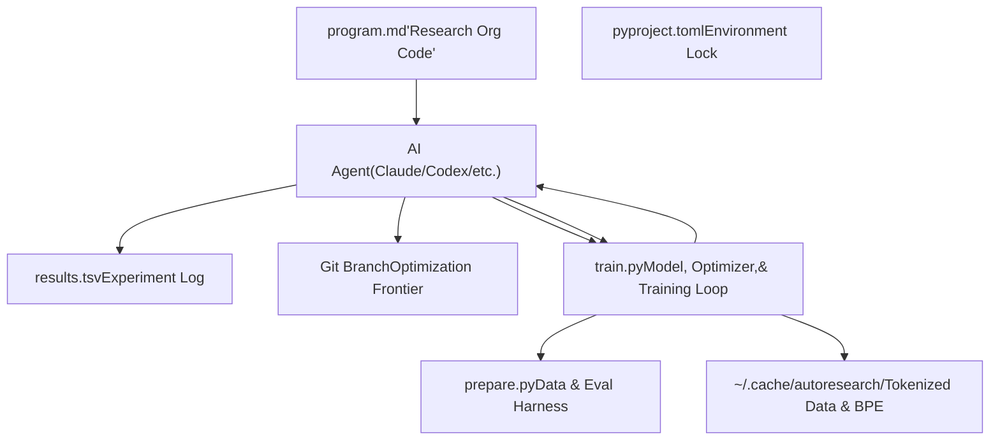
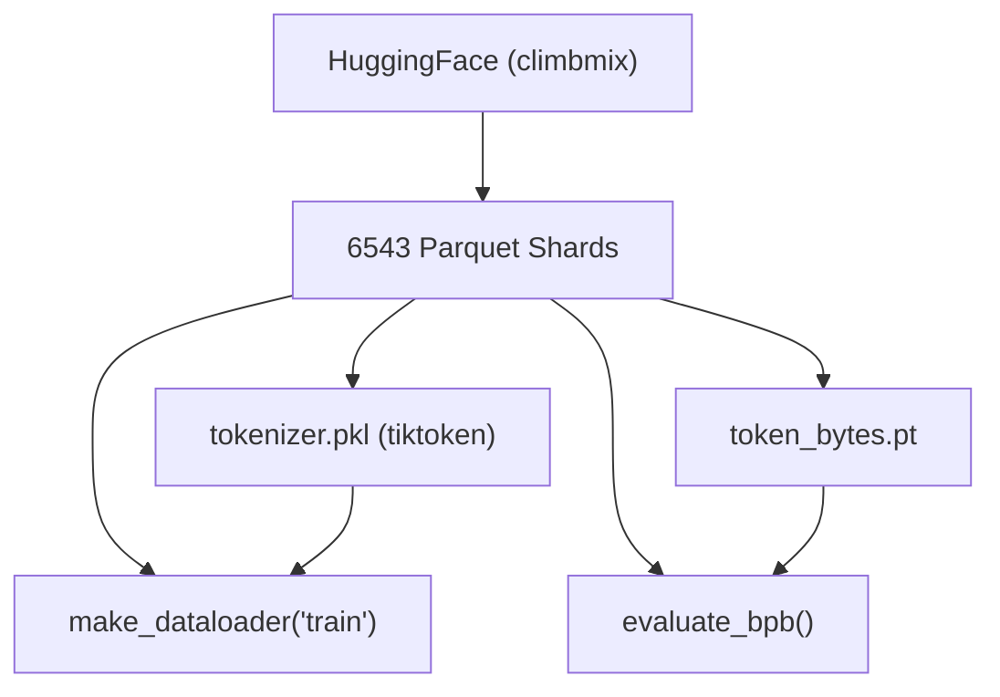

# 系统架构

相关源文件

-   [README.md](https://github.com/karpathy/autoresearch/blob/e6d79c12/README.md?plain=1)
-   [prepare.py](https://github.com/karpathy/autoresearch/blob/e6d79c12/prepare.py)
-   [train.py](https://github.com/karpathy/autoresearch/blob/e6d79c12/train.py)

## 目的与范围

本文档对 **autoresearch** 系统架构进行详细的技术说明。内容涵盖人类驱动策略、代理驱动执行与底层不可变基础设施之间的三层分离。该系统被设计为一个“闭环”研究环境：AI 代理在固定时间预算内迭代修改单个文件（`train.py`），以最小化特定指标（`val_bpb`）。

## 组件概览

该架构分为三个明确层级：**人类层**（策略）、**代理层**（执行）和 **基础设施层**（固定环境）。


**组件职责：**

| Component | Role | File Path | Modifiable By |
| --- | --- | --- | --- |
| **Strategy** | 指令与实验协议 | `program.md` | Human |
| **Infrastructure** | 数据加载、分词与 `evaluate_bpb` | `prepare.py` | Fixed |
| **Research Core** | 模型架构、优化器与训练循环 | `train.py` | Agent |
| **Metric Log** | 所有尝试（成功/失败）的表格历史 | `results.tsv` | Agent |
| **Frontier** | 跟踪当前“最优”代码的版本控制 | Git | Agent |

**来源：** [README.md11-15](https://github.com/karpathy/autoresearch/blob/e6d79c12/README.md?plain=1#L11-L15) [README.md52-59](https://github.com/karpathy/autoresearch/blob/e6d79c12/README.md?plain=1#L52-L59) [program.md7-15](https://github.com/karpathy/autoresearch/blob/e6d79c12/program.md?plain=1#L7-L15)

## 三层架构

### 1\. 人类层（`program.md`）

人类充当“研究主管”，负责撰写 `program.md` 文件。该文件不包含模型代码，而是包含研究组织的**元代码**。它定义代理应如何思考、如何处理错误，以及记录结果的具体协议。

-   **角色：** 设定研究方向与运行约束 [program.md7-10](https://github.com/karpathy/autoresearch/blob/e6d79c12/program.md?plain=1#L7-L10)
-   **关键实体：** “Skill” 或 “Research Org Code” [README.md50](https://github.com/karpathy/autoresearch/blob/e6d79c12/README.md?plain=1#L50-L50)

### 2\. 代理层（自主执行器）

代理（通常是具备工具调用能力的大语言模型）会遵循 `program.md` 中的指令，执行无限循环的实验流程。

-   **研究循环：** 提出变更 -> 修改 `train.py` -> 提交 -> 运行 -> 评估 -> 保留/丢弃 [program.md90-114](https://github.com/karpathy/autoresearch/blob/e6d79c12/program.md?plain=1#L90-L114)
-   **决策逻辑：** 若 `val_bpb` 提升，则保留该提交；否则代理执行 `git reset --hard HEAD~1` 回退到先前已知最优状态 [program.md103-108](https://github.com/karpathy/autoresearch/blob/e6d79c12/program.md?plain=1#L103-L108)

### 3\. 基础设施层（`prepare.py` 与 `train.py` 常量）

基础设施提供研究世界的“物理规则”。其严格保持不可变，以确保代理无法通过修改评估指标或数据进行“作弊”。

-   **固定约束：** `TIME_BUDGET`（300s）、`MAX_SEQ_LEN`（2048）和 `EVAL_TOKENS` [prepare.py30-32](https://github.com/karpathy/autoresearch/blob/e6d79c12/prepare.py#L30-L32)
-   **评估：** `evaluate_bpb` 函数计算 Bits Per Byte，这是一种与词表大小无关的指标 [prepare.py148-200](https://github.com/karpathy/autoresearch/blob/e6d79c12/prepare.py#L148-L200)

**来源：** [README.md63-65](https://github.com/karpathy/autoresearch/blob/e6d79c12/README.md?plain=1#L63-L65) [prepare.py27-32](https://github.com/karpathy/autoresearch/blob/e6d79c12/prepare.py#L27-L32) [program.md25-31](https://github.com/karpathy/autoresearch/blob/e6d79c12/program.md?plain=1#L25-L31)

## 代码实体交互图

下图将“训练”和“评估”等自然语言概念映射到具体的 Python 实体与文件路径。

> **[Mermaid sequence]**
> *(图表结构无法解析)*

**关键代码实体：**

-   `GPTConfig`：定义模型宽度、深度和注意力头数的数据类 [train.py32-40](https://github.com/karpathy/autoresearch/blob/e6d79c12/train.py#L32-L40)
-   `Muon`：用于内部二维参数的优化器 [train.py357-428](https://github.com/karpathy/autoresearch/blob/e6d79c12/train.py#L357-L428)
-   `evaluate_bpb`：必须保持不变的核心评估函数 [prepare.py148-200](https://github.com/karpathy/autoresearch/blob/e6d79c12/prepare.py#L148-L200)
-   `TIME_BUDGET`：在训练循环中执行的墙钟时间上限（5 分钟） [train.py604-605](https://github.com/karpathy/autoresearch/blob/e6d79c12/train.py#L604-L605)

**来源：** [train.py26-27](https://github.com/karpathy/autoresearch/blob/e6d79c12/train.py#L26-L27) [train.py32-40](https://github.com/karpathy/autoresearch/blob/e6d79c12/train.py#L32-L40) [train.py604-614](https://github.com/karpathy/autoresearch/blob/e6d79c12/train.py#L604-L614) [prepare.py148-200](https://github.com/karpathy/autoresearch/blob/e6d79c12/prepare.py#L148-L200)

## 数据流与评估逻辑

核心指标 `val_bpb`（Validation Bits Per Byte）是系统架构的锚点。与 Loss 或 Perplexity 不同，BPB 与代理选择的 `VOCAB_SIZE` 无关，因此可对包含 tokenizer 改动的架构变更进行公平比较。

### 数据准备流程


1.  **Tokenizer 训练：** 使用 `rustbpe` 在训练分片上训练 BPE tokenizer [prepare.py161-163](https://github.com/karpathy/autoresearch/blob/e6d79c12/prepare.py#L161-L163)
2.  **字节映射：** 创建张量 `token_bytes.pt`，将每个 token ID 映射到其 UTF-8 字节长度 [prepare.py185-195](https://github.com/karpathy/autoresearch/blob/e6d79c12/prepare.py#L185-L195)
3.  **BPB 计算：** 在 `evaluate_bpb` 内部，总交叉熵损失除以 token 所表示的总字节数，再转换为 base-2（bits）[prepare.py148-200](https://github.com/karpathy/autoresearch/blob/e6d79c12/prepare.py#L148-L200)

### 训练循环不变式

`train.py` 中的训练循环以时间而非步数作为自终止条件：

```
# From train.pyif step > 10 and total_training_time >= TIME_BUDGET:    break
```
[train.py604-605](https://github.com/karpathy/autoresearch/blob/e6d79c12/train.py#L604-L605)

这可确保无论代理实现的是微型快速模型还是大型慢速模型，都只能在 5 分钟内尽可能从数据中获取学习收益。

**来源：** [prepare.py45](https://github.com/karpathy/autoresearch/blob/e6d79c12/prepare.py#L45-L45) [prepare.py161-163](https://github.com/karpathy/autoresearch/blob/e6d79c12/prepare.py#L161-L163) [prepare.py185-200](https://github.com/karpathy/autoresearch/blob/e6d79c12/prepare.py#L185-L200) [train.py604-605](https://github.com/karpathy/autoresearch/blob/e6d79c12/train.py#L604-L605)

## 系统约束与保护机制

为保证自主研究的完整性，以下约束被内置在架构中：

-   **单 GPU 聚焦：** 代码针对单张 NVIDIA GPU 优化，使用 `torch.compile` 与 Flash Attention 3 [train.py21-25](https://github.com/karpathy/autoresearch/blob/e6d79c12/train.py#L21-L25) [train.py534](https://github.com/karpathy/autoresearch/blob/e6d79c12/train.py#L534-L534)
-   **内存管理：** 系统使用 `expandable_segments` 与激进的 `gc.collect()`，以防止无限循环期间的内存碎片化 [train.py8-11](https://github.com/karpathy/autoresearch/blob/e6d79c12/train.py#L8-L11) [train.py476](https://github.com/karpathy/autoresearch/blob/e6d79c12/train.py#L476-L476)
-   **可变范围：** `program.md` 明确规定代理只能编辑 `train.py`。任何修改 `prepare.py` 的尝试都属于协议违规 [program.md25-31](https://github.com/karpathy/autoresearch/blob/e6d79c12/program.md?plain=1#L25-L31)

**来源：** [train.py8-11](https://github.com/karpathy/autoresearch/blob/e6d79c12/train.py#L8-L11) [train.py21-25](https://github.com/karpathy/autoresearch/blob/e6d79c12/train.py#L21-L25) [program.md25-31](https://github.com/karpathy/autoresearch/blob/e6d79c12/program.md?plain=1#L25-L31)
