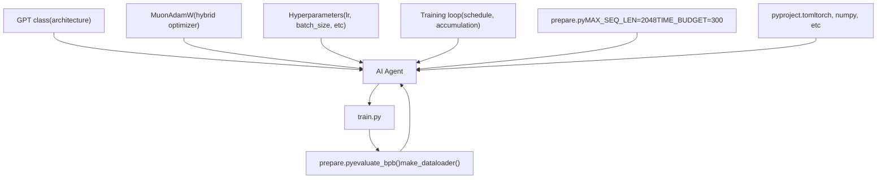
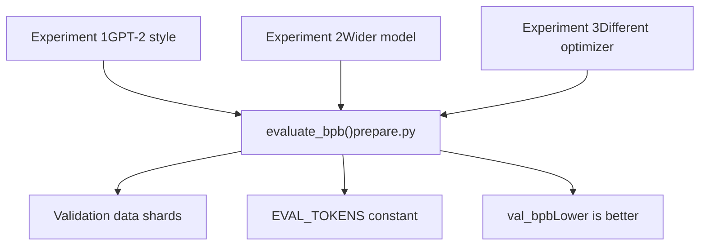
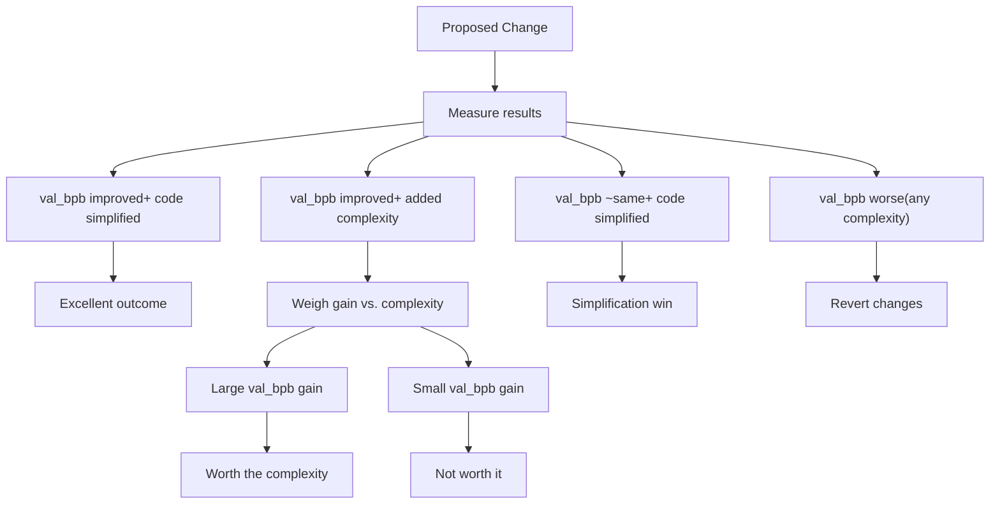

# 关键设计原则

相关源文件

-   [README.md](https://github.com/karpathy/autoresearch/blob/e6d79c12/README.md?plain=1)
-   [program.md](https://github.com/karpathy/autoresearch/blob/e6d79c12/program.md?plain=1)

本文档解释了使 `autoresearch` 能够作为自主研究系统运行的核心设计决策。这些原则定义了**代理可以和不可以修改什么**、**如何公平比较实验**以及**为什么系统采用带有特定约束的架构设计**。

关于整体系统架构与组件交互，请参见 [系统架构](https://github.com/karpathy/autoresearch/blob/e6d79c12/System Architecture) 关于各个组件的细节，请参见 [核心组件](https://github.com/karpathy/autoresearch/blob/e6d79c12/Core Components) 关于这些原则如何影响代理运行，请参见 [代理运行](https://github.com/karpathy/autoresearch/blob/e6d79c12/Agent Operation)

---

## 目的与范围

`autoresearch` 系统建立在**硬约束**与**软指导原则**之上，二者共同支持自主实验，同时保证结果有意义且可比较。其设计理念优先考虑：

1.  在所有实验之间进行**公平比较**。
2.  **无人工干预**的自主运行。
3.  **快速迭代**（每小时多次实验）。
4.  架构与实验跟踪上的**简洁性**。

这些原则在代码库中体现为明确约束，主要记录在 [README.md61-66](https://github.com/karpathy/autoresearch/blob/e6d79c12/README.md?plain=1#L61-L66) 和 [program.md23-38](https://github.com/karpathy/autoresearch/blob/e6d79c12/program.md?plain=1#L23-L38)

来源： [README.md61-66](https://github.com/karpathy/autoresearch/blob/e6d79c12/README.md?plain=1#L61-L66) [program.md23-38](https://github.com/karpathy/autoresearch/blob/e6d79c12/program.md?plain=1#L23-L38)

---

## 单一可修改文件约束

### 设计决策

代理**只能修改** `train.py`。所有其他系统文件均为**只读**。

**可修改：**

-   `train.py` — 模型架构、优化器、超参数、训练循环 [README.md14](https://github.com/karpathy/autoresearch/blob/e6d79c12/README.md?plain=1#L14-L14)

**不可变：**

-   `prepare.py` — 固定常量、数据管线、tokenizer、评估基座 [README.md13](https://github.com/karpathy/autoresearch/blob/e6d79c12/README.md?plain=1#L13-L13)
-   `program.md` — 代理指令 [README.md15](https://github.com/karpathy/autoresearch/blob/e6d79c12/README.md?plain=1#L15-L15)
-   `pyproject.toml` — 依赖锁定 [README.md58](https://github.com/karpathy/autoresearch/blob/e6d79c12/README.md?plain=1#L58-L58)

来源： [README.md11-15](https://github.com/karpathy/autoresearch/blob/e6d79c12/README.md?plain=1#L11-L15) [README.md63](https://github.com/karpathy/autoresearch/blob/e6d79c12/README.md?plain=1#L63-L63) [program.md25-31](https://github.com/karpathy/autoresearch/blob/e6d79c12/program.md?plain=1#L25-L31)

### 设计依据

该约束具有多重作用：

| Benefit | Explanation |
| --- | --- |
| **Manageable diffs** | 变更被限制在单一文件中，使 Git diff 易于审阅 [README.md63](https://github.com/karpathy/autoresearch/blob/e6d79c12/README.md?plain=1#L63-L63) |
| **Clear scope** | 代理能明确知道可触及与不可触及的范围 [program.md25-31](https://github.com/karpathy/autoresearch/blob/e6d79c12/program.md?plain=1#L25-L31) |
| **Stable evaluation** | 评估基座不会被意外修改 [program.md31](https://github.com/karpathy/autoresearch/blob/e6d79c12/program.md?plain=1#L31-L31) |
| **Simple recovery** | 失败实验可通过 `git reset` 轻松回退 [program.md104](https://github.com/karpathy/autoresearch/blob/e6d79c12/program.md?plain=1#L104-L104) |

该约束通过约定执行（记录于 [program.md25-31](https://github.com/karpathy/autoresearch/blob/e6d79c12/program.md?plain=1#L25-L31)），而非通过技术手段强制。系统信任代理遵守规则。

### 自然语言目标到代码实体的映射

来源： [README.md13-15](https://github.com/karpathy/autoresearch/blob/e6d79c12/README.md?plain=1#L13-L15) [program.md25-31](https://github.com/karpathy/autoresearch/blob/e6d79c12/program.md?plain=1#L25-L31)

---

## 固定时间预算

### 设计决策

所有实验都严格训练 **5 分钟**（300 秒）墙钟训练时间，不包含启动与编译时间 [README.md17](https://github.com/karpathy/autoresearch/blob/e6d79c12/README.md?plain=1#L17-L17) 这在基础设施层被定义为常量。

`train.py` 中的训练循环会检查已消耗时间，并在预算耗尽时终止 [README.md64](https://github.com/karpathy/autoresearch/blob/e6d79c12/README.md?plain=1#L64-L64)

来源： [README.md17](https://github.com/karpathy/autoresearch/blob/e6d79c12/README.md?plain=1#L17-L17) [README.md64](https://github.com/karpathy/autoresearch/blob/e6d79c12/README.md?plain=1#L64-L64) [program.md23](https://github.com/karpathy/autoresearch/blob/e6d79c12/program.md?plain=1#L23-L23)

### 这为什么重要

固定时间预算可实现**同类公平比较**：

| Variable | Without Fixed Time | With Fixed Time |
| --- | --- | --- |
| Model size | 更大模型训练更慢 → 步数更少 | 所有模型获得相同时长 → 公平比较 |
| Batch size | 更大批次 → 步数更少 | 所有配置都获得 300 秒 |
| Architecture | 复杂架构会受到惩罚 | 复杂度成本会在时间使用中显式体现 |

在相同时间预算下，能取得更低 `val_bpb` 的模型才是真正更优的模型，而与模型大小、batch 大小或架构复杂度无关 [README.md64](https://github.com/karpathy/autoresearch/blob/e6d79c12/README.md?plain=1#L64-L64)

来源： [README.md64](https://github.com/karpathy/autoresearch/blob/e6d79c12/README.md?plain=1#L64-L64) [program.md33](https://github.com/karpathy/autoresearch/blob/e6d79c12/program.md?plain=1#L33-L33)

### 实现细节

时间预算按**墙钟训练时间**计量：

> **[Mermaid sequence]**
> *(图表结构无法解析)*

来源： [README.md17](https://github.com/karpathy/autoresearch/blob/e6d79c12/README.md?plain=1#L17-L17) [README.md64](https://github.com/karpathy/autoresearch/blob/e6d79c12/README.md?plain=1#L64-L64)

---

## 不可变评估基座

### 设计决策

评估指标 `val_bpb`（验证 bits per byte）由 `prepare.py` 中的 `evaluate_bpb` 函数计算 [README.md13](https://github.com/karpathy/autoresearch/blob/e6d79c12/README.md?plain=1#L13-L13) 该函数**不能被代理修改** [program.md31](https://github.com/karpathy/autoresearch/blob/e6d79c12/program.md?plain=1#L31-L31)

关键属性：

-   使用固定验证数据 [README.md13](https://github.com/karpathy/autoresearch/blob/e6d79c12/README.md?plain=1#L13-L13)
-   指标与词表大小无关 [README.md17](https://github.com/karpathy/autoresearch/blob/e6d79c12/README.md?plain=1#L17-L17)
-   在所有实验中保持一致 [program.md33](https://github.com/karpathy/autoresearch/blob/e6d79c12/program.md?plain=1#L33-L33)

来源： [README.md13](https://github.com/karpathy/autoresearch/blob/e6d79c12/README.md?plain=1#L13-L13) [README.md17](https://github.com/karpathy/autoresearch/blob/e6d79c12/README.md?plain=1#L17-L17) [program.md31](https://github.com/karpathy/autoresearch/blob/e6d79c12/program.md?plain=1#L31-L31)

### 为什么词表大小无关性很重要

BPB（bits per byte）指标的计算方式与词表大小无关，因为它衡量的是模型对**原始字节级数据**的压缩能力，而不是对 token 的预测能力 [README.md17](https://github.com/karpathy/autoresearch/blob/e6d79c12/README.md?plain=1#L17-L17) 这使以下实验成为可能：

| Experiment Type | Why BPB Works |
| --- | --- |
| Change vocab size | 公平比较——指标不会随词表变化而变化 [README.md17](https://github.com/karpathy/autoresearch/blob/e6d79c12/README.md?plain=1#L17-L17) |
| Byte-level model | 可直接与子词模型竞争 |
| Character-level model | 同一指标依然适用 |
| Different tokenizers | 都按相同字节级压缩标准衡量 |

来源： [README.md17](https://github.com/karpathy/autoresearch/blob/e6d79c12/README.md?plain=1#L17-L17) [program.md33](https://github.com/karpathy/autoresearch/blob/e6d79c12/program.md?plain=1#L33-L33)

### 评估一致性

来源： [README.md13](https://github.com/karpathy/autoresearch/blob/e6d79c12/README.md?plain=1#L13-L13) [program.md31](https://github.com/karpathy/autoresearch/blob/e6d79c12/program.md?plain=1#L31-L31)

---

## 简洁性准则

### 设计原则

来自 [program.md37](https://github.com/karpathy/autoresearch/blob/e6d79c12/program.md?plain=1#L37-L37)：

> **Simplicity criterion**: All else being equal, simpler is better. A small improvement that adds ugly complexity is not worth it. Conversely, removing something and getting equal or better results is a great outcome — that's a simplification win.

这是一个**软约束**，用于指导代理决策，但不通过技术手段强制执行。

### 决策矩阵

来源： [program.md37](https://github.com/karpathy/autoresearch/blob/e6d79c12/program.md?plain=1#L37-L37)

---

## 依赖锁定

### 约束

代理**不能安装新包**，也不能修改 `pyproject.toml` [program.md30](https://github.com/karpathy/autoresearch/blob/e6d79c12/program.md?plain=1#L30-L30) 所有实验都必须使用现有依赖集合。

来源： [README.md58](https://github.com/karpathy/autoresearch/blob/e6d79c12/README.md?plain=1#L58-L58) [program.md30](https://github.com/karpathy/autoresearch/blob/e6d79c12/program.md?plain=1#L30-L30)

### 这为什么重要

**可复现性：**

-   所有实验在相同环境中运行。
-   不会出现依赖版本漂移。
-   结果在时间维度上可比较。

**简洁性：**

-   无需额外依赖管理开销 [README.md65](https://github.com/karpathy/autoresearch/blob/e6d79c12/README.md?plain=1#L65-L65)
-   代理可专注于模型改进，而非环境配置。

来源： [README.md65](https://github.com/karpathy/autoresearch/blob/e6d79c12/README.md?plain=1#L65-L65) [program.md30](https://github.com/karpathy/autoresearch/blob/e6d79c12/program.md?plain=1#L30-L30)

---

## 软约束

### VRAM 使用

来自 [program.md35](https://github.com/karpathy/autoresearch/blob/e6d79c12/program.md?plain=1#L35-L35)：

> **VRAM** is a soft constraint. Some increase is acceptable for meaningful val\_bpb gains, but it should not blow up dramatically.

该项会被监控但不会被严格强制。系统在 `results.tsv` 中记录指标 `peak_vram_mb` 以跟踪内存使用 [program.md76](https://github.com/karpathy/autoresearch/blob/e6d79c12/program.md?plain=1#L76-L76)

来源： [program.md35](https://github.com/karpathy/autoresearch/blob/e6d79c12/program.md?plain=1#L35-L35) [program.md76](https://github.com/karpathy/autoresearch/blob/e6d79c12/program.md?plain=1#L76-L76)

### 崩溃处理

来自 [program.md110](https://github.com/karpathy/autoresearch/blob/e6d79c12/program.md?plain=1#L110-L110)：

> If a run crashes (OOM, or a bug, or etc.), use your judgment: If it's something dumb and easy to fix (e.g. a typo, a missing import), fix it and re-run. If the idea itself is fundamentally broken, just skip it, log "crash" as the status in the tsv, and move on.

崩溃属于**软失败**：

-   简单 bug（拼写、导入）→ 修复并重试。
-   根本性问题（OOM、架构问题）→ 记录并跳过。
-   在 `results.tsv` 中记录为 `status=crash` [program.md77](https://github.com/karpathy/autoresearch/blob/e6d79c12/program.md?plain=1#L77-L77)

来源： [program.md110](https://github.com/karpathy/autoresearch/blob/e6d79c12/program.md?plain=1#L110-L110) [program.md77](https://github.com/karpathy/autoresearch/blob/e6d79c12/program.md?plain=1#L77-L77)

---

## 设计原则总结

### 核心权衡

系统以**灵活性换取有效性**：

**你牺牲了什么：**

-   不能修改评估逻辑 [program.md31](https://github.com/karpathy/autoresearch/blob/e6d79c12/program.md?plain=1#L31-L31)
-   不能更改时间预算 [program.md23](https://github.com/karpathy/autoresearch/blob/e6d79c12/program.md?plain=1#L23-L23)
-   不能安装新包 [program.md30](https://github.com/karpathy/autoresearch/blob/e6d79c12/program.md?plain=1#L30-L30)
-   不能修改多个文件 [program.md26](https://github.com/karpathy/autoresearch/blob/e6d79c12/program.md?plain=1#L26-L26)

**你获得了什么：**

-   所有结果都可比较 [README.md64](https://github.com/karpathy/autoresearch/blob/e6d79c12/README.md?plain=1#L64-L64)
-   无评估作弊。
-   清晰的实验历史 [program.md103-104](https://github.com/karpathy/autoresearch/blob/e6d79c12/program.md?plain=1#L103-L104)
-   快速迭代（约 12 次实验/小时） [README.md64](https://github.com/karpathy/autoresearch/blob/e6d79c12/README.md?plain=1#L64-L64)
-   可复现研究。

这种设计确保 `val_bpb` 的提升代表的是**真实模型改进**，而不是评估不一致或比较不公平造成的伪提升。

来源： [README.md61-66](https://github.com/karpathy/autoresearch/blob/e6d79c12/README.md?plain=1#L61-L66) [program.md23-38](https://github.com/karpathy/autoresearch/blob/e6d79c12/program.md?plain=1#L23-L38)
