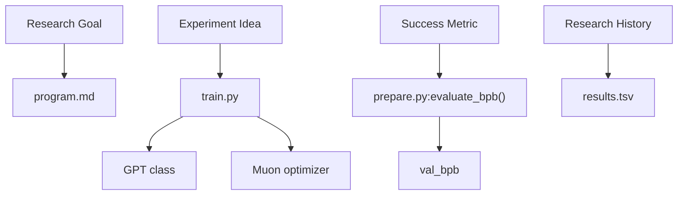
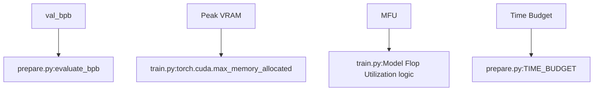

# 术语表

相关源文件

-   [README.md](https://github.com/karpathy/autoresearch/blob/e6d79c12/README.md?plain=1)
-   [analysis.ipynb](https://github.com/karpathy/autoresearch/blob/e6d79c12/analysis.ipynb)
-   [prepare.py](https://github.com/karpathy/autoresearch/blob/e6d79c12/prepare.py)
-   [program.md](https://github.com/karpathy/autoresearch/blob/e6d79c12/program.md?plain=1)
-   [pyproject.toml](https://github.com/karpathy/autoresearch/blob/e6d79c12/pyproject.toml)
-   [train.py](https://github.com/karpathy/autoresearch/blob/e6d79c12/train.py)

本页提供 `autoresearch` 代码库中专用术语、定量指标和架构概念的高层概览。它在自然语言研究目标与底层 Python 实现之间起到桥接作用。

## 研究环境概览

`autoresearch` 系统以自主循环方式运行：AI 代理修改训练脚本、执行脚本，并基于一组固定标准决定保留或舍弃改动。

### 系统交互图

该图展示高层研究概念如何映射到代码库中的具体文件和函数。

**自然语言到代码实体空间**

来源： [README.md11-17](https://github.com/karpathy/autoresearch/blob/e6d79c12/README.md?plain=1#L11-L17) [program.md21-33](https://github.com/karpathy/autoresearch/blob/e6d79c12/program.md?plain=1#L21-L33) [prepare.py231-255](https://github.com/karpathy/autoresearch/blob/e6d79c12/prepare.py#L231-L255)

---

## 指标与优化术语

定量评估是自主决策流程的核心。系统依赖单一真实基准指标和一组性能指示器来判断架构改动是否有益。

-   **val\_bpb**：验证集每字节比特数（Validation Bits Per Byte）。主成功指标。它衡量模型压缩验证数据的效率，且独立于词表大小。
-   **Frontier**：代表当前最佳性能的一组实验。就 Git 而言，这是活跃研究分支的头部。
-   **Keep Rate**：成功提升模型并被合并到主研究线的实验百分比。
-   **Time Budget**：严格执行的 5 分钟墙钟训练上限，确保改进是在固定计算窗口内按效率衡量。

关于这些术语的详细定义及其数学基础，请参见 **[Metrics and Optimization Terms](/karpathy/autoresearch/10.1-metrics-and-optimization-terms)**。

### 性能追踪映射

**指标空间到代码实现**

来源： [prepare.py30-32](https://github.com/karpathy/autoresearch/blob/e6d79c12/prepare.py#L30-L32) [train.py446-455](https://github.com/karpathy/autoresearch/blob/e6d79c12/train.py#L446-L455) [analysis.ipynb75-78](https://github.com/karpathy/autoresearch/blob/e6d79c12/analysis.ipynb#L75-L78)

---

## 架构与系统术语

`autoresearch` 代码库采用现代 Transformer 架构，并包含若干为单 GPU 高效率训练设计的非常规组件。

-   **Muon**：用于内部矩阵参数的专用优化器，通常与 AdamW 搭配用于其他权重。
-   **ResFormer / Value Embedding**：一种架构特性，其中 value 与输入相关门控混合，常见于 `CausalSelfAttention` 类。
-   **Window Pattern**：注意力掩码配置（例如 “SSSL” 表示 Sliding/Sliding/Sliding/Long），用于规定某层可关注多少历史 token。
-   **Simplicity Criterion**：代理使用的一种启发式规则，当性能增益边际时偏向更短、更干净的代码。
-   **Agent Lifecycle**：一次实验经历的状态转换：`commit` -> `run` -> `extract` -> `keep`/`discard`/`crash`。

如需深入了解 Transformer 实现以及 `program.md` 中使用的具体研究术语，请参见 **[Architecture and System Terms](/karpathy/autoresearch/10.2-architecture-and-system-terms)**。

### 架构组件参考

| 术语 | 代码指针 | 角色 |
| --- | --- | --- |
| **Muon** | `train.py:330-380` (approx) | 正交矩阵更新优化器 |
| **RoPE** | `train.py:183-200` | 旋转位置嵌入 |
| **Window Pattern** | `train.py:33-40` | `GPTConfig` 中的注意力跨度配置 |
| **Best-fit Packing** | `prepare.py:210-230` | 用于最小化 padding token 的数据加载器逻辑 |
| **BPE** | `prepare.py:141-160` | 通过 `rustbpe` 实现的字节对编码 |

来源： [train.py33-40](https://github.com/karpathy/autoresearch/blob/e6d79c12/train.py#L33-L40) [train.py183-200](https://github.com/karpathy/autoresearch/blob/e6d79c12/train.py#L183-L200) [prepare.py141-160](https://github.com/karpathy/autoresearch/blob/e6d79c12/prepare.py#L141-L160) [program.md37-40](https://github.com/karpathy/autoresearch/blob/e6d79c12/program.md?plain=1#L37-L40)
