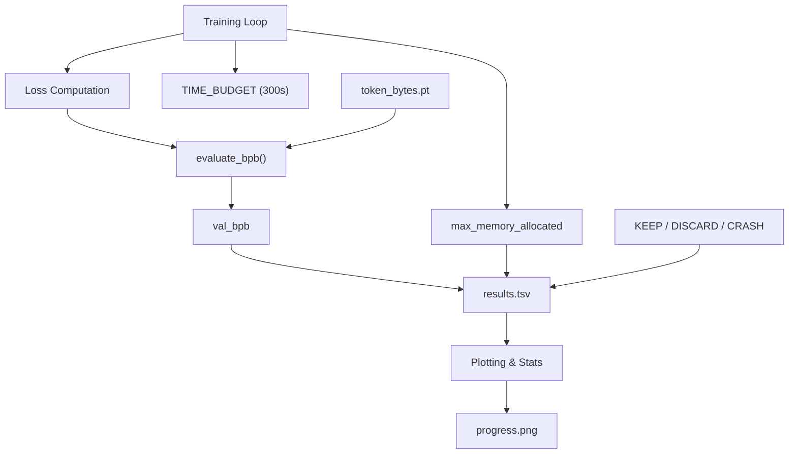
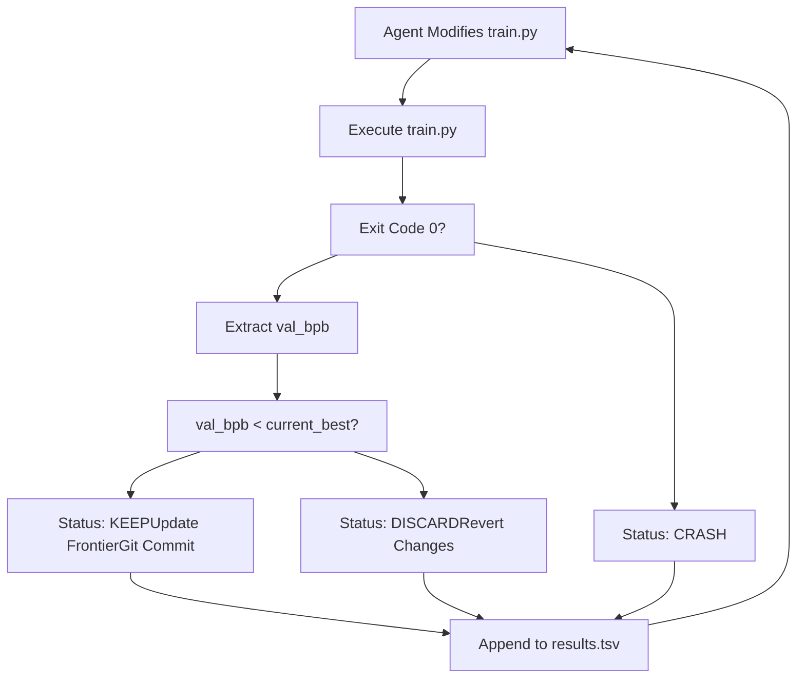

# 指标与优化术语

相关源文件

-   [analysis.ipynb](https://github.com/karpathy/autoresearch/blob/e6d79c12/analysis.ipynb)
-   [prepare.py](https://github.com/karpathy/autoresearch/blob/e6d79c12/prepare.py)
-   [train.py](https://github.com/karpathy/autoresearch/blob/e6d79c12/train.py)

本页定义了 `autoresearch` 系统中使用的定量指标与优化术语。这些术语决定自主代理如何评估架构改动、管理实验生命周期并跟踪长期进展。

## 核心性能指标

系统依赖单一主目标函数（`val_bpb`），并受严格时间预算约束。

### 验证集每字节比特数（val\_bpb）

`val_bpb` 是衡量模型性能的主指标。与依赖分词器具体词表大小的标准交叉熵损失不同，BPB 提供了与词表无关的压缩质量度量。

-   **实现方式**：先获取总评估损失（交叉熵求和），使用 `1/log(2)` 转换为以 2 为底（bits），再除以评估集原始 UTF-8 字节总数 [prepare.py228-232](https://github.com/karpathy/autoresearch/blob/e6d79c12/prepare.py#L228-L232)
-   **意义**：更低的 `val_bpb` 表示模型更高效，能以更高确定性预测数据。
-   **数据流**：`prepare.py` 中的 `evaluate_bpb` 函数使用预先计算的 `token_bytes` 张量（将 token ID 映射到其 UTF-8 字节长度），以确保不同模型运行时分母保持常量 [prepare.py210-234](https://github.com/karpathy/autoresearch/blob/e6d79c12/prepare.py#L210-L234)

### 模型 FLOPs 利用率（MFU）

MFU 衡量训练实现相对于硬件理论峰值性能的效率。

-   **计算方式**：估算每秒执行的浮点运算数（基于参数量、序列长度和批大小），再除以 GPU 理论峰值 bfloat16/float16 FLOPS [train.py461-470](https://github.com/karpathy/autoresearch/blob/e6d79c12/train.py#L461-L470)
-   **用途**：虽不是优化目标，但较高 MFU 通常表示架构改动具备较高硬件效率。

### 显存使用（peak\_vram\_mb）

系统跟踪 5 分钟运行期间分配的最大 GPU 显存。

-   **实现方式**：通过 `torch.cuda.max_memory_allocated()` 跟踪 [train.py476](https://github.com/karpathy/autoresearch/blob/e6d79c12/train.py#L476-L476)
-   **约束**：若实验超过可用 VRAM，则结果状态为 `CRASH` [analysis.ipynb48](https://github.com/karpathy/autoresearch/blob/e6d79c12/analysis.ipynb#L48-L48)

---

## 优化与追踪术语

以下术语描述系统如何管理“研究循环”并记录结果。

### Frontier 与 Running Min

**Frontier** 表示针对特定 `program.md` 目标的当前最优水平（SOTA）。

-   **running\_min**：在 `analysis.ipynb` 中，这是所有 `KEEP` 实验 `val_bpb` 的累计最小值 [analysis.ipynb112](https://github.com/karpathy/autoresearch/blob/e6d79c12/analysis.ipynb#L112-L112)
-   **可视化表示**：在 `progress.png` 中，frontier 以阶梯线形式呈现，连接迄今找到的最佳实验 [analysis.ipynb113-115](https://github.com/karpathy/autoresearch/blob/e6d79c12/analysis.ipynb#L113-L115)

### Baseline BPB

`baseline_bpb` 是代理尚未修改前初始 `train.py` 的性能。每个新实验都会与当前“最佳” `val_bpb` 对比，以决定是否应合并到主研究分支。

### Delta

实验相对于上一个成功实验的改进（或退化）幅度。

-   **计算方式**：`delta = prev_bpb - current_bpb` [analysis.ipynb200](https://github.com/karpathy/autoresearch/blob/e6d79c12/analysis.ipynb#L200-L200)
-   **意义**：正 delta 表示改进，足以支持 `KEEP` 决策。

### Keep Rate

成功架构改进数占全部有效（未崩溃）尝试数的比例。

-   **公式**：`n_keep / (n_keep + n_discard)` [analysis.ipynb51](https://github.com/karpathy/autoresearch/blob/e6d79c12/analysis.ipynb#L51-L51)
-   **语境**：该指标反映代理提案逻辑的“智能度”或效率。

---

## 数据流与指标提取

下图展示原始训练数据如何转换为存储在 `results.tsv` 中的指标。

### 指标生成架构

标题：“Metric Extraction and Logging Flow”

**来源：** [prepare.py210-234](https://github.com/karpathy/autoresearch/blob/e6d79c12/prepare.py#L210-L234) [train.py470-485](https://github.com/karpathy/autoresearch/blob/e6d79c12/train.py#L470-L485) [analysis.ipynb25-32](https://github.com/karpathy/autoresearch/blob/e6d79c12/analysis.ipynb#L25-L32)

---

## 定量约束汇总

| 术语 | 值 / 实现 | 文件引用 |
| --- | --- | --- |
| **Time Budget** | 300 秒（5 分钟） | [prepare.py31](https://github.com/karpathy/autoresearch/blob/e6d79c12/prepare.py#L31-L31) |
| **Eval Tokens** | 20,971,520 tokens (40 \* 524,288) | [prepare.py32](https://github.com/karpathy/autoresearch/blob/e6d79c12/prepare.py#L32-L32) |
| **Sequence Len** | 2048 | [prepare.py30](https://github.com/karpathy/autoresearch/blob/e6d79c12/prepare.py#L30-L30) |
| **Vocab Size** | 8192（默认） | [prepare.py45](https://github.com/karpathy/autoresearch/blob/e6d79c12/prepare.py#L45-L45) |
| **Status Types** | `KEEP`, `DISCARD`, `CRASH` | [analysis.ipynb28](https://github.com/karpathy/autoresearch/blob/e6d79c12/analysis.ipynb#L28-L28) |

### 系统逻辑图

标题：“Decision Logic for Experiment Retention”

**来源：** [analysis.ipynb42-51](https://github.com/karpathy/autoresearch/blob/e6d79c12/analysis.ipynb#L42-L51) [analysis.ipynb108-115](https://github.com/karpathy/autoresearch/blob/e6d79c12/analysis.ipynb#L108-L115) [analysis.ipynb198-200](https://github.com/karpathy/autoresearch/blob/e6d79c12/analysis.ipynb#L198-L200)

---

**来源：**

-   指标定义与评估逻辑： [prepare.py26-52](https://github.com/karpathy/autoresearch/blob/e6d79c12/prepare.py#L26-L52) [prepare.py210-234](https://github.com/karpathy/autoresearch/blob/e6d79c12/prepare.py#L210-L234)
-   硬件指标（MFU、VRAM）： [train.py461-478](https://github.com/karpathy/autoresearch/blob/e6d79c12/train.py#L461-L478)
-   结果处理与可视化： [analysis.ipynb20-52](https://github.com/karpathy/autoresearch/blob/e6d79c12/analysis.ipynb#L20-L52) [analysis.ipynb87-143](https://github.com/karpathy/autoresearch/blob/e6d79c12/analysis.ipynb#L87-L143) [analysis.ipynb198-200](https://github.com/karpathy/autoresearch/blob/e6d79c12/analysis.ipynb#L198-L200)
