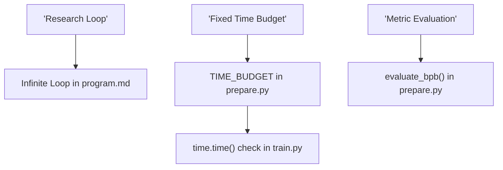
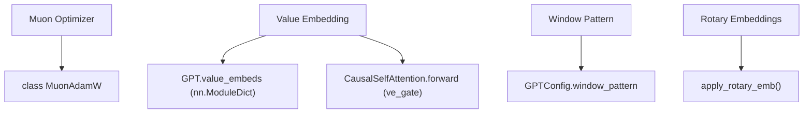

# 架构与系统术语

相关源文件

-   [.gitignore](https://github.com/karpathy/autoresearch/blob/e6d79c12/.gitignore)
-   [prepare.py](https://github.com/karpathy/autoresearch/blob/e6d79c12/prepare.py)
-   [program.md](https://github.com/karpathy/autoresearch/blob/e6d79c12/program.md?plain=1)
-   [train.py](https://github.com/karpathy/autoresearch/blob/e6d79c12/train.py)

本页定义了 `autoresearch` 代码库中使用的具体架构概念、算法和系统级术语。它作为技术参考，用于理解 `train.py` 中的模型组件与 `prepare.py` 中的基础设施约束。

## 模型架构术语

`autoresearch` 模型是一个专门化 GPT 变体，针对固定时间预算内的快速收敛进行了优化。

### Muon / NorMuon

**Muon**（Momentum Update Orthogonalization）是用于所有二维内部权重矩阵的主优化器。在 `MuonAdamW` 类中，它会对更新执行正交化步骤，已被证明可提升 Transformer 模型的收敛速度。**NorMuon** 指 Muon 与 Query/Key 向量上的 `F.rms_norm`（QK-Norm）结合使用的特定配置，以稳定 Muon 支持的高学习率。

-   **实现方式**：`MuonAdamW` 负责参数分组。它对 `ndim == 2` 的参数应用 Muon，对其余所有参数（向量/标量）应用 AdamW。
-   **关键逻辑**：优化器使用 Newton-Schulz 迭代对更新进行正交化。

来源： [train.py255-309](https://github.com/karpathy/autoresearch/blob/e6d79c12/train.py#L255-L309) [train.py311-356](https://github.com/karpathy/autoresearch/blob/e6d79c12/train.py#L311-L356)

### ResFormer 与 Value Embedding

该架构采用“Value Embedding”（VE）策略，在代码库语境中有时称为 **ResFormer** 风格残差。不同于标准 Transformer 中 value（$V$）仅由隐藏态导出，VE 允许模型基于当前 token 直接从嵌入表查找 value，并将其混入注意力机制。

-   **数据流**：`GPT` 类将 `value_embeds` 初始化为 `nn.ModuleDict`。在 `CausalSelfAttention.forward` 中，若某层存在 value embedding，则会取回该嵌入，并通过输入相关的 `ve_gate` 与投影得到的 $V$ 混合。
-   **交替层**：VE 不会应用于每一层。函数 `has_ve` 决定哪些层接收该机制（通常为交替层）。

来源： [train.py47-50](https://github.com/karpathy/autoresearch/blob/e6d79c12/train.py#L47-L50) [train.py74-88](https://github.com/karpathy/autoresearch/blob/e6d79c12/train.py#L74-L88) [train.py139-142](https://github.com/karpathy/autoresearch/blob/e6d79c12/train.py#L139-L142)

### Window Pattern

`window_pattern` 定义每层的注意力跨度。它是一个字符串（例如 `"SSSL"`），其中 'S' 表示“Sliding”（局部注意力），'L' 表示“Long”（全上下文注意力）。

-   **实现方式**：`_compute_window_sizes` 将该字符串转换为整数数组。`S` 映射为固定窗口（例如 128），`L` 映射为 -1（无限/全上下文）。
-   **执行**：这些窗口大小会传递给 Flash Attention 内核（`fa3.flash_attn_func`）。

来源： [train.py40-41](https://github.com/karpathy/autoresearch/blob/e6d79c12/train.py#L40-L41) [train.py93](https://github.com/karpathy/autoresearch/blob/e6d79c12/train.py#L93-L93) [train.py204-210](https://github.com/karpathy/autoresearch/blob/e6d79c12/train.py#L204-L210)

### RoPE（旋转位置嵌入）

模型使用旋转位置嵌入来编码序列顺序。

-   **预计算**：`GPT` 类在初始化时预计算 `cos` 和 `sin` 缓冲区。
-   **应用**：`apply_rotary_emb` 函数在计算注意力分数前旋转 Query 与 Key 表示。

来源： [train.py52-58](https://github.com/karpathy/autoresearch/blob/e6d79c12/train.py#L52-L58) [train.py183-202](https://github.com/karpathy/autoresearch/blob/e6d79c12/train.py#L183-L202)

### Softcap

Softcapping 是一种通过缩放后的 `tanh` 函数抑制 logits 或注意力分数爆炸的技术。在默认 `train.py` 中，它应用于最终输出 logits。

-   **实现方式**：在计算损失前应用 `(torch.tanh(logits / 30.0) * 30.0)`。

来源： [train.py228](https://github.com/karpathy/autoresearch/blob/e6d79c12/train.py#L228-L228)

## 系统与基础设施术语

### ASPECT\_RATIO

在 `MuonAdamW` 优化器语境中，`ASPECT_RATIO` 指隐藏维度与头数或其他架构维度之间的比值。优化器使用该值对不同参数组学习率进行缩放，以确保不同层形状下更新稳定。

来源： [train.py328-332](https://github.com/karpathy/autoresearch/blob/e6d79c12/train.py#L328-L332)

### Best-fit Packing

为最大化效率并避免在 padding 上浪费 token，系统在数据加载器中使用 **best-fit packing** 算法。

-   **逻辑**：将多个文档打包进单个 `MAX_SEQ_LEN`（2048）序列。
-   **BOS 对齐**：每个 pack 内的新文档前都添加 `BOS_TOKEN`（`<|reserved_0|>`）。

来源： [prepare.py30](https://github.com/karpathy/autoresearch/blob/e6d79c12/prepare.py#L30-L30) [prepare.py51](https://github.com/karpathy/autoresearch/blob/e6d79c12/prepare.py#L51-L51) [prepare.py221-255](https://github.com/karpathy/autoresearch/blob/e6d79c12/prepare.py#L221-L255)

### BPE 与 rustbpe

系统使用字节对编码（BPE）。

-   **rustbpe**：用于在 `climbmix` 数据集上训练分词器的高性能库。
-   **tiktoken**：将训练得到的 merges 包装为 `tiktoken.Encoding` 对象，以实现高效推理时分词。

来源： [prepare.py22-23](https://github.com/karpathy/autoresearch/blob/e6d79c12/prepare.py#L22-L23) [prepare.py161-175](https://github.com/karpathy/autoresearch/blob/e6d79c12/prepare.py#L161-L175)

### Time Budget

`autoresearch` 系统的核心约束。每次训练运行都被硬性限制为 **5 分钟**（300 秒）墙钟时间。这确保所有架构改动依据其快速学习能力进行评估，而不仅是最终收敛点。

来源： [program.md23](https://github.com/karpathy/autoresearch/blob/e6d79c12/program.md?plain=1#L23-L23) [prepare.py31](https://github.com/karpathy/autoresearch/blob/e6d79c12/prepare.py#L31-L31)

### Simplicity Criterion

代理用于决定是否 `keep` 某项改动的定性启发式规则。若架构改动带来可忽略提升却显著增加代码复杂度，则会被舍弃。相反，能保持性能的代码简化会被高度重视。

来源： [program.md37-38](https://github.com/karpathy/autoresearch/blob/e6d79c12/program.md?plain=1#L37-L38)

## 代理生命周期术语

代理通过 `results.tsv` 文件中反映的特定状态机管理实验。

| 术语 | 定义 | 代码/系统关联 |
| --- | --- | --- |
| **keep** | 实验提升了 `val_bpb`。改动被提交到主研究分支。 | `results.tsv` 中的 `status` 列 |
| **discard** | 实验未提升 `val_bpb` 或过于复杂。代理执行 `git reset --hard`。 | `results.tsv` 中的 `status` 列 |
| **crash** | 代码执行失败（如 OOM、SyntaxError）。代理尝试修复或继续下一轮。 | `results.tsv` 中的 `val_bpb: 0.000000` |

来源： [program.md71-89](https://github.com/karpathy/autoresearch/blob/e6d79c12/program.md?plain=1#L71-L89) [program.md102-110](https://github.com/karpathy/autoresearch/blob/e6d79c12/program.md?plain=1#L102-L110)

## 架构映射

### 自然语言到代码实体空间：训练循环

该图将高层研究循环概念映射到实现它们的具体函数和文件。

来源： [program.md94-106](https://github.com/karpathy/autoresearch/blob/e6d79c12/program.md?plain=1#L94-L106) [prepare.py31](https://github.com/karpathy/autoresearch/blob/e6d79c12/prepare.py#L31-L31) [train.py440-445](https://github.com/karpathy/autoresearch/blob/e6d79c12/train.py#L440-L445) [prepare.py257-285](https://github.com/karpathy/autoresearch/blob/e6d79c12/prepare.py#L257-L285)

### 自然语言到代码实体空间：模型组件

该图将架构术语映射到 `train.py` 中对应的类和变量定义。

来源： [train.py255-309](https://github.com/karpathy/autoresearch/blob/e6d79c12/train.py#L255-L309) [train.py139-142](https://github.com/karpathy/autoresearch/blob/e6d79c12/train.py#L139-L142) [train.py74-88](https://github.com/karpathy/autoresearch/blob/e6d79c12/train.py#L74-L88) [train.py40-41](https://github.com/karpathy/autoresearch/blob/e6d79c12/train.py#L40-L41) [train.py52-58](https://github.com/karpathy/autoresearch/blob/e6d79c12/train.py#L52-L58)
