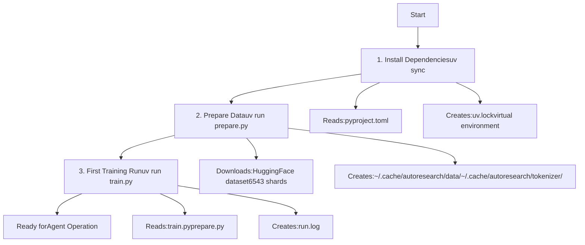
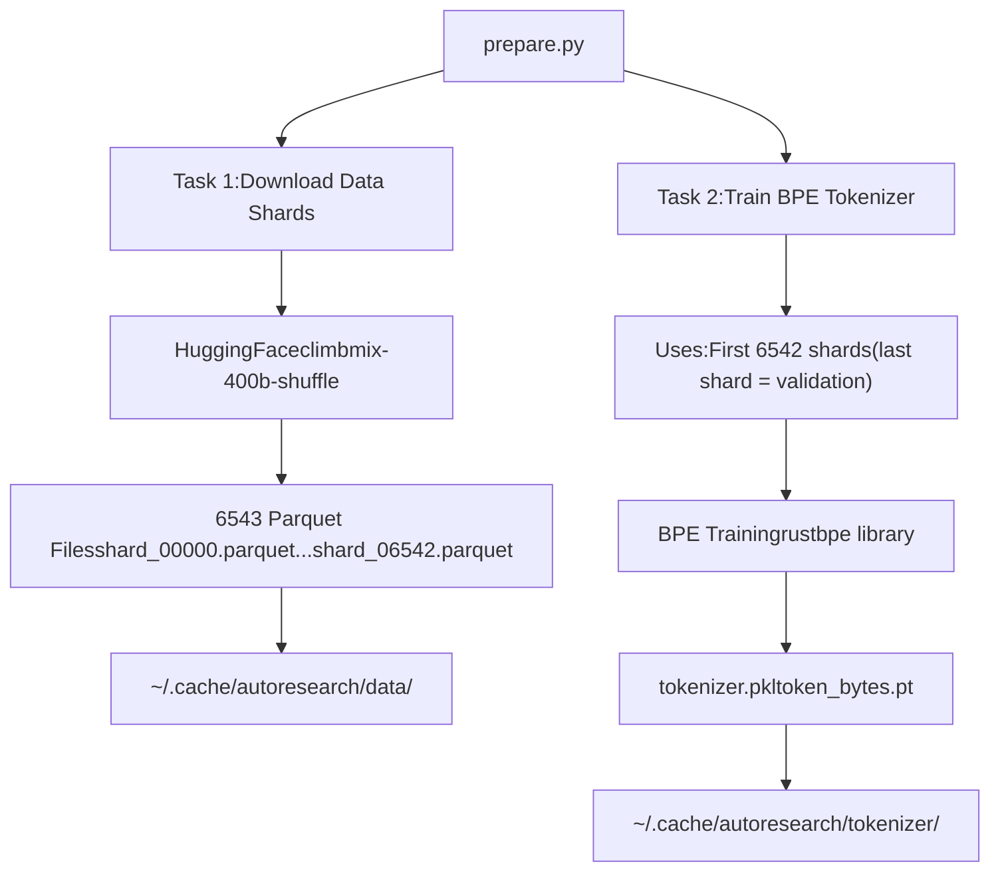
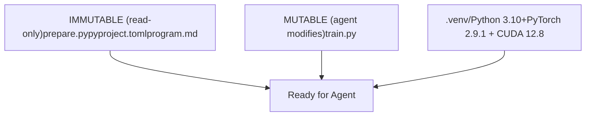

# 快速开始

相关源文件

-   [.python-version](https://github.com/karpathy/autoresearch/blob/e6d79c12/.python-version)
-   [README.md](https://github.com/karpathy/autoresearch/blob/e6d79c12/README.md?plain=1)
-   [pyproject.toml](https://github.com/karpathy/autoresearch/blob/e6d79c12/pyproject.toml)

本指南提供搭建 autoresearch 环境并运行首个训练实验的分步说明。内容涵盖依赖安装、数据与 tokenizer 准备，以及执行首次训练以验证系统是否正常工作。

关于系统架构与设计原则，请参见 [Autoresearch 概览](/karpathy/autoresearch/1-autoresearch-overview)。关于各组件的详细文档，请参见 [核心组件](/karpathy/autoresearch/3-core-components)。关于 AI 代理如何自主运行的信息，请参见 [代理运行](/karpathy/autoresearch/4-agent-operation)。

---

## 前置条件

开始之前，请确保具备以下条件：

| Requirement | Specification | Notes |
| --- | --- | --- |
| **Hardware** | 单张 NVIDIA GPU | 在 H100 上测试；其他 GPU 也可能可用，但需要 VRAM ≥40GB |
| **Operating System** | Linux | 需要支持 CUDA 的环境 |
| **Python** | 3.10 或更高 | 见 [.python-version1](https://github.com/karpathy/autoresearch/blob/e6d79c12/.python-version#L1-L1) |
| **Package Manager** | [uv](https://docs.astral.sh/uv/) | Astral 的高性能 Python 包管理器 |
| **Git** | 任意较新版本 | 用于版本控制与代理分支管理 |

该系统设计为自包含，不需要分布式训练基础设施或复杂配置文件。

**来源：** [README.md23](https://github.com/karpathy/autoresearch/blob/e6d79c12/README.md?plain=1#L23-L23) [pyproject.toml6](https://github.com/karpathy/autoresearch/blob/e6d79c12/pyproject.toml#L6-L6) [.python-version1](https://github.com/karpathy/autoresearch/blob/e6d79c12/.python-version#L1-L1)

---

## 安装流程概览

安装流程由三个主要阶段组成，每个阶段对应一条命令：

**图示：完整安装流程**


每个阶段都必须按顺序完成。前两个阶段（`uv sync` 和 `uv run prepare.py`）是一次性操作，而第三阶段（`uv run train.py`）会在每次实验时执行。

**来源：** [README.md27-38](https://github.com/karpathy/autoresearch/blob/e6d79c12/README.md?plain=1#L27-L38)

---

## 阶段 1：安装依赖

### 步骤 1.1：安装 uv 包管理器

如果尚未安装 `uv`，请按[官方说明](https://docs.astral.sh/uv/getting-started/installation/)安装：

```
curl -LsSf https://astral.sh/uv/install.sh | sh
```
### 步骤 1.2：同步依赖

在仓库根目录执行：

```
uv sync
```
该命令将：

-   从 [pyproject.toml](https://github.com/karpathy/autoresearch/blob/e6d79c12/pyproject.toml) 读取依赖声明
-   创建虚拟环境（通常为 `.venv/`）
-   安装所有所需包及其精确版本
-   生成 `uv.lock` 以实现可复现构建

### 依赖详情

[
pyproject.toml7-17](https://github.com/karpathy/autoresearch/blob/e6d79c12/pyproject.toml#L7-L17) 文件声明了以下关键依赖：

| Package | Version | Purpose |
| --- | --- | --- |
| `torch` | 2.9.1 | PyTorch 深度学习框架 |
| `rustbpe` | ≥0.1.0 | 高速 BPE tokenizer 训练 |
| `tiktoken` | ≥0.11.0 | tokenizer 编码工具 |
| `numpy` | ≥2.2.6 | 数值计算 |
| `pandas` | ≥2.3.3 | 数据处理（用于结果分析） |
| `matplotlib` | ≥3.10.8 | 可视化（用于分析 notebook） |
| `kernels` | ≥0.11.7 | 自定义 CUDA kernel |

PyTorch 会从 `pytorch-cu128` 索引专门拉取（[pyproject.toml19-27](https://github.com/karpathy/autoresearch/blob/e6d79c12/pyproject.toml#L19-L27)），以确保 CUDA 12.8 兼容性。

### 验证

`uv sync` 完成后，验证安装：

```
uv run python -c "import torch; print(f'PyTorch {torch.__version__}, CUDA available: {torch.cuda.is_available()}')"
```
预期输出：

```
PyTorch 2.9.1, CUDA available: True
```
**来源：** [README.md27-31](https://github.com/karpathy/autoresearch/blob/e6d79c12/README.md?plain=1#L27-L31) [pyproject.toml1-28](https://github.com/karpathy/autoresearch/blob/e6d79c12/pyproject.toml#L1-L28)

---

## 阶段 2：数据准备

### 步骤 2.1：运行 prepare.py

执行数据准备脚本：

```
uv run prepare.py
```
这是一个**一次性操作**，大约耗时 2 分钟（[README.md33](https://github.com/karpathy/autoresearch/blob/e6d79c12/README.md?plain=1#L33-L33)）。它会完成两个关键任务：

1.  从 HuggingFace 下载训练数据（`climbmix-400b-shuffle` 数据集）
2.  在下载数据上训练 BPE tokenizer

**图示：数据准备管线**


### 为什么这一步至关重要

数据准备会创建所有实验共享的**不可变工件**：

-   **固定数据划分**：由 `prepare.py` 工具管理（[README.md13](https://github.com/karpathy/autoresearch/blob/e6d79c12/README.md?plain=1#L13-L13)）。
-   **固定 tokenizer**：所有实验使用相同词表与编码。
-   **固定评估**：`prepare.py` 中的 `evaluate_bpb()` 使用这些工件。

这保证了实验间性能差异反映真实模型改进，而非评估不一致。更多细节见 [公平比较理念](/karpathy/autoresearch/5.3-fair-comparison-philosophy)。

**来源：** [README.md13](https://github.com/karpathy/autoresearch/blob/e6d79c12/README.md?plain=1#L13-L13) [README.md33-34](https://github.com/karpathy/autoresearch/blob/e6d79c12/README.md?plain=1#L33-L34)

---

## 阶段 3：运行你的第一个实验

### 步骤 3.1：执行 train.py

运行一次训练实验：

```
uv run train.py
```
该命令将：

1.  从缓存加载已训练 tokenizer。
2.  使用默认架构初始化 GPT 模型。
3.  精确训练 **5 分钟**（[README.md17](https://github.com/karpathy/autoresearch/blob/e6d79c12/README.md?plain=1#L17-L17)）。
4.  使用 `prepare.py` 中的 `evaluate_bpb()` 评估性能。
5.  将结果写入 `run.log`。

**图示：首次训练执行流程**

### 预期行为

-   **训练时长**：固定 5 分钟墙钟预算，不含启动/编译（[README.md17](https://github.com/karpathy/autoresearch/blob/e6d79c12/README.md?plain=1#L17-L17)）。
-   **指标**：**val\_bpb**（验证 bits per byte）——越低越好（[README.md17](https://github.com/karpathy/autoresearch/blob/e6d79c12/README.md?plain=1#L17-L17)）。
-   **VRAM**：峰值 VRAM 作为软约束被跟踪（[README.md64](https://github.com/karpathy/autoresearch/blob/e6d79c12/README.md?plain=1#L64-L64)）。

### 验证清单

首次训练后，请确认：

-   ✅ `run.log` 已生成且包含指标。
-   ✅ 已输出 `val_bpb`。
-   ✅ 训练大约在 5 分钟内完成（不含启动时间）。
-   ✅ 无 CUDA 内存不足错误。

**来源：** [README.md17](https://github.com/karpathy/autoresearch/blob/e6d79c12/README.md?plain=1#L17-L17) [README.md36-38](https://github.com/karpathy/autoresearch/blob/e6d79c12/README.md?plain=1#L36-L38) [README.md63-66](https://github.com/karpathy/autoresearch/blob/e6d79c12/README.md?plain=1#L63-L66)

---

## 安装完成后的系统状态

当三个阶段均完成后，你的系统即可进入代理自主运行状态：

**图示：完整安装后的系统状态**


**来源：** [README.md53-59](https://github.com/karpathy/autoresearch/blob/e6d79c12/README.md?plain=1#L53-L59)

---

## 后续步骤

安装完成后，你可以继续：

1.  **审阅 program.md**：理解提供给代理的基线指令（[README.md15](https://github.com/karpathy/autoresearch/blob/e6d79c12/README.md?plain=1#L15-L15)）。
2.  **启动自主研究循环**：指示 AI 代理（Claude/Codex）读取 `program.md` 并开始实验（[README.md42-48](https://github.com/karpathy/autoresearch/blob/e6d79c12/README.md?plain=1#L42-L48)）。

有关这些步骤的详细指导，请参见 [运行你的第一个实验](/karpathy/autoresearch/2.3-running-your-first-experiment)。

**来源：** [README.md15](https://github.com/karpathy/autoresearch/blob/e6d79c12/README.md?plain=1#L15-L15) [README.md42-48](https://github.com/karpathy/autoresearch/blob/e6d79c12/README.md?plain=1#L42-L48)
