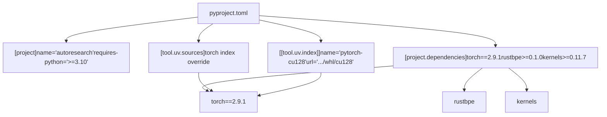

# 安装与依赖

相关源文件

-   [.python-version](https://github.com/karpathy/autoresearch/blob/e6d79c12/.python-version)
-   [pyproject.toml](https://github.com/karpathy/autoresearch/blob/e6d79c12/pyproject.toml)
-   [uv.lock](https://github.com/karpathy/autoresearch/blob/e6d79c12/uv.lock)

本页介绍在你的系统上运行 `autoresearch` 所需的初始环境配置。内容包含 `uv` 包管理器、`pyproject.toml` 中的依赖配置，以及特定的 PyTorch CUDA 12.8 安装要求。

## 前置条件

Autoresearch 需要特定软硬件条件才能正确运行。该系统仅针对**单 GPU 运行**设计。

### 硬件要求

| Component | Requirement | Notes |
| --- | --- | --- |
| GPU | 单张 NVIDIA GPU | 在 H100 上测试；支持其他 NVIDIA GPU |
| CUDA | 兼容 CUDA 12.8 | PyTorch 安装所需 |
| VRAM | 视配置而定 | 默认配置在 H100 上约使用 44GB |

### 软件要求

| Component | Version | Purpose |
| --- | --- | --- |
| Python | 3.10 或更高 | 运行时环境 [pyproject.toml6](https://github.com/karpathy/autoresearch/blob/e6d79c12/pyproject.toml#L6-L6) |
| uv | 最新稳定版 | 包管理器与依赖解析器 |
| Git | 任意较新版本 | 用于实验跟踪的版本控制 |

来源： [pyproject.toml6](https://github.com/karpathy/autoresearch/blob/e6d79c12/pyproject.toml#L6-L6) [README.md23](https://github.com/karpathy/autoresearch/blob/e6d79c12/README.md?plain=1#L23-L23) [README.md68-69](https://github.com/karpathy/autoresearch/blob/e6d79c12/README.md?plain=1#L68-L69)

## 包管理器：uv

Autoresearch 使用 `uv` 作为包管理器，而非传统的 `pip` 或 `conda`。`uv` 通过锁文件机制提供快速依赖解析与可复现虚拟环境 [uv.lock1-19](https://github.com/karpathy/autoresearch/blob/e6d79c12/uv.lock#L1-L19)

### 安装 uv

```
curl -LsSf https://astral.sh/uv/install.sh | sh
```
项目使用 `uv` 的原因包括：

-   **速度**：依赖解析明显快于 pip。
-   **可复现性**：`uv.lock` 文件确保所有研究节点使用精确一致的依赖版本 [uv.lock1-3](https://github.com/karpathy/autoresearch/blob/e6d79c12/uv.lock#L1-L3)
-   **简洁性**：单一工具同时处理虚拟环境与包安装。
-   **PyTorch 索引支持**：通过 `tool.uv.sources` 可清晰处理 PyTorch 的自定义 CUDA 索引 [pyproject.toml19-22](https://github.com/karpathy/autoresearch/blob/e6d79c12/pyproject.toml#L19-L22)

## 依赖配置

`pyproject.toml` 文件定义了项目的全部依赖与配置。

### 依赖架构


来源： [pyproject.toml1-28](https://github.com/karpathy/autoresearch/blob/e6d79c12/pyproject.toml#L1-L28)

### 核心依赖

项目需要以下特定包来支撑自主研究循环：

**深度学习与优化：**

-   `torch==2.9.1`：支持 CUDA 12.8 的 PyTorch [pyproject.toml16](https://github.com/karpathy/autoresearch/blob/e6d79c12/pyproject.toml#L16-L16)
-   `kernels>=0.11.7`：训练优化 CUDA kernel [pyproject.toml8](https://github.com/karpathy/autoresearch/blob/e6d79c12/pyproject.toml#L8-L8)

**数据处理与分词：**

-   `rustbpe>=0.1.0`：基于 Rust 的高性能 BPE tokenizer 训练 [pyproject.toml14](https://github.com/karpathy/autoresearch/blob/e6d79c12/pyproject.toml#L14-L14)
-   `tiktoken>=0.11.0`：tokenizer 工具 [pyproject.toml15](https://github.com/karpathy/autoresearch/blob/e6d79c12/pyproject.toml#L15-L15)
-   `pyarrow>=21.0.0`：数据分片的 Parquet 文件处理 [pyproject.toml12](https://github.com/karpathy/autoresearch/blob/e6d79c12/pyproject.toml#L12-L12)
-   `numpy>=2.2.6`：数值运算 [pyproject.toml10](https://github.com/karpathy/autoresearch/blob/e6d79c12/pyproject.toml#L10-L10)

**分析与基础设施：**

-   `pandas>=2.3.3`：结果跟踪与 `results.tsv` 分析 [pyproject.toml11](https://github.com/karpathy/autoresearch/blob/e6d79c12/pyproject.toml#L11-L11)
-   `matplotlib>=3.10.8`：进度可视化 [pyproject.toml9](https://github.com/karpathy/autoresearch/blob/e6d79c12/pyproject.toml#L9-L9)
-   `requests>=2.32.0`：数据集下载 [pyproject.toml13](https://github.com/karpathy/autoresearch/blob/e6d79c12/pyproject.toml#L13-L13)

来源： [pyproject.toml7-17](https://github.com/karpathy/autoresearch/blob/e6d79c12/pyproject.toml#L7-L17)

## PyTorch CUDA 12.8 要求

标准 PyPI 不提供带 CUDA 12.8 支持的 PyTorch。项目通过配置 `uv` 从官方 PyTorch wheel 索引拉取。

### 安装流程

> **[Mermaid sequence]**
> *(图表结构无法解析)*

来源： [pyproject.toml19-28](https://github.com/karpathy/autoresearch/blob/e6d79c12/pyproject.toml#L19-L28)

该配置由三个互相关联的部分组成：

1.  **依赖声明**：指定 `torch==2.9.1` [pyproject.toml16](https://github.com/karpathy/autoresearch/blob/e6d79c12/pyproject.toml#L16-L16)
2.  **源覆盖**：将 `torch` 映射到 `pytorch-cu128` 索引 [pyproject.toml19-22](https://github.com/karpathy/autoresearch/blob/e6d79c12/pyproject.toml#L19-L22)
3.  **索引定义**：定义 URL `https://download.pytorch.org/whl/cu128` [pyproject.toml24-27](https://github.com/karpathy/autoresearch/blob/e6d79c12/pyproject.toml#L24-L27)

## 安装与验证

### 执行

安装全部依赖并创建虚拟环境：

```
uv sync
```
来源： [README.md30-31](https://github.com/karpathy/autoresearch/blob/e6d79c12/README.md?plain=1#L30-L31)

### 验证

通过检查 PyTorch 的 CUDA 状态来验证安装：

```
uv run python -c "import torch; print(f'PyTorch: {torch.__version__}'); print(f'CUDA available: {torch.cuda.is_available()}'); print(f'CUDA version: {torch.version.cuda}')"
```
预期输出：

-   `PyTorch: 2.9.1+cu128`
-   `CUDA available: True`
-   `CUDA version: 12.8`

### 故障排查

-   **CUDA False**：请确认已安装支持 CUDA 12.8 的 NVIDIA 驱动。
-   **Python 版本**：若系统 Python 低于 3.10，`uv` 会在配置允许时尝试管理兼容版本，或你需要自行提供 [pyproject.toml6](https://github.com/karpathy/autoresearch/blob/e6d79c12/pyproject.toml#L6-L6)
-   **索引错误**：请确保可访问 `download.pytorch.org`。

来源： [pyproject.toml6](https://github.com/karpathy/autoresearch/blob/e6d79c12/pyproject.toml#L6-L6) [pyproject.toml16](https://github.com/karpathy/autoresearch/blob/e6d79c12/pyproject.toml#L16-L16) [pyproject.toml26](https://github.com/karpathy/autoresearch/blob/e6d79c12/pyproject.toml#L26-L26)
