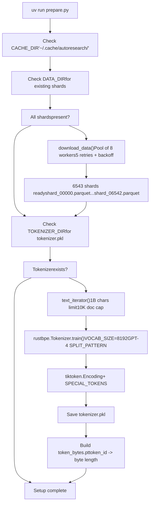
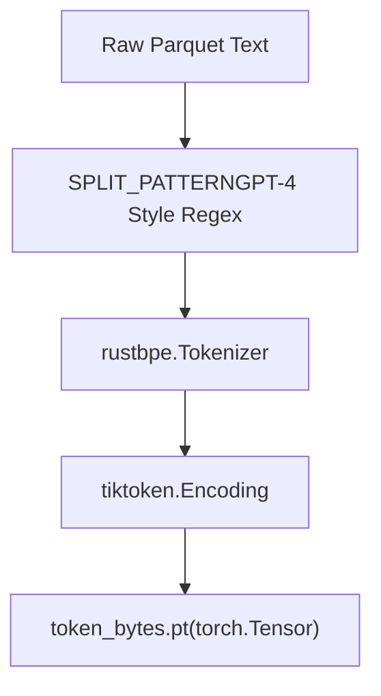
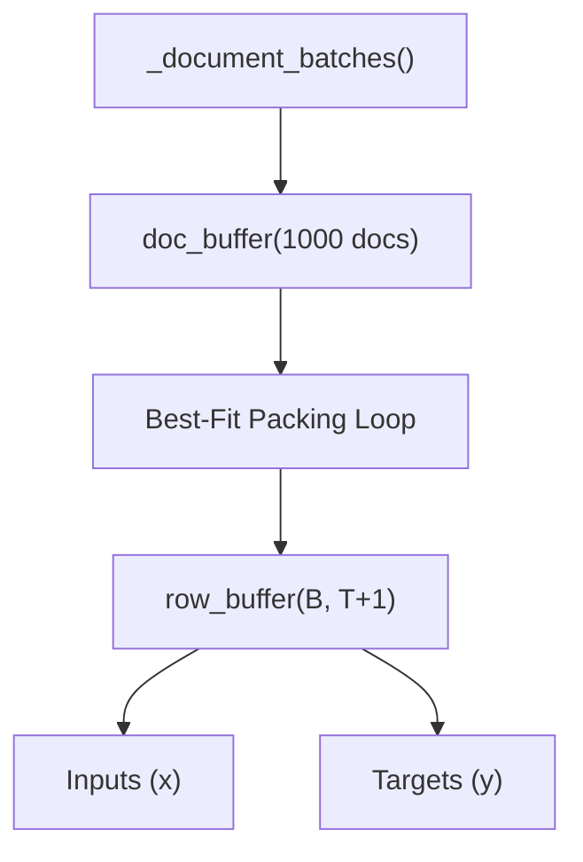

# 数据准备

相关源文件

-   [README.md](https://github.com/karpathy/autoresearch/blob/e6d79c12/README.md?plain=1)
-   [prepare.py](https://github.com/karpathy/autoresearch/blob/e6d79c12/prepare.py)

## 目的与范围

本页说明 autoresearch 中的数据准备流程，重点是 [\`prepare.py\`](https://github.com/karpathy/autoresearch/blob/e6d79c12/`prepare.py`)() 如何搭建训练环境。数据准备是一个**一次性初始化步骤**，必须在运行任何训练实验前完成。

准备流程完成三项主要任务：

1.  **数据获取**：从 `climbmix-400b-shuffle` 数据集下载 parquet 分片 [prepare.py41-44](https://github.com/karpathy/autoresearch/blob/e6d79c12/prepare.py#L41-L44)
2.  **Tokenizer 训练**：使用 `rustbpe` 训练自定义 Byte Pair Encoding（BPE）tokenizer，并将其转换为 `tiktoken` 格式 [prepare.py141-182](https://github.com/karpathy/autoresearch/blob/e6d79c12/prepare.py#L141-L182)
3.  **基础设施供给**：生成 `token_bytes.pt` 查找表，用于与词表大小无关的评估 [prepare.py184-196](https://github.com/karpathy/autoresearch/blob/e6d79c12/prepare.py#L184-L196)

**来源：** [prepare.py1-10](https://github.com/karpathy/autoresearch/blob/e6d79c12/prepare.py#L1-L10) [README.md13-15](https://github.com/karpathy/autoresearch/blob/e6d79c12/README.md?plain=1#L13-L15)

---

## 执行概览

运行 [\`prepare.py\`](https://github.com/karpathy/autoresearch/blob/e6d79c12/`prepare.py`)() 会同时完成初始化，并定义自主研究循环运行时所使用的工具函数。该脚本被视为**基础设施**，不会由代理修改 [README.md55](https://github.com/karpathy/autoresearch/blob/e6d79c12/README.md?plain=1#L55-L55)

```
# Standard one-time setupuv run prepare.py # Quick test with fewer shardsuv run prepare.py --num-shards 8
```
该脚本导出关键类与函数（[\`Tokenizer\`](https://github.com/karpathy/autoresearch/blob/e6d79c12/`Tokenizer`)(), [\`make\_dataloader\`](https://github.com/karpathy/autoresearch/blob/e6d79c12/`make_dataloader`)(), [\`evaluate\_bpb\`](https://github.com/karpathy/autoresearch/blob/e6d79c12/`evaluate_bpb`)()），由 `train.py` 导入以处理数据流与验证。

**来源：** [prepare.py5-10](https://github.com/karpathy/autoresearch/blob/e6d79c12/prepare.py#L5-L10) [README.md33-34](https://github.com/karpathy/autoresearch/blob/e6d79c12/README.md?plain=1#L33-L34)

---

## 执行流程

下图展示了从远程 Hugging Face 分片到本地序列化工件的数据流。


**执行阶段：**

| Phase | Primary Function | Logic |
| --- | --- | --- |
| **Data Download** | [\`download\_data\`](https://github.com/karpathy/autoresearch/blob/e6d79c12/`download_data`)() | 并行下载最多 6543 个分片。使用 `.tmp` 文件保证原子写入 [prepare.py70-75](https://github.com/karpathy/autoresearch/blob/e6d79c12/prepare.py#L70-L75) |
| **Tokenizer Training** | [\`train\_tokenizer\`](https://github.com/karpathy/autoresearch/blob/e6d79c12/`train_tokenizer`)() | 从训练分片中学习 8176 个 merge，并增加 16 个 special/reserved token [prepare.py162-169](https://github.com/karpathy/autoresearch/blob/e6d79c12/prepare.py#L162-L169) |

**来源：** [prepare.py57-88](https://github.com/karpathy/autoresearch/blob/e6d79c12/prepare.py#L57-L88) [prepare.py119-139](https://github.com/karpathy/autoresearch/blob/e6d79c12/prepare.py#L119-L139) [prepare.py141-196](https://github.com/karpathy/autoresearch/blob/e6d79c12/prepare.py#L141-L196)

---

## 缓存目录结构

所有工件都存储在集中式缓存中，以便在不同实验分支间持久化。

| Path Component | Code Constant | Purpose |
| --- | --- | --- |
| `~/.cache/autoresearch/` | [\`CACHE\_DIR\`](https://github.com/karpathy/autoresearch/blob/e6d79c12/`CACHE_DIR`)() | 所有系统生成数据的根目录。 |
| `.../data/` | [\`DATA\_DIR\`](https://github.com/karpathy/autoresearch/blob/e6d79c12/`DATA_DIR`)() | 存储来自 Hugging Face 的 `.parquet` 分片。 |
| `.../tokenizer/` | [\`TOKENIZER\_DIR\`](https://github.com/karpathy/autoresearch/blob/e6d79c12/`TOKENIZER_DIR`)() | 存储 `tokenizer.pkl` 和 `token_bytes.pt`。 |

验证集固定为最后一个分片（[\`VAL\_SHARD = 6542\`](https://github.com/karpathy/autoresearch/blob/e6d79c12/`VAL_SHARD = 6542`)()），以确保不同运行之间不会有训练数据泄漏到评估指标中 [prepare.py127](https://github.com/karpathy/autoresearch/blob/e6d79c12/prepare.py#L127-L127)

**来源：** [prepare.py38-44](https://github.com/karpathy/autoresearch/blob/e6d79c12/prepare.py#L38-L44) [prepare.py127](https://github.com/karpathy/autoresearch/blob/e6d79c12/prepare.py#L127-L127)

---

## Tokenizer 实现

系统使用 Byte Pair Encoding（BPE）方案。它将“自然语言空间”（原始文本）映射到“代码实体空间”（GPT 模型使用的整数 token）。


### 配置

-   **词表大小**：8192 个 token [prepare.py45](https://github.com/karpathy/autoresearch/blob/e6d79c12/prepare.py#L45-L45)
-   **特殊 token**：包含 `<|reserved_0|>`（作为 `BOS_TOKEN`）到 `<|reserved_3|>` [prepare.py50-51](https://github.com/karpathy/autoresearch/blob/e6d79c12/prepare.py#L50-L51)
-   **切分模式**：复杂正则 `SPLIT_PATTERN`，用于处理缩写、数字与空白，避免次优 merge [prepare.py48](https://github.com/karpathy/autoresearch/blob/e6d79c12/prepare.py#L48-L48)

### Token 字节查找表

`val_bpb` 指标的关键组成之一是 `token_bytes.pt` 文件。它将每个 token ID 映射回其代表的 UTF-8 字节数 [prepare.py184-192](https://github.com/karpathy/autoresearch/blob/e6d79c12/prepare.py#L184-L192) 特殊 token 的长度被设为 0，因此不会计入 BPB 计算分母中的“字节数” [prepare.py190](https://github.com/karpathy/autoresearch/blob/e6d79c12/prepare.py#L190-L190)

**来源：** [prepare.py45-51](https://github.com/karpathy/autoresearch/blob/e6d79c12/prepare.py#L45-L51) [prepare.py184-196](https://github.com/karpathy/autoresearch/blob/e6d79c12/prepare.py#L184-L196)

---

## 数据加载与评估工具

`prepare.py` 提供了 `train.py` 用于向模型供数的基础设施。

### Best-Fit Packing Dataloader

[\`make\_dataloader\`](https://github.com/karpathy/autoresearch/blob/e6d79c12/`make_dataloader`)() 函数实现了 “best-fit packing” 策略。它不是简单截断或填充，而是尝试将多个文档打包到单个序列长度（`MAX_SEQ_LEN = 2048`）中以最大化效率 [prepare.py30-31](https://github.com/karpathy/autoresearch/blob/e6d79c12/prepare.py#L30-L31)


### 评估基座（`evaluate_bpb`）

[\`evaluate\_bpb\`](https://github.com/karpathy/autoresearch/blob/e6d79c12/`evaluate_bpb`)() 函数是系统的“黄金标准”。它会：

1.  加载验证分片（`shard_06542.parquet`）[prepare.py247](https://github.com/karpathy/autoresearch/blob/e6d79c12/prepare.py#L247-L247)
2.  对固定 token 数（`EVAL_TOKENS`）计算交叉熵损失 [prepare.py32](https://github.com/karpathy/autoresearch/blob/e6d79c12/prepare.py#L32-L32)
3.  使用 `token_bytes` 查找表将结果从 “nats” 转换为 “bits per byte” [prepare.py345-348](https://github.com/karpathy/autoresearch/blob/e6d79c12/prepare.py#L345-L348)

**来源：** [prepare.py30-32](https://github.com/karpathy/autoresearch/blob/e6d79c12/prepare.py#L30-L32) [prepare.py260-321](https://github.com/karpathy/autoresearch/blob/e6d79c12/prepare.py#L260-L321) [prepare.py327-349](https://github.com/karpathy/autoresearch/blob/e6d79c12/prepare.py#L327-L349)

---

## 工件汇总

| File | Type | Description |
| --- | --- | --- |
| `shard_*.parquet` | Data | Apache Parquet 格式的原始文本数据。 |
| `tokenizer.pkl` | Model | 序列化后的 `tiktoken.Encoding` 对象 [prepare.py178-179](https://github.com/karpathy/autoresearch/blob/e6d79c12/prepare.py#L178-L179) |
| `token_bytes.pt` | Tensor | 大小为 8192 的 `torch.int32` 张量 [prepare.py195-196](https://github.com/karpathy/autoresearch/blob/e6d79c12/prepare.py#L195-L196) |

**来源：** [prepare.py143-144](https://github.com/karpathy/autoresearch/blob/e6d79c12/prepare.py#L143-L144) [prepare.py178-196](https://github.com/karpathy/autoresearch/blob/e6d79c12/prepare.py#L178-L196)
