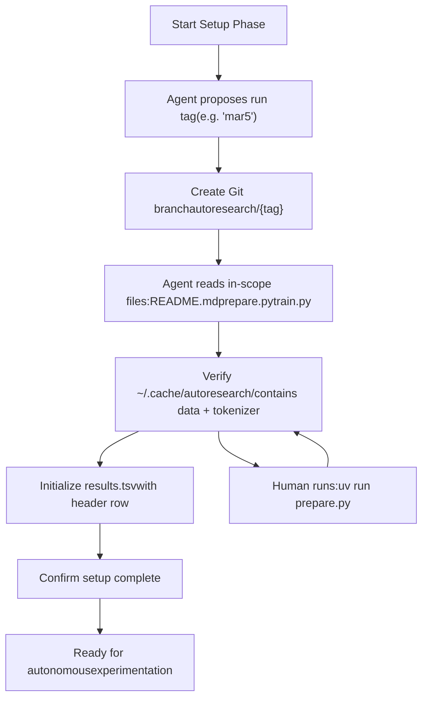
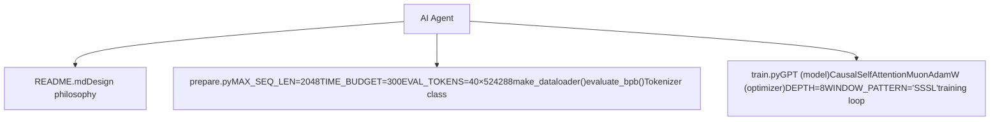

# 运行你的第一个实验

相关源文件

-   [README.md](https://github.com/karpathy/autoresearch/blob/e6d79c12/README.md?plain=1)
-   [program.md](https://github.com/karpathy/autoresearch/blob/e6d79c12/program.md?plain=1)

本页将指导你初始化 autoresearch 会话并运行首个训练实验。内容包括创建研究分支、理解 `program.md` 指令、验证安装前置条件，以及执行基线训练。

**前置条件：** 在遵循本指南前，请确保你已完成 [Installation and Dependencies](https://github.com/karpathy/autoresearch/blob/e6d79c12/Installation and Dependencies) 和 [Data Preparation](https://github.com/karpathy/autoresearch/blob/e6d79c12/Data Preparation) 在继续之前，`~/.cache/autoresearch/` 中必须已存在数据分片与 tokenizer [program.md15](https://github.com/karpathy/autoresearch/blob/e6d79c12/program.md?plain=1#L15-L15)

关于代理在初始化后如何开展自主研究，请参见 [The Research Loop](https://github.com/karpathy/autoresearch/blob/e6d79c12/The Research Loop) 关于如何解读实验结果，请参见 [Interpreting Results](https://github.com/karpathy/autoresearch/blob/e6d79c12/Interpreting Results)

---

## program.md 概览

`program.md` 文件是 AI 代理的指令手册。它定义了三个阶段：

1.  **Setup** - 初始化研究分支与结果跟踪（一次性）[program.md5-17](https://github.com/karpathy/autoresearch/blob/e6d79c12/program.md?plain=1#L5-L17)
2.  **Experimentation** - 自主研究循环（无限运行）[program.md21-115](https://github.com/karpathy/autoresearch/blob/e6d79c12/program.md?plain=1#L21-L115)
3.  **Output format** - 结果解析与记录方式 [program.md41-89](https://github.com/karpathy/autoresearch/blob/e6d79c12/program.md?plain=1#L41-L89)

[program.md1-19](https://github.com/karpathy/autoresearch/blob/e6d79c12/program.md?plain=1#L1-L19) 包含初始化新研究会话时你与代理将共同遵循的设置指令。

**来源：** [program.md1-19](https://github.com/karpathy/autoresearch/blob/e6d79c12/program.md?plain=1#L1-L19)

---

## 设置阶段工作流

设置阶段用于建立实验环境。这是一个由你（人类）与代理协作完成的过程，通常通过交互式对话进行。


**图示：设置阶段状态机**

**来源：** [program.md5-18](https://github.com/karpathy/autoresearch/blob/e6d79c12/program.md?plain=1#L5-L18)

---

## 步骤 1：确定运行标签

代理会基于当前日期提议一个运行标签。该标签用于标识研究会话，并作为分支名的一部分 [program.md9](https://github.com/karpathy/autoresearch/blob/e6d79c12/program.md?plain=1#L9-L9)

**示例交互：**

```
Agent: "Let's set up a new experiment. I propose the tag 'mar5' for today.
        The branch autoresearch/mar5 doesn't exist yet, so we can use it."
You: "Sounds good, let's proceed."
```
标签应满足：

-   **简短且易记**（例如 `mar5`, `jan23a`）
-   **唯一** - 分支 `autoresearch/<tag>` 必须尚不存在 [program.md9](https://github.com/karpathy/autoresearch/blob/e6d79c12/program.md?plain=1#L9-L9)
-   **基于日期**，便于组织。

**来源：** [program.md9](https://github.com/karpathy/autoresearch/blob/e6d79c12/program.md?plain=1#L9-L9)

---

## 步骤 2：创建研究分支

代理将从当前 `master` 状态创建一个新的 Git 分支 [program.md10](https://github.com/karpathy/autoresearch/blob/e6d79c12/program.md?plain=1#L10-L10)：

```
git checkout -b autoresearch/mar5
```
该分支将包含：

-   **所有成功实验**（`status=keep` 的提交）[program.md103](https://github.com/karpathy/autoresearch/blob/e6d79c12/program.md?plain=1#L103-L103)
-   **改进的线性历史**。

该分支充当棘轮机制——仅保留改进，通过 `git reset` 丢弃失败尝试 [program.md104](https://github.com/karpathy/autoresearch/blob/e6d79c12/program.md?plain=1#L104-L104)

**来源：** [program.md10-104](https://github.com/karpathy/autoresearch/blob/e6d79c12/program.md?plain=1#L10-L104)

---

## 步骤 3：读取范围内文件

代理会系统性读取仓库文件以理解系统 [program.md11-14](https://github.com/karpathy/autoresearch/blob/e6d79c12/program.md?plain=1#L11-L14)：

| File | Purpose | Modifiable? |
| --- | --- | --- |
| `README.md` | 仓库背景与设计理念 [README.md1-7](https://github.com/karpathy/autoresearch/blob/e6d79c12/README.md?plain=1#L1-L7) | ❌ No |
| `prepare.py` | 常量、数据管线、`evaluate_bpb()`、`Tokenizer` [prepare.py1-29](https://github.com/karpathy/autoresearch/blob/e6d79c12/prepare.py#L1-L29) | ❌ No |
| `train.py` | `GPT` 模型、`MuonAdamW` 优化器、训练循环 [train.py1-4](https://github.com/karpathy/autoresearch/blob/e6d79c12/train.py#L1-L4) | ✅ Yes |

代理必须理解：

-   **哪些可修改** - `train.py` 的全部内容 [program.md26](https://github.com/karpathy/autoresearch/blob/e6d79c12/program.md?plain=1#L26-L26)
-   **哪些固定不变** - `prepare.py` 常量、`evaluate_bpb()` 函数、数据基础设施 [program.md29-31](https://github.com/karpathy/autoresearch/blob/e6d79c12/program.md?plain=1#L29-L31)
-   **当前基线** - `train.py` 中现有架构。


**图示：范围内文件职责**

**来源：** [program.md11-31](https://github.com/karpathy/autoresearch/blob/e6d79c12/program.md?plain=1#L11-L31) [README.md11-15](https://github.com/karpathy/autoresearch/blob/e6d79c12/README.md?plain=1#L11-L15) [prepare.py1-29](https://github.com/karpathy/autoresearch/blob/e6d79c12/prepare.py#L1-L29) [train.py1-4](https://github.com/karpathy/autoresearch/blob/e6d79c12/train.py#L1-L4)

---

## 步骤 4：验证数据准备

代理会检查数据准备是否已成功完成 [program.md15](https://github.com/karpathy/autoresearch/blob/e6d79c12/program.md?plain=1#L15-L15)：

```
ls ~/.cache/autoresearch/data/*.parquet | wc -l    # Check shardsls ~/.cache/autoresearch/tokenizer/                # Check tokenizer
```
**若数据缺失**，代理会提示你运行 [program.md15](https://github.com/karpathy/autoresearch/blob/e6d79c12/program.md?plain=1#L15-L15)：

```
uv run prepare.py
```
该一次性步骤约需 2 分钟，并会下载训练数据并训练 BPE tokenizer [README.md33-34](https://github.com/karpathy/autoresearch/blob/e6d79c12/README.md?plain=1#L33-L34)

**缓存目录结构：**

```
~/.cache/autoresearch/
├── data/
│   ├── shard_00000.parquet  # Training data
│   └── ...
└── tokenizer/
    ├── tokenizer.pkl         # Trained BPE tokenizer
    └── token_bytes.pt        # Byte representation tensor
```
**来源：** [program.md15](https://github.com/karpathy/autoresearch/blob/e6d79c12/program.md?plain=1#L15-L15) [README.md32-34](https://github.com/karpathy/autoresearch/blob/e6d79c12/README.md?plain=1#L32-L34)

---

## 步骤 5：初始化 results.tsv

代理会创建 `results.tsv` 来跟踪所有实验。该文件采用特定的制表符分隔格式 [program.md66](https://github.com/karpathy/autoresearch/blob/e6d79c12/program.md?plain=1#L66-L66)

```
commit	val_bpb	memory_gb	status	description
```
**列定义 [program.md71-78](https://github.com/karpathy/autoresearch/blob/e6d79c12/program.md?plain=1#L71-L78)：**

| Column | Type | Description |
| --- | --- | --- |
| `commit` | 7-char hash | Git 提交标识（短哈希） |
| `val_bpb` | Float (6 decimals) | 验证 bits per byte（崩溃时为 0.000000） |
| `memory_gb` | Float (1 decimal) | 峰值 VRAM（GB）（`peak_vram_mb / 1024`，崩溃时为 0.0） |
| `status` | `keep`|`discard`|`crash` | 实验结果 |
| `description` | String | 实验尝试内容 |

**初始状态：**

在设置阶段，`results.tsv` 仅包含表头 [program.md16](https://github.com/karpathy/autoresearch/blob/e6d79c12/program.md?plain=1#L16-L16)：

```
commit	val_bpb	memory_gb	status	description
```
**首条基线记录会在首次运行后添加** [program.md39](https://github.com/karpathy/autoresearch/blob/e6d79c12/program.md?plain=1#L39-L39)

**来源：** [program.md16-78](https://github.com/karpathy/autoresearch/blob/e6d79c12/program.md?plain=1#L16-L78)

---

## 步骤 6：确认并开始

代理会确认设置完成 [program.md17](https://github.com/karpathy/autoresearch/blob/e6d79c12/program.md?plain=1#L17-L17)：

```
Agent: "Setup complete. Branch autoresearch/mar5 created, in-scope files read,
        data verified, and results.tsv initialized with header row. Ready to run
        the baseline and begin autonomous experimentation."
```
此时，代理将继续按原样运行基线 `train.py`，以建立性能基线 [program.md39](https://github.com/karpathy/autoresearch/blob/e6d79c12/program.md?plain=1#L39-L39)

**来源：** [program.md17-39](https://github.com/karpathy/autoresearch/blob/e6d79c12/program.md?plain=1#L17-L39)

---

## 运行基线实验

首次运行会在不做任何修改的情况下执行 `train.py` [program.md39](https://github.com/karpathy/autoresearch/blob/e6d79c12/program.md?plain=1#L39-L39)

### 命令执行

```
uv run train.py > run.log 2>&1
```
**命令拆解 [program.md99](https://github.com/karpathy/autoresearch/blob/e6d79c12/program.md?plain=1#L99-L99)：**

-   `uv run` - 使用 uv 管理的环境执行。
-   `train.py` - 训练脚本。
-   `> run.log` - 将 stdout 重定向到文件。
-   `2>&1` - 将 stderr 重定向到 stdout。

**来源：** [program.md99](https://github.com/karpathy/autoresearch/blob/e6d79c12/program.md?plain=1#L99-L99) [README.md36-37](https://github.com/karpathy/autoresearch/blob/e6d79c12/README.md?plain=1#L36-L37)

---

## 训练执行管线

> **[Mermaid sequence]**
> *(图表结构无法解析)*

**图示：从命令到指标的执行流**

**来源：** [README.md17-64](https://github.com/karpathy/autoresearch/blob/e6d79c12/README.md?plain=1#L17-L64) [program.md23-56](https://github.com/karpathy/autoresearch/blob/e6d79c12/program.md?plain=1#L23-L56) [prepare.py1-29](https://github.com/karpathy/autoresearch/blob/e6d79c12/prepare.py#L1-L29)

---

## 理解输出

### 最终摘要输出

训练与评估完成后，脚本会打印摘要区块 [program.md43-56](https://github.com/karpathy/autoresearch/blob/e6d79c12/program.md?plain=1#L43-L56)：

```
---
val_bpb:          0.997900
training_seconds: 300.1
total_seconds:    325.9
peak_vram_mb:     45060.2
mfu_percent:      39.80
total_tokens_M:   499.6
num_steps:        953
num_params_M:     50.3
depth:            8
```
**摘要指标：**

| Metric | Description | Purpose |
| --- | --- | --- |
| `val_bpb` | 验证 bits per byte | **主要目标** [program.md33](https://github.com/karpathy/autoresearch/blob/e6d79c12/program.md?plain=1#L33-L33) |
| `training_seconds` | 训练循环内耗时 | 应约为 300s [README.md64](https://github.com/karpathy/autoresearch/blob/e6d79c12/README.md?plain=1#L64-L64) |
| `peak_vram_mb` | GPU 最大内存使用 | 软约束 [program.md35](https://github.com/karpathy/autoresearch/blob/e6d79c12/program.md?plain=1#L35-L35) |
| `mfu_percent` | 模型 FLOPs 利用率 | 效率指标 [program.md51](https://github.com/karpathy/autoresearch/blob/e6d79c12/program.md?plain=1#L51-L51) |

**来源：** [program.md33-56](https://github.com/karpathy/autoresearch/blob/e6d79c12/program.md?plain=1#L33-L56) [README.md17-64](https://github.com/karpathy/autoresearch/blob/e6d79c12/README.md?plain=1#L17-L64)

---

## 从 run.log 提取指标

代理使用 `grep` 提取决策指标 [program.md100](https://github.com/karpathy/autoresearch/blob/e6d79c12/program.md?plain=1#L100-L100)：

```
grep "^val_bpb:\|^peak_vram_mb:" run.log
```
**转换规则 [program.md76](https://github.com/karpathy/autoresearch/blob/e6d79c12/program.md?plain=1#L76-L76)：**

-   `val_bpb`：按原值使用，保留 6 位小数。
-   `memory_gb`：将 `peak_vram_mb` 除以 1024，并四舍五入到 1 位小数。

**崩溃处理：** 若 `grep` 返回空结果，则该运行崩溃。代理会设置 `val_bpb=0.000000`、`memory_gb=0.0`、`status=crash`，并使用 `tail -n 50 run.log` 诊断 [program.md101-110](https://github.com/karpathy/autoresearch/blob/e6d79c12/program.md?plain=1#L101-L110)

**来源：** [program.md76-110](https://github.com/karpathy/autoresearch/blob/e6d79c12/program.md?plain=1#L76-L110)

---

## 将基线写入 results.tsv

首次运行完成后，代理会提交基线并写日志 [program.md39-103](https://github.com/karpathy/autoresearch/blob/e6d79c12/program.md?plain=1#L39-L103)：

```
# Commit unmodified train.pygit add train.pygit commit -m "baseline" # Append baseline entry to results.tsv
```
**基线后的 results.tsv [program.md84](https://github.com/karpathy/autoresearch/blob/e6d79c12/program.md?plain=1#L84-L84)：**

```
commit	val_bpb	memory_gb	status	descriptiona1b2c3d	0.997900	44.0	keep	baseline
```
**来源：** [program.md39-103](https://github.com/karpathy/autoresearch/blob/e6d79c12/program.md?plain=1#L39-L103)

---

## 进入自主研究循环

代理现在会进入无限实验循环 [program.md94-106](https://github.com/karpathy/autoresearch/blob/e6d79c12/program.md?plain=1#L94-L106)：

> **[Mermaid stateDiagram]**
> *(图表结构无法解析)*

**图示：自主实验状态机**

**循环特征：**

-   **无限** - 代理不会暂停并询问人类 [program.md112](https://github.com/karpathy/autoresearch/blob/e6d79c12/program.md?plain=1#L112-L112)
-   **约 12 次实验/小时** - 基于 5 分钟预算 [README.md64](https://github.com/karpathy/autoresearch/blob/e6d79c12/README.md?plain=1#L64-L64)
-   **约 100 次隔夜实验** [README.md64](https://github.com/karpathy/autoresearch/blob/e6d79c12/README.md?plain=1#L64-L64)

**来源：** [program.md94-115](https://github.com/karpathy/autoresearch/blob/e6d79c12/program.md?plain=1#L94-L115) [README.md64](https://github.com/karpathy/autoresearch/blob/e6d79c12/README.md?plain=1#L64-L64)

---

## 首次运行常见问题

### 问题：找不到数据分片

**原因：** `uv run prepare.py` 未完成 [program.md15](https://github.com/karpathy/autoresearch/blob/e6d79c12/program.md?plain=1#L15-L15) **解决：** 运行 `uv run prepare.py` [README.md34](https://github.com/karpathy/autoresearch/blob/e6d79c12/README.md?plain=1#L34-L34)

### 问题：CUDA 内存不足（OOM）

**原因：** GPU VRAM 不足（基线约需 44GB） [program.md50](https://github.com/karpathy/autoresearch/blob/e6d79c12/program.md?plain=1#L50-L50) **解决：** 使用 H100，或按小显存 GPU 调优指南进行配置 [README.md71-79](https://github.com/karpathy/autoresearch/blob/e6d79c12/README.md?plain=1#L71-L79)

### 问题：训练超出时间预算

**规则：** 若某次运行超过 10 分钟，应终止并视为失败 [program.md108](https://github.com/karpathy/autoresearch/blob/e6d79c12/program.md?plain=1#L108-L108)

**来源：** [program.md15-108](https://github.com/karpathy/autoresearch/blob/e6d79c12/program.md?plain=1#L15-L108) [README.md34-79](https://github.com/karpathy/autoresearch/blob/e6d79c12/README.md?plain=1#L34-L79)
