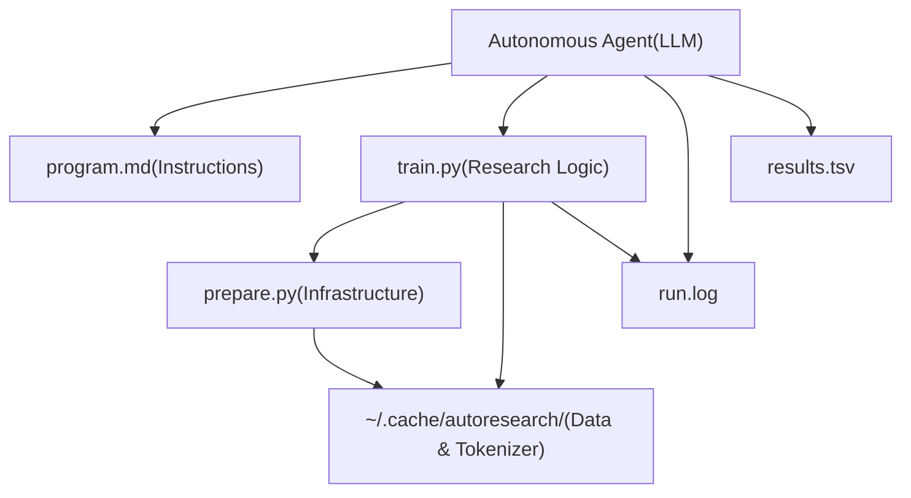
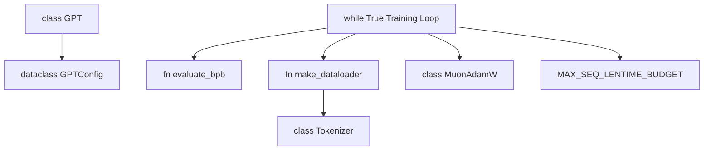

# 核心组件

相关源文件

-   [prepare.py](https://github.com/karpathy/autoresearch/blob/e6d79c12/prepare.py)
-   [program.md](https://github.com/karpathy/autoresearch/blob/e6d79c12/program.md?plain=1)
-   [train.py](https://github.com/karpathy/autoresearch/blob/e6d79c12/train.py)

本页概述了 autoresearch 架构中的主要系统文件及其各自职责。该系统在设计上严格区分了**可变**研究代码与**不可变**评估基础设施。

关于各个组件的详细文档，请参见：

-   [train.py - 可变核心](/karpathy/autoresearch/3.1-train.py-the-mutable-core)
-   [prepare.py - 数据与评估](/karpathy/autoresearch/3.2-prepare.py-data-and-evaluation)
-   [系统参数](/karpathy/autoresearch/3.3-system-parameters)
-   [program.md - Agent 指令](/karpathy/autoresearch/3.4-program.md-agent-instructions)

---

## 组件概览

autoresearch 系统由三个主要 Python 文件和一个说明性 Markdown 文件组成。其**关键架构约束**是：只有 `train.py` 可以被自主 Agent 修改。

| 文件 | 修改状态 | 主要职责 | 关键实体 |
| --- | --- | --- | --- |
| `train.py` | **可变** | 模型架构、优化器、训练循环 | `GPT`, `Block`, `MuonAdamW`, `GPTConfig` |
| `prepare.py` | **不可变** | 数据流水线、分词、评估框架 | `Tokenizer`, `make_dataloader`, `evaluate_bpb` |
| `program.md` | **不可变** | Agent 指令与研究协议 | 研究循环逻辑、日志格式 |

**来源：** [program.md11-14](https://github.com/karpathy/autoresearch/blob/e6d79c12/program.md?plain=1#L11-L14) [train.py1-5](https://github.com/karpathy/autoresearch/blob/e6d79c12/train.py#L1-L5)

---

## 系统架构图

下图展示了自主 Agent 如何与代码库交互，以及核心组件在一次实验过程中的依赖关系。

### 系统依赖与数据流

**来源：** [program.md94-105](https://github.com/karpathy/autoresearch/blob/e6d79c12/program.md?plain=1#L94-L105) [train.py26-27](https://github.com/karpathy/autoresearch/blob/e6d79c12/train.py#L26-L27) [prepare.py38-40](https://github.com/karpathy/autoresearch/blob/e6d79c12/prepare.py#L38-L40)

---

## 组件角色

### train.py - 可变核心

`train.py` 是 Agent 被允许修改的唯一文件。它包含模型架构、优化策略以及受时间约束的训练循环的完整定义。系统鼓励 Agent “hack” 这个文件，以寻找 `val_bpb` 的改进。

关键可修改部分包括：

-   **模型架构**：`GPT` 类及其子模块，如 `CausalSelfAttention` 和 `MLP` [train.py61-122](https://github.com/karpathy/autoresearch/blob/e6d79c12/train.py#L61-L122)
-   **优化器**：`MuonAdamW` 混合优化器实现 [train.py357-427](https://github.com/karpathy/autoresearch/blob/e6d79c12/train.py#L357-L427)
-   **超参数**：学习率、批大小与模型深度等常量 [train.py434-452](https://github.com/karpathy/autoresearch/blob/e6d79c12/train.py#L434-L452)

详情参见 [train.py - 可变核心](/karpathy/autoresearch/3.1-train.py-the-mutable-core)。

**来源：** [program.md25-27](https://github.com/karpathy/autoresearch/blob/e6d79c12/program.md?plain=1#L25-L27) [train.py1-5](https://github.com/karpathy/autoresearch/blob/e6d79c12/train.py#L1-L5)

---

### prepare.py - 数据与评估

`prepare.py` 充当不可变基础设施层。它处理一次性设置任务，例如下载数据分片并训练 BPE 分词器 [prepare.py1-10](https://github.com/karpathy/autoresearch/blob/e6d79c12/prepare.py#L1-L10) 在运行时，它提供 `evaluate_bpb` 函数，这是所有实验的真实评估指标。

关键在于，`prepare.py` 定义了全局约束：

-   `MAX_SEQ_LEN`：固定为 2048 [prepare.py30](https://github.com/karpathy/autoresearch/blob/e6d79c12/prepare.py#L30-L30)
-   `TIME_BUDGET`：固定为 300 秒（5 分钟）[prepare.py31](https://github.com/karpathy/autoresearch/blob/e6d79c12/prepare.py#L31-L31)
-   `EVAL_TOKENS`：验证固定约 ~21M tokens [prepare.py32](https://github.com/karpathy/autoresearch/blob/e6d79c12/prepare.py#L32-L32)

详情参见 [prepare.py - 数据与评估](/karpathy/autoresearch/3.2-prepare.py-data-and-evaluation)。

**来源：** [program.md28-31](https://github.com/karpathy/autoresearch/blob/e6d79c12/program.md?plain=1#L28-L31) [prepare.py26-33](https://github.com/karpathy/autoresearch/blob/e6d79c12/prepare.py#L26-L33)

---

### program.md - Agent 指令

`program.md` 是指导自主 Agent 的“研究组织代码”。它定义了实验循环、成功标准（Simplicity Criterion）以及 `results.tsv` 的日志格式。它指示 Agent 将 `train.py` 作为沙箱，同时遵守 `prepare.py` 的边界。

详情参见 [program.md - Agent 指令](/karpathy/autoresearch/3.4-program.md-agent-instructions)。

**来源：** [program.md1-4](https://github.com/karpathy/autoresearch/blob/e6d79c12/program.md?plain=1#L1-L4) [program.md90-115](https://github.com/karpathy/autoresearch/blob/e6d79c12/program.md?plain=1#L90-L115)

---

## 代码实体映射

下图将高层系统角色与文件中定义的具体代码实体对应起来。

### 实体交互图

**来源：** [train.py26-27](https://github.com/karpathy/autoresearch/blob/e6d79c12/train.py#L26-L27) [train.py124-133](https://github.com/karpathy/autoresearch/blob/e6d79c12/train.py#L124-L133) [train.py544-605](https://github.com/karpathy/autoresearch/blob/e6d79c12/train.py#L544-L605) [prepare.py327-349](https://github.com/karpathy/autoresearch/blob/e6d79c12/prepare.py#L327-L349)

---

## 组件交互流程

一次实验的生命周期遵循这些组件之间严格的交互顺序：

1.  **Agent 修改**：Agent 读取 `program.md` 获取目标，并在 `train.py` 中写入新假设 [program.md97-98](https://github.com/karpathy/autoresearch/blob/e6d79c12/program.md?plain=1#L97-L98)
2.  **环境设置**：`train.py` 导入 `MAX_SEQ_LEN` 和 `TIME_BUDGET` 以配置运行 [train.py26](https://github.com/karpathy/autoresearch/blob/e6d79c12/train.py#L26-L26)
3.  **数据加载**：`train.py` 调用 `make_dataloader`（来自 `prepare.py`）从本地缓存流式读取 token [train.py465-467](https://github.com/karpathy/autoresearch/blob/e6d79c12/train.py#L465-L467)
4.  **训练**：`train.py` 中的循环精确运行 `TIME_BUDGET` 秒 [train.py544-546](https://github.com/karpathy/autoresearch/blob/e6d79c12/train.py#L544-L546)
5.  **评估**：`train.py` 调用 `evaluate_bpb` 获得最终验证分数 [train.py614](https://github.com/karpathy/autoresearch/blob/e6d79c12/train.py#L614-L614)
6.  **报告**：Agent 解析输出并更新 `results.tsv` [program.md100-102](https://github.com/karpathy/autoresearch/blob/e6d79c12/program.md?plain=1#L100-L102)

**来源：** [program.md94-105](https://github.com/karpathy/autoresearch/blob/e6d79c12/program.md?plain=1#L94-L105) [train.py26-27](https://github.com/karpathy/autoresearch/blob/e6d79c12/train.py#L26-L27) [prepare.py31](https://github.com/karpathy/autoresearch/blob/e6d79c12/prepare.py#L31-L31)
