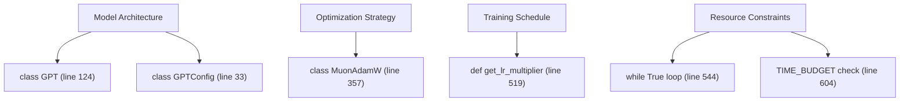
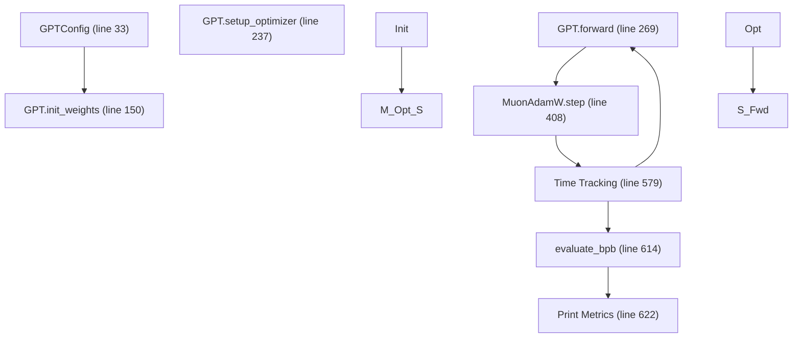

# train.py - 可变核心

相关源文件

-   [train.py](https://github.com/karpathy/autoresearch/blob/e6d79c12/train.py)

## 目的与范围

本文档为 `train.py` 提供技术参考，它是 autoresearch 系统中**唯一可修改的文件**。它完整定义了 GPT 模型架构、MuonAdamW 优化器和基于时间的训练循环。为保证评估完整性，`prepare.py` 等基础设施文件保持不可变；而 `train.py` 则是 AI Agent 进行架构与算法实验的画布。

关于特定子组件的深入说明，请参见以下子页面：

-   [GPT 模型架构](/karpathy/autoresearch/3.1.1-gpt-model-architecture) — 多尺度残差、值嵌入与滑动窗口的细节。
-   [MuonAdamW 优化器](/karpathy/autoresearch/3.1.2-muonadamw-optimizer) — 混合 Muon/AdamW 方法与按维度缩放机制的说明。
-   [训练循环与调度](/karpathy/autoresearch/3.1.3-training-loop-and-scheduling) — 时间预算循环与三阶段 LR 调度的文档。

## 系统概览

`train.py` 是一个自包含脚本，会在固定时间预算内执行完整的预训练运行。它仅从基础设施层导入必要常量与评估工具函数。

### 代码实体映射：自然语言概念到代码空间

下图将高层研究概念映射到 `train.py` 中的具体实现。

**来源：** [train.py33-357](https://github.com/karpathy/autoresearch/blob/e6d79c12/train.py#L33-L357) [train.py519-604](https://github.com/karpathy/autoresearch/blob/e6d79c12/train.py#L519-L604)

### 文件结构与逻辑流

该脚本从模型定义到最终指标报告，遵循线性执行路径。

**来源：** [train.py33-631](https://github.com/karpathy/autoresearch/blob/e6d79c12/train.py#L33-L631)

## GPT 模型架构

该模型是面向短时预算训练优化的仅解码器 Transformer。关键特性包括：

-   **值嵌入（ResFormer）**：交替层使用输入相关门控来混合 token 级值残差 [train.py74-88](https://github.com/karpathy/autoresearch/blob/e6d79c12/train.py#L74-L88)
-   **多尺度残差**：每一层通过 `resid_lambdas` 和 `x0_lambdas` 学习在当前流与初始嵌入 $x\_0$ 之间的权重 [train.py134-135](https://github.com/karpathy/autoresearch/blob/e6d79c12/train.py#L134-L135)
-   **注意力变体**：使用 FlashAttention 3 [train.py24](https://github.com/karpathy/autoresearch/blob/e6d79c12/train.py#L24-L24)，并支持可配置 `window_pattern`（例如 "SSSL" 表示 Short/Long 滑动窗口）[train.py40](https://github.com/karpathy/autoresearch/blob/e6d79c12/train.py#L40-L40)
-   **QK Norm**：在注意力点积前对 queries 和 keys 应用 RMS 归一化 [train.py91-92](https://github.com/karpathy/autoresearch/blob/e6d79c12/train.py#L91-L92)

关于这些组件的详细拆解，请参见 [GPT 模型架构](/karpathy/autoresearch/3.1.1-gpt-model-architecture)。

**来源：** [train.py24-135](https://github.com/karpathy/autoresearch/blob/e6d79c12/train.py#L24-L135) [train.py40-92](https://github.com/karpathy/autoresearch/blob/e6d79c12/train.py#L40-L92)

## MuonAdamW 优化器

该优化器采用混合设计，用专门算法处理不同类型参数：

-   **Muon**：用于二维内部矩阵参数（如 QKV 投影）。其通过 Newton-Schulz 迭代维持正交性 [train.py324-337](https://github.com/karpathy/autoresearch/blob/e6d79c12/train.py#L324-L337)
-   **AdamW**：用于嵌入、标量和向量参数 [train.py306-315](https://github.com/karpathy/autoresearch/blob/e6d79c12/train.py#L306-L315)
-   **按维度缩放**：学习率会根据模型 `n_embd` 与矩阵纵横比自动调整 [train.py249-250](https://github.com/karpathy/autoresearch/blob/e6d79c12/train.py#L249-L250)

关于 Muon 更新的数学实现，请参见 [MuonAdamW 优化器](/karpathy/autoresearch/3.1.2-muonadamw-optimizer)。

**来源：** [train.py249-337](https://github.com/karpathy/autoresearch/blob/e6d79c12/train.py#L249-L337)

## 训练循环与调度

训练循环由墙钟时间计时器驱动，而不是固定步数。

-   **时间预算**：当 `total_training_time >= TIME_BUDGET` 时循环立即终止 [train.py604-605](https://github.com/karpathy/autoresearch/blob/e6d79c12/train.py#L604-L605)
-   **三阶段 LR**：支持线性 warmup、平台期，以及线性 warmdown（cooldown）到 `FINAL_LR_FRAC` [train.py519-526](https://github.com/karpathy/autoresearch/blob/e6d79c12/train.py#L519-L526)
-   **梯度累积**：自动计算以匹配 `TOTAL_BATCH_SIZE`，并与硬件 `DEVICE_BATCH_SIZE` 解耦 [train.py496-498](https://github.com/karpathy/autoresearch/blob/e6d79c12/train.py#L496-L498)

关于调度逻辑与 MFU 计算细节，请参见 [训练循环与调度](/karpathy/autoresearch/3.1.3-training-loop-and-scheduling)。

**来源：** [train.py496-605](https://github.com/karpathy/autoresearch/blob/e6d79c12/train.py#L496-L605)

## 可变超参数

`train.py` 顶部的以下常量是 Agent 调优性能的主要杠杆。

| 参数 | 位置 | 描述 |
| --- | --- | --- |
| `ASPECT_RATIO` | [train.py434](https://github.com/karpathy/autoresearch/blob/e6d79c12/train.py#L434-L434) | `DEPTH` 的乘子，用于确定 `n_embd`。 |
| `DEPTH` | [train.py451](https://github.com/karpathy/autoresearch/blob/e6d79c12/train.py#L451-L451) | Transformer 层总数（`n_layer`）。 |
| `MATRIX_LR` | [train.py442](https://github.com/karpathy/autoresearch/blob/e6d79c12/train.py#L442-L442) | Muon 优化参数的基础学习率。 |
| `WINDOW_PATTERN` | [train.py436](https://github.com/karpathy/autoresearch/blob/e6d79c12/train.py#L436-L436) | 定义滑动窗口序列的字符串（例如 "SSSL"）。 |
| `WARMDOWN_RATIO` | [train.py447](https://github.com/karpathy/autoresearch/blob/e6d79c12/train.py#L447-L447) | 5 分钟预算中用于 LR 衰减的比例。 |

**来源：** [train.py434-451](https://github.com/karpathy/autoresearch/blob/e6d79c12/train.py#L434-L451)
