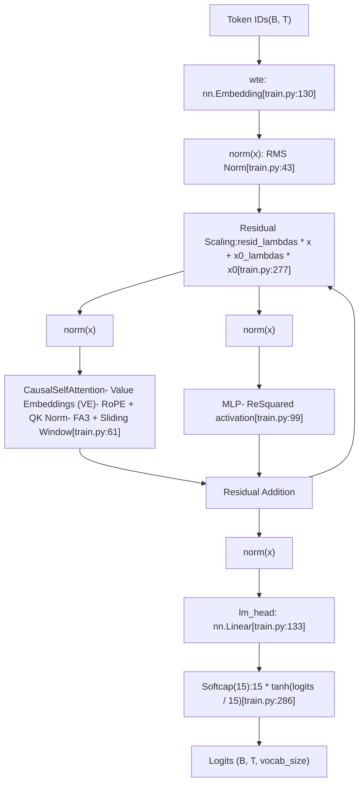
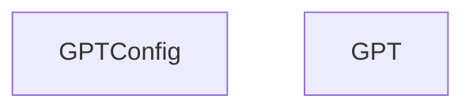
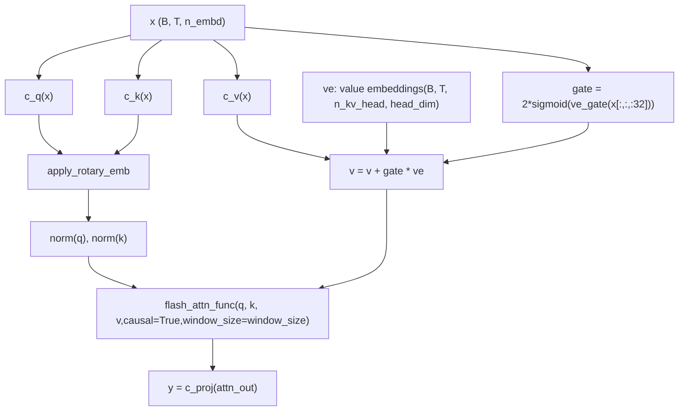

# GPT 模型架构

相关源文件

-   [train.py](https://github.com/karpathy/autoresearch/blob/e6d79c12/train.py)

## 目的与范围

本页记录了 `train.py` 中实现的 GPT 模型架构，它是 autoresearch 系统的**可变核心**。该模型是一个仅解码器 Transformer，并包含多项架构创新，包括多尺度残差、值嵌入、滑动窗口注意力和 QK 归一化。本文聚焦于模型结构和前向传播；关于训练循环机制，请参见 [3.1.3 Training Loop and Scheduling](https://github.com/karpathy/autoresearch/blob/e6d79c12/3.1.3 Training Loop and Scheduling)；关于用于训练该模型的优化器，请参见 [3.1.2 MuonAdamW Optimizer](https://github.com/karpathy/autoresearch/blob/e6d79c12/3.1.2 MuonAdamW Optimizer)

**来源：** [train.py1-29](https://github.com/karpathy/autoresearch/blob/e6d79c12/train.py#L1-L29)

---

## 高层架构概览

GPT 模型遵循标准 Transformer 解码器架构，并加入了若干关键创新：


**图：完整 GPT 模型架构**

关键架构特性：

-   **值嵌入（Value Embeddings）**：交替层包含可学习值嵌入，并与标准值投影混合 [train.py47-49](https://github.com/karpathy/autoresearch/blob/e6d79c12/train.py#L47-L49)
-   **滑动窗口注意力（Sliding Window Attention）**：可配置注意力窗口模式（例如 "SSSL" = Short、Short、Short、Long）[train.py40-41](https://github.com/karpathy/autoresearch/blob/e6d79c12/train.py#L40-L41)
-   **QK 归一化（QK Normalization）**：在注意力计算前，对 Queries 与 Keys 均应用 RMS 归一化 [train.py91-92](https://github.com/karpathy/autoresearch/blob/e6d79c12/train.py#L91-L92)
-   **多尺度残差（Multi-scale Residuals）**：逐层可学习标量控制残差贡献与 $x\_0$ 跳连 [train.py134-135](https://github.com/karpathy/autoresearch/blob/e6d79c12/train.py#L134-L135)
-   **Softcapped Logits**：输出 logits 被 softcap 到 $\\pm15$ 以稳定训练 [train.py286](https://github.com/karpathy/autoresearch/blob/e6d79c12/train.py#L286-L286)

**来源：** [train.py32-148](https://github.com/karpathy/autoresearch/blob/e6d79c12/train.py#L32-L148) [train.py274-286](https://github.com/karpathy/autoresearch/blob/e6d79c12/train.py#L274-L286)

---

## 模型配置

模型通过 `GPTConfig` 数据类进行配置：


**图：模型配置结构**

| 参数 | 用途 | 典型范围 |
| --- | --- | --- |
| `sequence_len` | 最大序列长度（上下文窗口） | 固定为 2048（来自 `MAX_SEQ_LEN`）[train.py34](https://github.com/karpathy/autoresearch/blob/e6d79c12/train.py#L34-L34) |
| `vocab_size` | 分词器词表大小 | ~32K（由 BPE 分词器决定）[train.py35](https://github.com/karpathy/autoresearch/blob/e6d79c12/train.py#L35-L35) |
| `n_layer` | Transformer block 数量 | 12（默认）[train.py36](https://github.com/karpathy/autoresearch/blob/e6d79c12/train.py#L36-L36) |
| `n_head` | 注意力头数量 | 6（默认）[train.py37](https://github.com/karpathy/autoresearch/blob/e6d79c12/train.py#L37-L37) |
| `n_kv_head` | key/value 头数量（GQA） | 6（默认）[train.py38](https://github.com/karpathy/autoresearch/blob/e6d79c12/train.py#L38-L38) |
| `n_embd` | 模型维度 | 768（默认）[train.py39](https://github.com/karpathy/autoresearch/blob/e6d79c12/train.py#L39-L39) |
| `window_pattern` | 滑动窗口模式字符串 | "SSSL"（短/长模式）[train.py40](https://github.com/karpathy/autoresearch/blob/e6d79c12/train.py#L40-L40) |

**来源：** [train.py32-41](https://github.com/karpathy/autoresearch/blob/e6d79c12/train.py#L32-L41)

---

## Token 嵌入与位置编码

### Token 嵌入层

模型使用标准的可学习 token 嵌入，存储于 `transformer.wte`。嵌入结果会立即经 RMS 归一化，并作为 `x0` 保存，用于模型各处的跳连 [train.py274-276](https://github.com/karpathy/autoresearch/blob/e6d79c12/train.py#L274-L276)

**来源：** [train.py130](https://github.com/karpathy/autoresearch/blob/e6d79c12/train.py#L130-L130) [train.py274-276](https://github.com/karpathy/autoresearch/blob/e6d79c12/train.py#L274-L276)

---

### 旋转位置嵌入（RoPE）

模型使用**旋转位置嵌入（RoPE）**，而非绝对位置编码。这些嵌入会预先计算并缓存到缓冲区中 [train.py144-147](https://github.com/karpathy/autoresearch/blob/e6d79c12/train.py#L144-L147)

**图：旋转嵌入的计算与应用**

`apply_rotary_emb` 函数将每个头维度分成两半，并使用如下公式进行旋转：

-   $y\_1 = x\_1 \\cdot \\cos + x\_2 \\cdot \\sin$
-   $y\_2 = x\_1 \\cdot (-\\sin) + x\_2 \\cdot \\cos$ [train.py56-57](https://github.com/karpathy/autoresearch/blob/e6d79c12/train.py#L56-L57)

**来源：** [train.py52-59](https://github.com/karpathy/autoresearch/blob/e6d79c12/train.py#L52-L59) [train.py144-148](https://github.com/karpathy/autoresearch/blob/e6d79c12/train.py#L144-L148) [train.py183-194](https://github.com/karpathy/autoresearch/blob/e6d79c12/train.py#L183-L194)

---

## 带值嵌入的因果自注意力

`CausalSelfAttention` 模块实现了多头注意力，并包含多个关键增强：

### 值残差（ResFormer）

值嵌入（VE）是一项架构创新，其特征为：

1.  **交替层**包含值嵌入（由 `has_ve(layer_idx, n_layer)` 决定）[train.py47-49](https://github.com/karpathy/autoresearch/blob/e6d79c12/train.py#L47-L49)
2.  最后一层始终包含 VE。
3.  VE 提供可学习值残差，并通过输入相关门控进行混合 [train.py84-87](https://github.com/karpathy/autoresearch/blob/e6d79c12/train.py#L84-L87)

门控机制计算为：

-   `gate = 2 * sigmoid(ve_gate(x[..., :32]))` [train.py86](https://github.com/karpathy/autoresearch/blob/e6d79c12/train.py#L86-L86)
-   `v = v + gate.unsqueeze(-1) * ve` [train.py87](https://github.com/karpathy/autoresearch/blob/e6d79c12/train.py#L87-L87)

### 注意力前向传播

该注意力机制使用 **Flash Attention 3**（FA3）进行高性能计算 [train.py93](https://github.com/karpathy/autoresearch/blob/e6d79c12/train.py#L93-L93)


**图：带值嵌入的注意力前向传播**

**来源：** [train.py61-97](https://github.com/karpathy/autoresearch/blob/e6d79c12/train.py#L61-L97) [train.py139-142](https://github.com/karpathy/autoresearch/blob/e6d79c12/train.py#L139-L142)

---

## 滑动窗口注意力

模型支持由 `window_pattern` 指定的可配置滑动窗口模式 [train.py40](https://github.com/karpathy/autoresearch/blob/e6d79c12/train.py#L40-L40)

| 模式字符 | 窗口大小 | 描述 |
| --- | --- | --- |
| `L` | `sequence_len` | 全注意力（长窗口） |
| `S` | `sequence_len // 2` | 半上下文（短窗口） |

窗口大小在初始化时一次性计算，并存储在 `self.window_sizes` 中。最后一层始终被强制为长窗口，以保留全局上下文 [train.py196-207](https://github.com/karpathy/autoresearch/blob/e6d79c12/train.py#L196-L207)

**来源：** [train.py128](https://github.com/karpathy/autoresearch/blob/e6d79c12/train.py#L128-L128) [train.py196-207](https://github.com/karpathy/autoresearch/blob/e6d79c12/train.py#L196-L207)

---

## 使用 ReSquared 激活的 MLP

MLP 使用简洁结构，并采用 **ReSquared** 激活（ReLU 的平方）[train.py107](https://github.com/karpathy/autoresearch/blob/e6d79c12/train.py#L107-L107)：

```
def forward(self, x):    x = self.c_fc(x)    x = F.relu(x).square()    x = self.c_proj(x)    return x
```
**来源：** [train.py99-109](https://github.com/karpathy/autoresearch/blob/e6d79c12/train.py#L99-L109)

---

## 多尺度残差连接

模型使用两类可学习残差机制：

### 逐层残差缩放

在每个 block 前，输入按如下方式变换：`x = resid_lambdas[i] * x + x0_lambdas[i] * x0` [train.py277](https://github.com/karpathy/autoresearch/blob/e6d79c12/train.py#L277-L277)

其中：

-   `resid_lambdas[i]`：缩放当前残差流（初始化为 1.0）[train.py165](https://github.com/karpathy/autoresearch/blob/e6d79c12/train.py#L165-L165)
-   `x0_lambdas[i]`：缩放来自初始嵌入的跳连（初始化为 0.1）[train.py166](https://github.com/karpathy/autoresearch/blob/e6d79c12/train.py#L166-L166)
-   `x0`：起始时保存的归一化 token 嵌入 [train.py276](https://github.com/karpathy/autoresearch/blob/e6d79c12/train.py#L276-L276)

这为每层提供了“残差流 vs 跳连强度”的控制能力，并通过 Muon 中的专用学习率进行优化。

**来源：** [train.py134-135](https://github.com/karpathy/autoresearch/blob/e6d79c12/train.py#L134-L135) [train.py165-166](https://github.com/karpathy/autoresearch/blob/e6d79c12/train.py#L165-L166) [train.py276-278](https://github.com/karpathy/autoresearch/blob/e6d79c12/train.py#L276-L278)

---

## 输出层与 Logit Softcapping

最终变换会将隐藏状态转为 logits，并进行 softcapping [train.py286](https://github.com/karpathy/autoresearch/blob/e6d79c12/train.py#L286-L286)：

1.  **RMS Norm**：`norm(x)` [train.py281](https://github.com/karpathy/autoresearch/blob/e6d79c12/train.py#L281-L281)
2.  **线性头**：`lm_head(x)` [train.py283](https://github.com/karpathy/autoresearch/blob/e6d79c12/train.py#L283-L283)
3.  **Softcap**：`logits = 15 * torch.tanh(logits / 15)` [train.py286](https://github.com/karpathy/autoresearch/blob/e6d79c12/train.py#L286-L286)

这可防止极大 logit 值破坏训练稳定性，同时保留预测排序的相对关系。

**来源：** [train.py281-286](https://github.com/karpathy/autoresearch/blob/e6d79c12/train.py#L281-L286)

---

## 权重初始化

模型采用自定义初始化策略 [train.py150-182](https://github.com/karpathy/autoresearch/blob/e6d79c12/train.py#L150-L182)：

| 参数类型 | 初始化方式 | 设计动机 |
| --- | --- | --- |
| Token 嵌入（`wte`） | `N(0, 1.0)` | 标准嵌入初始化 |
| 反嵌入（`lm_head`） | `N(0, 0.001)` | 较小初值以稳定早期训练 |
| 矩阵权重（`c_q`, `c_fc` 等） | `Uniform(-s, s)` | $s = \\sqrt{3} \\cdot n\_embd^{-0.5}$ |
| 投影权重（`c_proj`） | 零初始化 | 残差分支从恒等映射起步 |
| VE gate 权重 | 零初始化 | gate 从中性值（1.0）起步 |
| 残差 lambdas | 1.0 | 以标准残差起步 |
| $x\_0$ lambdas | 0.1 | 小幅跳连贡献 |

**来源：** [train.py150-182](https://github.com/karpathy/autoresearch/blob/e6d79c12/train.py#L150-L182)
