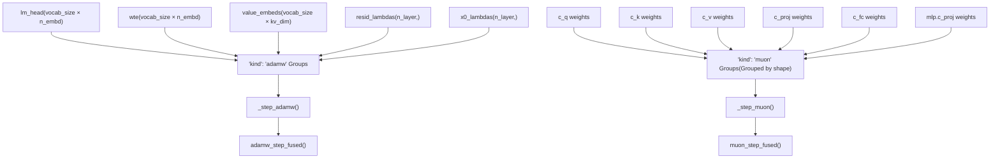
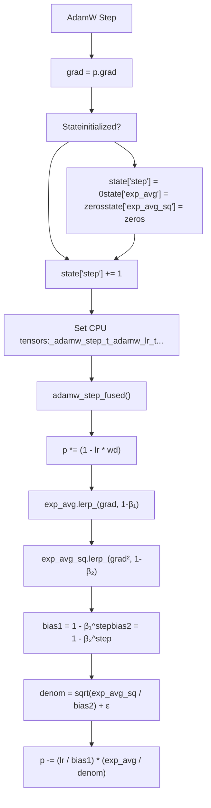
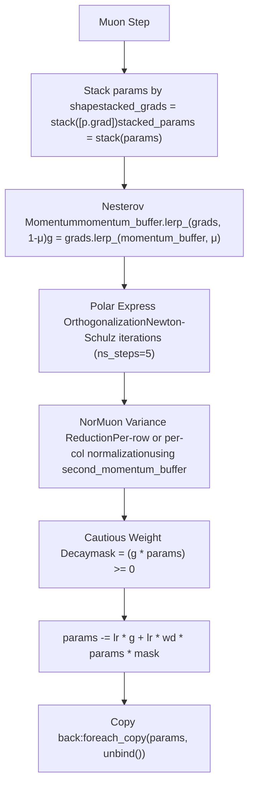

# MuonAdamW 优化器

相关源文件

-   [train.py](https://github.com/karpathy/autoresearch/blob/e6d79c12/train.py)

## 目的与范围

本页记录 `MuonAdamW` 优化器类及其配置方式。该优化器实现了一种混合优化策略：对标量和嵌入参数使用 **AdamW**，对二维矩阵参数使用 **Muon**。优化器通过 `model.setup_optimizer()` 实例化，并在整个训练循环中用于更新模型权重。

关于训练过程中如何调用该优化器，请参见 [3.1.3 Training Loop and Scheduling](https://github.com/karpathy/autoresearch/blob/e6d79c12/3.1.3 Training Loop and Scheduling)

**来源：** [train.py295-428](https://github.com/karpathy/autoresearch/blob/e6d79c12/train.py#L295-L428)

---

## 概述

`MuonAdamW` 类实现了**混合优化策略**，会根据参数维度应用不同算法：

-   **AdamW**：用于嵌入（`wte`, `value_embeds`）、反嵌入（`lm_head`）以及逐层标量（`resid_lambdas`, `x0_lambdas`）。
-   **Muon**：用于所有二维矩阵参数（`transformer.h` 中的注意力投影层与 MLP 层）。

这种混合方案利用了两类算法的互补优势：

-   **AdamW** 为 1D/0D 参数提供带偏置校正的自适应学习率。
-   **Muon** 通过正交化与方差归一化，为高维权重矩阵提供稳定更新。

**来源：** [train.py357-361](https://github.com/karpathy/autoresearch/blob/e6d79c12/train.py#L357-L361) [train.py237-267](https://github.com/karpathy/autoresearch/blob/e6d79c12/train.py#L237-L267)

---

## 架构：参数组与算法分配

下图展示了模型组件与优化器分发逻辑之间的关系。

### 优化器分发逻辑


优化器的 `step()` 方法会遍历参数组，并依据 `kind` 字段分发到对应算法。

**来源：** [train.py422-427](https://github.com/karpathy/autoresearch/blob/e6d79c12/train.py#L422-L427) [train.py251-263](https://github.com/karpathy/autoresearch/blob/e6d79c12/train.py#L251-L263)

---

## 参数组配置

`setup_optimizer()` 方法使用算法特定超参数构建参数组：

| 参数类型 | 算法 | 学习率 | Betas | Weight Decay | 特殊配置 |
| --- | --- | --- | --- | --- | --- |
| `lm_head` | AdamW | `0.004 * dmodel_scale` | `(0.8, 0.95)` | `0.0` | `eps=1e-10` |
| `wte` | AdamW | `0.2 * dmodel_scale` | `(0.8, 0.95)` | `0.0` | `eps=1e-10` |
| `value_embeds` | AdamW | `0.2 * dmodel_scale` | `(0.8, 0.95)` | `0.0` | `eps=1e-10` |
| `resid_lambdas` | AdamW | `0.5 * 0.01` | `(0.8, 0.95)` | `0.0` | `eps=1e-10` |
| `x0_lambdas` | AdamW | `0.5` | `(0.96, 0.95)` | `0.0` | `eps=1e-10`, 不同 β₁ |
| Matrix params | Muon | `0.02` | N/A | `0.2` | `momentum=0.95, ns_steps=5, beta2=0.95` |

**关键观察：**

-   **按模型维度进行 LR 缩放**：所有 AdamW 学习率都按 `(model_dim / 768)^(-0.5)` 缩放 [train.py249-250](https://github.com/karpathy/autoresearch/blob/e6d79c12/train.py#L249-L250)，使同一组超参数可适配不同模型规模。
-   **Muon 的按形状分组**：矩阵参数按 shape 分组，支持通过堆叠进行高效批处理 [train.py258-263](https://github.com/karpathy/autoresearch/blob/e6d79c12/train.py#L258-L263)
-   **x0\_lambdas 使用不同 β₁**：跳连标量使用 `β₁=0.96` 而非 `0.8` [train.py246](https://github.com/karpathy/autoresearch/blob/e6d79c12/train.py#L246-L246)
-   **Muon LR 增益**：对于非方阵，Muon 学习率额外乘以 `max(1.0, rows/cols)^0.5` [train.py413](https://github.com/karpathy/autoresearch/blob/e6d79c12/train.py#L413-L413)

**来源：** [train.py237-267](https://github.com/karpathy/autoresearch/blob/e6d79c12/train.py#L237-L267) [train.py249-250](https://github.com/karpathy/autoresearch/blob/e6d79c12/train.py#L249-L250) [train.py413](https://github.com/karpathy/autoresearch/blob/e6d79c12/train.py#L413-L413)

---

## AdamW 组件

### 算法流程


### 实现细节

AdamW 实现遵循解耦权重衰减公式：

1.  **权重衰减**直接作用于参数：`p *= (1 - lr * wd)` [train.py308](https://github.com/karpathy/autoresearch/blob/e6d79c12/train.py#L308-L308)
2.  **一阶矩**（动量）：`exp_avg.lerp_(grad, 1 - beta1)` [train.py309](https://github.com/karpathy/autoresearch/blob/e6d79c12/train.py#L309-L309)
3.  **二阶矩**（方差）：`exp_avg_sq.lerp_(grad.square(), 1 - beta2)` [train.py310](https://github.com/karpathy/autoresearch/blob/e6d79c12/train.py#L310-L310)
4.  **偏置校正**：两个矩都除以各自的偏置校正因子 [train.py311-312](https://github.com/karpathy/autoresearch/blob/e6d79c12/train.py#L311-L312)
5.  **参数更新**：`p -= step_size * (exp_avg / denom)`，其中 `denom = sqrt(exp_avg_sq / bias2) + eps` [train.py313-315](https://github.com/karpathy/autoresearch/blob/e6d79c12/train.py#L313-L315)

函数 `adamw_step_fused()` 使用 **torch.compiled**，并设置 `dynamic=False` 与 `fullgraph=True`，可生成优化后的 CUDA 内核，将全部操作融合为一次 GPU kernel 启动。

**来源：** [train.py306-315](https://github.com/karpathy/autoresearch/blob/e6d79c12/train.py#L306-L315) [train.py374-393](https://github.com/karpathy/autoresearch/blob/e6d79c12/train.py#L374-L393)

---

## Muon 组件

Muon 算法针对二维矩阵参数实现了**带方差归一化的正交化梯度下降**。

### 算法阶段


### 1\. Nesterov 动量

```
# <FileRef file-url="https://github.com/karpathy/autoresearch/blob/e6d79c12/train.py#L320-L323" min=320 max=323 file-path="train.py">Hii</FileRef>momentum_buffer.lerp_(stacked_grads, 1 - momentum)g = stacked_grads.lerp_(momentum_buffer, momentum)
```
使用系数为 `μ` 的 Nesterov 动量（在前 300 步从 0.85 调度到 0.95）。

### 2\. Polar Express 正交化

“Polar Express” 是一种 Newton-Schulz 算法，用于计算矩阵的正交极分解因子。

```
# <FileRef file-url="https://github.com/karpathy/autoresearch/blob/e6d79c12/train.py#L324-L336" min=324 max=336 file-path="train.py">Hii</FileRef>X = g.bfloat16()X = X / (X.norm(dim=(-2, -1), keepdim=True) * 1.02 + 1e-6) if g.size(-2) > g.size(-1):  # Tall matrices    for a, b, c in polar_express_coeffs[:ns_steps]:        A = X.mT @ X        B = b * A + c * (A @ A)        X = a * X + X @ Belse:  # Wide matrices    # ... symmetric logic for wide matrices ...
```
该算法使用 **5 次 Newton-Schulz 迭代**（`ns_steps=5`），预计算系数存储于 `polar_express_coeffs` [train.py298-304](https://github.com/karpathy/autoresearch/blob/e6d79c12/train.py#L298-L304)

### 3\. NorMuon 方差缩减

梯度范数通过逐行或逐列的自适应二阶矩进行归一化：

```
# <FileRef file-url="https://github.com/karpathy/autoresearch/blob/e6d79c12/train.py#L338-L348" min=338 max=348 file-path="train.py">Hii</FileRef>v_mean = g.float().square().mean(dim=red_dim, keepdim=True)second_momentum_buffer.lerp_(v_mean, 1 - beta2)step_size = second_momentum_buffer.clamp_min(1e-10).rsqrt()# ... normalization and rescaling ...g = g * final_scale
```
### 4\. 谨慎权重衰减（Cautious Weight Decay）

仅当梯度与参数同号时才施加权重衰减：

```
# <FileRef file-url="https://github.com/karpathy/autoresearch/blob/e6d79c12/train.py#L350-L354" min=350 max=354 file-path="train.py">Hii</FileRef>mask = (g * stacked_params) >= 0stacked_params.sub_(lr * g + lr * wd * stacked_params * mask)
```
**来源：** [train.py298-354](https://github.com/karpathy/autoresearch/blob/e6d79c12/train.py#L298-L354) [train.py409-419](https://github.com/karpathy/autoresearch/blob/e6d79c12/train.py#L409-L419)

---

## 实现细节：编译内核与 CPU 张量

### Torch.compile 的使用

两个 step 函数都通过 `@torch.compile(dynamic=False, fullgraph=True)` 修饰，以生成专用 CUDA 内核：

-   `adamw_step_fused` [train.py306](https://github.com/karpathy/autoresearch/blob/e6d79c12/train.py#L306-L306)
-   `muon_step_fused` [train.py317](https://github.com/karpathy/autoresearch/blob/e6d79c12/train.py#L317-L317)

### 使用 CPU 张量避免重复编译

优化器将超参数保存为 0-D CPU 张量，以避免 `torch.compile` 在标量变化时触发重新编译 [train.py363-372](https://github.com/karpathy/autoresearch/blob/e6d79c12/train.py#L363-L372) 这些张量会在每一步更新，并传入编译后的函数。

```
# <FileRef file-url="https://github.com/karpathy/autoresearch/blob/e6d79c12/train.py#L363-L365" min=363 max=365 file-path="train.py">Hii</FileRef>self._adamw_step_t = torch.tensor(0.0, dtype=torch.float32, device="cpu")self._adamw_lr_t = torch.tensor(0.0, dtype=torch.float32, device="cpu")
```
**来源：** [train.py306-317](https://github.com/karpathy/autoresearch/blob/e6d79c12/train.py#L306-L317) [train.py363-372](https://github.com/karpathy/autoresearch/blob/e6d79c12/train.py#L363-L372) [train.py385-390](https://github.com/karpathy/autoresearch/blob/e6d79c12/train.py#L385-L390) [train.py411-414](https://github.com/karpathy/autoresearch/blob/e6d79c12/train.py#L411-L414)

---

## 运行时参数更新

在训练过程中，主循环会在每一步动态调整超参数：

### 学习率与动量调度

-   **LR 调度**：`group["lr"] = group["initial_lr"] * lrm` [train.py560-561](https://github.com/karpathy/autoresearch/blob/e6d79c12/train.py#L560-L561)
-   **Muon 动量**：`muon_momentum` 在 300 步内由 0.85 增至 0.95 [train.py528-530](https://github.com/karpathy/autoresearch/blob/e6d79c12/train.py#L528-L530)
-   **Muon 权重衰减**：`muon_weight_decay` 在整个训练时长内线性衰减至 0 [train.py532-533](https://github.com/karpathy/autoresearch/blob/e6d79c12/train.py#L532-L533)

**来源：** [train.py519-534](https://github.com/karpathy/autoresearch/blob/e6d79c12/train.py#L519-L534) [train.py556-564](https://github.com/karpathy/autoresearch/blob/e6d79c12/train.py#L556-L564)
