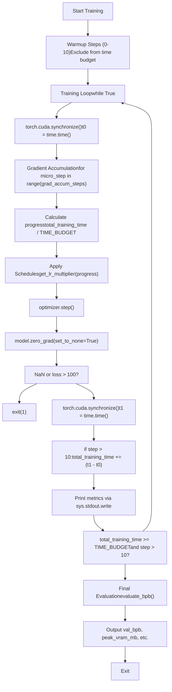
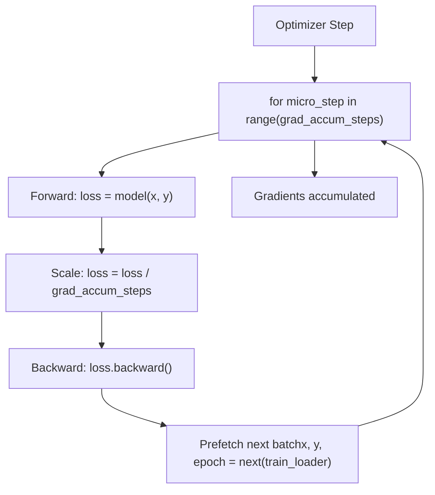
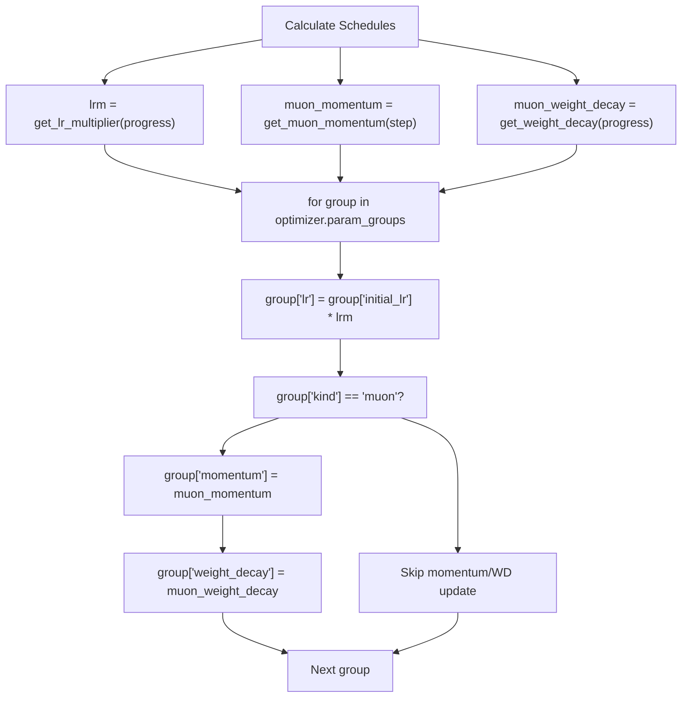

# 训练循环与调度

相关源文件

-   [train.py](https://github.com/karpathy/autoresearch/blob/e6d79c12/train.py)

本页记录 `train.py` 中训练循环的实现，重点说明基于时间的训练理念、梯度累积机制，以及三阶段学习率调度系统。该训练循环旨在固定时间预算内执行实验，同时最大化 token 吞吐，并支持不同架构配置之间的公平比较。

关于被训练的模型架构，请参见 [GPT 模型架构](/karpathy/autoresearch/3.1.1-gpt-model-architecture)。关于优化器实现，请参见 [MuonAdamW 优化器](/karpathy/autoresearch/3.1.2-muonadamw-optimizer)。关于训练循环产出的评估指标，请参见 [Validation Bits Per Byte (val\_bpb)](/karpathy/autoresearch/5.1-validation-bits-per-byte-(val_bpb))。

---

## 基于时间的训练理念

autoresearch 系统采用**固定墙钟时间预算**，而不是固定训练步数。该设计可确保当实验修改模型规模、批大小或其他会影响训练吞吐的超参数时，比较仍然公平。

训练循环在实际训练时间上精确运行 `TIME_BUDGET` 秒（由 [prepare.py27](https://github.com/karpathy/autoresearch/blob/e6d79c12/prepare.py#L27-L27) 给出的 300s），不计入编译与预热开销。系统通过跟踪累计训练时间并在预算耗尽时终止来执行该预算 [train.py603-604](https://github.com/karpathy/autoresearch/blob/e6d79c12/train.py#L603-L604)

### 训练执行流程

下图展示了单次训练运行的生命周期，并将逻辑阶段映射到 `train.py` 实现。


**来源**： [train.py538-604](https://github.com/karpathy/autoresearch/blob/e6d79c12/train.py#L538-L604) [prepare.py27](https://github.com/karpathy/autoresearch/blob/e6d79c12/prepare.py#L27-L27)

---

## 梯度累积

梯度累积使系统能在 GPU 显存受限的情况下，仍以较大有效批大小（`TOTAL_BATCH_SIZE`）进行训练。系统将每个优化器步拆分为多个 microbatch 的前向-反向传播。

### 计算方式

梯度累积步数按如下方式计算：

```
grad_accum_steps = TOTAL_BATCH_SIZE / (DEVICE_BATCH_SIZE * MAX_SEQ_LEN)
```
其中：

-   `TOTAL_BATCH_SIZE = 2^19`（524,288 tokens）- 有效批大小 [train.py438](https://github.com/karpathy/autoresearch/blob/e6d79c12/train.py#L438-L438)
-   `DEVICE_BATCH_SIZE = 128` - 每设备 microbatch 大小 [train.py451](https://github.com/karpathy/autoresearch/blob/e6d79c12/train.py#L451-L451)
-   `MAX_SEQ_LEN = 2048` - 序列长度，来自 [prepare.py24](https://github.com/karpathy/autoresearch/blob/e6d79c12/prepare.py#L24-L24)

### 实现

梯度累积循环 [train.py546-552](https://github.com/karpathy/autoresearch/blob/e6d79c12/train.py#L546-L552) 负责 microbatch 处理：


每个 microbatch 计算出的梯度会累积到参数 `.grad` 缓冲区中。loss 会按 `1 / grad_accum_steps` 缩放，以保持梯度量级正确 [train.py548](https://github.com/karpathy/autoresearch/blob/e6d79c12/train.py#L548-L548) 在所有 microbatch 完成后，`optimizer.step()` 应用累计梯度，`model.zero_grad(set_to_none=True)` 重置缓冲区 [train.py564-565](https://github.com/karpathy/autoresearch/blob/e6d79c12/train.py#L564-L565)

**来源**： [train.py438-451](https://github.com/karpathy/autoresearch/blob/e6d79c12/train.py#L438-L451) [train.py495-497](https://github.com/karpathy/autoresearch/blob/e6d79c12/train.py#L495-L497) [train.py546-552](https://github.com/karpathy/autoresearch/blob/e6d79c12/train.py#L546-L552) [train.py564-565](https://github.com/karpathy/autoresearch/blob/e6d79c12/train.py#L564-L565)

---

## 三阶段学习率调度

学习率调度包含三个阶段，由 `progress = total_training_time / TIME_BUDGET` 控制 [train.py555](https://github.com/karpathy/autoresearch/blob/e6d79c12/train.py#L555-L555)：

| 阶段 | Progress 区间 | 乘子 | 目的 |
| --- | --- | --- | --- |
| **Warmup** | `[0, WARMUP_RATIO)` | `progress / WARMUP_RATIO` | 从 0 到 1 线性爬升 |
| **Plateau** | `[WARMUP_RATIO, 1 - WARMDOWN_RATIO)` | `1.0` | 全学习率训练 |
| **Warmdown** | `[1 - WARMDOWN_RATIO, 1.0]` | 线性衰减 | `1.0 → FINAL_LR_FRAC` |

### 调度函数

`get_lr_multiplier(progress)` 函数 [train.py518-525](https://github.com/karpathy/autoresearch/blob/e6d79c12/train.py#L518-L525) 实现了该逻辑：

```
def get_lr_multiplier(progress):    if progress < WARMUP_RATIO:        return progress / WARMUP_RATIO if WARMUP_RATIO > 0 else 1.0    elif progress < 1.0 - WARMDOWN_RATIO:        return 1.0    else:        cooldown = (1.0 - progress) / WARMDOWN_RATIO        return cooldown * 1.0 + (1 - cooldown) * FINAL_LR_FRAC
```
### 默认超参数

[train.py445-447](https://github.com/karpathy/autoresearch/blob/e6d79c12/train.py#L445-L447)：

-   `WARMUP_RATIO = 0.0` - 默认不进行 warmup。
-   `WARMDOWN_RATIO = 0.5` - 训练后半程为衰减阶段。
-   `FINAL_LR_FRAC = 0.0` - 衰减到零。

### 应用于参数组

LR 乘子会应用到每个参数组的 `initial_lr` 上 [train.py559-560](https://github.com/karpathy/autoresearch/blob/e6d79c12/train.py#L559-L560)：

```
for group in optimizer.param_groups:    group["lr"] = group["initial_lr"] * lrm
```
每个组的 `initial_lr` 会在优化器初始化时记录 [train.py264-265](https://github.com/karpathy/autoresearch/blob/e6d79c12/train.py#L264-L265)

**来源**： [train.py445-447](https://github.com/karpathy/autoresearch/blob/e6d79c12/train.py#L445-L447) [train.py518-525](https://github.com/karpathy/autoresearch/blob/e6d79c12/train.py#L518-L525) [train.py554-563](https://github.com/karpathy/autoresearch/blob/e6d79c12/train.py#L554-L563)

---

## 优化器特定调度

除共享 LR 调度外，Muon 参数组还有各自的动量和权重衰减调度。

### Muon 动量预热

`get_muon_momentum(step)` 函数 [train.py527-529](https://github.com/karpathy/autoresearch/blob/e6d79c12/train.py#L527-L529) 实现了基于步数的动量预热：

```
def get_muon_momentum(step):    frac = min(step / 300, 1)    return (1 - frac) * 0.85 + frac * 0.95
```
它会在前 300 步内将动量从 `0.85` 线性插值到 `0.95`。与 LR 调度不同，这里是**基于步数**而非基于时间 [train.py528](https://github.com/karpathy/autoresearch/blob/e6d79c12/train.py#L528-L528)

### 权重衰减调度

`get_weight_decay(progress)` 函数 [train.py531-532](https://github.com/karpathy/autoresearch/blob/e6d79c12/train.py#L531-L532) 会将权重衰减到零：

```
def get_weight_decay(progress):    return WEIGHT_DECAY * (1 - progress)
```
从 `WEIGHT_DECAY = 0.2` [train.py443](https://github.com/karpathy/autoresearch/blob/e6d79c12/train.py#L443-L443) 开始，到时间预算末尾线性衰减至 `0.0`。

### 调度应用逻辑

下图将调度函数与 `optimizer.param_groups` 结构对应起来。


**来源**： [train.py443](https://github.com/karpathy/autoresearch/blob/e6d79c12/train.py#L443-L443) [train.py527-532](https://github.com/karpathy/autoresearch/blob/e6d79c12/train.py#L527-L532) [train.py554-563](https://github.com/karpathy/autoresearch/blob/e6d79c12/train.py#L554-L563)

---

## 进度跟踪与时间预算约束

### 进度计算

`progress` 变量表示时间预算完成比例 [train.py555](https://github.com/karpathy/autoresearch/blob/e6d79c12/train.py#L555-L555)：

```
progress = min(total_training_time / TIME_BUDGET, 1.0)
```
### 预热排除

前 10 步不会计入 `total_training_time`，以避免将 PyTorch 编译和初始化开销纳入统计 [train.py578-579](https://github.com/karpathy/autoresearch/blob/e6d79c12/train.py#L578-L579)：

```
if step > 10:    total_training_time += dt
```
### 时间预算终止条件

当以下两个条件同时满足时，训练终止 [train.py603-604](https://github.com/karpathy/autoresearch/blob/e6d79c12/train.py#L603-L604)：

1.  `step > 10` - 已过预热阶段。
2.  `total_training_time >= TIME_BUDGET` - 预算耗尽。

这保证在基于时间终止前至少执行 11 步，使吞吐指标有机会稳定。

**来源**： [train.py540](https://github.com/karpathy/autoresearch/blob/e6d79c12/train.py#L540-L540) [train.py555](https://github.com/karpathy/autoresearch/blob/e6d79c12/train.py#L555-L555) [train.py574-579](https://github.com/karpathy/autoresearch/blob/e6d79c12/train.py#L574-L579) [train.py603-604](https://github.com/karpathy/autoresearch/blob/e6d79c12/train.py#L603-L604)

---

## 快速失败检测

为避免在发散运行上浪费时间，当 loss 变为 NaN 或爆炸时，训练循环会立即中止 [train.py569-572](https://github.com/karpathy/autoresearch/blob/e6d79c12/train.py#L569-L572)：

```
if math.isnan(train_loss_f) or train_loss_f > 100:    print("FAIL")    exit(1)
```
该快速失败机制：

-   **检测 NaN**：捕获数值不稳定。
-   **检测爆炸**：loss 阈值 100 表示严重发散。
-   **立即退出**：`exit(1)` 终止进程，便于 Agent 通过退出码识别失败。

**来源**： [train.py567-572](https://github.com/karpathy/autoresearch/blob/e6d79c12/train.py#L567-L572)

---

## 垃圾回收管理

Python 垃圾回收器可能引入非确定性停顿。循环显式管理 GC，以尽量减少中断 [train.py592-599](https://github.com/karpathy/autoresearch/blob/e6d79c12/train.py#L592-L599)：

-   **Step 0** [train.py593-596](https://github.com/karpathy/autoresearch/blob/e6d79c12/train.py#L593-L596)：`gc.collect()` 清理初始化对象；`gc.freeze()` 将对象标记为常驻；`gc.disable()` 关闭自动回收。
-   **每 5000 步** [train.py597-598](https://github.com/karpathy/autoresearch/blob/e6d79c12/train.py#L597-L598)：手动调用 `gc.collect()`，防止内存无界增长。

**来源**： [train.py592-599](https://github.com/karpathy/autoresearch/blob/e6d79c12/train.py#L592-L599)

---

## 最终评估与指标输出

训练循环结束后，模型切换到 `eval()` 模式 [train.py611](https://github.com/karpathy/autoresearch/blob/e6d79c12/train.py#L611-L611)，并输出标准化指标。

### 评估

验证指标通过固定评估框架计算 [train.py613](https://github.com/karpathy/autoresearch/blob/e6d79c12/train.py#L613-L613)：

```
val_bpb = evaluate_bpb(model, tokenizer, DEVICE_BATCH_SIZE)
```
### 输出摘要

最终摘要以带标签指标形式打印，便于 Agent 解析 [train.py621-630](https://github.com/karpathy/autoresearch/blob/e6d79c12/train.py#L621-L630)：

| 指标 | 代码实体 | 说明 |
| --- | --- | --- |
| `val_bpb` | `val_bpb` | 主要优化目标 |
| `peak_vram_mb` | `torch.cuda.max_memory_allocated() / 1e6` | 硬件限制的软约束 |
| `mfu_percent` | `mfu` | 训练效率指标 |
| `total_tokens_M` | `total_tokens / 1e6` | 吞吐摘要 |
| `num_params_M` | `sum(p.numel() for p in model.parameters()) / 1e6` | 模型规模 |

**来源**： [train.py611-631](https://github.com/karpathy/autoresearch/blob/e6d79c12/train.py#L611-L631) [prepare.py26](https://github.com/karpathy/autoresearch/blob/e6d79c12/prepare.py#L26-L26)
