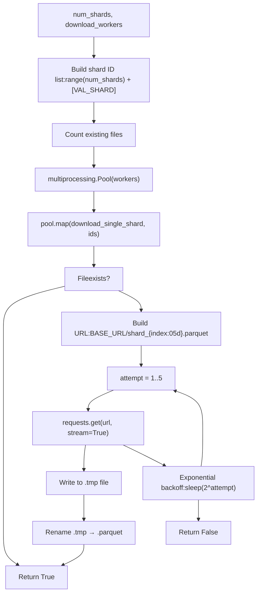
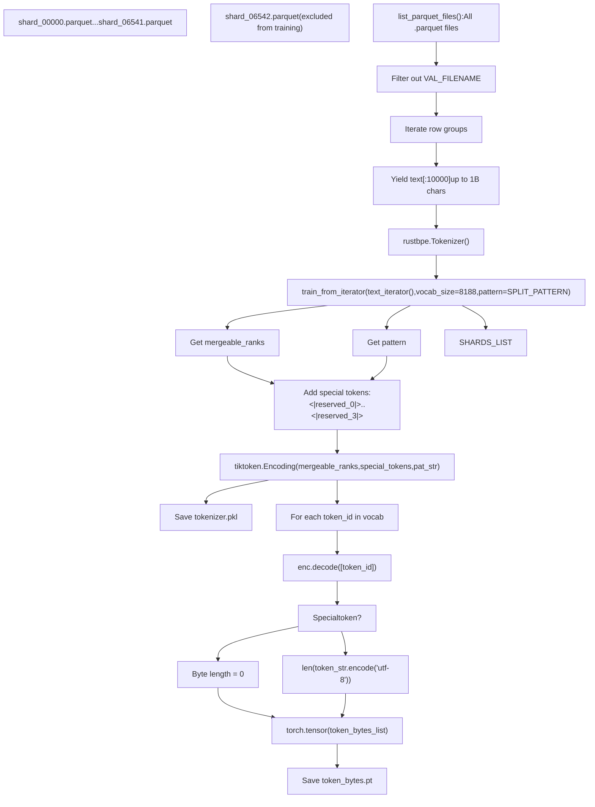
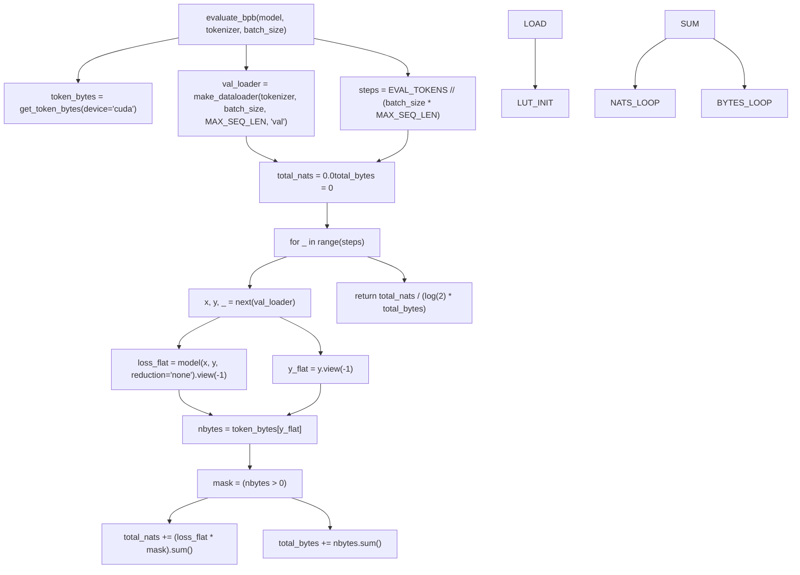

# prepare.py - 数据与评估

相关源文件

-   [prepare.py](https://github.com/karpathy/autoresearch/blob/e6d79c12/prepare.py)

`prepare.py` 是 autoresearch 的**不可变基础设施层**。它提供固定常量、一次性数据准备流程以及运行时工具函数，从而为所有实验建立统一规则。Agent 永远不会修改这个文件——它定义了实验运行的平台。

本页涵盖数据流水线、分词器训练、dataloader 实现和评估框架。关于使用这些工具函数的可变实验层，请参见 [train.py - The Mutable Core](/karpathy/autoresearch/3.1-train.py-the-mutable-core)。关于具体评估指标计算，请参见 [Validation Bits Per Byte (val\_bpb)](/karpathy/autoresearch/5.1-validation-bits-per-byte-(val_bpb))。

**来源：** [prepare.py1-10](https://github.com/karpathy/autoresearch/blob/e6d79c12/prepare.py#L1-L10) [README.md13-14](https://github.com/karpathy/autoresearch/blob/e6d79c12/README.md?plain=1#L13-L14)

---

## 在系统架构中的角色

`prepare.py` 文件在 autoresearch 生命周期中承担三个明确功能：

| 阶段 | 功能 | 输出 |
| --- | --- | --- |
| **一次性设置** | 下载数据分片、训练 BPE 分词器 | `~/.cache/autoresearch/` 工件 |
| **构建期导出** | 定义常量（MAX\_SEQ\_LEN、TIME\_BUDGET、EVAL\_TOKENS） | 被 train.py 导入的平台参数 |
| **运行期导出** | 提供工具函数（Tokenizer、make\_dataloader、evaluate\_bpb） | 训练期间调用的函数 |

关键架构原则是：**prepare.py 永不被 Agent 修改**。这可确保所有实验在相同数据、相同分词器以及相同指标计算方式下进行评估。即便 `train.py` 中模型架构、超参数或训练循环发生变化，也能保持公平可比。

**来源：** [prepare.py1-10](https://github.com/karpathy/autoresearch/blob/e6d79c12/prepare.py#L1-L10) [README.md13-65](https://github.com/karpathy/autoresearch/blob/e6d79c12/README.md?plain=1#L13-L65)

---

## 固定常量

以下常量定义了实验平台，并由 `train.py` 导入：

```
MAX_SEQ_LEN = 2048       # Context length for all experimentsTIME_BUDGET = 300        # Training duration in seconds (5 minutes wall clock)EVAL_TOKENS = 40 * 524288  # Validation tokens (~21M tokens)
```
**来源：** [prepare.py30-32](https://github.com/karpathy/autoresearch/blob/e6d79c12/prepare.py#L30-L32)

### 平台配置

额外常量用于配置数据源与分词器训练：

| 常量 | 值 | 用途 |
| --- | --- | --- |
| `CACHE_DIR` | `~/.cache/autoresearch` | 所有工件的根目录 |
| `DATA_DIR` | `{CACHE_DIR}/data` | Parquet 分片存储 |
| `TOKENIZER_DIR` | `{CACHE_DIR}/tokenizer` | 分词器工件 |
| `BASE_URL` | HuggingFace dataset URL | climbmix-400b-shuffle 的来源 |
| `MAX_SHARD` | 6542 | 可用分片总数 |
| `VAL_SHARD` | 6542 | 固定验证分片（shard\_06542.parquet） |
| `VOCAB_SIZE` | 8192 | BPE 词表大小 |

固定验证分片可确保所有实验在一致数据上评估。训练集由分片 0-6541 组成（若指定 `--num-shards`，则可为其子集）。

**来源：** [prepare.py38-52](https://github.com/karpathy/autoresearch/blob/e6d79c12/prepare.py#L38-L52)

---

## 一次性设置阶段

### 设置命令流程

```mermaid
flowchart TD
    CLI["uv run prepare.py[--num-shards N][--download-workers W]"]
    PARSE["argparse:num_shards=10download_workers=8"]
    DL_CHECK["All shardsdownloaded?"]
    DOWNLOAD["download_data()"]
    DL_SKIP["Skip download"]
    POOL["Pool(workers)"]
    SHARD1["download_single_shard(0)"]
    SHARD2["download_single_shard(1)"]
    SHARD3["download_single_shard(...)"]
    VALSH["download_single_shard(6542)"]
    RETRY1["Retry loop:max 5 attemptsexponential backoff"]
    RETRY2["Retry loop"]
    RETRY3["Retry loop"]
    RETRYV["Retry loop"]
    DATA_DONE["All shards in~/.cache/autoresearch/data/"]
    TOK_CHECK["Tokenizerexists?"]
    TRAIN_TOK["train_tokenizer()"]
    TOK_SKIP["Skip training"]
    ITER["text_iterator():Yield docs fromtraining shards"]
    RUSTBPE["rustbpe.train_from_iteratorvocab_size=8188SPLIT_PATTERN"]
    CONVERT["Convert to tiktoken.Encoding"]
    SAVE_TOK["Save tokenizer.pkl"]
    BUILD_LUT["Build token_byteslookup table"]
    SAVE_LUT["Save token_bytes.pt"]
    DONE["Ready to train"]

    CLI --> PARSE
    PARSE --> DL_CHECK
    DL --> CHECK_DOWNLOAD
    DL --> CHECK_DL_SKIP
    DOWNLOAD --> POOL
    POOL --> SHARD1
    POOL --> SHARD2
    POOL --> SHARD3
    POOL --> VALSH
    SHARD1 --> RETRY1
    SHARD2 --> RETRY2
    SHARD3 --> RETRY3
    VALSH --> RETRYV
    RETRY1 --> DATA_DONE
    RETRY2 --> DATA_DONE
    RETRY3 --> DATA_DONE
    RETRYV --> DATA_DONE
    DL --> SKIP_TOK_CHECK
    DATA --> DONE_TOK_CHECK
    TOK --> CHECK_TRAIN_TOK
    TOK --> CHECK_TOK_SKIP
    TRAIN --> TOK_ITER
    ITER --> RUSTBPE
    RUSTBPE --> CONVERT
    CONVERT --> SAVE_TOK
    SAVE --> TOK_BUILD_LUT
    BUILD --> LUT_SAVE_LUT
    SAVE --> LUT_DONE
    TOK --> SKIP_DONE
```


**图：一次性设置执行流程**

**来源：** [prepare.py371-389](https://github.com/karpathy/autoresearch/blob/e6d79c12/prepare.py#L371-L389) [prepare.py91-114](https://github.com/karpathy/autoresearch/blob/e6d79c12/prepare.py#L91-L114) [prepare.py141-203](https://github.com/karpathy/autoresearch/blob/e6d79c12/prepare.py#L141-L203)

---

## 数据下载流水线

### 下载函数

下载流水线使用并行 worker 和重试逻辑：


**图：带重试逻辑的并行下载**

验证分片（6542）总会下载，即使 `--num-shards` 更小，也能保证评估一致性。详情参见 [Data Pipeline](/karpathy/autoresearch/3.2.1-data-pipeline)。

**来源：** [prepare.py57-114](https://github.com/karpathy/autoresearch/blob/e6d79c12/prepare.py#L57-L114)

---

## 分词器训练流水线

### BPE 训练架构


**图：分词器训练与工件生成**

训练过程使用 `rustbpe` 库，并将结果转换为 `tiktoken.Encoding`。同时会构建 `token_bytes` 查询表，用于 BPB 指标计算。详情参见 [Tokenizer Training](/karpathy/autoresearch/3.2.2-tokenizer-training)。

**来源：** [prepare.py119-203](https://github.com/karpathy/autoresearch/blob/e6d79c12/prepare.py#L119-L203)

### 特殊 token 与 BOS 对齐

```
SPECIAL_TOKENS = [f"<|reserved_{i}|>" for i in range(4)]BOS_TOKEN = "<|reserved_0|>"
```
分词器保留 4 个特殊 token。`<|reserved_0|>` 作为 BOS（序列起始）token，由 dataloader 用于标记文档边界。特殊 token 在 `token_bytes` 查询表中的字节长度为 0，因此不计入 BPB 计算。

**来源：** [prepare.py50-51](https://github.com/karpathy/autoresearch/blob/e6d79c12/prepare.py#L50-L51) [prepare.py186-193](https://github.com/karpathy/autoresearch/blob/e6d79c12/prepare.py#L186-L193)

---

## 运行时导出

### Tokenizer 类

`Tokenizer` 类封装了 `tiktoken.Encoding`，供 `train.py` 使用：

| 方法 | 签名 | 用途 |
| --- | --- | --- |
| `from_directory()` | `cls, tokenizer_dir` → `Tokenizer` | 从 tokenizer.pkl 加载 |
| `get_vocab_size()` | `self` → `int` | 返回词表大小（8192） |
| `get_bos_token_id()` | `self` → `int` | 返回 BOS token ID |
| `encode()` | `self, text, prepend, num_threads` → `list[int]` or `list[list[int]]` | 对文本编码，可选追加 BOS |
| `decode()` | `self, ids` → `str` | 将 token IDs 解码为文本 |

**来源：** [prepare.py209-245](https://github.com/karpathy/autoresearch/blob/e6d79c12/prepare.py#L209-L245)

---

## BOS 对齐的最佳适配打包 Dataloader

### Dataloader 架构

```mermaid
flowchart TD
    PARAMS["Parameters:B = batch sizeT = sequence lengthsplit = 'train' or 'val'buffer_size = 1000"]
    INIT["Initialize:row_capacity = T + 1doc_buffer = []epoch = 1"]
    ALLOC["Preallocate buffers:row_buffer[B, T+1]cpu_buffer[2BT] (pinned)gpu_buffer[2BT] (CUDA)"]
    ROW_LOOP["for row_idx in range(B)"]
    POS["pos = 0"]
    FILL_CHECK["pos < T+1?"]
    BUF_CHECK["doc_buffer< buffer_size?"]
    REFILL["refill_buffer():- next(_document_batches)- tokenizer.encode(batch, prepend=BOS)- extend doc_buffer"]
    REMAIN["remaining = T+1 - pos"]
    BEST_FIT["Find largest doc wherelen(doc) <= remaining"]
    FOUND["Docfound?"]
    USE_BEST["doc = doc_buffer.pop(best_idx)row_buffer[row_idx, pos:pos+len(doc)] = docpos += len(doc)"]
    CROP["Find shortest docdoc = doc_buffer.pop(shortest_idx)row_buffer[row_idx, pos:pos+remaining] = doc[:remaining]pos += remaining"]
    COPY_CPU["cpu_inputs = row_buffer[:, :-1]cpu_targets = row_buffer[:, 1:]"]
    COPY_GPU["gpu_buffer.copy_(cpu_buffer, non_blocking=True)"]
    YIELD["yield inputs, targets, epoch"]

    PARAMS --> INIT
    INIT --> ALLOC
    ALLOC --> ROW_LOOP
    ROW --> LOOP_POS
    POS --> FILL_CHECK
    FILL --> CHECK_BUF_CHECK
    FILL --> CHECK_COPY_CPU
    BUF --> CHECK_REFILL
    BUF --> CHECK_REMAIN
    REFILL --> REMAIN
    REMAIN --> BEST_FIT
    BEST --> FIT_FOUND
    FOUND --> USE_BEST
    FOUND --> CROP
    USE --> BEST_FILL_CHECK
    CROP --> FILL_CHECK
    COPY --> CPU_COPY_GPU
    COPY --> GPU_YIELD
    YIELD --> ROW_LOOP
```


**图：BOS 对齐的最佳适配打包算法**

该 dataloader 实现了**BOS 对齐的最佳适配打包**，确保 100% token 利用率且无需 padding。详情参见 [Data Pipeline](/karpathy/autoresearch/3.2.1-data-pipeline)。

**来源：** [prepare.py276-337](https://github.com/karpathy/autoresearch/blob/e6d79c12/prepare.py#L276-L337)

---

## 评估框架

### evaluate\_bpb 函数

`evaluate_bpb()` 函数是所有实验的**固定真值指标**。为确保公平比较，绝不应修改。


**图：Bits per byte 评估计算**

BPB 指标**独立于词表大小**，可在不同分词策略之间进行公平比较。详情参见 [Evaluation Harness](/karpathy/autoresearch/3.2.3-evaluation-harness)。

**来源：** [prepare.py343-365](https://github.com/karpathy/autoresearch/blob/e6d79c12/prepare.py#L343-L365) [README.md17](https://github.com/karpathy/autoresearch/blob/e6d79c12/README.md?plain=1#L17-L17)

---

## 工件存储

所有工件均存储在 `~/.cache/autoresearch/`：

```
~/.cache/autoresearch/
├── data/
│   ├── shard_00000.parquet
│   ├── ...
│   └── shard_06542.parquet  (validation shard)
└── tokenizer/
    ├── tokenizer.pkl         (tiktoken.Encoding)
    └── token_bytes.pt        (torch.Tensor[vocab_size])
```
**来源：** [prepare.py38-40](https://github.com/karpathy/autoresearch/blob/e6d79c12/prepare.py#L38-L40) [README.md33-34](https://github.com/karpathy/autoresearch/blob/e6d79c12/README.md?plain=1#L33-L34)

---

## 不可变性设计动机

设计理念要求 `prepare.py` 保持**不可变**，原因如下：

| 原因 | 修改后的后果 |
| --- | --- |
| **公平比较** | 改动 MAX\_SEQ\_LEN 或 EVAL\_TOKENS 会使 val\_bpb 不可比 |
| **可复现性** | 不同分词器会产生不同 token 流 |
| **平台定义** | TIME\_BUDGET 定义了固定 5 分钟训练窗口 |
| **指标一致性** | 修改 evaluate\_bpb 可能人为提高分数 |

**来源：** [README.md13-65](https://github.com/karpathy/autoresearch/blob/e6d79c12/README.md?plain=1#L13-L65) [prepare.py1-10](https://github.com/karpathy/autoresearch/blob/e6d79c12/prepare.py#L1-L10)
