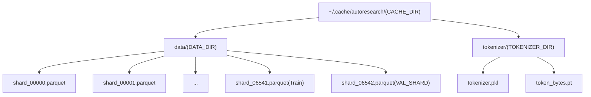
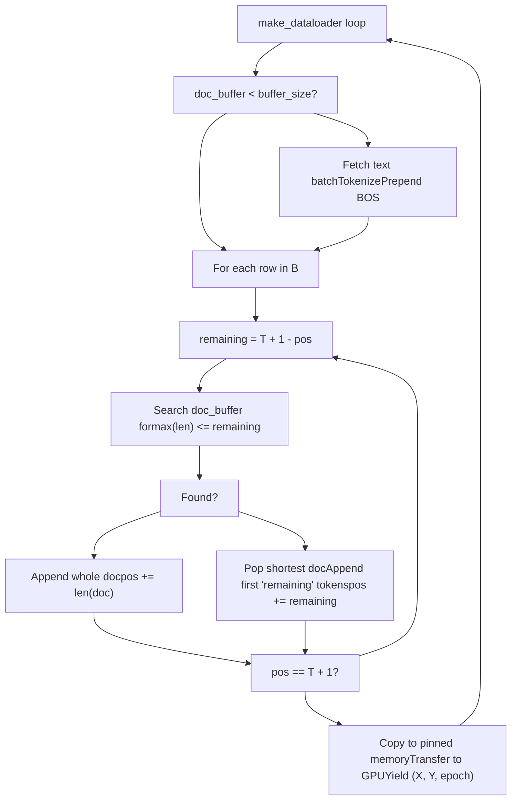

# 数据流水线

相关源文件

-   [prepare.py](https://github.com/karpathy/autoresearch/blob/e6d79c12/prepare.py)

## 目的与范围

本页记录 `prepare.py` 中的数据流水线，涵盖 autoresearch 系统在运行时如何下载、组织并加载训练数据。具体包括：数据集结构与存储、下载机制、训练/验证划分，以及 BOS 对齐的最佳适配打包 dataloader 实现。

该流水线设计为不可变；虽然 Agent 会修改 `train.py`，但 `prepare.py` 作为固定基础设施层保持不变，以确保所有实验在相同数据分布和序列长度下进行评估 [prepare.py27-32](https://github.com/karpathy/autoresearch/blob/e6d79c12/prepare.py#L27-L32)

## 数据集概览

autoresearch 系统使用来自 Hugging Face 的 `climbmix-400b-shuffle` 数据集，这是一个以 parquet 分片形式存储的大规模预训练语料。

### 数据集配置

| 参数 | 值 | 位置 |
| --- | --- | --- |
| Dataset Name | `climbmix-400b-shuffle` | [prepare.py41](https://github.com/karpathy/autoresearch/blob/e6d79c12/prepare.py#L41-L41) |
| Base URL | `https://huggingface.co/datasets/karpathy/climbmix-400b-shuffle/resolve/main` | [prepare.py41](https://github.com/karpathy/autoresearch/blob/e6d79c12/prepare.py#L41-L41) |
| Total Shards | 6543（索引 0-6542） | [prepare.py42](https://github.com/karpathy/autoresearch/blob/e6d79c12/prepare.py#L42-L42) |
| Shard Format | Parquet（`.parquet`） | [prepare.py59](https://github.com/karpathy/autoresearch/blob/e6d79c12/prepare.py#L59-L59) |
| Cache Location | `~/.cache/autoresearch/data/` | [prepare.py38-39](https://github.com/karpathy/autoresearch/blob/e6d79c12/prepare.py#L38-L39) |
| Training Shards | 0-6541（除最后一片外全部） | [prepare.py94-95](https://github.com/karpathy/autoresearch/blob/e6d79c12/prepare.py#L94-L95) |
| Validation Shard | 6542（固定最后一片） | [prepare.py43-44](https://github.com/karpathy/autoresearch/blob/e6d79c12/prepare.py#L43-L44) |

训练/验证划分是确定性的：最后一个分片（`shard_06542.parquet`）被保留为验证集 [prepare.py43-44](https://github.com/karpathy/autoresearch/blob/e6d79c12/prepare.py#L43-L44) 这保证了所有实验评估的一致性。

**来源：** [prepare.py38-44](https://github.com/karpathy/autoresearch/blob/e6d79c12/prepare.py#L38-L44) [prepare.py91-98](https://github.com/karpathy/autoresearch/blob/e6d79c12/prepare.py#L91-L98)

---

## 缓存目录结构

所有下载数据与生成的分词器工件都存储在持久化缓存目录中，以避免实验间重复下载与重复计算。

### 目录布局

```
~/.cache/autoresearch/
├── data/
│   ├── shard_00000.parquet
│   ├── shard_00001.parquet
│   ├── ...
│   ├── shard_06541.parquet
│   └── shard_06542.parquet    # VAL_SHARD
└── tokenizer/
    ├── tokenizer.pkl          # tiktoken Encoding
    └── token_bytes.pt         # torch.Tensor for BPB calc
```
`CACHE_DIR` 常量定义根缓存位置 [prepare.py38](https://github.com/karpathy/autoresearch/blob/e6d79c12/prepare.py#L38-L38) `DATA_DIR` 包含原始 parquet 分片 [prepare.py39](https://github.com/karpathy/autoresearch/blob/e6d79c12/prepare.py#L39-L39) 而 `TOKENIZER_DIR` 保存 BPE 模型与 token 字节长度查找表 [prepare.py40](https://github.com/karpathy/autoresearch/blob/e6d79c12/prepare.py#L40-L40)

**图：缓存目录结构**


**来源：** [prepare.py38-44](https://github.com/karpathy/autoresearch/blob/e6d79c12/prepare.py#L38-L44) [prepare.py143-144](https://github.com/karpathy/autoresearch/blob/e6d79c12/prepare.py#L143-L144)

---

## 下载机制

数据流水线通过 `download_data` 执行 parquet 分片下载，支持并行与自动重试。

### 下载函数

#### `download_single_shard(index)`

下载单个 parquet 分片，并带有重试逻辑 [prepare.py57-88](https://github.com/karpathy/autoresearch/blob/e6d79c12/prepare.py#L57-L88)

-   **幂等**：若文件已存在则跳过下载 [prepare.py61-62](https://github.com/karpathy/autoresearch/blob/e6d79c12/prepare.py#L61-L62)
-   **重试逻辑**：最多 5 次尝试，采用指数退避（`2 ** attempt`）[prepare.py65-87](https://github.com/karpathy/autoresearch/blob/e6d79c12/prepare.py#L65-L87)
-   **原子写入**：先流式写入 `.tmp` 文件，成功后重命名，避免损坏的半成品文件 [prepare.py70-75](https://github.com/karpathy/autoresearch/blob/e6d79c12/prepare.py#L70-L75)

#### `download_data(num_shards, download_workers=8)`

使用 `multiprocessing.Pool` 编排多分片并行下载 [prepare.py91-113](https://github.com/karpathy/autoresearch/blob/e6d79c12/prepare.py#L91-L113) 同时确保固定 `VAL_SHARD` 始终包含在下载列表中 [prepare.py96-97](https://github.com/karpathy/autoresearch/blob/e6d79c12/prepare.py#L96-L97)

**图：下载流程**

> **[Mermaid sequence]**
> *(图表结构无法解析)*

**来源：** [prepare.py57-113](https://github.com/karpathy/autoresearch/blob/e6d79c12/prepare.py#L57-L113)

---

## 运行时数据加载

在训练与评估期间，`prepare.py` 提供一个无限迭代器以输出文档批次。

### `_document_batches(split, tokenizer_batch_size=128)`

这是一个无限生成器，按批次产出原始文本字符串 [prepare.py243-258](https://github.com/karpathy/autoresearch/blob/e6d79c12/prepare.py#L243-L258)

-   **划分逻辑**：若 `split="train"`，则排除 `VAL_FILENAME` [prepare.py246](https://github.com/karpathy/autoresearch/blob/e6d79c12/prepare.py#L246-L246) 若 `split="val"`，则*仅*使用 `VAL_FILENAME` [prepare.py247](https://github.com/karpathy/autoresearch/blob/e6d79c12/prepare.py#L247-L247)
-   **迭代方式**：按顺序读取分片，并在分片内按 row group 读取，基于 `pyarrow.parquet` [prepare.py249-253](https://github.com/karpathy/autoresearch/blob/e6d79c12/prepare.py#L249-L253)
-   **Epoch 追踪**：每遍历完当前 split 的分片列表，`epoch` 计数器加一 [prepare.py248-258](https://github.com/karpathy/autoresearch/blob/e6d79c12/prepare.py#L248-L258)

**来源：** [prepare.py243-258](https://github.com/karpathy/autoresearch/blob/e6d79c12/prepare.py#L243-L258)

---

## BOS 对齐的最佳适配打包 Dataloader

`make_dataloader()` 函数实现了一种打包算法：在保证每条序列都以 BOS token 开始的同时，实现 100% token 利用率（无 padding）。

### 设计理念

该 dataloader 维持三条不变量：

1.  **BOS 对齐**：批内每一行都以 `<|reserved_0|>`（BOS）token 开头 [prepare.py51-278](https://github.com/karpathy/autoresearch/blob/e6d79c12/prepare.py#L51-L278)
2.  **最佳适配打包**：为最小化文档裁剪，loader 会尝试将完整文档装入序列剩余空间 [prepare.py302-308](https://github.com/karpathy/autoresearch/blob/e6d79c12/prepare.py#L302-L308)
3.  **100% 利用率**：若无文档可完整放入，则裁剪当前最短文档以恰好填满序列 [prepare.py310-316](https://github.com/karpathy/autoresearch/blob/e6d79c12/prepare.py#L310-L316)

### 打包算法实现

loader 维护一个由已分词文档组成的 `doc_buffer` [prepare.py269](https://github.com/karpathy/autoresearch/blob/e6d79c12/prepare.py#L269-L269)

1.  **回填**：当缓冲区低于 `buffer_size`（默认 1000）时，拉取更多文本批次、进行分词并前置 BOS token [prepare.py271-278](https://github.com/karpathy/autoresearch/blob/e6d79c12/prepare.py#L271-L278)
2.  **打包循环**：对 batch 中每一行：
    -   计算 `remaining` 剩余空间 [prepare.py300](https://github.com/karpathy/autoresearch/blob/e6d79c12/prepare.py#L300-L300)
    -   线性搜索缓冲区中“长度不超过 `remaining` 的最长文档” [prepare.py302-305](https://github.com/karpathy/autoresearch/blob/e6d79c12/prepare.py#L302-L305)
    -   若找到，则弹出并附加该文档 [prepare.py306-308](https://github.com/karpathy/autoresearch/blob/e6d79c12/prepare.py#L306-L308)
    -   若未找到，则弹出最短文档并裁剪到恰好填满 [prepare.py310-316](https://github.com/karpathy/autoresearch/blob/e6d79c12/prepare.py#L310-L316)
3.  **目标生成**：目标序列就是输入左移一位 [prepare.py320](https://github.com/karpathy/autoresearch/blob/e6d79c12/prepare.py#L320-L320)

**图：最佳适配打包逻辑**


**来源：** [prepare.py260-321](https://github.com/karpathy/autoresearch/blob/e6d79c12/prepare.py#L260-L321)

---

## 内存布局与固定内存传输

为最大化训练吞吐，dataloader 使用预分配的 pinned memory 缓冲区进行异步 CPU→GPU 传输。

-   **`cpu_buffer`**：一个 pinned `torch.Tensor`，大小为 `2 * B * T` [prepare.py281](https://github.com/karpathy/autoresearch/blob/e6d79c12/prepare.py#L281-L281)
-   **`gpu_buffer`**：相同大小的 CUDA `torch.Tensor` [prepare.py282](https://github.com/karpathy/autoresearch/blob/e6d79c12/prepare.py#L282-L282)
-   **视图**：`cpu_inputs` 与 `cpu_targets` 是 pinned buffer 上的视图 [prepare.py284-285](https://github.com/karpathy/autoresearch/blob/e6d79c12/prepare.py#L284-L285)

当 batch 准备就绪后，数据先复制到 pinned CPU buffer，再通过 `non_blocking=True` 传输到 GPU [prepare.py319-321](https://github.com/karpathy/autoresearch/blob/e6d79c12/prepare.py#L319-L321) 这样 CPU 可以在 GPU 处理当前批次时并行打包下一批次。

**来源：** [prepare.py280-321](https://github.com/karpathy/autoresearch/blob/e6d79c12/prepare.py#L280-L321)

---

## 常量汇总

| 常量 | 值 | 描述 |
| --- | --- | --- |
| `MAX_SEQ_LEN` | 2048 | dataloader 使用的上下文长度 `T` [prepare.py30](https://github.com/karpathy/autoresearch/blob/e6d79c12/prepare.py#L30-L30) |
| `BOS_TOKEN` | \`< | reserved\_0 |
| `VOCAB_SIZE` | 8192 | 包含特殊 token 在内的词表总大小 [prepare.py45](https://github.com/karpathy/autoresearch/blob/e6d79c12/prepare.py#L45-L45) |
| `EVAL_TOKENS` | 20,971,520 | 用于 `val_bpb` 计算的固定 token 数 [prepare.py32](https://github.com/karpathy/autoresearch/blob/e6d79c12/prepare.py#L32-L32) |

**来源：** [prepare.py30-51](https://github.com/karpathy/autoresearch/blob/e6d79c12/prepare.py#L30-L51)
