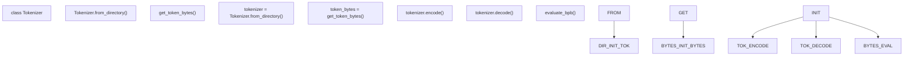

# Tokenizer 训练

相关源文件

-   [prepare.py](https://github.com/karpathy/autoresearch/blob/e6d79c12/prepare.py)

本页记录 autoresearch 中一次性的 BPE tokenizer 训练流程。tokenizer 会在初次执行 `prepare.py` 时完成训练，并作为不可变基础设施保存下来供后续所有实验使用。

关于 `train.py` 中的运行时 tokenizer 使用，请参见 [数据流水线](/karpathy/autoresearch/3.2.1-data-pipeline)。关于依赖 tokenizer 的评估指标，请参见 [评估框架](/karpathy/autoresearch/3.2.3-evaluation-harness)。

## 概览

tokenizer 训练流程发生在 `train_tokenizer()` 函数 [prepare.py141-196](https://github.com/karpathy/autoresearch/blob/e6d79c12/prepare.py#L141-L196) 中，由三个阶段组成：

1.  **BPE 训练**：使用 `rustbpe` 在训练数据分片上训练 byte-pair encoding tokenizer。
2.  **Tiktoken 转换**：将训练得到的 merges 转换为 `tiktoken.Encoding` 对象，以提升运行时效率。
3.  **字节查找表生成**：构建 `token_bytes.pt` tensor，将 token ID 映射到其 UTF-8 字节长度，用于 BPB 评估。

所有输出都保存到 `~/.cache/autoresearch/tokenizer/` [prepare.py40](https://github.com/karpathy/autoresearch/blob/e6d79c12/prepare.py#L40-L40)，并在所有实验中复用。tokenizer 只训练一次，且不会被自主 agent 修改。

**来源**： [prepare.py38-40](https://github.com/karpathy/autoresearch/blob/e6d79c12/prepare.py#L38-L40) [prepare.py141-203](https://github.com/karpathy/autoresearch/blob/e6d79c12/prepare.py#L141-L203)

## 训练工作流

下图展示了从数据分片到运行时产物的完整 tokenizer 训练流水线，并将系统函数映射到其生成实体：

```mermaid
flowchart TD
    SHARDS["Training Parquet Shards(exclude VAL_FILENAME)"]
    CONFIG["Configuration ConstantsVOCAB_SIZE=8192SPLIT_PATTERNSPECIAL_TOKENS"]
    TEXT_ITER["text_iterator()Yield documentsmax_chars=1B"]
    RUSTBPE["rustbpe.Tokenizer()train_from_iterator()"]
    MERGES["mergeable_ranks dictbytes → rank"]
    SPECIAL_MAP["special_tokens dictname → token_id"]
    TK_ENC["tiktoken.Encodingname='rustbpe'pat_str=patternmergeable_ranksspecial_tokens"]
    PICKLE["tokenizer.pklPickled Encoding object"]
    DECODE_LOOP["For each token_idin range(enc.n_vocab)"]
    GET_BYTES["enc.decode([token_id]).encode('utf-8')len()"]
    TENSOR["token_bytes_listdtype=int32"]
    SAVE_PT["token_bytes.pttorch.save()"]
    PKL_OUT["tokenizer.pkl~164 KB"]
    PT_OUT["token_bytes.pt~32 KB"]

    SHARDS --> TEXT_ITER
    CONFIG --> RUSTBPE
    TEXT --> ITER_RUSTBPE
    RUSTBPE --> MERGES
    CONFIG --> SPECIAL_MAP
    MERGES --> TK_ENC
    SPECIAL --> MAP_TK_ENC
    TK --> ENC_PICKLE
    PICKLE --> PKL_OUT
    TK --> ENC_DECODE_LOOP
    DECODE --> LOOP_GET_BYTES
    GET --> BYTES_TENSOR
    TENSOR --> SAVE_PT
    SAVE --> PT_PT_OUT
```


**来源**： [prepare.py119-203](https://github.com/karpathy/autoresearch/blob/e6d79c12/prepare.py#L119-L203)

## 阶段 1：使用 rustbpe 进行 BPE 训练

第一阶段使用 `rustbpe` 库 [prepare.py22](https://github.com/karpathy/autoresearch/blob/e6d79c12/prepare.py#L22-L22) 训练 BPE tokenizer，该库提供了 byte-pair encoding 的高性能 Rust 实现。

### 文本迭代

`text_iterator()` 函数 [prepare.py125-139](https://github.com/karpathy/autoresearch/blob/e6d79c12/prepare.py#L125-L139) 从训练 parquet 分片中流式读取文档，并排除固定的验证分片：

```
# prepare.py:125-138def text_iterator(max_chars=1_000_000_000, doc_cap=10_000):    """Yield documents from training split (all shards except pinned val shard)."""    parquet_paths = [p for p in list_parquet_files() if not p.endswith(VAL_FILENAME)]    # ... yields up to 1 billion characters
```
每个文档最多保留 10,000 个字符，以防止超长文档主导训练数据。迭代器在总计处理 10 亿字符后终止 [prepare.py137-138](https://github.com/karpathy/autoresearch/blob/e6d79c12/prepare.py#L137-L138)

**来源**： [prepare.py125-139](https://github.com/karpathy/autoresearch/blob/e6d79c12/prepare.py#L125-L139)

### rustbpe 训练调用

核心训练操作使用 `rustbpe.Tokenizer.train_from_iterator()` [prepare.py163](https://github.com/karpathy/autoresearch/blob/e6d79c12/prepare.py#L163-L163)：

```
# prepare.py:161-163tokenizer = rustbpe.Tokenizer()vocab_size_no_special = VOCAB_SIZE - len(SPECIAL_TOKENS)tokenizer.train_from_iterator(text_iterator(), vocab_size_no_special, pattern=SPLIT_PATTERN)
```
| 参数 | 值 | 作用 |
| --- | --- | --- |
| `vocab_size` | 8188 | `VOCAB_SIZE` (8192) 减去 4 个 special token [prepare.py45-162](https://github.com/karpathy/autoresearch/blob/e6d79c12/prepare.py#L45-L162) |
| `pattern` | GPT-4 风格正则 | 定义 token 边界 [prepare.py48](https://github.com/karpathy/autoresearch/blob/e6d79c12/prepare.py#L48-L48) |
| Training data | ~1B characters | 训练分片的子集 [prepare.py125](https://github.com/karpathy/autoresearch/blob/e6d79c12/prepare.py#L125-L125) |

**来源**： [prepare.py45-51](https://github.com/karpathy/autoresearch/blob/e6d79c12/prepare.py#L45-L51) [prepare.py161-163](https://github.com/karpathy/autoresearch/blob/e6d79c12/prepare.py#L161-L163)

### 分割模式

分割模式 [prepare.py48](https://github.com/karpathy/autoresearch/blob/e6d79c12/prepare.py#L48-L48) 定义了在 BPE merge 之前如何切分文本：

```
# prepare.py:48SPLIT_PATTERN = r"""'(?i:[sdmt]|ll|ve|re)|[^\r\n\p{L}\p{N}]?+\p{L}+|\p{N}{1,2}| ?[^\s\p{L}\p{N}]++[\r\n]*|\s*[\r\n]|\s+(?!\S)|\s+"""
```
该 GPT-4 风格模式可以处理缩写、字母序列和空白符。值得注意的是，它对数字使用 `\p{N}{1,2}`（每段 1-2 位）而不是 GPT-4 的 1-3 [prepare.py47-48](https://github.com/karpathy/autoresearch/blob/e6d79c12/prepare.py#L47-L48)

**来源**： [prepare.py47-48](https://github.com/karpathy/autoresearch/blob/e6d79c12/prepare.py#L47-L48)

### 特殊 token

定义了 4 个保留 special token [prepare.py50-51](https://github.com/karpathy/autoresearch/blob/e6d79c12/prepare.py#L50-L51)：

| Token | ID | Purpose |
| --- | --- | --- |
| \`< | reserved\_0 | \>\` |
| \`< | reserved\_1 | \>\` |
| \`< | reserved\_2 | \>\` |
| \`< | reserved\_3 | \>\` |

这些 token 会在所有 BPE merge 完成后分配 ID，占据末尾索引，以达到目标 `VOCAB_SIZE` 8192 [prepare.py168-169](https://github.com/karpathy/autoresearch/blob/e6d79c12/prepare.py#L168-L169)

**来源**： [prepare.py50-51](https://github.com/karpathy/autoresearch/blob/e6d79c12/prepare.py#L50-L51) [prepare.py168-169](https://github.com/karpathy/autoresearch/blob/e6d79c12/prepare.py#L168-L169)

## 阶段 2：Tiktoken 转换

`rustbpe` 训练完成后，学习到的 merges 会被转换为 `tiktoken.Encoding` 对象 [prepare.py170-175](https://github.com/karpathy/autoresearch/blob/e6d79c12/prepare.py#L170-L175)，以提升运行时效率。

```
# prepare.py:166-179pattern = tokenizer.get_pattern()mergeable_ranks = {bytes(k): v for k, v in tokenizer.get_mergeable_ranks()}tokens_offset = len(mergeable_ranks)special_tokens = {name: tokens_offset + i for i, name in enumerate(SPECIAL_TOKENS)}enc = tiktoken.Encoding(    name="rustbpe",    pat_str=pattern,    mergeable_ranks=mergeable_ranks,    special_tokens=special_tokens,)with open(tokenizer_pkl, "wb") as f:    pickle.dump(enc, f)
```
`tiktoken.Encoding` 对象提供编码与解码的高性能 C++ 实现，使其在运行时显著快于纯 Python。

**来源**： [prepare.py166-179](https://github.com/karpathy/autoresearch/blob/e6d79c12/prepare.py#L166-L179)

## 阶段 3：token 字节查找表生成

最后阶段会构建一个查找表，将每个 token ID 映射到其 UTF-8 字节长度 [prepare.py185-196](https://github.com/karpathy/autoresearch/blob/e6d79c12/prepare.py#L185-L196) 这对于与词表大小无关的 BPB 评估指标至关重要。

### 字节计数流程

对于词表中的每个 token，系统先将 token ID 解码为字符串，再以 UTF-8 编码并统计字节长度 [prepare.py189-193](https://github.com/karpathy/autoresearch/blob/e6d79c12/prepare.py#L189-L193) special token 会映射为 0 字节，确保它们不会影响 BPB 分母 [prepare.py191-192](https://github.com/karpathy/autoresearch/blob/e6d79c12/prepare.py#L191-L192)

```
# prepare.py:186-194special_set = set(SPECIAL_TOKENS)token_bytes_list = []for token_id in range(enc.n_vocab):    token_str = enc.decode([token_id])    if token_str in special_set:        token_bytes_list.append(0)    else:        token_bytes_list.append(len(token_str.encode("utf-8")))token_bytes_tensor = torch.tensor(token_bytes_list, dtype=torch.int32)
```
**来源**： [prepare.py186-194](https://github.com/karpathy/autoresearch/blob/e6d79c12/prepare.py#L186-L194)

### 输出产物

tensor 会保存为 `token_bytes.pt` [prepare.py196](https://github.com/karpathy/autoresearch/blob/e6d79c12/prepare.py#L196-L196) 运行时通过 `get_token_bytes()` [prepare.py248-251](https://github.com/karpathy/autoresearch/blob/e6d79c12/prepare.py#L248-L251) 加载：

```
# prepare.py:248-251def get_token_bytes(device="cpu"):    path = os.path.join(TOKENIZER_DIR, "token_bytes.pt")    with open(path, "rb") as f:        return torch.load(f, map_location=device)
```
**来源**： [prepare.py195-196](https://github.com/karpathy/autoresearch/blob/e6d79c12/prepare.py#L195-L196) [prepare.py248-251](https://github.com/karpathy/autoresearch/blob/e6d79c12/prepare.py#L248-L251)

## 运行时集成

训练好的 tokenizer 产物在运行时通过 `Tokenizer` 类封装进行消费 [prepare.py209-245](https://github.com/karpathy/autoresearch/blob/e6d79c12/prepare.py#L209-L245)


### Tokenizer 类

`Tokenizer` 类为 `tiktoken.Encoding` 对象提供了一个最小封装：

| Method | Purpose | Code Reference |
| --- | --- | --- |
| `from_directory()` | 从 `TOKENIZER_DIR` 加载 pickled encoding | [prepare.py214-220](https://github.com/karpathy/autoresearch/blob/e6d79c12/prepare.py#L214-L220) |
| `get_vocab_size()` | 返回总词表大小（8192） | [prepare.py222-223](https://github.com/karpathy/autoresearch/blob/e6d79c12/prepare.py#L222-L223) |
| `get_bos_token_id()` | 返回 `\`< | reserved\_0 | 的 ID |
| `encode()` | 文本 token 化（可选添加 BOS） | [prepare.py228-241](https://github.com/karpathy/autoresearch/blob/e6d79c12/prepare.py#L228-L241) |
| `decode()` | 将 token ID 反 token 化为字符串 | [prepare.py243-245](https://github.com/karpathy/autoresearch/blob/e6d79c12/prepare.py#L243-L245) |

**来源**： [prepare.py209-245](https://github.com/karpathy/autoresearch/blob/e6d79c12/prepare.py#L209-L245)

### BPB 评估依赖

`token_bytes.pt` 文件对 `evaluate_bpb()` 函数 [prepare.py343-365](https://github.com/karpathy/autoresearch/blob/e6d79c12/prepare.py#L343-L365) 至关重要，该函数计算与词表大小无关的评估指标。通过为每个目标 token 使用真实字节数 [prepare.py361](https://github.com/karpathy/autoresearch/blob/e6d79c12/prepare.py#L361-L361)，即便 agent 修改了架构参数，该指标也仍具可比性。

**来源**： [prepare.py352](https://github.com/karpathy/autoresearch/blob/e6d79c12/prepare.py#L352-L352) [prepare.py361-362](https://github.com/karpathy/autoresearch/blob/e6d79c12/prepare.py#L361-L362)

## 合理性检查

训练与转换完成后，会通过一次往返（roundtrip）合理性检查验证正确性 [prepare.py199-203](https://github.com/karpathy/autoresearch/blob/e6d79c12/prepare.py#L199-L203)：

```
# prepare.py:199-203test = "Hello world! Numbers: 123. Unicode: 你好"encoded = enc.encode_ordinary(test)decoded = enc.decode(encoded)assert decoded == test, f"Tokenizer roundtrip failed: {test!r} -> {decoded!r}"
```
这可确保最终的 `tiktoken.Encoding` 对象能够准确重建原始文本，包括 Unicode 字符和数字。

**来源**： [prepare.py198-203](https://github.com/karpathy/autoresearch/blob/e6d79c12/prepare.py#L198-L203)
