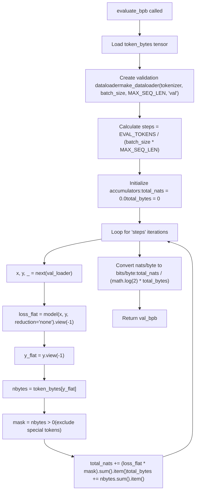
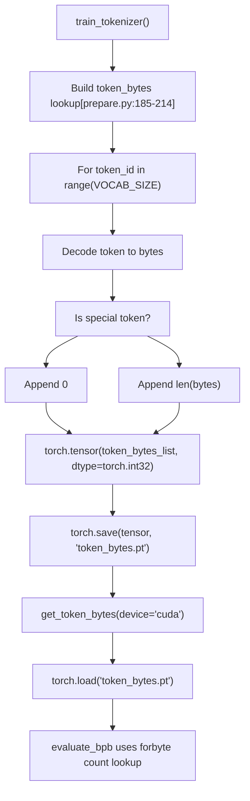
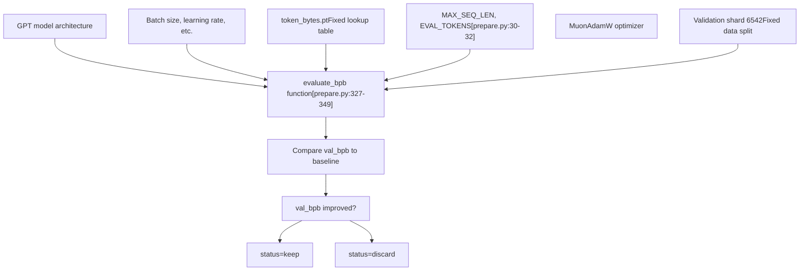

# 评估框架

相关源文件

-   [prepare.py](https://github.com/karpathy/autoresearch/blob/e6d79c12/prepare.py)

## 目的与范围

评估框架是固定且不可变的评估系统，它通过 [prepare.py327-349](https://github.com/karpathy/autoresearch/blob/e6d79c12/prepare.py#L327-L349) 中的 `evaluate_bpb` 函数衡量模型性能。该函数计算 **bits per byte (BPB)** 指标，该指标与词表大小无关，因此可以在修改模型架构、tokenizer 词表大小或 `train.py` 其他任意部分的实验之间进行公平比较。

本页记录评估框架的实现与指标计算。关于 BPB 指标的数学性质以及为何越低越好，请参见 [Validation Bits Per Byte (val\_bpb)](/karpathy/autoresearch/5.1-validation-bits-per-byte-(val_bpb))。关于包含 tokenizer 训练与 dataloader 的更广泛数据流水线，请参见 [prepare.py - Data and Evaluation](/karpathy/autoresearch/3.2-prepare.py-data-and-evaluation)。

**来源：** [prepare.py1-374](https://github.com/karpathy/autoresearch/blob/e6d79c12/prepare.py#L1-L374) [README.md22](https://github.com/karpathy/autoresearch/blob/e6d79c12/README.md?plain=1#L22-L22)

---

## `evaluate_bpb` 函数

评估框架由一个单一函数实现，它作为所有实验不可变的性能指标：

```
@torch.no_grad()def evaluate_bpb(model, tokenizer, batch_size):
```
**位置：** [prepare.py327-349](https://github.com/karpathy/autoresearch/blob/e6d79c12/prepare.py#L327-L349)

**参数：**

-   `model`：待评估的 GPT 模型实例（来自 `train.py`）。
-   `tokenizer`：tokenizer 实例（用于创建验证 dataloader）。
-   `batch_size`：并行处理的序列数。

**返回值：** `float` — 验证集上的 bits per byte（越低越好）。

**来源：** [prepare.py327-349](https://github.com/karpathy/autoresearch/blob/e6d79c12/prepare.py#L327-L349)

---

## 评估流程

评估过程遵循以下步骤：

**图：评估逻辑流程**


**来源：** [prepare.py327-349](https://github.com/karpathy/autoresearch/blob/e6d79c12/prepare.py#L327-L349)

---

## BPB 指标计算

### 为什么使用 Bits Per Byte

BPB 指标以**独立于词表大小**的方式衡量模型性能。这一点至关重要，因为：

1.  agent 可以在 `train.py` 中修改 tokenizer 词表大小。
2.  不同架构可能受益于不同的词表大小。
3.  像 perplexity 这样的标准指标会随词表大小变化。
4.  BPB 按实际被预测的字节内容进行归一化。

### 计算公式

BPB 计算遵循以下步骤：

| 步骤 | 操作 | 单位 |
| --- | --- | --- |
| 1\. 前向传播 | `model(x, y, reduction='none')` | nats per token |
| 2\. 字节查找 | `token_bytes[y_flat]` | bytes per token |
| 3\. 屏蔽 special token | `nbytes > 0` | boolean mask |
| 4\. 求和 nats | `(loss_flat * mask).sum()` | total nats |
| 5\. 求和 bytes | `nbytes.sum()` | total bytes |
| 6\. 转换为 bits/byte | `nats / (log(2) * bytes)` | bits per byte |

从 nats（自然对数单位）到 bits 的转换使用系数 `1 / math.log(2)` ≈ 1.4427。

**来源：** [prepare.py336-349](https://github.com/karpathy/autoresearch/blob/e6d79c12/prepare.py#L336-L349)

### special token 处理

special token（在 [prepare.py50](https://github.com/karpathy/autoresearch/blob/e6d79c12/prepare.py#L50-L50) 中定义为 `<|reserved_0|>` 到 `<|reserved_3|>`）会在 tokenizer 训练期间被赋予 0 字节 [prepare.py186-214](https://github.com/karpathy/autoresearch/blob/e6d79c12/prepare.py#L186-L214) 评估框架会显式排除这些 token：

```
mask = nbytes > 0  # Exclude special tokens (byte length 0)total_nats += (loss_flat * mask).sum().item()total_bytes += nbytes.sum().item()
```
这可确保 BOS token 和其他 special token 不会人为抬高或压低该指标。

**来源：** [prepare.py346-348](https://github.com/karpathy/autoresearch/blob/e6d79c12/prepare.py#L346-L348) [prepare.py186-214](https://github.com/karpathy/autoresearch/blob/e6d79c12/prepare.py#L186-L214)

---

## token 字节查找

### `token_bytes.pt` tensor

`token_bytes` tensor 是 tokenizer 训练期间创建的关键组件：

**图：Token Bytes 的生成与消费**


**创建：** [prepare.py185-214](https://github.com/karpathy/autoresearch/blob/e6d79c12/prepare.py#L185-L214)
**加载：** [prepare.py237-240](https://github.com/karpathy/autoresearch/blob/e6d79c12/prepare.py#L237-L240)
**使用：** [prepare.py336](https://github.com/karpathy/autoresearch/blob/e6d79c12/prepare.py#L336-L336)

### 查找机制

该查找过程非常高效：

```
token_bytes = get_token_bytes(device="cuda")  # Load once# ... in evaluation loop:y_flat = y.view(-1)           # Shape: [batch_size * seq_len]nbytes = token_bytes[y_flat]  # Vectorized lookup, same shape
```
这个单次索引操作可以一次性把所有目标 token ID 转换为对应字节数。

**来源：** [prepare.py237-240](https://github.com/karpathy/autoresearch/blob/e6d79c12/prepare.py#L237-L240) [prepare.py344-346](https://github.com/karpathy/autoresearch/blob/e6d79c12/prepare.py#L344-L346)

---

## 固定评估参数

评估框架使用 [prepare.py30-32](https://github.com/karpathy/autoresearch/blob/e6d79c12/prepare.py#L30-L32) 中的常量以确保一致性：

| 参数 | 值 | 来源 | 作用 |
| --- | --- | --- | --- |
| `MAX_SEQ_LEN` | 2048 | [prepare.py30](https://github.com/karpathy/autoresearch/blob/e6d79c12/prepare.py#L30-L30) | 验证 batch 的序列长度 |
| `EVAL_TOKENS` | 20,971,520 | [prepare.py32](https://github.com/karpathy/autoresearch/blob/e6d79c12/prepare.py#L32-L32) | 要评估的总 token 数（40 \* 524288） |
| `VAL_SHARD` | 6542 | [prepare.py43](https://github.com/karpathy/autoresearch/blob/e6d79c12/prepare.py#L43-L43) | 固定的验证分片索引 |

### 评估步数

处理的 batch 数是确定性的：

```
steps = EVAL_TOKENS // (batch_size * MAX_SEQ_LEN)
```
这确保每个实验都在**完全相同的数据量**上评估，而不受 `train.py` 中所选 batch size 的影响。

**来源：** [prepare.py338](https://github.com/karpathy/autoresearch/blob/e6d79c12/prepare.py#L338-L338) [prepare.py32](https://github.com/karpathy/autoresearch/blob/e6d79c12/prepare.py#L32-L32)

---

## 不可变性与公平比较

### 为什么框架不能被修改

评估框架被明确设定为**不可变**——agent 和研究者都不能修改它。这个设计选择是 autoresearch 系统的基础：

**图：系统边界与指标流**


**来源：** [README.md17-18](https://github.com/karpathy/autoresearch/blob/e6d79c12/README.md?plain=1#L17-L18) [prepare.py324-325](https://github.com/karpathy/autoresearch/blob/e6d79c12/prepare.py#L324-L325)

### 公平比较保证

通过保持评估框架不可变，系统可保证：

1.  **相同的指标定义** —— 所有实验使用一致的 BPB 计算方法。
2.  **相同的数据划分** —— 所有实验都在分片 6542 上评估。
3.  **相同的 token 数量** —— 所有实验都处理完全一致的 `EVAL_TOKENS`。
4.  **相同的序列长度** —— 所有实验都使用 `MAX_SEQ_LEN` 进行验证。
5.  **词表大小无关** —— 可以公平比较与词表相关的架构变化。

**来源：** [README.md22-23](https://github.com/karpathy/autoresearch/blob/e6d79c12/README.md?plain=1#L22-L23) [prepare.py324-325](https://github.com/karpathy/autoresearch/blob/e6d79c12/prepare.py#L324-L325)

---

## 实现深度解析

### 完整代码走读

评估逻辑的结构旨在最小化 GPU-CPU 同步开销：

1.  **设置阶段**：`@torch.no_grad()` 装饰器关闭梯度跟踪 [prepare.py327](https://github.com/karpathy/autoresearch/blob/e6d79c12/prepare.py#L327-L327) `token_bytes` tensor 被加载到 GPU [prepare.py336](https://github.com/karpathy/autoresearch/blob/e6d79c12/prepare.py#L336-L336)
2.  **累积循环**：每一步从 `make_dataloader` 拉取一个 batch [prepare.py341](https://github.com/karpathy/autoresearch/blob/e6d79c12/prepare.py#L341-L341)
3.  **前向传播**：模型必须支持 `reduction='none'`，以返回逐 token loss [prepare.py343](https://github.com/karpathy/autoresearch/blob/e6d79c12/prepare.py#L343-L343)
4.  **字节查找**：将目标 token `y` 展平后用于索引 `token_bytes` tensor [prepare.py344-345](https://github.com/karpathy/autoresearch/blob/e6d79c12/prepare.py#L344-L345)
5.  **掩码处理**：创建布尔掩码 `nbytes > 0` 以排除 special token [prepare.py346](https://github.com/karpathy/autoresearch/blob/e6d79c12/prepare.py#L346-L346)
6.  **归约**：将 loss 与 bytes 求和，并通过 `.item()` 移到 CPU [prepare.py347-348](https://github.com/karpathy/autoresearch/blob/e6d79c12/prepare.py#L347-L348)
7.  **最终计算**：使用 `math.log(2)` 将比值从 nats 转换为 bits [prepare.py349](https://github.com/karpathy/autoresearch/blob/e6d79c12/prepare.py#L349-L349)

**来源：** [prepare.py327-349](https://github.com/karpathy/autoresearch/blob/e6d79c12/prepare.py#L327-L349)
