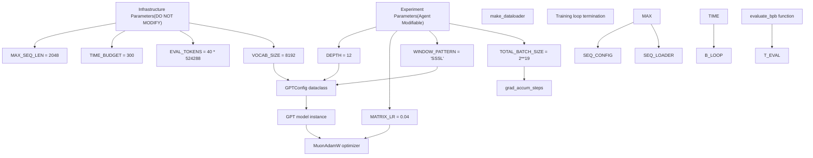
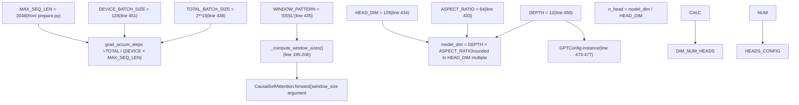
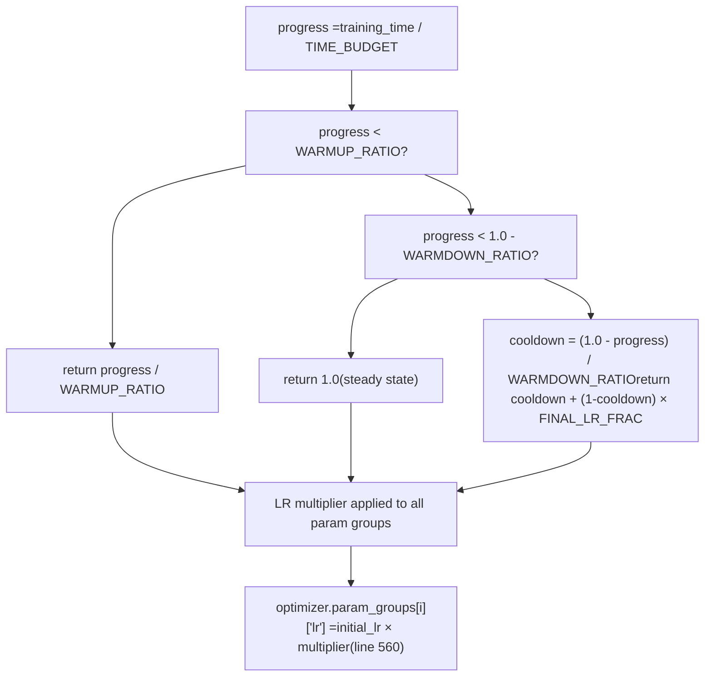
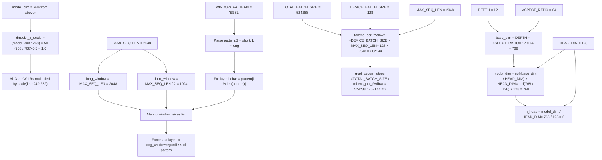
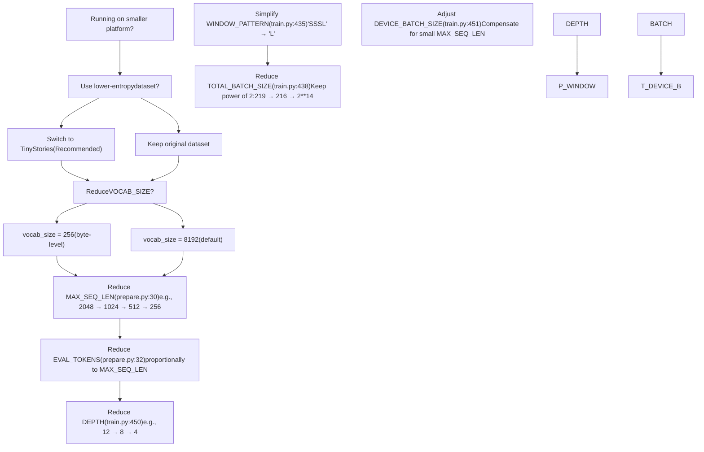

# 系统参数

相关源文件

-   [prepare.py](https://github.com/karpathy/autoresearch/blob/e6d79c12/prepare.py)
-   [train.py](https://github.com/karpathy/autoresearch/blob/e6d79c12/train.py)

本页记录控制 autoresearch 行为的关键常量与超参数。根据系统架构，参数分为两类：`prepare.py` 中用于建立公平比较固定约束的**基础设施参数**，以及 `train.py` 中由 agent 在自主研究中修改的**实验参数**。关于 agent 如何修改这些参数，请参见 [Modifying train.py Effectively](/karpathy/autoresearch/8.1-modifying-train.py-effectively)。关于平台相关调优建议，请参见 [Platform Adaptation and Forks](/karpathy/autoresearch/8.4-platform-adaptation-and-forks)。

## 参数架构

系统在不可变基础设施与可变实验之间执行严格边界：

**来源：** [prepare.py27-32](https://github.com/karpathy/autoresearch/blob/e6d79c12/prepare.py#L27-L32) [train.py432-451](https://github.com/karpathy/autoresearch/blob/e6d79c12/train.py#L432-L451)

## 基础设施参数（prepare.py）

这些常量在 `prepare.py` 中声明，且不得修改。它们建立了固定评估框架，确保所有实验都能进行公平比较。

### 核心常量

| 参数 | 值 | 位置 | 作用 |
| --- | --- | --- | --- |
| `MAX_SEQ_LEN` | 2048 | [prepare.py30](https://github.com/karpathy/autoresearch/blob/e6d79c12/prepare.py#L30-L30) | 所有模型的上下文长度。用于 dataloader 和评估。 |
| `TIME_BUDGET` | 300 | [prepare.py31](https://github.com/karpathy/autoresearch/blob/e6d79c12/prepare.py#L31-L31) | 以秒计的训练墙钟时间（5 分钟）。不含编译/启动。 |
| `EVAL_TOKENS` | 40 × 524288 = 20,971,520 | [prepare.py32](https://github.com/karpathy/autoresearch/blob/e6d79c12/prepare.py#L32-L32) | 验证期间用于计算 `val_bpb` 的总 token 数。 |

### 数据与分词

| 参数 | 值 | 位置 | 作用 |
| --- | --- | --- | --- |
| `VOCAB_SIZE` | 8192 | [prepare.py45](https://github.com/karpathy/autoresearch/blob/e6d79c12/prepare.py#L45-L45) | BPE tokenizer 词表大小。 |
| `SPLIT_PATTERN` | GPT-4 风格正则 | [prepare.py48](https://github.com/karpathy/autoresearch/blob/e6d79c12/prepare.py#L48-L48) | BPE tokenization 分割模式。 |
| `SPECIAL_TOKENS` | 4 个保留 token | [prepare.py50](https://github.com/karpathy/autoresearch/blob/e6d79c12/prepare.py#L50-L50) | 含 BOS 在内的 special token。 |
| `BOS_TOKEN` | \`"< | reserved\_0 | \>"\` |
| `VAL_SHARD` | 6542 | [prepare.py43](https://github.com/karpathy/autoresearch/blob/e6d79c12/prepare.py#L43-L43) | 固定验证分片（数据集最后一个分片）。 |
| `MAX_SHARD` | 6542 | [prepare.py42](https://github.com/karpathy/autoresearch/blob/e6d79c12/prepare.py#L42-L42) | 最大训练分片索引。 |

### 存储路径

| 参数 | 值 | 位置 | 作用 |
| --- | --- | --- | --- |
| `CACHE_DIR` | `~/.cache/autoresearch` | [prepare.py38](https://github.com/karpathy/autoresearch/blob/e6d79c12/prepare.py#L38-L38) | 根缓存目录。 |
| `DATA_DIR` | `~/.cache/autoresearch/data` | [prepare.py39](https://github.com/karpathy/autoresearch/blob/e6d79c12/prepare.py#L39-L39) | Parquet 分片存储目录。 |
| `TOKENIZER_DIR` | `~/.cache/autoresearch/tokenizer` | [prepare.py40](https://github.com/karpathy/autoresearch/blob/e6d79c12/prepare.py#L40-L40) | tokenizer pickle 与 token\_bytes 存储目录。 |

**来源：** [prepare.py26-51](https://github.com/karpathy/autoresearch/blob/e6d79c12/prepare.py#L26-L51)

### 为什么这些参数是固定的

基础设施参数建立了三个关键不变量：

1.  **时间预算公平性**：`TIME_BUDGET = 300` 确保所有实验都运行恰好 5 分钟（墙钟时间，热启动之后），使得在差异巨大的架构之间（例如 2 层模型 vs. 20 层模型）`val_bpb` 仍可比较。

2.  **指标一致性**：`EVAL_TOKENS` 与 `MAX_SEQ_LEN` 确保 `evaluate_bpb()` 函数 [prepare.py343-365](https://github.com/karpathy/autoresearch/blob/e6d79c12/prepare.py#L343-L365) 无论模型 batch size 或架构如何变化，都能产生一致测量。

3.  **数据可复现性**：固定的 `VAL_SHARD` 确保所有实验都在同一份留出数据上评估。

**来源：** [prepare.py27-32](https://github.com/karpathy/autoresearch/blob/e6d79c12/prepare.py#L27-L32) [prepare.py343-365](https://github.com/karpathy/autoresearch/blob/e6d79c12/prepare.py#L343-L365)

## 实验参数（train.py）

这些超参数定义在 `train.py` 中，是自主研究期间 agent 修改的主要目标。agent 通过调整这些值来改进 `val_bpb`。

### 架构参数

**来源：** [train.py432-451](https://github.com/karpathy/autoresearch/blob/e6d79c12/train.py#L432-L451) [train.py469-477](https://github.com/karpathy/autoresearch/blob/e6d79c12/train.py#L469-L477) [train.py195-206](https://github.com/karpathy/autoresearch/blob/e6d79c12/train.py#L195-L206)

| 参数 | 默认值 | 位置 | 作用 |
| --- | --- | --- | --- |
| `DEPTH` | 12 | [train.py450](https://github.com/karpathy/autoresearch/blob/e6d79c12/train.py#L450-L450) | Transformer 层数。主要的模型复杂度调节旋钮。 |
| `ASPECT_RATIO` | 64 | [train.py433](https://github.com/karpathy/autoresearch/blob/e6d79c12/train.py#L433-L433) | 模型维度乘子：`model_dim = DEPTH × ASPECT_RATIO`。 |
| `HEAD_DIM` | 128 | [train.py434](https://github.com/karpathy/autoresearch/blob/e6d79c12/train.py#L434-L434) | 每个注意力头的目标维度。模型维度会对齐到该值的倍数。 |
| `WINDOW_PATTERN` | `"SSSL"` | [train.py435](https://github.com/karpathy/autoresearch/blob/e6d79c12/train.py#L435-L435) | 滑动窗口模式：`S` = 半上下文，`L` = 全上下文，循环重复。 |
| `DEVICE_BATCH_SIZE` | 128 | [train.py451](https://github.com/karpathy/autoresearch/blob/e6d79c12/train.py#L451-L451) | 每次 forward/backward 的序列数。OOM 时应降低。 |
| `TOTAL_BATCH_SIZE` | 524288 (2¹⁹) | [train.py438](https://github.com/karpathy/autoresearch/blob/e6d79c12/train.py#L438-L438) | 每个 optimizer step 的总 token 数。必须是 2 的幂。 |

### 优化参数

| 参数 | 默认值 | 位置 | 作用 |
| --- | --- | --- | --- |
| `MATRIX_LR` | 0.04 | [train.py441](https://github.com/karpathy/autoresearch/blob/e6d79c12/train.py#L441-L441) | 矩阵参数的基础学习率（Muon optimizer）。 |
| `EMBEDDING_LR` | 0.6 | [train.py439](https://github.com/karpathy/autoresearch/blob/e6d79c12/train.py#L439-L439) | token embedding（`wte`）与 value embedding 的学习率。 |
| `UNEMBEDDING_LR` | 0.004 | [train.py440](https://github.com/karpathy/autoresearch/blob/e6d79c12/train.py#L440-L440) | 输出投影（`lm_head`）的学习率。 |
| `SCALAR_LR` | 0.5 | [train.py442](https://github.com/karpathy/autoresearch/blob/e6d79c12/train.py#L442-L442) | 每层标量（`resid_lambdas`, `x0_lambdas`）的学习率。 |
| `WEIGHT_DECAY` | 0.2 | [train.py443](https://github.com/karpathy/autoresearch/blob/e6d79c12/train.py#L443-L443) | Muon 的保守 weight decay（仅作用于对齐梯度）。 |
| `ADAM_BETAS` | (0.8, 0.95) | [train.py444](https://github.com/karpathy/autoresearch/blob/e6d79c12/train.py#L444-L444) | Adam optimizer 的 beta1 和 beta2（动量与方差）。 |

### 学习率调度参数

| 参数 | 默认值 | 位置 | 作用 |
| --- | --- | --- | --- |
| `WARMUP_RATIO` | 0.0 | [train.py445](https://github.com/karpathy/autoresearch/blob/e6d79c12/train.py#L445-L445) | 线性学习率 warmup 占时间预算的比例。0.0 = 无 warmup。 |
| `WARMDOWN_RATIO` | 0.5 | [train.py446](https://github.com/karpathy/autoresearch/blob/e6d79c12/train.py#L446-L446) | 余弦学习率 cooldown 占时间预算的比例。0.5 = 训练后半段。 |
| `FINAL_LR_FRAC` | 0.0 | [train.py447](https://github.com/karpathy/autoresearch/blob/e6d79c12/train.py#L447-L447) | cooldown 结束时最终学习率相对初始学习率的比例。0.0 = 衰减到零。 |

**来源：** [train.py432-447](https://github.com/karpathy/autoresearch/blob/e6d79c12/train.py#L432-L447)

### 学习率调度实现

该调度基于 `progress = training_time / TIME_BUDGET`，并在 `get_lr_multiplier()` [train.py518-525](https://github.com/karpathy/autoresearch/blob/e6d79c12/train.py#L518-L525) 中实现：

**来源：** [train.py518-563](https://github.com/karpathy/autoresearch/blob/e6d79c12/train.py#L518-L563)

## 参数依赖与派生值

若干运行时数值由基础参数计算得到：

**来源：** [train.py469-477](https://github.com/karpathy/autoresearch/blob/e6d79c12/train.py#L469-L477) [train.py495-497](https://github.com/karpathy/autoresearch/blob/e6d79c12/train.py#L495-L497) [train.py195-206](https://github.com/karpathy/autoresearch/blob/e6d79c12/train.py#L195-L206) [train.py248-252](https://github.com/karpathy/autoresearch/blob/e6d79c12/train.py#L248-L252)

### 关键派生值（默认配置）

| 派生值 | 公式 | 默认结果 |
| --- | --- | --- |
| `model_dim` | `((DEPTH × ASPECT_RATIO + HEAD_DIM - 1) // HEAD_DIM) × HEAD_DIM` | 768 |
| `n_head` | `model_dim // HEAD_DIM` | 6 |
| `tokens_per_fwdbwd` | `DEVICE_BATCH_SIZE × MAX_SEQ_LEN` | 262,144 |
| `grad_accum_steps` | `TOTAL_BATCH_SIZE // tokens_per_fwdbwd` | 2 |
| `dmodel_lr_scale` | `(model_dim / 768) ** -0.5` | 1.0 |
| `long_window` | `MAX_SEQ_LEN` | 2048 |
| `short_window` | `MAX_SEQ_LEN // 2` | 1024 |

**来源：** [train.py469-477](https://github.com/karpathy/autoresearch/blob/e6d79c12/train.py#L469-L477) [train.py495-497](https://github.com/karpathy/autoresearch/blob/e6d79c12/train.py#L495-L497) [train.py248](https://github.com/karpathy/autoresearch/blob/e6d79c12/train.py#L248-L248)

## 平台适配参数

若要在小于 H100 的硬件上运行 autoresearch，可调以下参数。`prepare.py` 中参数需要修改基础设施代码（即创建 fork），而 `train.py` 中参数可由 agent 直接修改。

### 推荐调参顺序

**来源：** [prepare.py30-45](https://github.com/karpathy/autoresearch/blob/e6d79c12/prepare.py#L30-L45) [train.py435-451](https://github.com/karpathy/autoresearch/blob/e6d79c12/train.py#L435-L451)

### 关键约束

1.  **2 的幂 batch size**：`TOTAL_BATCH_SIZE` 必须是 2 的幂，以保证梯度累积整除。[train.py496](https://github.com/karpathy/autoresearch/blob/e6d79c12/train.py#L496-L496) 会断言 `TOTAL_BATCH_SIZE % tokens_per_fwdbwd == 0`。

2.  **窗口模式效率**：`"SSSL"` 模式使用交替带状注意力，在非 Hopper GPU 上可能效率较低。为获得更广泛兼容性，可使用 `"L"`（仅全注意力）。

3.  **Token 预算**：`EVAL_TOKENS` 应与 `MAX_SEQ_LEN` 成比例缩放，以保持评估一致性。若 `MAX_SEQ_LEN` 缩小 4×，`EVAL_TOKENS` 也应近似缩小 4×。

4.  **词表大小与数据集**：对于 byte-level tokenization（`vocab_size = 256`），由于压缩率较低，建议使用更简单的数据集。

**来源：** [train.py496](https://github.com/karpathy/autoresearch/blob/e6d79c12/train.py#L496-L496) [train.py195-206](https://github.com/karpathy/autoresearch/blob/e6d79c12/train.py#L195-L206)

## 参数修改策略

下表总结了哪些参数可由 agent 修改，哪些参数需要通过创建 fork 才能修改：

| Parameter | Location | Agent Can Modify? | Notes |
| --- | --- | --- | --- |
| `MAX_SEQ_LEN` | `prepare.py:30` | ❌ No | Infrastructure constant. Fork required. |
| `TIME_BUDGET` | `prepare.py:31` | ❌ No | Infrastructure constant. Fork required. |
| `EVAL_TOKENS` | `prepare.py:32` | ❌ No | Infrastructure constant. Fork required. |
| `VOCAB_SIZE` | `prepare.py:45` | ❌ No | Requires retraining tokenizer. Fork required. |
| `DEPTH` | `train.py:450` | ✅ Yes | Primary complexity knob for agent. |
| `ASPECT_RATIO` | `train.py:433` | ✅ Yes | Model width parameter. |
| `HEAD_DIM` | `train.py:434` | ✅ Yes | Attention head dimension. |
| `WINDOW_PATTERN` | `train.py:435` | ✅ Yes | Sliding window attention pattern. |
| `DEVICE_BATCH_SIZE` | `train.py:451` | ✅ Yes | Adjust for memory constraints. |
| `TOTAL_BATCH_SIZE` | `train.py:438` | ✅ Yes | Total tokens per optimizer step. |
| `MATRIX_LR` | `train.py:441` | ✅ Yes | Learning rate for matrix parameters. |
| `EMBEDDING_LR` | `train.py:439` | ✅ Yes | Learning rate for embeddings. |
| `UNEMBEDDING_LR` | `train.py:440` | ✅ Yes | Learning rate for output head. |
| `SCALAR_LR` | `train.py:442` | ✅ Yes | Learning rate for scalars. |
| `WEIGHT_DECAY` | `train.py:443` | ✅ Yes | Regularization strength. |
| `ADAM_BETAS` | `train.py:444` | ✅ Yes | Adam momentum parameters. |
| `WARMUP_RATIO` | `train.py:445` | ✅ Yes | LR warmup schedule. |
| `WARMDOWN_RATIO` | `train.py:446` | ✅ Yes | LR cooldown schedule. |
| `FINAL_LR_FRAC` | `train.py:447` | ✅ Yes | Final LR fraction. |

**来源：** [prepare.py27-45](https://github.com/karpathy/autoresearch/blob/e6d79c12/prepare.py#L27-L45) [train.py432-451](https://github.com/karpathy/autoresearch/blob/e6d79c12/train.py#L432-L451)
