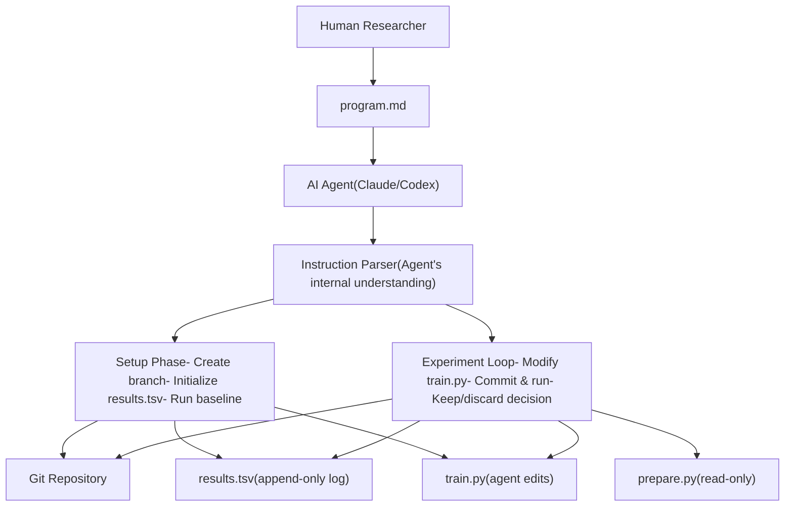
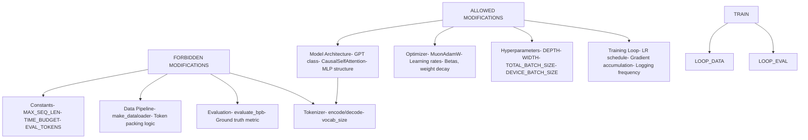
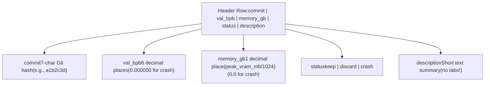
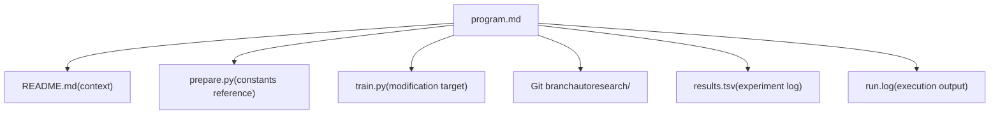

# program.md - Agent 指令

相关源文件

-   [README.md](https://github.com/karpathy/autoresearch/blob/e6d79c12/README.md?plain=1)
-   [program.md](https://github.com/karpathy/autoresearch/blob/e6d79c12/program.md?plain=1)

`program.md` 是可由人类编辑的指令文件，用于定义自主 AI agent 的研究目标与运行约束。它充当“research org code”——一种轻量级规范，使人类无需改动 Python 代码库即可引导 agent 行为。人类通过迭代该文件来调整研究方向，而 agent 将其作为唯一的运行指导来源。

关于 agent 的执行工作流，请参见 [4.1 The Research Loop](https://github.com/karpathy/autoresearch/blob/e6d79c12/4.1 The Research Loop) 关于 agent 会修改哪些文件，请参见 [3.1 train.py - The Mutable Core](https://github.com/karpathy/autoresearch/blob/e6d79c12/3.1 train.py - The Mutable Core) 关于基础设施约束，请参见 [3.2 prepare.py - Data and Evaluation](https://github.com/karpathy/autoresearch/blob/e6d79c12/3.2 prepare.py - Data and Evaluation)

## 在系统架构中的角色

`program.md` 位于 autoresearch 层级结构的元层。它是人类对自主研究流程进行控制的唯一入口。不同于传统研究中人类直接改代码，autoresearch 反转了这一关系：人类以自然语言编写指令，agent 将其翻译为代码修改。

标题：系统层级与指令流


来源： [program.md1-115](https://github.com/karpathy/autoresearch/blob/e6d79c12/program.md?plain=1#L1-L115) [README.md7-17](https://github.com/karpathy/autoresearch/blob/e6d79c12/README.md?plain=1#L7-L17)

## 文件结构

`program.md` 由五个主要部分构成，每个部分承担不同的运行目的：

| 部分 | 行范围 | 目的 | Agent 交互 |
| --- | --- | --- | --- |
| **Header** | [program.md1-3](https://github.com/karpathy/autoresearch/blob/e6d79c12/program.md?plain=1#L1-L3) | 项目标题与上下文 | 一次性读取上下文 |
| **Setup** | [program.md5-19](https://github.com/karpathy/autoresearch/blob/e6d79c12/program.md?plain=1#L5-L19) | 初始化流程 | 每次实验运行执行一次 |
| **Experimentation** | [program.md21-39](https://github.com/karpathy/autoresearch/blob/e6d79c12/program.md?plain=1#L21-L39) | 规则、约束与目标 | 循环中持续参考 |
| **Output Format** | [program.md41-62](https://github.com/karpathy/autoresearch/blob/e6d79c12/program.md?plain=1#L41-L62) | 期望脚本输出结构 | 用于结果提取 |
| **Logging Results** | [program.md64-88](https://github.com/karpathy/autoresearch/blob/e6d79c12/program.md?plain=1#L64-L88) | TSV 格式规范 | 每次实验后使用 |
| **The Experiment Loop** | [program.md90-115](https://github.com/karpathy/autoresearch/blob/e6d79c12/program.md?plain=1#L90-L115) | 自主运行工作流 | 无限执行 |

来源： [program.md1-115](https://github.com/karpathy/autoresearch/blob/e6d79c12/program.md?plain=1#L1-L115)

## Setup 指令部分

setup 部分定义了一个六步初始化协议，用于为自主研究运行建立基础。每一步都有具体的校验要求和失败模式。

标题：Agent Setup 协议

> **[Mermaid stateDiagram]**
> *(图表结构无法解析)*

### 关键 setup 约束

setup 协议施加了若干关键约束：

1.  **分支唯一性**：分支 `autoresearch/<tag>` 必须不存在。这可防止意外覆盖以往实验 [program.md9-10](https://github.com/karpathy/autoresearch/blob/e6d79c12/program.md?plain=1#L9-L10)
2.  **数据校验**：agent 在继续之前必须确认 `~/.cache/autoresearch/` 同时包含数据分片和 `tokenizer.pkl` [program.md15](https://github.com/karpathy/autoresearch/blob/e6d79c12/program.md?plain=1#L15-L15)
3.  **结果初始化**：`results.tsv` 初始仅创建表头行 [program.md16](https://github.com/karpathy/autoresearch/blob/e6d79c12/program.md?plain=1#L16-L16)
4.  **基线建立**：第一次运行必须始终使用未修改的 `train.py`，以建立公平比较基线 [program.md39](https://github.com/karpathy/autoresearch/blob/e6d79c12/program.md?plain=1#L39-L39)

来源： [program.md5-19](https://github.com/karpathy/autoresearch/blob/e6d79c12/program.md?plain=1#L5-L19) [README.md25-38](https://github.com/karpathy/autoresearch/blob/e6d79c12/README.md?plain=1#L25-L38)

## 实验规则与约束

experimentation 部分建立了清晰的权限模型，定义 agent 可以修改与不能修改的内容。该部分会在自主循环中持续参考。

标题：权限矩阵与文件范围


### 主要目标与约束

-   **主要指标**：最小化 `val_bpb`（验证 bits per byte）。该指标与词表大小无关，可在架构变更之间公平比较 [program.md33](https://github.com/karpathy/autoresearch/blob/e6d79c12/program.md?plain=1#L33-L33)
-   **固定约束**：`TIME_BUDGET` 通常为 300 秒（5 分钟墙钟时间）。该值不可变，定义于基础设施层 [program.md23](https://github.com/karpathy/autoresearch/blob/e6d79c12/program.md?plain=1#L23-L23) [README.md17](https://github.com/karpathy/autoresearch/blob/e6d79c12/README.md?plain=1#L17-L17)
-   **软约束**：`peak_vram_mb` 不应出现显著增长。为获取有意义的 `val_bpb` 提升可接受一定增长，但内存爆炸是丢弃实验的理由 [program.md35](https://github.com/karpathy/autoresearch/blob/e6d79c12/program.md?plain=1#L35-L35)
-   **简洁性准则**：agent 必须评估复杂度与收益权衡。复杂代码增加 20 行仅带来 0.001 提升应丢弃，而结果不变但代码更简洁应保留 [program.md37](https://github.com/karpathy/autoresearch/blob/e6d79c12/program.md?plain=1#L37-L37)

来源： [program.md21-39](https://github.com/karpathy/autoresearch/blob/e6d79c12/program.md?plain=1#L21-L39) [README.md61-66](https://github.com/karpathy/autoresearch/blob/e6d79c12/README.md?plain=1#L61-L66)

## 输出格式与指标提取

agent 期望 `train.py` 输出特定格式，以便提取性能指标。输出部分充当训练脚本与 agent 解析逻辑之间的契约 [program.md41-43](https://github.com/karpathy/autoresearch/blob/e6d79c12/program.md?plain=1#L41-L43)

### 期望输出结构

当 `train.py` 完成时，会打印一个以 `---` 开头的汇总块：

```
---
val_bpb:          0.997900
training_seconds: 300.1
total_seconds:    325.9
peak_vram_mb:     45060.2
mfu_percent:      39.80
total_tokens_M:   499.6
num_steps:        953
num_params_M:     50.3
depth:            8
```
### 指标提取命令

agent 使用 shell 命令从 `run.log` 提取指标 [program.md58-61](https://github.com/karpathy/autoresearch/blob/e6d79c12/program.md?plain=1#L58-L61)：

```
# Extract primary metricgrep "^val_bpb:" run.log # Extract memory usagegrep "^peak_vram_mb:" run.log # Combined extractiongrep "^val_bpb:\|^peak_vram_mb:" run.log
```
**崩溃处理**：若 `grep` 结果为空，说明本次运行崩溃。agent 随后执行 `tail -n 50 run.log` 获取 Python 堆栈追踪用于诊断 [program.md101](https://github.com/karpathy/autoresearch/blob/e6d79c12/program.md?plain=1#L101-L101)

来源： [program.md41-62](https://github.com/karpathy/autoresearch/blob/e6d79c12/program.md?plain=1#L41-L62) [program.md100-101](https://github.com/karpathy/autoresearch/blob/e6d79c12/program.md?plain=1#L100-L101)

## 结果日志格式

所有实验都记录到 `results.tsv`，这是一个**绝不提交到 Git**的制表符分隔文件 [program.md102](https://github.com/karpathy/autoresearch/blob/e6d79c12/program.md?plain=1#L102-L102) 该文件提供对所有尝试（包括失败）的完整审计轨迹。

### TSV 模式

标题：results.tsv 列规范


### 示例条目

| commit | val\_bpb | memory\_gb | status | description |
| --- | --- | --- | --- | --- |
| a1b2c3d | 0.997900 | 44.0 | keep | baseline |
| b2c3d4e | 0.993200 | 44.2 | keep | increase LR to 0.04 |
| c3d4e5f | 1.005000 | 44.0 | discard | switch to GeLU activation |
| d4e5f6g | 0.000000 | 0.0 | crash | double model width (OOM) |

来源： [program.md64-88](https://github.com/karpathy/autoresearch/blob/e6d79c12/program.md?plain=1#L64-L88)

## 自主实验循环

实验循环是核心自主工作流，会无限运行直到人类手动中断 [program.md112](https://github.com/karpathy/autoresearch/blob/e6d79c12/program.md?plain=1#L112-L112)

标题：无限研究循环

### 循环不变量

1.  **分支状态**：Git 分支始终指向当前最优配置（`val_bpb` 最低）。被丢弃的实验通过 `git reset --hard HEAD~1` 回滚 [program.md104](https://github.com/karpathy/autoresearch/blob/e6d79c12/program.md?plain=1#L104-L104)
2.  **时间预算**：每个实验恰好运行 5 分钟（不含编译） [program.md23](https://github.com/karpathy/autoresearch/blob/e6d79c12/program.md?plain=1#L23-L23)
3.  **仅追加日志**：`results.tsv` 记录所有尝试，包括崩溃与丢弃。
4.  **自主性**：agent **永不停止**向人类请求许可 [program.md112](https://github.com/karpathy/autoresearch/blob/e6d79c12/program.md?plain=1#L112-L112)

来源： [program.md90-115](https://github.com/karpathy/autoresearch/blob/e6d79c12/program.md?plain=1#L90-L115)

## 错误处理与崩溃恢复

agent 会区分可恢复错误与根本性失败 [program.md110](https://github.com/karpathy/autoresearch/blob/e6d79c12/program.md?plain=1#L110-L110)

### 崩溃检测

当 `grep` 输出为空时判定为崩溃。agent 随后执行 `tail -n 50 run.log` 读取堆栈追踪 [program.md101](https://github.com/karpathy/autoresearch/blob/e6d79c12/program.md?plain=1#L101-L101)

### 恢复逻辑

-   **简单修复**（拼写错误、缺失导入）：修复后重跑同一想法 [program.md110](https://github.com/karpathy/autoresearch/blob/e6d79c12/program.md?plain=1#L110-L110)
-   **根本失败**（OOM、逻辑 bug）：记录为“crash”，重置分支，并转向新想法 [program.md110](https://github.com/karpathy/autoresearch/blob/e6d79c12/program.md?plain=1#L110-L110)
-   **超时**：若单次运行超过 10 分钟，将被终止并按失败处理 [program.md108](https://github.com/karpathy/autoresearch/blob/e6d79c12/program.md?plain=1#L108-L108)

来源： [program.md100-110](https://github.com/karpathy/autoresearch/blob/e6d79c12/program.md?plain=1#L100-L110)

## 与其他系统组件的关系

`program.md` 与多个系统组件交互：

标题：从指令到执行的映射


来源： [program.md11-14](https://github.com/karpathy/autoresearch/blob/e6d79c12/program.md?plain=1#L11-L14) [program.md64-88](https://github.com/karpathy/autoresearch/blob/e6d79c12/program.md?plain=1#L64-L88) [README.md55-57](https://github.com/karpathy/autoresearch/blob/e6d79c12/README.md?plain=1#L55-L57)
