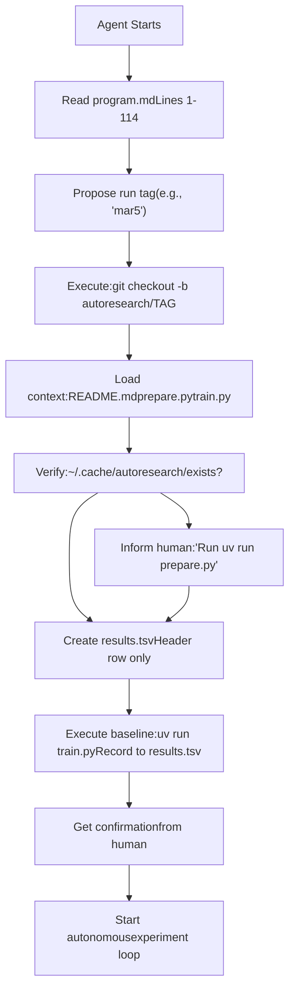
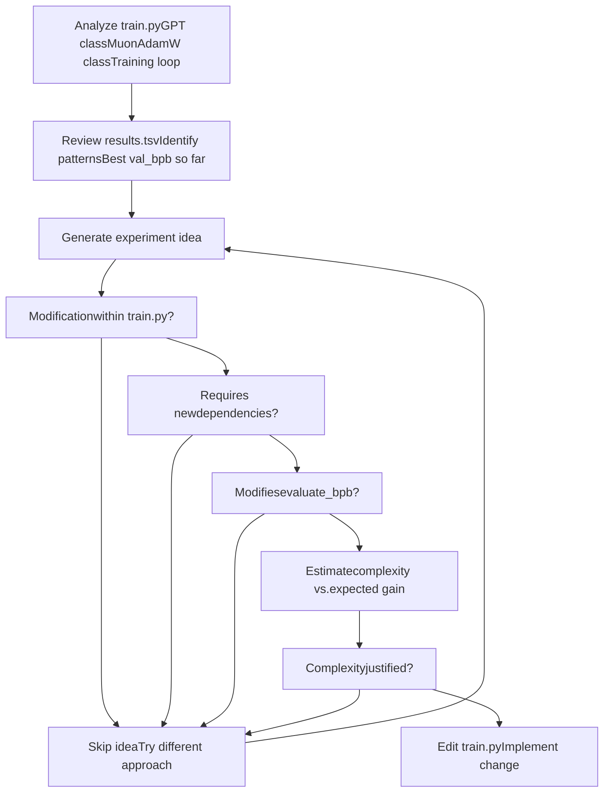
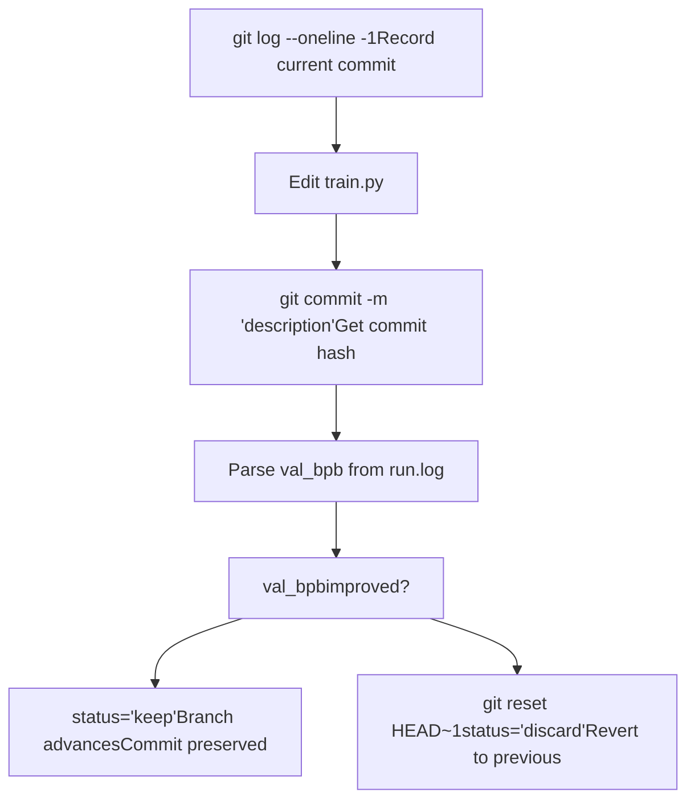
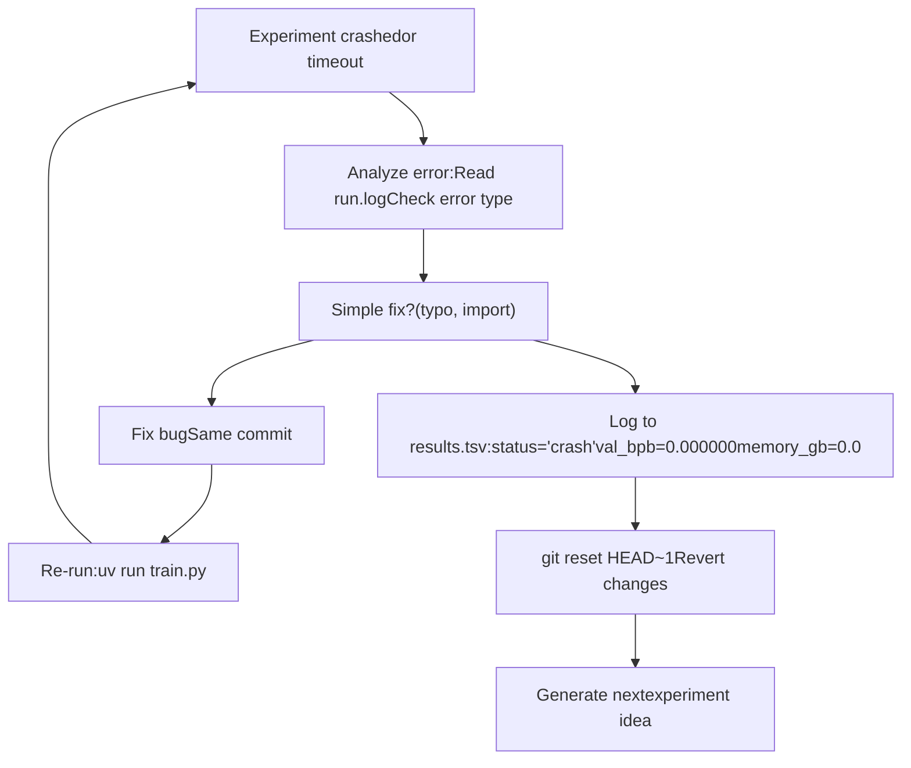

# Agent 运行机制

相关源文件

-   [.gitignore](https://github.com/karpathy/autoresearch/blob/e6d79c12/.gitignore)
-   [program.md](https://github.com/karpathy/autoresearch/blob/e6d79c12/program.md?plain=1)

## 目的与范围

本页记录 AI agent（Claude、GPT-4 或类似 LLM）如何在 autoresearch 系统中执行自主研究。内容涵盖从初始化到持续实验的完整运行工作流，包括代码修改策略、实验执行、结果评估与决策流程。

关于研究循环结构的细节，请参见 [The Research Loop](/karpathy/autoresearch/4.1-the-research-loop)。关于实验生命周期细节，请参见 [Experiment Lifecycle](/karpathy/autoresearch/4.2-experiment-lifecycle)。关于决策逻辑，请参见 [Decision Making and Branch Management](/karpathy/autoresearch/4.3-decision-making-and-branch-management)。关于错误处理，请参见 [Error Handling and Recovery](/karpathy/autoresearch/4.4-error-handling-and-recovery)。

---

## Agent 初始化

agent 通过读取 [program.md1-18](https://github.com/karpathy/autoresearch/blob/e6d79c12/program.md?plain=1#L1-L18) 并与人类协作来建立研究会话。初始化序列包括：

### Setup 步骤

| 步骤 | 动作 | 目的 |
| --- | --- | --- |
| 1 | 确定运行标签 | 创建唯一分支标识（例如 `mar5`）[program.md9](https://github.com/karpathy/autoresearch/blob/e6d79c12/program.md?plain=1#L9-L9) |
| 2 | 创建分支 | 从 master 执行 `git checkout -b autoresearch/<tag>` [program.md10](https://github.com/karpathy/autoresearch/blob/e6d79c12/program.md?plain=1#L10-L10) |
| 3 | 读取范围内文件 | 将 `README.md`、`prepare.py`、`train.py` 加载到上下文 [program.md11-14](https://github.com/karpathy/autoresearch/blob/e6d79c12/program.md?plain=1#L11-L14) |
| 4 | 校验数据存在 | 检查 `~/.cache/autoresearch/` 中是否有分片与 tokenizer [program.md15](https://github.com/karpathy/autoresearch/blob/e6d79c12/program.md?plain=1#L15-L15) |
| 5 | 初始化 `results.tsv` | 仅创建带表头的日志文件 [program.md16](https://github.com/karpathy/autoresearch/blob/e6d79c12/program.md?plain=1#L16-L16) |
| 6 | 确认 setup | 获取人类确认后继续 [program.md17](https://github.com/karpathy/autoresearch/blob/e6d79c12/program.md?plain=1#L17-L17) |

#### 基线运行

根据 [program.md39](https://github.com/karpathy/autoresearch/blob/e6d79c12/program.md?plain=1#L39-L39)，agent **必须**将基线运行作为首个实验：

> Your very first run should always be to establish the baseline, so you will run the training script as is.

基线运行会：

1.  在不修改的情况下执行 `train.py`。
2.  将真实测得指标记录到 `results.tsv`。
3.  建立后续比较的起点。

**Agent 初始化流程**


**来源：** [program.md6-18](https://github.com/karpathy/autoresearch/blob/e6d79c12/program.md?plain=1#L6-L18) [program.md39](https://github.com/karpathy/autoresearch/blob/e6d79c12/program.md?plain=1#L39-L39)

---

## 自主研究循环

初始化后，agent 进入无限循环，执行 [program.md90-111](https://github.com/karpathy/autoresearch/blob/e6d79c12/program.md?plain=1#L90-L111) 定义的协议。该循环会在人工停止前**持续且自主**运行，无需人类干预。

### 循环结构

核心循环包含八个步骤，并无限重复：

### 循环不变量

循环保持以下不变量：

1.  **无需人类干预** - agent 不会暂停询问“是否继续？” [program.md112](https://github.com/karpathy/autoresearch/blob/e6d79c12/program.md?plain=1#L112-L112)
2.  **时间预算固定** - 每个实验训练时间严格为 300 秒 [program.md23](https://github.com/karpathy/autoresearch/blob/e6d79c12/program.md?plain=1#L23-L23)
3.  **单分支前进** - Git 分支仅在指标改进时向前推进 [program.md103](https://github.com/karpathy/autoresearch/blob/e6d79c12/program.md?plain=1#L103-L103)
4.  **完整日志** - 所有实验（keep/discard/crash）均记录到 `results.tsv` [program.md102](https://github.com/karpathy/autoresearch/blob/e6d79c12/program.md?plain=1#L102-L102)

**来源：** [program.md90-111](https://github.com/karpathy/autoresearch/blob/e6d79c12/program.md?plain=1#L90-L111) [program.md23](https://github.com/karpathy/autoresearch/blob/e6d79c12/program.md?plain=1#L23-L23)

---

## 代码修改流程

agent **仅**修改 `train.py`。其他文件均为只读。修改范围定义于 [program.md25-31](https://github.com/karpathy/autoresearch/blob/e6d79c12/program.md?plain=1#L25-L31)

### 允许的修改

| 组件 | 示例 | 约束 |
| --- | --- | --- |
| **模型架构** | 层数、隐藏维度、注意力头数、MLP 比例 | 必须适配 VRAM [program.md35](https://github.com/karpathy/autoresearch/blob/e6d79c12/program.md?plain=1#L35-L35) |
| **优化器** | 算法、学习率、weight decay、momentum | 必须在 5 分钟内收敛 [program.md33](https://github.com/karpathy/autoresearch/blob/e6d79c12/program.md?plain=1#L33-L33) |
| **超参数** | batch size、梯度累积、dropout | 需遵守时间预算 [program.md23](https://github.com/karpathy/autoresearch/blob/e6d79c12/program.md?plain=1#L23-L23) |
| **训练循环** | 学习率调度、warmup/warmdown、损失函数 | 必须能完成评估 [program.md31](https://github.com/karpathy/autoresearch/blob/e6d79c12/program.md?plain=1#L31-L31) |

### 禁止的修改

agent **不能**：

-   修改 `prepare.py` - 其中包含数据加载与训练常量 [program.md29](https://github.com/karpathy/autoresearch/blob/e6d79c12/program.md?plain=1#L29-L29)
-   安装 `pyproject.toml` 之外的新包 [program.md30](https://github.com/karpathy/autoresearch/blob/e6d79c12/program.md?plain=1#L30-L30)
-   修改评估框架 - `prepare.py` 中的 `evaluate_bpb` 函数是 ground truth [program.md31](https://github.com/karpathy/autoresearch/blob/e6d79c12/program.md?plain=1#L31-L31)

### 修改策略

agent 基于以下因素提出改动：

-   代码注释与引用论文中的研究想法。
-   `results.tsv` 中的历史实验结果。
-   **简洁性准则**：其他条件相同时，越简单越好。带来微小提升但引入丑陋复杂度的改动不值得保留 [program.md37](https://github.com/karpathy/autoresearch/blob/e6d79c12/program.md?plain=1#L37-L37)

**代码修改决策树**


**来源：** [program.md25-31](https://github.com/karpathy/autoresearch/blob/e6d79c12/program.md?plain=1#L25-L31) [program.md37](https://github.com/karpathy/autoresearch/blob/e6d79c12/program.md?plain=1#L37-L37)

---

## 实验执行

agent 使用 [program.md99](https://github.com/karpathy/autoresearch/blob/e6d79c12/program.md?plain=1#L99-L99) 定义的固定命令模式执行实验

### 执行命令

```
uv run train.py > run.log 2>&1
```
关键点：

-   **输出重定向：** 所有 stdout/stderr 都写入 `run.log`。
-   **终端无输出：** 防止上下文被输出刷屏。
-   **不使用 `tee`：** agent 必须在运行完成后读取 `run.log` [program.md99](https://github.com/karpathy/autoresearch/blob/e6d79c12/program.md?plain=1#L99-L99)

### 执行时间线

> **[Mermaid gantt]**
> *(图表结构无法解析)*

### 输出解析

agent 通过 [program.md100](https://github.com/karpathy/autoresearch/blob/e6d79c12/program.md?plain=1#L100-L100) 提取指标：

```
grep "^val_bpb:\|^peak_vram_mb:" run.log
```
期望输出格式包含 `val_bpb`、`training_seconds`、`peak_vram_mb` 和 `mfu_percent` [program.md46-56](https://github.com/karpathy/autoresearch/blob/e6d79c12/program.md?plain=1#L46-L56)

**指标提取与日志记录**

> **[Mermaid sequence]**
> *(图表结构无法解析)*

**来源：** [program.md99-100](https://github.com/karpathy/autoresearch/blob/e6d79c12/program.md?plain=1#L99-L100) [program.md46-56](https://github.com/karpathy/autoresearch/blob/e6d79c12/program.md?plain=1#L46-L56)

---

## 结果评估与决策

agent 通过将新的 `val_bpb` 与此前最佳值比较来评估实验结果。值越低越好。

### 决策准则

[program.md103-104](https://github.com/karpathy/autoresearch/blob/e6d79c12/program.md?plain=1#L103-L104) 中的决策逻辑：

```
if new_val_bpb < previous_best_val_bpb:    # KEEP: Advance branch, status='keep'else:    # DISCARD: Revert changes, status='discard'    # git reset HEAD~1
```
### `results.tsv` 格式

每个实验都会按 [program.md66-88](https://github.com/karpathy/autoresearch/blob/e6d79c12/program.md?plain=1#L66-L88) 定义的格式写入 `results.tsv`（制表符分隔）：

| 列 | 类型 | 描述 |
| --- | --- | --- |
| `commit` | string | 7 位 git hash [program.md74](https://github.com/karpathy/autoresearch/blob/e6d79c12/program.md?plain=1#L74-L74) |
| `val_bpb` | float | 验证 bits per byte（崩溃时为 0.000000）[program.md75](https://github.com/karpathy/autoresearch/blob/e6d79c12/program.md?plain=1#L75-L75) |
| `memory_gb` | float | 峰值 VRAM（GB），四舍五入到 .1f [program.md76](https://github.com/karpathy/autoresearch/blob/e6d79c12/program.md?plain=1#L76-L76) |
| `status` | enum | `keep`、`discard` 或 `crash` [program.md77](https://github.com/karpathy/autoresearch/blob/e6d79c12/program.md?plain=1#L77-L77) |
| `description` | string | 简短文本描述 [program.md78](https://github.com/karpathy/autoresearch/blob/e6d79c12/program.md?plain=1#L78-L78) |

**来源：** [program.md66-88](https://github.com/karpathy/autoresearch/blob/e6d79c12/program.md?plain=1#L66-L88) [program.md103-104](https://github.com/karpathy/autoresearch/blob/e6d79c12/program.md?plain=1#L103-L104)

---

## Git 操作与分支管理

agent 使用 Git 追踪实验，并维护一条仅包含改进项的整洁历史。

### 每次实验的 Git 工作流


### Git 命令

| 操作 | 命令 | 使用时机 |
| --- | --- | --- |
| 检查状态 | `git log --oneline -1` | 步骤 1：每次实验前 [program.md96](https://github.com/karpathy/autoresearch/blob/e6d79c12/program.md?plain=1#L96-L96) |
| 提交修改 | `git commit -m "description"` | 步骤 3：修改 train.py 后 [program.md98](https://github.com/karpathy/autoresearch/blob/e6d79c12/program.md?plain=1#L98-L98) |
| 丢弃时回滚 | `git reset HEAD~1` | 步骤 10：当 val\_bpb 未改进时 [program.md104](https://github.com/karpathy/autoresearch/blob/e6d79c12/program.md?plain=1#L104-L104) |

`results.tsv` 通过 [.gitignore23](https://github.com/karpathy/autoresearch/blob/e6d79c12/.gitignore#L23-L23) 明确排除在 Git 之外，不应被提交 [program.md102](https://github.com/karpathy/autoresearch/blob/e6d79c12/program.md?plain=1#L102-L102)

**来源：** [program.md96-104](https://github.com/karpathy/autoresearch/blob/e6d79c12/program.md?plain=1#L96-L104) [.gitignore23](https://github.com/karpathy/autoresearch/blob/e6d79c12/.gitignore#L23-L23)

---

## 持续运行

agent 会**无限期**运行，直到被手动中断。这对夜间研究至关重要。

### 不间断指令

来自 [program.md112](https://github.com/karpathy/autoresearch/blob/e6d79c12/program.md?plain=1#L112-L112)：

> **NEVER STOP**: Once the experiment loop has begun (after the initial setup), do NOT pause to ask the human if you should continue. ... The human might be asleep, or gone from a computer and expects you to continue working *indefinitely* until you are manually stopped.

### 预期吞吐量

来自 [program.md114](https://github.com/karpathy/autoresearch/blob/e6d79c12/program.md?plain=1#L114-L114)：

-   每次实验：约 5 分钟训练时间。
-   每小时实验数：约 12 次。
-   一夜（8 小时）：约 100 次实验。

### 超时处理

来自 [program.md108](https://github.com/karpathy/autoresearch/blob/e6d79c12/program.md?plain=1#L108-L108)：

-   每次实验总时长应约为 5 分钟。
-   超时阈值：10 分钟。
-   超时处理动作：终止进程，按失败处理（丢弃并回滚）。

**来源：** [program.md108-114](https://github.com/karpathy/autoresearch/blob/e6d79c12/program.md?plain=1#L108-L114)

---

## 错误处理与恢复

agent 必须在无人干预下处理崩溃、超时和 OOM 错误。详见 [Error Handling and Recovery](/karpathy/autoresearch/4.4-error-handling-and-recovery)。

### 崩溃处理逻辑

来自 [program.md101-110](https://github.com/karpathy/autoresearch/blob/e6d79c12/program.md?plain=1#L101-L110)：

1.  若 `grep` 输出为空，则本次运行崩溃。
2.  运行 `tail -n 50 run.log` 读取堆栈追踪。
3.  若是简单拼写/导入错误，修复后重跑。
4.  若该想法根本不可行（如 OOM），则跳过、记录为 "crash"，并继续。

**崩溃处理逻辑**


**来源：** [program.md101](https://github.com/karpathy/autoresearch/blob/e6d79c12/program.md?plain=1#L101-L101) [program.md110](https://github.com/karpathy/autoresearch/blob/e6d79c12/program.md?plain=1#L110-L110)
