# 研究循环

相关源文件

-   [program.md](https://github.com/karpathy/autoresearch/blob/e6d79c12/program.md?plain=1)

本文档描述驱动 autoresearch 系统的核心自主研究循环。研究循环是一个无限周期：agent 持续提出对 `train.py` 的修改、执行实验、评估结果，并在无人干预下做出保留/丢弃决策。

关于单次实验执行机制的细节，请参见 **4.2 Experiment Lifecycle**。关于保留/丢弃决策逻辑与 Git 操作，请参见 **4.3 Decision Making and Branch Management**。关于崩溃处理，请参见 **4.4 Error Handling and Recovery**。

**来源**： [program.md90-115](https://github.com/karpathy/autoresearch/blob/e6d79c12/program.md?plain=1#L90-L115) [README.md63-65](https://github.com/karpathy/autoresearch/blob/e6d79c12/README.md?plain=1#L63-L65)

---

## 循环初始化

在进入自主循环前，agent 会与用户协作执行一次性 setup 序列：

| 步骤 | 动作 | 命令/文件 | 目的 |
| --- | --- | --- | --- |
| 1 | 协商 tag | 例如 `mar5` | 标识本次实验运行 |
| 2 | 创建分支 | `git checkout -b autoresearch/<tag>` | 将实验与 master 隔离 |
| 3 | 读取上下文 | `README.md`, `prepare.py`, `train.py` | 全面理解系统 |
| 4 | 校验数据 | 检查 `~/.cache/autoresearch/` | 确保数据分片存在 |
| 5 | 初始化日志 | 创建带表头的 `results.tsv` | 准备实验追踪 |
| 6 | 基线运行 | `uv run train.py` | 建立初始 `val_bpb` |

基线运行建立初始指标（例如 `val_bpb: 0.997900`）后，agent 进入无限自主循环。

**来源**： [program.md5-19](https://github.com/karpathy/autoresearch/blob/e6d79c12/program.md?plain=1#L5-L19) [program.md39-63](https://github.com/karpathy/autoresearch/blob/e6d79c12/program.md?plain=1#L39-L63)

---

## 无限循环模式

研究循环被明确设计为非终止过程，由 [program.md94](https://github.com/karpathy/autoresearch/blob/e6d79c12/program.md?plain=1#L94-L94) 中的 `LOOP FOREVER` 指令定义：

该循环会无限持续，直到被人类手动中断。agent **不会**暂停并请求是否继续。

**来源**： [program.md94-112](https://github.com/karpathy/autoresearch/blob/e6d79c12/program.md?plain=1#L94-L112)

---

## 循环步骤细节

研究循环的每次迭代都遵循精确的九步序列：

### 步骤 1：读取 Git 状态

```
git log -1 --onelinegit status
```
agent 检查当前分支（例如 `autoresearch/mar5`）与当前 commit，以了解目前已保留了哪些改动，从而指导下一轮想法生成。

### 步骤 2：调整 train.py

agent 直接修改 [train.py](https://github.com/karpathy/autoresearch/blob/e6d79c12/train.py)。改动可包括：

-   模型架构（例如 `DEPTH`, `WIDTH`, `N_HEAD`）
-   优化器参数（例如学习率、weight decay）
-   训练超参数（例如 `TOTAL_BATCH_SIZE`, `DEVICE_BATCH_SIZE`）
-   调度逻辑（例如 `WARMUP_FRACTION`, `STABLE_FRACTION`）

agent **不能**修改 [prepare.py](https://github.com/karpathy/autoresearch/blob/e6d79c12/prepare.py) 或安装新依赖。

**来源**： [program.md25-31](https://github.com/karpathy/autoresearch/blob/e6d79c12/program.md?plain=1#L25-L31) [train.py10-50](https://github.com/karpathy/autoresearch/blob/e6d79c12/train.py#L10-L50)

### 步骤 3：Git 提交

```
git add train.pygit commit -m "increase DEPTH from 8 to 12"
```
每次实验改动都用描述性信息提交。commit hash 随后会记录到 `results.tsv`。

### 步骤 4：运行实验

```
uv run train.py > run.log 2>&1
```
训练脚本运行时，所有输出重定向到 `run.log`。agent **不会**使用 `tee`，也不会让输出淹没上下文。运行会在 5 分钟训练时间后自动终止（由 [prepare.py29](https://github.com/karpathy/autoresearch/blob/e6d79c12/prepare.py#L29-L29) 中 `TIME_BUDGET = 300` 控制）。

**来源**： [program.md99](https://github.com/karpathy/autoresearch/blob/e6d79c12/program.md?plain=1#L99-L99) [prepare.py29](https://github.com/karpathy/autoresearch/blob/e6d79c12/prepare.py#L29-L29)

### 步骤 5：提取指标

```
grep "^val_bpb:\|^peak_vram_mb:" run.log
```
agent 从日志文件中提取最终指标：

```
val_bpb:          0.993200
peak_vram_mb:     44250.5
```
如果 `grep` 返回空输出，则该次运行崩溃（见 **4.4 Error Handling and Recovery**）。

**来源**： [program.md100-101](https://github.com/karpathy/autoresearch/blob/e6d79c12/program.md?plain=1#L100-L101)

### 步骤 6：崩溃检测

若指标提取失败，agent 会执行：

```
tail -n 50 run.log
```
这会显示 Python 堆栈追踪。简单错误（拼写、缺失导入）会立即尝试修复。根本性失败（OOM、架构 bug）会记录并丢弃。

**来源**： [program.md101](https://github.com/karpathy/autoresearch/blob/e6d79c12/program.md?plain=1#L101-L101)

### 步骤 7：记录结果

agent 向 `results.tsv` 追加一行：

```
commit	val_bpb	memory_gb	status	descriptionb2c3d4e	0.993200	43.2	keep	increase DEPTH from 8 to 12
```
格式规范：

-   **commit**：来自 `git rev-parse --short HEAD` 的短 hash（7 字符）
-   **val\_bpb**：六位小数（例如 `0.993200`），崩溃时为 `0.000000`
-   **memory\_gb**：`peak_vram_mb / 1024` 并四舍五入到 1 位小数（例如 `43.2`），崩溃时为 `0.0`
-   **status**：`keep`、`discard` 或 `crash`
-   **description**：改动的简短说明

该 TSV 文件**不**提交到 Git；它保持未追踪状态。

**来源**： [program.md64-88](https://github.com/karpathy/autoresearch/blob/e6d79c12/program.md?plain=1#L64-L88) [program.md102](https://github.com/karpathy/autoresearch/blob/e6d79c12/program.md?plain=1#L102-L102)

### 步骤 8：保留决策

如果 `val_bpb` 改进（新值 < 之前最佳值）：

-   Git commit 将被**保留**
-   分支前进到该 commit
-   agent 从这个新状态继续

**来源**： [program.md103](https://github.com/karpathy/autoresearch/blob/e6d79c12/program.md?plain=1#L103-L103)

### 步骤 9：丢弃决策

如果 `val_bpb` 未改进（新值 ≥ 之前最佳值）或运行崩溃：

```
git reset --hard HEAD~1
```
该 commit 会被移除，`train.py` 回到先前工作状态。实验仍会保留在 `results.tsv` 中用于事后分析。

**来源**： [program.md104](https://github.com/karpathy/autoresearch/blob/e6d79c12/program.md?plain=1#L104-L104)

---

## 循环中的代码实体

下图将循环操作映射到具体代码结构与文件位置：

```mermaid
flowchart TD
    GIT_LOG["git log -1"]
    GIT_STATUS["git status"]
    TRAIN_PY["train.py"]
    DEPTH["train.py:DEPTH"]
    WIDTH["train.py:WIDTH"]
    TOTAL_BATCH_SIZE["train.py:TOTAL_BATCH_SIZE"]
    WARMUP_FRACTION["train.py:WARMUP_FRACTION"]
    GIT_ADD["git add train.py"]
    GIT_COMMIT["git commit -m '...'"]
    UV_RUN["uv run train.py"]
    RUN_LOG["run.log file"]
    TIME_BUDGET["prepare.py:TIME_BUDGET"]
    GREP_CMD["grep '^val_bpb:' run.log"]
    VAL_BPB["val_bpb metric"]
    PEAK_VRAM["peak_vram_mb metric"]
    RESULTS_TSV["results.tsv"]
    TSV_COLS["commit | val_bpb | memory_gb | status | description"]
    KEEP["Git commit kept"]
    DISCARD["git reset --hard HEAD~1"]

    GIT --> LOG_TRAIN_PY
    GIT --> STATUS_TRAIN_PY
    DEPTH --> GIT_ADD
    WIDTH --> GIT_ADD
    TOTAL --> BATCH_SIZE_GIT_ADD
    WARMUP --> FRACTION_GIT_ADD
    GIT --> COMMIT_UV_RUN
    UV --> RUN_RUN_LOG
    TIME --> BUDGET_UV_RUN
    RUN --> LOG_GREP_CMD
    GREP --> CMD_VAL_BPB
    GREP --> CMD_PEAK_VRAM
    VAL --> BPB_RESULTS_TSV
    PEAK --> VRAM_RESULTS_TSV
    TSV --> COLS_RESULTS_TSV
    VAL --> BPB_KEEP
    VAL --> BPB_DISCARD
    KEEP --> GIT_LOG
    DISCARD --> GIT_LOG
```


**来源**： [program.md94-104](https://github.com/karpathy/autoresearch/blob/e6d79c12/program.md?plain=1#L94-L104) [train.py10-50](https://github.com/karpathy/autoresearch/blob/e6d79c12/train.py#L10-L50) [prepare.py29](https://github.com/karpathy/autoresearch/blob/e6d79c12/prepare.py#L29-L29)

---

## 自主性与非终止性

研究循环被设计为**完全自主运行**，无人工检查点：

### NEVER STOP 指令

来自 [program.md112](https://github.com/karpathy/autoresearch/blob/e6d79c12/program.md?plain=1#L112-L112)：

> **NEVER STOP**: Once the experiment loop has begun (after the initial setup), do NOT pause to ask the human if you should continue. Do NOT ask "should I keep going?" or "is this a good stopping point?". The human might be asleep, or gone from a computer and expects you to continue working *indefinitely* until you are manually stopped.

该设计支持夜间连续运行：人类启动循环后，数小时后返回即可看到约 100 个完成实验。

### 想法耗尽处理

如果 agent 用尽了显而易见的想法，应当：

-   重新阅读 `train.py`、`README.md` 和 `program.md` 以寻找新角度
-   回看 `results.tsv`，识别值得重试的“差一点成功”实验
-   尝试更激进的架构改动
-   组合多个历史改动
-   参考代码注释中引用的论文

循环会一直运行，直到被人类**手动中断**。

**来源**： [program.md112](https://github.com/karpathy/autoresearch/blob/e6d79c12/program.md?plain=1#L112-L112) [program.md114](https://github.com/karpathy/autoresearch/blob/e6d79c12/program.md?plain=1#L114-L114)

---

## 时序与吞吐量

固定时间预算决定了系统吞吐特性：

| 指标 | 数值 | 推导 |
| --- | --- | --- |
| 训练时间 | 5 分钟 | [prepare.py29](https://github.com/karpathy/autoresearch/blob/e6d79c12/prepare.py#L29-L29) 中 `TIME_BUDGET = 300` |
| 启动/编译开销 | ~30-60 秒 | PyTorch 编译、数据加载 |
| 评估时间 | ~20 秒 | 由 `EVAL_TOKENS = 40 * 524288` 固定 |
| 每实验总时长 | ~5-6 分钟 | 训练 + 开销 |
| 每小时实验数 | ~12 | 60 / 5 |
| 一夜实验数（8 小时） | ~96-100 | 12 × 8 |

该吞吐量独立于：

-   模型大小（由 `DEPTH`, `WIDTH` 控制）
-   Batch size（`TOTAL_BATCH_SIZE`, `DEVICE_BATCH_SIZE`）
-   架构（例如从 transformer 切换到 SSM）

时间预算保证了无论 agent 修改什么，实验都能**公平可比**。

**来源**： [README.md64](https://github.com/karpathy/autoresearch/blob/e6d79c12/README.md?plain=1#L64-L64) [program.md23](https://github.com/karpathy/autoresearch/blob/e6d79c12/program.md?plain=1#L23-L23) [program.md114](https://github.com/karpathy/autoresearch/blob/e6d79c12/program.md?plain=1#L114-L114) [prepare.py29](https://github.com/karpathy/autoresearch/blob/e6d79c12/prepare.py#L29-L29)

---

## 约束与边界

研究循环在严格约束下运行，以保持聚焦与可复现性：

### 可修改范围

**允许**：agent 可修改 [train.py](https://github.com/karpathy/autoresearch/blob/e6d79c12/train.py) 的任意部分：

-   模型架构（例如 `class GPT`, `class Block`）
-   优化器选择与参数（例如 `Muon`, `AdamW` 配置）
-   训练循环逻辑（例如梯度累积、LR 调度）
-   超参数（例如 `DEPTH`, `TOTAL_BATCH_SIZE`, 学习率）

### 不可变范围

**禁止**：agent **不能**修改：

-   [prepare.py](https://github.com/karpathy/autoresearch/blob/e6d79c12/prepare.py) — 固定基础设施（数据、tokenizer、评估）
-   `pyproject.toml` — 依赖规范
-   [prepare.py](https://github.com/karpathy/autoresearch/blob/e6d79c12/prepare.py) 中的 `evaluate_bpb` 函数 — ground truth 指标

尝试修改这些文件会破坏可比性保证。

**来源**： [program.md25-31](https://github.com/karpathy/autoresearch/blob/e6d79c12/program.md?plain=1#L25-L31)

### 超时处理

如果一次实验总运行时长超过 10 分钟：

1.  终止进程
2.  按失败处理
3.  以 `status=crash` 记录
4.  Git 回滚并继续

这可防止失控进程阻塞循环。

**来源**： [program.md108](https://github.com/karpathy/autoresearch/blob/e6d79c12/program.md?plain=1#L108-L108)

---

## 循环执行示例

下表展示连续 5 次循环迭代的真实序列示例：

| 迭代 | 修改内容 | 命令 | 结果 | 决策 | 记录状态 |
| --- | --- | --- | --- | --- | --- |
| 1（基线） | 无 | `uv run train.py` | `val_bpb: 0.997900` | 保留 | `keep` |
| 2 | 将 `DEPTH` 从 8 增至 12 | `uv run train.py` | `val_bpb: 0.993200` | 保留（改进） | `keep` |
| 3 | 将激活改为 GeLU | `uv run train.py` | `val_bpb: 1.005000` | 丢弃（变差） | `discard` |
| 4 | `WIDTH` 翻倍（OOM） | `uv run train.py` | 崩溃（无输出） | 丢弃 | `crash` |
| 5 | 将 LR 提升到 0.04 | `uv run train.py` | `val_bpb: 0.991500` | 保留（改进） | `keep` |

经过这 5 次迭代后：

-   Git 历史包含第 1、2、5 次提交（被保留的实验）
-   `results.tsv` 包含全部 5 行，包括被丢弃与崩溃的尝试
-   agent 从第 5 次迭代状态继续

**来源**： [program.md80-88](https://github.com/karpathy/autoresearch/blob/e6d79c12/program.md?plain=1#L80-L88) [program.md94-104](https://github.com/karpathy/autoresearch/blob/e6d79c12/program.md?plain=1#L94-L104)
