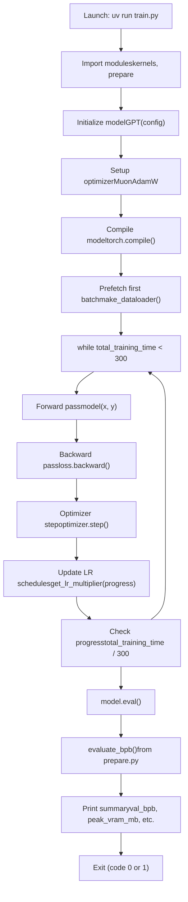
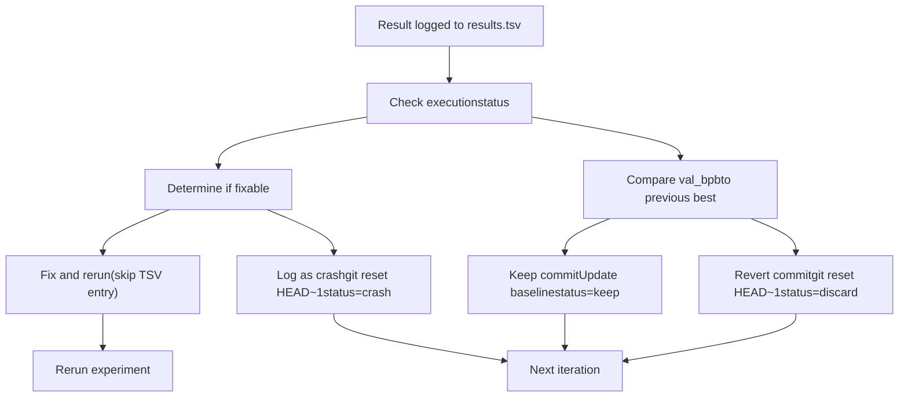

# 实验生命周期

相关源文件

-   [analysis.ipynb](https://github.com/karpathy/autoresearch/blob/e6d79c12/analysis.ipynb)
-   [program.md](https://github.com/karpathy/autoresearch/blob/e6d79c12/program.md?plain=1)

本页详细说明单次实验的生命周期：从代码修改到结果记录。一次实验即自主研究循环中的一次迭代：agent 修改 `train.py`、提交改动、执行训练、提取指标并记录结果。关于整体研究循环结构，请参见 [The Research Loop (4.1)](https://github.com/karpathy/autoresearch/blob/e6d79c12/The Research Loop (4.1)) 关于指标提取后的决策流程（keep vs. discard），请参见 [Decision Making and Branch Management (4.3)](https://github.com/karpathy/autoresearch/blob/e6d79c12/Decision Making and Branch Management (4.3))

---

## 概览

每次实验会经历六个独立阶段：

| 阶段 | 时长 | 关键产物 | 可逆性 |
| --- | --- | --- | --- |
| 代码修改 | 可变 | 已修改的 `train.py` | 是（未提交前） |
| Git 提交 | < 1s | Git commit hash | 是（通过 reset） |
| 执行 | ~7 分钟 | `run.log` | 否 |
| 指标提取 | < 1s | 解析后的数值 | N/A |
| 结果记录 | < 1s | 更新后的 `results.tsv` | 否 |
| 决策阶段 | < 1s | Git 状态变化 | 视情况而定 |

实验生命周期设计为**原子且可复现**：每次运行都会产出一个 Git commit、执行日志和 TSV 记录，且可追溯到具体代码改动。

来源： [program.md90-110](https://github.com/karpathy/autoresearch/blob/e6d79c12/program.md?plain=1#L90-L110) [train.py1-632](https://github.com/karpathy/autoresearch/blob/e6d79c12/train.py#L1-L632)

---

## 实验生命周期状态机

> **[Mermaid stateDiagram]**
> *(图表结构无法解析)*

来源： [program.md90-110](https://github.com/karpathy/autoresearch/blob/e6d79c12/program.md?plain=1#L90-L110)

---

## 阶段 1：代码修改

agent 基于实验假设修改 `train.py`。这是自主运行期间唯一允许变更的文件。

### 可修改的代码实体

`train.py` 中以下组件均可修改：

| 组件 | 代码位置 | 示例 |
| --- | --- | --- |
| 模型架构 | `GPTConfig` [train.py33-42](https://github.com/karpathy/autoresearch/blob/e6d79c12/train.py#L33-L42) | `n_layer`, `n_head`, `n_embd`, `window_pattern` |
| 超参数 | Lines 430-453 | `EMBEDDING_LR`, `MATRIX_LR`, `WEIGHT_DECAY`, `ADAM_BETAS` |
| 模型规模 | Lines 434, 451-452 | `ASPECT_RATIO`, `DEPTH`, `DEVICE_BATCH_SIZE` |
| 优化器设置 | `GPT.setup_optimizer()` [train.py237-267](https://github.com/karpathy/autoresearch/blob/e6d79c12/train.py#L237-L267) | 学习率、参数分组 |
| 训练循环 | Lines 544-606 | 梯度累积、调度逻辑 |
| 模型组件 | `CausalSelfAttention`, `MLP`, `Block` | 注意力机制、前馈结构 |

### 不可变依赖

agent 可以读取但不能修改：

-   `prepare.py`: `Tokenizer`, `make_dataloader()`, `evaluate_bpb()` [prepare.py1-248](https://github.com/karpathy/autoresearch/blob/e6d79c12/prepare.py#L1-L248)
-   `pyproject.toml`: 依赖规范
-   `~/.cache/autoresearch/` 中的数据分片 [program.md15](https://github.com/karpathy/autoresearch/blob/e6d79c12/program.md?plain=1#L15-L15)

来源： [train.py1-632](https://github.com/karpathy/autoresearch/blob/e6d79c12/train.py#L1-L632) [program.md25-31](https://github.com/karpathy/autoresearch/blob/e6d79c12/program.md?plain=1#L25-L31)

---

## 阶段 2：Git 提交

修改 `train.py` 后，agent 会创建 Git commit，将实验改动作为检查点。

> **[Mermaid sequence]**
> *(图表结构无法解析)*

提交信息通常描述实验想法（例如 "Increase MATRIX\_LR to 0.04"）。7 位 commit hash 会成为该实验在 `results.tsv` 中的主标识 [program.md74](https://github.com/karpathy/autoresearch/blob/e6d79c12/program.md?plain=1#L74-L74)

**关键点**：此时 commit 已存在，但尚未经过测试。若实验失败，该 commit 会通过 `git reset HEAD~1` 回退 [program.md104](https://github.com/karpathy/autoresearch/blob/e6d79c12/program.md?plain=1#L104-L104)

来源： [program.md98-104](https://github.com/karpathy/autoresearch/blob/e6d79c12/program.md?plain=1#L98-L104)

---

## 阶段 3：执行

agent 通过 `uv run train.py` 启动训练，并将所有输出重定向到 `run.log` [program.md99](https://github.com/karpathy/autoresearch/blob/e6d79c12/program.md?plain=1#L99-L99)：

```
uv run train.py > run.log 2>&1
```
该阶段由三个子阶段组成：启动、训练循环、最终评估。

### 执行流程图


来源： [train.py1-632](https://github.com/karpathy/autoresearch/blob/e6d79c12/train.py#L1-L632)

### 启动阶段

**关键操作** [train.py458-516](https://github.com/karpathy/autoresearch/blob/e6d79c12/train.py#L458-L516)：

1.  **环境设置** [train.py7-9](https://github.com/karpathy/autoresearch/blob/e6d79c12/train.py#L7-L9)：配置 PyTorch 内存分配器。
2.  **加载 tokenizer** [train.py466](https://github.com/karpathy/autoresearch/blob/e6d79c12/train.py#L466-L466)：从 `~/.cache/autoresearch/tokenizer/` 加载预训练 tokenizer。
3.  **实例化模型** [train.py483-486](https://github.com/karpathy/autoresearch/blob/e6d79c12/train.py#L483-L486)：创建 `GPT` 模型并通过 `to_empty(device=device)` 迁移到 CUDA。
4.  **设置优化器** [train.py500-507](https://github.com/karpathy/autoresearch/blob/e6d79c12/train.py#L500-L507)：调用 `model.setup_optimizer()` 创建 `MuonAdamW` 实例。
5.  **模型编译** [train.py509](https://github.com/karpathy/autoresearch/blob/e6d79c12/train.py#L509-L509)：应用 `torch.compile()` 提升性能。
6.  **创建 dataloader** [train.py511-512](https://github.com/karpathy/autoresearch/blob/e6d79c12/train.py#L511-L512)：初始化训练 dataloader 并预取首个 batch。

来源： [train.py458-516](https://github.com/karpathy/autoresearch/blob/e6d79c12/train.py#L458-L516)

### 训练循环

**核心循环结构** [train.py544-606](https://github.com/karpathy/autoresearch/blob/e6d79c12/train.py#L544-L606)：

-   **时间预算约束** [train.py604-605](https://github.com/karpathy/autoresearch/blob/e6d79c12/train.py#L604-L605)：当 `total_training_time >= 300` 秒时退出循环。
-   **基于进度的调度** [train.py556](https://github.com/karpathy/autoresearch/blob/e6d79c12/train.py#L556-L556)：`progress = total_training_time / 300` 驱动学习率调度。
-   **Warmup/Warmdown** [train.py519-526](https://github.com/karpathy/autoresearch/blob/e6d79c12/train.py#L519-L526)：`get_lr_multiplier(progress)` 实现 warmup 与 warmdown 阶段。
-   **快速失败检测** [train.py571-573](https://github.com/karpathy/autoresearch/blob/e6d79c12/train.py#L571-L573)：若 `train_loss > 100`，以返回码 1 退出（避免在发散运行上浪费时间）。

来源： [train.py544-606](https://github.com/karpathy/autoresearch/blob/e6d79c12/train.py#L544-L606)

### 最终评估

训练循环完成后，模型会进入评估：

```
model.eval()with autocast_ctx:    val_bpb = evaluate_bpb(model, tokenizer, DEVICE_BATCH_SIZE)
```
`evaluate_bpb()` 函数 [prepare.py220-248](https://github.com/karpathy/autoresearch/blob/e6d79c12/prepare.py#L220-L248) 是**不可变评估框架**，它处理 `EVAL_TOKENS` 并返回一个表示模型困惑度的单一浮点值。

来源： [train.py612-614](https://github.com/karpathy/autoresearch/blob/e6d79c12/train.py#L612-L614) [prepare.py220-248](https://github.com/karpathy/autoresearch/blob/e6d79c12/prepare.py#L220-L248)

---

## 阶段 4：指标提取

agent 使用 `grep` 从 `run.log` 解析关键指标 [program.md100](https://github.com/karpathy/autoresearch/blob/e6d79c12/program.md?plain=1#L100-L100)：

```
grep "^val_bpb:\|^peak_vram_mb:" run.log
```
**提取指标**：

| 指标 | 格式 | 示例 | 来源行 |
| --- | --- | --- | --- |
| `val_bpb` | Float（6 位小数） | 0.997900 | [train.py623](https://github.com/karpathy/autoresearch/blob/e6d79c12/train.py#L623-L623) |
| `peak_vram_mb` | Float（1 位小数） | 45060.2 | [train.py626](https://github.com/karpathy/autoresearch/blob/e6d79c12/train.py#L626-L626) |

**派生值**：`memory_gb` 按 `peak_vram_mb / 1024` 计算 [program.md76](https://github.com/karpathy/autoresearch/blob/e6d79c12/program.md?plain=1#L76-L76)

来源： [program.md100-101](https://github.com/karpathy/autoresearch/blob/e6d79c12/program.md?plain=1#L100-L101) [train.py622-631](https://github.com/karpathy/autoresearch/blob/e6d79c12/train.py#L622-L631)

---

## 阶段 5：结果记录

每个实验都会记录到 `results.tsv`，该文件为 5 列的制表符分隔格式 [program.md71](https://github.com/karpathy/autoresearch/blob/e6d79c12/program.md?plain=1#L71-L71)：

```
commit	val_bpb	memory_gb	status	description
```
### TSV 模式

| 列 | 类型 | 格式 | 示例 | 说明 |
| --- | --- | --- | --- | --- |
| `commit` | String | 7-char hash | `a1b2c3d` | Git commit short hash |
| `val_bpb` | Float | 6 decimals | `0.997900` | Validation bits-per-byte; `0.000000` for crashes |
| `memory_gb` | Float | 1 decimal | `44.0` | Peak VRAM in GB; `0.0` for crashes |
| `status` | Enum | `keep`, `discard`, `crash` | `keep` | Outcome of decision-making phase |
| `description` | String | Free text | `increase LR to 0.04` | Short experiment description |

来源： [program.md64-88](https://github.com/karpathy/autoresearch/blob/e6d79c12/program.md?plain=1#L64-L88)

---

## 阶段 6：进入决策阶段

记录结果后，agent 会评估本次结果，并决定保留还是丢弃该 commit [program.md103-104](https://github.com/karpathy/autoresearch/blob/e6d79c12/program.md?plain=1#L103-L104)

### 决策标准


来源： [program.md102-110](https://github.com/karpathy/autoresearch/blob/e6d79c12/program.md?plain=1#L102-L110)

---

## 时序与性能

典型实验时长 [program.md107-108](https://github.com/karpathy/autoresearch/blob/e6d79c12/program.md?plain=1#L107-L108)：

| 阶段 | 时间 | 波动 | 瓶颈 |
| --- | --- | --- | --- |
| 代码修改 | 30-120s | 高 | agent 推理时间 |
| Git 提交 | < 1s | 低 | 磁盘 I/O |
| 执行 - 启动 | 20-30s | 中 | Torch 编译、模型初始化 |
| 执行 - 训练 | 300s | 低 | 固定 5 分钟预算 |
| 执行 - 评估 | 1-3s | 低 | 验证数据规模 |
| 指标提取 | < 1s | 低 | Grep 操作 |
| 结果记录 | < 1s | 低 | 文件追加 |
| **总计** | **~7 分钟** | 中 | 主要由训练时长决定 |

来源： [program.md107-108](https://github.com/karpathy/autoresearch/blob/e6d79c12/program.md?plain=1#L107-L108) [train.py544-606](https://github.com/karpathy/autoresearch/blob/e6d79c12/train.py#L544-L606)

---

## 错误场景

### 超时

若执行超过 10 分钟，agent 将终止进程并按失败处理（`status=crash`）[program.md108](https://github.com/karpathy/autoresearch/blob/e6d79c12/program.md?plain=1#L108-L108)

### 快速失败（Loss 爆炸）

若 `train_loss > 100`，脚本会以返回码 1 退出 [train.py571-573](https://github.com/karpathy/autoresearch/blob/e6d79c12/train.py#L571-L573) agent 会将其记录为 crash。

### 显存不足（OOM）

若 CUDA 显存耗尽，脚本会崩溃。agent 可尝试修复（例如减小 `DEVICE_BATCH_SIZE`），或将其记录为 crash 并继续下一次实验 [program.md110](https://github.com/karpathy/autoresearch/blob/e6d79c12/program.md?plain=1#L110-L110)

来源： [program.md107-110](https://github.com/karpathy/autoresearch/blob/e6d79c12/program.md?plain=1#L107-L110) [train.py571-573](https://github.com/karpathy/autoresearch/blob/e6d79c12/train.py#L571-L573)
