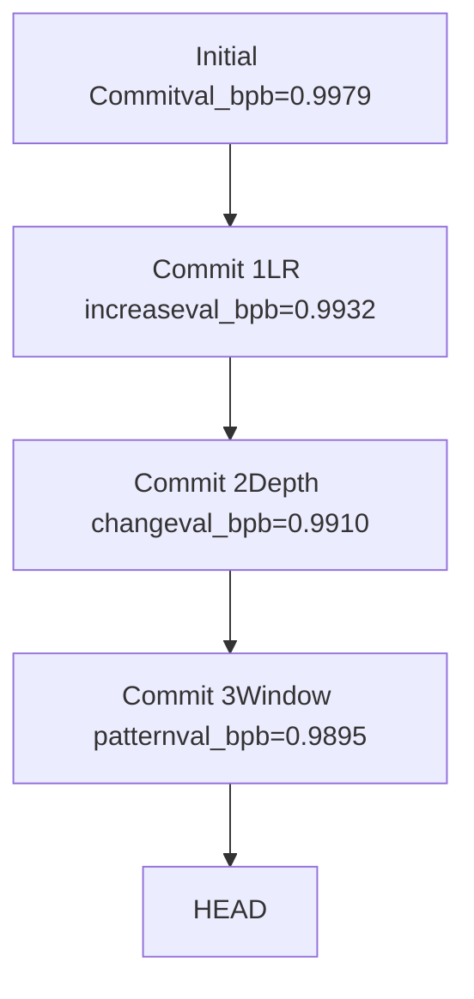

# 决策制定与分支管理

相关源文件

-   [.gitignore](https://github.com/karpathy/autoresearch/blob/e6d79c12/.gitignore)
-   [program.md](https://github.com/karpathy/autoresearch/blob/e6d79c12/program.md?plain=1)

## 目的与范围

本页面记录了用于决定是否保留或丢弃对 `train.py` 的实验性修改的决策逻辑，以及 Git 分支操作如何实现优化前沿。每次实验完成后（[4.2](https://github.com/karpathy/autoresearch/blob/e6d79c12/4.2)），智能体必须判断该修改是否提升了性能。该决策决定 Git 提交是被保留（推进分支）还是被回滚（返回到先前状态）。

关于通向该决策点的实验生命周期信息，请参见 [4.2 Experiment Lifecycle](https://github.com/karpathy/autoresearch/blob/e6d79c12/4.2 Experiment Lifecycle)；关于决策中使用的 `val_bpb` 指标详情，请参见 [5.1 Validation Bits Per Byte](https://github.com/karpathy/autoresearch/blob/e6d79c12/5.1 Validation Bits Per Byte)；关于所有决策的完整日志，请参见 [6.1 results.tsv Structure](https://github.com/karpathy/autoresearch/blob/e6d79c12/6.1 results.tsv Structure)

**来源：** [program.md90-110](https://github.com/karpathy/autoresearch/blob/e6d79c12/program.md?plain=1#L90-L110)

---

## 二元决策模型

基于智能体对 `run.log` 及其产生的 `val_bpb` 指标的评估，每次实验会得到以下三种结果之一 [program.md41-62](https://github.com/karpathy/autoresearch/blob/e6d79c12/program.md?plain=1#L41-L62)

| 结果 | 条件 | Git 操作 | `results.tsv` 状态 |
| --- | --- | --- | --- |
| **保留** | `val_bpb < previous_best` | 提交被保留 | `keep` |
| **丢弃** | `val_bpb >= previous_best` | `git reset` 到上一个提交 | `discard` |
| **崩溃** | grep 输出为空或超时 | `git reset` 到上一个提交 | `crash` |

该决策基于性能比较，且严格为二元判定。在自治循环期间不存在人工干预或人工审阅——智能体评估指标后会立即执行相应的 Git 操作 [program.md103-105](https://github.com/karpathy/autoresearch/blob/e6d79c12/program.md?plain=1#L103-L105)

**来源：** [program.md103-105](https://github.com/karpathy/autoresearch/blob/e6d79c12/program.md?plain=1#L103-L105) [program.md41-62](https://github.com/karpathy/autoresearch/blob/e6d79c12/program.md?plain=1#L41-L62)

---

## 决策标准

### 主指标：val\_bpb

保留还是丢弃的唯一决定因素是 `val_bpb`（验证集 bits per byte）。仅当满足以下条件时，修改才会被保留：

```
current_val_bpb < best_val_bpb_so_far
```
比较采用严格不等式——性能相等会导致丢弃，除非满足简洁性准则。目标是持续改进：“get the lowest val\_bpb” [program.md33](https://github.com/karpathy/autoresearch/blob/e6d79c12/program.md?plain=1#L33-L33) 由于 `val_bpb` 与词表大小无关，且在固定评估集上测量，因此该比较在所有架构修改之间都保持公平 [program.md29-31](https://github.com/karpathy/autoresearch/blob/e6d79c12/program.md?plain=1#L29-L31)

**来源：** [program.md33](https://github.com/karpathy/autoresearch/blob/e6d79c12/program.md?plain=1#L33-L33) [program.md103-104](https://github.com/karpathy/autoresearch/blob/e6d79c12/program.md?plain=1#L103-L104) [program.md29-31](https://github.com/karpathy/autoresearch/blob/e6d79c12/program.md?plain=1#L29-L31)

### 次级约束：peak\_vram\_mb

`peak_vram_mb` 与 `val_bpb` 一同通过如下 grep 命令提取：

```
grep "^val_bpb:\|^peak_vram_mb:" run.log
```
然而，VRAM 是一个**软约束**：“Some increase is acceptable for meaningful val\_bpb gains, but it should not blow up dramatically” [program.md35](https://github.com/karpathy/autoresearch/blob/e6d79c12/program.md?plain=1#L35-L35) 智能体会进行权衡判断——`val_bpb` 的显著下降可能可以接受 10-20% 的 VRAM 增长，但边际改进不应导致内存预算显著膨胀。

显存溢出（OOM）错误会导致 `crash` 状态并自动丢弃 [program.md110](https://github.com/karpathy/autoresearch/blob/e6d79c12/program.md?plain=1#L110-L110)

**来源：** [program.md35](https://github.com/karpathy/autoresearch/blob/e6d79c12/program.md?plain=1#L35-L35) [program.md100](https://github.com/karpathy/autoresearch/blob/e6d79c12/program.md?plain=1#L100-L100) [program.md110](https://github.com/karpathy/autoresearch/blob/e6d79c12/program.md?plain=1#L110-L110)

### 简洁性准则

当 `val_bpb` 的改进幅度很小时，代码简洁性将成为决胜因素 [program.md37](https://github.com/karpathy/autoresearch/blob/e6d79c12/program.md?plain=1#L37-L37)：

| 场景 | 决策 |
| --- | --- |
| 提升 0.001 + 增加 20 行复杂度 | 丢弃（“Probably not worth it”） |
| 通过删除代码获得 0.001 提升 | 保留（“Definitely keep”） |
| 几乎无变化 + 代码更简洁 | 保留 |
| 性能相同 + 移除特性 | 保留（“simplification win”） |

该准则可防止代码库积累仅带来极小价值的投机性优化。智能体会权衡“复杂度成本与改进幅度” [program.md37](https://github.com/karpathy/autoresearch/blob/e6d79c12/program.md?plain=1#L37-L37)

**来源：** [program.md37](https://github.com/karpathy/autoresearch/blob/e6d79c12/program.md?plain=1#L37-L37)

---

## 作为优化前沿的 Git 分支

实验在一个专用分支上运行（例如 `autoresearch/mar5`），该分支在初始化期间创建 [program.md9-10](https://github.com/karpathy/autoresearch/blob/e6d79c12/program.md?plain=1#L9-L10) 该分支充当**优化前沿**——其 HEAD 始终表示当前已知的最佳配置。


**关键属性：**

-   分支上的每个提交都使 `val_bpb` 相比其父提交有所改进 [program.md103](https://github.com/karpathy/autoresearch/blob/e6d79c12/program.md?plain=1#L103-L103)
-   被丢弃的实验不会被提交到永久历史中——它们会被 reset [program.md104](https://github.com/karpathy/autoresearch/blob/e6d79c12/program.md?plain=1#L104-L104)
-   就验证性能而言，该分支形成了单调改进的序列。
-   该分支上的 `git log` 仅显示推进了最优水平的成功实验。

**来源：** [program.md9-10](https://github.com/karpathy/autoresearch/blob/e6d79c12/program.md?plain=1#L9-L10) [program.md92](https://github.com/karpathy/autoresearch/blob/e6d79c12/program.md?plain=1#L92-L92) [program.md103-105](https://github.com/karpathy/autoresearch/blob/e6d79c12/program.md?plain=1#L103-L105)

---

## 保留决策：推进分支

当 `val_bpb` 改善时，实验通过保留 Git 提交来“推进”分支 [program.md103](https://github.com/karpathy/autoresearch/blob/e6d79c12/program.md?plain=1#L103-L103)

**Git 操作序列：**

**示例命令流程：**

```
# Modify train.py (e.g., increase DEPTH from 8 to 10)git add train.pygit commit -m "increase depth to 10"# Commit hash: a1b2c3d uv run train.py > run.log 2>&1grep "^val_bpb:" run.log# Output: val_bpb:          0.989500 # Decision: 0.9895 < 0.9910 (previous best) -> KEEP# Append to results.tsv:# a1b2c3d	0.989500	46.2	keep	increase depth to 10
```
提交信息会简要描述该修改，因为它会成为永久实验历史的一部分 [program.md78](https://github.com/karpathy/autoresearch/blob/e6d79c12/program.md?plain=1#L78-L78)

**来源：** [program.md98](https://github.com/karpathy/autoresearch/blob/e6d79c12/program.md?plain=1#L98-L98) [program.md103](https://github.com/karpathy/autoresearch/blob/e6d79c12/program.md?plain=1#L103-L103) [program.md78](https://github.com/karpathy/autoresearch/blob/e6d79c12/program.md?plain=1#L78-L78)

---

## 丢弃决策：回滚状态

当 `val_bpb` 未能改进时，智能体会执行 `git reset` 以返回到前一个提交 [program.md104](https://github.com/karpathy/autoresearch/blob/e6d79c12/program.md?plain=1#L104-L104)

**Git 操作序列：**

**示例命令流程：**

```
# Modify train.py (e.g., switch to GeLU activation)git add train.pygit commit -m "switch to GeLU activation"# Commit hash: b2c3d4e uv run train.py > run.log 2>&1grep "^val_bpb:" run.log# Output: val_bpb:          0.992100 # Decision: 0.9921 >= 0.9895 (previous best) -> DISCARD# Append to results.tsv:# b2c3d4e	0.992100	45.8	discard	switch to GeLU activation git reset --hard HEAD~1# HEAD now back at a1b2c3d (previous commit)
```
被丢弃的提交哈希仍会记录在 `results.tsv` 中用于分析，但它不再存在于 Git 历史中 [program.md102](https://github.com/karpathy/autoresearch/blob/e6d79c12/program.md?plain=1#L102-L102)

**来源：** [program.md102](https://github.com/karpathy/autoresearch/blob/e6d79c12/program.md?plain=1#L102-L102) [program.md104](https://github.com/karpathy/autoresearch/blob/e6d79c12/program.md?plain=1#L104-L104)

---

## 决策状态机

完整的决策流程集成了指标提取、比较逻辑和 Git 操作：

**决策点：**

1.  **Grep 输出检查** [program.md101](https://github.com/karpathy/autoresearch/blob/e6d79c12/program.md?plain=1#L101-L101)：输出为空表示崩溃。
2.  **val\_bpb 比较** [program.md103-104](https://github.com/karpathy/autoresearch/blob/e6d79c12/program.md?plain=1#L103-L104)：决定保留还是丢弃。
3.  **日志记录** [program.md102](https://github.com/karpathy/autoresearch/blob/e6d79c12/program.md?plain=1#L102-L102)：所有结果都记录到 `results.tsv`。
4.  **Git 操作** [program.md103-104](https://github.com/karpathy/autoresearch/blob/e6d79c12/program.md?plain=1#L103-L104)：保留提交，丢弃则 reset。

**来源：** [program.md94-110](https://github.com/karpathy/autoresearch/blob/e6d79c12/program.md?plain=1#L94-L110) [program.md101-104](https://github.com/karpathy/autoresearch/blob/e6d79c12/program.md?plain=1#L101-L104)

---

## 分支管理最佳实践

### 永不停止条件

实验循环会**无限期**运行，直到被手动中断 [program.md112](https://github.com/karpathy/autoresearch/blob/e6d79c12/program.md?plain=1#L112-L112) 智能体不会暂停并询问是否继续。这使得夜间自治运行成为可能，在平均人类睡眠时长内，智能体大约可以完成 100 次实验 [program.md114](https://github.com/karpathy/autoresearch/blob/e6d79c12/program.md?plain=1#L114-L114)

### 超时处理

实验应耗时约 5 分钟。如果一次运行超过 10 分钟，智能体会被指示终止该运行并将其视为失败（丢弃并回滚） [program.md108](https://github.com/karpathy/autoresearch/blob/e6d79c12/program.md?plain=1#L108-L108)

### 稀疏回退

智能体被指示，仅应“very very sparingly (if ever)”地回退到更早的提交（超出紧邻的前一个提交） [program.md106](https://github.com/karpathy/autoresearch/blob/e6d79c12/program.md?plain=1#L106-L106) 分支以单调方式向前推进——向后跳转会丢弃整个改进前沿。

**来源：** [program.md106](https://github.com/karpathy/autoresearch/blob/e6d79c12/program.md?plain=1#L106-L106) [program.md108](https://github.com/karpathy/autoresearch/blob/e6d79c12/program.md?plain=1#L108-L108) [program.md112-114](https://github.com/karpathy/autoresearch/blob/e6d79c12/program.md?plain=1#L112-L114)

---

## 与完整日志的关系

Git 分支与 `results.tsv` 的用途是互补的：

| 方面 | Git 分支（`autoresearch/<tag>`） | `results.tsv` |
| --- | --- | --- |
| **内容** | 仅成功实验（keep） | 所有实验（keep、discard、crash） |
| **用途** | 跟踪优化前沿 | 完整审计轨迹 |
| **提交** | 为改进而保留 | 所有尝试均记录哈希 |
| **持久性** | 永久 Git 历史 | 未跟踪文件 [program.md102](https://github.com/karpathy/autoresearch/blob/e6d79c12/program.md?plain=1#L102-L102) |

Git 历史表示优化地形中的“最佳路径”，而 `results.tsv` 捕获了完整搜索过程（包括失败尝试）。请注意，`results.tsv` 被明确排除在 Git 跟踪之外，以避免合并冲突和对研究分支的污染 [program.md102](https://github.com/karpathy/autoresearch/blob/e6d79c12/program.md?plain=1#L102-L102) [.gitignore23](https://github.com/karpathy/autoresearch/blob/e6d79c12/.gitignore#L23-L23)

**来源：** [program.md102](https://github.com/karpathy/autoresearch/blob/e6d79c12/program.md?plain=1#L102-L102) [program.md103-105](https://github.com/karpathy/autoresearch/blob/e6d79c12/program.md?plain=1#L103-L105) [.gitignore23](https://github.com/karpathy/autoresearch/blob/e6d79c12/.gitignore#L23-L23)

---

## 代码引用

决策逻辑主要在智能体指令中定义：

-   **决策标准：** [program.md33](https://github.com/karpathy/autoresearch/blob/e6d79c12/program.md?plain=1#L33-L33)（val\_bpb 目标）、[program.md35](https://github.com/karpathy/autoresearch/blob/e6d79c12/program.md?plain=1#L35-L35)（VRAM 约束）、[program.md37](https://github.com/karpathy/autoresearch/blob/e6d79c12/program.md?plain=1#L37-L37)（简洁性）
-   **保留逻辑：** [program.md103](https://github.com/karpathy/autoresearch/blob/e6d79c12/program.md?plain=1#L103-L103)（“advance the branch”）
-   **丢弃逻辑：** [program.md104](https://github.com/karpathy/autoresearch/blob/e6d79c12/program.md?plain=1#L104-L104)（“git reset back”）
-   **崩溃检测：** [program.md101](https://github.com/karpathy/autoresearch/blob/e6d79c12/program.md?plain=1#L101-L101)（grep 输出为空）
-   **日志要求：** [program.md102](https://github.com/karpathy/autoresearch/blob/e6d79c12/program.md?plain=1#L102-L102)（记录到 results.tsv）
-   **自治运行：** [program.md112](https://github.com/karpathy/autoresearch/blob/e6d79c12/program.md?plain=1#L112-L112)（never stop）

实际的 Git 操作（`git commit`、`git reset --hard HEAD~1`）由智能体基于这些指令作为 shell 命令执行。

**来源：** [program.md33-37](https://github.com/karpathy/autoresearch/blob/e6d79c12/program.md?plain=1#L33-L37) [program.md94-110](https://github.com/karpathy/autoresearch/blob/e6d79c12/program.md?plain=1#L94-L110)
