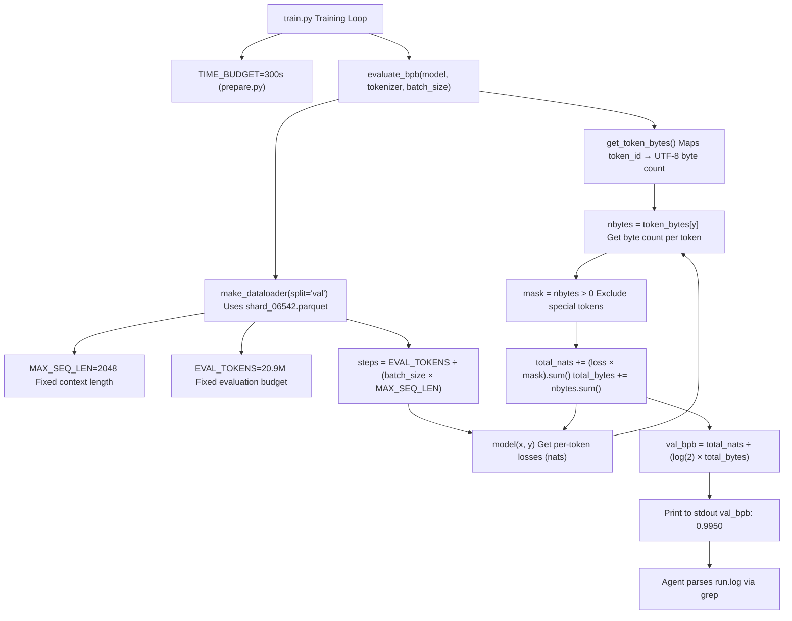
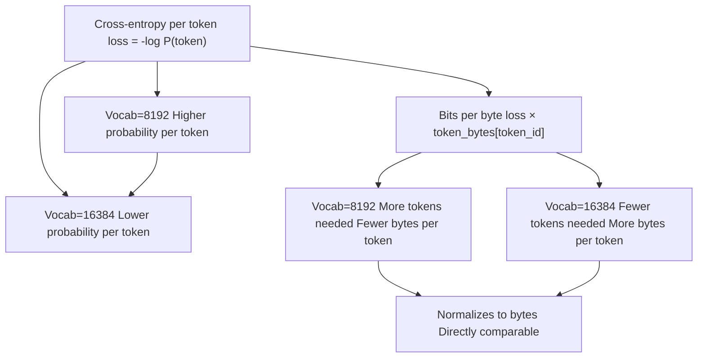
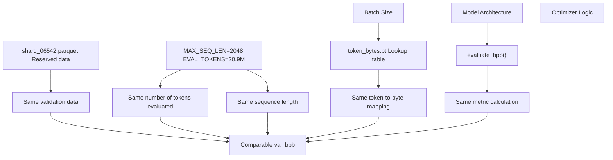

# 指标与评估

相关源文件

-   [analysis.ipynb](https://github.com/karpathy/autoresearch/blob/e6d79c12/analysis.ipynb)
-   [prepare.py](https://github.com/karpathy/autoresearch/blob/e6d79c12/prepare.py)
-   [program.md](https://github.com/karpathy/autoresearch/blob/e6d79c12/program.md?plain=1)

本页面记录了 autoresearch 中使用的评估策略，重点关注 `val_bpb`（验证 bits per byte）指标，以及系统约束如何支持在多样化实验间进行公平比较。评估框架由 `prepare.py` 实现，且不可变——智能体不能修改它——从而确保所有性能提升都反映真实的模型进步，而非评估不一致性。

关于以下内容的详细信息：

-   `val_bpb` 的数学定义与计算方式，请参见 [Validation Bits Per Byte (val\_bpb)](/karpathy/autoresearch/5.1-validation-bits-per-byte-(val_bpb))
-   评估期间施加的硬约束与软约束，请参见 [System Constraints](/karpathy/autoresearch/5.2-system-constraints)
-   评估一致性背后的设计哲学，请参见 [Fair Comparison Philosophy](/karpathy/autoresearch/5.3-fair-comparison-philosophy)

---

## 评估策略

autoresearch 系统使用**固定评估协议**来确保实验之间的比较具有意义。所有评估均由 [prepare.py327-349](https://github.com/karpathy/autoresearch/blob/e6d79c12/prepare.py#L327-L349) 中的 `evaluate_bpb` 函数执行，该函数不可变并由 `train.py` 导入。此种分离可保证架构变化、超参数调整与优化器修改都在相同真值基准上进行测量。

**核心评估原则：**

1.  **单一指标**：`val_bpb`（bits per byte）是唯一优化目标 [program.md33](https://github.com/karpathy/autoresearch/blob/e6d79c12/program.md?plain=1#L33-L33)
2.  **固定预算**：每个实验都严格训练 5 分钟（300 秒） [prepare.py31](https://github.com/karpathy/autoresearch/blob/e6d79c12/prepare.py#L31-L31)
3.  **一致数据**：验证始终使用固定的最后一个 shard `shard_06542.parquet` [prepare.py43-44](https://github.com/karpathy/autoresearch/blob/e6d79c12/prepare.py#L43-L44)
4.  **固定 token 数**：评估严格处理 `EVAL_TOKENS`（约 20.9M）个 token [prepare.py32](https://github.com/karpathy/autoresearch/blob/e6d79c12/prepare.py#L32-L32)
5.  **不可变评估框架**：智能体不得修改 `evaluate_bpb` 函数 [program.md31](https://github.com/karpathy/autoresearch/blob/e6d79c12/program.md?plain=1#L31-L31)

来源： [prepare.py31-44](https://github.com/karpathy/autoresearch/blob/e6d79c12/prepare.py#L31-L44) [prepare.py327-349](https://github.com/karpathy/autoresearch/blob/e6d79c12/prepare.py#L327-L349) [program.md31-33](https://github.com/karpathy/autoresearch/blob/e6d79c12/program.md?plain=1#L31-L33)

---

## val\_bpb 指标

**定义**：验证 bits per byte（val\_bpb）用于衡量在模型预测分布下编码每个文本字节所需的比特数。值越低表示压缩效果越好，也即语言建模效果越好。

**关键属性：**

| 属性 | 值 | 意义 |
| --- | --- | --- |
| **词表大小独立性** | 是 | 模型可自由更改 `VOCAB_SIZE` |
| **单位** | bits/byte | 可直接解释的信息论指标 |
| **方向** | 越低越好 | 目标是最小化 `val_bpb` |
| **特殊 token** | 排除 | 字节长度为 0 的 token（例如 \`< |

该指标通过以下步骤计算：

1.  计算逐 token 交叉熵损失（单位为 nats）。
2.  通过 `token_bytes` 查找张量将每个 token 映射到其 UTF-8 字节长度 [prepare.py185-200](https://github.com/karpathy/autoresearch/blob/e6d79c12/prepare.py#L185-L200)
3.  对总 nats 与总字节数求和（排除 `nbytes == 0` 的特殊 token）。
4.  转换为 bits per byte：`total_nats / (math.log(2) * total_bytes)` [prepare.py348](https://github.com/karpathy/autoresearch/blob/e6d79c12/prepare.py#L348-L348)

来源： [prepare.py185-200](https://github.com/karpathy/autoresearch/blob/e6d79c12/prepare.py#L185-L200) [prepare.py327-349](https://github.com/karpathy/autoresearch/blob/e6d79c12/prepare.py#L327-L349) [program.md33](https://github.com/karpathy/autoresearch/blob/e6d79c12/program.md?plain=1#L33-L33)

---

## 评估流程

**流程说明：**

1.  5 分钟训练预算结束后，`train.py` 调用 `evaluate_bpb(model, tokenizer, batch_size)` [prepare.py327](https://github.com/karpathy/autoresearch/blob/e6d79c12/prepare.py#L327-L327)
2.  函数使用 `get_token_bytes()` 获取一个张量，用于将每个 token ID 映射到其 UTF-8 字节长度 [prepare.py237-240](https://github.com/karpathy/autoresearch/blob/e6d79c12/prepare.py#L237-L240)
3.  使用 `split="val"` 创建验证 dataloader，该 dataloader 只读取固定的 `VAL_SHARD` [prepare.py246-247](https://github.com/karpathy/autoresearch/blob/e6d79c12/prepare.py#L246-L247)
4.  基于 `EVAL_TOKENS` 计算评估步数 [prepare.py338](https://github.com/karpathy/autoresearch/blob/e6d79c12/prepare.py#L338-L338)
5.  在每一步中，模型计算逐 token 损失。
6.  将每个 token 映射到其字节数，并屏蔽特殊 token（0 字节） [prepare.py344-345](https://github.com/karpathy/autoresearch/blob/e6d79c12/prepare.py#L344-L345)
7.  在所有步骤上累积损失和字节数。
8.  最终指标按 bits per byte 计算 [prepare.py348](https://github.com/karpathy/autoresearch/blob/e6d79c12/prepare.py#L348-L348)

来源： [prepare.py237-247](https://github.com/karpathy/autoresearch/blob/e6d79c12/prepare.py#L237-L247) [prepare.py327-349](https://github.com/karpathy/autoresearch/blob/e6d79c12/prepare.py#L327-L349) [program.md58-62](https://github.com/karpathy/autoresearch/blob/e6d79c12/program.md?plain=1#L58-L62)

---

## 词表大小独立性

`val_bpb` 指标最关键的属性是**词表大小独立性**，它允许智能体在保持结果可比性的同时，尝试不同的分词器配置（例如修改 `prepare.py` 中的 `VOCAB_SIZE` 或 `train.py` 中的架构）。

**示例比较：** 即使在更大词表下逐 token 损失更高（因为概率质量分布得更稀薄），`val_bpb` 仍可保持稳定，因为分母（总字节数）由文本本身决定，而非模型选择用多少 token 来表示该文本 [prepare.py348](https://github.com/karpathy/autoresearch/blob/e6d79c12/prepare.py#L348-L348)

来源： [prepare.py327-349](https://github.com/karpathy/autoresearch/blob/e6d79c12/prepare.py#L327-L349) [prepare.py185-200](https://github.com/karpathy/autoresearch/blob/e6d79c12/prepare.py#L185-L200)

---

## 评估一致性保障

系统施加了多项约束，以确保每个实验都以相同方式进行评估：

**约束执行：**

1.  **数据切分**：验证始终使用 `shard_06542.parquet`，该数据在准备阶段被保留 [prepare.py43-44](https://github.com/karpathy/autoresearch/blob/e6d79c12/prepare.py#L43-L44)
2.  **序列长度**：无论训练配置如何，评估都使用 `MAX_SEQ_LEN=2048` [prepare.py30](https://github.com/karpathy/autoresearch/blob/e6d79c12/prepare.py#L30-L30)
3.  **token 预算**：评估严格处理 `EVAL_TOKENS` 个 token，独立于 batch size [prepare.py32](https://github.com/karpathy/autoresearch/blob/e6d79c12/prepare.py#L32-L32)
4.  **字节映射**：`token_bytes` 张量在分词器训练期间只计算一次 [prepare.py185](https://github.com/karpathy/autoresearch/blob/e6d79c12/prepare.py#L185-L185)
5.  **函数不可变性**：智能体不能修改 `prepare.py`，因此评估逻辑被固定 [program.md29](https://github.com/karpathy/autoresearch/blob/e6d79c12/program.md?plain=1#L29-L29)

来源： [prepare.py30-44](https://github.com/karpathy/autoresearch/blob/e6d79c12/prepare.py#L30-L44) [prepare.py185-200](https://github.com/karpathy/autoresearch/blob/e6d79c12/prepare.py#L185-L200) [prepare.py327-349](https://github.com/karpathy/autoresearch/blob/e6d79c12/prepare.py#L327-L349) [program.md29-31](https://github.com/karpathy/autoresearch/blob/e6d79c12/program.md?plain=1#L29-L31)

---

## 代码实体引用

以下代码实体实现了评估系统：

| 实体 | 位置 | 角色 |
| --- | --- | --- |
| `evaluate_bpb()` | [prepare.py327-349](https://github.com/karpathy/autoresearch/blob/e6d79c12/prepare.py#L327-L349) | 主评估函数（不可变） |
| `get_token_bytes()` | [prepare.py237-240](https://github.com/karpathy/autoresearch/blob/e6d79c12/prepare.py#L237-L240) | 加载 token→byte 查找张量 |
| `token_bytes.pt` | `TOKENIZER_DIR` | 每个 token 预计算的 UTF-8 字节计数 [prepare.py144](https://github.com/karpathy/autoresearch/blob/e6d79c12/prepare.py#L144-L144) |
| `make_dataloader()` | [prepare.py260-321](https://github.com/karpathy/autoresearch/blob/e6d79c12/prepare.py#L260-L321) | 创建验证数据迭代器 |
| `EVAL_TOKENS` | [prepare.py32](https://github.com/karpathy/autoresearch/blob/e6d79c12/prepare.py#L32-L32) | 固定 token 预算（约 20.9M token） |
| `MAX_SEQ_LEN` | [prepare.py30](https://github.com/karpathy/autoresearch/blob/e6d79c12/prepare.py#L30-L30) | 固定序列长度（2048 token） |
| `TIME_BUDGET` | [prepare.py31](https://github.com/karpathy/autoresearch/blob/e6d79c12/prepare.py#L31-L31) | 固定训练时长（300 秒） |
| `VAL_SHARD` | [prepare.py43](https://github.com/karpathy/autoresearch/blob/e6d79c12/prepare.py#L43-L43) | 保留的验证 shard 索引（6542） |

**`train.py` 中的评估工作流：** 训练脚本应在其循环结束时调用 `evaluate_bpb` 并打印结果。随后，智能体使用 `grep "^val_bpb:" run.log` 提取该值 [program.md61](https://github.com/karpathy/autoresearch/blob/e6d79c12/program.md?plain=1#L61-L61)

来源： [prepare.py30-44](https://github.com/karpathy/autoresearch/blob/e6d79c12/prepare.py#L30-L44) [prepare.py144](https://github.com/karpathy/autoresearch/blob/e6d79c12/prepare.py#L144-L144) [prepare.py327-349](https://github.com/karpathy/autoresearch/blob/e6d79c12/prepare.py#L327-L349) [program.md61](https://github.com/karpathy/autoresearch/blob/e6d79c12/program.md?plain=1#L61-L61)

---

## 指标与约束

系统区分了**指标**（我们测量什么）与**约束**（我们固定什么）：

-   **目标**：最小化 `val_bpb` [program.md33](https://github.com/karpathy/autoresearch/blob/e6d79c12/program.md?plain=1#L33-L33)
-   **硬约束**：`TIME_BUDGET`（5 分钟）、`MAX_SEQ_LEN`、`EVAL_TOKENS`，以及不可变的 `evaluate_bpb` 函数 [program.md23-31](https://github.com/karpathy/autoresearch/blob/e6d79c12/program.md?plain=1#L23-L31)
-   **软约束**：`peak_vram_mb`（VRAM 不应大幅膨胀） [program.md35](https://github.com/karpathy/autoresearch/blob/e6d79c12/program.md?plain=1#L35-L35)，以及**简洁性准则**（在其他条件相同的情况下，更偏好更简单的代码） [program.md37](https://github.com/karpathy/autoresearch/blob/e6d79c12/program.md?plain=1#L37-L37)

**关键洞见**：智能体可以修改 `train.py` 中的任何内容（架构、优化器、LR），但所有实验都以相同方式评估。该设计确保 `val_bpb` 的改进反映真实进步，而不是评估伪影。

来源： [prepare.py30-32](https://github.com/karpathy/autoresearch/blob/e6d79c12/prepare.py#L30-L32) [program.md23-37](https://github.com/karpathy/autoresearch/blob/e6d79c12/program.md?plain=1#L23-L37)

---

## 与结果跟踪的集成

评估完成后，智能体从 `run.log` 提取 `val_bpb` 和 `peak_vram_mb`，并将其记录到 `results.tsv` [program.md100-102](https://github.com/karpathy/autoresearch/blob/e6d79c12/program.md?plain=1#L100-L102)

**决策逻辑**如下：

-   若 `val_bpb` **改善**（更低）：`status=keep`，保留 git 提交并推进分支 [program.md103](https://github.com/karpathy/autoresearch/blob/e6d79c12/program.md?plain=1#L103-L103)
-   若 `val_bpb` **持平或更差**：`status=discard`，智能体执行 `git reset` 返回先前状态 [program.md104](https://github.com/karpathy/autoresearch/blob/e6d79c12/program.md?plain=1#L104-L104)
-   若训练**崩溃**：`status=crash`，智能体尝试修复或继续前进 [program.md110](https://github.com/karpathy/autoresearch/blob/e6d79c12/program.md?plain=1#L110-L110)

有关结果跟踪与可视化的详情，请参见 [Results and Analysis](/karpathy/autoresearch/6-results-and-analysis)。

来源： [program.md100-110](https://github.com/karpathy/autoresearch/blob/e6d79c12/program.md?plain=1#L100-L110)
