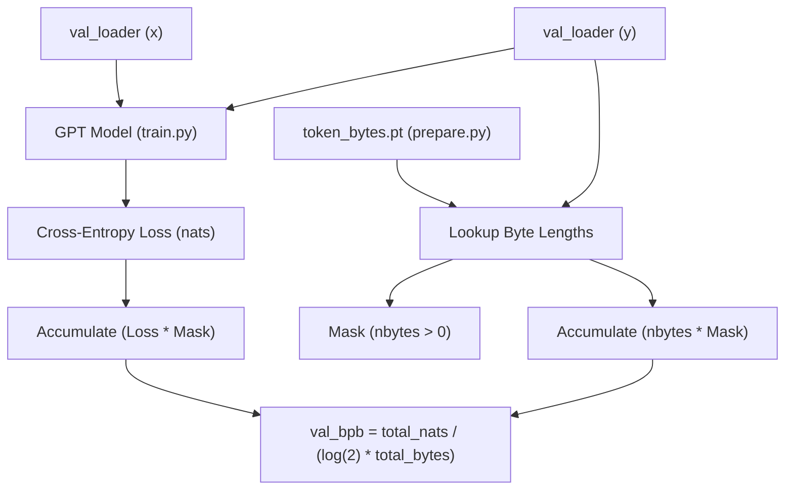
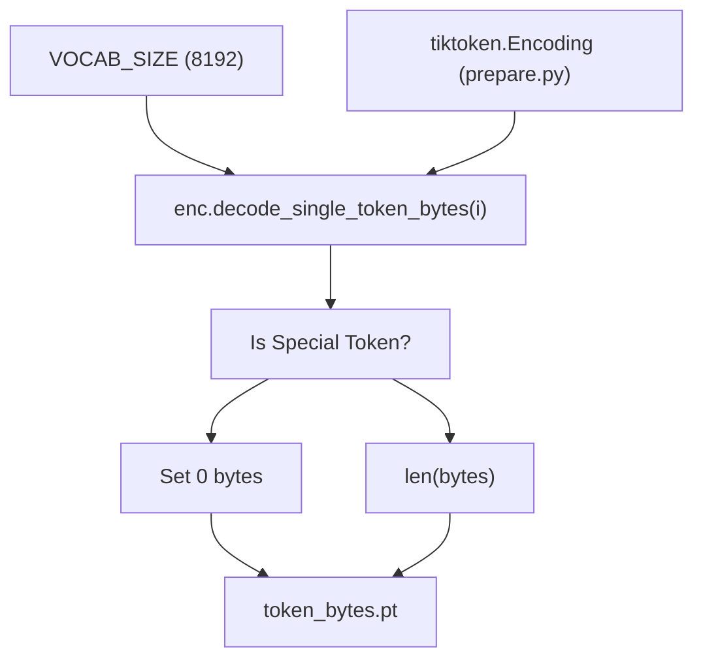

# 验证 Bits Per Byte（val\_bpb）

相关源文件

-   [analysis.ipynb](https://github.com/karpathy/autoresearch/blob/e6d79c12/analysis.ipynb)
-   [prepare.py](https://github.com/karpathy/autoresearch/blob/e6d79c12/prepare.py)

## 目的与范围

本页面对 `autoresearch` 系统中用于评估模型性能的 `val_bpb`（验证 bits per byte）指标提供详细的技术说明。它定义了该指标的计算方式，解释其词表大小独立性，并记录了其在评估框架中的实现。

关于其他系统约束的信息，请参见 [System Constraints](https://github.com/karpathy/autoresearch/blob/e6d79c12/System Constraints)；关于更广泛的评估哲学细节，请参见 [Fair Comparison Philosophy](https://github.com/karpathy/autoresearch/blob/e6d79c12/Fair Comparison Philosophy)

---

## 概览

`val_bpb` 指标以每字节比特数衡量语言模型对原始 UTF-8 文本的**压缩效率**。不同于依赖分词器词表大小的传统基于困惑度的指标，`val_bpb` 按被预测文本的字节内容进行归一化。此属性对 `autoresearch` 至关重要：智能体可以修改 `VOCAB_SIZE`、模型架构或 `train.py` 的任何其他方面，而得到的 `val_bpb` 仍可直接比较。

**关键属性：**

-   **越低越好**：每字节所需比特更少表示更好的压缩/预测效果。
-   **词表大小无关**：支持跨不同分词器的公平比较。
-   **固定评估框架**：使用固定验证 shard 和 token 预算。
-   **字节级归一化**：衡量原始文本中的信息量，而非 token 数量。

来源： [prepare.py327-349](https://github.com/karpathy/autoresearch/blob/e6d79c12/prepare.py#L327-L349) [prepare.py45](https://github.com/karpathy/autoresearch/blob/e6d79c12/prepare.py#L45-L45)

---

## evaluate\_bpb 函数

核心评估逻辑位于 `prepare.py` 的 `evaluate_bpb` 函数中。该函数属于不可变的基础设施层；为确保所有实验评估一致，智能体被指示不得修改它。

### 固定评估参数

评估环境由 `prepare.py` 中定义的常量严格控制，以防止“投机”指标。

| 参数 | 值 | 文件引用 | 目的 |
| --- | --- | --- | --- |
| `MAX_SEQ_LEN` | 2048 | [prepare.py30](https://github.com/karpathy/autoresearch/blob/e6d79c12/prepare.py#L30-L30) | 评估 batch 的上下文长度 |
| `EVAL_TOKENS` | 20,971,520 | [prepare.py32](https://github.com/karpathy/autoresearch/blob/e6d79c12/prepare.py#L32-L32) | 评估的 token 总数（40 \* 524288） |
| `VAL_SHARD` | 6542 | [prepare.py43](https://github.com/karpathy/autoresearch/blob/e6d79c12/prepare.py#L43-L43) | 固定验证 shard（`shard_06542.parquet`） |
| `VOCAB_SIZE` | 8192 | [prepare.py45](https://github.com/karpathy/autoresearch/blob/e6d79c12/prepare.py#L45-L45) | BPE 分词器的默认词表大小 |

来源： [prepare.py30-45](https://github.com/karpathy/autoresearch/blob/e6d79c12/prepare.py#L30-L45)

---

## 计算过程

`val_bpb` 计算连接了模型 token 级交叉熵损失与字节级信息内容之间的差距。

### 高层数据流

下图展示 `evaluate_bpb` 函数如何使用 `token_bytes` 查找表将模型输出转换为最终指标。

**标题：val\_bpb 计算数据流**

来源： [prepare.py327-349](https://github.com/karpathy/autoresearch/blob/e6d79c12/prepare.py#L327-L349)

### 实现细节

该函数会在由 `EVAL_TOKENS` 决定的步数上迭代验证 dataloader。

1.  **模型前向传播**：模型使用 `reduction='none'` 计算交叉熵损失，以获得逐 token 的 nats [prepare.py341](https://github.com/karpathy/autoresearch/blob/e6d79c12/prepare.py#L341-L341)
2.  **字节查找**：目标 token `y` 被用作 `token_bytes` 张量的索引 [prepare.py344](https://github.com/karpathy/autoresearch/blob/e6d79c12/prepare.py#L344-L344)
3.  **特殊 token 屏蔽**：字节数为 0 的 token（如 `<|reserved_0|>` 这类特殊 token）会被屏蔽 [prepare.py345](https://github.com/karpathy/autoresearch/blob/e6d79c12/prepare.py#L345-L345)
4.  **聚合**：在所有评估步骤上累积总 nats 和总字节数 [prepare.py346-347](https://github.com/karpathy/autoresearch/blob/e6d79c12/prepare.py#L346-L347)
5.  **转换**：最终比值除以 `math.log(2)`，将单位从 nats/byte 转为 bits/byte [prepare.py349](https://github.com/karpathy/autoresearch/blob/e6d79c12/prepare.py#L349-L349)

来源： [prepare.py327-349](https://github.com/karpathy/autoresearch/blob/e6d79c12/prepare.py#L327-L349)

---

## token\_bytes 张量

`token_bytes` 张量是在 `prepare.py` 一次性初始化阶段创建的关键组件。它将词表中的每个 token ID 映射到其实际 UTF-8 字节长度。

### 生成逻辑

在 `train_tokenizer` 期间，系统会遍历 `tiktoken` 编码的整个词表。

**标题：Token 到字节映射过程**

来源： [prepare.py184-205](https://github.com/karpathy/autoresearch/blob/e6d79c12/prepare.py#L184-L205)

### 为什么特殊 token 的字节数为零

特殊 token（例如 `BOS_TOKEN`）是控制信号，而非实际文本内容。将其字节长度设为 0 后，`evaluate_bpb` 函数就会有效忽略模型在这些 token 上的表现，从而确保该指标仅反映底层自然语言或代码数据的压缩效果。

来源： [prepare.py186-189](https://github.com/karpathy/autoresearch/blob/e6d79c12/prepare.py#L186-L189) [prepare.py345](https://github.com/karpathy/autoresearch/blob/e6d79c12/prepare.py#L345-L345)

---

## 数学公式

`val_bpb` 指标定义为：

$$ \\text{val\_bpb} = \\frac{\\sum \\text{CrossEntropyLoss (nats)}}{\\log(2) \\cdot \\sum \\text{UTF-8 Byte Lengths}} $$

该公式确保：

1.  小词表的**模型 A** 与大词表的**模型 B** 可以直接比较。
2.  分词改进（将更多信息压缩进更少 token）能够被捕获，因为对同一验证文本而言分母（总字节数）保持不变；若模型更准确预测高密度 token，分子（总 nats）就会下降。

来源： [prepare.py328-332](https://github.com/karpathy/autoresearch/blob/e6d79c12/prepare.py#L328-L332) [prepare.py349](https://github.com/karpathy/autoresearch/blob/e6d79c12/prepare.py#L349-L349)

---

## 在结果与分析中的使用

`val_bpb` 是记录在 `results.tsv` 中的主值 [analysis.ipynb24-26](https://github.com/karpathy/autoresearch/blob/e6d79c12/analysis.ipynb#L24-L26) `analysis.ipynb` 笔记本使用该指标来：

-   识别**运行最小值**（研究进展的“frontier”） [analysis.ipynb112-114](https://github.com/karpathy/autoresearch/blob/e6d79c12/analysis.ipynb#L112-L114)
-   计算连续“KEPT”实验之间的**Delta**（改进幅度） [analysis.ipynb196-200](https://github.com/karpathy/autoresearch/blob/e6d79c12/analysis.ipynb#L196-L200)
-   生成 `progress.png` 可视化图，该图按实验序列绘制 `val_bpb` [analysis.ipynb130-141](https://github.com/karpathy/autoresearch/blob/e6d79c12/analysis.ipynb#L130-L141)

来源： [analysis.ipynb24-32](https://github.com/karpathy/autoresearch/blob/e6d79c12/analysis.ipynb#L24-L32) [analysis.ipynb108-115](https://github.com/karpathy/autoresearch/blob/e6d79c12/analysis.ipynb#L108-L115) [analysis.ipynb196-200](https://github.com/karpathy/autoresearch/blob/e6d79c12/analysis.ipynb#L196-L200)
