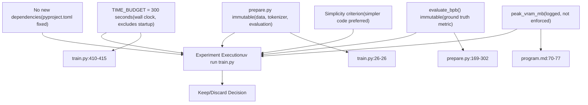
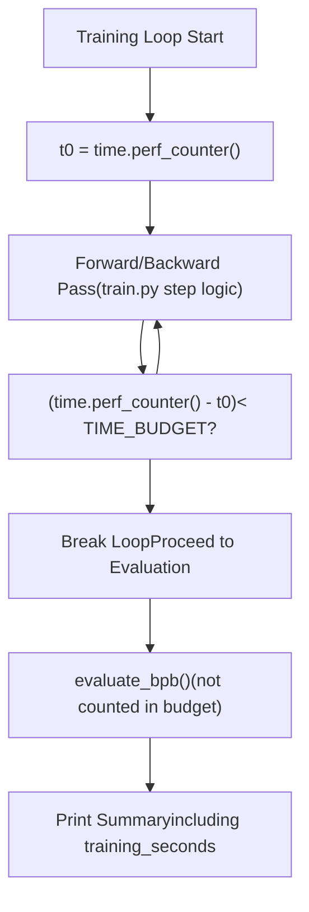
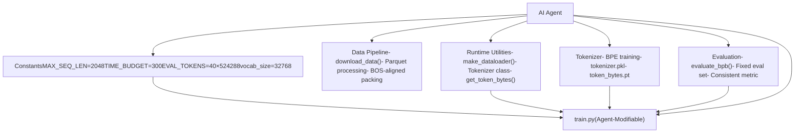
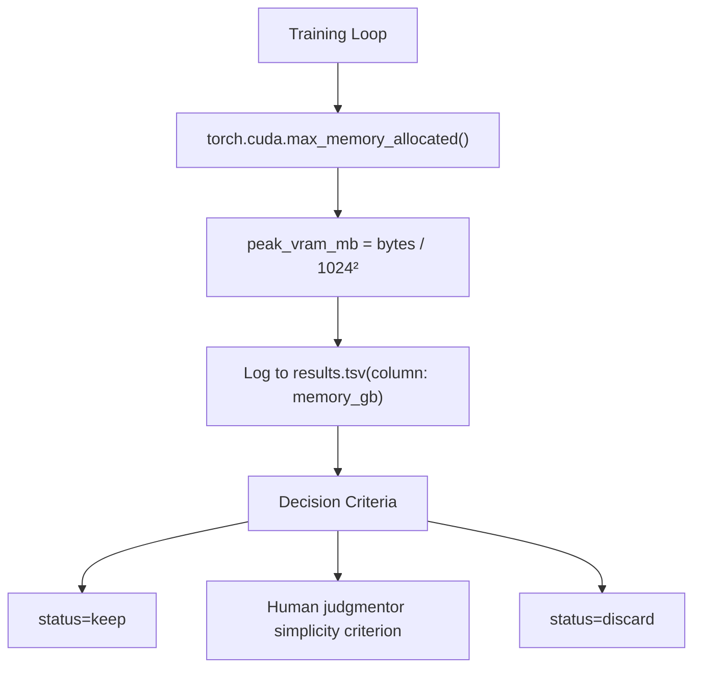

# 系统约束

相关源文件

-   [program.md](https://github.com/karpathy/autoresearch/blob/e6d79c12/program.md?plain=1)
-   [train.py](https://github.com/karpathy/autoresearch/blob/e6d79c12/train.py)

本页面记录了所有 autoresearch 实验必须遵守的固定约束。这些约束确保了实验之间的公平比较，并使自治研究循环能够可靠运行。关于主要优化指标的信息，请参见 [Validation Bits Per Byte (val\_bpb)](/karpathy/autoresearch/5.1-validation-bits-per-byte-(val_bpb))。关于这些约束背后的原理，请参见 [Fair Comparison Philosophy](/karpathy/autoresearch/5.3-fair-comparison-philosophy)。

## 约束层级概览

autoresearch 系统实施两类约束：**硬约束**（绝不允许违反）和**软约束**（提供指导，但在结果足够合理时允许一定灵活性）。

### 约束分类

**来源**： [program.md23](https://github.com/karpathy/autoresearch/blob/e6d79c12/program.md?plain=1#L23-L23) [program.md28-32](https://github.com/karpathy/autoresearch/blob/e6d79c12/program.md?plain=1#L28-L32) [program.md35](https://github.com/karpathy/autoresearch/blob/e6d79c12/program.md?plain=1#L35-L35) [train.py26](https://github.com/karpathy/autoresearch/blob/e6d79c12/train.py#L26-L26) [train.py410-415](https://github.com/karpathy/autoresearch/blob/e6d79c12/train.py#L410-L415)

## 硬约束

### 固定时间预算：TIME\_BUDGET = 300 秒

最基础的约束是：所有训练运行都采用**固定 5 分钟（300 秒）时间预算**。这是墙钟时间测量，不包含编译与启动开销。

#### 时间预算规范

| 参数 | 值 | 测量类型 | 不包含项 |
| --- | --- | --- | --- |
| `TIME_BUDGET` | 300 秒 | 墙钟时间 | 编译、启动、最终评估 |
| 预期总运行时长 | 约 325 秒 | 墙钟时间 | 包含启动（约 20 秒）+ 评估（约 5 秒） |
| 超时阈值 | 600 秒（10 分钟） | 墙钟时间 | 超过则终止并视为崩溃 |

#### 代码中的实现

时间预算通过 `train.py` 训练循环中的墙钟计时来执行：

`train.py` 中实际计时代码结构遵循如下模式：

-   从 `prepare.py` 导入 `TIME_BUDGET` [train.py26](https://github.com/karpathy/autoresearch/blob/e6d79c12/train.py#L26-L26)
-   在循环开始前初始化 `t0 = time.perf_counter()` [train.py410](https://github.com/karpathy/autoresearch/blob/e6d79c12/train.py#L410-L410)
-   每个训练 step 后检查经过时间 `t_now - t0 < TIME_BUDGET` [train.py415](https://github.com/karpathy/autoresearch/blob/e6d79c12/train.py#L415-L415)
-   当预算耗尽时跳出训练循环。
-   在最终汇总输出中记录 `training_seconds` [program.md48](https://github.com/karpathy/autoresearch/blob/e6d79c12/program.md?plain=1#L48-L48)

**来源**： [prepare.py24-29](https://github.com/karpathy/autoresearch/blob/e6d79c12/prepare.py#L24-L29) [train.py26](https://github.com/karpathy/autoresearch/blob/e6d79c12/train.py#L26-L26) [train.py410-415](https://github.com/karpathy/autoresearch/blob/e6d79c12/train.py#L410-L415) [program.md23](https://github.com/karpathy/autoresearch/blob/e6d79c12/program.md?plain=1#L23-L23) [program.md48](https://github.com/karpathy/autoresearch/blob/e6d79c12/program.md?plain=1#L48-L48)

#### 原理与影响

固定时间预算有以下几个关键影响：

1.  **平台特定优化**：在固定预算下，智能体会在该时间窗口内针对*你的特定硬件*优化最佳模型。H100 与 4090 会得到不同结果，但各自都能找到其最优架构。[program.md58](https://github.com/karpathy/autoresearch/blob/e6d79c12/program.md?plain=1#L58-L58)
2.  **吞吐与效率权衡**：实验会自然平衡模型规模、batch size 和复杂度。若学习效率更高，处理更少 token 的大模型可能优于处理更多 token 的小模型。[program.md33](https://github.com/karpathy/autoresearch/blob/e6d79c12/program.md?plain=1#L33-L33)
3.  **每小时约 12 次实验**：5 分钟训练 + 约 25 秒开销，每次实验约需 5.5 分钟。可实现**约 12 次实验/小时**，或**8 小时夜间运行约 100 次实验**。[program.md114](https://github.com/karpathy/autoresearch/blob/e6d79c12/program.md?plain=1#L114-L114)
4.  **无基于 step 的比较**：不同于在固定 step 数比较模型的传统训练，autoresearch 允许任意架构变化，只要能在时间预算内完成。

**来源**： [program.md33](https://github.com/karpathy/autoresearch/blob/e6d79c12/program.md?plain=1#L33-L33) [program.md58](https://github.com/karpathy/autoresearch/blob/e6d79c12/program.md?plain=1#L58-L58) [program.md114](https://github.com/karpathy/autoresearch/blob/e6d79c12/program.md?plain=1#L114-L114)

### 不可变基础设施文件

第二条硬约束是：智能体**不能修改** `prepare.py` 及其提供的工具。该文件为只读，并建立了固定的实验基础设施。[program.md28-29](https://github.com/karpathy/autoresearch/blob/e6d79c12/program.md?plain=1#L28-L29)

#### 不可修改的内容

**关键不可变组件**：

1.  **`MAX_SEQ_LEN = 2048`**：训练与评估的最大序列长度。[prepare.py24](https://github.com/karpathy/autoresearch/blob/e6d79c12/prepare.py#L24-L24)
2.  **`TIME_BUDGET = 300`**：5 分钟时间约束。[prepare.py25](https://github.com/karpathy/autoresearch/blob/e6d79c12/prepare.py#L25-L25)
3.  **`EVAL_TOKENS`**：精确评估 40 个验证 batch，确保所有实验评估成本一致。[prepare.py26](https://github.com/karpathy/autoresearch/blob/e6d79c12/prepare.py#L26-L26)
4.  **`evaluate_bpb()` 函数**：真实评估函数。[prepare.py273-302](https://github.com/karpathy/autoresearch/blob/e6d79c12/prepare.py#L273-L302)
5.  **分词器训练**：BPE 分词器在 `prepare.py` 执行期间仅训练一次并缓存。[prepare.py100-167](https://github.com/karpathy/autoresearch/blob/e6d79c12/prepare.py#L100-L167)
6.  **数据准备**：数据下载、处理与打包算法均固定。[prepare.py46-98](https://github.com/karpathy/autoresearch/blob/e6d79c12/prepare.py#L46-L98)

**来源**： [prepare.py24-26](https://github.com/karpathy/autoresearch/blob/e6d79c12/prepare.py#L24-L26) [prepare.py46-98](https://github.com/karpathy/autoresearch/blob/e6d79c12/prepare.py#L46-L98) [prepare.py100-167](https://github.com/karpathy/autoresearch/blob/e6d79c12/prepare.py#L100-L167) [prepare.py273-302](https://github.com/karpathy/autoresearch/blob/e6d79c12/prepare.py#L273-L302) [program.md28-29](https://github.com/karpathy/autoresearch/blob/e6d79c12/program.md?plain=1#L28-L29)

### 不允许新增依赖

第三条硬约束是，除 `pyproject.toml` 中指定内容外，不得添加任何包。智能体只能使用现有依赖。[program.md30](https://github.com/karpathy/autoresearch/blob/e6d79c12/program.md?plain=1#L30-L30)

## 软约束

### 内存使用：peak\_vram\_mb

与硬性时间预算不同，**VRAM 使用是软约束**。`peak_vram_mb` 会记录到 `results.tsv`，但不会作为硬上限强制执行。[program.md35](https://github.com/karpathy/autoresearch/blob/e6d79c12/program.md?plain=1#L35-L35)

#### 内存跟踪与记录

**来源**： [program.md35](https://github.com/karpathy/autoresearch/blob/e6d79c12/program.md?plain=1#L35-L35) [program.md70-77](https://github.com/karpathy/autoresearch/blob/e6d79c12/program.md?plain=1#L70-L77)

#### 内存增长指导原则

来自 `program.md`：

> **VRAM** is a soft constraint. Some increase is acceptable for meaningful val\_bpb gains, but it should not blow up dramatically. [program.md35](https://github.com/karpathy/autoresearch/blob/e6d79c12/program.md?plain=1#L35-L35)

在实践中，需要权衡内存增长与 `val_bpb` 改进。内存溢出（OOM）崩溃会被视为失败。[program.md110](https://github.com/karpathy/autoresearch/blob/e6d79c12/program.md?plain=1#L110-L110)

### 简洁性准则

第二条软约束是在性能相等或相近时偏好**更简单的代码**。

来自 `program.md`：

> **Simplicity criterion**: All else being equal, simpler is better. A small improvement that adds ugly complexity is not worth it. Conversely, removing something and getting equal or better results is a great outcome — that's a simplification win. [program.md37](https://github.com/karpathy/autoresearch/blob/e6d79c12/program.md?plain=1#L37-L37)

该准则鼓励智能体探索代码删除与简化，而不只是做加法。

**来源**： [program.md37](https://github.com/karpathy/autoresearch/blob/e6d79c12/program.md?plain=1#L37-L37)

## 约束执行机制

### 执行汇总表

| 约束 | 执行机制 | 违反后果 |
| --- | --- | --- |
| `TIME_BUDGET = 300s` | 在 `train.py` 中通过 `time.perf_counter()` 检查 [train.py415](https://github.com/karpathy/autoresearch/blob/e6d79c12/train.py#L415-L415) | 循环自动中断，实验正常完成 |
| `prepare.py` 不可变 | `program.md` 中的智能体指令 [program.md28-29](https://github.com/karpathy/autoresearch/blob/e6d79c12/program.md?plain=1#L28-L29) | 智能体应拒绝；若违反，系统可能损坏 |
| 不新增依赖 | `uv` 仅从固定 `pyproject.toml` 安装 [program.md30](https://github.com/karpathy/autoresearch/blob/e6d79c12/program.md?plain=1#L30-L30) | 导入错误，实验崩溃 |
| `evaluate_bpb()` 不可变 | 函数位于 `prepare.py`（不可变） | 修改将违反基础设施约束 |
| `peak_vram_mb` 软上限 | 记录但不强制执行 [program.md35](https://github.com/karpathy/autoresearch/blob/e6d79c12/program.md?plain=1#L35-L35) | 实验可完成；在 keep/discard 时决策 |
| 简洁性准则 | keep/discard 时由智能体判断 [program.md37](https://github.com/karpathy/autoresearch/blob/e6d79c12/program.md?plain=1#L37-L37) | 不会自动执行；依赖智能体推理 |
| 超时（10 分钟） | 由智能体手动终止或超时包装器处理 [program.md108](https://github.com/karpathy/autoresearch/blob/e6d79c12/program.md?plain=1#L108-L108) | 记录为 crash，提交被丢弃 |

**来源**： [program.md23-37](https://github.com/karpathy/autoresearch/blob/e6d79c12/program.md?plain=1#L23-L37) [program.md108](https://github.com/karpathy/autoresearch/blob/e6d79c12/program.md?plain=1#L108-L108) [train.py415](https://github.com/karpathy/autoresearch/blob/e6d79c12/train.py#L415-L415)

## 超时处理

尽管训练循环设计为在 5 分钟内完成，智能体仍必须处理执行挂起或耗时异常长的病理情况。

### 超时策略

来自 `program.md`：

> **Timeout**: Each experiment should take ~5 minutes total (+ a few seconds for startup and eval overhead). If a run exceeds 10 minutes, kill it and treat it as a failure (discard and revert). [program.md108](https://github.com/karpathy/autoresearch/blob/e6d79c12/program.md?plain=1#L108-L108)

#### 预期运行时长拆分

对于一次典型成功实验：

| 阶段 | 时长 | 计入 TIME\_BUDGET？ |
| --- | --- | --- |
| 环境启动 | 约 5-10 秒 | ❌ 否 |
| **训练循环** | **约 300 秒** | ✅ **是** [train.py415](https://github.com/karpathy/autoresearch/blob/e6d79c12/train.py#L415-L415) |
| 最终评估 | 约 5 秒 | ❌ 否 |
| **总计** | **约 325-335 秒** | \- |

**来源**： [program.md48-49](https://github.com/karpathy/autoresearch/blob/e6d79c12/program.md?plain=1#L48-L49) [program.md108](https://github.com/karpathy/autoresearch/blob/e6d79c12/program.md?plain=1#L108-L108) [train.py415](https://github.com/karpathy/autoresearch/blob/e6d79c12/train.py#L415-L415)

---

本页面记录的约束为所有实验建立了**公平竞技场**。通过固定时间预算、基础设施和评估机制，autoresearch 确保 `val_bpb` 的改进反映真实模型进步。关于这些约束如何实现公平比较的细节，请参见 [Fair Comparison Philosophy](/karpathy/autoresearch/5.3-fair-comparison-philosophy)。
