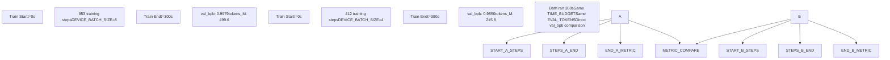

# 公平比较哲学

相关源文件

-   [README.md](https://github.com/karpathy/autoresearch/blob/e6d79c12/README.md?plain=1)
-   [program.md](https://github.com/karpathy/autoresearch/blob/e6d79c12/program.md?plain=1)

本页面解释了为什么即使模型架构、batch size、优化器和超参数发生激进变化，autoresearch 实验仍可直接比较。公平比较哲学是自治运行的核心：智能体可以安全修改 `train.py` 的任意方面，同时在所有实验之间维持有意义的公共指标。

---

## 核心公平比较机制

Autoresearch 通过三个不可变的设计决策来确保公平比较，这些决策将实验变量与评估基础设施分离。

### 固定时间预算执行

所有实验都严格运行 **300 秒训练时间**（墙钟时间），不含启动与编译开销。该约束由 `train.py` 的训练循环执行：循环会将经过时间与从 `prepare.py` 导入的 `TIME_BUDGET` 进行比较。

**训练时间流程**

**训练循环中的时间预算**

训练循环会测量经过时间，并在达到 `TIME_BUDGET` 时终止：

[train.py385-506](https://github.com/karpathy/autoresearch/blob/e6d79c12/train.py#L385-L506)

关键实现细节：

-   `TIME_BUDGET` 从 `prepare.py` 导入 [train.py4](https://github.com/karpathy/autoresearch/blob/e6d79c12/train.py#L4-L4)，且智能体不能更改 [program.md29-30](https://github.com/karpathy/autoresearch/blob/e6d79c12/program.md?plain=1#L29-L30)
-   计时不包含模型编译与初始评估 [train.py408-410](https://github.com/karpathy/autoresearch/blob/e6d79c12/train.py#L408-L410)
-   step 数会随模型规模、batch size 与 GPU 速度变化 [README.md64](https://github.com/karpathy/autoresearch/blob/e6d79c12/README.md?plain=1#L64-L64)
-   智能体不能通过延长训练时间来补偿较慢模型 [program.md23](https://github.com/karpathy/autoresearch/blob/e6d79c12/program.md?plain=1#L23-L23)

**来源**： [README.md17](https://github.com/karpathy/autoresearch/blob/e6d79c12/README.md?plain=1#L17-L17) [README.md64-65](https://github.com/karpathy/autoresearch/blob/e6d79c12/README.md?plain=1#L64-L65) [program.md23](https://github.com/karpathy/autoresearch/blob/e6d79c12/program.md?plain=1#L23-L23) [train.py4](https://github.com/karpathy/autoresearch/blob/e6d79c12/train.py#L4-L4) [train.py408-410](https://github.com/karpathy/autoresearch/blob/e6d79c12/train.py#L408-L410)

---

### 不可变评估框架

`prepare.py` 中的 `evaluate_bpb` 函数是不可修改的真实指标函数。这确保了无论架构如何变化，所有实验都按同一方式测量。

**评估逻辑分离**

```mermaid
flowchart TD
    EVAL_TOKENS["EVAL_TOKENS40 × 524288 = 20,971,520"]
    TOKEN_BYTES["token_bytes tensorByte count per token"]
    EVAL_FUNC["evaluate_bpb(model)Ground truth function"]
    MODEL_A["GPT Model Avocab_size=8192DEPTH=8"]
    MODEL_B["GPT Model Bvocab_size=4096DEPTH=12"]
    MODEL_C["GPT Model CCustom architecture"]
    METRIC_A["val_bpb: 0.9979"]
    METRIC_B["val_bpb: 0.9850"]
    METRIC_C["val_bpb: 0.9912"]

    EVAL --> TOKENS_EVAL_FUNC
    TOKEN --> BYTES_EVAL_FUNC
    MODEL --> A_EVAL_FUNC
    MODEL --> B_EVAL_FUNC
    MODEL --> C_EVAL_FUNC
    EVAL --> FUNC_METRIC_A
    EVAL --> FUNC_METRIC_B
    EVAL --> FUNC_METRIC_C
```

**评估函数特征**

| 属性 | 值 | 理由 |
| --- | --- | --- |
| 函数名 | `evaluate_bpb` | 定义于 `prepare.py` [program.md31](https://github.com/karpathy/autoresearch/blob/e6d79c12/program.md?plain=1#L31-L31) |
| 评估 token 数 | `EVAL_TOKENS` | 固定样本规模以保持方差一致 [README.md76](https://github.com/karpathy/autoresearch/blob/e6d79c12/README.md?plain=1#L76-L76) |
| 指标输出 | Bits per byte（浮点数） | 与词表大小无关 [README.md17](https://github.com/karpathy/autoresearch/blob/e6d79c12/README.md?plain=1#L17-L17) |
| 修改策略 | **不可变** | 智能体不可更改评估逻辑 [program.md29-31](https://github.com/karpathy/autoresearch/blob/e6d79c12/program.md?plain=1#L29-L31) |
| 位置 | `prepare.py` | 在智能体可修改范围之外 [README.md13](https://github.com/karpathy/autoresearch/blob/e6d79c12/README.md?plain=1#L13-L13) |

**来源**： [README.md13](https://github.com/karpathy/autoresearch/blob/e6d79c12/README.md?plain=1#L13-L13) [README.md17](https://github.com/karpathy/autoresearch/blob/e6d79c12/README.md?plain=1#L17-L17) [README.md76](https://github.com/karpathy/autoresearch/blob/e6d79c12/README.md?plain=1#L76-L76) [program.md29-31](https://github.com/karpathy/autoresearch/blob/e6d79c12/program.md?plain=1#L29-L31)

---

### 与词表大小无关的指标

`val_bpb` 指标衡量的是每字节比特数，而不是每 token 困惑度或交叉熵，因此不受词表大小变化影响。

**为什么使用 Bits Per Byte？**

困惑度等传统指标依赖词表大小：

-   **Perplexity**：`exp(cross_entropy_per_token)` —— 当词表大小变化时会变化。
-   **每 token 交叉熵**：词表越大 = 类别越多 = 熵通常越高。
-   **每字节比特数**：衡量实际数据字节的信息量，对分词方式不变 [README.md17](https://github.com/karpathy/autoresearch/blob/e6d79c12/README.md?plain=1#L17-L17)

**指标计算流程**

```mermaid
flowchart TD
    VOCAB_A["vocab_size=8192BPE tokenizer"]
    VOCAB_B["vocab_size=4096Smaller vocab"]
    VOCAB_C["vocab_size=256Byte-level"]
    PRED_A["Token probabilities8192 classes"]
    PRED_B["Token probabilities4096 classes"]
    PRED_C["Token probabilities256 classes"]
    TOKEN_BYTES_LOOKUP["token_bytes tensorMaps token → byte count"]
    BPB_CALC["Bits per byte calculationVocab-size independent"]
    RESULT["val_bpbDirectly comparable"]

    VOCAB --> A_PRED_A
    VOCAB --> B_PRED_B
    VOCAB --> C_PRED_C
    PRED --> A_TOKEN_BYTES_LOOKUP
    PRED --> B_TOKEN_BYTES_LOOKUP
    PRED --> C_TOKEN_BYTES_LOOKUP
    TOKEN --> BYTES_LOOKUP_BPB_CALC
    BPB --> CALC_RESULT
```

**计算概览**

`evaluate_bpb` 函数会：

1.  在验证集上运行模型，处理 `EVAL_TOKENS`。
2.  计算每个预测 token 的对数概率。
3.  使用 `token_bytes` 张量查找每个 token 的字节数。
4.  计算每字节比特数：`total_bits / total_bytes`。

这意味着，一个在分词器中改变 `vocab_size` 的实验（理论上若可行，但 `prepare.py` 是固定的），或改变模型处理这些 token 方式的实验，都会产生可与基线直接比较的 `val_bpb` [README.md17](https://github.com/karpathy/autoresearch/blob/e6d79c12/README.md?plain=1#L17-L17)

**来源**： [README.md17](https://github.com/karpathy/autoresearch/blob/e6d79c12/README.md?plain=1#L17-L17) [prepare.py](https://github.com/karpathy/autoresearch/blob/e6d79c12/prepare.py)

---

## 可变组件与不可变组件

公平比较哲学依赖于“智能体可修改内容”与“固定内容”之间的严格边界。

### 组件修改矩阵

| 组件 | 文件 | 智能体可修改？ | 理由 |
| --- | --- | --- | --- |
| `GPT` 模型架构 | `train.py` | ✅ 是 | 实验变量 [program.md26](https://github.com/karpathy/autoresearch/blob/e6d79c12/program.md?plain=1#L26-L26) |
| `MuonAdamW` 优化器 | `train.py` | ✅ 是 | 实验变量 [program.md26](https://github.com/karpathy/autoresearch/blob/e6d79c12/program.md?plain=1#L26-L26) |
| 训练循环 | `train.py` | ✅ 是 | 实验变量（在约束内） [program.md26](https://github.com/karpathy/autoresearch/blob/e6d79c12/program.md?plain=1#L26-L26) |
| 超参数 | `train.py` | ✅ 是 | 实验变量 [program.md26](https://github.com/karpathy/autoresearch/blob/e6d79c12/program.md?plain=1#L26-L26) |
| `DEVICE_BATCH_SIZE` | `train.py` | ✅ 是 | 可调优以平衡内存/吞吐 [README.md75](https://github.com/karpathy/autoresearch/blob/e6d79c12/README.md?plain=1#L75-L75) |
| `TOTAL_BATCH_SIZE` | `train.py` | ✅ 是 | 可调优以优化训练 [README.md79](https://github.com/karpathy/autoresearch/blob/e6d79c12/README.md?plain=1#L79-L79) |
| `TIME_BUDGET` | `prepare.py` | ❌ 否 | 公平比较约束 [program.md29](https://github.com/karpathy/autoresearch/blob/e6d79c12/program.md?plain=1#L29-L29) |
| `MAX_SEQ_LEN` | `prepare.py` | ❌ 否 | 数据准备参数 [program.md29](https://github.com/karpathy/autoresearch/blob/e6d79c12/program.md?plain=1#L29-L29) |
| `EVAL_TOKENS` | `prepare.py` | ❌ 否 | 评估一致性 [program.md29](https://github.com/karpathy/autoresearch/blob/e6d79c12/program.md?plain=1#L29-L29) |
| `evaluate_bpb` 函数 | `prepare.py` | ❌ 否 | 真实指标函数 [program.md31](https://github.com/karpathy/autoresearch/blob/e6d79c12/program.md?plain=1#L31-L31) |
| 分词器 | `prepare.py` | ❌ 否 | 在数据准备时固定 [program.md29](https://github.com/karpathy/autoresearch/blob/e6d79c12/program.md?plain=1#L29-L29) |
| Dataloader 逻辑 | `prepare.py` | ❌ 否 | 一致的数据采样 [program.md29](https://github.com/karpathy/autoresearch/blob/e6d79c12/program.md?plain=1#L29-L29) |

**代码实体映射**

```mermaid
flowchart TD
    TIME_BUDGET_CONST["TIME_BUDGET = 300"]
    MAX_SEQ_CONST["MAX_SEQ_LEN = 2048"]
    EVAL_TOKENS_CONST["EVAL_TOKENS = 40 × 524288"]
    EVALUATE_FUNC["def evaluate_bpb(model)"]
    DATALOADER_FUNC["def make_dataloader()"]
    TOKEN_BYTES_CONST["token_bytes"]
    GPT_CLASS["class GPT(nn.Module)"]
    MUON_CLASS["class MuonAdamW"]
    DEPTH_VAR["DEPTH = 8"]
    BATCH_VAR["DEVICE_BATCH_SIZE = 8"]
    TRAIN_LOOP["Training loopwhile elapsed < TIME_BUDGET"]

    TIME --> BUDGET_CONST_TRAIN_LOOP
    EVALUATE --> FUNC_TRAIN_LOOP
    DATALOADER --> FUNC_TRAIN_LOOP
    DEPTH --> VAR_GPT_CLASS
    BATCH --> VAR_TRAIN_LOOP
    GPT --> CLASS_TRAIN_LOOP
    MUON --> CLASS_TRAIN_LOOP
```

**执行机制**

这一边界通过 `program.md` 中的智能体指令来执行：

[program.md28-31](https://github.com/karpathy/autoresearch/blob/e6d79c12/program.md?plain=1#L28-L31)

智能体被明确禁止修改 `prepare.py`。这是策略约束——智能体在技术上可以编辑该文件，但这样做会违反研究协议并使所有结果失效。

**来源**： [README.md13-15](https://github.com/karpathy/autoresearch/blob/e6d79c12/README.md?plain=1#L13-L15) [README.md75](https://github.com/karpathy/autoresearch/blob/e6d79c12/README.md?plain=1#L75-L75) [README.md79](https://github.com/karpathy/autoresearch/blob/e6d79c12/README.md?plain=1#L79-L79) [program.md13-14](https://github.com/karpathy/autoresearch/blob/e6d79c12/program.md?plain=1#L13-L14) [program.md26-31](https://github.com/karpathy/autoresearch/blob/e6d79c12/program.md?plain=1#L26-L31)

---

## 平台特定优化

固定时间预算意味着 autoresearch 会针对其运行硬件进行优化，而不是追求普适最优架构。

### 平台优化哲学

```mermaid
flowchart TD
    H100_BUDGET["TIME_BUDGET = 300s"]
    H100_OPT["Agent optimizes for H100Large models viableHigh throughput"]
    H100_RESULT["Best: DEPTH=12, wide modelval_bpb: 0.9750"]
    M1_BUDGET["TIME_BUDGET = 300s"]
    M1_OPT["Agent optimizes for M1Small models preferredLower throughput"]
    M1_RESULT["Best: DEPTH=4, narrow modelval_bpb: 1.0200"]
    NO_COMPARE["Results NOT comparableacross platforms"]
    YES_COMPARE["Results ARE comparablewithin platform"]

    H100 --> BUDGET_H100_OPT
    H100 --> OPT_H100_RESULT
    M1 --> BUDGET_M1_OPT
    M1 --> OPT_M1_RESULT
    H100 --> RESULT_NO_COMPARE
    M1 --> RESULT_NO_COMPARE
    H100 --> RESULT_YES_COMPARE
    M1 --> RESULT_YES_COMPARE
```

**权衡：公平性 vs 普适性**

| 方面 | 固定时间预算 | 固定 step 预算 |
| --- | --- | --- |
| **跨实验公平性** | ✅ 完美（相同时间） | ❌ 不公平（大模型受罚） |
| **跨平台比较** | ❌ 无效（硬件不同） | ✅ 有效（计算量相同） |
| **智能体优化目标** | 平台特定效率 | 通用架构 |

固定时间预算设计优先考虑**平台内公平性**，而非**跨平台可比性** [README.md64](https://github.com/karpathy/autoresearch/blob/e6d79c12/README.md?plain=1#L64-L64)

**平台适配参数**

在较小平台上运行时，以下参数应进行调优（由人类在 `prepare.py` 中手动调优，或由智能体在 `train.py` 中调优）：

| 参数 | H100 默认值 | 小平台示例 | 理由 |
| --- | --- | --- | --- |
| `MAX_SEQ_LEN` | 2048 | 256-512 | 降低内存占用 \[README.md:75\] |
| `vocab_size` | 8192 | 256-1024 | 为简单数据使用更小分词器 \[README.md:74\] |
| `EVAL_TOKENS` | 20,971,520 | 更低 | 更快验证 \[README.md:76\] |
| `DEPTH` | 8 | 4 | 主要复杂度旋钮 \[README.md:77\] |
| `WINDOW_PATTERN` | "SSSL" | "L" | 避免低效模式 \[README.md:78\] |

**来源**： [README.md64-65](https://github.com/karpathy/autoresearch/blob/e6d79c12/README.md?plain=1#L64-L65) [README.md71-80](https://github.com/karpathy/autoresearch/blob/e6d79c12/README.md?plain=1#L71-L80)

---

## 比较有效性保障

### 有效比较

在以下条件下，实验**可直接比较**：

1.  ✅ 在同一平台运行（同一 GPU、同一机器）。
2.  ✅ 使用同一 `prepare.py`（相同 `TIME_BUDGET`、`EVAL_TOKENS`、`evaluate_bpb`）。
3.  ✅ 使用同一数据缓存（`~/.cache/autoresearch/` 未变化）。
4.  ✅ 在同一分支运行（例如 `autoresearch/mar5`）。

在这些条件下，无论模型大小、batch size 或架构如何，`val_bpb` 都是用于实验排序的有效指标 [README.md64](https://github.com/karpathy/autoresearch/blob/e6d79c12/README.md?plain=1#L64-L64)

### 无效比较

在以下条件下，实验**不可比较**：

1.  ❌ 在不同硬件上运行（H100 vs A100 vs MacBook）。
2.  ❌ `TIME_BUDGET` 不同（300s vs 600s）。
3.  ❌ `EVAL_TOKENS` 不同（验证集规模不同）。
4.  ❌ `evaluate_bpb` 函数被修改。
5.  ❌ 数据集或分词器不同。

**来源**： [README.md64-65](https://github.com/karpathy/autoresearch/blob/e6d79c12/README.md?plain=1#L64-L65) [program.md23](https://github.com/karpathy/autoresearch/blob/e6d79c12/program.md?plain=1#L23-L23) [program.md29-31](https://github.com/karpathy/autoresearch/blob/e6d79c12/program.md?plain=1#L29-L31)

---

## 简洁性准则集成

公平比较哲学不仅包含数值指标，也将代码简洁性纳入平局打破准则。

[program.md37](https://github.com/karpathy/autoresearch/blob/e6d79c12/program.md?plain=1#L37-L37)

**决策矩阵**

| 场景 | val\_bpb 变化 | 复杂度变化 | 决策 |
| --- | --- | --- | --- |
| A | \-0.005（更好） | +20 行 hacky 代码 | 可能丢弃 |
| B | \-0.005（更好） | \-10 行（更简洁） | **保留**（双赢） |
| C | \-0.001（更好） | \-15 行（更简洁） | **保留**（简化） |
| D | ~0（中性） | \-20 行（显著更简洁） | **保留**（简化胜利） |
| E | \-0.010（更好） | +5 行整洁代码 | 保留（改进明显） |

公平比较哲学支持该简洁性准则，因为指标（`val_bpb`）客观且一致，且时间预算固定，因此复杂度不会影响实验成本 [program.md37](https://github.com/karpathy/autoresearch/blob/e6d79c12/program.md?plain=1#L37-L37)

**来源**： [program.md37](https://github.com/karpathy/autoresearch/blob/e6d79c12/program.md?plain=1#L37-L37)
