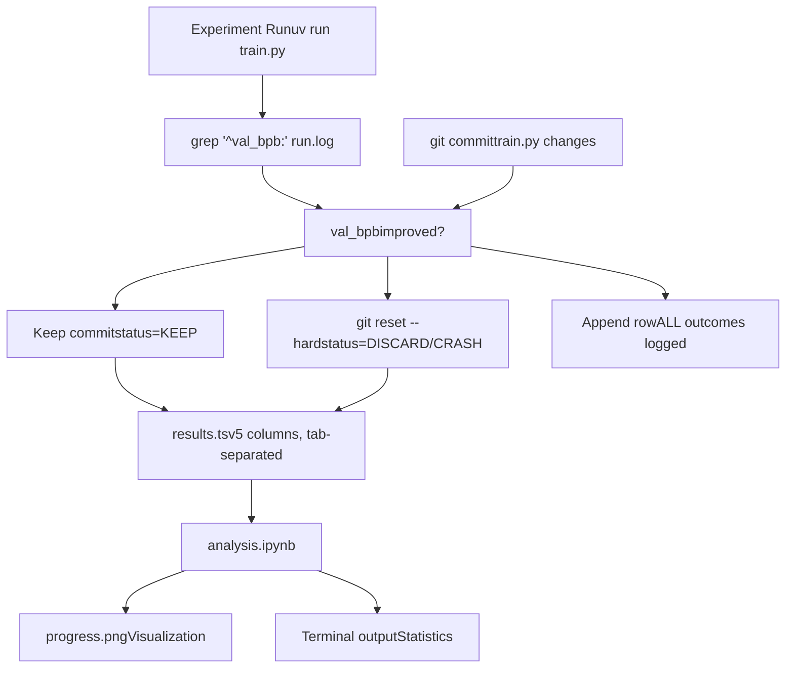
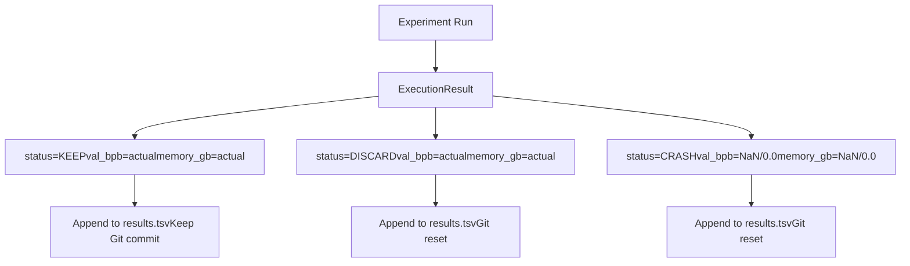

# 结果与分析

相关源文件

-   [analysis.ipynb](https://github.com/karpathy/autoresearch/blob/e6d79c12/analysis.ipynb)
-   [progress.png](https://github.com/karpathy/autoresearch/blob/e6d79c12/progress.png)

本页面记录了 autoresearch 中的结果跟踪与分析基础设施。系统维护两条并行的实验结果日志：`results.tsv`（所有尝试的完整时间顺序记录）和 Git 提交历史（仅跟踪成功改进）。实验后分析通过 `analysis.ipynb` 执行，它会生成可视化图和统计信息。

关于填充这些结果的评估指标信息，请参见 [Metrics and Evaluation](/karpathy/autoresearch/5-metrics-and-evaluation)。关于生成这些结果的自治研究循环细节，请参见 [Agent Operation](/karpathy/autoresearch/4-agent-operation)。

## 概览：双日志架构

autoresearch 系统通过两种互补机制实现全面实验跟踪：

**双日志哲学**：Git 提交代表“优化前沿”（仅包含改进），而 `results.tsv` 记录完整实验历史（包括失败和被丢弃的尝试）。这种分离既支持高效分支管理（Git 保持整洁），又支持全面事后分析（TSV 保留完整上下文）。

**来源**： [analysis.ipynb24-33](https://github.com/karpathy/autoresearch/blob/e6d79c12/analysis.ipynb#L24-L33) [analysis.ipynb61-69](https://github.com/karpathy/autoresearch/blob/e6d79c12/analysis.ipynb#L61-L69)

---

## results.tsv 结构

`results.tsv` 文件是一个制表符分隔值文件，包含恰好五列及一个表头行。该文件**不会提交到 Git**，但会保留在工作目录中以便持续追加。

### 列规范

| 列索引 | 名称 | 类型 | 描述 | 示例值 |
| --- | --- | --- | --- | --- |
| 1 | `commit` | string | Git 提交哈希（短哈希，7 字符） | `a1b2c3d` |
| 2 | `val_bpb` | float | 验证 bits per byte | `0.997900`, `0.000000`（crash） |
| 3 | `memory_gb` | float | 峰值 VRAM（GB，1 位小数） | `44.0`, `0.0`（crash） |
| 4 | `status` | enum | 结果类别 | `KEEP`, `DISCARD`, `CRASH` |
| 5 | `description` | string | 简短实验描述 | `baseline`, `increase LR to 0.04` |

### 状态值语义

**来源**： [analysis.ipynb24-32](https://github.com/karpathy/autoresearch/blob/e6d79c12/analysis.ipynb#L24-L32) [analysis.ipynb42-52](https://github.com/karpathy/autoresearch/blob/e6d79c12/analysis.ipynb#L42-L52)

### 数据加载与预处理

`analysis.ipynb` 笔记本使用 `pandas.read_csv` 和 `sep="\t"` 加载 TSV [analysis.ipynb25](https://github.com/karpathy/autoresearch/blob/e6d79c12/analysis.ipynb#L25-L25) 它执行以下清洗步骤：

1.  **数值转换**：将 `val_bpb` 与 `memory_gb` 强制转换为数值类型，并将错误处理为 `NaN` [analysis.ipynb26-27](https://github.com/karpathy/autoresearch/blob/e6d79c12/analysis.ipynb#L26-L27)
2.  **状态标准化**：去除空白并转换为大写（例如 `KEEP`、`DISCARD`、`CRASH`） [analysis.ipynb28](https://github.com/karpathy/autoresearch/blob/e6d79c12/analysis.ipynb#L28-L28)

关于文件格式的更多细节，请参见 [results.tsv Structure](/karpathy/autoresearch/6.1-results.tsv-structure)。

---

## 分析笔记本

`analysis.ipynb` Jupyter 笔记本提供对完整实验日志的实验后可视化与统计分析。

### 主要可视化

该笔记本会生成一张综合可视化图并保存为 `progress.png` [analysis.ipynb141](https://github.com/karpathy/autoresearch/blob/e6d79c12/analysis.ipynb#L141-L141)

**可视化组件**：

-   **Discarded 层**：浅灰色点（`#cccccc`），表示未成功的尝试 [analysis.ipynb98-101](https://github.com/karpathy/autoresearch/blob/e6d79c12/analysis.ipynb#L98-L101)
-   **Kept 层**：醒目的绿色点（`#2ecc71`），表示已合并的改进 [analysis.ipynb103-106](https://github.com/karpathy/autoresearch/blob/e6d79c12/analysis.ipynb#L103-L106)
-   **前沿线**：绿色阶梯线（`#27ae60`），展示 `val_bpb` 随时间的 `cummin()`（累积最小值） [analysis.ipynb108-114](https://github.com/karpathy/autoresearch/blob/e6d79c12/analysis.ipynb#L108-L114)
-   **注释**：每个保留实验都带有其描述标签，并旋转 30 度以提高可读性 [analysis.ipynb116-127](https://github.com/karpathy/autoresearch/blob/e6d79c12/analysis.ipynb#L116-L127)

关于如何解读这些图，请参见 [Analysis Notebook](/karpathy/autoresearch/6.2-analysis-notebook)。

### 统计输出

该笔记本会计算若干关键性能指标：

-   **Keep Rate**：计算方式为 `n_keep / (n_keep + n_discard)` [analysis.ipynb46-51](https://github.com/karpathy/autoresearch/blob/e6d79c12/analysis.ipynb#L46-L51)
-   **Total Improvement**：衡量首行（baseline）与已达到的最佳 `val_bpb` 之间的差值 [analysis.ipynb163-169](https://github.com/karpathy/autoresearch/blob/e6d79c12/analysis.ipynb#L163-L169)
-   **Top Hits**：按相对前一个 `KEEP` 状态的改进 delta 对实验排序 [analysis.ipynb196-200](https://github.com/karpathy/autoresearch/blob/e6d79c12/analysis.ipynb#L196-L200)

关于这些统计的更多内容，请参见 [Interpreting Results](/karpathy/autoresearch/6.3-interpreting-results)。

---

## 结果解读

### 研究信号

-   **Keep Rate**：较高的 keep rate 表明智能体处于“低垂果实”阶段。极低的 keep rate 可能意味着搜索空间已被耗尽，或智能体提出的想法对当前架构而言过于激进 [analysis.ipynb51](https://github.com/karpathy/autoresearch/blob/e6d79c12/analysis.ipynb#L51-L51)
-   **前沿斜率**：`running_min` 阶梯线的陡降通常表示架构突破，而缓慢下降通常表示超参数调优 [analysis.ipynb112-114](https://github.com/karpathy/autoresearch/blob/e6d79c12/analysis.ipynb#L112-L114)
-   **Delta 排名**：通过平移 `val_bpb` 列并计算 `prev_bpb - val_bpb`，笔记本可识别带来最大性能收益的具体想法 [analysis.ipynb199-200](https://github.com/karpathy/autoresearch/blob/e6d79c12/analysis.ipynb#L199-L200)

关于详细解读策略，请参见 [Interpreting Results](/karpathy/autoresearch/6.3-interpreting-results)。

---

## Git 历史与完整日志

系统在版本控制与实验历史之间保持清晰分离：

1.  **Git 提交历史**：充当“获胜”分支。历史中的每个提交都是相对其父提交的功能性改进。这是当前最佳 `train.py` 的真实来源。
2.  **results.tsv**：充当“实验记录本”。它记录短提交哈希 [analysis.ipynb25](https://github.com/karpathy/autoresearch/blob/e6d79c12/analysis.ipynb#L25-L25)、达成的指标值，以及**每一次**尝试的描述。

这使研究者可以用 `git log` 查看代码演化过程，同时用 `analysis.ipynb` 查看达到该状态所需的总投入（包括大量失败尝试）。

关于这种关系的更多细节，请参见 [Git History vs. Complete Log](/karpathy/autoresearch/6.4-git-history-vs.-complete-log)。

**来源**： [analysis.ipynb24-32](https://github.com/karpathy/autoresearch/blob/e6d79c12/analysis.ipynb#L24-L32) [analysis.ipynb61-67](https://github.com/karpathy/autoresearch/blob/e6d79c12/analysis.ipynb#L61-L67) [analysis.ipynb175-178](https://github.com/karpathy/autoresearch/blob/e6d79c12/analysis.ipynb#L175-L178)
