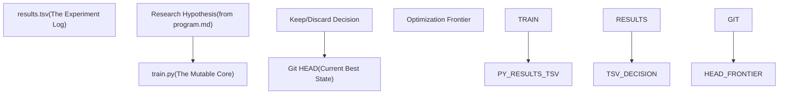

# results.tsv 结构

相关源文件

-   [analysis.ipynb](https://github.com/karpathy/autoresearch/blob/e6d79c12/analysis.ipynb)
-   [program.md](https://github.com/karpathy/autoresearch/blob/e6d79c12/program.md?plain=1)

## 目的与范围

`results.tsv` 文件是一次自主研究会话期间所有实验的完整追加式日志。它记录每一次实验尝试——无论成功、失败还是崩溃——及其验证指标、内存使用情况和结果决策。该文件作为实验后分析的事实来源，并提供独立于 git 分支状态的完整历史记录。

关于如何分析这些数据，见 **6.2 分析笔记本**。关于所记录指标的含义，见 **5.1 Validation Bits Per Byte (val_bpb)**。关于该日志与 git 提交之间的关系，见 **6.4 Git 历史与完整日志**。

**来源：** [program.md64-103](https://github.com/karpathy/autoresearch/blob/e6d79c12/program.md?plain=1#L64-L103) [analysis.ipynb1-26](https://github.com/karpathy/autoresearch/blob/e6d79c12/analysis.ipynb#L1-L26)

---

## 文件格式规范

`results.tsv` 是一个**制表符分隔值**文件，包含恰好 5 列和一行表头。该文件使用制表符字符（`\t`）作为分隔符，而不是逗号，因为实验描述通常包含自然语言逗号，这会破坏标准 CSV 解析 [program.md66-68](https://github.com/karpathy/autoresearch/blob/e6d79c12/program.md?plain=1#L66-L68)

**关键属性：**

-   **格式：** 制表符分隔值 (TSV) [program.md66](https://github.com/karpathy/autoresearch/blob/e6d79c12/program.md?plain=1#L66-L66)
-   **表头行：** 必需：`commit val_bpb memory_gb status description` [program.md71-72](https://github.com/karpathy/autoresearch/blob/e6d79c12/program.md?plain=1#L71-L72)
-   **分隔符：** 制表符字符（`\t`） [program.md66](https://github.com/karpathy/autoresearch/blob/e6d79c12/program.md?plain=1#L66-L66)
-   **编码：** UTF-8
-   **Git 状态：** 未跟踪（有意不纳入提交） [program.md102](https://github.com/karpathy/autoresearch/blob/e6d79c12/program.md?plain=1#L102-L102)
-   **仅追加：** 在循环期间，新实验会作为新行追加 [program.md94-102](https://github.com/karpathy/autoresearch/blob/e6d79c12/program.md?plain=1#L94-L102)
-   **初始化：** 在初始设置阶段创建并写入表头行 [program.md16](https://github.com/karpathy/autoresearch/blob/e6d79c12/program.md?plain=1#L16-L16)

**来源：** [program.md16-102](https://github.com/karpathy/autoresearch/blob/e6d79c12/program.md?plain=1#L16-L102)

---

## 列定义

该 TSV 按如下顺序包含恰好 5 列：

| 列 | 类型 | 格式 | 描述 |
| --- | --- | --- | --- |
| `commit` | 字符串 | 7 个字符 | 用于标识实验代码状态的短 git 提交哈希 |
| `val_bpb` | 浮点数 | 6 位小数 | 验证 bits-per-byte 指标（例如 `0.997900`） |
| `memory_gb` | 浮点数 | 1 位小数 | 峰值 VRAM 使用量（GB）（例如 `44.0`） |
| `status` | 枚举 | 文本 | 结果：`keep`、`discard` 或 `crash` |
| `description` | 字符串 | 自由文本 | 对实验改动的人类可读描述 |

### 列 1：commit

7 字符短 git 提交哈希。该哈希将记录的结果关联到 git 历史中的精确代码状态 [program.md74](https://github.com/karpathy/autoresearch/blob/e6d79c12/program.md?plain=1#L74-L74) 即使某个提交后来在 git 分支中被丢弃（reverted），其哈希仍会保留在 `results.tsv` 中以便追溯。

### 列 2：val\_bpb

主要优化指标：验证 bits-per-byte。数值越低表示压缩效果和模型质量越好 [program.md33](https://github.com/karpathy/autoresearch/blob/e6d79c12/program.md?plain=1#L33-L33)

-   **格式：** 6 位小数（例如 `0.997900`） [program.md75](https://github.com/karpathy/autoresearch/blob/e6d79c12/program.md?plain=1#L75-L75)
-   **提取：** 从 `run.log` 通过 `grep "^val_bpb:"` 解析 [program.md61](https://github.com/karpathy/autoresearch/blob/e6d79c12/program.md?plain=1#L61-L61)
-   **崩溃：** 记录为 `0.000000`，表示无效运行 [program.md75](https://github.com/karpathy/autoresearch/blob/e6d79c12/program.md?plain=1#L75-L75)

### 列 3：memory\_gb

训练期间的峰值 VRAM 使用量，以 GB 计。

-   **格式：** 1 位小数（例如 `44.0`） [program.md76](https://github.com/karpathy/autoresearch/blob/e6d79c12/program.md?plain=1#L76-L76)
-   **计算：** `peak_vram_mb / 1024` [program.md76](https://github.com/karpathy/autoresearch/blob/e6d79c12/program.md?plain=1#L76-L76)
-   **崩溃：** 记录为 `0.0` [program.md76](https://github.com/karpathy/autoresearch/blob/e6d79c12/program.md?plain=1#L76-L76)

### 列 4：status

实验的决策结果 [program.md77](https://github.com/karpathy/autoresearch/blob/e6d79c12/program.md?plain=1#L77-L77)

-   `keep`：实验提升了 `val_bpb`（或属于简化收益）；该提交会保留在分支上 [program.md103](https://github.com/karpathy/autoresearch/blob/e6d79c12/program.md?plain=1#L103-L103)
-   `discard`：实验未能提升指标；分支会重置到先前状态 [program.md104](https://github.com/karpathy/autoresearch/blob/e6d79c12/program.md?plain=1#L104-L104)
-   `crash`：脚本未能完成（OOM、语法错误等）；分支会被重置 [program.md101](https://github.com/karpathy/autoresearch/blob/e6d79c12/program.md?plain=1#L101-L101)

### 列 5：description

对改动的简短文本描述 [program.md78](https://github.com/karpathy/autoresearch/blob/e6d79c12/program.md?plain=1#L78-L78) 该描述由智能体生成，用于解释其假设（例如，“increase LR to 0.04”） [program.md85](https://github.com/karpathy/autoresearch/blob/e6d79c12/program.md?plain=1#L85-L85)

**来源：** [program.md33-104](https://github.com/karpathy/autoresearch/blob/e6d79c12/program.md?plain=1#L33-L104) [analysis.ipynb24-32](https://github.com/karpathy/autoresearch/blob/e6d79c12/analysis.ipynb#L24-L32)

---

## 实验生命周期与日志流程

下图说明自主智能体（定义于 `program.md`）如何与代码（`train.py`）交互并记录结果。

### 日志决策流程

```mermaid
flowchart TD
    START["Agent modifies train.py(Experiment Idea)"]
    COMMIT["git commit -m '...'"]
    RUN["uv run train.py > run.log"]
    GREP_BPB["grep '^val_bpb:' run.log"]
    GREP_MEM["grep '^peak_vram_mb:' run.log"]
    CHECK_CRASH["Is grep output empty?"]
    LOG_CRASH["results.tsv: [hash] | 0.0 | 0.0 | crash | [desc]"]
    EVALUATE["val_bpb < previous_best?"]
    LOG_KEEP["results.tsv: [hash] | val | mem | keep | [desc]"]
    LOG_DISCARD["results.tsv: [hash] | val | mem | discard | [desc]"]
    ADVANCE["Keep commit(Branch moves forward)"]
    RESET["git reset --hard HEAD~1(Revert changes)"]
    LOOP["LOOP FOREVER"]

    RUN --> GREP_BPB
    RUN --> GREP_MEM
    GREP --> BPB_CHECK_CRASH
    CHECK --> CRASH_LOG_CRASH
    CHECK --> CRASH_EVALUATE
    EVALUATE --> LOG_KEEP
    EVALUATE --> LOG_DISCARD
    LOG --> KEEP_ADVANCE
    LOG --> DISCARD_RESET
    LOG --> CRASH_RESET
    ADVANCE --> LOOP
    RESET --> LOOP
```


**图示：从实验完成到写入 results.tsv 条目的日志决策流程。**

**来源：** [program.md94-112](https://github.com/karpathy/autoresearch/blob/e6d79c12/program.md?plain=1#L94-L112)

---

## 数据提取与解析

智能体使用标准 shell 工具从 `run.log`（由 `train.py` 生成）中提取数据。

### 训练输出摘要

`train.py` 脚本被设计为在 5 分钟运行结束时打印一个结构化区块 [program.md43-56](https://github.com/karpathy/autoresearch/blob/e6d79c12/program.md?plain=1#L43-L56)：

```
---val_bpb:          0.997900training_seconds: 300.1peak_vram_mb:     45060.2...
```
### 提取逻辑

智能体执行以下命令来填充 TSV [program.md61-100](https://github.com/karpathy/autoresearch/blob/e6d79c12/program.md?plain=1#L61-L100)：

```
# Extract BPBgrep "^val_bpb:" run.log# Extract VRAMgrep "^peak_vram_mb:" run.log
```
### 在 analysis.ipynb 中由 Pandas 加载

分析笔记本使用 `pd.read_csv` 解析此 TSV，并通过特定的数值转换来处理 “crash” 条目 [analysis.ipynb20-29](https://github.com/karpathy/autoresearch/blob/e6d79c12/analysis.ipynb#L20-L29)：

```
df = pd.read_csv("results.tsv", sep="\t")df["val_bpb"] = pd.to_numeric(df["val_bpb"], errors="coerce")df["memory_gb"] = pd.to_numeric(df["memory_gb"], errors="coerce")df["status"] = df["status"].str.strip().str.upper()
```
**来源：** [program.md43-100](https://github.com/karpathy/autoresearch/blob/e6d79c12/program.md?plain=1#L43-L100) [analysis.ipynb20-29](https://github.com/karpathy/autoresearch/blob/e6d79c12/analysis.ipynb#L20-L29)

---

## 与 Git 历史的关系

Git 日志与 `results.tsv` 之间存在根本分歧。Git 表示**优化前沿**，而 `results.tsv` 表示**搜索轨迹**。

### 代码实体映射


**图示：研究假设到代码实体与版本控制的映射。**

### 对比表

| 特性 | Git 历史 | `results.tsv` |
| --- | --- | --- |
| **持久性** | 永久（已提交） | 本地（未跟踪） |
| **内容** | 仅 `keep` 提交 | `keep`、`discard` 和 `crash` |
| **结构** | 树/谱系 | 线性追加式日志 |
| **指标数据** | 在提交消息中（可选） | 结构化列（必填） |

**来源：** [program.md94-106](https://github.com/karpathy/autoresearch/blob/e6d79c12/program.md?plain=1#L94-L106) [analysis.ipynb61-78](https://github.com/karpathy/autoresearch/blob/e6d79c12/analysis.ipynb#L61-L78)

---

## 特殊情况

### 基线条目

`results.tsv` 的第一行必须是基线。该基线通过运行未修改的 `train.py` 建立 [program.md39](https://github.com/karpathy/autoresearch/blob/e6d79c12/program.md?plain=1#L39-L39)

-   **状态：** `keep` [program.md84](https://github.com/karpathy/autoresearch/blob/e6d79c12/program.md?plain=1#L84-L84)
-   **描述：** `baseline` [program.md84](https://github.com/karpathy/autoresearch/blob/e6d79c12/program.md?plain=1#L84-L84)

### 崩溃处理

如果 `grep` 没有返回内容，则该次运行被视为崩溃。智能体被指示将 `0.000000` 记录到 `val_bpb`，将 `0.0` 记录到 `memory_gb` [program.md75-76](https://github.com/karpathy/autoresearch/blob/e6d79c12/program.md?plain=1#L75-L76) 然后它会读取 `run.log` 的最后 50 行，尝试修复或继续下一轮 [program.md101](https://github.com/karpathy/autoresearch/blob/e6d79c12/program.md?plain=1#L101-L101)

### 简化收益

如果某次实验得到的 `val_bpb` 与基线相等或略差，但显著简化了代码，智能体可以依据**简洁性准则**将其标记为 `keep` [program.md37](https://github.com/karpathy/autoresearch/blob/e6d79c12/program.md?plain=1#L37-L37)

**来源：** [program.md37-101](https://github.com/karpathy/autoresearch/blob/e6d79c12/program.md?plain=1#L37-L101)
