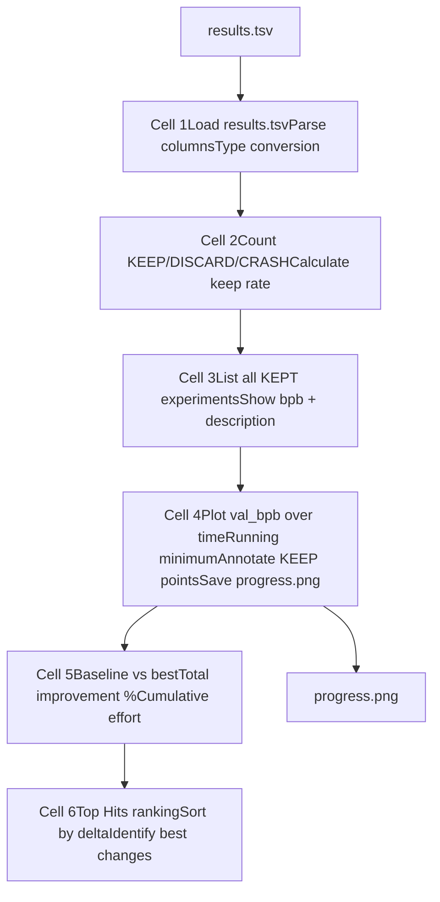
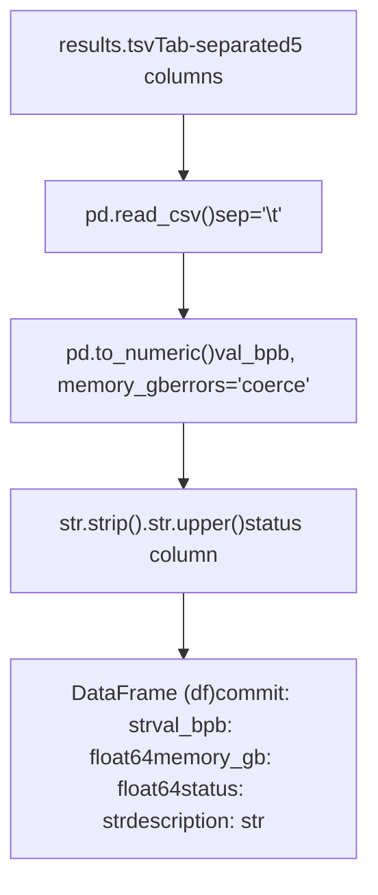
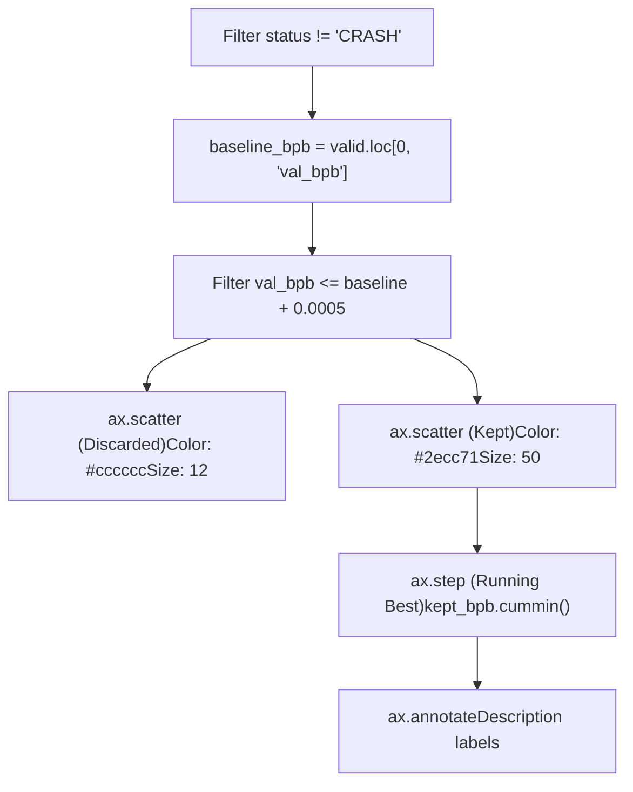
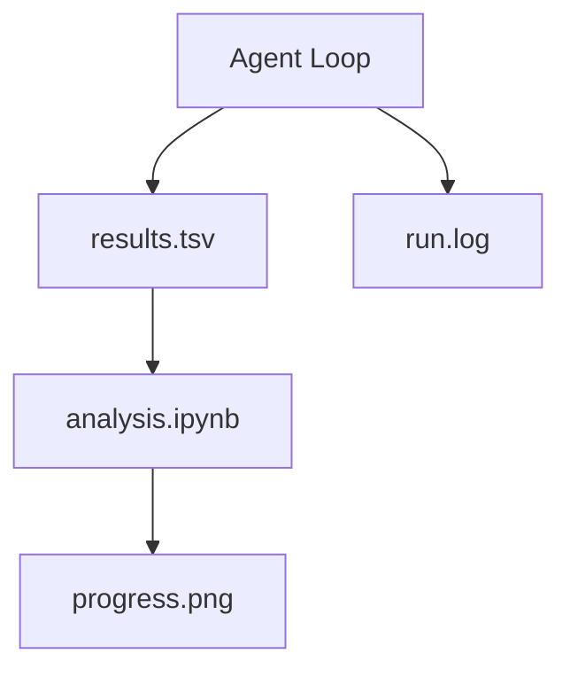

# 分析笔记本

相关源文件

-   [analysis.ipynb](https://github.com/karpathy/autoresearch/blob/e6d79c12/analysis.ipynb)
-   [progress.png](https://github.com/karpathy/autoresearch/blob/e6d79c12/progress.png)

`analysis.ipynb` 笔记本用于对自主研究结果进行实验后分析与可视化。它处理 `results.tsv` 文件，以生成汇总统计、可视化和排名，帮助人类研究者快速审阅隔夜实验进展并识别有效的优化策略。

关于 `results.tsv` 文件格式，参见 [6.1 Results.tsv 结构](https://github.com/karpathy/autoresearch/blob/e6d79c12/6.1 Results.tsv Structure)。关于解读实验结果的指导，参见 [6.3 结果解读](https://github.com/karpathy/autoresearch/blob/e6d79c12/6.3 Interpreting Results)

---

## 概览

分析笔记本是人类审阅由智能体驱动实验的主要接口。在自主智能体执行了多个隔夜实验后，人类研究者可以运行该笔记本来：

1.  **从 `results.tsv` 加载实验数据** \[analysis.ipynb:24-32\]
2.  **计算汇总统计**（实验总数、保留率、改进幅度） \[analysis.ipynb:42-52\]
3.  **通过时间序列图可视化进展**，展示 `val_bpb` 的演化 \[analysis.ipynb:87-142\]
4.  **按改进 delta 生成实验排名** \[analysis.ipynb:198-218\]
5.  **将可视化导出**为 `progress.png`，便于分享 \[analysis.ipynb:141\]

该笔记本对实验状态是只读的——它不会修改 `results.tsv`、Git 分支或 `train.py`。其唯一目的就是分析与报告。

来源： [analysis.ipynb1-253](https://github.com/karpathy/autoresearch/blob/e6d79c12/analysis.ipynb#L1-L253)

---

## 笔记本结构

该笔记本由可执行单元组成，并按功能分区组织：

**数据流图**

来源： [analysis.ipynb1-253](https://github.com/karpathy/autoresearch/blob/e6d79c12/analysis.ipynb#L1-L253)

---

## 数据加载与预处理

第一个单元加载 `results.tsv`，并使用 `pandas` 执行必要的数据清洗 \[analysis.ipynb:20-28\]：

**预处理流程**

关键预处理步骤：

-   **数值转换**：`val_bpb` 和 `memory_gb` 会被转换为浮点数 \[analysis.ipynb:26-27\]。`errors="coerce"` 标志确保格式异常条目（在 `CRASH` 状态行中常见）被转换为 `NaN`，而不会导致笔记本报错中断。
-   **状态归一化**：`status` 列会去除首尾空白并转换为大写，以确保对 `KEEP`、`DISCARD` 和 `CRASH` 标签进行一致筛选 \[analysis.ipynb:28\]。

来源： [analysis.ipynb14-33](https://github.com/karpathy/autoresearch/blob/e6d79c12/analysis.ipynb#L14-L33)

---

## 状态汇总统计

第二个单元计算实验结果分布 \[analysis.ipynb:42-52\]：

-   **实验计数**：使用 `df["status"].value_counts()` 统计各类结果。
-   **保留率计算**：定义为 `n_keep / (n_keep + n_discard)` \[analysis.ipynb:49-51\]。该指标将 `CRASH` 结果排除在分母之外，以衡量智能体在有效实验上的“成功率”。

第三个单元提供所有 `KEEP` 实验的详细列表，打印实验索引、`val_bpb`、内存占用和智能体描述 \[analysis.ipynb:61-68\]。

来源： [analysis.ipynb36-52](https://github.com/karpathy/autoresearch/blob/e6d79c12/analysis.ipynb#L36-L52) [analysis.ipynb55-69](https://github.com/karpathy/autoresearch/blob/e6d79c12/analysis.ipynb#L55-L69)

---

## 进展可视化

第四个单元生成 `progress.png`，这是研究过程中的主要可视化产物 \[analysis.ipynb:87-143\]。

**可视化实现逻辑**

### 可视化设计

-   **Discarded 点**：渲染为浅色背景点（`#cccccc`），在不干扰主视图的前提下展示探索广度 \[analysis.ipynb:100-101\]。
-   **Kept 点**：渲染为醒目的绿色点（`#2ecc71`），并带黑色边框 \[analysis.ipynb:104-106\]。
-   **运行最优线**：使用保留结果的 `cummin()`（累计最小值）绘制阶梯线 \[analysis.ipynb:112-114\]。这条线表示“优化前沿”。
-   **注释**：每个保留点都标注其描述（截断到 45 个字符），并旋转 30 度显示 \[analysis.ipynb:116-126\]。
-   **动态缩放**：Y 轴范围根据 `baseline_bpb` 与当前 `best` 结果自动设置，并附加 15% 边距 \[analysis.ipynb:137-138\]。

来源： [analysis.ipynb81-145](https://github.com/karpathy/autoresearch/blob/e6d79c12/analysis.ipynb#L81-L145)

---

## 统计分析与排名

笔记本最后几个部分会计算聚合性能指标，并对单次变更的影响进行排序。

### 汇总统计

笔记本计算以下指标 \[analysis.ipynb:162-171\]：

-   **基线 val\_bpb**：取自日志第一行。
-   **最佳 val\_bpb**：在保留实验中找到的最小值。
-   **总改进量**：计算方式为 `baseline_bpb - best_bpb`，并表示为相对基线的百分比。

### Top Hits 排名

笔记本通过为每个保留实验计算“delta”来识别收益最大的具体修改 \[analysis.ipynb:198-201\]：

$$ \\text{delta}*n = \\text{val\_bpb}*{n-1} - \\text{val\_bpb}\_n $$

其中 $n$ 和 $n-1$ 是 `KEEP` 序列中的相邻实验。结果按 delta 排序，以突出最有效的架构或超参数变更 \[analysis.ipynb:206-218\]。

来源： [analysis.ipynb155-180](https://github.com/karpathy/autoresearch/blob/e6d79c12/analysis.ipynb#L155-L180) [analysis.ipynb190-221](https://github.com/karpathy/autoresearch/blob/e6d79c12/analysis.ipynb#L190-L221)

---

## 与系统实体的集成关系

分析笔记本充当由智能体执行的 `Research Loop` 的观察者。

**系统实体关系**

| 实体 | 在分析中的角色 |
| --- | --- |
| `results.tsv` | 主要数据源；包含所有 `KEEP`、`DISCARD` 和 `CRASH` 事件的历史 \[analysis.ipynb:25\]。 |
| `val_bpb` | 所有图表和 delta 计算的目标指标 \[analysis.ipynb:26\]。 |
| `description` | 由智能体提供的文本元数据，用于图表注释和排名表 \[analysis.ipynb:118\]。 |
| `progress.png` | 最终导出的可视化图，用于汇总研究会话 \[analysis.ipynb:141\]。 |

来源： [analysis.ipynb1-253](https://github.com/karpathy/autoresearch/blob/e6d79c12/analysis.ipynb#L1-L253)
