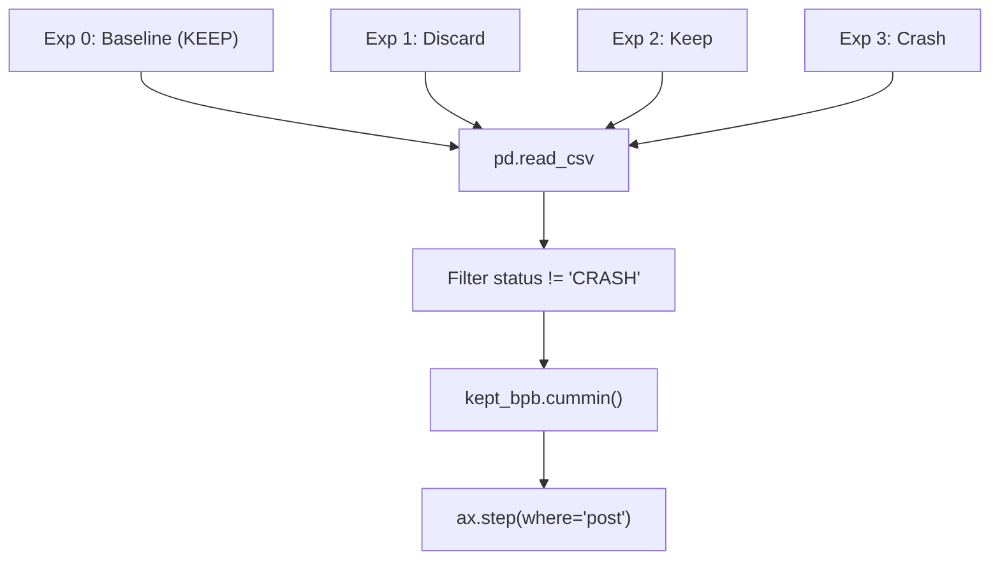
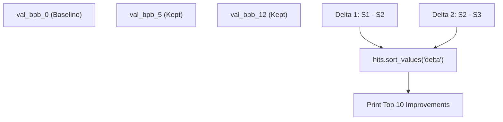

# 结果解读

相关源文件

-   [analysis.ipynb](https://github.com/karpathy/autoresearch/blob/e6d79c12/analysis.ipynb)

本页提供一份技术指南，用于解读自主研究循环生成的实验数据。重点是 `analysis.ipynb` 中处理 `results.tsv`、计算保留率与 delta 等指标、以及可视化优化前沿的逻辑。

---

## 理解状态值

`results.tsv` 中的每个实验条目都会被归类为一种状态，该状态决定系统如何处理该次代码修改，也决定分析笔记本如何处理该数据点。

| 状态 | 代码实体含义 | `val_bpb` 值 | `memory_gb` | Git 生命周期 |
| --- | --- | --- | --- | --- |
| `KEEP` | 发现改进 | `< current_best` | 峰值 VRAM | 提交保留在分支上 |
| `DISCARD` | 无改进 | `≥ current_best` | 峰值 VRAM | `git reset --hard` 回到先前状态 |
| `CRASH` | 运行时失败 | `0.000000` | `0.0` | `git reset --hard` 回到先前状态 |

研究循环中的决策逻辑是二元的：只有当修改严格提升验证指标时，才会被“Kept”。这会形成一条严格单调的改进“前沿”。

**来源**： [analysis.ipynb24-28](https://github.com/karpathy/autoresearch/blob/e6d79c12/analysis.ipynb#L24-L28) [analysis.ipynb42-48](https://github.com/karpathy/autoresearch/blob/e6d79c12/analysis.ipynb#L42-L48)

---

## 保留率与效率

**保留率（keep rate）**是衡量 `program.md` 中研究程序“智能性”或效率的主要指标。它表示成功改进占有效尝试总数的比例。

### 计算逻辑

`analysis.ipynb` 笔记本通过过滤掉 `CRASH` 状态来计算该指标，从而聚焦于研究质量而非实现稳定性。

```
n_keep = counts.get("KEEP", 0)n_discard = counts.get("DISCARD", 0)n_decided = n_keep + n_discardkeep_rate = n_keep / n_decided
```
**来源**： [analysis.ipynb42-51](https://github.com/karpathy/autoresearch/blob/e6d79c12/analysis.ipynb#L42-L51)

### 保留率解读矩阵

| 比率 | 技术含义 | 系统状态 |
| --- | --- | --- |
| **\> 25%** | 低垂果实阶段 | 模型距离最优仍较远；简单变更（LR、宽度）仍能带来收益。 |
| **10-25%** | 稳定进展 | 智能体正在成功穿越权衡空间。成熟 `program.md` 的典型区间。 |
| **< 10%** | 边际收益递减 | 架构趋于稳定。智能体可能需要更“有创造性”的指令来突破平台期。 |

---

## 优化前沿

系统通过“运行最小值（Running Minimum）”或“前沿（Frontier）”跟踪进展。由于智能体始终从上一个 `KEEP` 提交分支，成功实验序列会形成一条累积改进链。

### 前沿可视化

`analysis.ipynb` 会生成阶梯图（`progress.png`），将 `val_bpb` 映射到实验索引上。

**前沿映射逻辑**


**来源**： [analysis.ipynb90-114](https://github.com/karpathy/autoresearch/blob/e6d79c12/analysis.ipynb#L90-L114)

`ax.step` 函数配合 `where="post"` 使用，可显示：某个特定 `val_bpb` 会一直保持“当前最优”，直到后续 `KEEP` 实验将其超越。

**来源**： [analysis.ipynb113-114](https://github.com/karpathy/autoresearch/blob/e6d79c12/analysis.ipynb#L113-L114)

---

## Delta 计算与 Top Hits

为了识别哪些具体想法影响最大，分析笔记本会为每个 `KEEP` 实验计算 **Delta**。

### 累积 Delta 逻辑

由于每个 `KEEP` 都建立在前一个之上，实验 $N$ 的改进幅度是相对于过滤后“Kept”列表中实验 $N-1$ 的结果来度量的。

```
kept = df[df["status"] == "KEEP"].copy()kept["prev_bpb"] = kept["val_bpb"].shift(1)kept["delta"] = kept["prev_bpb"] - kept["val_bpb"]
```
**来源**： [analysis.ipynb198-200](https://github.com/karpathy/autoresearch/blob/e6d79c12/analysis.ipynb#L198-L200)

### Top Hits 排名

“Top Hits”部分会对这些 delta 排序，以突出最显著的架构或超参数突破。

**Delta 分布流程**


**来源**： [analysis.ipynb198-213](https://github.com/karpathy/autoresearch/blob/e6d79c12/analysis.ipynb#L198-L213)

---

## 基线与最优对比

`results.tsv` 的第一行（索引 0）始终是基线——即在任何修改之前运行初始 `train.py` 的结果。笔记本据此计算**总改进量**。

### 关键统计摘要

笔记本输出一个摘要区块，用于高层概览自主运行的成功情况：

-   **Baseline val\_bpb**：`df.iloc[0]["val_bpb"]`
-   **Best val\_bpb**：`kept["val_bpb"].min()`
-   **Total Improvement**：`baseline_bpb - best_bpb`
-   **Percentage Gain**：`(Total Improvement / Baseline) * 100`

**来源**： [analysis.ipynb163-169](https://github.com/karpathy/autoresearch/blob/e6d79c12/analysis.ipynb#L163-L169)

---

## 解读内存使用

虽然 `val_bpb` 是首要优化目标，`memory_gb` 仍是关键约束。智能体被要求将 `peak_vram_mb` 保持在硬件限制内（例如 A100 的 80GB）。

-   **OOM 崩溃**：若 `memory_gb` 为 0.0 且状态为 `CRASH`，该实验很可能触发了内存溢出（Out-Of-Memory）错误。
-   **内存效率**：若某个 `KEEP` 实验在降低 `val_bpb` 的同时也降低了 `memory_gb`，则被视为高质量架构改进（例如切换到滑动窗口注意力）。

**来源**： [analysis.ipynb27-28](https://github.com/karpathy/autoresearch/blob/e6d79c12/analysis.ipynb#L27-L28) [analysis.ipynb67](https://github.com/karpathy/autoresearch/blob/e6d79c12/analysis.ipynb#L67-L67)
