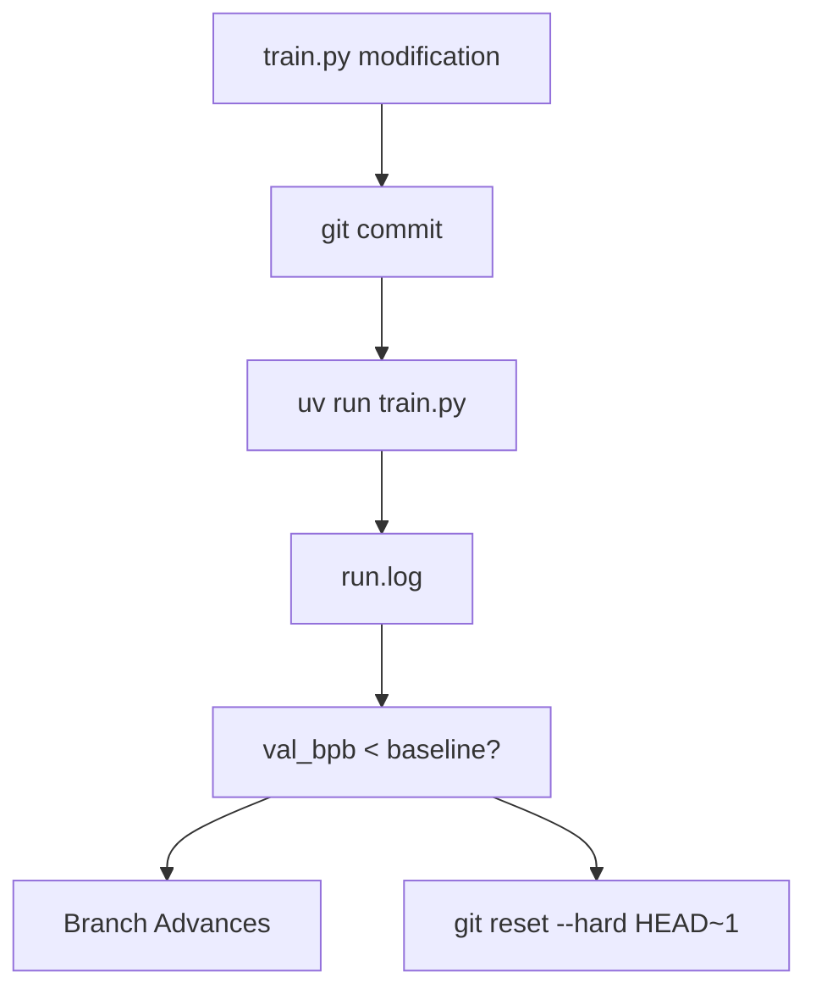
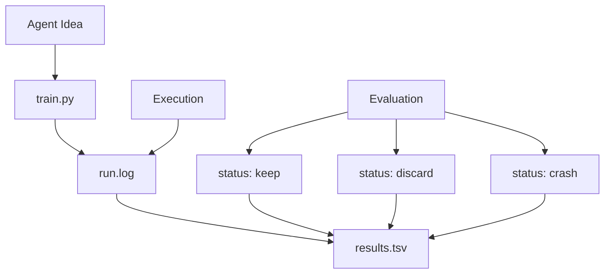

# Git 历史与完整日志

相关源文件

-   [.gitignore](https://github.com/karpathy/autoresearch/blob/e6d79c12/.gitignore)
-   [program.md](https://github.com/karpathy/autoresearch/blob/e6d79c12/program.md?plain=1)

**目的**：本页解释 `autoresearch` 使用的双重追踪系统：Git 分支仅包含成功改进的“前沿”，而 `results.tsv` 包含每一次实验的完整日志，包括丢弃与崩溃。理解这种分离对于解读研究进展和审阅代码变更至关重要。

---

## 概览：两个互补系统

Autoresearch 维护两套并行的实验记录，以在代码整洁性与研究透明性之间取得平衡。

| 系统 | 内容 | 目的 | 实现 |
| --- | --- | --- | --- |
| **Git 分支** (`autoresearch/<tag>`) | 仅 `keep` 提交 | 保持改进的清晰代码历史 | 通过 `git reset` 管理 [program.md104](https://github.com/karpathy/autoresearch/blob/e6d79c12/program.md?plain=1#L104-L104) |
| **results.tsv** | 所有实验（`keep`、`discard`、`crash`） | 完整研究日志 | 每次运行后追加 [program.md66](https://github.com/karpathy/autoresearch/blob/e6d79c12/program.md?plain=1#L66-L66) |

这种分离有一个关键目的：**Git 历史针对代码清晰度优化，而 `results.tsv` 针对研究洞察优化**。Git 分支展示成功变更的线性序列，便于审查哪些改动真正提升了模型。TSV 文件保留完整实验记录，这对于理解研究过程以及避免重复尝试失败想法至关重要。

**来源**： [program.md90-109](https://github.com/karpathy/autoresearch/blob/e6d79c12/program.md?plain=1#L90-L109) [.gitignore23](https://github.com/karpathy/autoresearch/blob/e6d79c12/.gitignore#L23-L23)

---

## Git 分支：优化前沿

### 提交结构与决策逻辑

Git 分支（例如 `autoresearch/mar5`）表示当前代码的“最佳”版本。它基于 `val_bpb` 指标遵循严格的“前进或回滚”逻辑。

**图示：Git 分支决策循环**

智能体在 [program.md103-104](https://github.com/karpathy/autoresearch/blob/e6d79c12/program.md?plain=1#L103-L104) 执行该逻辑：

-   若 `val_bpb` 改善（值更低），则保留该提交。
-   若 `val_bpb` 持平或更差，智能体执行 `git reset` 回到上一个已知良好状态。

**来源**： [program.md96-108](https://github.com/karpathy/autoresearch/blob/e6d79c12/program.md?plain=1#L96-L108)

### Git 历史保留了什么

Git 分支仅保留 `status=keep` 的提交。历史中的每个提交代表：

-   **功能性改进**：对 `train.py` 的精确修改，这些修改产生了更低的 `val_bpb`。
-   **单调进展**：每个后续提交都保证优于或等于其父提交。
-   **可审阅差异**：变更彼此隔离，人类可使用 `git show` 或 `git diff` 精确查看智能体改动（如超参数调整或架构变更）。

**来源**： [program.md103-106](https://github.com/karpathy/autoresearch/blob/e6d79c12/program.md?plain=1#L103-L106)

---

## results.tsv：完整研究日志

### TSV 文件结构

`results.tsv` 文件是“实验记录本”。它在 [.gitignore23](https://github.com/karpathy/autoresearch/blob/e6d79c12/.gitignore#L23-L23) 中被明确排除出 Git 跟踪，以便在 `git reset` 操作后仍可保留。它使用制表符分隔格式，以防描述中的逗号破坏解析器 [program.md66](https://github.com/karpathy/autoresearch/blob/e6d79c12/program.md?plain=1#L66-L66)

**列定义** [program.md70-78](https://github.com/karpathy/autoresearch/blob/e6d79c12/program.md?plain=1#L70-L78)：

| 列 | 类型 | 描述 |
| --- | --- | --- |
| `commit` | string | 7 字符短 git 提交哈希 |
| `val_bpb` | float | Validation bits per byte（崩溃时为 0.000000） |
| `memory_gb` | float | 峰值 VRAM（GB，四舍五入到 .1f） |
| `status` | string | `keep`、`discard` 或 `crash` |
| `description` | string | 实验的简短文本描述 |

**来源**： [program.md70-88](https://github.com/karpathy/autoresearch/blob/e6d79c12/program.md?plain=1#L70-L88) [.gitignore23](https://github.com/karpathy/autoresearch/blob/e6d79c12/.gitignore#L23-L23)

### 状态赋值逻辑

`status` 列对 [program.md94-110](https://github.com/karpathy/autoresearch/blob/e6d79c12/program.md?plain=1#L94-L110) 所描述实验循环的结果进行分类：

**图示：将研究结果映射到 results.tsv**

-   **`keep`**：实验提升了指标；提交保留在 Git 中。
-   **`discard`**：实验已运行但未改进；Git 状态会被重置。
-   **`crash`**：脚本失败（OOM、语法错误等）；指标按 0.0 记录 [program.md110](https://github.com/karpathy/autoresearch/blob/e6d79c12/program.md?plain=1#L110-L110)

**来源**： [program.md74-88](https://github.com/karpathy/autoresearch/blob/e6d79c12/program.md?plain=1#L74-L88) [program.md100-104](https://github.com/karpathy/autoresearch/blob/e6d79c12/program.md?plain=1#L100-L104)

---

## 信息分布

两套系统捕捉研究过程的不同侧面：

| 信息类型 | 在 Git 历史中？ | 在 results.tsv 中？ |
| --- | --- | --- |
| 成功代码差异 | ✅ 是 | ❌ 否（仅哈希） |
| 失败想法/描述 | ❌ 否（被重置） | ✅ 是 |
| 峰值 VRAM 使用量 | ❌ 否 | ✅ 是 |
| 精确 `val_bpb` | ❌ 否（除非写在消息里） | ✅ 是 |
| 所有尝试的时间顺序 | ❌ 否 | ✅ 是 |

### 同步关系

由于 `results.tsv` 不受 Git 跟踪，它充当智能体的持久记忆。即使智能体执行 `git reset back to where you started` [program.md104](https://github.com/karpathy/autoresearch/blob/e6d79c12/program.md?plain=1#L104-L104)，该次失败尝试的记录仍保留在 TSV 中。这可防止智能体陷入重复尝试同一失败想法的无限循环，因为它既能“查看 git 状态”，也能查看自己的日志 [program.md96](https://github.com/karpathy/autoresearch/blob/e6d79c12/program.md?plain=1#L96-L96)

**来源**： [program.md94-106](https://github.com/karpathy/autoresearch/blob/e6d79c12/program.md?plain=1#L94-L106) [.gitignore23](https://github.com/karpathy/autoresearch/blob/e6d79c12/.gitignore#L23-L23)

---

## 将两套系统结合用于分析

`analysis.ipynb` 笔记本利用这种双系统方法，提供对研究运行的全面视图。

1.  **进展可视化**：笔记本按时间绘制 `val_bpb`，将 `keep` 点标为“前沿”线，并将 `discard` 点显示为其周围噪声。
2.  **效率指标**：通过比较 `keep` 与 `discard` 在 `results.tsv` 中的行数，计算“保留率”（智能体研究效率）。
3.  **Delta 分析**：计算连续 `keep` 提交之间的改进幅度。

**来源**： [program.md114](https://github.com/karpathy/autoresearch/blob/e6d79c12/program.md?plain=1#L114-L114) [analysis.ipynb1-253](https://github.com/karpathy/autoresearch/blob/e6d79c12/analysis.ipynb#L1-L253)（由分析工具上下文推断）。
