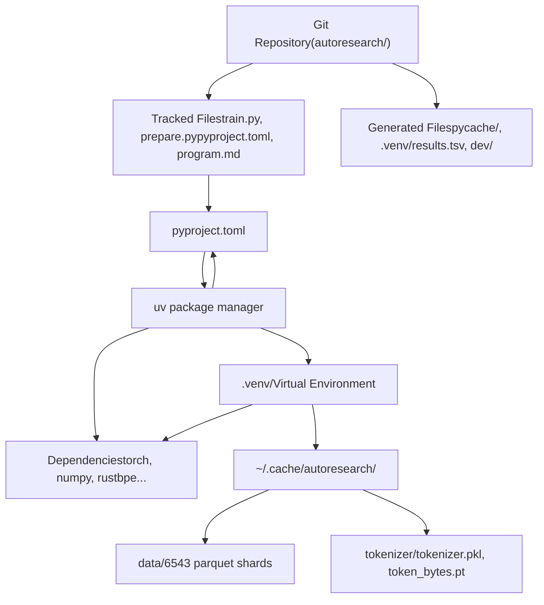
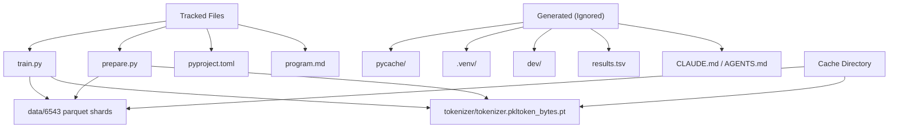

# 开发环境

相关源文件

-   [.gitignore](https://github.com/karpathy/autoresearch/blob/e6d79c12/.gitignore)
-   [pyproject.toml](https://github.com/karpathy/autoresearch/blob/e6d79c12/pyproject.toml)
-   [uv.lock](https://github.com/karpathy/autoresearch/blob/e6d79c12/uv.lock)

autoresearch 的开发环境以可复现性与简洁性为设计目标。它使用 `uv` 进行依赖管理，强制要求 Python 3.10+，并在受跟踪源代码与生成产物之间保持清晰分离。该环境确保所有实验在一致条件下运行，从而使结果在不同机器与不同时间之间可比较。

本页提供开发配置概览。关于详细依赖信息，参见 [Python 与依赖](/karpathy/autoresearch/7.1-python-and-dependencies)。关于文件组织与版本控制模式，参见 [版本控制与产物](/karpathy/autoresearch/7.2-version-control-and-artifacts)。

## 核心环境组件

开发环境由三个关键组件构成，它们协同工作以确保实验可复现：

**组件概览**

**来源**： [pyproject.toml1-28](https://github.com/karpathy/autoresearch/blob/e6d79c12/pyproject.toml#L1-L28) [.gitignore1-24](https://github.com/karpathy/autoresearch/blob/e6d79c12/.gitignore#L1-L24)

### Python 版本与 uv

系统要求 **Python 3.10 或更高版本**（[pyproject.toml6](https://github.com/karpathy/autoresearch/blob/e6d79c12/pyproject.toml#L6-L6) [uv.lock3](https://github.com/karpathy/autoresearch/blob/e6d79c12/uv.lock#L3-L3)），并使用 **`uv`** 作为包管理器。`uv` 提供：

-   通过 `uv.lock` 实现快速依赖解析（[uv.lock1-19](https://github.com/karpathy/autoresearch/blob/e6d79c12/uv.lock#L1-L19)）
-   在 `.venv/` 中提供隔离虚拟环境（[.gitignore10](https://github.com/karpathy/autoresearch/blob/e6d79c12/.gitignore#L10-L10)）
-   对 PyTorch CUDA 12.8 的自定义 PyPI 索引支持（[pyproject.toml19-27](https://github.com/karpathy/autoresearch/blob/e6d79c12/pyproject.toml#L19-L27)）
-   通过 `uv run` 自动激活环境

**来源**： [pyproject.toml6](https://github.com/karpathy/autoresearch/blob/e6d79c12/pyproject.toml#L6-L6) [uv.lock3](https://github.com/karpathy/autoresearch/blob/e6d79c12/uv.lock#L3-L3) [.gitignore10](https://github.com/karpathy/autoresearch/blob/e6d79c12/.gitignore#L10-L10) [pyproject.toml19-27](https://github.com/karpathy/autoresearch/blob/e6d79c12/pyproject.toml#L19-L27)

## 依赖管理

系统维护了一组最小依赖集合，定义于 [pyproject.toml7-17](https://github.com/karpathy/autoresearch/blob/e6d79c12/pyproject.toml#L7-L17)。关键依赖类别如下：

| 类别 | 包 | 使用方 |
| --- | --- | --- |
| **计算** | `torch==2.9.1`, `numpy>=2.2.6`, `kernels>=0.11.7` | `train.py` 训练循环 |
| **数据** | `pyarrow>=21.0.0`, `pandas>=2.3.3`, `requests>=2.32.0` | `prepare.py` 数据流水线 |
| **分词** | `rustbpe>=0.1.0`, `tiktoken>=0.11.0` | `prepare.py` 分词器训练 |
| **分析** | `matplotlib>=3.10.8` | `analysis.ipynb` 可视化 |

关键依赖是 **PyTorch 2.9.1 + CUDA 12.8**，通过 [pyproject.toml19-27](https://github.com/karpathy/autoresearch/blob/e6d79c12/pyproject.toml#L19-L27) 中定义的自定义索引安装。这可确保使用 GPU 加速，而不是仅 CPU 的 PyTorch。`uv.lock` 文件确保在所有开发环境中固定精确版本（例如 `torch==2.9.1`）（[uv.lock72](https://github.com/karpathy/autoresearch/blob/e6d79c12/uv.lock#L72-L72)）。

关于完整依赖细节，参见 [Python 与依赖](/karpathy/autoresearch/7.1-python-and-dependencies)。

**来源**： [pyproject.toml7-17](https://github.com/karpathy/autoresearch/blob/e6d79c12/pyproject.toml#L7-L17) [pyproject.toml19-27](https://github.com/karpathy/autoresearch/blob/e6d79c12/pyproject.toml#L19-L27) [uv.lock72](https://github.com/karpathy/autoresearch/blob/e6d79c12/uv.lock#L72-L72)

## 文件组织

系统维护三类文件，并为其定义不同生命周期：

**文件类别与位置**

**来源**： [.gitignore1-24](https://github.com/karpathy/autoresearch/blob/e6d79c12/.gitignore#L1-L24)

### 已跟踪文件 vs 生成文件

| 类别 | 文件 | 生命周期 |
| --- | --- | --- |
| **已跟踪** | `train.py`, `prepare.py`, `pyproject.toml`, `program.md` | 由人类/智能体修改，提交到 Git |
| **生成** | `__pycache__/`, `.venv/`, `dev/`, `results.tsv`, `CLAUDE.md` | 执行过程中创建，由 Git 忽略（[.gitignore1-24](https://github.com/karpathy/autoresearch/blob/e6d79c12/.gitignore#L1-L24)） |
| **缓存** | `~/.cache/autoresearch/data/`, `~/.cache/autoresearch/tokenizer/` | 由 `prepare.py` 创建一次，可跨分支持久化 |

`.gitignore` 规则（[.gitignore1-24](https://github.com/karpathy/autoresearch/blob/e6d79c12/.gitignore#L1-L24)）确保只有源代码与配置会被跟踪，而构建产物、如 `CLAUDE.md` 之类的智能体会话文件（[.gitignore16](https://github.com/karpathy/autoresearch/blob/e6d79c12/.gitignore#L16-L16)）以及 `results.tsv` 这类实验输出（[.gitignore23](https://github.com/karpathy/autoresearch/blob/e6d79c12/.gitignore#L23-L23)）都会被忽略。这可防止仓库膨胀，并保持 Git 历史仅呈现有意的代码变更。

关于更详细的版本控制模式，参见 [版本控制与产物](/karpathy/autoresearch/7.2-version-control-and-artifacts)。

**来源**： [.gitignore1-24](https://github.com/karpathy/autoresearch/blob/e6d79c12/.gitignore#L1-L24)

## 设置流程

完整环境设置遵循一次性初始化流程，之后即可重复运行实验：

**初始设置序列**

> **[Mermaid sequence]**
> *(图表结构无法解析)*

**来源**： [pyproject.toml1-28](https://github.com/karpathy/autoresearch/blob/e6d79c12/pyproject.toml#L1-L28)

**命令**

| 命令 | 目的 | 频率 |
| --- | --- | --- |
| `uv sync` | 将依赖安装到 `.venv/` | 每次克隆后一次（或更新 `pyproject.toml` 后） |
| `uv run prepare.py` | 下载数据并训练分词器 | 每台机器一次（或用于重置缓存） |
| `uv run train.py` | 执行训练实验 | 每次实验（可达数百次） |

完成初始设置后，`.venv/` 与 `~/.cache/autoresearch/` 目录会持久保留。后续所有实验都复用这些产物，从而确保评估条件一致。所有命令都会自动激活虚拟环境，因此无需手动激活。

**来源**： [pyproject.toml1-28](https://github.com/karpathy/autoresearch/blob/e6d79c12/pyproject.toml#L1-L28)
