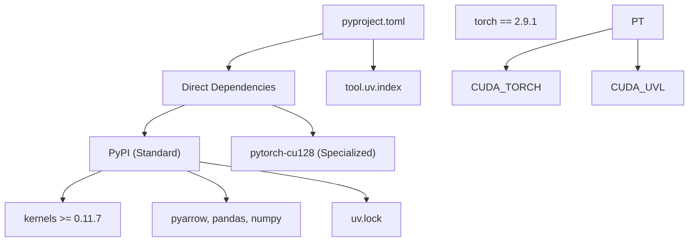
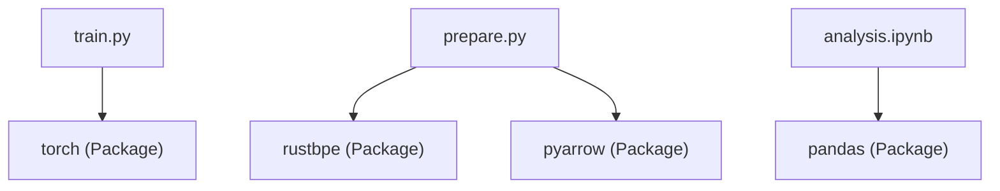

# Python 与依赖

相关源文件

-   [.python-version](https://github.com/karpathy/autoresearch/blob/e6d79c12/.python-version)
-   [pyproject.toml](https://github.com/karpathy/autoresearch/blob/e6d79c12/pyproject.toml)
-   [uv.lock](https://github.com/karpathy/autoresearch/blob/e6d79c12/uv.lock)

## 目的与范围

本页记录 `autoresearch` 的 Python 环境要求与依赖管理方式。内容涵盖 Python 3.10+ 约束、`pyproject.toml` 结构、依赖分类，以及 `uv` 包管理器如何执行确定性解析与锁定，包括专门的 PyTorch CUDA 12.8 要求。

---

## Python 版本要求

Autoresearch 要求 **Python 3.10 或更高版本**。该约束通过项目元数据与本地环境固定共同强制执行。

**pyproject.toml 规范：** 项目元数据明确给出支持的 Python 范围，以确保与结构化模式匹配、增强类型提示等现代特性兼容 [pyproject.toml6](https://github.com/karpathy/autoresearch/blob/e6d79c12/pyproject.toml#L6-L6)

**本地开发版本固定：** [.python-version1](https://github.com/karpathy/autoresearch/blob/e6d79c12/.python-version#L1-L1) 文件将本地开发环境固定为 Python 3.10。该文件被 `uv` 或 `pyenv` 等工具使用，以自动选择正确解释器。

3.10+ 要求的必要性包括：

-   兼容现代 PyTorch 2.9.1 [pyproject.toml16](https://github.com/karpathy/autoresearch/blob/e6d79c12/pyproject.toml#L16-L16)
-   高级类型特性（例如使用 `|` 的联合类型）。
-   `numpy` 2.2+ 与 `pandas` 3.0+ 等高性能数据处理库 [uv.lock51-54](https://github.com/karpathy/autoresearch/blob/e6d79c12/uv.lock#L51-L54)

来源： [pyproject.toml6](https://github.com/karpathy/autoresearch/blob/e6d79c12/pyproject.toml#L6-L6) [.python-version1](https://github.com/karpathy/autoresearch/blob/e6d79c12/.python-version#L1-L1) [uv.lock3](https://github.com/karpathy/autoresearch/blob/e6d79c12/uv.lock#L3-L3) [uv.lock51-54](https://github.com/karpathy/autoresearch/blob/e6d79c12/uv.lock#L51-L54)

---

## 项目配置结构

[pyproject.toml](https://github.com/karpathy/autoresearch/blob/e6d79c12/pyproject.toml) 文件遵循 PEP 518/621 标准。它将研究环境定义为自主智能体不可修改的固定基础设施。

### 依赖流与解析

下图说明 `pyproject.toml` 如何指导 `uv` 从标准索引与专用索引解析依赖。

**图示：依赖解析流程**

来源： [pyproject.toml1-28](https://github.com/karpathy/autoresearch/blob/e6d79c12/pyproject.toml#L1-L28) [uv.lock1-19](https://github.com/karpathy/autoresearch/blob/e6d79c12/uv.lock#L1-L19)

---

## 依赖分类

### 机器学习核心（固定基础设施）

| 包 | 版本 | 角色 |
| --- | --- | --- |
| `torch` | `2.9.1` | 主要深度学习框架。固定到 `cu128` 以支持 CUDA 12.8 [pyproject.toml16](https://github.com/karpathy/autoresearch/blob/e6d79c12/pyproject.toml#L16-L16) |
| `kernels` | `>=0.11.7` | `train.py` 使用的高优化 CUDA kernel [pyproject.toml8](https://github.com/karpathy/autoresearch/blob/e6d79c12/pyproject.toml#L8-L8) |
| `numpy` | `>=2.2.6` | 基础数值运算 [pyproject.toml10](https://github.com/karpathy/autoresearch/blob/e6d79c12/pyproject.toml#L10-L10) |

**PyTorch CUDA 配置：** 为确保智能体可使用最新性能优化，PyTorch 从专用索引拉取 [pyproject.toml19-27](https://github.com/karpathy/autoresearch/blob/e6d79c12/pyproject.toml#L19-L27)：

-   **索引名：** `pytorch-cu128`
-   **URL：** `https://download.pytorch.org/whl/cu128`
-   **约束：** `explicit = true`（防止其他包误用该索引）。

来源： [pyproject.toml8-27](https://github.com/karpathy/autoresearch/blob/e6d79c12/pyproject.toml#L8-L27) [uv.lock72-73](https://github.com/karpathy/autoresearch/blob/e6d79c12/uv.lock#L72-L73)

### 分词与数据流水线

| 包 | 版本 | 角色 |
| --- | --- | --- |
| `rustbpe` | `>=0.1.0` | `prepare.py` 使用的 Rust 分词器训练器 [pyproject.toml14](https://github.com/karpathy/autoresearch/blob/e6d79c12/pyproject.toml#L14-L14) |
| `tiktoken` | `>=0.11.0` | 高速推理时分词 [pyproject.toml15](https://github.com/karpathy/autoresearch/blob/e6d79c12/pyproject.toml#L15-L15) |
| `pyarrow` | `>=21.0.0` | 处理数据集的 Parquet 分片 [pyproject.toml12](https://github.com/karpathy/autoresearch/blob/e6d79c12/pyproject.toml#L12-L12) |
| `requests` | `>=2.32.0` | 下载原始数据分片 [pyproject.toml13](https://github.com/karpathy/autoresearch/blob/e6d79c12/pyproject.toml#L13-L13) |

来源： [pyproject.toml12-15](https://github.com/karpathy/autoresearch/blob/e6d79c12/pyproject.toml#L12-L15)

### 分析与跟踪

| 包 | 版本 | 角色 |
| --- | --- | --- |
| `pandas` | `>=2.3.3` | 处理 `results.tsv` 以进行实验跟踪 [pyproject.toml11](https://github.com/karpathy/autoresearch/blob/e6d79c12/pyproject.toml#L11-L11) |
| `matplotlib` | `>=3.10.8` | 生成 `progress.png`（通过 `analysis.ipynb`） [pyproject.toml9](https://github.com/karpathy/autoresearch/blob/e6d79c12/pyproject.toml#L9-L9) |

来源： [pyproject.toml9-11](https://github.com/karpathy/autoresearch/blob/e6d79c12/pyproject.toml#L9-L11)

---

## `uv` 包管理器与锁文件

Autoresearch 使用 `uv` 进行确定性环境管理。[uv.lock](https://github.com/karpathy/autoresearch/blob/e6d79c12/uv.lock) 文件确保每个研究智能体与人类开发者都在一致环境中工作。

### 锁文件实现细节

锁文件包含 `resolution-markers`，用于处理多平台支持与 Python 版本差异（例如为 Python 3.11 与 3.12+ 选择不同的 `numpy` 或 `pandas` 版本） [uv.lock4-19](https://github.com/karpathy/autoresearch/blob/e6d79c12/uv.lock#L4-L19)

**图示：代码实体到依赖映射**

来源： [uv.lock45-60](https://github.com/karpathy/autoresearch/blob/e6d79c12/uv.lock#L45-L60) [pyproject.toml7-17](https://github.com/karpathy/autoresearch/blob/e6d79c12/pyproject.toml#L7-L17)

### 关键 uv 操作

系统依赖 `uv` 维持可变研究代码（`train.py`）与不可变环境之间的边界。

| 操作 | 命令 | 效果 |
| --- | --- | --- |
| **同步** | `uv sync` | 从 `uv.lock` 安装精确版本。 |
| **执行** | `uv run <script>` | 在隔离且锁定的环境中运行脚本。 |
| **校验** | `uv lock --check` | 确保 `pyproject.toml` 与 `uv.lock` 保持同步。 |

`autoresearch` 包本身在锁文件中被视作“virtual”包，使其能够将自身本地源代码作为依赖进行管理 [uv.lock45-47](https://github.com/karpathy/autoresearch/blob/e6d79c12/uv.lock#L45-L47)

来源： [uv.lock45-73](https://github.com/karpathy/autoresearch/blob/e6d79c12/uv.lock#L45-L73)

---

## 依赖解析逻辑

解析过程会处理复杂的传递依赖。例如，`matplotlib` 会引入 `contourpy`、`cycler` 和 `fonttools`，而 `requests` 会引入 `certifi` 和 `charset-normalizer` [uv.lock76-95](https://github.com/karpathy/autoresearch/blob/e6d79c12/uv.lock#L76-L95)

### 平台细节

锁文件包含多种架构的哈希与 URL，确保系统可部署于：

-   `manylinux2014_x86_64`（标准 GPU 服务器） [uv.lock95](https://github.com/karpathy/autoresearch/blob/e6d79c12/uv.lock#L95-L95)
-   `macosx_10_9_universal2`（本地开发） [uv.lock90](https://github.com/karpathy/autoresearch/blob/e6d79c12/uv.lock#L90-L90)
-   `win_amd64`（Windows 环境） [uv.lock10](https://github.com/karpathy/autoresearch/blob/e6d79c12/uv.lock#L10-L10)

这种跨平台兼容性对“研究群体（research swarm）”概念至关重要，因为不同智能体可能运行在不同硬件上。

来源： [uv.lock4-19](https://github.com/karpathy/autoresearch/blob/e6d79c12/uv.lock#L4-L19) [uv.lock85-95](https://github.com/karpathy/autoresearch/blob/e6d79c12/uv.lock#L85-L95)
